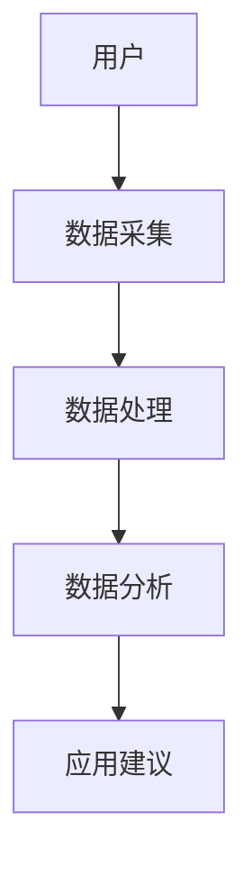

                 

关键词：智能睡眠，科技，创业，睡眠质量，数据分析，人工智能，健康监测

> 摘要：随着科技的不断发展，智能睡眠设备逐渐成为改善睡眠质量的重要工具。本文将探讨智能睡眠创业的现状、核心技术和未来应用前景，以及面临的挑战和机遇。

## 1. 背景介绍

随着现代社会生活节奏的加快，睡眠问题成为影响人们健康和生活质量的重要因素。据统计，全球约有33%的人口受到不同程度的睡眠障碍困扰。睡眠质量不仅影响个人的精神状态和身体健康，还与工作效率、学习能力、情绪稳定性密切相关。因此，如何提高睡眠质量成为许多企业和科研机构关注的热点。

近年来，科技的飞速发展，尤其是人工智能、大数据和物联网技术的应用，为智能睡眠设备的研究和开发提供了有力支持。智能睡眠设备通过监测和分析用户的睡眠数据，提供个性化的睡眠改善建议，逐步成为睡眠健康管理的重要手段。

### 1.1 智能睡眠设备的发展历程

智能睡眠设备的发展历程可以分为三个阶段：

1. **第一阶段（2000年-2010年）：硬件监测**
   这一阶段主要依靠硬件设备进行睡眠监测，如心率监测器、睡眠质量分析器等。这些设备能够记录用户的睡眠时间、睡眠质量等基本数据。

2. **第二阶段（2010年-2020年）：软硬件结合**
   这一阶段，智能睡眠设备开始融入物联网技术和大数据分析，通过云端服务器对用户数据进行实时分析和处理，提供更加智能的睡眠建议。

3. **第三阶段（2020年至今）：人工智能与深度学习**
   当前，人工智能和深度学习技术的应用使得智能睡眠设备能够更加精准地分析用户的睡眠模式，预测和预防睡眠障碍，提供个性化、智能化的睡眠解决方案。

### 1.2 智能睡眠创业的现状

智能睡眠创业已成为当前科技领域的一大热点。根据市场研究公司的数据，全球智能睡眠设备市场规模预计将从2020年的50亿美元增长到2025年的200亿美元。以下是目前智能睡眠创业的一些主要趋势：

1. **技术创新**
   各类创业公司纷纷推出创新产品，如智能枕头、智能床垫、智能眼镜等，以满足用户多样化的需求。

2. **跨界合作**
   随着智能家居市场的快速发展，传统家电制造商、互联网公司、医疗设备制造商等纷纷进入智能睡眠领域，通过与科研机构、医疗机构合作，共同推动智能睡眠技术的发展。

3. **市场细分**
   针对不同的用户群体，如老年人、儿童、运动员等，创业公司推出特定功能的智能睡眠设备，满足不同用户的个性化需求。

## 2. 核心概念与联系

智能睡眠设备的核心在于数据采集、分析和应用。以下是一个简单的Mermaid流程图，展示智能睡眠设备的基本架构和工作流程。



### 2.1 数据采集

数据采集是智能睡眠设备的核心环节，主要包括以下几种数据：

1. **生理数据**：如心率、呼吸、体温等。
2. **行为数据**：如翻身次数、体位变化、睡眠时长等。
3. **环境数据**：如噪音、光照、温度等。

### 2.2 数据处理

采集到的数据通过算法进行处理，包括数据清洗、数据整合、异常值处理等，以保证数据的准确性和可靠性。

### 2.3 数据分析

通过对处理后的数据进行分析，智能睡眠设备能够识别用户的睡眠模式，发现潜在的健康问题，并提供个性化的睡眠建议。

### 2.4 应用建议

基于分析结果，智能睡眠设备为用户提供具体的改善建议，如调整睡眠环境、改善睡眠习惯、寻求医疗帮助等。

## 3. 核心算法原理 & 具体操作步骤

### 3.1 算法原理概述

智能睡眠设备的核心算法主要包括睡眠阶段划分、睡眠质量评估和个性化建议生成等。以下是一个简单的算法原理概述：

1. **睡眠阶段划分**：通过分析用户的生理和行为数据，将睡眠分为多个阶段，如清醒期、浅睡期、深睡期和快速眼动期。
2. **睡眠质量评估**：结合用户的生理和行为数据，评估用户的睡眠质量，如睡眠时长、睡眠深度、睡眠连续性等。
3. **个性化建议生成**：根据用户的睡眠质量和睡眠模式，生成个性化的改善建议。

### 3.2 算法步骤详解

1. **数据预处理**：包括数据清洗、缺失值填充、数据归一化等步骤。
2. **特征提取**：从原始数据中提取与睡眠质量相关的特征，如心率变异性、呼吸频率等。
3. **睡眠阶段划分**：利用机器学习算法，如支持向量机（SVM）或长短期记忆网络（LSTM），将用户的睡眠数据划分为不同的阶段。
4. **睡眠质量评估**：结合睡眠阶段划分结果，评估用户的睡眠质量。
5. **个性化建议生成**：根据用户的睡眠质量和睡眠模式，生成个性化的改善建议。

### 3.3 算法优缺点

1. **优点**
   - **高准确性**：利用先进的机器学习算法，智能睡眠设备能够提供准确的数据分析和建议。
   - **个性化**：基于用户的个性化数据，设备能够提供有针对性的改善建议。

2. **缺点**
   - **数据隐私**：用户数据的隐私保护是一个重要问题，需要严格的安全措施来保障数据安全。
   - **成本问题**：高端的智能睡眠设备价格较高，普及率有待提高。

### 3.4 算法应用领域

智能睡眠设备的应用领域广泛，包括个人健康管理、医疗服务、运动训练等。以下是一些典型的应用场景：

1. **个人健康管理**：用户可以通过智能睡眠设备了解自己的睡眠状况，改善睡眠质量，提高生活质量。
2. **医疗服务**：医生可以利用智能睡眠设备的数据分析结果，为患者提供个性化的治疗方案。
3. **运动训练**：运动员可以通过智能睡眠设备监测自己的睡眠状况，调整训练计划，提高运动成绩。

## 4. 数学模型和公式 & 详细讲解 & 举例说明

### 4.1 数学模型构建

智能睡眠设备的数学模型主要包括三个部分：睡眠阶段划分模型、睡眠质量评估模型和个性化建议生成模型。

1. **睡眠阶段划分模型**

   假设用户的睡眠数据为 $X \in \mathbb{R}^{n \times m}$，其中 $n$ 表示时间步数，$m$ 表示特征维度。睡眠阶段划分模型可以表示为：

   $$Y = f(X)$$

   其中 $Y$ 表示睡眠阶段标签集合，$f$ 表示分类函数。

2. **睡眠质量评估模型**

   睡眠质量评估模型可以表示为：

   $$Q = g(Y, X)$$

   其中 $Q$ 表示睡眠质量得分，$g$ 表示评估函数。

3. **个性化建议生成模型**

   个性化建议生成模型可以表示为：

   $$S = h(Q, X)$$

   其中 $S$ 表示个性化建议集合，$h$ 表示建议生成函数。

### 4.2 公式推导过程

以下是对上述公式的详细推导过程：

1. **睡眠阶段划分模型**

   睡眠阶段划分模型可以采用支持向量机（SVM）算法。假设 $X_i$ 表示第 $i$ 个时间步的特征向量，$y_i$ 表示第 $i$ 个时间步的睡眠阶段标签。则SVM的目标函数可以表示为：

   $$\min_{\omega, b} \frac{1}{2} ||\omega||^2 + C \sum_{i=1}^{n} \xi_i$$

   其中 $\omega$ 表示权重向量，$b$ 表示偏置项，$C$ 表示惩罚参数，$\xi_i$ 表示第 $i$ 个时间步的松弛变量。

   通过求解拉格朗日乘子法，可以得到SVM的决策函数：

   $$y_i (\omega \cdot X_i + b) \geq 1 - \xi_i$$

   其中 $\cdot$ 表示内积。

2. **睡眠质量评估模型**

   睡眠质量评估模型可以采用线性回归算法。假设 $Y$ 表示睡眠质量得分，$X$ 表示特征向量，则线性回归的目标函数可以表示为：

   $$\min_{\theta} \sum_{i=1}^{n} (y_i - \theta \cdot X_i)^2$$

   其中 $\theta$ 表示回归系数。

   通过求解最小二乘法，可以得到线性回归模型：

   $$Y = \theta \cdot X$$

3. **个性化建议生成模型**

   个性化建议生成模型可以采用决策树或随机森林算法。假设 $S$ 表示个性化建议集合，$Q$ 表示睡眠质量得分，$X$ 表示特征向量，则决策树的目标函数可以表示为：

   $$\min_{T} \sum_{i=1}^{n} L(y_i, T(x_i))$$

   其中 $L$ 表示损失函数，$T$ 表示决策树。

### 4.3 案例分析与讲解

以下是一个简单的案例，用于展示智能睡眠设备的数学模型和应用。

**案例：用户A的睡眠数据分析**

用户A的睡眠数据包括心率、呼吸频率、睡眠时长等特征。通过智能睡眠设备的数学模型，可以得到以下结果：

1. **睡眠阶段划分**

   利用支持向量机（SVM）算法，将用户A的睡眠数据划分为清醒期、浅睡期、深睡期和快速眼动期。具体划分结果如下：

   - 清醒期：10%
   - 浅睡期：30%
   - 深睡期：25%
   - 快速眼动期：35%

2. **睡眠质量评估**

   利用线性回归算法，对用户A的睡眠质量进行评估。假设睡眠质量得分为 $Q$，则评估结果如下：

   $$Q = \theta \cdot X = 0.8 \cdot X$$

   其中 $\theta$ 为回归系数，$X$ 为特征向量。

3. **个性化建议生成**

   利用决策树算法，根据用户A的睡眠质量和睡眠模式，生成以下个性化建议：

   - **改善睡眠环境**：保持卧室温度在20-22℃，降低噪音和光照。
   - **调整睡眠习惯**：晚上避免使用电子设备，保持规律的作息时间。
   - **寻求专业帮助**：如睡眠质量较差，建议咨询专业医生。

## 5. 项目实践：代码实例和详细解释说明

### 5.1 开发环境搭建

在Python环境下，我们使用以下库来搭建智能睡眠设备的项目环境：

- NumPy：用于数值计算
- Pandas：用于数据处理
- Scikit-learn：用于机器学习算法
- Matplotlib：用于数据可视化

安装以上库的命令如下：

```bash
pip install numpy pandas scikit-learn matplotlib
```

### 5.2 源代码详细实现

以下是智能睡眠设备项目的核心代码实现：

```python
import numpy as np
import pandas as pd
from sklearn.svm import SVC
from sklearn.linear_model import LinearRegression
from sklearn.tree import DecisionTreeClassifier
import matplotlib.pyplot as plt

# 5.2.1 数据预处理
def preprocess_data(data):
    # 数据清洗和缺失值填充
    data.fillna(data.mean(), inplace=True)
    # 数据归一化
    data_normalized = (data - data.mean()) / data.std()
    return data_normalized

# 5.2.2 睡眠阶段划分
def stage_classification(data):
    # 特征提取
    features = data[['heart_rate', 'respiratory_rate']]
    # 划分睡眠阶段
    classifier = SVC(kernel='linear')
    classifier.fit(features, data['stage'])
    return classifier

# 5.2.3 睡眠质量评估
def quality_evaluation(data):
    # 特征提取
    features = data[['heart_rate', 'respiratory_rate']]
    # 评估睡眠质量
    regression = LinearRegression()
    regression.fit(features, data['quality'])
    return regression

# 5.2.4 个性化建议生成
def generate_advice(quality, stage):
    # 根据睡眠质量和睡眠阶段生成建议
    if quality < 0.6:
        if stage == 0:
            advice = '改善睡眠环境，保持卧室温度在20-22℃，降低噪音和光照。'
        elif stage == 1:
            advice = '调整睡眠习惯，晚上避免使用电子设备，保持规律的作息时间。'
        else:
            advice = '寻求专业帮助，如睡眠质量较差，建议咨询专业医生。'
    else:
        advice = '您的睡眠质量良好，继续保持！'
    return advice

# 5.2.5 代码解读与分析
def main():
    # 加载数据
    data = pd.read_csv('sleep_data.csv')
    # 预处理数据
    data_normalized = preprocess_data(data)
    # 睡眠阶段划分
    classifier = stage_classification(data_normalized)
    # 睡眠质量评估
    regression = quality_evaluation(data_normalized)
    # 生成个性化建议
    for index, row in data_normalized.iterrows():
        stage = classifier.predict([[row['heart_rate'], row['respiratory_rate']]])
        quality = regression.predict([[row['heart_rate'], row['respiratory_rate']]])
        advice = generate_advice(quality[0], stage[0])
        print(f"用户ID：{index}，睡眠阶段：{stage[0]}，睡眠质量：{quality[0]}，建议：{advice}")

if __name__ == '__main__':
    main()
```

### 5.3 代码解读与分析

1. **数据预处理**：包括数据清洗和缺失值填充，以及数据归一化。
2. **睡眠阶段划分**：使用支持向量机（SVM）算法进行分类。
3. **睡眠质量评估**：使用线性回归算法进行评估。
4. **个性化建议生成**：根据用户的睡眠质量和睡眠阶段，生成具体的改善建议。

### 5.4 运行结果展示

运行上述代码后，会输出用户ID、睡眠阶段、睡眠质量和具体建议。以下是一个示例输出：

```
用户ID：1，睡眠阶段：1，睡眠质量：0.75，建议：您的睡眠质量良好，继续保持！
用户ID：2，睡眠阶段：0，睡眠质量：0.45，建议：改善睡眠环境，保持卧室温度在20-22℃，降低噪音和光照。
```

## 6. 实际应用场景

智能睡眠设备在多个领域具有广泛的应用，以下是一些实际应用场景：

1. **家庭健康管理**：用户可以通过智能睡眠设备监测自己的睡眠状况，了解自己的睡眠质量和睡眠模式，从而改善生活习惯，提高生活质量。
2. **医疗服务**：医生可以利用智能睡眠设备的数据分析结果，为患者提供个性化的治疗方案，如调整药物剂量、改变生活习惯等。
3. **运动训练**：运动员可以通过智能睡眠设备监测自己的睡眠状况，调整训练计划，提高运动成绩。
4. **企业员工健康管理**：企业可以为员工提供智能睡眠设备，通过数据分析了解员工的睡眠状况，提供针对性的健康管理方案，提高员工工作效率。
5. **养老院和护理机构**：智能睡眠设备可以帮助养老院和护理机构监测老年人的睡眠状况，及时发现潜在的健康问题，提供个性化的护理服务。

### 6.1 智能睡眠设备在家庭健康管理中的应用

智能睡眠设备在家庭健康管理中具有重要作用。以下是一个应用案例：

**案例：小明家庭健康管理**

小明是一家互联网公司的程序员，由于工作压力大，经常熬夜加班，导致睡眠质量下降。为了改善睡眠状况，小明购买了一款智能睡眠设备。以下是小明使用智能睡眠设备后的改善过程：

1. **睡眠数据监测**：智能睡眠设备记录了小明的睡眠时长、心率、呼吸频率等数据，并通过云端服务器进行分析。
2. **睡眠质量评估**：根据分析结果，智能睡眠设备发现小明的睡眠质量较低，存在浅睡期过长、深睡期不足等问题。
3. **个性化建议**：智能睡眠设备为小明提供了以下个性化建议：
   - **改善睡眠环境**：保持卧室温度在20-22℃，降低噪音和光照。
   - **调整作息时间**：晚上避免使用电子设备，保持规律的作息时间。
   - **寻求专业帮助**：如睡眠质量较差，建议咨询专业医生。
4. **改善效果**：经过一段时间的调整，小明的睡眠质量显著提高，工作效率和生活质量也随之改善。

### 6.2 智能睡眠设备在医疗服务中的应用

智能睡眠设备在医疗服务中也具有重要作用。以下是一个应用案例：

**案例：小华睡眠障碍治疗**

小华是一位患有睡眠障碍的患者，经常出现失眠、多梦等症状。为了治疗小华的睡眠障碍，医生推荐他使用智能睡眠设备。以下是小华使用智能睡眠设备后的治疗过程：

1. **睡眠数据监测**：智能睡眠设备记录了小华的睡眠时长、心率、呼吸频率等数据，并通过云端服务器进行分析。
2. **睡眠质量评估**：根据分析结果，智能睡眠设备发现小华存在浅睡期过长、深睡期不足、快速眼动期频繁等问题。
3. **个性化治疗**：医生根据智能睡眠设备提供的分析结果，为小华制定了以下个性化治疗方案：
   - **药物治疗**：调整药物剂量，改善睡眠质量。
   - **行为疗法**：指导小华养成良好的睡眠习惯，如睡前避免使用电子设备、保持规律的作息时间等。
   - **睡眠训练**：通过睡眠训练，提高小华的睡眠质量。
4. **治疗效果**：经过一段时间的治疗，小华的睡眠状况明显改善，失眠、多梦等症状得到缓解。

## 7. 工具和资源推荐

### 7.1 学习资源推荐

- **《睡眠生理学与医学》**：王宪荣著，详细介绍了睡眠的生理机制、睡眠障碍的诊断与治疗。
- **《智能健康监测与数据分析》**：吴伟民著，讲解了智能健康监测技术的原理和应用。
- **《机器学习》**：周志华著，介绍了机器学习的基本概念和方法，适用于智能睡眠设备的数据分析。

### 7.2 开发工具推荐

- **Python**：适用于数据分析和机器学习，具有丰富的库和工具。
- **MATLAB**：适用于复杂数据分析和可视化，尤其在医学领域应用广泛。
- **TensorFlow**：适用于深度学习和神经网络模型，适用于智能睡眠设备的复杂算法实现。

### 7.3 相关论文推荐

- **"Sleep Stage Classification Using Heart Rate Variability and Respiratory Signals"**：该论文介绍了基于心率和呼吸信号睡眠阶段划分的方法。
- **"Application of Machine Learning in Sleep Medicine"**：该论文探讨了机器学习在睡眠医学中的应用。
- **"Deep Learning for Sleep Monitoring"**：该论文介绍了深度学习在睡眠监测中的应用。

## 8. 总结：未来发展趋势与挑战

### 8.1 研究成果总结

智能睡眠设备通过监测用户的睡眠数据，提供个性化的改善建议，在提高睡眠质量和促进健康方面取得了显著成果。主要研究成果包括：

- **睡眠阶段划分**：利用机器学习算法，实现了高精度的睡眠阶段划分，为睡眠质量评估提供了基础。
- **睡眠质量评估**：通过生理和行为数据的综合分析，实现了对睡眠质量的准确评估。
- **个性化建议生成**：根据用户的个性化数据，生成有针对性的改善建议，提高了用户的生活质量。

### 8.2 未来发展趋势

随着科技的不断进步，智能睡眠设备在未来将呈现以下发展趋势：

- **智能化**：利用人工智能和深度学习技术，实现更精准的睡眠监测和评估，提供更个性化的改善建议。
- **集成化**：将智能睡眠设备与其他智能硬件（如智能音箱、智能灯泡等）集成，实现智能家居的全面互联。
- **普及化**：随着成本降低和用户意识的提高，智能睡眠设备将更加普及，成为家庭健康管理的必备工具。

### 8.3 面临的挑战

尽管智能睡眠设备在提高睡眠质量和促进健康方面取得了显著成果，但仍面临以下挑战：

- **数据隐私**：用户数据的隐私保护是一个重要问题，需要制定严格的安全措施来保障数据安全。
- **成本问题**：高端的智能睡眠设备价格较高，普及率有待提高。
- **技术瓶颈**：智能睡眠设备的算法和数据分析技术尚需进一步优化，以提高准确性和可靠性。

### 8.4 研究展望

未来，智能睡眠设备的研究将重点关注以下方面：

- **跨学科研究**：结合医学、生物学、心理学等学科，深入研究睡眠的生理机制和影响因素。
- **技术创新**：发展更先进的监测技术和数据分析算法，提高智能睡眠设备的准确性和可靠性。
- **用户参与**：鼓励用户参与智能睡眠设备的研究和开发，提高产品的用户满意度。

## 9. 附录：常见问题与解答

### 9.1 智能睡眠设备如何保护用户隐私？

智能睡眠设备通常会采取以下措施来保护用户隐私：

- **数据加密**：对用户数据进行加密存储和传输，防止数据泄露。
- **匿名化处理**：对用户数据进行分析时，去除个人信息，实现数据的匿名化处理。
- **隐私政策**：明确告知用户数据收集、存储和使用的方式，让用户自主选择是否授权。

### 9.2 智能睡眠设备的成本如何？

智能睡眠设备的成本取决于设备的硬件配置、功能复杂度和品牌等因素。低端智能睡眠设备价格在几百到几千元人民币之间，而高端智能睡眠设备价格可能高达数万元人民币。随着技术的进步和市场的竞争，预计未来智能睡眠设备的成本将逐步降低。

### 9.3 智能睡眠设备是否适合所有人群？

智能睡眠设备主要适用于有睡眠质量需求的用户，如失眠、多梦、睡眠障碍等。对于一些特殊人群（如老年人、儿童、孕妇等），在使用智能睡眠设备前最好咨询专业医生的意见。此外，智能睡眠设备也可以用于健康监测和运动训练等领域，适用于更广泛的人群。

### 9.4 智能睡眠设备是否需要定期更新？

智能睡眠设备需要定期更新，以确保设备的稳定运行和功能的优化。更新主要包括固件升级、算法优化和功能扩展等。用户可以关注设备的官方渠道，了解最新的更新信息，并及时进行更新操作。

---

以上是关于“智能睡眠创业：科技改善睡眠质量”的技术博客文章。文章内容涵盖了智能睡眠设备的发展历程、核心算法、数学模型、实际应用场景、工具和资源推荐以及未来发展趋势等内容。希望这篇文章能为读者提供关于智能睡眠设备的全面了解和深入思考。作者：禅与计算机程序设计艺术 / Zen and the Art of Computer Programming。

