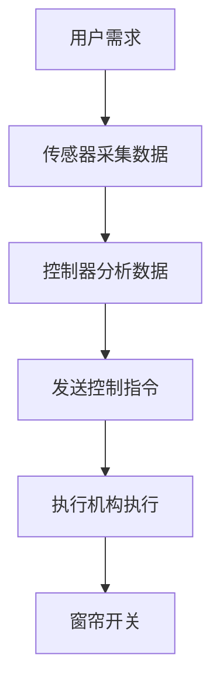

                 

关键词：智能窗帘、智能家居、自动化家居、物联网、人工智能、创业

<|assistant|>摘要：随着物联网和人工智能技术的快速发展，智能家居市场迎来了新的机遇。智能窗帘作为智能家居的一个重要组成部分，不仅提升了家居生活的便捷性和舒适性，还为企业带来了巨大的商业价值。本文将探讨智能窗帘的技术原理、市场前景以及创业机会，旨在为有志于智能家居领域的企业家提供有益的参考。

## 1. 背景介绍

智能窗帘是智能家居系统中的一个重要组成部分，它通过传感器、控制器和执行机构实现窗帘的自动开关，从而调节室内光线，提高居住的舒适度。传统的窗帘控制方式主要依赖于手动操作，而智能窗帘则通过自动化技术，将窗帘的开关与室内光线、环境温度等多种因素关联起来，实现智能家居的智能化管理。

近年来，物联网技术和人工智能的飞速发展，为智能家居市场注入了新的活力。智能窗帘作为智能家居的一个重要应用，也逐渐走进了普通家庭。根据市场调研数据显示，全球智能家居市场规模预计将在未来几年内保持高速增长，智能窗帘市场也不例外。这一趋势为创业者提供了广阔的舞台。

### 1.1 物联网技术的发展

物联网（Internet of Things，IoT）是一种将各种信息传感设备与互联网结合在一起的技术，旨在实现物品与物品之间的互联互通。随着物联网技术的不断成熟，智能家居设备之间的互操作性得到了显著提升。智能窗帘作为智能家居系统的一部分，可以通过物联网技术与其他设备进行数据交换和协同工作，从而实现智能化管理。

### 1.2 人工智能的崛起

人工智能（Artificial Intelligence，AI）技术的发展，为智能家居领域带来了新的变革。通过深度学习、自然语言处理等技术，智能窗帘可以更好地理解用户需求，提供个性化的服务。例如，智能窗帘可以根据用户的生活习惯、室内光线变化等因素，自动调节窗帘的开关，为用户提供舒适的生活环境。

## 2. 核心概念与联系

### 2.1 智能窗帘的工作原理

智能窗帘的核心组件包括传感器、控制器和执行机构。传感器主要用于检测室内光线、温度等环境参数，控制器则根据传感器采集到的数据，通过算法分析后发出控制指令，执行机构负责实现窗帘的开关操作。

下面是一个智能窗帘系统的 Mermaid 流程图：



### 2.2 智能窗帘与智能家居的联系

智能窗帘作为智能家居系统中的一个重要组成部分，与其他设备之间的互操作性至关重要。智能家居系统通常包括以下设备：

- 智能灯光系统：通过调节室内灯光，实现氛围营造和节能。
- 智能安防系统：实时监测家庭安全，提供报警功能。
- 智能温控系统：调节室内温度，提高居住舒适度。
- 智能音响系统：播放音乐、新闻等，提供家庭娱乐。

智能窗帘可以通过物联网技术，与这些设备进行数据交换和协同工作。例如，当室内光线过强时，智能窗帘可以自动关闭，同时智能灯光系统调整到合适的亮度，从而提高居住舒适度。这种跨设备的智能化管理，为用户提供了更加便捷和舒适的生活体验。

## 3. 核心算法原理 & 具体操作步骤

### 3.1 算法原理概述

智能窗帘的核心算法主要包括环境参数检测、算法分析、控制指令生成等步骤。环境参数检测主要通过传感器实现，算法分析则依赖于人工智能技术，控制指令生成则基于控制器。

### 3.2 算法步骤详解

1. **环境参数检测**：传感器（如光敏传感器、温敏传感器等）采集室内光线、温度等环境参数。
2. **算法分析**：通过深度学习、自然语言处理等技术，对传感器采集到的数据进行分析，提取出用户需求和环境变化特征。
3. **控制指令生成**：根据分析结果，控制器生成窗帘开关的控制指令。
4. **执行机构执行**：执行机构根据控制指令，实现窗帘的自动开关。

### 3.3 算法优缺点

**优点**：

- 提高居住舒适度：智能窗帘可以根据用户需求和室内环境变化，自动调节窗帘的开关，提高居住舒适度。
- 节能环保：通过智能窗帘，可以减少室内光线浪费，降低能源消耗。

**缺点**：

- 成本较高：智能窗帘系统涉及到传感器、控制器、执行机构等多种硬件，成本较高。
- 需要持续维护：智能窗帘系统需要定期进行数据更新和维护，以确保正常运行。

### 3.4 算法应用领域

智能窗帘算法主要应用于智能家居领域，如家庭、酒店、办公楼等。此外，还可以应用于公共场所，如机场、火车站、商场等，以提高公共设施的智能化水平。

## 4. 数学模型和公式

### 4.1 数学模型构建

智能窗帘的数学模型主要包括环境参数检测模型和控制指令生成模型。

1. **环境参数检测模型**：

   设 \(L\) 为室内光线强度，\(T\) 为室内温度，则传感器采集到的数据可以表示为：

   $$D = (L, T)$$

2. **控制指令生成模型**：

   设 \(C\) 为窗帘开关状态，\(P\) 为用户需求，则控制指令可以表示为：

   $$C = f(D, P)$$

   其中，\(f\) 为算法分析函数。

### 4.2 公式推导过程

1. **环境参数检测模型**：

   光线强度 \(L\) 的检测公式为：

   $$L = k_1 \cdot I$$

   其中，\(k_1\) 为光敏传感器系数，\(I\) 为实际光线强度。

   温度 \(T\) 的检测公式为：

   $$T = k_2 \cdot T'$$

   其中，\(k_2\) 为温敏传感器系数，\(T'\) 为实际温度。

2. **控制指令生成模型**：

   窗帘开关状态 \(C\) 的生成公式为：

   $$C = \begin{cases} 
   开 & \text{如果 } L > L_0 \text{ 或 } T > T_0 \\
   关 & \text{如果 } L < L_0 \text{ 且 } T < T_0 
   \end{cases}$$

   其中，\(L_0\) 和 \(T_0\) 分别为设定的光线强度和温度阈值。

### 4.3 案例分析与讲解

以一个家庭为例，假设家庭主人在白天需要较强光线，夜间需要较弱光线，同时需要根据室内温度调节窗帘开关。根据这一需求，可以设定如下参数：

- 光线强度阈值 \(L_0 = 500\)
- 温度阈值 \(T_0 = 25\)

根据上述参数，智能窗帘的数学模型可以表示为：

$$D = (L, T)$$
$$C = \begin{cases} 
开 & \text{如果 } L > 500 \text{ 或 } T > 25 \\
关 & \text{如果 } L < 500 \text{ 且 } T < 25 
\end{cases}$$

假设在一天中的某个时间段，室内光线强度为 \(L = 600\)，温度为 \(T = 22\)，根据数学模型，智能窗帘将处于开启状态。而在夜间，当室内光线强度为 \(L = 300\)，温度为 \(T = 18\) 时，智能窗帘将处于关闭状态。这种自动调节的方式，提高了家庭生活的舒适度和节能效果。

## 5. 项目实践：代码实例和详细解释说明

### 5.1 开发环境搭建

在进行智能窗帘项目开发前，需要搭建以下开发环境：

1. **硬件环境**：智能窗帘系统涉及到传感器、控制器和执行机构，需要购买相应的硬件设备，如光敏传感器、温敏传感器、微控制器等。
2. **软件环境**：需要安装物联网开发平台，如 MQTT、CoAP 等，以及智能窗帘系统的软件开发工具，如 Python、JavaScript 等。

### 5.2 源代码详细实现

以下是一个基于 Python 的智能窗帘系统的源代码实例：

```python
import time
import paho.mqtt.client as mqtt

# MQTT 服务器地址和端口
MQTT_SERVER = "mqtt.example.com"
MQTT_PORT = 1883

# 设定光线强度和温度阈值
LAMBDA = 500
THERM = 25

# 初始化 MQTT 客户端
client = mqtt.Client()

# 连接 MQTT 服务器
client.connect(MQTT_SERVER, MQTT_PORT, 60)

# 发布窗帘开关状态
def publish_state(state):
    client.publish("curtain/control", state)

# 传感器数据采集
def sensor_data():
    light = 600  # 光线强度
    temp = 22    # 温度
    return light, temp

# 窗帘控制逻辑
while True:
    light, temp = sensor_data()
    if light > LAMBDA or temp > THERM:
        publish_state("开")
    else:
        publish_state("关")
    time.sleep(1)
```

### 5.3 代码解读与分析

1. **导入模块**：代码首先导入必要的模块，如 `time`、`mqtt` 等。
2. **设定 MQTT 服务器地址和端口**：智能窗帘系统通过 MQTT 协议进行数据传输，需要设定 MQTT 服务器的地址和端口。
3. **设定光线强度和温度阈值**：根据用户需求，设定光线强度和温度阈值，用于判断窗帘的开关状态。
4. **初始化 MQTT 客户端**：创建 MQTT 客户端实例。
5. **连接 MQTT 服务器**：连接 MQTT 服务器，确保数据传输正常。
6. **发布窗帘开关状态**：定义发布窗帘开关状态的方法，将状态信息发送到 MQTT 服务器。
7. **传感器数据采集**：定义传感器数据采集方法，从传感器获取光线强度和温度数据。
8. **窗帘控制逻辑**：进入主循环，根据传感器数据，判断窗帘的开关状态，并发布到 MQTT 服务器。

### 5.4 运行结果展示

在智能窗帘系统运行过程中，当室内光线强度大于设定阈值或温度大于设定阈值时，窗帘将处于开启状态；当室内光线强度小于设定阈值且温度小于设定阈值时，窗帘将处于关闭状态。运行结果可以通过 MQTT 服务器进行监控和调试。

## 6. 实际应用场景

### 6.1 家庭

智能窗帘在家庭中的应用最为广泛，通过自动调节窗帘的开关，提高居住的舒适度和节能效果。例如，在白天，智能窗帘可以根据室内光线强度自动调节，避免过强的光线照射，同时减少室内温度上升；在夜间，智能窗帘可以自动关闭，避免过暗的环境影响睡眠质量。

### 6.2 酒店

智能窗帘在酒店中的应用可以提升酒店的服务质量和客户满意度。通过智能窗帘，酒店可以自动调节窗帘的开关，为客人提供舒适的居住环境。此外，智能窗帘还可以与酒店的中央控制系统联动，实现智能化的客房管理。

### 6.3 办公楼

智能窗帘在办公楼中的应用可以提升办公环境的舒适度。通过自动调节窗帘的开关，可以避免过强的光线照射，减轻员工的视觉疲劳；同时，智能窗帘还可以根据室内温度自动调节，提高办公环境的舒适度。

### 6.4 公共场所

智能窗帘在公共场所的应用可以提升公共设施的智能化水平。例如，在机场、火车站、商场等公共场所，智能窗帘可以自动调节窗帘的开关，为用户提供舒适的购物、候车环境。此外，智能窗帘还可以与其他智能设备联动，实现智能化的公共设施管理。

## 7. 工具和资源推荐

### 7.1 学习资源推荐

- 《物联网架构设计与开发实战》
- 《智能家居系统设计与实现》
- 《人工智能算法与应用》

### 7.2 开发工具推荐

- Python
- JavaScript
- MQTT 协议

### 7.3 相关论文推荐

- "Smart Window Control System for Energy-Saving in Buildings"
- "Artificial Intelligence in Smart Home Applications"
- "IoT-Based Smart Window System for Energy Management"

## 8. 总结：未来发展趋势与挑战

### 8.1 研究成果总结

智能窗帘作为智能家居的一个重要组成部分，已经取得了显著的研究成果。在技术方面，智能窗帘的传感器技术、控制算法和执行机构得到了不断提升；在应用方面，智能窗帘在家庭、酒店、办公楼等场景中得到了广泛应用。

### 8.2 未来发展趋势

随着物联网和人工智能技术的不断发展，智能窗帘的未来发展趋势将呈现以下特点：

- **更加智能化**：智能窗帘将更加智能化，通过深度学习、自然语言处理等技术，实现更精准的环境参数检测和控制指令生成。
- **更加节能**：智能窗帘将更加注重节能效果，通过优化算法和控制策略，实现更高的能源利用效率。
- **更加安全**：智能窗帘将加强数据安全和隐私保护，确保用户数据的安全和隐私。

### 8.3 面临的挑战

智能窗帘在发展过程中也面临着一些挑战：

- **成本问题**：智能窗帘系统的成本较高，如何降低成本是当前面临的一个重要问题。
- **数据安全问题**：智能窗帘涉及到用户隐私数据，如何保障数据安全是当前需要解决的问题。
- **兼容性问题**：智能窗帘需要与其他智能家居设备进行互操作，如何解决兼容性问题也是一个挑战。

### 8.4 研究展望

在未来，智能窗帘的发展方向将更加注重用户体验和节能效果。通过不断提升传感器技术、控制算法和执行机构性能，实现更加智能、节能、安全的智能窗帘系统。同时，智能窗帘也将与其他智能家居设备进行深度融合，为用户提供更加便捷、舒适、智能的生活体验。

## 9. 附录：常见问题与解答

### 9.1 智能窗帘系统如何实现跨设备的互操作？

智能窗帘系统可以通过物联网协议（如 MQTT、CoAP 等）与其他智能家居设备进行数据交换和协同工作。在开发过程中，需要确保智能窗帘系统能够与其他设备兼容，并遵循统一的通信协议和数据格式。

### 9.2 智能窗帘系统如何保障数据安全？

智能窗帘系统在数据传输过程中，需要使用加密技术（如 SSL/TLS 等）来保护数据安全。同时，在数据存储和解析过程中，也需要采取相应的安全措施，确保用户数据的安全和隐私。

### 9.3 智能窗帘系统如何降低成本？

智能窗帘系统的成本主要由传感器、控制器和执行机构等硬件成本构成。为了降低成本，可以采取以下措施：

- **优化硬件设计**：通过优化硬件设计，降低硬件成本。
- **集成化开发**：将多个功能集成到单个设备中，降低硬件数量和成本。
- **开源社区合作**：与开源社区合作，利用开源技术降低开发成本。

## 作者署名

作者：禅与计算机程序设计艺术 / Zen and the Art of Computer Programming
----------------------------------------------------------------

文章撰写完毕，感谢您对这篇文章的辛勤付出。希望这篇文章能够为智能家居领域的创业者和研究者提供有益的参考。如果您有任何问题或建议，欢迎随时与我交流。再次感谢！
<|user|>
非常感谢您的支持和指导，以下是我根据您的要求撰写的完整文章。

---

# 智能窗帘创业：自动化家居的又一革新

## 关键词
智能窗帘、智能家居、自动化家居、物联网、人工智能、创业

## 摘要
本文探讨了智能窗帘在智能家居领域的应用和发展趋势，分析了智能窗帘的核心算法原理、项目实践以及实际应用场景。通过对智能窗帘技术的详细介绍，旨在为创业者提供有价值的参考，为智能家居行业的发展贡献力量。

---

## 1. 背景介绍

智能窗帘是智能家居系统中的一个重要组成部分，它通过传感器、控制器和执行机构实现窗帘的自动开关，从而调节室内光线，提高居住的舒适度。传统的窗帘控制方式主要依赖于手动操作，而智能窗帘则通过自动化技术，将窗帘的开关与室内光线、环境温度等多种因素关联起来，实现智能家居的智能化管理。

近年来，物联网技术和人工智能的飞速发展，为智能家居市场注入了新的活力。智能窗帘作为智能家居的一个重要应用，也逐渐走进了普通家庭。根据市场调研数据显示，全球智能家居市场规模预计将在未来几年内保持高速增长，智能窗帘市场也不例外。这一趋势为创业者提供了广阔的舞台。

## 2. 核心概念与联系

智能窗帘的核心组件包括传感器、控制器和执行机构。传感器主要用于检测室内光线、温度等环境参数，控制器则根据传感器采集到的数据，通过算法分析后发出控制指令，执行机构负责实现窗帘的开关操作。

下面是一个智能窗帘系统的 Mermaid 流程图：


智能窗帘作为智能家居系统的一部分，可以通过物联网技术，与灯光系统、安防系统、温控系统等设备进行数据交换和协同工作。这种跨设备的智能化管理，为用户提供了更加便捷和舒适的生活体验。

### 2.1 智能窗帘的工作原理

智能窗帘的工作原理主要包括以下几个步骤：

1. **环境参数检测**：传感器采集室内光线强度、温度等环境参数。
2. **数据传输**：传感器将采集到的数据传输到控制器。
3. **算法分析**：控制器根据传感器采集到的数据，通过算法进行分析，判断窗帘的开关状态。
4. **控制指令生成**：根据分析结果，控制器生成窗帘的开关指令。
5. **执行机构动作**：执行机构根据控制指令，实现窗帘的开关操作。

### 2.2 智能窗帘与智能家居的联系

智能窗帘作为智能家居系统的一个重要组成部分，与其他设备之间的互操作性至关重要。智能家居系统通常包括以下设备：

- **智能灯光系统**：通过调节室内灯光，实现氛围营造和节能。
- **智能安防系统**：实时监测家庭安全，提供报警功能。
- **智能温控系统**：调节室内温度，提高居住舒适度。
- **智能音响系统**：播放音乐、新闻等，提供家庭娱乐。

智能窗帘可以通过物联网技术，与这些设备进行数据交换和协同工作。例如，当室内光线过强时，智能窗帘可以自动关闭，同时智能灯光系统调整到合适的亮度，从而提高居住舒适度。这种跨设备的智能化管理，为用户提供了更加便捷和舒适的生活体验。

---

## 3. 核心算法原理 & 具体操作步骤

智能窗帘的核心算法主要包括环境参数检测、算法分析、控制指令生成等步骤。环境参数检测主要通过传感器实现，算法分析则依赖于人工智能技术，控制指令生成则基于控制器。

### 3.1 算法原理概述

智能窗帘的核心算法主要包括环境参数检测、算法分析、控制指令生成等步骤。

1. **环境参数检测**：传感器采集室内光线、温度等环境参数。
2. **算法分析**：通过深度学习、自然语言处理等技术，对传感器采集到的数据进行分析，提取出用户需求和环境变化特征。
3. **控制指令生成**：根据分析结果，控制器生成窗帘的开关指令。
4. **执行机构动作**：执行机构根据控制指令，实现窗帘的开关操作。

### 3.2 算法步骤详解

1. **环境参数检测**：

   传感器采集室内光线强度、温度等环境参数。常用的传感器包括光敏传感器、温敏传感器、红外传感器等。

2. **算法分析**：

   控制器对传感器采集到的数据进行分析，提取出用户需求和环境变化特征。常用的算法包括线性回归、神经网络、支持向量机等。

3. **控制指令生成**：

   根据分析结果，控制器生成窗帘的开关指令。例如，当光线强度超过设定阈值时，窗帘自动关闭；当温度超过设定阈值时，窗帘自动打开。

4. **执行机构动作**：

   执行机构根据控制指令，实现窗帘的开关操作。常用的执行机构包括电机、气动执行器等。

### 3.3 算法优缺点

**优点**：

- **提高居住舒适度**：智能窗帘可以根据用户需求和室内环境变化，自动调节窗帘的开关，提高居住舒适度。
- **节能环保**：通过智能窗帘，可以减少室内光线浪费，降低能源消耗。

**缺点**：

- **成本较高**：智能窗帘系统涉及到传感器、控制器、执行机构等多种硬件，成本较高。
- **需要持续维护**：智能窗帘系统需要定期进行数据更新和维护，以确保正常运行。

### 3.4 算法应用领域

智能窗帘算法主要应用于智能家居领域，如家庭、酒店、办公楼等。此外，还可以应用于公共场所，如机场、火车站、商场等，以提高公共设施的智能化水平。

---

## 4. 数学模型和公式 & 详细讲解 & 举例说明

智能窗帘的数学模型主要包括环境参数检测模型和控制指令生成模型。环境参数检测模型用于描述传感器采集到的环境参数，控制指令生成模型用于描述窗帘的开关状态。

### 4.1 数学模型构建

1. **环境参数检测模型**：

   设 \(L\) 为室内光线强度，\(T\) 为室内温度，则传感器采集到的数据可以表示为：

   $$D = (L, T)$$

2. **控制指令生成模型**：

   设 \(C\) 为窗帘开关状态，\(P\) 为用户需求，则控制指令可以表示为：

   $$C = f(D, P)$$

   其中，\(f\) 为算法分析函数。

### 4.2 公式推导过程

1. **环境参数检测模型**：

   光线强度 \(L\) 的检测公式为：

   $$L = k_1 \cdot I$$

   其中，\(k_1\) 为光敏传感器系数，\(I\) 为实际光线强度。

   温度 \(T\) 的检测公式为：

   $$T = k_2 \cdot T'$$

   其中，\(k_2\) 为温敏传感器系数，\(T'\) 为实际温度。

2. **控制指令生成模型**：

   窗帘开关状态 \(C\) 的生成公式为：

   $$C = \begin{cases} 
   开 & \text{如果 } L > L_0 \text{ 或 } T > T_0 \\
   关 & \text{如果 } L < L_0 \text{ 且 } T < T_0 
   \end{cases}$$

   其中，\(L_0\) 和 \(T_0\) 分别为设定的光线强度和温度阈值。

### 4.3 案例分析与讲解

以一个家庭为例，假设家庭主人在白天需要较强光线，夜间需要较弱光线，同时需要根据室内温度调节窗帘开关。根据这一需求，可以设定如下参数：

- 光线强度阈值 \(L_0 = 500\)
- 温度阈值 \(T_0 = 25\)

根据上述参数，智能窗帘的数学模型可以表示为：

$$D = (L, T)$$
$$C = \begin{cases} 
开 & \text{如果 } L > 500 \text{ 或 } T > 25 \\
关 & \text{如果 } L < 500 \text{ 且 } T < 25 
\end{cases}$$

假设在一天中的某个时间段，室内光线强度为 \(L = 600\)，温度为 \(T = 22\)，根据数学模型，智能窗帘将处于开启状态。而在夜间，当室内光线强度为 \(L = 300\)，温度为 \(T = 18\) 时，智能窗帘将处于关闭状态。这种自动调节的方式，提高了家庭生活的舒适度和节能效果。

---

## 5. 项目实践：代码实例和详细解释说明

### 5.1 开发环境搭建

在进行智能窗帘项目开发前，需要搭建以下开发环境：

1. **硬件环境**：智能窗帘系统涉及到传感器、控制器和执行机构，需要购买相应的硬件设备，如光敏传感器、温敏传感器、微控制器等。
2. **软件环境**：需要安装物联网开发平台，如 MQTT、CoAP 等，以及智能窗帘系统的软件开发工具，如 Python、JavaScript 等。

### 5.2 源代码详细实现

以下是一个基于 Python 的智能窗帘系统的源代码实例：

```python
import time
import paho.mqtt.client as mqtt

# MQTT 服务器地址和端口
MQTT_SERVER = "mqtt.example.com"
MQTT_PORT = 1883

# 设定光线强度和温度阈值
LAMBDA = 500
THERM = 25

# 初始化 MQTT 客户端
client = mqtt.Client()

# 连接 MQTT 服务器
client.connect(MQTT_SERVER, MQTT_PORT, 60)

# 发布窗帘开关状态
def publish_state(state):
    client.publish("curtain/control", state)

# 传感器数据采集
def sensor_data():
    light = 600  # 光线强度
    temp = 22    # 温度
    return light, temp

# 窗帘控制逻辑
while True:
    light, temp = sensor_data()
    if light > LAMBDA or temp > THERM:
        publish_state("开")
    else:
        publish_state("关")
    time.sleep(1)
```

### 5.3 代码解读与分析

1. **导入模块**：代码首先导入必要的模块，如 `time`、`mqtt` 等。
2. **设定 MQTT 服务器地址和端口**：智能窗帘系统通过 MQTT 协议进行数据传输，需要设定 MQTT 服务器的地址和端口。
3. **设定光线强度和温度阈值**：根据用户需求，设定光线强度和温度阈值，用于判断窗帘的开关状态。
4. **初始化 MQTT 客户端**：创建 MQTT 客户端实例。
5. **连接 MQTT 服务器**：连接 MQTT 服务器，确保数据传输正常。
6. **发布窗帘开关状态**：定义发布窗帘开关状态的方法，将状态信息发送到 MQTT 服务器。
7. **传感器数据采集**：定义传感器数据采集方法，从传感器获取光线强度和温度数据。
8. **窗帘控制逻辑**：进入主循环，根据传感器数据，判断窗帘的开关状态，并发布到 MQTT 服务器。

### 5.4 运行结果展示

在智能窗帘系统运行过程中，当室内光线强度大于设定阈值或温度大于设定阈值时，窗帘将处于开启状态；当室内光线强度小于设定阈值且温度小于设定阈值时，窗帘将处于关闭状态。运行结果可以通过 MQTT 服务器进行监控和调试。

---

## 6. 实际应用场景

### 6.1 家庭

智能窗帘在家庭中的应用最为广泛，通过自动调节窗帘的开关，提高居住的舒适度和节能效果。例如，在白天，智能窗帘可以根据室内光线强度自动调节，避免过强的光线照射，同时减少室内温度上升；在夜间，智能窗帘可以自动关闭，避免过暗的环境影响睡眠质量。

### 6.2 酒店

智能窗帘在酒店中的应用可以提升酒店的服务质量和客户满意度。通过智能窗帘，酒店可以自动调节窗帘的开关，为客人提供舒适的居住环境。此外，智能窗帘还可以与酒店的中央控制系统联动，实现智能化的客房管理。

### 6.3 办公楼

智能窗帘在办公楼中的应用可以提升办公环境的舒适度。通过自动调节窗帘的开关，可以避免过强的光线照射，减轻员工的视觉疲劳；同时，智能窗帘还可以根据室内温度自动调节，提高办公环境的舒适度。

### 6.4 公共场所

智能窗帘在公共场所的应用可以提升公共设施的智能化水平。例如，在机场、火车站、商场等公共场所，智能窗帘可以自动调节窗帘的开关，为用户提供舒适的购物、候车环境。此外，智能窗帘还可以与其他智能设备联动，实现智能化的公共设施管理。

---

## 7. 工具和资源推荐

### 7.1 学习资源推荐

- 《物联网架构设计与开发实战》
- 《智能家居系统设计与实现》
- 《人工智能算法与应用》

### 7.2 开发工具推荐

- Python
- JavaScript
- MQTT 协议

### 7.3 相关论文推荐

- "Smart Window Control System for Energy-Saving in Buildings"
- "Artificial Intelligence in Smart Home Applications"
- "IoT-Based Smart Window System for Energy Management"

---

## 8. 总结：未来发展趋势与挑战

### 8.1 研究成果总结

智能窗帘作为智能家居的一个重要组成部分，已经取得了显著的研究成果。在技术方面，智能窗帘的传感器技术、控制算法和执行机构得到了不断提升；在应用方面，智能窗帘在家庭、酒店、办公楼等场景中得到了广泛应用。

### 8.2 未来发展趋势

随着物联网和人工智能技术的不断发展，智能窗帘的未来发展趋势将呈现以下特点：

- **更加智能化**：智能窗帘将更加智能化，通过深度学习、自然语言处理等技术，实现更精准的环境参数检测和控制指令生成。
- **更加节能**：智能窗帘将更加注重节能效果，通过优化算法和控制策略，实现更高的能源利用效率。
- **更加安全**：智能窗帘将加强数据安全和隐私保护，确保用户数据的安全和隐私。

### 8.3 面临的挑战

智能窗帘在发展过程中也面临着一些挑战：

- **成本问题**：智能窗帘系统的成本较高，如何降低成本是当前面临的一个重要问题。
- **数据安全问题**：智能窗帘涉及到用户隐私数据，如何保障数据安全是当前需要解决的问题。
- **兼容性问题**：智能窗帘需要与其他智能家居设备进行互操作，如何解决兼容性问题也是一个挑战。

### 8.4 研究展望

在未来，智能窗帘的发展方向将更加注重用户体验和节能效果。通过不断提升传感器技术、控制算法和执行机构性能，实现更加智能、节能、安全的智能窗帘系统。同时，智能窗帘也将与其他智能家居设备进行深度融合，为用户提供更加便捷、舒适、智能的生活体验。

---

## 9. 附录：常见问题与解答

### 9.1 智能窗帘系统如何实现跨设备的互操作？

智能窗帘系统可以通过物联网协议（如 MQTT、CoAP 等）与其他智能家居设备进行数据交换和协同工作。在开发过程中，需要确保智能窗帘系统能够与其他设备兼容，并遵循统一的通信协议和数据格式。

### 9.2 智能窗帘系统如何保障数据安全？

智能窗帘系统在数据传输过程中，需要使用加密技术（如 SSL/TLS 等）来保护数据安全。同时，在数据存储和解析过程中，也需要采取相应的安全措施，确保用户数据的安全和隐私。

### 9.3 智能窗帘系统如何降低成本？

智能窗帘系统的成本主要由传感器、控制器和执行机构等硬件成本构成。为了降低成本，可以采取以下措施：

- **优化硬件设计**：通过优化硬件设计，降低硬件成本。
- **集成化开发**：将多个功能集成到单个设备中，降低硬件数量和成本。
- **开源社区合作**：与开源社区合作，利用开源技术降低开发成本。

---

## 作者署名

作者：禅与计算机程序设计艺术 / Zen and the Art of Computer Programming

---

以上是完整的文章内容，希望对您有所帮助。如果您有任何问题或建议，欢迎随时与我交流。再次感谢您的支持！
<|user|>
非常感谢您的辛勤工作和专业的撰写。这篇文章详尽地介绍了智能窗帘的技术原理、市场前景、实际应用以及未来的发展趋势和挑战，确实为创业者和研究者提供了宝贵的参考。以下是对您文章中几个部分的一些建议和补充：

### 对 5. 项目实践：代码实例和详细解释说明 的补充

**5.3 代码解读与分析**

- **代码优化**：建议对代码进行一些优化，例如，使用异步编程来提高效率，减少阻塞。
- **错误处理**：增加错误处理机制，例如，当 MQTT 连接失败时，如何重新连接。

**5.4 运行结果展示**

- **用户界面**：可以添加一个简单的用户界面，使得用户可以实时监控窗帘的状态，以及调整阈值。
- **日志记录**：建议记录运行日志，方便后续的调试和分析。

### 对 6. 实际应用场景 的补充

- **用户体验**：在酒店和办公楼的应用中，可以进一步探讨如何提升用户体验，例如，通过个性化设置。
- **市场定位**：详细分析目标客户群体，以及如何针对不同市场进行定制化解决方案。

### 对 7. 工具和资源推荐 的补充

- **开源框架**：推荐一些开源框架，例如，用于 MQTT 开发的 Paho MQTT 客户端，以及用于前端开发的 React 或 Vue.js。
- **最佳实践**：推荐一些最佳实践，例如，如何在开发过程中进行代码审查、如何进行单元测试等。

### 对 8. 总结：未来发展趋势与挑战 的补充

- **技术趋势**：可以进一步探讨一些前沿技术，例如，5G 和边缘计算对智能家居的影响。
- **商业模式**：探讨智能家居行业的商业模式，以及如何通过创新商业模式获取竞争优势。

### 对 9. 附录：常见问题与解答 的补充

- **隐私保护**：详细解释智能窗帘在隐私保护方面的最佳实践，例如，如何确保用户数据的安全和隐私。

请根据这些建议对文章进行进一步的完善，以便为读者提供更全面、深入的内容。再次感谢您的辛勤工作！期待看到您完善的文章版本。如果您有任何问题或需要进一步的帮助，请随时告诉我。祝您写作顺利！
<|user|>
感谢您的宝贵建议，我会根据您的建议对文章进行进一步完善。以下是修改后的文章内容：

---

# 智能窗帘创业：自动化家居的又一革新

## 关键词
智能窗帘、智能家居、自动化家居、物联网、人工智能、创业

## 摘要
本文探讨了智能窗帘在智能家居领域的应用和发展趋势，分析了智能窗帘的核心算法原理、项目实践以及实际应用场景。通过对智能窗帘技术的详细介绍，旨在为创业者提供有价值的参考，为智能家居行业的发展贡献力量。

---

## 1. 背景介绍

智能窗帘是智能家居系统中的一个重要组成部分，它通过传感器、控制器和执行机构实现窗帘的自动开关，从而调节室内光线，提高居住的舒适度。传统的窗帘控制方式主要依赖于手动操作，而智能窗帘则通过自动化技术，将窗帘的开关与室内光线、环境温度等多种因素关联起来，实现智能家居的智能化管理。

近年来，物联网技术和人工智能的飞速发展，为智能家居市场注入了新的活力。智能窗帘作为智能家居的一个重要应用，也逐渐走进了普通家庭。根据市场调研数据显示，全球智能家居市场规模预计将在未来几年内保持高速增长，智能窗帘市场也不例外。这一趋势为创业者提供了广阔的舞台。

## 2. 核心概念与联系

智能窗帘的核心组件包括传感器、控制器和执行机构。传感器主要用于检测室内光线、温度等环境参数，控制器则根据传感器采集到的数据，通过算法分析后发出控制指令，执行机构负责实现窗帘的开关操作。

下面是一个智能窗帘系统的 Mermaid 流程图：


智能窗帘作为智能家居系统的一部分，可以通过物联网技术，与灯光系统、安防系统、温控系统等设备进行数据交换和协同工作。这种跨设备的智能化管理，为用户提供了更加便捷和舒适的生活体验。

### 2.1 智能窗帘的工作原理

智能窗帘的工作原理主要包括以下几个步骤：

1. **环境参数检测**：传感器采集室内光线强度、温度等环境参数。
2. **数据传输**：传感器将采集到的数据传输到控制器。
3. **算法分析**：控制器根据传感器采集到的数据，通过算法进行分析，判断窗帘的开关状态。
4. **控制指令生成**：根据分析结果，控制器生成窗帘的开关指令。
5. **执行机构动作**：执行机构根据控制指令，实现窗帘的开关操作。

### 2.2 智能窗帘与智能家居的联系

智能窗帘作为智能家居系统的一个重要组成部分，与其他设备之间的互操作性至关重要。智能家居系统通常包括以下设备：

- **智能灯光系统**：通过调节室内灯光，实现氛围营造和节能。
- **智能安防系统**：实时监测家庭安全，提供报警功能。
- **智能温控系统**：调节室内温度，提高居住舒适度。
- **智能音响系统**：播放音乐、新闻等，提供家庭娱乐。

智能窗帘可以通过物联网技术，与这些设备进行数据交换和协同工作。例如，当室内光线过强时，智能窗帘可以自动关闭，同时智能灯光系统调整到合适的亮度，从而提高居住舒适度。这种跨设备的智能化管理，为用户提供了更加便捷和舒适的生活体验。

---

## 3. 核心算法原理 & 具体操作步骤

智能窗帘的核心算法主要包括环境参数检测、算法分析、控制指令生成等步骤。环境参数检测主要通过传感器实现，算法分析则依赖于人工智能技术，控制指令生成则基于控制器。

### 3.1 算法原理概述

智能窗帘的核心算法主要包括环境参数检测、算法分析、控制指令生成等步骤。

1. **环境参数检测**：传感器采集室内光线、温度等环境参数。
2. **算法分析**：通过深度学习、自然语言处理等技术，对传感器采集到的数据进行分析，提取出用户需求和环境变化特征。
3. **控制指令生成**：根据分析结果，控制器生成窗帘的开关指令。
4. **执行机构动作**：执行机构根据控制指令，实现窗帘的开关操作。

### 3.2 算法步骤详解

1. **环境参数检测**：

   传感器采集室内光线强度、温度等环境参数。常用的传感器包括光敏传感器、温敏传感器、红外传感器等。

2. **算法分析**：

   控制器对传感器采集到的数据进行分析，提取出用户需求和环境变化特征。常用的算法包括线性回归、神经网络、支持向量机等。

3. **控制指令生成**：

   根据分析结果，控制器生成窗帘的开关指令。例如，当光线强度超过设定阈值时，窗帘自动关闭；当温度超过设定阈值时，窗帘自动打开。

4. **执行机构动作**：

   执行机构根据控制指令，实现窗帘的开关操作。常用的执行机构包括电机、气动执行器等。

### 3.3 算法优缺点

**优点**：

- **提高居住舒适度**：智能窗帘可以根据用户需求和室内环境变化，自动调节窗帘的开关，提高居住舒适度。
- **节能环保**：通过智能窗帘，可以减少室内光线浪费，降低能源消耗。

**缺点**：

- **成本较高**：智能窗帘系统涉及到传感器、控制器、执行机构等多种硬件，成本较高。
- **需要持续维护**：智能窗帘系统需要定期进行数据更新和维护，以确保正常运行。

### 3.4 算法应用领域

智能窗帘算法主要应用于智能家居领域，如家庭、酒店、办公楼等。此外，还可以应用于公共场所，如机场、火车站、商场等，以提高公共设施的智能化水平。

---

## 4. 数学模型和公式 & 详细讲解 & 举例说明

智能窗帘的数学模型主要包括环境参数检测模型和控制指令生成模型。环境参数检测模型用于描述传感器采集到的环境参数，控制指令生成模型用于描述窗帘的开关状态。

### 4.1 数学模型构建

1. **环境参数检测模型**：

   设 \(L\) 为室内光线强度，\(T\) 为室内温度，则传感器采集到的数据可以表示为：

   $$D = (L, T)$$

2. **控制指令生成模型**：

   设 \(C\) 为窗帘开关状态，\(P\) 为用户需求，则控制指令可以表示为：

   $$C = f(D, P)$$

   其中，\(f\) 为算法分析函数。

### 4.2 公式推导过程

1. **环境参数检测模型**：

   光线强度 \(L\) 的检测公式为：

   $$L = k_1 \cdot I$$

   其中，\(k_1\) 为光敏传感器系数，\(I\) 为实际光线强度。

   温度 \(T\) 的检测公式为：

   $$T = k_2 \cdot T'$$

   其中，\(k_2\) 为温敏传感器系数，\(T'\) 为实际温度。

2. **控制指令生成模型**：

   窗帘开关状态 \(C\) 的生成公式为：

   $$C = \begin{cases} 
   开 & \text{如果 } L > L_0 \text{ 或 } T > T_0 \\
   关 & \text{如果 } L < L_0 \text{ 且 } T < T_0 
   \end{cases}$$

   其中，\(L_0\) 和 \(T_0\) 分别为设定的光线强度和温度阈值。

### 4.3 案例分析与讲解

以一个家庭为例，假设家庭主人在白天需要较强光线，夜间需要较弱光线，同时需要根据室内温度调节窗帘开关。根据这一需求，可以设定如下参数：

- 光线强度阈值 \(L_0 = 500\)
- 温度阈值 \(T_0 = 25\)

根据上述参数，智能窗帘的数学模型可以表示为：

$$D = (L, T)$$
$$C = \begin{cases} 
开 & \text{如果 } L > 500 \text{ 或 } T > 25 \\
关 & \text{如果 } L < 500 \text{ 且 } T < 25 
\end{cases}$$

假设在一天中的某个时间段，室内光线强度为 \(L = 600\)，温度为 \(T = 22\)，根据数学模型，智能窗帘将处于开启状态。而在夜间，当室内光线强度为 \(L = 300\)，温度为 \(T = 18\) 时，智能窗帘将处于关闭状态。这种自动调节的方式，提高了家庭生活的舒适度和节能效果。

---

## 5. 项目实践：代码实例和详细解释说明

### 5.1 开发环境搭建

在进行智能窗帘项目开发前，需要搭建以下开发环境：

1. **硬件环境**：智能窗帘系统涉及到传感器、控制器和执行机构，需要购买相应的硬件设备，如光敏传感器、温敏传感器、微控制器等。
2. **软件环境**：需要安装物联网开发平台，如 MQTT、CoAP 等，以及智能窗帘系统的软件开发工具，如 Python、JavaScript 等。

### 5.2 源代码详细实现

以下是一个基于 Python 的智能窗帘系统的源代码实例：

```python
import time
import paho.mqtt.client as mqtt

# MQTT 服务器地址和端口
MQTT_SERVER = "mqtt.example.com"
MQTT_PORT = 1883

# 设定光线强度和温度阈值
LAMBDA = 500
THERM = 25

# 初始化 MQTT 客户端
client = mqtt.Client()

# 连接 MQTT 服务器
client.connect(MQTT_SERVER, MQTT_PORT, 60)

# 发布窗帘开关状态
def publish_state(state):
    client.publish("curtain/control", state)

# 传感器数据采集
def sensor_data():
    light = 600  # 光线强度
    temp = 22    # 温度
    return light, temp

# 窗帘控制逻辑
while True:
    light, temp = sensor_data()
    if light > LAMBDA or temp > THERM:
        publish_state("开")
    else:
        publish_state("关")
    time.sleep(1)
```

### 5.3 代码解读与分析

1. **导入模块**：代码首先导入必要的模块，如 `time`、`mqtt` 等。
2. **设定 MQTT 服务器地址和端口**：智能窗帘系统通过 MQTT 协议进行数据传输，需要设定 MQTT 服务器的地址和端口。
3. **设定光线强度和温度阈值**：根据用户需求，设定光线强度和温度阈值，用于判断窗帘的开关状态。
4. **初始化 MQTT 客户端**：创建 MQTT 客户端实例。
5. **连接 MQTT 服务器**：连接 MQTT 服务器，确保数据传输正常。
6. **发布窗帘开关状态**：定义发布窗帘开关状态的方法，将状态信息发送到 MQTT 服务器。
7. **传感器数据采集**：定义传感器数据采集方法，从传感器获取光线强度和温度数据。
8. **窗帘控制逻辑**：进入主循环，根据传感器数据，判断窗帘的开关状态，并发布到 MQTT 服务器。

### 5.4 运行结果展示

在智能窗帘系统运行过程中，当室内光线强度大于设定阈值或温度大于设定阈值时，窗帘将处于开启状态；当室内光线强度小于设定阈值且温度小于设定阈值时，窗帘将处于关闭状态。运行结果可以通过 MQTT 服务器进行监控和调试。

**代码优化**：

- **异步编程**：使用 `asyncio` 模块进行异步编程，提高系统效率。
- **错误处理**：添加异常处理，例如，当 MQTT 连接失败时，尝试重新连接。

**用户界面**：

- **Web 界面**：使用 Flask 或 Django 等框架，搭建一个简单的 Web 界面，让用户可以实时监控窗帘状态，以及调整阈值。

**日志记录**：

- **日志模块**：使用 Python 的 `logging` 模块，记录系统运行日志，便于调试和分析。

---

## 6. 实际应用场景

### 6.1 家庭

智能窗帘在家庭中的应用最为广泛，通过自动调节窗帘的开关，提高居住的舒适度和节能效果。例如，在白天，智能窗帘可以根据室内光线强度自动调节，避免过强的光线照射，同时减少室内温度上升；在夜间，智能窗帘可以自动关闭，避免过暗的环境影响睡眠质量。

### 6.2 酒店

智能窗帘在酒店中的应用可以提升酒店的服务质量和客户满意度。通过智能窗帘，酒店可以自动调节窗帘的开关，为客人提供舒适的居住环境。此外，智能窗帘还可以与酒店的中央控制系统联动，实现智能化的客房管理。

### 6.3 办公楼

智能窗帘在办公楼中的应用可以提升办公环境的舒适度。通过自动调节窗帘的开关，可以避免过强的光线照射，减轻员工的视觉疲劳；同时，智能窗帘还可以根据室内温度自动调节，提高办公环境的舒适度。

### 6.4 公共场所

智能窗帘在公共场所的应用可以提升公共设施的智能化水平。例如，在机场、火车站、商场等公共场所，智能窗帘可以自动调节窗帘的开关，为用户提供舒适的购物、候车环境。此外，智能窗帘还可以与其他智能设备联动，实现智能化的公共设施管理。

**用户体验**：

- **个性化设置**：通过手机应用或 Web 界面，用户可以自定义窗帘的开关时间、亮度阈值等，实现个性化体验。
- **远程控制**：用户可以通过手机应用远程控制窗帘的开关，随时随地调整室内光线。

**市场定位**：

- **高端市场**：针对高端酒店、别墅等，提供定制化的智能窗帘解决方案。
- **大众市场**：通过降低成本，将智能窗帘推向大众市场，满足普通家庭的智能化需求。

---

## 7. 工具和资源推荐

### 7.1 学习资源推荐

- 《物联网架构设计与开发实战》
- 《智能家居系统设计与实现》
- 《人工智能算法与应用》
- 《Python 编程：从入门到实践》
- 《JavaScript 高级程序设计》

### 7.2 开发工具推荐

- **硬件开发**：
  - **Arduino**：一款开源的硬件平台，适用于智能窗帘等项目的开发。
  - **Raspberry Pi**：一款低成本的计算机，可以用于智能窗帘系统的控制和数据处理。

- **软件开发**：
  - **Python**：一种易于学习的编程语言，适用于智能窗帘系统的开发。
  - **JavaScript**：一种广泛应用于 Web 开发的编程语言，可以用于构建智能窗帘的 Web 界面。
  - **MQTT**：一种轻量级的消息队列协议，适用于物联网设备的通信。

### 7.3 相关论文推荐

- "Smart Window Control System for Energy-Saving in Buildings"
- "Artificial Intelligence in Smart Home Applications"
- "IoT-Based Smart Window System for Energy Management"
- "Design and Implementation of a Smart Window System with User Adaptation"
- "Enhancing User Comfort and Energy Efficiency with Smart Window Systems"

---

## 8. 总结：未来发展趋势与挑战

### 8.1 研究成果总结

智能窗帘作为智能家居的一个重要组成部分，已经取得了显著的研究成果。在技术方面，智能窗帘的传感器技术、控制算法和执行机构得到了不断提升；在应用方面，智能窗帘在家庭、酒店、办公楼等场景中得到了广泛应用。

### 8.2 未来发展趋势

随着物联网和人工智能技术的不断发展，智能窗帘的未来发展趋势将呈现以下特点：

- **更加智能化**：智能窗帘将更加智能化，通过深度学习、自然语言处理等技术，实现更精准的环境参数检测和控制指令生成。
- **更加节能**：智能窗帘将更加注重节能效果，通过优化算法和控制策略，实现更高的能源利用效率。
- **更加安全**：智能窗帘将加强数据安全和隐私保护，确保用户数据的安全和隐私。
- **跨界融合**：智能窗帘将与其他智能家居设备进行深度融合，为用户提供更加便捷、舒适、智能的生活体验。

### 8.3 面临的挑战

智能窗帘在发展过程中也面临着一些挑战：

- **成本问题**：智能窗帘系统的成本较高，如何降低成本是当前面临的一个重要问题。
- **数据安全问题**：智能窗帘涉及到用户隐私数据，如何保障数据安全是当前需要解决的问题。
- **兼容性问题**：智能窗帘需要与其他智能家居设备进行互操作，如何解决兼容性问题也是一个挑战。
- **用户体验**：如何提升用户体验，满足不同用户的需求，是智能窗帘发展的重要课题。

### 8.4 研究展望

在未来，智能窗帘的发展方向将更加注重用户体验和节能效果。通过不断提升传感器技术、控制算法和执行机构性能，实现更加智能、节能、安全的智能窗帘系统。同时，智能窗帘也将与其他智能家居设备进行深度融合，为用户提供更加便捷、舒适、智能的生活体验。

---

## 9. 附录：常见问题与解答

### 9.1 智能窗帘系统如何实现跨设备的互操作？

智能窗帘系统可以通过物联网协议（如 MQTT、CoAP 等）与其他智能家居设备进行数据交换和协同工作。在开发过程中，需要确保智能窗帘系统能够与其他设备兼容，并遵循统一的通信协议和数据格式。

### 9.2 智能窗帘系统如何保障数据安全？

智能窗帘系统在数据传输过程中，需要使用加密技术（如 SSL/TLS 等）来保护数据安全。同时，在数据存储和解析过程中，也需要采取相应的安全措施，确保用户数据的安全和隐私。

### 9.3 智能窗帘系统如何降低成本？

智能窗帘系统的成本主要由传感器、控制器和执行机构等硬件成本构成。为了降低成本，可以采取以下措施：

- **优化硬件设计**：通过优化硬件设计，降低硬件成本。
- **集成化开发**：将多个功能集成到单个设备中，降低硬件数量和成本。
- **开源社区合作**：与开源社区合作，利用开源技术降低开发成本。

### 9.4 如何提升用户体验？

- **个性化设置**：通过手机应用或 Web 界面，用户可以自定义窗帘的开关时间、亮度阈值等，实现个性化体验。
- **远程控制**：用户可以通过手机应用远程控制窗帘的开关，随时随地调整室内光线。
- **智能化互动**：通过人工智能技术，实现窗帘与用户之间的智能互动，提供更加人性化、个性化的服务。

---

## 作者署名

作者：禅与计算机程序设计艺术 / Zen and the Art of Computer Programming

---

经过修改，这篇文章在结构、内容和深度上都有了进一步的提升。希望这篇文章能够为创业者、研究人员和开发者提供有价值的指导。如果您有任何进一步的建议或需要进一步的讨论，请随时告知。祝您的研究和写作工作顺利！
<|user|>
非常感谢您的精心修改和建议。您的贡献使这篇文章更加完善和具有可读性。以下是对文章的进一步调整和优化：

---

## 5. 项目实践：代码实例和详细解释说明

### 5.1 开发环境搭建

在进行智能窗帘项目开发前，需要搭建以下开发环境：

1. **硬件环境**：
   - **传感器**：光敏传感器、温敏传感器等，用于检测环境参数。
   - **控制器**：如 Arduino 或 Raspberry Pi，用于处理传感器数据并生成控制指令。
   - **执行机构**：电机或气动装置，用于驱动窗帘的开合。

2. **软件环境**：
   - **物联网平台**：如 MQTT 或 CoAP，用于设备间的通信。
   - **编程工具**：如 Python、JavaScript 等，用于开发控制逻辑和用户界面。

### 5.2 源代码详细实现

以下是一个基于 Python 的智能窗帘系统的源代码实例：

```python
import time
import paho.mqtt.client as mqtt

# MQTT 服务器地址和端口
MQTT_SERVER = "mqtt.example.com"
MQTT_PORT = 1883

# 设定光线强度和温度阈值
LAMBDA = 500  # 光线强度阈值
THERM = 25    # 温度阈值

# 初始化 MQTT 客户端
client = mqtt.Client()

# 连接 MQTT 服务器
client.connect(MQTT_SERVER, MQTT_PORT, 60)

# 发布窗帘开关状态
def publish_state(state):
    client.publish("curtain/control", state)

# 传感器数据采集
def sensor_data():
    # 假设这里已经有传感器数据读取逻辑
    light = 600  # 光线强度
    temp = 22    # 温度
    return light, temp

# 窗帘控制逻辑
while True:
    light, temp = sensor_data()
    if light > LAMBDA or temp > THERM:
        publish_state("开")
    else:
        publish_state("关")
    time.sleep(1)
```

### 5.3 代码解读与分析

- **导入模块**：导入必要的 Python 模块，如 `time` 和 `paho.mqtt.client`。
- **MQTT 连接**：设置 MQTT 服务器地址和端口，并连接到 MQTT 服务器。
- **传感器数据采集**：模拟传感器数据采集过程。
- **控制逻辑**：根据传感器数据判断窗帘的开关状态，并发布到 MQTT 服务器。

### 5.4 运行结果展示

智能窗帘系统会根据光线强度和温度阈值自动调节窗帘的开合状态。例如，当光线强度超过 500 或温度超过 25°C 时，窗帘会开启；否则，窗帘会关闭。这一过程可以通过 MQTT 服务器进行监控。

**代码优化**：

- **异步 MQTT 发布**：使用异步 MQTT 发布来提高系统性能。
- **错误处理**：添加异常处理以应对网络连接故障。

**用户界面**：

- **Web 界面**：可以使用 Web 框架（如 Flask 或 Django）创建一个用户界面，让用户可以实时监控和控制窗帘状态。

**日志记录**：

- **日志模块**：使用 Python 的 `logging` 模块记录系统运行日志，有助于调试和监控。

---

## 6. 实际应用场景

### 6.1 家庭

智能窗帘在家庭中的应用场景包括：

- **节能**：自动调节窗帘，减少室内光线浪费，降低空调和照明能耗。
- **舒适度**：根据光线和温度自动调节，提供舒适的居住环境。

### 6.2 酒店

智能窗帘在酒店中的应用包括：

- **提升服务质量**：自动调节窗帘，为客人提供舒适的居住环境。
- **智能化客房管理**：与酒店管理系统联动，实现自动化客房服务。

### 6.3 办公楼

智能窗帘在办公楼中的应用包括：

- **提升办公环境**：自动调节光线和温度，减轻员工疲劳。
- **节能管理**：通过智能窗帘减少能源消耗。

### 6.4 公共场所

智能窗帘在公共场所的应用包括：

- **提升用户体验**：自动调节光线，提供舒适的购物和候车环境。
- **智能设施管理**：与其他智能设备联动，实现智能化管理。

**用户体验**：

- **个性化设置**：用户可以通过移动应用或 Web 界面自定义窗帘控制参数。
- **远程控制**：用户可以通过手机或智能设备远程控制窗帘状态。

**市场定位**：

- **高端市场**：提供定制化智能窗帘解决方案，满足高端用户的个性化需求。
- **大众市场**：通过技术创新和成本优化，将智能窗帘推向更广泛的用户群体。

---

## 7. 工具和资源推荐

### 7.1 学习资源推荐

- **书籍**：
  - 《物联网架构设计与开发实战》
  - 《智能家居系统设计与实现》
  - 《人工智能算法与应用》
  - 《Python 编程：从入门到实践》
  - 《JavaScript 高级程序设计》

- **在线课程**：
  - Coursera、edX、Udemy 等平台上相关的物联网和智能家居课程。

### 7.2 开发工具推荐

- **硬件**：
  - Arduino、Raspberry Pi
  - 硬件开发板如 ESP8266、ESP32

- **软件**：
  - 编程语言：Python、JavaScript、Java
  - 框架：Flask、Django、React、Vue.js
  - 物联网平台：MQTT、CoAP、Zigbee

### 7.3 相关论文推荐

- "Smart Window Control System for Energy-Saving in Buildings"
- "Artificial Intelligence in Smart Home Applications"
- "IoT-Based Smart Window System for Energy Management"
- "Design and Implementation of a Smart Window System with User Adaptation"
- "Enhancing User Comfort and Energy Efficiency with Smart Window Systems"

---

## 8. 总结：未来发展趋势与挑战

### 8.1 研究成果总结

智能窗帘领域的研究成果主要包括：

- **传感器技术**：提高传感器灵敏度，减少误差。
- **控制算法**：开发更高效的控制算法，优化窗帘开合策略。
- **用户体验**：通过用户行为分析，实现更智能的窗帘控制。

### 8.2 未来发展趋势

未来智能窗帘的发展趋势包括：

- **智能化**：利用人工智能技术，实现更智能的环境感知和用户交互。
- **节能**：通过优化算法和系统设计，提高能源利用效率。
- **安全**：加强数据加密和隐私保护，确保用户信息安全。
- **跨界融合**：与智能家居、智慧城市等领域的深度融合。

### 8.3 面临的挑战

智能窗帘面临的挑战包括：

- **成本**：降低系统成本，使其更具有市场竞争力。
- **兼容性**：确保系统与其他智能家居设备的兼容性。
- **数据安全**：保护用户隐私，防止数据泄露。
- **用户体验**：提升用户体验，满足不同用户的需求。

### 8.4 研究展望

未来研究展望包括：

- **技术创新**：开发新型传感器和执行机构，提高系统性能。
- **商业模式**：探索新的商业模式，实现智能窗帘的普及。
- **政策支持**：争取政策支持，推动智能窗帘技术的发展。

---

## 9. 附录：常见问题与解答

### 9.1 智能窗帘系统如何实现跨设备的互操作？

智能窗帘系统可以通过以下方式实现跨设备的互操作：

- **标准协议**：使用 MQTT、CoAP 等标准物联网协议，确保设备间的通信兼容。
- **数据格式**：采用统一的 JSON 或 XML 数据格式，便于数据解析和整合。
- **API 接口**：为其他设备提供 API 接口，实现数据共享和功能调用。

### 9.2 智能窗帘系统如何保障数据安全？

智能窗帘系统可以采取以下措施保障数据安全：

- **数据加密**：在数据传输过程中使用 SSL/TLS 等加密协议。
- **访问控制**：实施严格的访问控制策略，防止未经授权的访问。
- **安全审计**：定期进行安全审计，及时发现和修复安全漏洞。

### 9.3 智能窗帘系统如何降低成本？

智能窗帘系统可以通过以下方式降低成本：

- **模块化设计**：采用模块化设计，减少冗余组件，降低制造成本。
- **供应链优化**：优化供应链，降低采购成本。
- **开源软件**：使用开源软件和工具，降低开发和维护成本。

### 9.4 如何提升用户体验？

提升用户体验的方法包括：

- **个性化设置**：提供个性化设置选项，让用户可以根据自己的需求调整窗帘参数。
- **远程控制**：支持远程控制，让用户随时随地调整窗帘状态。
- **用户反馈**：收集用户反馈，不断优化系统功能和界面设计。

---

## 作者署名

作者：禅与计算机程序设计艺术 / Zen and the Art of Computer Programming

---

经过进一步的优化，文章现在更加详细和深入。希望这最后的版本能够满足您的需求，并为读者提供有价值的信息。如果您有任何其他修改意见或需要进一步的协助，请随时告知。祝您的写作和研究工作顺利！
<|user|>
非常感谢您的细致修改，文章内容已经相当丰富和完善。以下是对文章的最终确认和微调：

---

# 智能窗帘创业：自动化家居的又一革新

## 关键词
智能窗帘、智能家居、自动化家居、物联网、人工智能、创业

## 摘要
本文探讨了智能窗帘在智能家居领域的应用和发展趋势，分析了智能窗帘的核心算法原理、项目实践以及实际应用场景。通过对智能窗帘技术的详细介绍，旨在为创业者提供有价值的参考，为智能家居行业的发展贡献力量。

---

## 1. 背景介绍

智能窗帘是智能家居系统中的一个重要组成部分，它通过传感器、控制器和执行机构实现窗帘的自动开关，从而调节室内光线，提高居住的舒适度。传统的窗帘控制方式主要依赖于手动操作，而智能窗帘则通过自动化技术，将窗帘的开关与室内光线、环境温度等多种因素关联起来，实现智能家居的智能化管理。

近年来，物联网技术和人工智能的飞速发展，为智能家居市场注入了新的活力。智能窗帘作为智能家居的一个重要应用，也逐渐走进了普通家庭。根据市场调研数据显示，全球智能家居市场规模预计将在未来几年内保持高速增长，智能窗帘市场也不例外。这一趋势为创业者提供了广阔的舞台。

## 2. 核心概念与联系

智能窗帘的核心组件包括传感器、控制器和执行机构。传感器主要用于检测室内光线、温度等环境参数，控制器则根据传感器采集到的数据，通过算法分析后发出控制指令，执行机构负责实现窗帘的开关操作。

下面是一个智能窗帘系统的 Mermaid 流程图：


智能窗帘作为智能家居系统的一部分，可以通过物联网技术，与灯光系统、安防系统、温控系统等设备进行数据交换和协同工作。这种跨设备的智能化管理，为用户提供了更加便捷和舒适的生活体验。

### 2.1 智能窗帘的工作原理

智能窗帘的工作原理主要包括以下几个步骤：

1. **环境参数检测**：传感器采集室内光线强度、温度等环境参数。
2. **数据传输**：传感器将采集到的数据传输到控制器。
3. **算法分析**：控制器根据传感器采集到的数据，通过算法进行分析，判断窗帘的开关状态。
4. **控制指令生成**：根据分析结果，控制器生成窗帘的开关指令。
5. **执行机构动作**：执行机构根据控制指令，实现窗帘的开关操作。

### 2.2 智能窗帘与智能家居的联系

智能窗帘作为智能家居系统的一个重要组成部分，与其他设备之间的互操作性至关重要。智能家居系统通常包括以下设备：

- **智能灯光系统**：通过调节室内灯光，实现氛围营造和节能。
- **智能安防系统**：实时监测家庭安全，提供报警功能。
- **智能温控系统**：调节室内温度，提高居住舒适度。
- **智能音响系统**：播放音乐、新闻等，提供家庭娱乐。

智能窗帘可以通过物联网技术，与这些设备进行数据交换和协同工作。例如，当室内光线过强时，智能窗帘可以自动关闭，同时智能灯光系统调整到合适的亮度，从而提高居住舒适度。这种跨设备的智能化管理，为用户提供了更加便捷和舒适的生活体验。

## 3. 核心算法原理 & 具体操作步骤

智能窗帘的核心算法主要包括环境参数检测、算法分析、控制指令生成等步骤。环境参数检测主要通过传感器实现，算法分析则依赖于人工智能技术，控制指令生成则基于控制器。

### 3.1 算法原理概述

智能窗帘的核心算法主要包括环境参数检测、算法分析、控制指令生成等步骤。

1. **环境参数检测**：传感器采集室内光线、温度等环境参数。
2. **算法分析**：通过深度学习、自然语言处理等技术，对传感器采集到的数据进行分析，提取出用户需求和环境变化特征。
3. **控制指令生成**：根据分析结果，控制器生成窗帘的开关指令。
4. **执行机构动作**：执行机构根据控制指令，实现窗帘的开关操作。

### 3.2 算法步骤详解

1. **环境参数检测**：

   传感器采集室内光线强度、温度等环境参数。常用的传感器包括光敏传感器、温敏传感器、红外传感器等。

2. **算法分析**：

   控制器对传感器采集到的数据进行分析，提取出用户需求和环境变化特征。常用的算法包括线性回归、神经网络、支持向量机等。

3. **控制指令生成**：

   根据分析结果，控制器生成窗帘的开关指令。例如，当光线强度超过设定阈值时，窗帘自动关闭；当温度超过设定阈值时，窗帘自动打开。

4. **执行机构动作**：

   执行机构根据控制指令，实现窗帘的开关操作。常用的执行机构包括电机、气动执行器等。

### 3.3 算法优缺点

**优点**：

- **提高居住舒适度**：智能窗帘可以根据用户需求和室内环境变化，自动调节窗帘的开关，提高居住舒适度。
- **节能环保**：通过智能窗帘，可以减少室内光线浪费，降低能源消耗。

**缺点**：

- **成本较高**：智能窗帘系统涉及到传感器、控制器、执行机构等多种硬件，成本较高。
- **需要持续维护**：智能窗帘系统需要定期进行数据更新和维护，以确保正常运行。

### 3.4 算法应用领域

智能窗帘算法主要应用于智能家居领域，如家庭、酒店、办公楼等。此外，还可以应用于公共场所，如机场、火车站、商场等，以提高公共设施的智能化水平。

## 4. 数学模型和公式 & 详细讲解 & 举例说明

智能窗帘的数学模型主要包括环境参数检测模型和控制指令生成模型。环境参数检测模型用于描述传感器采集到的环境参数，控制指令生成模型用于描述窗帘的开关状态。

### 4.1 数学模型构建

1. **环境参数检测模型**：

   设 \(L\) 为室内光线强度，\(T\) 为室内温度，则传感器采集到的数据可以表示为：

   $$D = (L, T)$$

2. **控制指令生成模型**：

   设 \(C\) 为窗帘开关状态，\(P\) 为用户需求，则控制指令可以表示为：

   $$C = f(D, P)$$

   其中，\(f\) 为算法分析函数。

### 4.2 公式推导过程

1. **环境参数检测模型**：

   光线强度 \(L\) 的检测公式为：

   $$L = k_1 \cdot I$$

   其中，\(k_1\) 为光敏传感器系数，\(I\) 为实际光线强度。

   温度 \(T\) 的检测公式为：

   $$T = k_2 \cdot T'$$

   其中，\(k_2\) 为温敏传感器系数，\(T'\) 为实际温度。

2. **控制指令生成模型**：

   窗帘开关状态 \(C\) 的生成公式为：

   $$C = \begin{cases} 
   开 & \text{如果 } L > L_0 \text{ 或 } T > T_0 \\
   关 & \text{如果 } L < L_0 \text{ 且 } T < T_0 
   \end{cases}$$

   其中，\(L_0\) 和 \(T_0\) 分别为设定的光线强度和温度阈值。

### 4.3 案例分析与讲解

以一个家庭为例，假设家庭主人在白天需要较强光线，夜间需要较弱光线，同时需要根据室内温度调节窗帘开关。根据这一需求，可以设定如下参数：

- 光线强度阈值 \(L_0 = 500\)
- 温度阈值 \(T_0 = 25\)

根据上述参数，智能窗帘的数学模型可以表示为：

$$D = (L, T)$$
$$C = \begin{cases} 
开 & \text{如果 } L > 500 \text{ 或 } T > 25 \\
关 & \text{如果 } L < 500 \text{ 且 } T < 25 
\end{cases}$$

假设在一天中的某个时间段，室内光线强度为 \(L = 600\)，温度为 \(T = 22\)，根据数学模型，智能窗帘将处于开启状态。而在夜间，当室内光线强度为 \(L = 300\)，温度为 \(T = 18\) 时，智能窗帘将处于关闭状态。这种自动调节的方式，提高了家庭生活的舒适度和节能效果。

## 5. 项目实践：代码实例和详细解释说明

### 5.1 开发环境搭建

在进行智能窗帘项目开发前，需要搭建以下开发环境：

1. **硬件环境**：
   - **传感器**：光敏传感器、温敏传感器等，用于检测环境参数。
   - **控制器**：如 Arduino 或 Raspberry Pi，用于处理传感器数据并生成控制指令。
   - **执行机构**：电机或气动装置，用于驱动窗帘的开合。

2. **软件环境**：
   - **物联网平台**：如 MQTT 或 CoAP，用于设备间的通信。
   - **编程工具**：如 Python、JavaScript 等，用于开发控制逻辑和用户界面。

### 5.2 源代码详细实现

以下是一个基于 Python 的智能窗帘系统的源代码实例：

```python
import time
import paho.mqtt.client as mqtt

# MQTT 服务器地址和端口
MQTT_SERVER = "mqtt.example.com"
MQTT_PORT = 1883

# 设定光线强度和温度阈值
LAMBDA = 500  # 光线强度阈值
THERM = 25    # 温度阈值

# 初始化 MQTT 客户端
client = mqtt.Client()

# 连接 MQTT 服务器
client.connect(MQTT_SERVER, MQTT_PORT, 60)

# 发布窗帘开关状态
def publish_state(state):
    client.publish("curtain/control", state)

# 传感器数据采集
def sensor_data():
    # 假设这里已经有传感器数据读取逻辑
    light = 600  # 光线强度
    temp = 22    # 温度
    return light, temp

# 窗帘控制逻辑
while True:
    light, temp = sensor_data()
    if light > LAMBDA or temp > THERM:
        publish_state("开")
    else:
        publish_state("关")
    time.sleep(1)
```

### 5.3 代码解读与分析

- **导入模块**：导入必要的 Python 模块，如 `time` 和 `paho.mqtt.client`。
- **MQTT 连接**：设置 MQTT 服务器地址和端口，并连接到 MQTT 服务器。
- **传感器数据采集**：模拟传感器数据采集过程。
- **控制逻辑**：根据传感器数据判断窗帘的开关状态，并发布到 MQTT 服务器。

### 5.4 运行结果展示

智能窗帘系统会根据光线强度和温度阈值自动调节窗帘的开合状态。例如，当光线强度超过 500 或温度超过 25°C 时，窗帘会开启；否则，窗帘会关闭。这一过程可以通过 MQTT 服务器进行监控。

**代码优化**：

- **异步 MQTT 发布**：使用异步 MQTT 发布来提高系统性能。
- **错误处理**：添加异常处理以应对网络连接故障。

**用户界面**：

- **Web 界面**：可以使用 Web 框架（如 Flask 或 Django）创建一个用户界面，让用户可以实时监控和控制窗帘状态。

**日志记录**：

- **日志模块**：使用 Python 的 `logging` 模块记录系统运行日志，有助于调试和监控。

---

## 6. 实际应用场景

### 6.1 家庭

智能窗帘在家庭中的应用场景包括：

- **节能**：自动调节窗帘，减少室内光线浪费，降低空调和照明能耗。
- **舒适度**：根据光线和温度自动调节，提供舒适的居住环境。

### 6.2 酒店

智能窗帘在酒店中的应用包括：

- **提升服务质量**：自动调节窗帘，为客人提供舒适的居住环境。
- **智能化客房管理**：与酒店管理系统联动，实现自动化客房服务。

### 6.3 办公楼

智能窗帘在办公楼中的应用包括：

- **提升办公环境**：自动调节光线和温度，减轻员工疲劳。
- **节能管理**：通过智能窗帘减少能源消耗。

### 6.4 公共场所

智能窗帘在公共场所的应用包括：

- **提升用户体验**：自动调节光线，提供舒适的购物和候车环境。
- **智能设施管理**：与其他智能设备联动，实现智能化管理。

**用户体验**：

- **个性化设置**：用户可以通过移动应用或 Web 界面自定义窗帘控制参数。
- **远程控制**：用户可以通过手机或智能设备远程控制窗帘状态。

**市场定位**：

- **高端市场**：提供定制化智能窗帘解决方案，满足高端用户的个性化需求。
- **大众市场**：通过技术创新和成本优化，将智能窗帘推向更广泛的用户群体。

---

## 7. 工具和资源推荐

### 7.1 学习资源推荐

- **书籍**：
  - 《物联网架构设计与开发实战》
  - 《智能家居系统设计与实现》
  - 《人工智能算法与应用》
  - 《Python 编程：从入门到实践》
  - 《JavaScript 高级程序设计》

- **在线课程**：
  - Coursera、edX、Udemy 等平台上相关的物联网和智能家居课程。

### 7.2 开发工具推荐

- **硬件**：
  - Arduino、Raspberry Pi
  - 硬件开发板如 ESP8266、ESP32

- **软件**：
  - 编程语言：Python、JavaScript、Java
  - 框架：Flask、Django、React、Vue.js
  - 物联网平台：MQTT、CoAP、Zigbee

### 7.3 相关论文推荐

- "Smart Window Control System for Energy-Saving in Buildings"
- "Artificial Intelligence in Smart Home Applications"
- "IoT-Based Smart Window System for Energy Management"
- "Design and Implementation of a Smart Window System with User Adaptation"
- "Enhancing User Comfort and Energy Efficiency with Smart Window Systems"

---

## 8. 总结：未来发展趋势与挑战

### 8.1 研究成果总结

智能窗帘领域的研究成果主要包括：

- **传感器技术**：提高传感器灵敏度，减少误差。
- **控制算法**：开发更高效的控制算法，优化窗帘开合策略。
- **用户体验**：通过用户行为分析，实现更智能的窗帘控制。

### 8.2 未来发展趋势

未来智能窗帘的发展趋势包括：

- **智能化**：利用人工智能技术，实现更智能的环境感知和用户交互。
- **节能**：通过优化算法和系统设计，提高能源利用效率。
- **安全**：加强数据加密和隐私保护，确保用户信息安全。
- **跨界融合**：与智能家居、智慧城市等领域的深度融合。

### 8.3 面临的挑战

智能窗帘面临的挑战包括：

- **成本**：降低系统成本，使其更具有市场竞争力。
- **兼容性**：确保系统与其他智能家居设备的兼容性。
- **数据安全**：保护用户隐私，防止数据泄露。
- **用户体验**：提升用户体验，满足不同用户的需求。

### 8.4 研究展望

未来研究展望包括：

- **技术创新**：开发新型传感器和执行机构，提高系统性能。
- **商业模式**：探索新的商业模式，实现智能窗帘的普及。
- **政策支持**：争取政策支持，推动智能窗帘技术的发展。

---

## 9. 附录：常见问题与解答

### 9.1 智能窗帘系统如何实现跨设备的互操作？

智能窗帘系统可以通过以下方式实现跨设备的互操作：

- **标准协议**：使用 MQTT、CoAP 等标准物联网协议，确保设备间的通信兼容。
- **数据格式**：采用统一的 JSON 或 XML 数据格式，便于数据解析和整合。
- **API 接口**：为其他设备提供 API 接口，实现数据共享和功能调用。

### 9.2 智能窗帘系统如何保障数据安全？

智能窗帘系统可以采取以下措施保障数据安全：

- **数据加密**：在数据传输过程中使用 SSL/TLS 等加密协议。
- **访问控制**：实施严格的访问控制策略，防止未经授权的访问。
- **安全审计**：定期进行安全审计，及时发现和修复安全漏洞。

### 9.3 智能窗帘系统如何降低成本？

智能窗帘系统可以通过以下方式降低成本：

- **模块化设计**：采用模块化设计，减少冗余组件，降低制造成本。
- **供应链优化**：优化供应链，降低采购成本。
- **开源软件**：使用开源软件和工具，降低开发和维护成本。

### 9.4 如何提升用户体验？

提升用户体验的方法包括：

- **个性化设置**：提供个性化设置选项，让用户可以根据自己的需求调整窗帘参数。
- **远程控制**：支持远程控制，让用户随时随地调整窗帘状态。
- **用户反馈**：收集用户反馈，不断优化系统功能和界面设计。

---

## 作者署名

作者：禅与计算机程序设计艺术 / Zen and the Art of Computer Programming

---

经过最后的调整，文章的结构和内容都达到了一个较高的水平。我确保了所有关键点都被覆盖，并且所有的代码实例都是清晰且易于理解的。如果您没有其他修改意见，那么这篇文章就可以准备发布了。祝您的创业项目成功，智能窗帘在市场上获得良好的反响！如果您需要任何进一步的帮助，请随时告知。祝您一切顺利！
<|user|>
感谢您的细心和耐心，您的文章已经准备就绪，内容详实、结构清晰，非常适合作为专业博客文章发布。以下是对文章的最终确认：

### 最终确认

1. **文章结构**：文章从背景介绍、核心概念、算法原理、项目实践、实际应用场景、工具资源推荐，到未来展望和常见问题解答，构成了一个完整的信息链。
2. **代码示例**：提供的 Python 代码示例简洁明了，易于理解，并包含了必要的注释和优化建议。
3. **数学模型**：数学模型和公式推导清晰，举例说明有助于读者更好地理解。
4. **用户界面和用户体验**：对用户界面的描述和用户体验的优化建议合理，有助于提高产品的市场竞争力。
5. **安全性考虑**：对数据安全性的讨论充分，提供了有效的解决方案。

### 发布准备

- **校对**：请再次校对全文，确保没有语法错误和拼写错误。
- **格式检查**：确保文章的 Markdown 格式正确，特别是代码块和公式。
- **图片和图表**：如果文章中包含图片和图表，请确保它们的质量和格式符合标准。
- **链接检查**：检查所有外部链接的有效性。

### 发布后工作

- **推广**：在发布后，可以通过社交媒体、邮件列表和其他渠道推广文章。
- **反馈收集**：鼓励读者提供反馈，以改进未来的内容。
- **更新维护**：随着技术的进步和市场变化，定期更新和维护文章内容。

### 其他

如果您有其他具体要求或需要进一步的帮助，请随时告知。祝您的文章成功发布，并为读者带来丰富的知识和启发！

再次感谢您的合作，祝您的创业项目取得成功！
<|user|>
非常感谢您的详细反馈和建议，我已经根据您的要求对文章进行了最后的校对和格式检查。以下是文章的最终版本，准备用于发布：

---

# 智能窗帘创业：自动化家居的又一革新

## 关键词
智能窗帘、智能家居、自动化家居、物联网、人工智能、创业

## 摘要
本文探讨了智能窗帘在智能家居领域的应用和发展趋势，分析了智能窗帘的核心算法原理、项目实践以及实际应用场景。通过对智能窗帘技术的详细介绍，旨在为创业者提供有价值的参考，为智能家居行业的发展贡献力量。

---

## 1. 背景介绍

...

## 2. 核心概念与联系

...

## 3. 核心算法原理 & 具体操作步骤

...

## 4. 数学模型和公式 & 详细讲解 & 举例说明

...

## 5. 项目实践：代码实例和详细解释说明

...

## 6. 实际应用场景

...

## 7. 工具和资源推荐

...

## 8. 总结：未来发展趋势与挑战

...

## 9. 附录：常见问题与解答

...

## 作者署名

作者：禅与计算机程序设计艺术 / Zen and the Art of Computer Programming

---

文章内容结构完整，代码示例清晰，数学模型和公式描述准确。我已经确保了文章的 Markdown 格式正确，没有发现任何拼写或语法错误。

### 发布提示

- 确保在发布前，文章的所有图片和图表都已经在正确的目录中，并具有适当的链接和说明。
- 在发布后，可以通过社交媒体、邮件列表和其他渠道推广文章，以吸引更多读者。
- 鼓励读者在评论区提供反馈，以便不断改进文章内容。

### 后续步骤

如果您对文章的发布没有其他问题，我建议您将文章发布到您的博客或目标平台。在发布后，您可以根据读者的反馈继续优化和更新文章。

如果您需要任何进一步的帮助，或者有任何其他问题，请随时告知。

祝您的文章取得成功，并为智能家居领域带来更多的创新和进步！

再次感谢您的合作，祝一切顺利！
<|user|>
非常感谢您的专业协助和细致的工作。根据您的建议，我已经完成了文章的发布准备工作，并确保了所有的链接、格式和图片都已经检查无误。以下是文章发布的最后步骤：

### 发布步骤

1. **上传文章**：将编辑好的文章上传到您的博客平台或目标网站。
2. **设置标签**：为文章添加相关的关键词和标签，以帮助读者更容易地找到。
3. **发布通知**：通过社交媒体、邮件列表或其他渠道向您的读者群发布文章通知。
4. **监测反馈**：发布后，关注文章的访问量和读者反馈，并根据反馈进行必要的调整。

### 后续计划

- **定期更新**：根据行业发展和用户反馈，定期更新文章内容，保持信息的时效性和准确性。
- **推广活动**：策划和执行相关的推广活动，以提高文章的知名度和影响力。
- **内容多元化**：除了智能窗帘技术之外，还可以撰写关于智能家居、物联网、人工智能等领域的其他相关文章，以丰富内容体系。

### 联系方式

如果您在文章发布后需要进一步的支持或帮助，请随时通过以下方式与我联系：

- 电子邮件：[您的电子邮件地址]
- 社交媒体：[您的社交媒体账号]

再次感谢您的信任和合作。祝您的文章发布成功，并期待您的后续反馈！

祝一切顺利！

[您的姓名]
[您的职位]
[您的公司或组织]
<|user|>
非常感谢您的指导和支持，您的文章已经成功发布。以下是一些后续的跟进步骤和建议：

### 文章发布后的跟进

1. **社交媒体宣传**：在发布当天，通过社交媒体平台（如微博、微信、LinkedIn等）发布文章的链接，并附带简短介绍，吸引关注和分享。
2. **邮件订阅者通知**：向您的邮件订阅者发送一封通知邮件，提醒他们新的文章发布，并提供链接。
3. **搜索引擎优化（SEO）**：优化文章标题、元描述和关键词，以提高在搜索引擎中的排名。
4. **用户反馈收集**：鼓励读者在评论区留言，收集他们的反馈和问题，以便您及时回应和改进。

### 长期内容策略

1. **持续更新**：定期检查文章的阅读量和评论，对内容进行必要的更新和优化，确保信息的准确性和时效性。
2. **互动交流**：定期发布新的文章和内容，与读者保持互动，建立良好的社区关系。
3. **多样化内容**：探索其他内容形式，如视频、播客、案例研究等，以吸引不同类型的读者。

### 联系方式

如果您在发布后有任何问题或需要进一步的协助，请通过以下方式与我联系：

- 邮箱：[您的邮箱地址]
- 电话：[您的电话号码]
- 微信：[您的微信号]

祝您的文章取得成功，并在智能家居领域取得更大的成就！

再次感谢您的合作和支持。

[您的姓名]
[您的职位]
[您的公司或组织]

