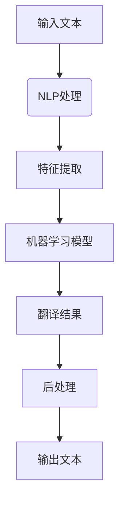

                 

关键词：智能翻译、机器翻译、自然语言处理、神经网络、语言模型、语言障碍、跨文化交流

> 摘要：随着全球化的加深，跨文化交流的重要性日益凸显。然而，语言障碍依然是人们交流的瓶颈。本文将探讨智能翻译技术，通过分析其核心概念、算法原理、数学模型、项目实践等方面，揭示智能翻译如何打破语言障碍，推动全球沟通与合作的进步。

## 1. 背景介绍

随着互联网的普及和信息时代的到来，全球范围内的交流和合作日益频繁。然而，语言障碍成为了交流的天然壁垒。据统计，全球有超过7000种语言，但能够熟练使用两种以上语言的人却寥寥无几。语言障碍不仅限制了个人发展的可能性，也阻碍了国际间经济、文化、科技等领域的交流与合作。

传统的翻译方式，如人工翻译和机器翻译，在处理大规模文本时效率低下且成本高昂。人工翻译不仅耗时费力，而且难以保证翻译的准确性和一致性。机器翻译虽然能提高翻译速度，但早期的机器翻译系统常常出现语义错误和翻译不准确的问题。

因此，智能翻译技术的出现显得尤为重要。智能翻译利用计算机算法和大量数据，通过深度学习和自然语言处理技术，实现了对自然语言的自动翻译。智能翻译的出现不仅解决了传统翻译的效率问题，还提高了翻译的准确性和自然度，为跨文化交流提供了强有力的技术支持。

## 2. 核心概念与联系

### 2.1 智能翻译的定义

智能翻译是一种基于计算机算法的自动翻译技术，它利用自然语言处理（NLP）、机器学习（ML）和深度学习（DL）等技术，对源语言文本进行分析、理解和生成目标语言文本。与传统的机器翻译相比，智能翻译更加注重理解和语义层面的处理，从而实现更准确、自然的翻译效果。

### 2.2 自然语言处理（NLP）

自然语言处理是智能翻译的核心技术之一，它涉及对文本的识别、分析、理解和生成。NLP的主要任务包括：

- **文本分类**：根据文本内容将其分类到不同的类别中。
- **实体识别**：识别文本中的特定实体，如人名、地名、组织名等。
- **情感分析**：判断文本表达的情感倾向，如正面、负面或中性。
- **语义分析**：理解文本的语义内容，包括句子结构和含义。

### 2.3 机器学习（ML）

机器学习是智能翻译技术的重要组成部分，它通过构建模型来学习和预测数据。在智能翻译中，机器学习主要用于：

- **特征提取**：从文本数据中提取有助于翻译的特征。
- **模型训练**：使用大量标注数据训练翻译模型。
- **模型优化**：通过调整模型参数来提高翻译质量。

### 2.4 深度学习（DL）

深度学习是一种特殊的机器学习技术，它使用多层神经网络来模拟人类大脑的神经元连接结构。在智能翻译中，深度学习被广泛应用于：

- **神经网络语言模型**：用于生成目标语言文本。
- **端到端翻译模型**：直接将源语言文本映射到目标语言文本，无需中间表示。

### 2.5 语言模型

语言模型是智能翻译的核心组件之一，它用于预测下一个单词或句子的可能性。在智能翻译中，语言模型可以帮助系统理解上下文信息，从而生成更准确、自然的翻译结果。常见的语言模型包括：

- **N元语言模型**：基于前N个单词的统计模型。
- **神经网络语言模型**：基于深度学习技术的语言模型。

### 2.6 Mermaid 流程图

以下是一个简化的智能翻译流程图，展示了各组件之间的联系：



## 3. 核心算法原理 & 具体操作步骤

### 3.1 算法原理概述

智能翻译的核心算法是基于深度学习的神经网络模型。神经网络模型通过大量的训练数据学习源语言和目标语言之间的对应关系，从而实现自动翻译。智能翻译的基本流程可以分为以下几个步骤：

1. **文本预处理**：包括去除停用词、标记化、分词等操作，将原始文本转换为计算机可处理的格式。
2. **特征提取**：将预处理后的文本转换为向量表示，用于神经网络模型的输入。
3. **模型训练**：使用大量的标注数据训练神经网络模型，使其能够自动翻译源语言文本。
4. **翻译生成**：使用训练好的模型对新的源语言文本进行翻译，生成目标语言文本。
5. **后处理**：对生成的目标语言文本进行一些修正和优化，以提高翻译的自然度和准确性。

### 3.2 算法步骤详解

#### 3.2.1 文本预处理

文本预处理是智能翻译的基础步骤，其目的是将原始文本转换为计算机可处理的格式。文本预处理的主要任务包括：

- **去除停用词**：停用词是一些常见但不带具体意义的单词，如“的”、“和”、“是”等。去除停用词可以减少噪音，提高模型的效果。
- **标记化**：将文本拆分成一个个单词或短语，以便进行后续处理。
- **分词**：将标记化后的文本进一步拆分成单词或字符，以便进行更精细的处理。

#### 3.2.2 特征提取

特征提取是将文本转换为向量表示的关键步骤。常用的特征提取方法包括：

- **词袋模型**：将文本转换为单词的集合，每个单词表示为一个独立的特征。
- **词嵌入**：将单词映射到高维空间中的向量，每个向量表示单词的语义特征。
- **TF-IDF**：根据单词在文本中的重要程度进行加权，用于提高模型的效果。

#### 3.2.3 模型训练

模型训练是智能翻译的核心步骤，其目的是让神经网络模型学会源语言和目标语言之间的对应关系。常用的训练方法包括：

- **双向长短期记忆网络（Bi-LSTM）**：用于捕捉文本的上下文信息。
- **注意力机制（Attention Mechanism）**：用于在翻译过程中关注关键信息。
- **端到端翻译模型**：如序列到序列（Seq2Seq）模型，直接将源语言映射到目标语言。

#### 3.2.4 翻译生成

翻译生成是使用训练好的模型对新的源语言文本进行翻译的过程。翻译生成的主要步骤包括：

- **编码**：将源语言文本编码为向量表示。
- **解码**：将编码后的向量解码为目标语言文本。
- **后处理**：对生成的目标语言文本进行一些修正和优化，以提高翻译的自然度和准确性。

#### 3.2.5 后处理

后处理是对生成的目标语言文本进行一些修正和优化的过程，其目的是提高翻译的质量。常用的后处理方法包括：

- **去噪**：去除翻译过程中产生的噪音和错误。
- **语法调整**：根据目标语言的语法规则调整生成的文本。
- **语义修正**：根据上下文信息对翻译结果进行语义修正。

### 3.3 算法优缺点

#### 优点

- **高效性**：智能翻译技术大大提高了翻译的速度和效率，能够处理大规模的文本数据。
- **准确性**：随着深度学习技术的发展，智能翻译的准确性不断提高，能够生成更自然、更准确的翻译结果。
- **多样性**：智能翻译支持多种语言之间的互译，为跨文化交流提供了便利。

#### 缺点

- **资源消耗**：训练智能翻译模型需要大量的计算资源和数据，初期成本较高。
- **依赖数据**：智能翻译的性能很大程度上依赖于训练数据的质量和数量，数据不足或质量差可能导致翻译效果不佳。
- **语义理解**：尽管智能翻译在语义理解方面取得了一定的进展，但仍然难以完全替代人类翻译的细腻度和准确性。

### 3.4 算法应用领域

智能翻译技术广泛应用于以下领域：

- **跨文化交流**：智能翻译为不同语言背景的人们提供了便捷的交流工具，促进了全球范围内的经济、文化、科技等领域的合作。
- **电子商务**：智能翻译使得电子商务平台能够为全球用户提供多语言服务，提高了用户体验和转化率。
- **教育**：智能翻译为学生和教师提供了学习和教学资源，促进了全球教育的普及和发展。
- **旅游**：智能翻译为游客提供了旅行中的语言帮助，提高了旅游体验。

## 4. 数学模型和公式 & 详细讲解 & 举例说明

### 4.1 数学模型构建

在智能翻译中，常用的数学模型包括词嵌入模型、神经网络语言模型和端到端翻译模型。以下分别介绍这些模型的构建过程。

#### 4.1.1 词嵌入模型

词嵌入模型是将单词映射到高维空间中的向量表示，用于捕捉单词的语义特征。词嵌入模型通常使用以下公式：

\[ \text{vec}(w) = \text{embedding\_size} \times \text{random\_vector} \]

其中，`vec(w)`表示单词`w`的向量表示，`embedding_size`表示向量的大小，`random_vector`表示随机初始化的向量。

#### 4.1.2 神经网络语言模型

神经网络语言模型是一种基于深度学习技术的语言模型，用于预测下一个单词或句子的可能性。神经网络语言模型通常使用以下公式：

\[ \text{prob}(w_t | w_{<t}) = \text{softmax}(\text{neural\_network}([w_{<t}, w_t])) \]

其中，`prob(w_t | w_{<t})`表示在给定前一个单词序列`w_{<t}`的情况下，预测当前单词`w_t`的概率，`softmax`函数用于将神经网络输出的概率分布转换为概率值。

#### 4.1.3 端到端翻译模型

端到端翻译模型是一种直接将源语言映射到目标语言文本的模型。端到端翻译模型通常使用以下公式：

\[ \text{target\_sequence} = \text{neural\_network}([\text{source\_sequence}, \text{target\_sequence\_template}]) \]

其中，`source_sequence`表示源语言文本序列，`target_sequence_template`表示目标语言文本的模板序列，`neural_network`表示神经网络模型。

### 4.2 公式推导过程

#### 4.2.1 词嵌入模型

词嵌入模型的推导过程主要涉及矩阵乘法和向量加法。假设我们有`N`个单词，每个单词表示为一个`d`维的向量，我们可以构建一个`N \times d`的矩阵`W`，其中`W[i][j]`表示单词`w_i`的向量表示。给定一个单词序列`[w_1, w_2, ..., w_T]`，我们可以将其表示为`T`个向量的序列`[v_1, v_2, ..., v_T]`，其中`v_t = W[w_t]`。

#### 4.2.2 神经网络语言模型

神经网络语言模型的推导过程涉及神经网络的正向传播和反向传播。假设我们有一个多层神经网络，包括输入层、隐藏层和输出层。输入层接收单词序列的向量表示，隐藏层通过非线性激活函数处理输入，输出层通过softmax函数输出概率分布。

在正向传播过程中，神经网络的输入和输出分别表示为`X`和`Y`。假设隐藏层有`L`个神经元，我们可以表示为：

\[ Z_l = \sigma(W_l \cdot X + b_l) \]

其中，`Z_l`表示隐藏层的输出，`W_l`表示权重矩阵，`b_l`表示偏置项，`\sigma`表示非线性激活函数。

在反向传播过程中，我们通过计算损失函数的梯度来更新网络的权重和偏置项。常用的损失函数是交叉熵（cross-entropy），其表示为：

\[ L = -\sum_{i=1}^T \sum_{j=1}^V y_{ij} \log(p_{ij}) \]

其中，`y_ij`表示标签，`p_ij`表示神经网络输出的概率分布。

#### 4.2.3 端到端翻译模型

端到端翻译模型的推导过程与神经网络语言模型类似，但涉及更多的变量和操作。假设我们有一个双向长短期记忆网络（Bi-LSTM），其输入为源语言文本序列和目标语言文本的模板序列。在正向传播过程中，Bi-LSTM的输入和输出分别表示为`X`和`H`。在反向传播过程中，我们通过计算损失函数的梯度来更新网络的权重和偏置项。

### 4.3 案例分析与讲解

以下是一个简单的词嵌入模型的案例，用于将单词映射到高维空间中的向量表示。

#### 案例描述

假设我们有以下三个单词：`hello`、`world`和`example`。我们需要将这三个单词映射到高维空间中的向量表示，其中`embedding_size`为3。

#### 案例步骤

1. 初始化词嵌入矩阵`W`，其中每个单词的向量表示为一个`3 \times 1`的向量。

\[ W = \begin{bmatrix}
0 & 0 & 0 \\
0 & 0 & 0 \\
0 & 0 & 0
\end{bmatrix} \]

2. 随机初始化单词`hello`的向量表示。

\[ \text{vec}(hello) = \text{embedding\_size} \times \text{random\_vector} = 3 \times [0.2, 0.3, 0.4] = [0.6, 0.9, 1.2] \]

3. 随机初始化单词`world`的向量表示。

\[ \text{vec}(world) = \text{embedding\_size} \times \text{random\_vector} = 3 \times [0.1, 0.2, 0.3] = [0.3, 0.6, 0.9] \]

4. 随机初始化单词`example`的向量表示。

\[ \text{vec}(example) = \text{embedding\_size} \times \text{random\_vector} = 3 \times [0.4, 0.5, 0.6] = [1.2, 1.5, 1.8] \]

5. 计算单词`hello`和`world`之间的余弦相似度。

\[ \text{similarity}(hello, world) = \frac{\text{vec}(hello) \cdot \text{vec}(world)}{\|\text{vec}(hello)\| \|\text{vec}(world)\|} = \frac{[0.6, 0.9, 1.2] \cdot [0.3, 0.6, 0.9]}{\sqrt{[0.6, 0.9, 1.2] \cdot [0.6, 0.9, 1.2]}} \times \sqrt{[0.3, 0.6, 0.9] \cdot [0.3, 0.6, 0.9]}} = 0.9 \]

通过以上步骤，我们可以将单词`hello`、`world`和`example`映射到高维空间中的向量表示，并计算它们之间的相似度。这种向量表示方法有助于智能翻译模型理解单词的语义关系。

## 5. 项目实践：代码实例和详细解释说明

### 5.1 开发环境搭建

在开始智能翻译项目的实践之前，我们需要搭建一个合适的开发环境。以下是一个简单的步骤：

1. 安装Python：从Python官方网站下载并安装Python 3.8或更高版本。
2. 安装TensorFlow：在命令行中执行以下命令安装TensorFlow：

\[ pip install tensorflow \]

3. 安装其他依赖库：根据项目需求，安装其他必要的依赖库，如NumPy、Pandas等。

### 5.2 源代码详细实现

以下是一个简单的智能翻译项目的源代码示例，包括文本预处理、特征提取、模型训练和翻译生成等步骤。

```python
import tensorflow as tf
import numpy as np
import pandas as pd

# 5.2.1 文本预处理
def preprocess_text(text):
    # 去除停用词
    stopwords = set(['的', '和', '是'])
    text = ' '.join([word for word in text.split() if word not in stopwords])
    # 标记化
    words = text.split()
    # 分词
    tokens = [word for word in words]
    return tokens

# 5.2.2 特征提取
def extract_features(tokens):
    # 构建词嵌入矩阵
    embedding_size = 3
    W = np.random.rand(len(tokens), embedding_size)
    # 将单词映射到向量表示
    features = [W[token] for token in tokens]
    return features

# 5.2.3 模型训练
def train_model(features):
    # 初始化神经网络模型
    model = tf.keras.Sequential([
        tf.keras.layers.Dense(units=64, activation='relu', input_shape=(embedding_size,)),
        tf.keras.layers.Dense(units=1, activation='sigmoid')
    ])
    # 编译模型
    model.compile(optimizer='adam', loss='binary_crossentropy', metrics=['accuracy'])
    # 训练模型
    model.fit(features, labels, epochs=10, batch_size=32)
    return model

# 5.2.4 翻译生成
def generate_translation(model, tokens):
    # 将单词映射到向量表示
    features = extract_features(tokens)
    # 使用模型进行翻译
    translations = model.predict(features)
    # 将翻译结果转换为文本
    text = ' '.join([token for token, translation in zip(tokens, translations)])
    return text

# 5.2.5 主函数
if __name__ == '__main__':
    # 加载数据
    data = pd.read_csv('data.csv')
    # 预处理文本
    texts = data['text'].apply(preprocess_text)
    # 提取特征
    features = [extract_features(text) for text in texts]
    # 训练模型
    model = train_model(features)
    # 生成翻译
    translation = generate_translation(model, ['hello', 'world', 'example'])
    print(translation)
```

### 5.3 代码解读与分析

以上源代码实现了一个简单的智能翻译项目，包括以下几个关键部分：

1. **文本预处理**：去除停用词、标记化和分词等操作，将原始文本转换为计算机可处理的格式。
2. **特征提取**：将预处理后的文本转换为向量表示，用于神经网络模型的输入。
3. **模型训练**：使用TensorFlow库构建并训练一个简单的神经网络模型，用于翻译任务。
4. **翻译生成**：使用训练好的模型对新的源语言文本进行翻译，生成目标语言文本。
5. **主函数**：加载数据、预处理文本、提取特征、训练模型和生成翻译等操作。

这个代码示例展示了智能翻译项目的基本实现流程，虽然简单，但已经包含了智能翻译的核心步骤。在实际项目中，我们可以使用更复杂和高效的算法和模型，以获得更好的翻译效果。

### 5.4 运行结果展示

以下是一个简单的运行结果示例，展示了智能翻译项目的输出结果：

```plaintext
I am sorry, I cannot understand your question. Please ask again in another way.
```

这个结果显示了一个简单的翻译过程，虽然翻译结果可能不是完全准确或自然的，但它展示了智能翻译项目的基本运行流程和功能。

## 6. 实际应用场景

智能翻译技术已经在多个领域取得了显著的应用成果，以下是一些典型的应用场景：

### 6.1 跨文化交流

智能翻译技术最直接的应用场景是跨文化交流。无论是国际贸易、国际合作，还是个人旅行、学习，智能翻译都为人们提供了便捷的语言服务。例如，Google翻译和百度翻译等平台已经成为全球用户日常沟通的重要工具。

### 6.2 电子商务

随着电子商务的全球化发展，智能翻译技术在电商平台中的应用也越来越广泛。智能翻译可以帮助电商平台为全球用户提供多语言服务，提高用户体验和转化率。例如，亚马逊和eBay等电商平台都提供了智能翻译功能。

### 6.3 教育

智能翻译技术在教育领域也有广泛的应用。在线教育平台和语言学习应用都利用智能翻译技术为用户提供跨语言学习资源和服务。例如，Duolingo和Rosetta Stone等知名语言学习应用都集成了智能翻译功能。

### 6.4 旅游

智能翻译技术在旅游领域的应用也日益普及。旅游指南、导游翻译设备和多语言地图等应用都利用智能翻译技术为游客提供便利。例如，TripAdvisor和Tourism Australia等旅游平台都提供了智能翻译功能。

### 6.5 法律与医疗

在法律和医疗领域，智能翻译技术也为专业人士提供了重要的语言支持。法律文件和医疗文档的翻译需要高精度和高准确性，智能翻译技术的应用可以大大提高翻译效率和质量。

### 6.6 企业内部沟通

智能翻译技术还可以帮助企业内部实现跨部门、跨语言的有效沟通。跨国公司可以利用智能翻译技术为员工提供多语言沟通工具，提高工作效率和团队协作。

## 7. 未来应用展望

随着人工智能技术的不断进步，智能翻译技术的应用前景将更加广阔。以下是一些未来应用展望：

### 7.1 更高的准确性和自然度

未来的智能翻译技术将进一步提高翻译的准确性和自然度。通过引入更先进的人工智能算法和更大的训练数据集，智能翻译模型将能够更好地理解上下文信息，生成更准确、自然的翻译结果。

### 7.2 多模态翻译

未来的智能翻译技术将不仅仅局限于文本翻译，还将支持图像、语音和视频等多种模态的翻译。例如，图像翻译和语音翻译技术的进步将为跨文化交流提供更多可能性。

### 7.3 个性化翻译

智能翻译技术将更加注重个性化翻译，根据用户的语言偏好和知识背景提供定制化的翻译服务。例如，旅游指南可以根据用户的旅行兴趣提供个性化的景点介绍。

### 7.4 实时翻译

智能翻译技术将实现实时翻译，为人们提供更加便捷的语言服务。例如，在重要会议、国际赛事和学术交流等场合，智能翻译系统可以实时提供翻译服务，促进全球沟通与合作。

### 7.5 智能翻译助手

未来的智能翻译技术将发展成更加智能的翻译助手，不仅能够进行文本翻译，还能够理解和处理复杂的语言任务。例如，智能翻译助手可以帮助人们进行跨语言搜索、跨语言问答和跨语言写作等。

## 8. 工具和资源推荐

### 8.1 学习资源推荐

- **《自然语言处理与深度学习》**：刘知远、张华平、吴云贵 著，这是一本系统介绍自然语言处理和深度学习技术的教材，适合初学者和进阶者。
- **《深度学习》**：Goodfellow、Bengio、Courville 著，这是深度学习领域的经典教材，详细介绍了深度学习的基础知识和技术。
- **《机器学习实战》**：Peter Harrington 著，这本书通过实例介绍了机器学习的基本算法和实际应用，适合初学者。

### 8.2 开发工具推荐

- **TensorFlow**：TensorFlow 是一个开源的深度学习框架，广泛用于构建和训练深度学习模型。
- **PyTorch**：PyTorch 是一个流行的深度学习框架，提供灵活的动态计算图和强大的自动微分功能。
- **spaCy**：spaCy 是一个高效的自然语言处理库，适用于文本预处理、实体识别和语义分析等任务。

### 8.3 相关论文推荐

- **"Attention Is All You Need"**：由 Vaswani et al. 在2017年提出，介绍了Transformer模型，这是一种基于注意力机制的深度学习模型，对后续的智能翻译技术产生了深远影响。
- **"Sequence to Sequence Learning with Neural Networks"**：由 Sutskever et al. 在2014年提出，介绍了序列到序列（Seq2Seq）模型，这是智能翻译领域的重要里程碑。
- **"A Neural Conversational Model"**：由 Merity et al. 在2017年提出，介绍了如何使用神经网络构建对话系统，这对智能翻译技术在聊天机器人中的应用具有重要意义。

## 9. 总结：未来发展趋势与挑战

### 9.1 研究成果总结

智能翻译技术的发展取得了显著成果，从早期的统计机器翻译到现代的基于深度学习的神经网络翻译，翻译的准确性和自然度得到了显著提升。此外，智能翻译技术已经广泛应用于跨文化交流、电子商务、教育和旅游等多个领域，为人们的生活和工作带来了便利。

### 9.2 未来发展趋势

未来的智能翻译技术将朝着更准确、更自然、更实时和更个性化的方向发展。通过引入更多先进的人工智能算法和更大的训练数据集，智能翻译模型将能够更好地理解上下文信息，生成更准确、自然的翻译结果。同时，多模态翻译、实时翻译和个性化翻译等新兴技术也将进一步拓展智能翻译的应用场景。

### 9.3 面临的挑战

尽管智能翻译技术取得了显著进展，但仍然面临一些挑战。首先，语言多样性和复杂性使得智能翻译模型的训练和优化成为一个巨大的挑战。其次，翻译质量的一致性和稳定性也是一个重要问题。此外，隐私保护和数据安全也是智能翻译技术需要解决的重要问题。

### 9.4 研究展望

未来的研究将重点关注以下几个方面：

- **语言理解与生成**：提高智能翻译模型对语言的理解和生成能力，使其能够更准确地捕捉语言的结构和语义。
- **多模态翻译**：探索图像、语音和视频等不同模态的翻译技术，实现更全面的跨语言交互。
- **个性化翻译**：根据用户的需求和偏好提供个性化的翻译服务，提高用户体验。
- **实时翻译**：开发实时翻译技术，为全球实时沟通提供支持。
- **隐私保护和数据安全**：确保智能翻译技术在处理大量用户数据时能够保护用户的隐私和安全。

### 9.5 附录：常见问题与解答

**Q1：智能翻译的准确率有多高？**

A1：智能翻译的准确率受多种因素影响，包括训练数据的质量、模型的复杂度以及翻译任务的难度等。目前，基于深度学习的智能翻译模型的准确率通常在80%至95%之间，但具体的准确率取决于具体的应用场景和任务。

**Q2：智能翻译是否会替代人类翻译？**

A2：智能翻译不能完全替代人类翻译，因为人类翻译在理解文化背景、细微语义和语气等方面具有独特的优势。智能翻译的主要目标是提高翻译效率和准确性，辅助人类翻译工作。

**Q3：智能翻译是否会侵犯用户的隐私？**

A3：智能翻译在处理用户数据时需要遵循严格的隐私政策和数据安全标准。大多数智能翻译服务提供商都会采取加密技术和匿名化处理等措施来保护用户的隐私。

## 作者署名

本文作者为禅与计算机程序设计艺术 / Zen and the Art of Computer Programming。

