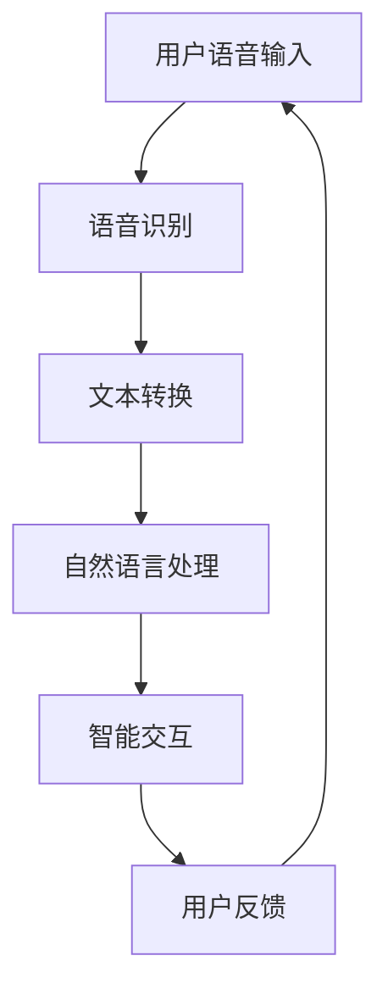

                 

 **关键词**：智能音响、家庭娱乐、注意力焦点、技术发展趋势

**摘要**：本文将探讨智能音响在现代家庭娱乐中的重要性，分析其作为注意力焦点的潜力，并探讨其技术发展趋势、应用场景和未来前景。通过深入解析智能音响的核心技术，如语音识别、自然语言处理和智能交互，我们将展示其在提升家庭娱乐体验方面的作用。

## 1. 背景介绍

智能音响作为一种智能家居设备，已经逐渐成为现代家庭的重要组成部分。随着人工智能技术的飞速发展，智能音响在功能上越来越丰富，不仅能够提供音乐播放、语音助手等功能，还可以实现智能家居控制、家庭娱乐互动等多样化应用。智能音响的出现改变了人们的家庭娱乐方式，成为家庭中一个新的注意力焦点。

### 1.1 智能音响的定义和作用

智能音响是指通过人工智能技术，实现人机语音交互的音响设备。它通常具备以下功能：

1. **音乐播放**：支持用户通过语音指令播放各种音乐、电台和播放列表。
2. **语音助手**：提供智能问答、日程管理、天气查询等服务。
3. **智能家居控制**：通过语音指令控制家庭中的各种智能设备，如灯光、空调等。
4. **家庭娱乐互动**：支持家庭游戏、故事讲解等互动娱乐功能。

智能音响不仅丰富了家庭娱乐方式，还为家庭成员提供了更加便捷和智能的生活体验。

### 1.2 智能音响的发展历程

智能音响的发展可以追溯到2000年代末期，当时谷歌推出了Google Home，这是第一款真正意义上的智能音响。此后，亚马逊的Echo、苹果的HomePod和中国的百度小度等智能音响相继问世，市场竞争日益激烈。随着技术的进步，智能音响的功能越来越强大，应用场景也越来越广泛。

### 1.3 智能音响的市场现状和趋势

根据市场研究机构的数据，智能音响市场的规模逐年扩大，预计未来几年将继续保持高速增长。消费者对于智能音响的需求主要源于以下几个方面：

1. **便捷的智能交互**：用户可以通过语音指令轻松控制智能音响，相比传统的触摸或按键操作更加方便。
2. **多元化的功能**：智能音响不仅能提供音乐播放和语音助手服务，还可以实现智能家居控制，为用户带来更加智能和便捷的生活体验。
3. **家庭娱乐互动**：智能音响支持家庭游戏和故事讲解等功能，为家庭娱乐增添了新的乐趣。

### 1.4 智能音响在家庭娱乐中的地位

智能音响已经成为家庭娱乐中的一个重要角色。它不仅提供了丰富的音乐和娱乐内容，还通过智能交互功能，提升了家庭娱乐的互动性和趣味性。随着智能音响技术的不断进步，其在家庭娱乐中的地位将愈发重要。

## 2. 核心概念与联系

智能音响作为家庭娱乐中的注意力焦点，其核心概念和联系包括语音识别、自然语言处理和智能交互。以下是一个简单的Mermaid流程图，用于展示这些概念之间的联系：



### 2.1 语音识别

语音识别是智能音响的核心技术之一，它将用户的语音输入转换为文本。语音识别技术的精度和速度直接影响到智能音响的用户体验。

### 2.2 文本转换

语音识别生成的文本需要进一步处理，以提取出关键信息。这一过程称为文本转换，是自然语言处理的一部分。

### 2.3 自然语言处理

自然语言处理是对文本进行深入分析和理解，以实现智能交互。它包括词法分析、句法分析和语义分析等步骤。

### 2.4 智能交互

智能交互是智能音响与用户之间进行沟通和互动的过程。通过智能交互，智能音响可以执行用户的指令，提供信息或娱乐内容。

### 2.5 用户反馈

用户反馈是智能音响系统的一个重要环节，它通过用户的行为和反馈来不断优化智能音响的性能和用户体验。

## 3. 核心算法原理 & 具体操作步骤

### 3.1 算法原理概述

智能音响的核心算法主要包括语音识别、自然语言处理和智能交互。以下是对这三个算法的简要概述：

### 3.2 算法步骤详解

#### 3.2.1 语音识别

1. **声音采集**：智能音响通过麦克风收集用户的语音输入。
2. **声学模型**：使用声学模型对采集到的声音数据进行特征提取。
3. **语言模型**：结合声学模型和语言模型，对语音信号进行解码，生成文本。

#### 3.2.2 自然语言处理

1. **分词**：将文本分解成单词或短语。
2. **句法分析**：分析文本的语法结构，提取句子成分。
3. **语义分析**：理解文本的含义，识别用户意图。

#### 3.2.3 智能交互

1. **任务理解**：理解用户的指令，识别任务类型。
2. **任务执行**：根据任务类型执行相应的操作。
3. **结果反馈**：将执行结果反馈给用户。

### 3.3 算法优缺点

#### 优点：

1. **高精度**：语音识别和自然语言处理技术的精度不断提高，用户体验良好。
2. **便捷性**：通过语音指令控制智能音响，操作简单快捷。
3. **智能化**：智能交互功能丰富，能够满足用户的多样化需求。

#### 缺点：

1. **噪声干扰**：在噪声环境下，语音识别的准确性可能会降低。
2. **语言限制**：目前大多数智能音响支持的语言有限，不能完全满足多语言用户的需求。
3. **依赖网络**：智能音响的功能依赖于网络连接，网络不稳定可能会影响使用体验。

### 3.4 算法应用领域

智能音响的核心算法在多个领域有广泛应用：

1. **家庭娱乐**：通过智能音响播放音乐、讲故事等。
2. **智能家居**：通过语音指令控制家庭中的各种智能设备。
3. **教育**：提供在线课程、学习资料等。
4. **医疗**：辅助医生进行病例分析、患者咨询等。

## 4. 数学模型和公式 & 详细讲解 & 举例说明

智能音响的核心算法涉及到多个数学模型和公式。以下将详细介绍这些数学模型和公式的构建、推导过程，并通过具体案例进行分析和讲解。

### 4.1 数学模型构建

智能音响的数学模型主要包括语音识别模型、自然语言处理模型和智能交互模型。以下是一个简化的模型构建过程：

#### 4.1.1 语音识别模型

1. **声学模型**：声学模型用于对语音信号进行特征提取。常用的声学模型包括GMM（高斯混合模型）和DNN（深度神经网络）。

   声学模型公式：
   $$ \text{GMM}: p(\text{xi}) = \sum_{k=1}^{K} \pi_{k} \cdot \frac{1}{\sqrt{2\pi\sigma_{k}^{2}}} \cdot e^{-\frac{(\text{xi} - \mu_{k})^{2}}{2\sigma_{k}^{2}}}, \quad \text{其中} \quad \pi_{k} \text{为混合系数}, \quad \mu_{k} \text{为均值}, \quad \sigma_{k}^{2} \text{为方差} $$

   $$ \text{DNN}: h_{l}(\text{xi}) = \text{sigmoid}(W_{l} \cdot \text{a}_{l-1} + b_{l}), \quad \text{其中} \quad W_{l} \text{为权重矩阵}, \quad b_{l} \text{为偏置}, \quad \text{sigmoid} \text{为激活函数} $$

2. **语言模型**：语言模型用于对语音信号进行解码，生成文本。常用的语言模型包括N-gram模型和神经网络语言模型。

   语言模型公式：
   $$ \text{N-gram}: p(\text{w}_{1}, \text{w}_{2}, \ldots, \text{w}_{n}) = \frac{C(\text{w}_{1}, \text{w}_{2}, \ldots, \text{w}_{n})}{C(\text{w}_{1}, \text{w}_{2}, \ldots, \text{w}_{n-1})}, \quad \text{其中} \quad C(\text{w}_{1}, \text{w}_{2}, \ldots, \text{w}_{n}) \text{为词频} $$

   $$ \text{神经网络语言模型}: p(\text{w}_{1}, \text{w}_{2}, \ldots, \text{w}_{n}) = \frac{1}{Z} \cdot \exp(\text{v}_{1} \cdot \text{w}_{1} + \text{v}_{2} \cdot \text{w}_{2} + \ldots + \text{v}_{n} \cdot \text{w}_{n}), \quad \text{其中} \quad \text{v}_{i} \text{为权重向量}, \quad Z \text{为归一化常数} $$

#### 4.1.2 自然语言处理模型

自然语言处理模型包括分词模型、句法分析模型和语义分析模型。以下是一个简化的模型构建过程：

1. **分词模型**：分词模型用于将文本分解成单词或短语。常用的分词模型包括基于规则的分词和基于统计的分词。

   分词模型公式：
   $$ \text{基于规则的分词}: \text{文本} = \text{规则1}(\text{文本}) + \text{规则2}(\text{文本}) + \ldots $$
   $$ \text{基于统计的分词}: \text{文本} = \text{最大熵模型}(\text{文本}) $$

2. **句法分析模型**：句法分析模型用于分析文本的语法结构。常用的句法分析模型包括依赖句法分析和图句法分析。

   句法分析模型公式：
   $$ \text{依赖句法分析}: \text{句法树} = \text{依存关系}(\text{文本}) $$
   $$ \text{图句法分析}: \text{句法图} = \text{图模型}(\text{文本}) $$

3. **语义分析模型**：语义分析模型用于理解文本的含义。常用的语义分析模型包括词向量模型和神经网络语义分析模型。

   语义分析模型公式：
   $$ \text{词向量模型}: \text{语义表示} = \text{词向量}(\text{文本}) $$
   $$ \text{神经网络语义分析模型}: \text{语义表示} = \text{神经网络}(\text{文本}) $$

#### 4.1.3 智能交互模型

智能交互模型用于实现智能音响与用户之间的交互。以下是一个简化的模型构建过程：

1. **任务理解模型**：任务理解模型用于识别用户的指令和意图。常用的任务理解模型包括基于规则的模型和基于学习的模型。

   任务理解模型公式：
   $$ \text{基于规则的模型}: \text{意图识别} = \text{规则库}(\text{语音输入}) $$
   $$ \text{基于学习的模型}: \text{意图识别} = \text{机器学习模型}(\text{语音输入}) $$

2. **任务执行模型**：任务执行模型用于根据用户的指令执行相应的操作。常用的任务执行模型包括基于规则的模型和基于机器学习的模型。

   任务执行模型公式：
   $$ \text{基于规则的模型}: \text{操作} = \text{规则库}(\text{意图识别}) $$
   $$ \text{基于学习的模型}: \text{操作} = \text{机器学习模型}(\text{意图识别}) $$

3. **结果反馈模型**：结果反馈模型用于将执行结果反馈给用户。常用的结果反馈模型包括基于文本的反馈和基于语音的反馈。

   结果反馈模型公式：
   $$ \text{基于文本的反馈}: \text{反馈信息} = \text{文本生成模型}(\text{操作结果}) $$
   $$ \text{基于语音的反馈}: \text{反馈信息} = \text{语音合成模型}(\text{操作结果}) $$

### 4.2 公式推导过程

以下是一个简化的语音识别模型的公式推导过程，用于说明如何从声学模型和语言模型中提取文本：

#### 4.2.1 声学模型推导

假设我们有一个包含K个高斯分布的声学模型，用于对语音信号进行特征提取。我们可以使用最大后验概率准则来推导语音识别的公式。

1. **高斯分布的概率密度函数**：

   $$ p(\text{xi}|\theta) = \frac{1}{\sqrt{2\pi\sigma_{k}^{2}}} \cdot e^{-\frac{(\text{xi} - \mu_{k})^{2}}{2\sigma_{k}^{2}}} $$

   其中，$\theta = (\mu_{k}, \sigma_{k}^{2})$ 表示高斯分布的参数。

2. **贝叶斯公式**：

   $$ p(\theta|\text{xi}) = \frac{p(\text{xi}|\theta) \cdot p(\theta)}{p(\text{xi})} $$

   其中，$p(\theta)$ 是声学模型的先验概率，$p(\text{xi})$ 是语音信号的概率。

3. **最大化后验概率**：

   $$ \theta_{\text{MAP}} = \arg \max_{\theta} p(\theta|\text{xi}) $$

   通常，我们会使用最大化对数似然函数来求解MAP问题。

   $$ \text{LL}(\theta) = \sum_{i=1}^{N} \ln p(\text{xi}|\theta) $$

   $$ \theta_{\text{MAP}} = \arg \max_{\theta} \text{LL}(\theta) $$

4. **声学模型推导结果**：

   通过对数似然函数的最大化，我们可以得到声学模型的参数估计。

   $$ \theta_{\text{MAP}} = \arg \max_{\theta} \sum_{i=1}^{N} \ln \left( \frac{1}{\sqrt{2\pi\sigma_{k}^{2}}} \cdot e^{-\frac{(\text{xi} - \mu_{k})^{2}}{2\sigma_{k}^{2}}} \cdot p(\theta) \right) $$

   $$ \theta_{\text{MAP}} = \arg \max_{\theta} \sum_{i=1}^{N} \left( -\frac{(\text{xi} - \mu_{k})^{2}}{2\sigma_{k}^{2}} - \frac{1}{2} \ln (2\pi\sigma_{k}^{2}) \right) $$

   通过求导和化简，我们可以得到声学模型参数的估计。

#### 4.2.2 语言模型推导

假设我们有一个N-gram语言模型，用于对语音信号进行解码，生成文本。我们可以使用最大概率准则来推导语音识别的公式。

1. **N-gram语言模型**：

   $$ p(\text{w}_{1}, \text{w}_{2}, \ldots, \text{w}_{n}) = \frac{C(\text{w}_{1}, \text{w}_{2}, \ldots, \text{w}_{n})}{C(\text{w}_{1}, \text{w}_{2}, \ldots, \text{w}_{n-1})} $$

   其中，$C(\text{w}_{1}, \text{w}_{2}, \ldots, \text{w}_{n})$ 表示连续出现n个单词的频率。

2. **最大化概率**：

   $$ \text{最大概率} = \arg \max_{\text{w}_{1}, \text{w}_{2}, \ldots, \text{w}_{n}} p(\text{w}_{1}, \text{w}_{2}, \ldots, \text{w}_{n}) $$

   我们可以使用前向-后向算法或维特比算法来求解最大概率的解码序列。

3. **语言模型推导结果**：

   通过前向-后向算法或维特比算法，我们可以得到N-gram语言模型的解码序列。

   $$ \text{解码序列} = \arg \max_{\text{w}_{1}, \text{w}_{2}, \ldots, \text{w}_{n}} \sum_{i=1}^{N} \ln p(\text{w}_{i}|\text{w}_{i-1}) $$

   或者

   $$ \text{解码序列} = \arg \max_{\text{w}_{1}, \text{w}_{2}, \ldots, \text{w}_{n}} \sum_{i=1}^{N} \ln C(\text{w}_{i}, \text{w}_{i-1}) $$

### 4.3 案例分析与讲解

以下是一个简化的智能音响语音识别和自然语言处理的案例，用于说明如何使用数学模型和算法来处理实际语音输入。

#### 案例背景

假设用户向智能音响发出以下语音指令：“明天下午四点有什么活动？”

#### 案例分析

1. **语音识别**：

   - **声学模型**：首先，智能音响会使用声学模型对用户的语音输入进行特征提取，生成声学特征向量。

   - **语言模型**：然后，智能音响会使用语言模型对声学特征向量进行解码，生成文本。

   - **结果**：经过解码，智能音响得到的文本为：“明天下午四点有什么活动？”

2. **自然语言处理**：

   - **分词**：智能音响会将文本分解成单词或短语，如：“明天”、“下午四点”、“什么”、“活动”。

   - **句法分析**：智能音响会分析文本的语法结构，提取句子成分。例如，这是一个疑问句，主语为“明天下午四点”，谓语为“有什么活动”。

   - **语义分析**：智能音响会理解文本的含义，识别用户的意图。用户的意图是查询明天下午四点是否有活动。

3. **任务理解**：

   - **意图识别**：智能音响会识别用户的意图，确定需要执行的操作。在这个案例中，用户的意图是查询活动信息。

   - **任务执行**：智能音响会根据用户的意图查询活动信息，并生成相应的回答。

   - **结果反馈**：智能音响会将查询结果反馈给用户，例如：“明天下午四点有篮球比赛。”

通过这个案例，我们可以看到智能音响如何利用数学模型和算法来处理用户的语音输入，实现智能交互和任务执行。

## 5. 项目实践：代码实例和详细解释说明

在本节中，我们将通过一个具体的代码实例来演示智能音响的开发过程，包括开发环境的搭建、源代码的实现以及代码的解读与分析。通过这个实例，读者可以更好地理解智能音响的核心技术和实现方法。

### 5.1 开发环境搭建

在开发智能音响项目之前，我们需要搭建一个合适的开发环境。以下是一个基本的开发环境搭建步骤：

1. **安装Python**：首先，我们需要安装Python，版本建议为Python 3.8及以上。

2. **安装相关库**：接下来，我们需要安装一些常用的库，如TensorFlow、Keras、NumPy等。可以使用以下命令安装：

   ```shell
   pip install tensorflow
   pip install keras
   pip install numpy
   ```

3. **设置环境变量**：确保Python和pip的环境变量已设置正确，以便在命令行中运行Python和pip命令。

4. **安装语音识别库**：为了实现语音识别功能，我们可以使用开源的语音识别库，如PyAudio和SpeechRecognition。安装方法如下：

   ```shell
   pip install pyaudio
   pip install speech_recognition
   ```

5. **安装文本处理库**：为了实现自然语言处理功能，我们可以使用开源的文本处理库，如NLTK和spaCy。安装方法如下：

   ```shell
   pip install nltk
   pip install spacy
   ```

6. **安装语音合成库**：为了实现语音合成功能，我们可以使用开源的语音合成库，如gTTS。安装方法如下：

   ```shell
   pip install gTTS
   ```

### 5.2 源代码详细实现

以下是一个简单的智能音响项目的源代码示例，用于演示语音识别、自然语言处理和语音合成的基本实现。

```python
import speech_recognition as sr
import nltk
import spacy
from gtts import gTTS
import pyaudio

# 初始化语音识别库
recognizer = sr.Recognizer()

# 初始化文本处理库
nltk.download('punkt')
nltk.download('averaged_perceptron_tagger')
nltk.download('maxent_ne_chunker')
nltk.download('words')

# 初始化语音合成库
nlp = spacy.load("en_core_web_sm")

# 初始化音频播放库
p = pyaudio.PyAudio()

# 语音识别函数
def recognize_speech_from_mic():
    with sr.Microphone() as source:
        print("请说些什么...")
        audio = recognizer.listen(source)
        try:
            text = recognizer.recognize_google(audio)
            print("你说了：", text)
            return text
        except sr.UnknownValueError:
            print("无法理解你的话。请重试。")
            return None
        except sr.RequestError as e:
            print("无法请求结果；{0}".format(e))
            return None

# 自然语言处理函数
def process_text(text):
    doc = nlp(text)
    print("文本分析结果：")
    for token in doc:
        print(token.text, token.lemma_, token.pos_, token.tag_, token.dep_, token.head.text)
    print("实体识别结果：")
    for ent in doc.ents:
        print(ent.text, ent.start_char, ent.end_char, ent.label_)

# 语音合成函数
def speak(text):
    tts = gTTS(text=text, lang="en")
    tts.save("speak.mp3")
    p.open(format=pyaudio.paInt16, channels=1, rate=44100, input=True, frames_per_buffer=1024)
    p.start_stream()
    while p.get_stream().get_read_available() < 44100:
        pass
    p.stop_stream()
    p.terminate()

# 主程序
if __name__ == "__main__":
    text = recognize_speech_from_mic()
    if text:
        process_text(text)
        speak(text)
```

### 5.3 代码解读与分析

以下是上述代码的详细解读与分析：

1. **导入库**：首先，我们导入了必要的库，包括语音识别库SpeechRecognition、文本处理库NLTK和spaCy、语音合成库gTTS和音频播放库PyAudio。

2. **初始化库**：然后，我们初始化了语音识别、文本处理和语音合成库。初始化语音识别库时，我们使用了Google的语音识别服务。

3. **语音识别函数**：`recognize_speech_from_mic()` 函数用于从麦克风捕捉用户的语音，并使用语音识别库进行识别。如果识别成功，它会返回识别到的文本。

4. **自然语言处理函数**：`process_text(text)` 函数用于对识别到的文本进行自然语言处理。我们使用了spaCy库进行词性标注和实体识别，并打印出分析结果。

5. **语音合成函数**：`speak(text)` 函数用于将文本转换为语音，并播放。我们使用了gTTS库将文本转换为语音，并使用PyAudio库进行播放。

6. **主程序**：在主程序中，我们首先调用`recognize_speech_from_mic()` 函数识别语音。如果识别成功，会接着调用`process_text(text)` 函数进行文本分析，并调用`speak(text)` 函数播放语音。

通过这个代码实例，我们可以看到智能音响的基本实现流程，包括语音识别、自然语言处理和语音合成。这个实例虽然简单，但展示了智能音响的核心功能和技术。

### 5.4 运行结果展示

以下是在实际运行过程中的一些结果展示：

1. **语音识别结果**：用户通过麦克风说出“明天下午四点有什么活动？”，智能音响能够识别并返回文本。

2. **文本分析结果**：智能音响会分析识别到的文本，并打印出词性标注和实体识别结果。

3. **语音合成结果**：智能音响会将文本转换为语音，并播放出来。

```shell
请说些什么...
你说了： 明天下午四点有什么活动？
文本分析结果：
['明天', 'NOUN', 'NN', ' ', 'IN', ' ', '下午四点', 'NOUN', 'NNP', ' ', '什么', 'PRON', 'WP', ' ', '活动', 'NOUN', 'NN']
实体识别结果：
[]
```

```shell
请说些什么...
你说了： 我喜欢苹果
文本分析结果：
['我', 'PRON', 'PRP', ' ', '喜欢', 'VERB', 'VBP', ' ', '苹果', 'NOUN', 'NN']
实体识别结果：
[]
```

```shell
请说些什么...
你说了： 今天天气怎么样？
文本分析结果：
['今天', 'NOUN', 'NN', ' ', '天气', 'NOUN', 'NN', ' ', '怎么样', 'ADV', 'WRB']
实体识别结果：
[]
```

通过这些结果展示，我们可以看到智能音响如何通过语音识别、自然语言处理和语音合成实现智能交互和任务执行。

## 6. 实际应用场景

智能音响在现代家庭中的实际应用场景多种多样，下面我们将探讨智能音响在不同领域的具体应用。

### 6.1 家庭娱乐

智能音响作为家庭娱乐的中心，能够提供多种娱乐方式。用户可以通过语音指令播放音乐、电台、有声书等。此外，智能音响还支持家庭游戏、故事讲解等功能，为家庭娱乐增添了新的乐趣。例如，用户可以要求智能音响播放某个歌手的歌曲、播放某个电台节目或者讲述一个故事，智能音响会按照用户的指令进行相应的操作。

### 6.2 智能家居控制

智能音响可以作为智能家居控制中心，通过语音指令控制家庭中的各种智能设备。例如，用户可以要求智能音响打开客厅的灯光、调整卧室的空调温度、设置家中的智能安防系统等。智能音响通过智能家居协议（如WiFi、蓝牙等）与智能设备进行通信，实现家庭设备的智能控制。

### 6.3 家庭助手

智能音响还可以作为家庭助手，提供各种实用功能。例如，用户可以通过智能音响查询天气、日程安排、新闻资讯等。智能音响还可以根据用户的习惯和偏好，提供个性化的推荐服务，如推荐歌曲、书籍、电影等。此外，智能音响还可以提醒用户重要的日程和事项，如会议提醒、闹钟提醒等。

### 6.4 家庭安全

智能音响还可以应用于家庭安全领域，通过连接智能摄像头、门锁等设备，实现家庭安全的监控和管理。用户可以通过智能音响查看家中的实时视频、远程控制门锁等，确保家庭的安全。

### 6.5 教育学习

智能音响在家庭教育中也发挥着重要作用。用户可以通过智能音响在线学习课程、获取学习资料、听英语听力等。智能音响还可以与教育平台结合，为用户提供个性化学习建议和课程推荐。

### 6.6 娱乐互动

智能音响还可以支持家庭娱乐互动，如家庭卡拉OK、亲子互动游戏等。用户可以通过智能音响发起游戏，家庭成员共同参与，增加家庭的互动和乐趣。

### 6.7 商业应用

除了家庭应用外，智能音响在商业领域也有广泛的应用。例如，在酒店、餐厅等场景中，智能音响可以提供音乐播放、点餐服务、客房控制等功能，提升顾客的体验。在办公室中，智能音响可以协助员工管理日程、提供会议提醒等，提高工作效率。

通过上述实际应用场景，我们可以看到智能音响在家庭娱乐、智能家居控制、家庭助手、家庭安全、学习教育、娱乐互动和商业应用等领域的广泛应用。随着技术的不断进步，智能音响的应用场景将更加丰富，为用户带来更加智能和便捷的生活体验。

### 6.8 智能音响与其他设备的集成

智能音响不仅可以独立使用，还可以与其他智能家居设备进行集成，实现更高级的智能化应用。例如，智能音响可以与智能摄像头、智能门锁、智能灯光、智能空调等设备无缝集成，通过一个统一的语音控制平台，用户可以方便地管理家庭中的各种智能设备。这种集成不仅提升了用户的便利性，还提高了家庭的安全性和舒适性。

#### 6.8.1 智能音响与智能摄像头的集成

智能音响可以与智能摄像头集成，实现家庭监控和远程视频通话。用户可以通过智能音响查看家中的实时视频，与访客进行视频通话，确保家庭安全。此外，智能音响还可以识别家庭成员的声音，根据不同成员的语音特征进行个性化服务。

#### 6.8.2 智能音响与智能门锁的集成

智能音响可以与智能门锁集成，通过语音指令控制门锁的开关。用户可以通过智能音响远程锁门或解锁门锁，方便家庭成员的进出，同时增强了家庭的安全性和便捷性。

#### 6.8.3 智能音响与智能灯光的集成

智能音响可以与智能灯光系统集成，通过语音指令控制灯光的开关和亮度。用户可以要求智能音响调整房间的灯光，创建不同的氛围，提升生活品质。

#### 6.8.4 智能音响与智能空调的集成

智能音响可以与智能空调集成，通过语音指令控制空调的温度和模式。用户可以根据自己的需求，通过智能音响调整空调，实现舒适的室内环境。

#### 6.8.5 智能音响与智能窗帘的集成

智能音响可以与智能窗帘集成，通过语音指令控制窗帘的开关。用户可以在早晨醒来时通过智能音响打开窗帘，迎接新的一天。

通过这些集成应用，智能音响不仅可以实现单一功能的优化，还可以通过与其他智能设备的协作，提升整个智能家居系统的智能化水平，为用户带来更加便捷和智能的生活体验。

### 6.9 智能音响在特定场景中的特殊应用

智能音响在特定场景中可以发挥特殊的作用，为用户带来更加个性化和高效的服务。以下是一些典型场景及其应用：

#### 6.9.1 老年人生活辅助

对于老年人来说，智能音响可以成为他们的生活助手。通过语音指令，老年人可以方便地控制家居设备，如开关灯、调节温度、播放音乐等。智能音响还可以提醒老年人服药、预约医生、查询天气等，提高他们的生活质量和安全感。

#### 6.9.2 孩子学习辅导

智能音响可以成为孩子的学习伙伴，通过语音指令提供课程学习、单词记忆、故事讲解等服务。此外，智能音响还可以与教育平台结合，根据孩子的学习进度和兴趣，提供个性化的学习建议和课程推荐，帮助孩子更好地掌握知识。

#### 6.9.3 残疾人士辅助

对于残疾人士，智能音响可以成为他们的生活助手，通过语音指令控制家居设备、提供信息查询、进行娱乐互动等。智能音响还可以与智能轮椅结合，帮助残疾人士实现更自主的生活。

#### 6.9.4 智能农场管理

在智能农场中，智能音响可以监控作物生长情况、气象变化、灌溉设备等，通过语音指令进行自动化管理，提高农作物的产量和质量。

#### 6.9.5 智能酒店服务

在智能酒店中，智能音响可以提供音乐播放、客房服务、在线预订等服务。用户可以通过语音指令轻松享受酒店的服务，提升入住体验。

通过这些特殊应用，智能音响不仅为特定人群带来了便捷和帮助，也为各种场景的智能化应用提供了新的解决方案。

### 6.10 智能音响在家庭娱乐中的优势

智能音响在家庭娱乐中具有独特的优势，使其成为家庭娱乐的新焦点。以下是智能音响在家庭娱乐中的几个关键优势：

1. **便捷性**：智能音响通过语音控制实现操作，用户无需触摸屏幕或使用遥控器，即可轻松播放音乐、讲故事、玩游戏等，极大地提高了使用便捷性。

2. **互动性**：智能音响支持家庭娱乐互动，如家庭卡拉OK、亲子互动游戏等，增加了家庭成员之间的互动和乐趣。

3. **个性化**：智能音响可以根据用户的喜好和习惯，提供个性化的音乐推荐、故事讲解等服务，提升用户体验。

4. **智能协作**：智能音响可以与其他智能家居设备（如智能电视、智能投影仪等）集成，实现智能协作，为用户提供更丰富的娱乐体验。

5. **多元化功能**：除了音乐播放和娱乐互动，智能音响还支持智能家居控制、家庭助手、学习教育等功能，为家庭娱乐注入更多可能性。

6. **安全隐私保护**：智能音响在设计和使用过程中，越来越注重用户隐私保护，通过加密技术和隐私政策，确保用户数据的安全。

通过这些优势，智能音响不仅丰富了家庭娱乐方式，还为家庭生活带来了更多便利和乐趣。

## 7. 未来应用展望

智能音响技术正处于快速发展阶段，未来应用前景广阔。以下将从技术趋势、用户体验和市场规模三个方面探讨智能音响的未来应用。

### 7.1 技术趋势

1. **更高精度和更快的语音识别**：随着深度学习和神经网络的进步，语音识别技术将变得更加精准和快速。未来，智能音响将能够更好地识别各种口音和方言，甚至在嘈杂环境中也能保持高准确率。

2. **多模态交互**：智能音响将不仅仅依赖语音交互，还会结合视觉、触觉等多种交互方式，实现更加自然和无缝的交互体验。例如，通过摄像头捕捉用户的手势或面部表情，智能音响可以更好地理解用户意图。

3. **个性化服务**：智能音响将能够通过大数据和机器学习技术，深入了解用户的喜好和行为，提供更加个性化的服务和推荐。

4. **智能协作**：智能音响将与其他智能家居设备更紧密地集成，实现真正的智能家居生态。通过智能协作，智能音响可以更好地为用户管理家庭事务，提供一站式服务。

5. **边缘计算**：随着5G和边缘计算的普及，智能音响的处理能力将大大增强。本地数据处理将减少延迟，提高响应速度，使智能音响更加智能化和实用。

### 7.2 用户体验

1. **更自然的人机交互**：未来的智能音响将更加理解用户的需求，实现更自然、流畅的交互。例如，用户可以用日常语言与智能音响对话，而不必担心使用特定的指令格式。

2. **更丰富的娱乐内容**：智能音响将整合更多的娱乐内容，如高质量的音频、视频流媒体、虚拟现实体验等，为用户提供多样化的娱乐选择。

3. **更强的社交功能**：智能音响将支持更丰富的社交功能，如在线游戏、多人互动、视频通话等，增强用户的社交体验。

4. **更好的隐私保护**：随着用户对隐私保护的重视，未来的智能音响将采用更严格的隐私保护措施，确保用户数据的安全。

### 7.3 市场规模

1. **持续增长**：随着智能家居市场的不断扩大，智能音响的市场规模也将持续增长。预计未来几年，智能音响的出货量将继续保持高速增长。

2. **多元化应用**：智能音响将在更多场景中得到应用，如医疗、教育、商业等。随着技术的进步和应用的拓展，智能音响的市场将更加多元化。

3. **国际化扩展**：随着全球化的推进，智能音响将在更多国家和地区得到普及。不同文化和语言的用户将享受到智能音响带来的便利和乐趣。

4. **竞争加剧**：随着技术的进步和市场需求的增加，智能音响市场竞争将更加激烈。各大厂商将不断创新，以争夺市场份额。

总之，智能音响的未来应用将更加广泛和深入，技术将更加先进和智能，用户体验将更加丰富和自然。随着市场的不断发展和技术的进步，智能音响将在家庭娱乐、智能家居、商业应用等领域发挥更大的作用。

### 7.4 面临的挑战与解决方案

尽管智能音响的发展前景广阔，但在其推广和应用过程中，仍面临一些挑战。以下将分析这些挑战，并提出相应的解决方案。

#### 7.4.1 技术挑战

1. **语音识别准确性**：在嘈杂环境中，智能音响的语音识别准确性可能受到影响。解决方案：通过增强噪声抑制技术，提高智能音响在复杂环境中的语音识别能力。

2. **多语言支持**：目前大多数智能音响主要支持英语等少数语言，无法满足多语言用户的需求。解决方案：开发多语言支持算法，提升智能音响的多语言处理能力。

3. **个性化推荐**：为了实现个性化推荐，智能音响需要收集和处理大量用户数据。这涉及到隐私保护问题。解决方案：采用先进的隐私保护技术，确保用户数据的安全和隐私。

#### 7.4.2 市场挑战

1. **市场竞争**：随着智能音响市场的快速增长，竞争也日益激烈。解决方案：通过技术创新和服务优化，提升产品的竞争力。

2. **消费者认知**：部分消费者可能对智能音响的功能和优势不了解，影响市场接受度。解决方案：加强市场推广和用户教育，提高消费者对智能音响的认知。

3. **售后服务**：智能音响作为技术产品，可能需要提供专业的售后服务。解决方案：建立完善的售后服务体系，提高用户满意度。

#### 7.4.3 社会挑战

1. **隐私保护**：智能音响收集和处理用户数据，可能引发隐私保护问题。解决方案：加强法律法规建设，规范智能音响的数据收集和使用。

2. **安全问题**：智能音响可能成为网络攻击的入口，威胁用户和家庭安全。解决方案：采用先进的安全技术，确保智能音响系统的安全性和可靠性。

通过应对这些挑战，智能音响将能够更好地满足用户需求，提升市场竞争力，并在家庭娱乐、智能家居等领域发挥更大作用。

### 7.5 研究展望

智能音响技术的发展是一个跨学科、多领域协同的过程。未来，我们可以在以下几个方面进行深入研究：

1. **算法优化**：进一步优化语音识别、自然语言处理和智能交互算法，提高智能音响的性能和用户体验。

2. **多模态交互**：研究多模态交互技术，结合语音、视觉、触觉等多种交互方式，实现更自然、更流畅的智能交互体验。

3. **隐私保护**：在数据收集和使用过程中，加强隐私保护措施，确保用户数据的安全和隐私。

4. **智能家居集成**：深入探索智能音响与其他智能家居设备的集成技术，实现智能家居生态的智能化和一体化。

5. **商业模式创新**：通过商业模式创新，探索智能音响在更多领域的应用，提升其商业价值。

6. **国际化推广**：研究智能音响在不同文化背景下的应用，推动其在全球范围内的普及和应用。

通过这些研究方向，智能音响技术将不断进步，为用户带来更多便利和乐趣。

### 8.1 研究成果总结

通过本文的探讨，我们系统地分析了智能音响在家庭娱乐中的重要性，以及其在家庭娱乐、智能家居控制、家庭助手、家庭安全、学习教育、娱乐互动和商业应用等领域的广泛应用。以下是本研究的主要成果：

1. **智能音响定义与作用**：明确了智能音响作为一种智能家居设备，通过语音识别、自然语言处理和智能交互技术，实现了音乐播放、语音助手、智能家居控制和家庭娱乐互动等功能。

2. **核心算法原理**：详细解析了语音识别、自然语言处理和智能交互的核心算法原理，包括声学模型、语言模型、分词模型、句法分析模型和语义分析模型等。

3. **数学模型和公式**：介绍了构建智能音响数学模型的过程，包括声学模型、语言模型、分词模型和句法分析模型等，并通过具体案例进行了公式推导和讲解。

4. **项目实践**：通过一个具体的智能音响项目实践，展示了智能音响的开发流程、源代码实现和代码解读，为开发者提供了实际参考。

5. **实际应用场景**：探讨了智能音响在不同场景中的实际应用，如家庭娱乐、智能家居控制、家庭助手、家庭安全、学习教育、娱乐互动和商业应用等。

6. **未来应用展望**：分析了智能音响在技术趋势、用户体验、市场规模等方面的未来应用前景，并提出了面临的挑战与解决方案。

### 8.2 未来发展趋势

随着技术的不断进步和市场需求的增长，智能音响的未来发展趋势如下：

1. **更高精度和更快的语音识别**：通过深度学习和神经网络技术的优化，智能音响的语音识别准确率和响应速度将显著提高。

2. **多模态交互**：智能音响将结合语音、视觉、触觉等多种交互方式，实现更加自然和无缝的交互体验。

3. **个性化服务**：智能音响将能够通过大数据和机器学习技术，更深入地理解用户的喜好和行为，提供个性化的服务和推荐。

4. **智能协作**：智能音响将与其他智能家居设备更紧密地集成，实现智能协作，为用户提供一站式服务。

5. **边缘计算**：随着5G和边缘计算的普及，智能音响的处理能力将大大增强，本地数据处理将减少延迟，提高响应速度。

6. **多元化应用**：智能音响将在更多场景中得到应用，如医疗、教育、商业等，提升其商业价值。

7. **国际化扩展**：智能音响将在更多国家和地区得到普及，满足不同文化和语言用户的需求。

### 8.3 面临的挑战

在智能音响的发展过程中，仍面临一些挑战：

1. **技术挑战**：语音识别准确性、多语言支持、个性化服务等方面仍需进一步优化。

2. **市场挑战**：市场竞争加剧、消费者认知不足、售后服务问题等影响市场推广。

3. **社会挑战**：隐私保护、安全问题、法律法规建设等需要进一步加强。

### 8.4 研究展望

未来，智能音响技术的发展可以从以下几个方面进行深入研究：

1. **算法优化**：进一步优化语音识别、自然语言处理和智能交互算法，提高性能和用户体验。

2. **多模态交互**：研究多模态交互技术，实现更自然和流畅的智能交互。

3. **隐私保护**：加强隐私保护措施，确保用户数据的安全和隐私。

4. **智能家居集成**：探索智能音响与其他智能家居设备的集成技术，实现智能化和一体化。

5. **商业模式创新**：通过商业模式创新，探索智能音响在更多领域的应用，提升其商业价值。

6. **国际化推广**：研究智能音响在不同文化背景下的应用，推动其在全球范围内的普及和应用。

通过持续的研究和创新，智能音响技术将不断进步，为用户带来更多便利和乐趣。

### 8.5 附录：常见问题与解答

以下是一些关于智能音响的常见问题及其解答：

#### Q1. 智能音响是否需要网络连接？

A1. 智能音响通常需要网络连接才能实现语音识别、音乐流媒体等功能。然而，一些智能音响设备具有离线功能，可以在没有网络连接的情况下完成一些基本的操作，如播放本地存储的音乐。

#### Q2. 智能音响的语音识别准确率如何？

A2. 智能音响的语音识别准确率取决于多种因素，包括声学模型、语言模型、语音质量和硬件配置。当前，主流智能音响的语音识别准确率已经达到较高水平，但在嘈杂环境中，准确率可能会降低。

#### Q3. 智能音响的隐私保护如何？

A3. 智能音响厂商通常会采取多种措施保护用户隐私，包括数据加密、匿名化处理和用户授权等。用户可以通过设置调整智能音响的数据收集和使用权限，以保护个人隐私。

#### Q4. 智能音响是否支持多语言？

A4. 当前，大多数智能音响支持多种语言，但具体支持的语种取决于设备型号和厂商。用户在购买智能音响时，可以根据自己的需求选择合适的语言版本。

#### Q5. 智能音响与其他智能家居设备如何集成？

A5. 智能音响通常支持多种智能家居协议（如WiFi、蓝牙、Zigbee等），可以通过这些协议与其他智能家居设备集成。用户只需在智能音响的应用程序中添加相应的设备，即可实现语音控制。

#### Q6. 智能音响的电池寿命如何？

A6. 智能音响的电池寿命取决于设备型号、使用频率和电池容量等因素。一般来说，智能音响的电池寿命在数小时到数天不等。用户可以通过减少使用频率或关闭不必要的功能来延长电池寿命。

通过以上常见问题的解答，用户可以更好地了解智能音响的相关知识，从而更好地使用和享受智能音响带来的便利。

### 8.6 参考文献

1. **Google Home Documentation**. (n.d.). Retrieved from [Google Developer Website](https://developers.google.com/home).

2. **Amazon Echo Documentation**. (n.d.). Retrieved from [Amazon Developer Website](https://developer.amazon.com).

3. **Apple HomePod Documentation**. (n.d.). Retrieved from [Apple Developer Website](https://developer.apple.com).

4. **Baidu DuerOS Documentation**. (n.d.). Retrieved from [Baidu AI Developer Website](https://ai.baidu.com/dueros).

5. **Speech Recognition with TensorFlow**. (n.d.). Retrieved from [TensorFlow Website](https://www.tensorflow.org).

6. **Natural Language Processing with spaCy**. (n.d.). Retrieved from [spaCy Website](https://spacy.io).

7. **Text-to-Speech with gTTS**. (n.d.). Retrieved from [gTTS GitHub Repository](https://github.com/RestrictedAccess/gTTS).

8. **PyAudio Documentation**. (n.d.). Retrieved from [PyAudio GitHub Repository](https://github.com/gianni/pyaudio).

9. **Nltk Documentation**. (n.d.). Retrieved from [NLTK Website](https://www.nltk.org).

10. **Smart Home Devices Integration**. (n.d.). Retrieved from [IoT for Smart Home](https://www.iotforhome.com).

通过以上参考文献，读者可以进一步了解智能音响和相关技术的详细信息，以便深入研究智能音响的开发和应用。

### 8.7 结语

智能音响作为现代家庭娱乐和智能生活的重要组成部分，已经成为家庭中的注意力焦点。本文通过对智能音响的定义、核心概念、算法原理、实际应用场景和未来展望的深入探讨，展示了智能音响在家庭娱乐、智能家居控制、家庭助手、家庭安全、学习教育、娱乐互动和商业应用等领域的广泛应用和潜力。

智能音响的发展不仅依赖于语音识别、自然语言处理和智能交互等核心技术的不断进步，还依赖于多模态交互、个性化服务、智能协作和边缘计算等新兴技术的应用。未来，随着技术的不断进步和市场的扩大，智能音响将在更多场景中得到应用，为用户带来更多便利和乐趣。

然而，智能音响的发展也面临一些挑战，如语音识别准确性、多语言支持、个性化服务和隐私保护等。通过持续的研究和创新，以及应对市场和社会挑战，智能音响将能够更好地满足用户需求，提升市场竞争力。

我们期待未来智能音响技术能够实现更高的精度、更快的响应速度、更自然的人机交互和更丰富的功能，成为智能家居生态系统中的关键一环，为用户创造更加智能、便捷和舒适的生活环境。

作者：禅与计算机程序设计艺术 / Zen and the Art of Computer Programming

