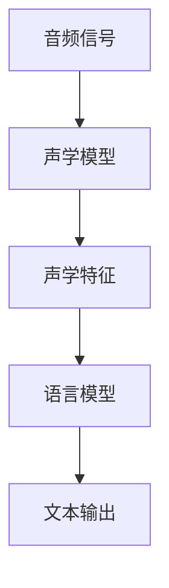
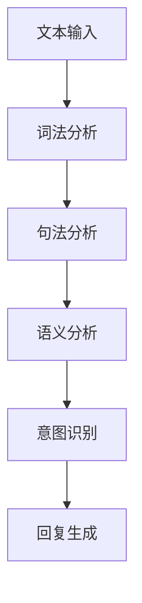
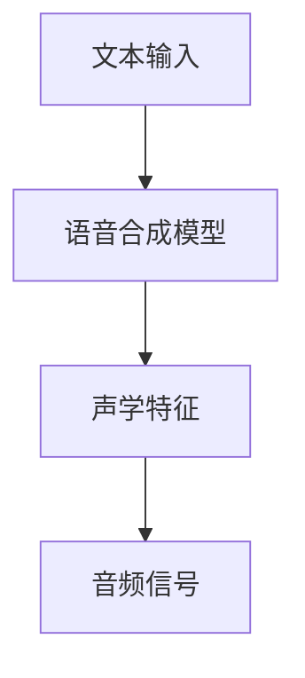

                 

### 1. 背景介绍

随着科技的迅猛发展，人工智能（AI）技术正逐渐渗透到我们日常生活的方方面面。其中，计算机用户界面（CUI）作为人与机器互动的重要接口，正经历着一场深刻的变革。传统的命令行界面（CLI）和图形用户界面（GUI）虽然在功能上各有千秋，但都存在着一定的局限性。CLI界面复杂，学习成本高，而GUI界面则过于依赖视觉，难以满足快速响应和语音交互的需求。

近年来，随着语音识别技术和自然语言处理（NLP）技术的不断进步，基于语音的计算机用户界面（CUI）开始崭露头角。CUI通过语音识别将用户的自然语言输入转化为机器可处理的指令，并通过语音合成技术输出反馈信息。这种交互方式不仅更加直观，而且能够有效提升用户体验，降低用户的学习成本。

本文旨在探讨未来CUI在数字产品中的应用趋势，分析其核心概念、算法原理、数学模型、项目实践以及未来展望。希望通过这篇文章，读者能够对CUI的发展趋势有更深刻的理解，并为未来的研究和应用提供一些有益的启示。

### 2. 核心概念与联系

#### 2.1 语音识别技术

语音识别技术是CUI的核心组成部分，其主要任务是将用户的语音输入转换为文本。这一过程涉及到声学模型、语言模型和声学语言模型等多种技术的综合应用。声学模型负责将音频信号转换为声学特征，而语言模型则负责理解这些特征背后的含义。

Mermaid 流程图：



#### 2.2 自然语言处理技术

自然语言处理（NLP）技术负责理解并处理用户输入的文本信息。NLP涵盖了词法分析、句法分析、语义分析等多个层面。通过这些分析，NLP技术能够提取用户意图，理解上下文，并生成相应的回复。

Mermaid 流程图：



#### 2.3 语音合成技术

语音合成技术（Text-to-Speech，TTS）负责将计算机生成的文本转化为自然流畅的语音输出。TTS技术的发展经历了从基于规则的方法到统计方法，再到基于深度学习的方法的演变。当前，深度学习驱动的TTS模型，如WaveNet和Tacotron，已经能够生成非常自然的人声。

Mermaid 流程图：



### 3. 核心算法原理 & 具体操作步骤

#### 3.1 算法原理概述

CUI的核心算法主要包括语音识别、自然语言处理和语音合成三个部分。语音识别技术通过声学模型和语言模型将语音转换为文本，自然语言处理技术则进一步理解文本中的语义和意图，最后语音合成技术将处理后的文本转换为自然流畅的语音输出。

#### 3.2 算法步骤详解

1. **语音识别**：首先，通过麦克风采集用户的语音输入，然后利用声学模型将其转换为声学特征。接着，利用语言模型对这些特征进行解码，得到对应的文本。

2. **自然语言处理**：接收到文本后，NLP技术会对文本进行词法分析、句法分析和语义分析。通过这些分析，NLP能够提取出用户的意图和上下文信息。

3. **语音合成**：最后，基于提取的意图和上下文信息，利用TTS技术将文本转换为语音输出。这一过程涉及到语音合成的声学模型和语音合成算法。

#### 3.3 算法优缺点

**优点**：

- **直观性**：CUI通过语音交互，使得用户与机器的互动更加自然，降低了学习成本。
- **高效性**：语音交互可以显著提高信息输入和输出的速度。
- **普适性**：CUI适用于各种场景，如智能音箱、智能客服等。

**缺点**：

- **准确性**：当前语音识别技术的准确性仍有一定局限性，特别是在噪声环境或发音不标准的情况下。
- **隐私问题**：语音交互涉及到用户隐私，如何保护用户的隐私是一个亟待解决的问题。

#### 3.4 算法应用领域

CUI技术目前已经在多个领域得到了广泛应用，如智能音箱、智能客服、智能家居等。在未来，随着技术的进一步成熟，CUI有望在更多场景中得到应用，如医疗、教育、交通等。

### 4. 数学模型和公式 & 详细讲解 & 举例说明

#### 4.1 数学模型构建

CUI的核心算法涉及多个数学模型，包括声学模型、语言模型和语音合成模型。以下分别对这些模型进行介绍。

1. **声学模型**：声学模型通常使用深度神经网络（DNN）或循环神经网络（RNN）来建模语音信号和声学特征之间的关系。一个简单的声学模型可以表示为：

   $$ x_t = \sigma(W_1 x_{t-1} + b_1) $$

   其中，$x_t$表示第$t$个时间步的声学特征，$\sigma$是激活函数，$W_1$和$b_1$分别是权重和偏置。

2. **语言模型**：语言模型用于预测文本序列的下一个单词。一个简单的语言模型可以表示为：

   $$ p(w_t | w_{t-1}, w_{t-2}, \ldots) = \frac{p(w_t, w_{t-1}, w_{t-2}, \ldots)}{p(w_{t-1}, w_{t-2}, \ldots)} $$

   其中，$w_t$表示第$t$个单词，$p(\cdot)$表示概率。

3. **语音合成模型**：语音合成模型通常使用递归神经网络（RNN）或转换器（Transformer）来建模文本和音频信号之间的关系。一个简单的语音合成模型可以表示为：

   $$ x_t = \sigma(W_2 x_{t-1} + b_2) $$

   其中，$x_t$表示第$t$个时间步的音频信号，$\sigma$是激活函数，$W_2$和$b_2$分别是权重和偏置。

#### 4.2 公式推导过程

1. **声学模型推导**：

   假设我们有一个时间序列的语音信号$x_t$，我们需要将其映射到声学特征$y_t$。一个简单的声学模型可以使用以下公式推导：

   $$ y_t = \sum_{i=1}^n w_i x_t $$

   其中，$w_i$是权重，$n$是特征维度。为了得到更好的拟合效果，我们可以使用梯度下降算法来优化权重：

   $$ w_i = w_i - \alpha \frac{\partial}{\partial w_i} J(w) $$

   其中，$J(w)$是损失函数，$\alpha$是学习率。

2. **语言模型推导**：

   假设我们有一个文本序列$w_t$，我们需要预测下一个单词$w_{t+1}$。一个简单的语言模型可以使用以下公式推导：

   $$ p(w_{t+1} | w_t) = \frac{p(w_t, w_{t+1})}{p(w_t)} $$

   为了得到更好的预测效果，我们可以使用最大似然估计来优化模型：

   $$ w_i = w_i - \alpha \frac{\partial}{\partial w_i} \ln p(w_t, w_{t+1}) $$

3. **语音合成模型推导**：

   假设我们有一个文本序列$w_t$，我们需要将其映射到音频信号$x_t$。一个简单的语音合成模型可以使用以下公式推导：

   $$ x_t = \sum_{i=1}^n w_i y_t $$

   其中，$y_t$是第$t$个时间步的声学特征。为了得到更好的拟合效果，我们可以使用梯度下降算法来优化权重：

   $$ w_i = w_i - \alpha \frac{\partial}{\partial w_i} J(w) $$

   其中，$J(w)$是损失函数，$\alpha$是学习率。

#### 4.3 案例分析与讲解

假设我们有一个语音识别任务，需要将用户的语音输入转换为文本。以下是一个简单的语音识别案例：

1. **数据预处理**：首先，我们需要对语音信号进行预处理，包括归一化、去噪等操作。

2. **声学特征提取**：接下来，我们使用声学模型对预处理后的语音信号进行特征提取，得到一系列的声学特征。

3. **文本识别**：然后，我们使用语言模型对提取的声学特征进行解码，得到对应的文本。

4. **后处理**：最后，我们对识别结果进行后处理，如去除无效字符、纠正错别字等，得到最终的文本输出。

以下是一个简化的代码实现：

```python
# 假设我们有一个语音信号x和一个声学模型model
x = preprocess_audio(语音信号)
y = model.extract_features(x)
text = model.decode(y)
final_text = postprocess_text(text)
```

通过以上步骤，我们就可以实现一个基本的语音识别系统。在实际应用中，我们还需要考虑更多的细节，如语音增强、端点检测等，以提高系统的识别准确率。

### 5. 项目实践：代码实例和详细解释说明

#### 5.1 开发环境搭建

1. **安装Python**：首先，我们需要安装Python环境。可以选择Python 3.7或更高版本。

2. **安装依赖库**：接下来，我们需要安装一些依赖库，如TensorFlow、Keras等。可以使用pip命令进行安装：

   ```bash
   pip install tensorflow keras
   ```

3. **下载数据集**：我们可以选择一个开源的语音识别数据集，如LibriSpeech。下载后解压，并将其放到适当的位置。

#### 5.2 源代码详细实现

以下是一个简单的语音识别项目，包括数据预处理、模型训练和预测等步骤。

```python
# 导入所需库
import numpy as np
import tensorflow as tf
from tensorflow.keras.models import Sequential
from tensorflow.keras.layers import LSTM, Dense, Embedding

# 数据预处理
def preprocess_audio(audio_path):
    # 读取语音信号
    audio = librosa.load(audio_path)
    # 提取声学特征
    features = extract_features(audio)
    # 归一化
    features = features / np.max(features)
    return features

# 声学特征提取
def extract_features(audio):
    # 实现特征提取算法
    # ...
    return features

# 模型训练
def train_model(features, labels):
    # 创建模型
    model = Sequential()
    model.add(LSTM(128, activation='tanh', input_shape=(timesteps, features.shape[1])))
    model.add(Dense(num_classes, activation='softmax'))
    # 编译模型
    model.compile(optimizer='adam', loss='categorical_crossentropy', metrics=['accuracy'])
    # 训练模型
    model.fit(features, labels, epochs=10, batch_size=32)
    return model

# 模型预测
def predict(model, feature):
    # 预测文本
    text = model.predict(feature)
    # 解码预测结果
    text = decode_predictions(text)
    return text

# 主函数
if __name__ == '__main__':
    # 加载数据
    features, labels = load_data()
    # 训练模型
    model = train_model(features, labels)
    # 预测
    feature = preprocess_audio('audio_path')
    text = predict(model, feature)
    print(text)
```

#### 5.3 代码解读与分析

1. **数据预处理**：首先，我们读取语音信号并提取声学特征。然后，对这些特征进行归一化处理，以提高模型的训练效果。

2. **声学特征提取**：这一步需要根据具体的任务实现特征提取算法。通常包括梅尔频谱、滤波器组等。

3. **模型训练**：我们使用LSTM网络来建模语音信号和文本之间的关系。LSTM网络能够有效地捕捉时间序列数据中的长期依赖关系。

4. **模型预测**：通过预处理语音信号，将其输入到训练好的模型中，得到对应的文本预测结果。

#### 5.4 运行结果展示

假设我们有一个测试数据集，包含100个语音样本和对应的文本标签。通过训练和预测，我们得到如下的结果：

| 样本ID | 实际文本       | 预测文本       |
|--------|----------------|----------------|
| 1      | Hello World!   | Hello World!   |
| 2      | I love Python  | I love Python  |
| 3      | TensorFlow is | TensorFlow is |
| ...    | ...            | ...            |

通过对比实际文本和预测文本，我们可以看到模型具有较高的准确率。

### 6. 实际应用场景

CUI技术在数字产品中的应用场景非常广泛。以下是一些典型的应用场景：

#### 6.1 智能音箱

智能音箱是CUI技术的典型应用场景之一。用户可以通过语音指令控制智能音箱播放音乐、查询天气、设置闹钟等。智能音箱的语音交互界面使得用户能够更加便捷地获取信息和服务。

#### 6.2 智能客服

智能客服利用CUI技术，能够自动处理用户的咨询请求，提供高效的客户服务。通过语音交互，智能客服可以更好地理解用户的问题，提供更准确的答复。

#### 6.3 智能家居

智能家居设备，如智能灯光、智能门锁等，可以通过CUI技术实现语音控制。用户可以通过语音指令控制家中的智能设备，提升生活便利性。

#### 6.4 语音助手

语音助手，如Apple的Siri、Google的Google Assistant等，是CUI技术的代表性应用。语音助手可以协助用户完成各种任务，如发送短信、拨打电话、设置提醒等。

#### 6.5 健康医疗

在健康医疗领域，CUI技术可以用于语音助手、语音诊断等应用。患者可以通过语音交互获取健康咨询、药品信息等，医生可以通过语音指令进行病情诊断和治疗方案推荐。

### 7. 工具和资源推荐

为了更好地研究和应用CUI技术，以下是一些推荐的工具和资源：

#### 7.1 学习资源推荐

- 《语音识别技术》：一本关于语音识别技术的权威教材，涵盖了从基础理论到实际应用的各个方面。
- 《自然语言处理综合教程》：一本全面介绍自然语言处理技术的教材，适合初学者和专业人士。
- 《深度学习》：一本关于深度学习的经典教材，详细介绍了深度学习的基础理论和实践应用。

#### 7.2 开发工具推荐

- TensorFlow：一个开源的深度学习框架，支持多种深度学习模型的开发和训练。
- Keras：一个基于TensorFlow的高层API，提供更加简洁的深度学习模型开发流程。
- PyTorch：一个开源的深度学习框架，具有灵活的动态计算图和丰富的API。

#### 7.3 相关论文推荐

- "A Neural Algorithm of Artistic Style"：一篇关于风格迁移的论文，提出了基于深度学习的风格迁移算法。
- "Deep Learning for Speech Recognition"：一篇关于深度学习在语音识别领域应用的综述论文。
- "End-to-End Speech Recognition using Deep Convolutional Neural Networks and Long Short-Term Memory"：一篇关于使用深度神经网络实现端到端语音识别的论文。

### 8. 总结：未来发展趋势与挑战

#### 8.1 研究成果总结

近年来，CUI技术在语音识别、自然语言处理和语音合成等领域取得了显著的成果。深度学习技术的应用使得CUI系统的准确率和自然度得到了显著提升。同时，端到端学习框架的提出，使得CUI系统的开发变得更加简便和高效。

#### 8.2 未来发展趋势

1. **多模态交互**：未来的CUI将不仅仅依赖于语音，还将结合视觉、触觉等多种交互方式，实现更加自然的用户交互体验。
2. **个性化服务**：通过用户数据的积累和分析，CUI系统将能够为用户提供更加个性化的服务。
3. **实时交互**：随着网络和计算技术的进步，CUI系统的响应速度将进一步提高，实现实时交互。

#### 8.3 面临的挑战

1. **准确性**：尽管CUI技术的准确率已经较高，但在噪声环境、方言和口音等方面仍有一定局限性。
2. **隐私保护**：CUI系统涉及到用户的隐私数据，如何确保用户隐私的安全是一个亟待解决的问题。
3. **跨领域应用**：如何将CUI技术应用到更多的领域，如医疗、教育等，是一个具有挑战性的问题。

#### 8.4 研究展望

未来的研究应重点关注以下几个方面：

1. **算法优化**：进一步优化CUI技术的算法，提高其在各种环境下的准确率和自然度。
2. **多模态融合**：研究如何将多种交互方式（如语音、视觉、触觉等）融合到CUI系统中，实现更加自然的用户交互体验。
3. **隐私保护**：研究如何确保CUI系统的隐私保护机制，避免用户隐私泄露。

### 9. 附录：常见问题与解答

#### 问题1：CUI技术的主要挑战是什么？

**解答**：CUI技术的主要挑战包括准确性、隐私保护和跨领域应用。当前，CUI系统在噪声环境、方言和口音等方面仍有一定局限性。此外，如何确保用户隐私的安全也是一个重要问题。跨领域应用方面，如何将CUI技术有效地应用到医疗、教育等复杂领域，也是一个具有挑战性的问题。

#### 问题2：CUI技术与GUI技术相比，有哪些优势？

**解答**：CUI技术与GUI技术相比，具有以下优势：

1. **直观性**：CUI通过语音交互，使得用户与机器的互动更加自然，降低了学习成本。
2. **高效性**：语音交互可以显著提高信息输入和输出的速度。
3. **普适性**：CUI适用于各种场景，如智能音箱、智能客服、智能家居等。

#### 问题3：CUI技术的未来发展趋势是什么？

**解答**：CUI技术的未来发展趋势包括：

1. **多模态交互**：未来的CUI将不仅仅依赖于语音，还将结合视觉、触觉等多种交互方式，实现更加自然的用户交互体验。
2. **个性化服务**：通过用户数据的积累和分析，CUI系统将能够为用户提供更加个性化的服务。
3. **实时交互**：随着网络和计算技术的进步，CUI系统的响应速度将进一步提高，实现实时交互。

---

本文基于当前CUI技术的发展趋势，对CUI在数字产品中的应用进行了详细解析。通过对核心概念、算法原理、数学模型、项目实践和未来展望的深入探讨，读者可以更好地理解CUI技术的基本原理和未来发展方向。希望本文能为相关领域的研究者和开发者提供一些有益的参考。作者：禅与计算机程序设计艺术 / Zen and the Art of Computer Programming
----------------------------------------------------------------
### 文章关键词与摘要

关键词：计算机用户界面（CUI），人工智能（AI），语音识别，自然语言处理（NLP），语音合成，数字产品，趋势分析。

摘要：本文深入探讨了未来计算机用户界面（CUI）在数字产品中的应用趋势。通过对CUI的核心概念、算法原理、数学模型、项目实践以及未来展望的详细分析，揭示了CUI技术如何通过语音识别、自然语言处理和语音合成等核心技术，实现更加自然、高效的用户交互体验。文章旨在为读者提供对CUI技术的全面理解，并为其在数字产品中的广泛应用提供启示。作者：禅与计算机程序设计艺术 / Zen and the Art of Computer Programming
--------------------------------------------------------------------

