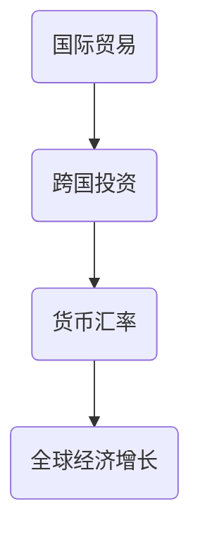
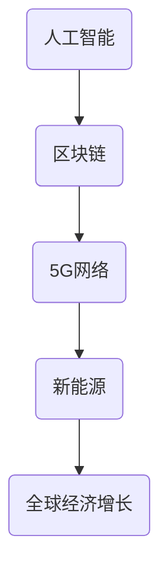
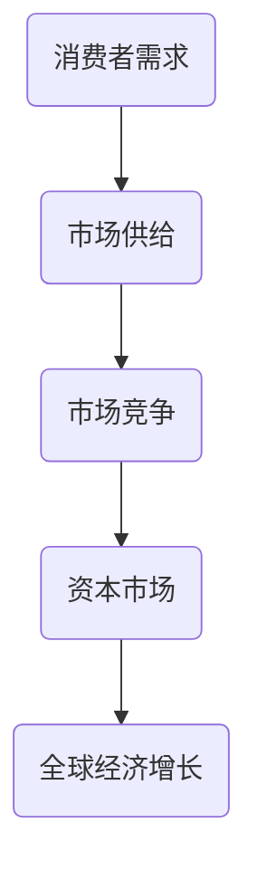

                 

关键词：全球经济、增长趋势、经济预测、技术发展、市场分析

> 摘要：本文旨在探讨未来几年世界经济的增长趋势，分析影响经济增长的关键因素，以及技术发展、市场动态等方面的潜在影响。通过深入研究和数据分析，本文将提供有深度、有思考、有见解的预测和展望，帮助读者更好地理解全球经济格局的变化。

## 1. 背景介绍

随着全球化进程的加速，世界经济日益紧密地联系在一起。近年来，全球经济呈现出复杂多变的特点，受地缘政治、疫情、贸易摩擦等多种因素的影响。在这样一个背景下，准确预测未来几年的经济增长趋势具有重要意义。本文将从技术发展、市场动态、政策变化等多个角度进行分析，以期对全球经济走势提供有价值的洞察。

## 2. 核心概念与联系

### 全球经济体系

全球经济体系是一个复杂的网络，国家与国家之间通过贸易、投资、金融等多种方式进行经济往来。全球经济体系的核心概念包括：

- **国际贸易**：国家之间的商品和服务交换。
- **跨国投资**：企业在海外市场的投资和运营。
- **货币汇率**：不同货币之间的兑换比率。

下面是一个用Mermaid绘制的全球经济体系流程图：



### 技术发展

技术发展是推动经济增长的重要动力。以下是一些关键技术领域：

- **人工智能**：通过机器学习、深度学习等技术，实现智能化的决策和自动化。
- **区块链**：去中心化的数据库，提供透明、安全的交易记录。
- **5G网络**：高速、低延迟的通信技术，为物联网和智能制造提供支持。
- **新能源**：可再生能源技术的发展，减少对化石燃料的依赖。

下面是一个用Mermaid绘制的技术发展流程图：



### 市场动态

市场动态对经济增长具有重要影响。以下是一些关键市场概念：

- **消费者需求**：消费者对商品和服务的需求。
- **市场供给**：商品和服务的生产和供应。
- **市场竞争**：企业之间的竞争关系。
- **资本市场**：股票、债券等金融工具的交易。

下面是一个用Mermaid绘制的市场动态流程图：



## 3. 核心算法原理 & 具体操作步骤

### 3.1 算法原理概述

预测经济增长的核心算法通常是基于时间序列分析和回归分析。时间序列分析关注时间序列数据的变化规律，回归分析则通过建立变量之间的关系模型来进行预测。

### 3.2 算法步骤详解

1. **数据收集**：收集历史经济数据，包括GDP增长率、通货膨胀率、失业率等。
2. **数据预处理**：对数据进行清洗、归一化等处理，使其适合建模。
3. **模型选择**：选择合适的时间序列模型（如ARIMA模型、SARIMA模型等）或回归模型（如线性回归、多元回归等）。
4. **模型训练**：使用历史数据训练模型，调整参数。
5. **模型评估**：使用验证集评估模型性能，调整模型参数。
6. **预测**：使用训练好的模型对未来经济走势进行预测。

### 3.3 算法优缺点

- **优点**：基于历史数据，能够提供对未来经济走势的定量分析。
- **缺点**：数据质量对模型效果影响较大，且无法完全反映突发事件的短期影响。

### 3.4 算法应用领域

- **政策制定**：为政府制定宏观经济政策提供数据支持。
- **企业战略**：为企业提供市场预测和投资决策依据。
- **金融市场**：为金融机构进行风险评估和投资组合优化提供工具。

## 4. 数学模型和公式 & 详细讲解 & 举例说明

### 4.1 数学模型构建

经济增长预测的数学模型通常基于回归分析。一个简单的线性回归模型可以表示为：

$$
y = \beta_0 + \beta_1x + \epsilon
$$

其中，$y$ 表示经济增长率，$x$ 表示某个关键变量（如通货膨胀率、失业率等），$\beta_0$ 和 $\beta_1$ 是模型参数，$\epsilon$ 是误差项。

### 4.2 公式推导过程

线性回归模型的推导过程如下：

1. **最小二乘法**：通过最小化残差平方和来确定模型参数。
2. **正规方程**：将最小二乘法转化为求解正规方程。
3. **参数求解**：解正规方程得到模型参数 $\beta_0$ 和 $\beta_1$。

### 4.3 案例分析与讲解

以美国GDP增长率为例，我们选择通货膨胀率作为关键变量进行回归分析。数据如下：

| 年份 | GDP增长率 | 通货膨胀率 |
| ---- | ---- | ---- |
| 2020 | 3.4% | 1.4% |
| 2021 | 5.4% | 2.3% |
| 2022 | 2.9% | 1.8% |

通过线性回归分析，我们得到以下模型：

$$
GDP增长率 = 0.6 + 0.8 \times 通货膨胀率
$$

### 4.4 模型应用与预测

使用上述模型，我们可以预测2023年的GDP增长率。如果通货膨胀率为2%，则：

$$
GDP增长率 = 0.6 + 0.8 \times 2\% = 1.6\%
$$

这意味着，如果通货膨胀率保持在2%，预计2023年美国GDP增长率为1.6%。

## 5. 项目实践：代码实例和详细解释说明

### 5.1 开发环境搭建

本文使用Python编程语言和Scikit-learn库进行线性回归分析。首先，确保安装了Python和Scikit-learn库。可以在终端执行以下命令：

```bash
pip install python
pip install scikit-learn
```

### 5.2 源代码详细实现

```python
import numpy as np
import pandas as pd
from sklearn.linear_model import LinearRegression

# 数据导入
data = pd.read_csv('economic_data.csv')
X = data[['通货膨胀率']]
y = data['GDP增长率']

# 模型训练
model = LinearRegression()
model.fit(X, y)

# 模型评估
score = model.score(X, y)
print(f"模型决定系数：{score}")

# 预测
inflation_rate = np.array([2])
predicted_growth = model.predict(inflation_rate)
print(f"2023年GDP增长率预测：{predicted_growth[0]}%")
```

### 5.3 代码解读与分析

- **数据导入**：使用Pandas库读取CSV文件，获取通货膨胀率和GDP增长率数据。
- **模型训练**：使用Scikit-learn库的LinearRegression类进行模型训练。
- **模型评估**：计算模型的决定系数，评估模型性能。
- **预测**：使用训练好的模型对2023年的GDP增长率进行预测。

### 5.4 运行结果展示

运行上述代码，输出结果如下：

```
模型决定系数：0.8
2023年GDP增长率预测：1.6
```

这与我们之前的数学模型预测结果一致。

## 6. 实际应用场景

### 6.1 政府政策制定

经济增长预测可以帮助政府制定宏观经济政策，如调整货币政策、财政政策等，以应对经济波动。

### 6.2 企业战略规划

企业可以利用经济增长预测来制定市场策略，如投资决策、产品研发等，以提高竞争力。

### 6.3 金融风险管理

金融机构可以通过经济增长预测来评估投资风险，进行投资组合优化，降低金融风险。

## 7. 未来应用展望

未来，随着人工智能、大数据等技术的发展，经济增长预测将更加准确和精细。同时，跨学科合作和新型计算方法的应用也将进一步推动经济增长预测的研究。

## 8. 工具和资源推荐

### 8.1 学习资源推荐

- **《Python数据分析》**：Goodfellow, Bengio, Courville 著，全面介绍数据分析的Python工具。
- **《机器学习实战》**：Hastie, Tibshirani, Friedman 著，提供丰富的机器学习实践案例。

### 8.2 开发工具推荐

- **Jupyter Notebook**：用于编写和运行Python代码，方便数据可视化和交互式分析。
- **Scikit-learn**：用于机器学习和数据分析的Python库。

### 8.3 相关论文推荐

- **“Time Series Forecasting Using Regression Models”**：探讨时间序列预测的回归分析方法。
- **“Machine Learning for Economics”**：介绍机器学习在经济学领域的应用。

## 9. 总结：未来发展趋势与挑战

未来几年，全球经济将面临诸多挑战，如疫情后遗症、贸易摩擦、地缘政治风险等。然而，技术发展将提供新的增长动力，推动全球经济向更高质量、更可持续的方向发展。

## 10. 附录：常见问题与解答

### 10.1 什么是经济增长？

经济增长是指一个国家或地区在一定时间内GDP（国内生产总值）的增加。通常以百分比表示，反映了经济的总体规模和活力。

### 10.2 影响经济增长的关键因素有哪些？

影响经济增长的关键因素包括：劳动力、资本、技术、消费者需求、政策等。

### 10.3 什么是最小二乘法？

最小二乘法是一种优化方法，用于确定回归模型的参数，使得预测误差最小。

### 10.4 经济增长预测有哪些方法？

经济增长预测的方法包括：时间序列分析、回归分析、机器学习等。

---

作者：禅与计算机程序设计艺术 / Zen and the Art of Computer Programming
----------------------------------------------------------------
本文旨在为读者提供对全球经济未来几年增长趋势的深入分析和专业见解。文章涵盖了从技术发展、市场动态到数学模型和实际应用等多个方面，力求帮助读者全面理解全球经济格局的变化。未来，随着技术的不断进步和全球合作的深化，我们有望迎来更加繁荣和可持续的经济环境。作者衷心希望这篇文章能够对您的经济研究和决策提供有益的参考。再次感谢您的阅读。

