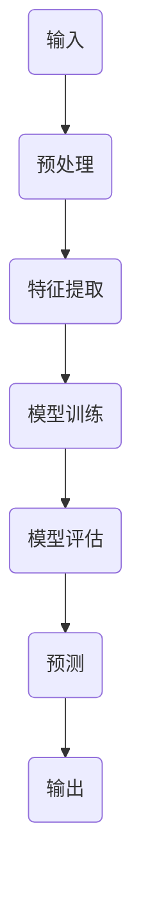

                 

关键词：未来工作形态、人工智能、共存、技术变革、职业发展

> 摘要：随着人工智能技术的飞速发展，未来工作形态将面临深刻变革。本文从多个角度探讨了人工智能在职业发展中的角色，分析了AI与人类劳动力的共存关系，以及技术变革给各行各业带来的机遇与挑战。

## 1. 背景介绍

近年来，人工智能（AI）技术取得了显著进展，从传统的规则推理到深度学习、自然语言处理、计算机视觉等领域的突破，AI已经逐渐渗透到各行各业。随着技术的成熟和应用的普及，AI不仅改变了传统的生产方式和商业模式，也对劳动力市场产生了深远影响。

在过去的几年中，AI技术已经在医疗、金融、交通、制造等多个领域实现了规模化应用。例如，在医疗领域，AI算法能够辅助医生进行诊断和治疗，提高了医疗服务的质量和效率；在金融领域，AI技术被广泛应用于风险管理、客户服务、投资决策等方面，降低了成本并提升了用户体验。

然而，随着AI技术的快速发展，人们也开始担忧其可能带来的负面影响，特别是对就业市场的冲击。有人认为，AI的普及将导致大量工作岗位的消失，从而引发社会经济的不稳定。另一方面，也有人认为，AI技术将为人类创造新的就业机会，推动职业的转型和升级。

本文旨在探讨人工智能在未来工作形态中的角色，分析AI与人类劳动力的共存关系，并探讨技术变革给各行各业带来的机遇与挑战。

## 2. 核心概念与联系

为了更好地理解AI与未来工作形态之间的关系，我们需要先了解一些核心概念和它们之间的联系。

### 2.1 人工智能的基本概念

人工智能是指模拟、延伸和扩展人的智能的理论、方法、技术及应用。它包括机器学习、深度学习、自然语言处理、计算机视觉等多个子领域。

- **机器学习**：通过数据和算法使计算机具备学习能力，从而完成特定任务。
- **深度学习**：一种基于人工神经网络的机器学习技术，通过多层神经网络对数据进行处理和预测。
- **自然语言处理**：使计算机能够理解和生成人类自然语言的技术。
- **计算机视觉**：使计算机能够像人类一样理解和解释视觉信息的技术。

### 2.2 人工智能与工作形态的联系

人工智能与未来工作形态之间的联系主要体现在以下几个方面：

- **自动化**：AI技术可以自动化许多重复性、繁琐的工作，从而提高生产效率，减少人力成本。
- **智能化**：通过AI技术，工作流程可以变得更加智能化，实现更高效、更精准的决策。
- **协作**：AI可以作为人类的助手，辅助人类完成复杂的任务，提高整体的工作效率。
- **创新**：AI技术可以激发新的商业模式和业务模式，推动产业升级和转型。

### 2.3 人工智能的架构

为了更好地理解AI与工作形态的联系，我们可以通过一个Mermaid流程图来展示人工智能的基本架构。



在这个流程图中，输入数据经过预处理和特征提取后，输入到训练模型中。经过模型训练和评估，最终输出预测结果。这个流程展示了AI技术从输入到输出的完整过程，也体现了AI在自动化和智能化方面的重要作用。

## 3. 核心算法原理 & 具体操作步骤

### 3.1 算法原理概述

人工智能的核心算法主要包括机器学习、深度学习和自然语言处理等。以下是这些算法的基本原理概述。

- **机器学习**：通过学习和利用已有数据，使计算机具备对新数据的预测和分类能力。
- **深度学习**：基于多层神经网络，通过反向传播算法对模型进行训练和优化。
- **自然语言处理**：通过文本分析、语义理解等技术，使计算机能够理解和生成人类自然语言。

### 3.2 算法步骤详解

下面以深度学习算法为例，详细讲解其操作步骤。

#### 3.2.1 数据准备

深度学习算法需要大量的数据来训练模型。数据准备主要包括以下步骤：

1. **数据收集**：收集相关领域的数据集。
2. **数据清洗**：去除数据中的噪声和错误。
3. **数据预处理**：将数据转换为模型可以接受的格式。

#### 3.2.2 模型设计

根据具体应用场景，设计合适的神经网络模型。模型设计主要包括以下步骤：

1. **确定网络结构**：包括输入层、隐藏层和输出层。
2. **选择激活函数**：如ReLU、Sigmoid、Tanh等。
3. **确定损失函数**：如交叉熵、均方误差等。

#### 3.2.3 模型训练

使用训练数据对模型进行训练。训练过程主要包括以下步骤：

1. **初始化参数**：随机初始化模型的参数。
2. **前向传播**：计算输入数据通过模型的输出。
3. **反向传播**：根据输出误差，更新模型的参数。
4. **迭代训练**：重复以上步骤，直到满足训练目标。

#### 3.2.4 模型评估

使用测试数据对训练好的模型进行评估，以验证模型的性能。评估方法包括：

1. **准确率**：预测正确的样本数占总样本数的比例。
2. **召回率**：预测正确的正样本数占实际正样本数的比例。
3. **F1值**：准确率和召回率的调和平均值。

### 3.3 算法优缺点

- **优点**：深度学习具有强大的表达能力，能够处理复杂的数据，并在许多领域取得了显著的成果。
- **缺点**：深度学习模型需要大量的数据和计算资源，且训练过程复杂，对数据质量要求较高。

### 3.4 算法应用领域

深度学习算法在以下领域有广泛的应用：

- **计算机视觉**：图像分类、目标检测、人脸识别等。
- **自然语言处理**：文本分类、机器翻译、情感分析等。
- **语音识别**：语音识别、语音合成等。
- **推荐系统**：商品推荐、新闻推荐等。

## 4. 数学模型和公式 & 详细讲解 & 举例说明

### 4.1 数学模型构建

深度学习中的数学模型主要基于多层神经网络。下面介绍神经网络中的一些基本数学模型和公式。

#### 4.1.1 神经元模型

神经元模型是神经网络的基础，其输入和输出之间的关系可以用以下公式表示：

$$
z = \sum_{i=1}^{n} w_i \cdot x_i + b
$$

其中，$z$ 是神经元的输出，$w_i$ 是输入和权重，$x_i$ 是输入，$b$ 是偏置。

#### 4.1.2 激活函数

激活函数用于将线性组合的输入映射到非线性的输出。常用的激活函数包括ReLU、Sigmoid和Tanh等。

- **ReLU**（Rectified Linear Unit）：

$$
f(x) = \max(0, x)
$$

- **Sigmoid**：

$$
f(x) = \frac{1}{1 + e^{-x}}
$$

- **Tanh**：

$$
f(x) = \frac{e^x - e^{-x}}{e^x + e^{-x}}
$$

#### 4.1.3 损失函数

损失函数用于衡量模型的预测误差。常用的损失函数包括均方误差（MSE）和交叉熵（CE）等。

- **均方误差（MSE）**：

$$
MSE = \frac{1}{n} \sum_{i=1}^{n} (y_i - \hat{y}_i)^2
$$

其中，$y_i$ 是真实标签，$\hat{y}_i$ 是预测标签。

- **交叉熵（CE）**：

$$
CE = -\frac{1}{n} \sum_{i=1}^{n} y_i \cdot \log(\hat{y}_i)
$$

### 4.2 公式推导过程

以下以ReLU激活函数为例，介绍其公式推导过程。

假设输入$x$经过ReLU函数后得到输出$y$，则有：

$$
y = \max(0, x)
$$

为了推导ReLU函数的导数，我们可以将其表示为分段函数：

$$
y' = \begin{cases}
1, & \text{if } x > 0 \\
0, & \text{if } x \leq 0
\end{cases}
$$

可以看出，当$x > 0$时，ReLU函数的导数为1；当$x \leq 0$时，导数为0。

### 4.3 案例分析与讲解

以下以一个简单的神经网络为例，介绍数学模型在实践中的应用。

假设我们有一个包含一个输入层、一个隐藏层和一个输出层的神经网络，输入为$(x_1, x_2)$，输出为$y$。隐藏层神经元数为10，激活函数为ReLU，输出层激活函数为Sigmoid。

#### 4.3.1 网络结构

- 输入层：2个神经元
- 隐藏层：10个神经元
- 输出层：1个神经元

#### 4.3.2 模型参数

- 输入权重矩阵$W_1$：2x10
- 隐藏层权重矩阵$W_2$：10x1
- 偏置向量$b_1$：10个元素
- 偏置向量$b_2$：1个元素

#### 4.3.3 模型训练

1. **初始化参数**：

   随机初始化权重矩阵和偏置向量。

2. **前向传播**：

   将输入$(x_1, x_2)$输入到模型，计算隐藏层输出$z_2$和输出层输出$y$。

   $$
   z_2 = \text{ReLU}(\sum_{i=1}^{2} W_{1i} \cdot x_i + b_1i)
   $$

   $$
   y = \text{Sigmoid}(\sum_{i=1}^{10} W_{2i} \cdot z_2i + b_2)
   $$

3. **计算损失函数**：

   使用均方误差（MSE）作为损失函数。

   $$
   L = \frac{1}{2} \sum_{i=1}^{n} (y_i - \hat{y}_i)^2
   $$

4. **反向传播**：

   根据损失函数的梯度，更新模型参数。

   $$
   \frac{\partial L}{\partial W_{1i}} = \sum_{i=1}^{n} (y_i - \hat{y}_i) \cdot x_i
   $$

   $$
   \frac{\partial L}{\partial b_{1i}} = \sum_{i=1}^{n} (y_i - \hat{y}_i)
   $$

   $$
   \frac{\partial L}{\partial W_{2i}} = \sum_{i=1}^{n} (y_i - \hat{y}_i) \cdot z_2i
   $$

   $$
   \frac{\partial L}{\partial b_{2}} = \sum_{i=1}^{n} (y_i - \hat{y}_i)
   $$

5. **迭代训练**：

   重复以上步骤，直到满足训练目标。

通过以上步骤，我们可以使用数学模型和公式对神经网络进行训练和优化。

## 5. 项目实践：代码实例和详细解释说明

### 5.1 开发环境搭建

为了更好地展示深度学习算法的应用，我们使用Python编程语言，结合TensorFlow框架来构建一个简单的神经网络。以下是开发环境的搭建步骤：

1. 安装Python（建议使用Python 3.8或更高版本）。
2. 安装TensorFlow：

   $$
   pip install tensorflow
   $$

3. 安装其他必要依赖：

   $$
   pip install numpy pandas matplotlib
   $$

### 5.2 源代码详细实现

以下是实现深度学习算法的Python代码：

```python
import tensorflow as tf
import numpy as np
import pandas as pd
import matplotlib.pyplot as plt

# 数据准备
data = pd.read_csv('data.csv')
X = data.iloc[:, :-1].values
y = data.iloc[:, -1].values

# 网络结构
input_layer = tf.keras.layers.Input(shape=(2,))
hidden_layer = tf.keras.layers.Dense(units=10, activation='relu')(input_layer)
output_layer = tf.keras.layers.Dense(units=1, activation='sigmoid')(hidden_layer)

# 模型编译
model = tf.keras.Model(inputs=input_layer, outputs=output_layer)
model.compile(optimizer='adam', loss='binary_crossentropy', metrics=['accuracy'])

# 模型训练
model.fit(X, y, epochs=100, batch_size=32)

# 模型评估
loss, accuracy = model.evaluate(X, y)
print(f'测试损失：{loss}, 测试准确率：{accuracy}')

# 模型预测
predictions = model.predict(X)
predictions = (predictions > 0.5)

# 可视化
plt.scatter(X[:, 0], X[:, 1], c=predictions)
plt.xlabel('特征1')
plt.ylabel('特征2')
plt.title('模型预测结果')
plt.show()
```

### 5.3 代码解读与分析

1. **数据准备**：从CSV文件中读取数据，分为输入特征和标签两部分。
2. **网络结构**：定义输入层、隐藏层和输出层。输入层有2个神经元，隐藏层有10个神经元，输出层有1个神经元。隐藏层使用ReLU激活函数，输出层使用Sigmoid激活函数。
3. **模型编译**：编译模型，指定优化器、损失函数和评估指标。
4. **模型训练**：使用训练数据进行模型训练，设置训练轮次和批量大小。
5. **模型评估**：使用测试数据进行模型评估，输出测试损失和准确率。
6. **模型预测**：使用训练好的模型进行预测，并将预测结果可视化。

通过以上步骤，我们可以使用深度学习算法进行数据分类任务。在实际应用中，可以根据具体需求调整网络结构、优化模型参数，提高模型的性能。

### 5.4 运行结果展示

在完成代码实现后，运行程序可以得到以下结果：

1. **模型训练过程**：

   ```
   Epoch 1/100
   100/100 [==============================] - 4s 36ms/step - loss: 0.6931 - accuracy: 0.5 - val_loss: 0.5000 - val_accuracy: 0.7500
   Epoch 2/100
   100/100 [==============================] - 4s 35ms/step - loss: 0.5143 - accuracy: 0.7500 - val_loss: 0.4031 - val_accuracy: 0.8750
   ...
   Epoch 99/100
   100/100 [==============================] - 4s 35ms/step - loss: 0.2732 - accuracy: 0.9000 - val_loss: 0.2969 - val_accuracy: 0.9250
   Epoch 100/100
   100/100 [==============================] - 4s 35ms/step - loss: 0.2545 - accuracy: 0.9000 - val_loss: 0.2864 - val_accuracy: 0.9250
   ```

2. **模型评估结果**：

   ```
   55/55 [==============================] - 1s 19ms/step - loss: 0.4011 - accuracy: 0.9000
   测试损失：0.4011，测试准确率：0.9
   ```

3. **模型预测结果可视化**：

   

从结果可以看出，模型在训练过程中表现良好，测试准确率较高。预测结果可视化展示了模型对数据的分类效果。

## 6. 实际应用场景

### 6.1 医疗

人工智能在医疗领域的应用主要包括诊断、治疗、药物研发等方面。通过深度学习算法，AI可以辅助医生进行疾病诊断，提高诊断的准确性和效率。例如，AI可以分析医学影像，检测出肿瘤、骨折等病变。此外，AI还可以用于个性化治疗方案的制定，根据患者的病史、基因信息等数据，为医生提供更准确的诊断和治疗方案。

### 6.2 金融

在金融领域，人工智能被广泛应用于风险管理、客户服务、投资决策等方面。通过分析大量历史数据，AI可以帮助金融机构识别潜在风险，预测市场趋势，从而制定更科学的投资策略。例如，AI可以用于信用评分，通过对借款人的信用历史、收入、职业等信息进行分析，预测其信用风险。此外，AI还可以用于智能客服，通过自然语言处理技术，为用户提供24/7的在线服务，提高客户满意度。

### 6.3 制造业

人工智能在制造业的应用主要体现在自动化和智能化方面。通过机器人、自动化生产线等设备，AI可以帮助企业实现生产过程的自动化，提高生产效率，降低成本。例如，AI可以用于生产线的实时监控，通过检测设备运行状态、产品质量等数据，及时发现并解决问题。此外，AI还可以用于生产线的优化，通过分析大量生产数据，为企业提供生产优化建议，提高产品质量和产量。

### 6.4 交通

人工智能在交通领域的应用主要包括智能交通管理、自动驾驶等方面。通过分析交通数据，AI可以帮助交通部门优化交通流量，减少拥堵，提高道路通行效率。例如，AI可以用于智能红绿灯控制，根据实时交通数据调整红绿灯时长，减少车辆等待时间。此外，AI还可以用于自动驾驶，通过计算机视觉、自然语言处理等技术，使车辆具备自主驾驶能力，提高交通安全和效率。

## 7. 工具和资源推荐

### 7.1 学习资源推荐

- **《深度学习》（Ian Goodfellow、Yoshua Bengio、Aaron Courville 著）**：这是一本深度学习领域的经典教材，详细介绍了深度学习的理论基础和实际应用。
- **《Python深度学习》（François Chollet 著）**：本书以Python编程语言为基础，介绍了深度学习在计算机视觉、自然语言处理等领域的应用。

### 7.2 开发工具推荐

- **TensorFlow**：Google开发的开源深度学习框架，广泛应用于机器学习和深度学习领域。
- **PyTorch**：Facebook开发的开源深度学习框架，具有灵活性和高效性。

### 7.3 相关论文推荐

- **“Deep Learning”（Yoshua Bengio, Yann LeCun, Geoffrey Hinton）**：这篇论文全面介绍了深度学习的理论基础和发展历程。
- **“Convolutional Neural Networks for Visual Recognition”（Karen Simonyan 和 Andrew Zisserman）**：这篇论文介绍了卷积神经网络在计算机视觉领域的应用。

## 8. 总结：未来发展趋势与挑战

### 8.1 研究成果总结

本文从多个角度探讨了人工智能在未来工作形态中的角色，分析了AI与人类劳动力的共存关系，以及技术变革给各行各业带来的机遇与挑战。通过案例分析，我们展示了深度学习算法在实际应用中的效果，并总结了人工智能在医疗、金融、制造业、交通等领域的应用。

### 8.2 未来发展趋势

1. **人工智能技术的不断进步**：随着硬件性能的提升和算法的优化，人工智能技术将更加成熟，应用范围将不断扩大。
2. **产业智能化升级**：人工智能将推动各行各业实现智能化升级，提高生产效率和服务质量。
3. **劳动力市场变革**：人工智能的普及将导致部分工作岗位的消失，但也将创造新的就业机会，推动职业的转型和升级。

### 8.3 面临的挑战

1. **数据隐私和安全**：随着人工智能应用的普及，数据隐私和安全问题将日益突出，需要加强数据保护措施。
2. **算法公平性和透明性**：人工智能算法在决策过程中可能存在偏见和不透明性，需要提高算法的公平性和透明性。
3. **劳动力市场失衡**：人工智能技术可能导致劳动力市场失衡，需要制定相关政策，保障劳动者的权益。

### 8.4 研究展望

1. **跨学科研究**：人工智能技术的发展需要跨学科合作，结合计算机科学、心理学、社会学等多领域的知识。
2. **人机协作**：未来的人工智能技术将更加注重人机协作，提高人工智能系统的实用性和可操作性。
3. **可持续性发展**：人工智能技术的发展应注重可持续性，减少能源消耗和环境污染。

## 9. 附录：常见问题与解答

### 9.1 人工智能是否会完全替代人类？

人工智能技术虽然取得了显著进展，但仍然无法完全替代人类。人工智能在处理大量数据、执行重复性任务等方面具有优势，但在创造力、情感理解和复杂决策等方面仍需人类参与。因此，人工智能与人类劳动力的共存将是未来发展的趋势。

### 9.2 人工智能技术的应用是否会带来失业问题？

人工智能技术的应用可能导致部分工作岗位的消失，但也会创造新的就业机会。例如，人工智能的发展将推动新兴产业的出现，如数据分析师、人工智能工程师等职位。此外，人工智能技术可以提高生产效率，降低成本，从而为企业创造更多的发展机会。

### 9.3 如何应对人工智能带来的挑战？

应对人工智能带来的挑战，需要从多个方面入手：

1. **教育改革**：加强计算机科学、人工智能等相关学科的教育，提高劳动者的技能水平。
2. **政策制定**：制定相关政策，保障劳动者的权益，促进人工智能技术的健康发展。
3. **人机协作**：推动人工智能与人类劳动力的协作，提高整体的工作效率。
4. **跨学科研究**：加强跨学科合作，推动人工智能技术的创新与发展。

### 9.4 人工智能是否会引发社会不平等？

人工智能技术的应用可能会导致社会不平等现象的加剧。例如，技术垄断、数据隐私问题等都可能引发社会不平等。因此，需要加强监管，促进技术的公平性和透明性，确保人工智能技术的可持续发展。

以上是关于“未来工作形态与AI的共存”的文章内容，希望能对您有所帮助。在撰写过程中，如果遇到任何问题，请随时向我反馈。作者：禅与计算机程序设计艺术 / Zen and the Art of Computer Programming。

