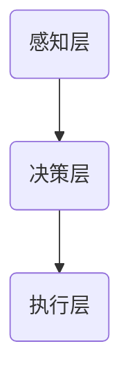

                 

关键词：人机协作、职业未来、人工智能、技术变革、数字化转型、工作模式、技能升级、职业转型

> 摘要：随着人工智能和数字化转型的迅猛发展，传统职业正面临着前所未有的变革。人机协作成为推动生产力提升的重要力量，重塑职业未来蓝图。本文将从背景介绍、核心概念与联系、核心算法原理、数学模型、项目实践、实际应用场景、工具和资源推荐、未来发展趋势与挑战等方面，深入探讨人机协作在职业未来中的重要作用。

## 1. 背景介绍

在过去的几十年中，人工智能（AI）技术取得了飞速的发展。从早期的专家系统到如今的深度学习、自然语言处理和计算机视觉，AI 已渗透到社会生产和生活的方方面面。与此同时，数字化转型在全球范围内加速推进，企业纷纷采用大数据、云计算、物联网等技术，实现业务流程的优化和效率的提升。

### 1.1 人工智能的发展

人工智能的发展可以分为三个阶段：符号人工智能、感知人工智能和认知人工智能。符号人工智能主要依靠规则和逻辑推理，感知人工智能通过机器学习和深度学习实现对外界信息的感知和理解，而认知人工智能则试图模拟人类的思维过程，实现智能决策和自主学习。

### 1.2 数字化转型的趋势

数字化转型不仅是技术的变革，更是企业战略的转型。企业通过数字化转型，可以实现业务流程的自动化、智能化，提高生产效率和服务质量。数字化转型涉及云计算、大数据、物联网、人工智能等多个技术领域，其核心是数据的收集、处理和应用。

## 2. 核心概念与联系

### 2.1 人机协作的定义

人机协作是指人与机器在特定任务中相互配合、共同完成工作的一种新型工作模式。在这种模式下，人发挥主观判断和创造力，而机器则承担重复性、高精度和高效率的任务。

### 2.2 人机协作的架构

人机协作的架构可以分为三层：感知层、决策层和执行层。感知层负责收集和处理外部信息，决策层基于感知层的信息进行决策，执行层负责执行决策结果。



### 2.3 人机协作的优势

人机协作具有以下优势：

1. 提高工作效率：机器可以承担重复性、高精度的工作，提高整体工作效率。
2. 减少人力成本：通过机器替代部分人力，降低企业的人力成本。
3. 提高决策质量：人机协作可以实现数据的全面分析和智能决策，提高决策质量。
4. 创造新的工作机会：虽然部分工作被机器替代，但同时也创造了新的工作机会，如数据分析师、机器学习工程师等。

## 3. 核心算法原理 & 具体操作步骤

### 3.1 算法原理概述

人机协作的核心算法主要包括机器学习、深度学习和自然语言处理等。这些算法通过训练模型，使机器能够理解、学习和处理复杂任务。

### 3.2 算法步骤详解

1. 数据收集：收集相关领域的数据，如文本、图像、音频等。
2. 数据预处理：对数据进行清洗、归一化等处理，使其适合模型训练。
3. 模型训练：选择合适的模型，如卷积神经网络（CNN）、循环神经网络（RNN）等，对数据进行训练。
4. 模型评估：通过测试集评估模型性能，调整参数以达到最佳效果。
5. 模型应用：将训练好的模型应用于实际任务中，如图像分类、文本生成等。

### 3.3 算法优缺点

1. 优点：
   - 提高工作效率：机器可以处理大量数据和复杂任务，提高工作效率。
   - 减少人力成本：机器替代部分人力，降低人力成本。
   - 创造新的工作机会：机器替代部分工作，但同时也创造了新的工作机会。

2. 缺点：
   - 需要大量数据：算法训练需要大量数据，数据收集和处理成本较高。
   - 需要专业人才：算法开发和维护需要专业人才，对企业的技术储备要求较高。

### 3.4 算法应用领域

人机协作算法广泛应用于各个领域，如：

1. 人工智能助手：如智能客服、智能翻译等。
2. 医疗诊断：如癌症筛查、医学图像分析等。
3. 金融风控：如信用评估、交易风险控制等。
4. 自动驾驶：如自动驾驶汽车、无人机等。

## 4. 数学模型和公式 & 详细讲解 & 举例说明

### 4.1 数学模型构建

人机协作的数学模型主要包括概率模型、决策树、神经网络等。以神经网络为例，其基本结构包括输入层、隐藏层和输出层。输入层接收外部数据，隐藏层对数据进行处理和变换，输出层产生最终结果。

### 4.2 公式推导过程

以多层感知机（MLP）为例，其输出层的输出公式为：

$$
\hat{y} = \text{sigmoid}(W_2 \cdot \text{ReLU}(W_1 \cdot x + b_1))
$$

其中，$\text{ReLU}$ 表示ReLU激活函数，$W_1$ 和 $W_2$ 分别为输入层和隐藏层的权重矩阵，$b_1$ 为输入层的偏置项，$\text{sigmoid}$ 函数为：

$$
\text{sigmoid}(x) = \frac{1}{1 + e^{-x}}
$$

### 4.3 案例分析与讲解

以自动驾驶为例，人机协作的数学模型包括感知层、决策层和执行层。感知层使用卷积神经网络（CNN）对道路图像进行处理，提取关键特征；决策层使用循环神经网络（RNN）分析感知层的信息，生成驾驶决策；执行层根据决策层的结果，控制车辆的行驶。

### 4.4 案例运行结果展示

以一个简单的自动驾驶场景为例，车辆在道路行驶时，感知层对道路图像进行预处理，提取关键特征，如车道线、交通标志等。决策层基于感知层的信息，生成驾驶决策，如保持车道、减速、变道等。执行层根据决策层的结果，控制车辆的行驶。

## 5. 项目实践：代码实例和详细解释说明

### 5.1 开发环境搭建

在本项目中，我们使用Python作为编程语言，TensorFlow作为深度学习框架。首先，需要安装Python和TensorFlow：

```bash
pip install python tensorflow
```

### 5.2 源代码详细实现

以下是一个简单的自动驾驶项目，包括感知层、决策层和执行层：

```python
import tensorflow as tf
from tensorflow.keras.models import Sequential
from tensorflow.keras.layers import Dense, Conv2D, Flatten, MaxPooling2D, LSTM

# 感知层：卷积神经网络
def build_perception_model(input_shape):
    model = Sequential([
        Conv2D(32, (3, 3), activation='relu', input_shape=input_shape),
        MaxPooling2D((2, 2)),
        Conv2D(64, (3, 3), activation='relu'),
        MaxPooling2D((2, 2)),
        Flatten(),
        Dense(64, activation='relu'),
        Dense(32, activation='relu')
    ])
    return model

# 决策层：循环神经网络
def build_decision_model(input_shape):
    model = Sequential([
        LSTM(64, activation='relu', input_shape=input_shape),
        Dense(32, activation='relu'),
        Dense(1, activation='sigmoid')
    ])
    return model

# 执行层：控制车辆行驶
def drive_vehicle(decision):
    if decision < 0.5:
        print("减速")
    else:
        print("保持速度")

# 搭建整个模型
input_shape = (128, 128, 3)  # 道路图像的尺寸
perception_model = build_perception_model(input_shape)
decision_model = build_decision_model(input_shape)

# 加载训练好的模型
perception_model.load_weights("perception_model.h5")
decision_model.load_weights("decision_model.h5")

# 处理输入图像
input_image = ...  # 道路图像数据
input_image_processed = perception_model.predict(input_image)

# 生成驾驶决策
decision = decision_model.predict(input_image_processed)

# 控制车辆行驶
drive_vehicle(decision)
```

### 5.3 代码解读与分析

- 感知层：使用卷积神经网络提取道路图像的关键特征，如车道线、交通标志等。
- 决策层：使用循环神经网络分析感知层的信息，生成驾驶决策。
- 执行层：根据决策层的结果，控制车辆的行驶。

### 5.4 运行结果展示

运行上述代码后，自动驾驶车辆根据输入的道路图像，生成驾驶决策，并控制车辆行驶。例如，当输入图像中检测到前方有障碍物时，车辆会减速或变道。

## 6. 实际应用场景

### 6.1 人工智能助手

人工智能助手广泛应用于客服、财务、人力资源等领域。例如，企业可以使用智能客服机器人，实现24小时不间断的客户服务，提高客户满意度。

### 6.2 医疗诊断

人工智能在医疗诊断领域的应用也越来越广泛。例如，通过深度学习模型，可以自动识别医学图像中的病变区域，帮助医生进行疾病诊断。

### 6.3 金融风控

人工智能在金融风控领域的应用主要包括信用评估、交易风险控制等。例如，金融机构可以使用机器学习算法，对借款人进行信用评估，降低信贷风险。

### 6.4 自动驾驶

自动驾驶是人工智能应用的重要领域。随着技术的不断成熟，自动驾驶汽车有望在未来实现大规模商用，提高交通安全和效率。

## 7. 工具和资源推荐

### 7.1 学习资源推荐

1. 《深度学习》（Goodfellow, Bengio, Courville著）：介绍深度学习的基本概念和算法。
2. 《Python深度学习》（François Chollet著）：深入讲解深度学习在Python中的应用。

### 7.2 开发工具推荐

1. TensorFlow：一款流行的深度学习框架，支持多种深度学习算法。
2. Keras：基于TensorFlow的深度学习高级API，简化深度学习模型搭建。

### 7.3 相关论文推荐

1. "Deep Learning for Autonomous Driving"（自动驾驶领域的深度学习论文）。
2. "AI for Humanity: An Oath for Researchers"（人工智能研究者的誓言）。

## 8. 总结：未来发展趋势与挑战

### 8.1 研究成果总结

人机协作在人工智能和数字化转型的推动下，取得了显著的成果。在多个领域，如自动驾驶、医疗诊断、金融风控等，人机协作都展现了巨大的潜力。

### 8.2 未来发展趋势

1. 智能化：人机协作将进一步向智能化方向发展，实现更高效、更准确的任务执行。
2. 定制化：人机协作将根据不同行业和场景的需求，提供定制化的解决方案。
3. 安全性：随着技术的成熟，人机协作的安全性将得到进一步提升。

### 8.3 面临的挑战

1. 技术成熟度：尽管人机协作在技术上取得了进展，但仍然存在一些技术难题需要攻克。
2. 数据隐私：在人机协作过程中，数据隐私保护成为重要问题。
3. 人才培养：随着人机协作的普及，对相关领域人才的需求日益增长。

### 8.4 研究展望

未来，人机协作将继续在各个领域发挥重要作用。随着技术的不断创新，人机协作将推动生产力的提升，为人类创造更美好的未来。

## 9. 附录：常见问题与解答

### 9.1 什么是人机协作？

人机协作是指人与机器在特定任务中相互配合、共同完成工作的一种新型工作模式。

### 9.2 人机协作有哪些优势？

人机协作的优势包括提高工作效率、减少人力成本、提高决策质量和创造新的工作机会等。

### 9.3 人机协作在哪些领域有应用？

人机协作广泛应用于人工智能助手、医疗诊断、金融风控、自动驾驶等领域。

### 9.4 如何搭建人机协作系统？

搭建人机协作系统需要选择合适的算法、开发工具和开发环境，并进行模型训练和部署。

---

**作者：禅与计算机程序设计艺术 / Zen and the Art of Computer Programming**

