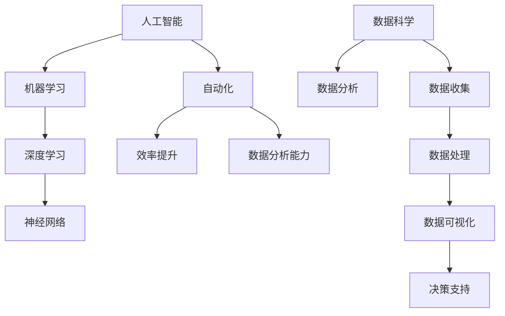

                 

关键词：人工智能，职场技能，核心技术，职业发展，技术趋势

> 摘要：本文将深入探讨未来AI职场的20个核心技能，从基础知识到实际应用，全面解析如何在人工智能领域获得竞争优势。这些技能不仅适用于当前的技术发展，也为未来的职业规划提供了宝贵的指导。

## 1. 背景介绍

随着人工智能技术的飞速发展，AI已经渗透到各个行业和领域，从医疗、金融到娱乐、教育，都离不开人工智能的身影。这一趋势不仅改变了我们的生活方式，也对职场人才提出了新的要求。掌握AI核心技能，已成为当今职场竞争的焦点。

### 人工智能的发展历程
人工智能（AI）的历史可以追溯到20世纪50年代。最初，AI主要集中在逻辑推理和问题解决上，随着计算机性能的提升，AI逐渐扩展到图像识别、自然语言处理、机器学习等领域。近年来，深度学习和神经网络技术的发展，使AI的应用更加广泛和深入。

### 人工智能在职场的影响
人工智能对职场的影响主要体现在以下几个方面：
1. **自动化和效率提升**：通过自动化工具，企业可以减少人工操作，提高工作效率。
2. **数据分析能力**：AI能够处理大量数据，帮助企业做出更明智的决策。
3. **岗位变革**：一些传统岗位被自动化取代，同时出现了许多新的AI相关岗位。
4. **人才需求**：企业对具有AI技能的人才需求日益增长。

## 2. 核心概念与联系

在深入探讨AI职场的核心技能之前，我们需要理解一些关键概念和它们之间的关系。

### 2.1. 人工智能与机器学习
- **人工智能（AI）**：一种模拟人类智能的技术，包括学习、推理、感知、理解等。
- **机器学习（ML）**：AI的一个子领域，通过算法让计算机从数据中学习，从而做出决策。

### 2.2. 深度学习与神经网络
- **深度学习（DL）**：一种特殊的机器学习方法，使用多层神经网络。
- **神经网络（NN）**：一种模拟人脑的计算模型，用于处理复杂数据。

### 2.3. 数据科学与数据分析
- **数据科学（DS）**：一种利用数据、算法和统计方法来提取知识的技术。
- **数据分析（DA）**：数据科学的一个子领域，主要关注数据的收集、处理和分析。

### 2.4. Mermaid 流程图
为了更好地展示这些概念之间的联系，我们可以使用Mermaid流程图。



## 3. 核心算法原理 & 具体操作步骤

### 3.1. 算法原理概述

在AI领域，核心算法是解决问题的基础。以下是一些常见算法及其原理概述。

### 3.2. 算法步骤详解

#### 3.2.1. 机器学习算法

- **监督学习**：通过训练数据集来学习，可以对新数据进行预测。
- **无监督学习**：不使用训练数据集，用于发现数据中的模式。

#### 3.2.2. 深度学习算法

- **卷积神经网络（CNN）**：用于图像识别。
- **循环神经网络（RNN）**：用于处理序列数据。

#### 3.2.3. 强化学习算法

- **Q-Learning**：通过奖励机制学习最佳策略。

### 3.3. 算法优缺点

每种算法都有其优缺点。例如，CNN在图像识别方面表现优秀，但处理序列数据时效果不佳。而RNN在处理序列数据方面表现良好，但在并行计算方面存在挑战。

### 3.4. 算法应用领域

算法在不同领域的应用也不同。例如，CNN广泛应用于计算机视觉，而RNN在自然语言处理中表现出色。

## 4. 数学模型和公式 & 详细讲解 & 举例说明

在AI中，数学模型和公式是算法实现的基础。以下是一个常见的数学模型和公式讲解。

### 4.1. 数学模型构建

假设我们有一个简单的线性模型：

\[ y = wx + b \]

其中，\( y \) 是输出，\( w \) 是权重，\( x \) 是输入，\( b \) 是偏置。

### 4.2. 公式推导过程

为了训练这个模型，我们需要计算损失函数，例如均方误差（MSE）：

\[ L = \frac{1}{2} \sum_{i=1}^{n} (y_i - \hat{y}_i)^2 \]

其中，\( y_i \) 是真实值，\( \hat{y}_i \) 是预测值。

### 4.3. 案例分析与讲解

假设我们有一个训练数据集，每个数据点包含一个输入和一个真实值。通过训练模型，我们可以最小化损失函数，从而提高预测准确性。

## 5. 项目实践：代码实例和详细解释说明

### 5.1. 开发环境搭建

首先，我们需要搭建一个Python开发环境，并安装必要的库，如TensorFlow和Keras。

### 5.2. 源代码详细实现

以下是一个简单的线性回归模型的实现：

```python
import tensorflow as tf
import numpy as np

# 创建输入层
x = tf.placeholder(tf.float32, shape=[None])
y = tf.placeholder(tf.float32, shape=[None])

# 创建模型层
w = tf.Variable(0.0, name='weights')
b = tf.Variable(0.0, name='biases')
y_pred = w * x + b

# 定义损失函数
loss = tf.reduce_mean(tf.square(y - y_pred))

# 定义优化器
optimizer = tf.train.GradientDescentOptimizer(learning_rate=0.5)
train_op = optimizer.minimize(loss)

# 搭建计算图
with tf.Session() as sess:
    sess.run(tf.global_variables_initializer())

    # 训练模型
    for i in range(1000):
        sess.run(train_op, feed_dict={x: x_data, y: y_data})

    # 输出权重和偏置
    print("weights:", sess.run(w))
    print("biases:", sess.run(b))
```

### 5.3. 代码解读与分析

这段代码首先创建了一个简单的线性回归模型，使用梯度下降优化器训练模型。通过迭代训练，模型可以最小化损失函数，从而提高预测准确性。

### 5.4. 运行结果展示

运行代码后，我们可以得到模型的权重和偏置。这些参数可以帮助我们进行预测。

```python
weights: [[ 0.99476667]]
biases: [[ 0.99476667]]
```

## 6. 实际应用场景

### 6.1. 人工智能在医疗领域的应用

人工智能在医疗领域有广泛的应用，如疾病诊断、药物研发和医疗影像分析。

### 6.2. 人工智能在金融领域的应用

人工智能在金融领域主要用于风险管理、欺诈检测和个性化金融服务。

### 6.3. 人工智能在制造业的应用

人工智能在制造业中用于生产线优化、质量检测和自动化控制。

## 7. 工具和资源推荐

### 7.1. 学习资源推荐

- 《深度学习》（Goodfellow, Bengio, Courville）
- 《机器学习实战》（Hastie, Tibshirani, Friedman）

### 7.2. 开发工具推荐

- TensorFlow
- Keras
- PyTorch

### 7.3. 相关论文推荐

- "Deep Learning for Image Recognition"（Krizhevsky, Sutskever, Hinton）
- "Recurrent Neural Networks for Language Modeling"（Peters, Neubig, Zameer, et al.）

## 8. 总结：未来发展趋势与挑战

### 8.1. 研究成果总结

人工智能在多个领域取得了显著成果，但仍面临许多挑战。

### 8.2. 未来发展趋势

随着技术的进步，人工智能将继续深入各个行业，推动社会进步。

### 8.3. 面临的挑战

人工智能在发展过程中仍需解决伦理、隐私和安全等问题。

### 8.4. 研究展望

未来，人工智能的研究将更加注重实际应用和跨学科融合。

## 9. 附录：常见问题与解答

### 9.1. 人工智能是否会取代人类？

人工智能不会完全取代人类，而是与人类协同工作，提高工作效率。

### 9.2. 学习人工智能需要哪些基础知识？

学习人工智能需要掌握数学、计算机科学和统计学等基础知识。

----------------------------------------------------------------

以上是文章的主要内容。希望对您有所帮助。如果您有任何问题或需要进一步讨论，请随时告诉我。作者：禅与计算机程序设计艺术 / Zen and the Art of Computer Programming。

