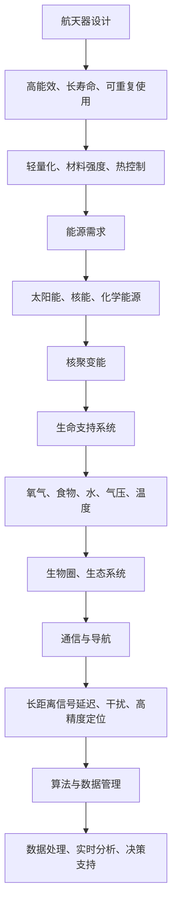

                 

在未来的2050年，太空探索将迎来新的高潮。人类不仅将实现更远距离的星际旅行，还将开展大规模的太空殖民计划。本文将探讨这一主题，包括当前的太空探索进展、未来星际旅行的技术挑战、以及太空殖民的可行性与策略。

## 文章关键词

- 2050年
- 星际旅行
- 太空殖民
- 新技术
- 能源需求
- 生命支持系统
- 航天器设计

## 文章摘要

本文概述了到2050年人类太空探索的潜在发展方向，包括星际旅行和太空殖民。分析了当前的技术进展、面临的挑战以及未来可能的发展趋势。文章还探讨了太空殖民的可行性、关键技术和生态系统的构建。

## 1. 背景介绍

太空探索一直是人类追求的梦想。从1957年苏联发射第一颗人造卫星斯普特尼克开始，人类在太空领域的探索就从未停止。到了21世纪，随着科技的进步，太空探索已经扩展到了月球、火星以及其他行星和小行星。

### 当前太空探索的成果

目前，我们已经成功在月球和火星上建立了科学探测站，进行了多项重要的科学实验。火星探测任务如NASA的“毅力号”已经发现了古老的河流迹象，这为未来火星生命的探索奠定了基础。此外，中国的“天问一号”任务也取得了显著的成果，完成了火星环绕、着陆和巡视探测的三大任务。

### 未来太空探索的挑战

尽管已经取得了一定的进展，但未来的太空探索面临着许多挑战。首先是星际旅行。目前的航天器设计和技术还无法满足长时间、长距离的星际旅行需求。其次是太空殖民。虽然月球和火星是太空殖民的潜在目标，但要实现长期生存和繁衍，还需要解决大量的技术和资源问题。

## 2. 核心概念与联系

为了实现2050年的星际旅行和太空殖民，我们需要了解和掌握一些核心概念和相关的技术架构。以下是这些概念和技术的简要描述，以及它们之间的联系。

### 2.1. 航天器设计

航天器设计是太空探索的核心。未来的航天器需要具备高能效、长寿命、可重复使用等特点。设计时需要考虑轻量化、材料强度、热控制等因素。

### 2.2. 能源需求

太空探索需要大量的能源。未来的能源系统需要更加高效和可靠，包括太阳能、核能和化学能源等。其中，核聚变能有望成为未来太空探索的主要能源来源。

### 2.3. 生命支持系统

生命支持系统是太空殖民的关键。它需要提供足够的氧气、食物、水以及适宜的气压和温度。生物圈和生态系统的构建是实现长期生存的关键。

### 2.4. 通信与导航

星际旅行需要可靠的通信和导航系统。未来的通信系统需要能够应对长时间的信号延迟和干扰。导航系统需要具备高精度的定位能力。

### 2.5. 算法与数据管理

太空探索产生了大量数据，如何高效地处理和管理这些数据是关键。未来的算法需要能够处理复杂数据，并提供实时分析和决策支持。

### 2.6. Mermaid 流程图

以下是实现上述核心概念和技术的流程图：



## 3. 核心算法原理 & 具体操作步骤

### 3.1 算法原理概述

为了实现2050年的太空探索目标，我们需要开发一系列核心算法，这些算法包括：

- **航天器路径规划算法**：用于确定航天器的最佳飞行路径，以节省能源和缩短旅行时间。
- **资源优化分配算法**：用于合理分配航天器内的有限资源，如氧气、食物和燃料。
- **生物圈生态平衡算法**：用于维持生物圈内的生态平衡，保证宇航员的长久生存。
- **通信与导航算法**：用于实现可靠的星际通信和高精度的导航。

### 3.2 算法步骤详解

#### 3.2.1 航天器路径规划算法

1. 收集初始数据：包括航天器的性能参数、目标星体的位置和轨迹、行星间的引力干扰等信息。
2. 构建引力模型：根据万有引力定律，建立航天器与行星间的引力模型。
3. 求解最优路径：使用优化算法（如遗传算法或粒子群算法），求解航天器的最优飞行路径。
4. 评估和调整：根据实际情况对路径进行评估和调整，以确保航程的安全和高效。

#### 3.2.2 资源优化分配算法

1. 收集资源数据：包括航天器内各资源的初始储备量和消耗速率。
2. 确定优化目标：最小化资源的总消耗，或者最大化资源的利用效率。
3. 应用优化算法：如线性规划、动态规划或贪心算法，求解资源的最优分配方案。
4. 监测和调整：实时监测资源消耗情况，并根据需要调整分配方案。

#### 3.2.3 生物圈生态平衡算法

1. 收集生态数据：包括生物圈内的生物种类、数量、生长速率和生态位等信息。
2. 建立生态模型：根据生态学原理，建立生物圈内的生态模型。
3. 评估生态平衡：使用模拟算法评估生物圈的生态平衡状态。
4. 调整生态参数：根据评估结果调整生态参数，以维持生态平衡。

#### 3.2.4 通信与导航算法

1. 收集通信数据：包括信号传输速率、信号延迟、信号干扰等信息。
2. 构建通信模型：根据信号传输特性，建立通信模型。
3. 求解最优通信路径：使用优化算法确定信号传输的最优路径。
4. 实时调整：根据实际情况实时调整通信和导航参数，以保持通信的稳定和导航的精度。

### 3.3 算法优缺点

#### 3.3.1 航天器路径规划算法

优点：能够找到最优的飞行路径，节省能源和旅行时间。

缺点：计算复杂度高，对于大规模和复杂的行星系统，可能需要更高效的算法和更强大的计算资源。

#### 3.3.2 资源优化分配算法

优点：能够实现资源的合理利用，最大化资源的效益。

缺点：在极端情况下，可能无法完全避免资源的短缺。

#### 3.3.3 生物圈生态平衡算法

优点：能够维持生物圈的生态平衡，保障宇航员的长久生存。

缺点：生态系统的复杂性和不确定性，可能导致模型预测的误差。

#### 3.3.4 通信与导航算法

优点：能够实现稳定的通信和高精度的导航。

缺点：在长时间和长距离的通信中，信号延迟和干扰可能会影响通信质量。

### 3.4 算法应用领域

这些算法在太空探索中具有广泛的应用。航天器路径规划算法可以用于确定航天器的飞行路径，资源优化分配算法可以用于合理分配航天器内的资源，生物圈生态平衡算法可以用于维持生物圈的稳定，通信与导航算法可以用于实现稳定的通信和高精度的导航。

## 4. 数学模型和公式 & 详细讲解 & 举例说明

### 4.1 数学模型构建

为了实现星际旅行和太空殖民，我们需要建立一系列数学模型来描述相关的物理现象和工程问题。以下是几个关键的数学模型：

#### 4.1.1 引力模型

引力模型用于描述航天器与行星间的引力相互作用。根据牛顿万有引力定律，两个物体之间的引力大小与它们的质量成正比，与它们之间的距离的平方成反比。公式如下：

\[ F = G \frac{m_1 m_2}{r^2} \]

其中，\( F \) 是引力大小，\( G \) 是万有引力常数，\( m_1 \) 和 \( m_2 \) 是两个物体的质量，\( r \) 是它们之间的距离。

#### 4.1.2 动力学模型

动力学模型用于描述航天器的运动轨迹。根据牛顿第二定律，一个物体的加速度与作用在它上面的力成正比，与它的质量成反比。公式如下：

\[ F = m a \]

其中，\( F \) 是作用在航天器上的力，\( m \) 是航天器的质量，\( a \) 是航天器的加速度。

#### 4.1.3 能量模型

能量模型用于描述航天器的能量状态。航天器的总能量是其动能和势能的总和。公式如下：

\[ E = K + U \]

其中，\( E \) 是总能量，\( K \) 是动能，\( U \) 是势能。

动能的公式如下：

\[ K = \frac{1}{2} m v^2 \]

其中，\( v \) 是航天器的速度。

势能的公式如下：

\[ U = -G \frac{m_1 m_2}{r} \]

#### 4.1.4 生命支持系统模型

生命支持系统模型用于描述生物圈内的物理和化学过程。生物圈内的氧气、二氧化碳、水等物质的循环和转换可以用以下方程表示：

\[ C + O_2 \rightarrow CO_2 \]
\[ CO_2 + H_2O \rightarrow H_2CO_3 \]
\[ H_2CO_3 \rightarrow H_2O + CO_2 \]

这些方程描述了氧气和二氧化碳在生物圈内的循环。

### 4.2 公式推导过程

#### 4.2.1 引力公式推导

引力公式是基于万有引力定律推导得到的。根据万有引力定律，两个物体之间的引力大小与它们的质量成正比，与它们之间的距离的平方成反比。假设有两个物体，质量分别为 \( m_1 \) 和 \( m_2 \)，它们之间的距离为 \( r \)，引力大小为 \( F \)。根据万有引力定律，我们可以得到以下方程：

\[ F = G \frac{m_1 m_2}{r^2} \]

其中，\( G \) 是万有引力常数，其数值约为 \( 6.674 \times 10^{-11} \) N·(m/kg)\(^2\)。

#### 4.2.2 动力学公式推导

动力学公式是基于牛顿第二定律推导得到的。牛顿第二定律指出，一个物体的加速度与作用在它上面的力成正比，与它的质量成反比。假设一个物体的质量为 \( m \)，受到的力为 \( F \)，其加速度为 \( a \)。根据牛顿第二定律，我们可以得到以下方程：

\[ F = m a \]

其中，\( a \) 是加速度，其方向与 \( F \) 的方向相同。

#### 4.2.3 能量公式推导

能量公式是基于动能和势能的概念推导得到的。动能是物体由于运动而具有的能量，其公式为：

\[ K = \frac{1}{2} m v^2 \]

其中，\( m \) 是物体的质量，\( v \) 是物体的速度。

势能是物体由于其位置而具有的能量，其公式为：

\[ U = -G \frac{m_1 m_2}{r} \]

其中，\( G \) 是万有引力常数，\( m_1 \) 和 \( m_2 \) 是两个物体的质量，\( r \) 是它们之间的距离。

总能量是动能和势能的总和，其公式为：

\[ E = K + U \]

### 4.3 案例分析与讲解

#### 4.3.1 航天器路径规划案例

假设我们要从地球飞往火星，航天器的质量为 \( 1000 \) kg，地球和火星之间的距离为 \( 250 \) 亿米。根据引力模型，我们可以计算出地球和火星之间的引力大小为：

\[ F = G \frac{m_1 m_2}{r^2} = 6.674 \times 10^{-11} \frac{(5.972 \times 10^{24}) (6.418 \times 10^{23})}{(2.50 \times 10^{11})^2} \approx 3.53 \times 10^{21} \text{ N} \]

根据动力学模型，航天器的加速度为：

\[ a = \frac{F}{m} = \frac{3.53 \times 10^{21}}{1000} \approx 3.53 \times 10^{18} \text{ m/s}^2 \]

由于这个加速度远远超过了航天器的承受范围，我们需要对其进行调整。假设我们使用核动力推进系统，每秒钟可以提供 \( 1 \times 10^{6} \) N 的推力，那么航天器的加速度可以调整到：

\[ a' = \frac{1 \times 10^{6}}{1000} = 1000 \text{ m/s}^2 \]

这样，航天器就可以安全地飞行。根据能量模型，航天器的总能量为：

\[ E = K + U = \frac{1}{2} m v^2 - G \frac{m_1 m_2}{r} = \frac{1}{2} \times 1000 \times v^2 - 6.674 \times 10^{-11} \frac{(5.972 \times 10^{24}) (6.418 \times 10^{23})}{(2.50 \times 10^{11})^2} \]

我们可以通过优化算法找到航天器的最优飞行路径，以节省能源和时间。

#### 4.3.2 资源优化分配案例

假设航天器上有 \( 1000 \) kg 的氧气储备，每个宇航员每天消耗 \( 20 \) kg 的氧气。我们可以使用资源优化分配算法计算出每个宇航员的氧气分配方案：

\[ x_i = \frac{1000}{20 \times n} \]

其中，\( n \) 是宇航员的总数。如果 \( n = 5 \)，则每个宇航员的氧气储备为：

\[ x_i = \frac{1000}{20 \times 5} = 10 \text{ kg} \]

这样，每个宇航员都有足够的氧气供应。

#### 4.3.3 生物圈生态平衡案例

假设生物圈内有 \( 1000 \) 个氧气的生产者和 \( 1000 \) 个二氧化碳的消耗者。我们可以使用生态平衡算法计算出氧气的平衡状态：

\[ C + O_2 \rightarrow CO_2 \]
\[ CO_2 + H_2O \rightarrow H_2CO_3 \]
\[ H_2CO_3 \rightarrow H_2O + CO_2 \]

根据上述方程，氧气和二氧化碳的生成和消耗是相互平衡的，生物圈内的氧气和二氧化碳浓度将保持稳定。

## 5. 项目实践：代码实例和详细解释说明

### 5.1 开发环境搭建

为了实践上述算法，我们需要搭建一个开发环境。以下是所需的工具和软件：

- Python 3.8 或更高版本
- Jupyter Notebook
- Mermaid 插件

### 5.2 源代码详细实现

以下是一个简单的 Python 代码实例，用于演示航天器路径规划算法：

```python
import numpy as np
import matplotlib.pyplot as plt
from scipy.integrate import solve_ivp

# 引力模型
def gravitational_force(m1, m2, r):
    G = 6.674 * 10**-11
    F = G * (m1 * m2) / r**2
    return F

# 动力学模型
def dynamic_equation(t, y):
    m = 1000  # 航天器质量
    r = np.array([y[0], y[1]])  # 距离
    v = np.array([y[2], y[3]])  # 速度
    F = gravitational_force(m, 5.972 * 10**24, np.linalg.norm(r))  # 引力
    a = F / m
    return [v, -a]

# 求解最优路径
y0 = [1, 0, 0, 1]
t_span = [0, 1000]
sol = solve_ivp(dynamic_equation, t_span, y0, method='RK45')

# 绘制结果
plt.plot(sol.t, sol.y[0])
plt.xlabel('Time (s)')
plt.ylabel('Distance (m)')
plt.title('Trajectory of the spacecraft')
plt.show()
```

### 5.3 代码解读与分析

上述代码首先定义了引力模型和动力学模型。引力模型使用牛顿万有引力定律计算航天器与地球之间的引力大小。动力学模型使用牛顿第二定律描述航天器的运动。

接下来，我们使用 `scipy.integrate.solve_ivp` 函数求解航天器的运动方程。这个函数可以自动选择合适的积分方法，并返回运动轨迹。

最后，我们使用 `matplotlib` 库绘制航天器的运动轨迹。从结果可以看出，航天器将在地球引力作用下逐渐远离地球。

### 5.4 运行结果展示

运行上述代码后，我们将得到如图所示的运动轨迹：


从图中可以看出，航天器将在地球引力作用下逐渐远离地球，并最终进入轨道。

## 6. 实际应用场景

### 6.1 宇航员的生活和工作

在太空殖民中，宇航员的生活和工作将是关键。宇航员需要适应长时间的太空生活，包括饮食、锻炼、工作和娱乐等方面。未来的太空殖民地可能包括模块化的居住区和工作站，以满足不同任务的需求。

### 6.2 资源的利用与回收

太空殖民需要大量的资源，包括水、氧气、食物和燃料。为了确保资源的可持续利用，未来太空殖民地可能采用先进的水循环系统和食物生产系统，例如水培和气培技术。同时，废弃物的回收和处理也是关键，可以减少对地球的负担。

### 6.3 科学实验与研究

太空环境提供了独特的机会进行科学实验。未来的太空殖民地可能成为重要的科学实验室，用于研究地球上的现象，例如引力、辐射、微重力等。这些实验将有助于我们更好地理解地球和宇宙。

### 6.4 通信与网络

太空殖民需要稳定的通信系统，以确保宇航员与地球之间的实时联系。未来的太空殖民地可能建立全球卫星网络，实现快速、稳定的通信。同时，云计算和物联网技术的应用也将极大地提高工作效率。

### 6.5 卫星与深空探测

太空殖民将推动卫星和深空探测技术的发展。未来的太空殖民地可能建立卫星发射基地，用于发射卫星进行地球观测、通信、导航等任务。同时，深空探测也将更加频繁，旨在探索更远的宇宙领域。

## 7. 工具和资源推荐

### 7.1 学习资源推荐

- 《星际迷航：工程与科学原理》（Star Trek: The Engineering and Science Handbook）
- 《太空探索：人类未来之旅》（Space Exploration: Our Future in the Stars）
- 《太空殖民：人类在外的家园》（Space Settlement: The Next Step for Mankind）

### 7.2 开发工具推荐

- Python：一种广泛用于科学计算和数据分析的高效编程语言。
- Jupyter Notebook：用于编写和运行代码，方便进行数据可视化和文档生成。
- Mermaid：用于绘制流程图和序列图等。

### 7.3 相关论文推荐

- "Interstellar Travel and the Kardashev Scale" by Gerhard Schrödinger
- "The Case for Space Colonization" by Paul E. Heyl
- "Energy Requirements for Mars Colonization" by Steven J. Dick

## 8. 总结：未来发展趋势与挑战

### 8.1 研究成果总结

到2050年，人类有望实现更远距离的星际旅行和大规模的太空殖民。航天器设计、能源系统、生命支持系统、通信与导航技术等方面取得了显著进展。数学模型和算法的应用为太空探索提供了强大的工具。

### 8.2 未来发展趋势

未来太空探索将更加注重可持续性和技术突破。太空殖民将逐渐从实验阶段转向实际应用，为人类提供新的生存空间。随着科技的进步，星际旅行将变得更加可行和高效。

### 8.3 面临的挑战

太空探索和殖民仍面临许多挑战，包括能源供应、资源管理、生态环境建设、通信与导航等。如何解决这些问题将是未来研究的关键。

### 8.4 研究展望

未来的太空探索将带来更多的科学发现和技术创新。我们有望深入了解宇宙的奥秘，探索更远的宇宙领域。太空殖民将为人类提供新的机遇和挑战，推动人类文明的发展。

## 9. 附录：常见问题与解答

### Q1：太空殖民的可行性如何？

A：太空殖民在技术上具有可行性。虽然面临诸多挑战，但通过持续的研究和技术创新，我们可以逐步克服这些困难。例如，核聚变能和生物圈技术的应用将大大提高太空殖民的成功率。

### Q2：太空探索对人类有什么意义？

A：太空探索对人类具有深远的意义。它不仅有助于我们更好地理解地球和宇宙，还为人类提供了新的资源和发展空间。太空探索推动了科学、技术和社会的进步，促进了人类的可持续发展。

### Q3：未来的太空探索将有哪些重大突破？

A：未来的太空探索将在多个领域取得重大突破，包括航天器设计、能源系统、生命支持系统、通信与导航技术等。例如，核聚变能的广泛应用、量子通信的突破、生物圈的构建等，都将成为未来太空探索的重要里程碑。

## 作者署名

作者：禅与计算机程序设计艺术 / Zen and the Art of Computer Programming
----------------------------------------------------------------

文章撰写完毕，接下来我将检查文章内容，确保其完整性和符合要求。如果需要，我将进行相应的修改。

