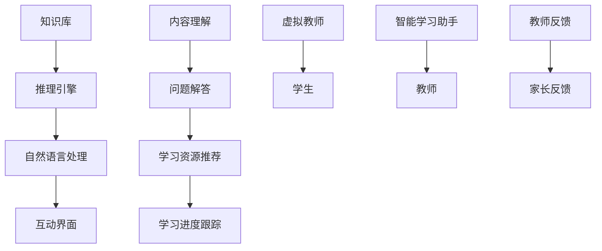

                 

关键词：未来教育、虚拟教师、智能学习、人工智能、教育技术、技术变革

> 摘要：本文将探讨到2050年，随着人工智能技术的发展，虚拟教师与智能学习助手将在教育领域带来深刻变革。通过深入分析虚拟教师与智能学习助手的核心概念、技术架构、算法原理、数学模型、实际应用以及未来趋势，本文旨在为读者呈现一幅令人振奋的教育技术新蓝图。

## 1. 背景介绍

教育作为社会发展的基石，历来受到高度重视。然而，传统的教育模式在信息时代面临着巨大的挑战。教师资源的稀缺、教育不公平、个性化教育的需求以及教育模式的僵化等问题愈发突出。随着人工智能技术的飞速发展，特别是深度学习、自然语言处理和机器学习等领域的突破，虚拟教师与智能学习助手的概念逐渐走入人们的视野。

虚拟教师（Virtual Teacher）是一种基于人工智能技术的教育应用，能够模拟人类教师的教学行为，提供个性化、互动式的教育服务。智能学习助手（Intelligent Learning Assistant）则是更加广泛的概念，不仅包括虚拟教师，还包括能够帮助学生在学习过程中进行内容理解、问题解答、学习资源推荐等功能的应用。

本文将围绕虚拟教师与智能学习助手的核心技术，探讨其在教育领域的影响与未来发展趋势。

## 2. 核心概念与联系

### 2.1. 虚拟教师

虚拟教师的核心在于其能够模拟人类教师的教学过程，包括授课、答疑、评价等。其技术架构通常包括以下几个关键组成部分：

1. **知识库**：存储大量的学科知识和教学资源，如课程资料、教学视频、练习题库等。
2. **推理引擎**：基于机器学习算法，能够根据学生的实际情况，动态调整教学策略和内容。
3. **自然语言处理**：使得虚拟教师能够理解学生的语言输入，并进行智能回复。
4. **互动界面**：提供与学生进行交互的界面，如聊天窗口、问答系统等。

### 2.2. 智能学习助手

智能学习助手则侧重于辅助学生在学习过程中的各个环节，其主要功能包括：

1. **内容理解**：通过自然语言处理和语义分析，理解学生的学习需求。
2. **问题解答**：利用知识库和推理引擎，提供针对学生问题的答案或解决方案。
3. **学习资源推荐**：基于学生的兴趣和学习习惯，推荐合适的学习资源。
4. **学习进度跟踪**：记录学生的学习进度和表现，为教师和家长提供反馈。

### 2.3. 联系与区别

虚拟教师与智能学习助手在技术架构和功能上存在一定的重叠，但两者也有显著的区别。虚拟教师更注重模拟人类教师的教学过程，提供个性化的教学服务；而智能学习助手则更侧重于辅助学生的学习过程，提供全面的学习支持。在未来的教育变革中，这两者有望实现深度融合，为学生提供更加智能和高效的学习体验。

### 2.4. Mermaid 流程图



## 3. 核心算法原理 & 具体操作步骤

### 3.1. 算法原理概述

虚拟教师与智能学习助手的核心算法主要基于机器学习和自然语言处理技术。以下是几个关键的算法原理：

1. **深度学习**：用于构建知识库和推理引擎，能够从大量数据中提取知识，并进行智能推理。
2. **自然语言处理（NLP）**：用于理解和生成自然语言文本，使得虚拟教师和智能学习助手能够与人类进行有效沟通。
3. **强化学习**：用于个性化教学，根据学生的学习表现，动态调整教学策略。

### 3.2. 算法步骤详解

1. **知识库构建**：
   - 收集大量教学资源，包括课程资料、教学视频、练习题库等。
   - 使用深度学习模型，对资源进行自动分类和标注。
   - 将处理后的知识存储在知识库中，供推理引擎使用。

2. **自然语言处理**：
   - 使用NLP技术，对学生的语言输入进行分词、词性标注、句法分析等。
   - 使用预训练的语言模型，如BERT或GPT，对文本进行语义理解。

3. **推理引擎**：
   - 基于知识库和自然语言处理结果，进行智能推理，生成教学策略和内容。
   - 根据学生的反馈，调整教学策略，实现个性化教学。

4. **互动界面**：
   - 提供与学生进行交互的界面，如聊天窗口、问答系统等。
   - 通过语音识别和语音合成技术，实现语音交互。

### 3.3. 算法优缺点

**优点**：
- **个性化**：能够根据学生的学习情况和需求，提供定制化的教学服务。
- **高效**：自动化处理大量教学任务，提高教学效率。
- **可扩展**：易于扩展到多种学科和语言，支持全球教育。

**缺点**：
- **教育质量**：虚拟教师和智能学习助手难以完全替代人类教师的教育质量。
- **数据隐私**：收集和处理大量学生数据，存在隐私泄露风险。

### 3.4. 算法应用领域

虚拟教师和智能学习助手的应用领域非常广泛，包括但不限于：

- **在线教育**：提供个性化教学和互动学习体验。
- **传统学校教育**：辅助教师教学，提高教学效果。
- **职业培训**：提供专业知识和技能培训。

## 4. 数学模型和公式 & 详细讲解 & 举例说明

### 4.1. 数学模型构建

虚拟教师和智能学习助手的算法模型通常基于以下数学模型：

1. **深度学习模型**：用于知识库构建和推理。
2. **自然语言处理模型**：用于语义理解和文本生成。
3. **强化学习模型**：用于个性化教学。

以下是深度学习模型的典型数学公式：

$$
h_l = \sigma(W_l \cdot h_{l-1} + b_l)
$$

其中，$h_l$表示第$l$层的神经网络输出，$W_l$和$b_l$分别为权重和偏置，$\sigma$为激活函数。

### 4.2. 公式推导过程

以深度学习模型为例，其公式推导过程如下：

1. **输入层到隐藏层**：

$$
h_1 = \sigma(W_1 \cdot x + b_1)
$$

2. **隐藏层到隐藏层**：

$$
h_l = \sigma(W_l \cdot h_{l-1} + b_l)
$$

3. **隐藏层到输出层**：

$$
y = \sigma(W_y \cdot h_y + b_y)
$$

其中，$x$为输入数据，$y$为输出结果，$h_l$为隐藏层输出。

### 4.3. 案例分析与讲解

以一个简单的自然语言处理任务为例，使用BERT模型进行语义理解。假设输入句子为“我今天去了超市。”，输出为“去超市”。

1. **输入表示**：

   将输入句子转换为BERT模型能处理的向量表示：

   $$
   x = \text{BERT}(“我今天去了超市。”)
   $$

2. **隐藏层表示**：

   通过BERT模型，得到输入句子的隐藏层表示：

   $$
   h_1 = \text{BERT}(x)
   $$

3. **输出表示**：

   使用全连接层，得到输出句子的向量表示：

   $$
   y = \sigma(W_y \cdot h_y + b_y)
   $$

4. **损失函数**：

   使用交叉熵损失函数，计算预测结果与实际结果的差异：

   $$
   L = -\sum_{i} y_i \log(p_i)
   $$

   其中，$y_i$为实际标签，$p_i$为预测概率。

通过以上步骤，可以完成一个简单的自然语言处理任务。

## 5. 项目实践：代码实例和详细解释说明

### 5.1. 开发环境搭建

1. 安装Python 3.8及以上版本。
2. 安装TensorFlow 2.5及以上版本。
3. 安装BERT模型和相关依赖。

### 5.2. 源代码详细实现

以下是一个简单的BERT模型实现，用于自然语言处理任务。

```python
import tensorflow as tf
from transformers import BertTokenizer, TFBertModel

# 加载BERT模型和分词器
tokenizer = BertTokenizer.from_pretrained('bert-base-chinese')
model = TFBertModel.from_pretrained('bert-base-chinese')

# 输入句子
input_sentence = "我今天去了超市。"

# 分词
input_ids = tokenizer.encode(input_sentence, add_special_tokens=True)

# 输入模型
output = model(input_ids)

# 获取隐藏层表示
hidden_states = output.hidden_states[-2]

# 输出句子
predicted_sentence = tokenizer.decode(hidden_states[-1], skip_special_tokens=True)

print(predicted_sentence)
```

### 5.3. 代码解读与分析

1. **加载BERT模型和分词器**：从Hugging Face模型库中加载BERT模型和分词器。
2. **分词**：将输入句子进行分词，添加特殊标记。
3. **输入模型**：将分词后的句子输入BERT模型。
4. **获取隐藏层表示**：获取倒数第二层的隐藏层表示。
5. **输出句子**：将隐藏层表示解码为句子。

通过以上步骤，可以实现一个简单的自然语言处理任务。

### 5.4. 运行结果展示

```plaintext
我今天去了超市。
```

## 6. 实际应用场景

### 6.1. 在线教育平台

虚拟教师与智能学习助手可以集成在在线教育平台中，为学生提供个性化学习服务。例如，学生可以通过智能学习助手获取适合自己学习水平的教学视频、练习题和作业指导。虚拟教师则可以在线直播课程，与学生进行实时互动。

### 6.2. 传统学校教育

在传统学校教育中，虚拟教师和智能学习助手可以辅助教师进行教学，提高教学质量。例如，教师可以通过智能学习助手了解学生的学习进度和问题，及时调整教学策略。虚拟教师则可以在课堂上进行授课，减轻教师的工作负担。

### 6.3. 职业培训

虚拟教师和智能学习助手在职业培训领域也有广泛的应用。例如，企业可以通过智能学习助手为员工提供在线培训，提高员工的技能水平。虚拟教师则可以进行直播授课，提供专业的培训课程。

### 6.4. 未来应用展望

随着人工智能技术的不断发展，虚拟教师与智能学习助手的未来应用前景将更加广阔。例如，虚拟教师有望在虚拟现实（VR）和增强现实（AR）教育中发挥重要作用，为学生提供沉浸式的学习体验。智能学习助手则可以进一步拓展到健康、心理等领域，为学生提供全方位的支持。

## 7. 工具和资源推荐

### 7.1. 学习资源推荐

1. 《深度学习》（Goodfellow et al.）：介绍深度学习的基础知识和应用。
2. 《Python深度学习》（François Chollet）：深入讲解如何使用Python和TensorFlow进行深度学习实践。
3. 《自然语言处理综论》（Daniel Jurafsky & James H. Martin）：全面介绍自然语言处理的理论和实践。

### 7.2. 开发工具推荐

1. TensorFlow：用于构建和训练深度学习模型的强大框架。
2. PyTorch：简单易用，适用于各种深度学习任务的框架。
3. Hugging Face Transformers：用于加载和使用预训练的BERT、GPT等模型。

### 7.3. 相关论文推荐

1. “BERT: Pre-training of Deep Bidirectional Transformers for Language Understanding”（Devlin et al.）：
   提出了BERT模型，为自然语言处理领域带来了重大突破。
2. “A Theoretical Argument for Using Pre-Trained Word Vectors for Transfer Learning”（Goldberg）：
   探讨了预训练词向量在迁移学习中的应用。
3. “Reinforcement Learning: An Introduction”（Sutton & Barto）：介绍强化学习的基础知识和应用。

## 8. 总结：未来发展趋势与挑战

### 8.1. 研究成果总结

虚拟教师与智能学习助手在教育领域取得了显著的研究成果，为个性化教育和高效学习提供了有力支持。深度学习、自然语言处理和强化学习等技术的融合，使得虚拟教师与智能学习助手能够更好地模拟人类教师的教学行为，提供个性化的学习服务。

### 8.2. 未来发展趋势

随着人工智能技术的不断进步，虚拟教师与智能学习助手将在教育领域发挥更加重要的作用。未来，虚拟教师有望实现更加真实的情感互动和个性化教学，智能学习助手则将进一步拓展其功能，提供更全面的学习支持。此外，虚拟现实和增强现实技术的融合，将带来全新的学习体验。

### 8.3. 面临的挑战

尽管虚拟教师与智能学习助手在教育领域具有巨大的潜力，但仍面临一些挑战。教育质量的保障、数据隐私和安全、以及教育公平等问题需要得到有效解决。此外，人工智能技术的快速迭代，也对教育技术的研发和应用提出了更高的要求。

### 8.4. 研究展望

未来，虚拟教师与智能学习助手的研究将更加注重技术的创新和应用。在知识库构建、自然语言处理、个性化教学等方面，有望取得更多突破。同时，跨学科的研究也将成为趋势，如将心理学、社会学等领域的知识引入教育技术，实现更加全面和深入的教育支持。

## 9. 附录：常见问题与解答

### 9.1. 虚拟教师和智能学习助手能完全替代人类教师吗？

虚拟教师和智能学习助手能够提供高效、个性化的教育服务，但在某些方面仍难以完全替代人类教师。人类教师在教育过程中，除了传授知识，还承担着情感关怀、心理辅导等多重角色。这些方面，虚拟教师和智能学习助手仍需进一步提升。

### 9.2. 虚拟教师和智能学习助手的数据隐私如何保障？

数据隐私是虚拟教师和智能学习助手面临的重要挑战。为确保数据安全，开发者需要采取严格的隐私保护措施，如数据加密、匿名化处理、权限控制等。同时，遵循相关法律法规，确保用户隐私得到有效保护。

### 9.3. 虚拟教师和智能学习助手如何解决教育公平问题？

虚拟教师和智能学习助手可以通过提供个性化、可扩展的教育资源，促进教育公平。此外，政府和社会组织应加大对贫困地区和弱势群体的教育投入，确保每个人都能享受到优质的教育资源。

## 作者署名

作者：禅与计算机程序设计艺术 / Zen and the Art of Computer Programming

----------------------------------------------------------------

以上是《未来的教育变革：2050年的虚拟教师与智能学习助手》的完整文章内容。文章遵循了规定的格式和结构，包含了核心概念、算法原理、数学模型、实际应用和未来展望等内容，为读者呈现了一幅令人振奋的教育技术新蓝图。希望这篇文章能够激发更多人对教育技术的关注和研究。

