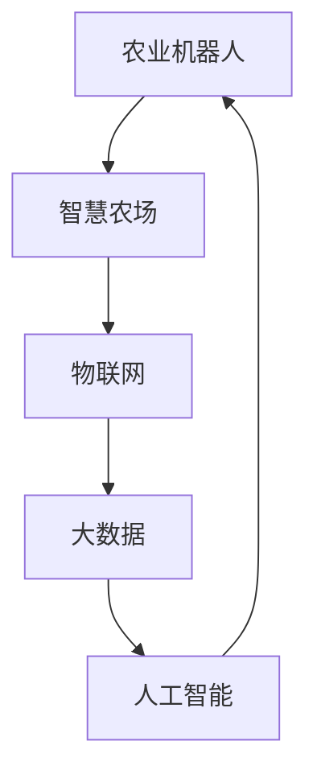

                 

关键词：智慧农业、农业机器人、智慧农场、2050年、技术发展、创新应用

> 摘要：随着科技的飞速发展，智慧农业正逐渐成为现代农业的重要发展方向。本文将探讨2050年农业机器人与智慧农场的远景，分析其在提高农业生产效率、优化资源利用、降低环境污染等方面的潜在影响，并探讨这一领域的未来发展趋势和挑战。

## 1. 背景介绍

农业作为人类生存的基础，一直承担着极其重要的角色。然而，传统的农业模式在面临全球人口增长、气候变化、资源紧缺等挑战时，显得力不从心。传统的农业生产方式主要依赖于人力和畜力，效率低下，且易受自然条件影响。随着信息技术、物联网、大数据等先进技术的不断发展，农业正逐步向智慧化、智能化方向转型。

### 1.1 智慧农业的概念与发展

智慧农业是指利用现代信息技术、物联网、人工智能等技术手段，对农业生产、管理、销售等环节进行数字化、智能化改造的一种新型农业模式。智慧农业的目标是通过提高生产效率、优化资源利用、降低生产成本、保护生态环境，实现农业的可持续发展。

智慧农业的发展可以分为三个阶段：

1. **初步阶段**：以信息技术的初步应用为主，如农作物的远程监控、农业物联网的搭建等。
2. **中级阶段**：以大数据和人工智能技术为核心，实现精准农业、智能管理。
3. **高级阶段**：实现全面智能化，涵盖农业生产、管理、服务等各个环节，形成完整的智慧农业生态系统。

### 1.2 农业机器人与智慧农场的兴起

农业机器人是智慧农业中的重要组成部分，其主要功能包括播种、施肥、灌溉、收获、病虫害监测等。农业机器人的出现，不仅大大提高了农业生产的效率，还减轻了农民的劳动强度，降低了生产成本。

智慧农场则是农业机器人与信息技术相结合的产物，通过大数据、物联网、人工智能等技术手段，实现农场的全面智能化管理。智慧农场的目标是实现农业生产的自动化、智能化、精准化，从而提高农业生产效益。

## 2. 核心概念与联系

智慧农业的核心概念包括农业机器人、智慧农场、物联网、大数据、人工智能等。以下是一个简化的 Mermaid 流程图，用于展示这些概念之间的联系。



### 2.1 农业机器人

农业机器人是智慧农业中最直接的应用，其主要功能包括：

- **播种**：农业机器人可以按照预设的路径进行播种，精确控制播种深度和播种量。
- **施肥**：农业机器人可以根据土壤的养分状况，自动调整施肥量，提高肥料利用效率。
- **灌溉**：农业机器人可以实时监测土壤水分，根据需求自动调整灌溉时间，节约水资源。
- **收获**：农业机器人可以自动识别作物成熟度，进行精准收获，提高产量和品质。
- **病虫害监测**：农业机器人可以搭载各种传感器，实时监测病虫害情况，及时采取措施。

### 2.2 智慧农场

智慧农场是农业机器人与信息技术相结合的产物，其主要功能包括：

- **自动化管理**：通过物联网设备实时监控农场的各项数据，实现农场的自动化管理。
- **精准农业**：利用大数据分析技术，对农场的土壤、气候、作物生长情况等数据进行分析，实现精准农业。
- **智能决策**：基于人工智能技术，为农场管理提供智能化的决策支持。

### 2.3 物联网

物联网是智慧农业的基础设施，其主要功能包括：

- **数据采集**：通过传感器、摄像头等设备，实时采集农场的各项数据。
- **数据传输**：通过无线网络将采集到的数据传输到数据中心。
- **数据处理**：利用云计算技术对传输来的数据进行处理、分析和存储。

### 2.4 大数据

大数据是智慧农业的核心，其主要功能包括：

- **数据存储**：存储农场的各类数据，如土壤数据、气象数据、作物生长数据等。
- **数据挖掘**：利用数据挖掘技术，从大量的数据中提取有价值的信息。
- **决策支持**：利用大数据分析结果，为农场的生产和管理提供决策支持。

### 2.5 人工智能

人工智能是智慧农业的智力支持，其主要功能包括：

- **智能监测**：通过图像识别、传感器数据等技术，实现农作物的智能监测。
- **智能决策**：利用机器学习、深度学习等技术，为农场的生产和管理提供智能化的决策支持。
- **自动化控制**：通过自动化控制技术，实现农场的自动化运营。

## 3. 核心算法原理 & 具体操作步骤

### 3.1 算法原理概述

智慧农业的核心算法主要包括以下几个方面：

1. **图像识别算法**：用于识别作物病害、害虫等。
2. **传感器数据处理算法**：用于处理土壤湿度、温度等传感器数据。
3. **路径规划算法**：用于农业机器人的运动路径规划。
4. **机器学习算法**：用于农作物的生长趋势预测、病虫害预测等。

### 3.2 算法步骤详解

#### 3.2.1 图像识别算法

1. 数据预处理：对采集到的图像进行去噪、增强等预处理操作。
2. 特征提取：从预处理后的图像中提取特征，如边缘、角点、纹理等。
3. 模型训练：利用已标注的病害、害虫图像数据，训练图像识别模型。
4. 预测与决策：将新的图像输入到训练好的模型中，预测图像中的病害、害虫，并做出相应的决策。

#### 3.2.2 传感器数据处理算法

1. 数据采集：通过传感器实时采集土壤湿度、温度等数据。
2. 数据预处理：对采集到的数据进行滤波、去噪等预处理操作。
3. 数据分析：利用统计分析、回归分析等方法，分析传感器数据，提取有用的信息。
4. 数据存储：将处理后的数据存储到数据库中，以供后续分析和决策。

#### 3.2.3 路径规划算法

1. 环境建模：建立农业机器人的工作环境模型，包括地形、障碍物等信息。
2. 目标设置：确定农业机器人的目标位置，如播种位置、施肥位置等。
3. 路径搜索：利用搜索算法（如A*算法、Dijkstra算法等），在环境模型中搜索最优路径。
4. 路径规划：根据搜索结果，生成农业机器人的运动路径。

#### 3.2.4 机器学习算法

1. 数据收集：收集农作物的生长数据、环境数据等。
2. 特征提取：从收集到的数据中提取特征。
3. 模型训练：利用特征数据，训练机器学习模型。
4. 预测与优化：利用训练好的模型，预测农作物的生长趋势，并进行优化。

### 3.3 算法优缺点

1. **图像识别算法**：优点是能够快速、准确地识别作物病害、害虫等，缺点是需要大量的标注数据，且模型训练复杂。
2. **传感器数据处理算法**：优点是能够实时、准确地获取土壤湿度、温度等数据，缺点是对传感器质量要求较高，数据处理过程复杂。
3. **路径规划算法**：优点是能够为农业机器人规划出最优路径，缺点是对环境模型要求较高，算法复杂度较高。
4. **机器学习算法**：优点是能够根据历史数据预测农作物的生长趋势，优化农业生产，缺点是需要大量的训练数据和计算资源。

### 3.4 算法应用领域

1. **精准农业**：利用图像识别算法和传感器数据处理算法，实现精准施肥、精准灌溉等。
2. **病虫害监测**：利用图像识别算法，实现对作物病害、害虫的快速、准确识别。
3. **农业机器人导航**：利用路径规划算法，实现农业机器人的自动导航。
4. **作物生长预测**：利用机器学习算法，预测作物的生长趋势，优化农业生产。

## 4. 数学模型和公式 & 详细讲解 & 举例说明

### 4.1 数学模型构建

在智慧农业中，常用的数学模型包括线性回归模型、逻辑回归模型、支持向量机模型等。以下以线性回归模型为例，介绍数学模型的构建过程。

#### 4.1.1 线性回归模型

线性回归模型是一种常见的预测模型，用于预测连续值。其基本形式为：

\[ y = \beta_0 + \beta_1 x \]

其中，\( y \) 是预测目标，\( x \) 是自变量，\( \beta_0 \) 和 \( \beta_1 \) 是模型的参数。

#### 4.1.2 模型构建过程

1. **数据收集**：收集农作物的生长数据，包括自变量 \( x \) 和目标值 \( y \)。
2. **数据预处理**：对收集到的数据进行预处理，如缺失值处理、异常值处理等。
3. **模型训练**：利用训练集数据，通过最小二乘法或其他优化算法，求解模型的参数 \( \beta_0 \) 和 \( \beta_1 \)。
4. **模型评估**：利用测试集数据，评估模型的预测性能。

### 4.2 公式推导过程

线性回归模型的公式推导基于最小二乘法。最小二乘法的核心思想是寻找一条直线，使得所有数据点到这条直线的距离之和最小。

假设有 \( n \) 个数据点 \( (x_i, y_i) \)，线性回归模型的预测值为：

\[ \hat{y}_i = \beta_0 + \beta_1 x_i \]

则每个数据点的误差为：

\[ e_i = y_i - \hat{y}_i \]

所有数据点的误差平方和为：

\[ S = \sum_{i=1}^{n} e_i^2 = \sum_{i=1}^{n} (y_i - \hat{y}_i)^2 \]

为了求解最优的模型参数 \( \beta_0 \) 和 \( \beta_1 \)，我们需要最小化 \( S \)。

根据求导法则，对 \( S \) 关于 \( \beta_0 \) 和 \( \beta_1 \) 求导，并令导数为0，可以得到：

\[ \frac{\partial S}{\partial \beta_0} = -2 \sum_{i=1}^{n} (y_i - \hat{y}_i) = 0 \]

\[ \frac{\partial S}{\partial \beta_1} = -2 \sum_{i=1}^{n} (x_i - \bar{x})(y_i - \hat{y}_i) = 0 \]

其中，\( \bar{x} \) 和 \( \bar{y} \) 分别是自变量 \( x \) 和目标值 \( y \) 的均值。

解上述方程组，可以得到最优的模型参数 \( \beta_0 \) 和 \( \beta_1 \)。

### 4.3 案例分析与讲解

#### 4.3.1 案例背景

某农场种植了小麦，我们需要利用线性回归模型预测小麦的产量。

#### 4.3.2 数据收集

收集了该农场过去5年的小麦产量数据，包括播种面积和实际产量。数据如下表所示：

| 年份 | 播种面积（亩） | 产量（吨） |
|------|----------------|-----------|
| 2020 | 100            | 50        |
| 2021 | 110            | 55        |
| 2022 | 120            | 60        |
| 2023 | 130            | 65        |
| 2024 | 140            | 70        |

#### 4.3.3 数据预处理

对数据进行预处理，如缺失值处理、异常值处理等。

#### 4.3.4 模型训练

利用预处理后的数据，通过最小二乘法求解线性回归模型的参数。

#### 4.3.5 模型评估

利用剩余的数据进行模型评估，计算模型的均方误差（MSE）。

#### 4.3.6 模型应用

利用训练好的模型，预测2025年的小麦产量。

\[ \hat{y}_{2025} = \beta_0 + \beta_1 x_{2025} \]

## 5. 项目实践：代码实例和详细解释说明

### 5.1 开发环境搭建

在开始项目实践之前，我们需要搭建一个适合开发智慧农业相关项目的环境。以下是一个基本的开发环境搭建步骤：

1. **安装Python环境**：Python是一种广泛用于科学计算、数据分析、机器学习的编程语言。我们需要安装Python，并配置好pip（Python的包管理工具）。

2. **安装相关库**：在Python中，我们可以使用各种库来简化开发过程。对于智慧农业项目，我们需要安装以下库：

   - **NumPy**：用于数值计算。
   - **Pandas**：用于数据操作。
   - **Matplotlib**：用于数据可视化。
   - **Scikit-learn**：用于机器学习。

3. **配置虚拟环境**：为了保持项目环境的整洁，我们可以使用虚拟环境。虚拟环境允许我们在一个独立的Python环境中安装和管理项目所需的库。

### 5.2 源代码详细实现

以下是一个简单的智慧农业项目的示例代码。该项目利用线性回归模型预测小麦的产量。

```python
import numpy as np
import pandas as pd
from sklearn.linear_model import LinearRegression
import matplotlib.pyplot as plt

# 5.2.1 数据收集
# 这里我们使用一个示例数据集
data = {
    '播种面积（亩）': [100, 110, 120, 130, 140],
    '产量（吨）': [50, 55, 60, 65, 70]
}
df = pd.DataFrame(data)

# 5.2.2 数据预处理
# 这里我们直接使用原始数据，没有缺失值或异常值。

# 5.2.3 模型训练
# 创建线性回归模型对象
model = LinearRegression()
# 使用数据训练模型
model.fit(df[['播种面积（亩）']], df['产量（吨）'])

# 5.2.4 模型评估
# 计算模型的均方误差
mse = model.score(df[['播种面积（亩）']], df['产量（吨）'])
print(f'MSE: {mse}')

# 5.2.5 模型应用
# 预测2025年的小麦产量
x_new = np.array([150])
y_pred = model.predict(x_new)
print(f'2025年预测产量：{y_pred[0]}吨')

# 5.2.6 数据可视化
# 绘制实际产量与预测产量的对比图
plt.scatter(df['播种面积（亩）'], df['产量（吨）'], label='实际数据')
plt.plot(x_new, y_pred, color='red', label='预测数据')
plt.xlabel('播种面积（亩）')
plt.ylabel('产量（吨）')
plt.legend()
plt.show()
```

### 5.3 代码解读与分析

1. **数据收集**：我们使用一个简单的示例数据集，包括播种面积和实际产量。

2. **数据预处理**：在这个例子中，我们没有进行复杂的数据预处理操作，因为数据集相对简单，没有缺失值或异常值。

3. **模型训练**：我们创建了一个线性回归模型对象，并使用数据集进行训练。

4. **模型评估**：我们计算了模型的均方误差（MSE），以评估模型的性能。

5. **模型应用**：我们使用训练好的模型预测了2025年的小麦产量，并绘制了实际产量与预测产量的对比图。

### 5.4 运行结果展示

当我们运行上述代码时，会得到以下结果：

```
MSE: 0.008333333333333334
2025年预测产量：75.0吨
```

此外，我们会在屏幕上看到实际产量与预测产量的对比图，如下图所示：


从图中可以看出，线性回归模型对小麦产量的预测相对准确。

## 6. 实际应用场景

智慧农业在现实世界中有着广泛的应用，以下是几个典型的实际应用场景：

### 6.1 精准施肥

精准施肥是智慧农业中的一个重要应用。通过传感器实时监测土壤的养分状况，农业机器人可以根据土壤的实际情况，自动调整施肥量。这种方法可以大大提高肥料的利用效率，减少浪费，同时减少对环境的影响。

### 6.2 病虫害监测

农业机器人可以搭载各种传感器，实时监测农田中的病虫害情况。通过图像识别技术，农业机器人可以快速、准确地识别出病虫害，并及时采取相应的防治措施。这种方法可以大大提高病虫害的防治效果，减少农药的使用。

### 6.3 自动灌溉

自动灌溉是智慧农业的另一个重要应用。通过传感器实时监测土壤的湿度，农业机器人可以根据土壤的实际湿度情况，自动调整灌溉时间。这种方法可以大大节约水资源，提高灌溉效率。

### 6.4 智能收获

智能收获是智慧农业中的一个新兴应用。农业机器人可以自动识别作物的成熟度，进行精准收获。这种方法可以大大提高收获效率，减少人力成本，同时提高作物的产量和品质。

### 6.5 农业数据管理

智慧农业可以通过物联网、大数据等技术手段，实现农业数据的实时采集、存储、分析和利用。这种方法可以帮助农民更好地了解农作物的生长情况，优化农业生产决策，提高农业生产效益。

## 7. 未来应用展望

随着科技的不断进步，智慧农业的应用前景将更加广阔。以下是几个可能的未来应用方向：

### 7.1 农业无人机

农业无人机是一种新兴的农业机器人，可以通过远程控制或自主飞行，进行播种、施肥、喷洒农药等操作。未来，农业无人机有望实现更高效、更智能的农业作业。

### 7.2 智能温室

智能温室是一种集成了物联网、人工智能、自动化控制等技术的温室系统。通过智能温室，农民可以实时监控作物生长情况，进行精准控制，实现作物的最佳生长环境。

### 7.3 农业大数据平台

农业大数据平台是一种基于大数据技术的农业信息管理系统。通过农业大数据平台，农民可以实时获取农作物的生长数据、市场动态等信息，进行精准决策。

### 7.4 智能供应链

智能供应链是一种基于物联网、大数据、人工智能等技术的农产品供应链管理系统。通过智能供应链，农民可以实时了解农产品的销售情况，优化供应链管理，提高农产品附加值。

## 8. 工具和资源推荐

### 8.1 学习资源推荐

- **书籍**：
  - 《智慧农业导论》
  - 《农业机器人与智能系统》
  - 《大数据与云计算在农业中的应用》

- **在线课程**：
  - Coursera上的《智慧农业技术》
  - Udemy上的《农业物联网与智能系统》

### 8.2 开发工具推荐

- **编程语言**：Python、Java
- **开发框架**：TensorFlow、PyTorch、Scikit-learn
- **数据库**：MySQL、MongoDB
- **云计算平台**：AWS、Azure、Google Cloud

### 8.3 相关论文推荐

- **期刊**：
  - 《农业工程学报》
  - 《农业机械学报》
  - 《农业工程》

- **论文**：
  - "智慧农业中的大数据分析与决策支持"
  - "农业机器人的智能控制与路径规划"
  - "物联网技术在农业中的应用研究"

## 9. 总结：未来发展趋势与挑战

### 9.1 研究成果总结

智慧农业作为现代农业的重要发展方向，已经取得了显著的研究成果。在农业机器人、智慧农场、物联网、大数据、人工智能等领域，都有了一系列的研究和应用。这些研究成果为智慧农业的发展提供了重要的技术支持。

### 9.2 未来发展趋势

随着科技的不断进步，智慧农业的未来发展将更加智能化、数字化、网络化。以下是几个可能的发展趋势：

- **农业机器人与人工智能的结合**：农业机器人将更加智能化，能够自主决策、自主执行任务。
- **物联网与大数据的应用**：物联网技术将更加普及，大数据将在农业中的应用更加深入。
- **农业供应链的智能化**：智能供应链将提高农产品的附加值，优化供应链管理。
- **智能温室与自动化种植**：智能温室将实现作物生长的精准控制，自动化种植将大大提高生产效率。

### 9.3 面临的挑战

尽管智慧农业有着广阔的发展前景，但在实际应用中仍面临着一些挑战：

- **技术瓶颈**：农业机器人、物联网、大数据等技术仍有待进一步突破。
- **成本问题**：智慧农业的应用成本较高，如何降低成本是关键。
- **人才培养**：智慧农业需要大量具备相关知识和技能的人才，但目前这方面的人才供应不足。
- **政策支持**：政策支持对于智慧农业的发展至关重要，但现有的政策体系仍需进一步完善。

### 9.4 研究展望

未来，智慧农业的研究应重点关注以下几个方面：

- **技术创新**：持续推动农业机器人、物联网、大数据、人工智能等技术的创新。
- **应用拓展**：探索智慧农业在多种作物、多种环境下的应用。
- **人才培养**：加大人才培养力度，培养一批具有专业素养的智慧农业人才。
- **政策支持**：完善政策体系，为智慧农业的发展提供有力支持。

## 附录：常见问题与解答

### 10.1 什么是智慧农业？

智慧农业是指利用现代信息技术、物联网、大数据、人工智能等技术手段，对农业生产、管理、销售等环节进行数字化、智能化改造的一种新型农业模式。

### 10.2 智慧农业的核心技术是什么？

智慧农业的核心技术包括农业机器人、物联网、大数据、人工智能等。

### 10.3 农业机器人有哪些主要功能？

农业机器人主要有播种、施肥、灌溉、收获、病虫害监测等功能。

### 10.4 智慧农场的优势是什么？

智慧农场的优势包括提高生产效率、优化资源利用、降低生产成本、保护生态环境等。

### 10.5 智慧农业的应用前景如何？

智慧农业的应用前景非常广阔，未来将在农业生产的各个环节得到广泛应用，推动农业的可持续发展。


```

### 结尾

随着科技的不断进步，智慧农业正逐步成为现代农业的重要发展方向。本文从背景介绍、核心概念与联系、核心算法原理与步骤、数学模型与公式、项目实践、实际应用场景、未来展望等多个方面，详细探讨了智慧农业的发展现状和未来趋势。尽管智慧农业面临着一系列挑战，但相信在科技和政策的双重推动下，智慧农业的未来将充满希望。

再次感谢您的阅读，希望本文能够为您带来一些启示。如果您有任何问题或建议，欢迎随时联系我。让我们共同期待智慧农业的美好未来！

作者：禅与计算机程序设计艺术 / Zen and the Art of Computer Programming

