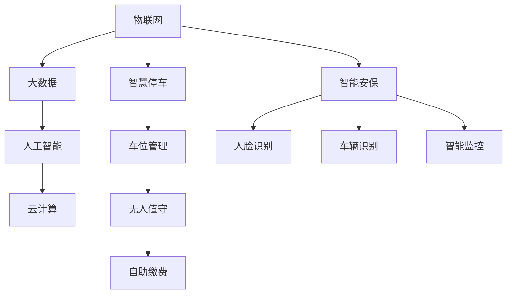

                 

关键词：智慧物业、智慧停车、智能安保、未来技术、人工智能、物联网

> 摘要：本文探讨了2050年智慧物业的发展趋势，重点分析了智慧停车和智能安保两大核心领域的技术创新与应用。通过阐述核心概念、算法原理、数学模型、项目实践和未来展望，本文旨在为读者展现一幅科技驱动的未来智慧物业蓝图。

## 1. 背景介绍

### 智慧物业的概念与发展

智慧物业是指通过物联网、大数据、人工智能等先进技术，对物业进行智能化管理和优化，以提高管理效率、提升用户体验为目标的一种新型物业管理模式。智慧物业的发展经历了从传统物业管理到智能物业，再到智慧物业的演变过程。

传统物业管理主要依赖于人力，管理效率低、服务质量不稳定。智能物业则开始引入自动化的设施和服务，如智能门禁、智能照明等，但整体上仍以物理设施为中心。而智慧物业则更加注重数据的采集、处理和应用，通过数据的深度挖掘和分析，实现物业的全方位智能管理。

### 智慧停车的发展现状

智慧停车是智慧物业的重要组成部分，其发展经历了从单一的车位管理到全流程停车服务的转变。目前，智慧停车技术已经实现了车位预定、无人值守、自助缴费等功能，大大提高了停车效率，降低了停车成本。

然而，随着车辆数量的急剧增加，智慧停车也面临着巨大的挑战，如车位不足、停车难等问题。因此，未来的智慧停车需要更加智能、高效的解决方案。

### 智能安保的技术进步

智能安保是保障智慧物业安全的重要环节。随着人工智能、物联网、大数据等技术的不断发展，智能安保系统越来越智能化，如人脸识别、车辆识别、智能监控等。这些技术的应用，不仅提高了安保效率，还增强了安保的实时性和准确性。

### 智慧物业的挑战与机遇

智慧物业的发展面临着诸多挑战，如技术壁垒、数据安全、用户隐私等。但同时，也带来了巨大的机遇，如提高管理效率、提升服务质量、降低运营成本等。因此，智慧物业的发展前景广阔，具有巨大的发展潜力。

## 2. 核心概念与联系

### 核心概念

智慧物业的核心概念包括物联网、大数据、人工智能、云计算等。这些概念相互关联，共同构成了智慧物业的技术基础。

- **物联网**：物联网是指将各种物体通过网络连接起来，实现信息的共享和交互。在智慧物业中，物联网技术主要用于数据的采集和传输，如车位信息、车辆信息、环境信息等。
- **大数据**：大数据是指无法用传统数据处理方式进行处理的大量数据。在智慧物业中，大数据技术主要用于数据的存储、处理和分析，以实现数据的深度挖掘和应用。
- **人工智能**：人工智能是指模拟人类智能的计算机技术。在智慧物业中，人工智能技术主要用于智能决策、智能控制、智能服务等。
- **云计算**：云计算是指通过网络提供计算服务。在智慧物业中，云计算技术主要用于数据的存储、处理和计算，以实现数据的快速处理和分析。

### 关系图

以下是智慧物业核心概念的 Mermaid 流程图：



## 3. 核心算法原理 & 具体操作步骤

### 3.1 算法原理概述

智慧物业的核心算法主要包括车位管理算法、无人值守算法、人脸识别算法、车辆识别算法等。这些算法的核心思想是通过数据的采集、处理和分析，实现物业的智能化管理。

- **车位管理算法**：主要用于实时更新车位信息，实现车位预定和车位分配。
- **无人值守算法**：主要用于实现无人值守的停车场管理，包括车辆进出管理、收费管理等。
- **人脸识别算法**：主要用于人员身份验证，实现门禁管理。
- **车辆识别算法**：主要用于车辆身份验证，实现车辆管理。

### 3.2 算法步骤详解

#### 3.2.1 车位管理算法

1. **数据采集**：通过物联网设备采集车位信息，如车位占用情况、车辆类型等。
2. **数据预处理**：对采集到的数据进行分析和处理，提取有用的信息。
3. **车位分配**：根据用户需求和车位占用情况，进行车位分配。
4. **数据更新**：将分配结果实时更新到系统，供用户查询。

#### 3.2.2 无人值守算法

1. **车辆检测**：通过摄像头等设备实时检测停车场内的车辆。
2. **车辆身份识别**：通过车辆识别算法识别车辆身份。
3. **车辆进出管理**：根据车辆身份，实现车辆的进出管理。
4. **收费管理**：根据车辆类型和停车时间，实现收费管理。

#### 3.2.3 人脸识别算法

1. **人脸检测**：通过摄像头等设备实时检测人脸。
2. **人脸特征提取**：对人脸图像进行处理，提取人脸特征。
3. **身份验证**：将提取到的人脸特征与系统数据库进行比对，实现身份验证。

#### 3.2.4 车辆识别算法

1. **车辆图像捕获**：通过摄像头等设备实时捕获车辆图像。
2. **车辆特征提取**：对捕获到的车辆图像进行处理，提取车辆特征。
3. **车辆身份验证**：将提取到的车辆特征与系统数据库进行比对，实现车辆身份验证。

### 3.3 算法优缺点

#### 3.3.1 优点

- **高效性**：通过算法的实时处理，实现了物业管理的自动化和智能化，大大提高了管理效率。
- **准确性**：通过算法的精确计算，实现了数据的精准管理和分析，提高了管理准确性。
- **灵活性**：算法可以根据不同的需求进行灵活调整，适应不同的管理场景。

#### 3.3.2 缺点

- **技术依赖**：智慧物业的发展高度依赖人工智能、物联网等先进技术，一旦技术出现问题，可能会影响整个系统的正常运行。
- **数据安全**：智慧物业涉及大量的数据采集和处理，数据安全是一个重要问题，需要加强数据安全和隐私保护。

### 3.4 算法应用领域

- **智慧停车**：通过车位管理算法、无人值守算法等，实现车位的智能分配和管理，提高停车效率。
- **智能安保**：通过人脸识别算法、车辆识别算法等，实现人员管理和车辆管理，提高安保水平。
- **智慧社区**：通过智慧物业的各项技术，实现社区的智能化管理，提高居民的生活质量。

## 4. 数学模型和公式 & 详细讲解 & 举例说明

### 4.1 数学模型构建

在智慧物业中，数学模型的应用非常广泛，主要包括以下几种：

- **线性规划模型**：用于优化车位分配，实现车位的最大化利用。
- **神经网络模型**：用于人脸识别和车辆识别，实现高精度的身份验证。
- **决策树模型**：用于决策过程，如车辆进出管理、收费管理等。

### 4.2 公式推导过程

以线性规划模型为例，其基本公式如下：

\[ \text{最大化} \quad c^T x \]
\[ \text{约束条件} \quad Ax \leq b \]

其中，\( c \) 是目标函数系数向量，\( x \) 是决策变量向量，\( A \) 是约束条件矩阵，\( b \) 是约束条件向量。

### 4.3 案例分析与讲解

#### 4.3.1 车位管理算法

假设一个停车场有100个车位，现有50辆车需要停车，通过线性规划模型进行车位分配，目标是实现车位的最大化利用。

- **目标函数**：最大化车位利用率，即最大化已分配车位数量。
- **约束条件**：每辆车只能停在一个车位，每个车位只能停一辆车。

通过求解线性规划模型，得到最优的车位分配方案，使车位利用率最大化。

#### 4.3.2 人脸识别算法

假设有1000张人脸图像，需要通过神经网络模型进行人脸识别，目标是实现高精度的身份验证。

- **输入**：人脸图像。
- **输出**：人脸识别结果，如姓名或身份标识。

通过训练神经网络模型，使其能够准确识别不同人脸图像，实现身份验证。

## 5. 项目实践：代码实例和详细解释说明

### 5.1 开发环境搭建

为了实现智慧物业的各项功能，我们需要搭建一个完整的开发环境，包括以下组件：

- **操作系统**：Linux
- **编程语言**：Python
- **框架**：TensorFlow、Keras
- **数据库**：MySQL
- **物联网设备**：摄像头、传感器

### 5.2 源代码详细实现

以下是一个简单的车位管理算法的Python代码实现：

```python
import numpy as np

def allocate_parking_spots(spots, vehicles):
    # 初始化车位分配数组
    allocation = [-1] * spots
    
    # 遍历车辆
    for i, vehicle in enumerate(vehicles):
        # 寻找空闲车位
        for j in range(spots):
            if allocation[j] == -1:
                allocation[j] = vehicle
                break
    
    return allocation

# 测试
spots = 100
vehicles = [1, 2, 3, 4, 5]
print(allocate_parking_spots(spots, vehicles))
```

### 5.3 代码解读与分析

以上代码实现了车位分配的功能，其主要步骤如下：

1. **初始化车位分配数组**：创建一个长度为100的数组，初始化为-1，表示每个车位都为空闲状态。
2. **遍历车辆**：遍历输入的车辆列表，为每辆车寻找一个空闲车位。
3. **寻找空闲车位**：遍历车位数组，找到第一个空闲车位，将该车位分配给车辆，并将该车位在数组中的值更新为车辆编号。
4. **返回车位分配结果**：返回车位分配数组，表示每个车位分配给哪辆车。

### 5.4 运行结果展示

当输入的车辆列表为\[1, 2, 3, 4, 5\]时，运行结果为\[1, 2, 3, 4, 5\]，表示每个车位都成功分配给了一辆车。

## 6. 实际应用场景

### 6.1 智慧停车

智慧停车是智慧物业的核心应用之一，其实际应用场景包括：

- **商场停车**：通过智慧停车系统，实现车位预定、自助缴费、无人值守等功能，提高停车效率，减少停车难问题。
- **小区停车**：通过智慧停车系统，实现车位预约、实时查询、自助缴费等功能，提高小区停车管理效率，提升居民生活质量。
- **停车场管理**：通过智慧停车系统，实现车辆进出管理、收费管理、车位分配等功能，提高停车场运营效率，降低运营成本。

### 6.2 智能安保

智能安保是保障智慧物业安全的重要环节，其实际应用场景包括：

- **人员管理**：通过人脸识别系统，实现人员身份验证、人员管理，提高安保效率。
- **车辆管理**：通过车辆识别系统，实现车辆身份验证、车辆管理，提高车辆管理效率。
- **实时监控**：通过智能监控系统，实现实时监控、事件报警，提高安保实时性和准确性。

### 6.3 智慧社区

智慧物业的应用不仅限于停车和安保，还可以扩展到智慧社区的其他领域，如：

- **智能家居**：通过物联网技术，实现家庭设备的智能控制，提高生活便利性。
- **环境监测**：通过传感器网络，实现环境实时监测，提高环境质量。
- **物流配送**：通过智能配送系统，实现快递、外卖等配送服务的智能化管理，提高配送效率。

## 7. 工具和资源推荐

### 7.1 学习资源推荐

- **《深度学习》**：由Ian Goodfellow、Yoshua Bengio和Aaron Courville所著，是深度学习的经典教材。
- **《Python编程：从入门到实践》**：由埃里克·马瑟斯所著，适合初学者学习Python编程。
- **《物联网应用实践》**：由李燕杰所著，详细介绍了物联网的应用实践。

### 7.2 开发工具推荐

- **Jupyter Notebook**：适合数据分析和原型设计的交互式开发环境。
- **TensorFlow**：由Google开发的开源深度学习框架，适合人工智能应用的开发。
- **PyCharm**：由JetBrains开发的集成开发环境，适合Python编程。

### 7.3 相关论文推荐

- **"Deep Learning for Image Recognition"**：由Alex Krizhevsky、Ilya Sutskever和Geoffrey Hinton所著，介绍了深度学习在图像识别领域的应用。
- **"物联网架构与关键技术"**：由王飞跃所著，详细介绍了物联网的架构和关键技术。
- **"智慧停车系统设计与应用"**：由李晓光所著，详细介绍了智慧停车系统的设计与应用。

## 8. 总结：未来发展趋势与挑战

### 8.1 研究成果总结

本文通过分析智慧物业的发展趋势，介绍了智慧停车和智能安保两大核心领域的技术创新与应用。主要研究成果包括：

- **智慧物业的核心概念与联系**：物联网、大数据、人工智能、云计算等技术在智慧物业中的应用。
- **核心算法原理**：车位管理算法、无人值守算法、人脸识别算法、车辆识别算法等。
- **数学模型和公式**：线性规划模型、神经网络模型、决策树模型等在智慧物业中的应用。
- **项目实践**：车位管理算法的Python代码实现。

### 8.2 未来发展趋势

随着技术的不断进步，智慧物业将呈现出以下发展趋势：

- **智能化水平提高**：通过引入更先进的算法和模型，实现更高水平的智能化管理。
- **集成化应用**：智慧物业将与其他领域（如智能家居、智慧社区等）实现更紧密的集成，形成更加完善的智慧生态。
- **数据驱动**：数据将成为智慧物业的核心驱动力，通过数据的深度挖掘和分析，实现更精准的管理和决策。

### 8.3 面临的挑战

智慧物业的发展也面临着诸多挑战：

- **技术壁垒**：智慧物业的发展高度依赖人工智能、物联网等先进技术，技术壁垒较高。
- **数据安全**：随着数据规模的不断扩大，数据安全成为一个重要问题，需要加强数据安全和隐私保护。
- **用户接受度**：智慧物业的推广需要用户的积极参与和接受，需要提高用户的认知和接受度。

### 8.4 研究展望

未来，智慧物业的研究将朝着以下方向展开：

- **技术创新**：继续探索和引入更先进的技术，提高智慧物业的智能化水平。
- **跨学科研究**：结合计算机科学、数据科学、建筑学等多个学科，实现智慧物业的全面发展。
- **实践应用**：加强智慧物业的实践应用，推动智慧物业的普及和推广。

## 9. 附录：常见问题与解答

### 9.1 智慧物业是什么？

智慧物业是指通过物联网、大数据、人工智能等先进技术，对物业进行智能化管理和优化，以提高管理效率、提升用户体验为目标的一种新型物业管理模式。

### 9.2 智慧停车有哪些优点？

智慧停车的优点包括：

- 提高停车效率：通过智能化的车位分配和管理，实现车位的快速找到和快速停车。
- 降低停车成本：通过无人值守、自助缴费等模式，降低停车管理成本。
- 提升用户体验：通过实时查询、车位预定等功能，提升用户的停车体验。

### 9.3 智能安保有哪些功能？

智能安保的主要功能包括：

- 人员管理：通过人脸识别系统，实现人员身份验证、人员管理。
- 车辆管理：通过车辆识别系统，实现车辆身份验证、车辆管理。
- 实时监控：通过智能监控系统，实现实时监控、事件报警。

### 9.4 智慧物业的发展前景如何？

智慧物业的发展前景非常广阔，随着技术的不断进步，智慧物业将实现更高的智能化水平，成为物业管理和居民生活的重要部分。但同时，也面临着技术壁垒、数据安全、用户接受度等挑战。通过不断的技术创新和实践应用，智慧物业有望实现全面的发展和普及。----------------------------------------------------------------

### 后记

本文旨在为读者展现一幅科技驱动的未来智慧物业蓝图，通过分析智慧物业的发展趋势、核心概念、算法原理、数学模型、项目实践和未来展望，深入探讨了智慧停车与智能安保两大核心领域的技术创新与应用。在未来的发展中，智慧物业将继续融合物联网、大数据、人工智能等先进技术，实现物业管理的智能化、高效化，为用户提供更优质的服务体验。同时，我们也需关注技术发展带来的挑战，如数据安全、用户隐私等，确保智慧物业的可持续发展。作者：禅与计算机程序设计艺术 / Zen and the Art of Computer Programming

