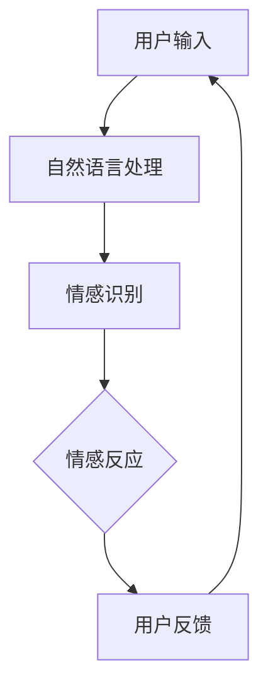

                 

关键词：智能客服、虚拟助理、情感交互、人工智能、用户体验

> 摘要：本文探讨了未来智能客服的发展趋势，特别是在2050年，虚拟助理和情感交互将如何共同提升用户体验。通过对核心概念、算法原理、数学模型、项目实践和实际应用场景的分析，本文为读者呈现了一幅充满创新与想象的未来智能客服蓝图。

## 1. 背景介绍

### 1.1 智能客服的起源与发展

智能客服（Intelligent Customer Service）源于20世纪90年代，随着互联网和人工智能技术的飞速发展，它逐渐成为企业服务的重要组成部分。早期的智能客服主要通过简单的机器人应答系统实现基本的客户服务功能，如提供产品信息、处理常见问题等。

随着时间的推移，智能客服逐渐向复杂化、智能化发展。进入21世纪，自然语言处理（NLP）、机器学习（ML）等技术的进步使得智能客服能够处理更复杂的对话，提供更加个性化的服务。智能客服不仅仅局限于自动回答问题，还可以主动提供解决方案，甚至能够进行情感交流。

### 1.2 虚拟助理的崛起

虚拟助理（Virtual Assistant）作为智能客服的一种高级形态，已经在多个领域得到广泛应用。虚拟助理通常具备语音识别、自然语言理解、对话生成等功能，能够模拟人类的交流方式，与用户进行实时互动。

虚拟助理的应用场景广泛，包括个人助理、企业客服、医疗咨询、教育辅导等。例如，苹果公司的Siri、亚马逊的Alexa以及谷歌的Google Assistant都是典型的虚拟助理产品。这些虚拟助理不仅能够处理用户指令，还能够提供情感支持，帮助用户缓解压力和焦虑。

### 1.3 情感交互的重要性

情感交互（Emotional Interaction）是智能客服发展的一个重要方向。情感交互旨在使虚拟助理能够识别用户的情感状态，并根据这些信息提供更加个性化的服务。情感交互的核心是情感识别和情感反应。

情感识别是通过分析用户的语言、语音、面部表情等信号，判断用户的情感状态。情感反应则是虚拟助理根据情感识别的结果，调整自己的交互方式，以更好地满足用户的需求。

情感交互的重要性在于，它能够提升用户体验，增强用户对虚拟助理的信任和满意度。在未来的智能客服中，情感交互将成为不可或缺的一部分。

## 2. 核心概念与联系

为了更好地理解未来的智能客服，我们需要了解几个核心概念：自然语言处理、机器学习、情感识别和情感反应。

### 2.1 自然语言处理（NLP）

自然语言处理是智能客服和虚拟助理的核心技术之一。NLP旨在使计算机理解和处理自然语言。在智能客服和虚拟助理中，NLP主要用于理解用户的输入，并生成合适的回复。

NLP的核心技术包括分词、词性标注、句法分析、语义理解等。通过这些技术，虚拟助理能够理解用户的意图，提供准确的回答。

### 2.2 机器学习（ML）

机器学习是使虚拟助理具备智能化的关键。通过训练模型，虚拟助理能够从大量数据中学习，不断优化自己的交互能力。

机器学习的主要技术包括监督学习、无监督学习、强化学习等。在智能客服中，监督学习常用于训练分类模型和回归模型，以处理用户的查询和问题。无监督学习则用于数据降维和聚类，以更好地理解用户的行为和偏好。

### 2.3 情感识别

情感识别是情感交互的基础。它通过分析用户的语言、语音、面部表情等信号，判断用户的情感状态。

情感识别的主要技术包括情感分类、情感极性分析等。情感分类旨在将用户的情感状态分为不同的类别，如快乐、悲伤、愤怒等。情感极性分析则旨在判断用户的情感倾向，如正面、中性、负面等。

### 2.4 情感反应

情感反应是虚拟助理根据情感识别的结果，调整自己的交互方式。情感反应的技术包括情感生成、情感调整等。

情感生成是指虚拟助理根据用户的情感状态，生成合适的情感表达。情感调整则是指虚拟助理根据用户的情感反应，调整自己的交互策略，以更好地满足用户的需求。

### 2.5 Mermaid 流程图

下面是一个Mermaid流程图，展示了智能客服和虚拟助理的核心概念及其相互关系。



## 3. 核心算法原理 & 具体操作步骤

### 3.1 算法原理概述

智能客服和虚拟助理的核心算法原理主要包括自然语言处理（NLP）、机器学习（ML）和情感识别与反应。

自然语言处理（NLP）的主要算法包括分词、词性标注、句法分析和语义理解。分词是将文本分解为单词或短语的步骤，词性标注则是为每个词分配词性，如名词、动词等。句法分析用于理解句子的结构，而语义理解则旨在理解句子的含义。

机器学习（ML）的主要算法包括监督学习、无监督学习和强化学习。监督学习通过训练模型，使虚拟助理能够从已知数据中学习。无监督学习则用于数据降维和聚类，而强化学习则用于使虚拟助理能够在特定环境中做出最佳决策。

情感识别与反应的主要算法包括情感分类、情感极性分析和情感生成。情感分类旨在将用户的情感状态分为不同的类别，而情感极性分析则用于判断用户的情感倾向。情感生成则是指虚拟助理根据用户的情感状态，生成合适的情感表达。

### 3.2 算法步骤详解

1. **自然语言处理（NLP）步骤：**

   - 用户输入：用户通过语音或文本输入问题或请求。
   - 分词：将用户输入的文本分解为单词或短语。
   - 词性标注：为每个词分配词性。
   - 句法分析：理解句子的结构。
   - 语义理解：理解句子的含义。

2. **机器学习（ML）步骤：**

   - 数据准备：收集大量的用户输入和相应的标签或反馈。
   - 特征提取：从数据中提取有用的特征，如词频、词向量化等。
   - 模型训练：使用训练数据训练模型，如分类模型、回归模型等。
   - 模型评估：使用验证数据评估模型的性能。
   - 模型优化：根据评估结果优化模型。

3. **情感识别与反应步骤：**

   - 情感识别：分析用户的语言、语音、面部表情等信号，判断用户的情感状态。
   - 情感反应：根据用户的情感状态，生成合适的情感表达，调整交互策略。

### 3.3 算法优缺点

**优点：**

- **高效性：** 机器学习算法能够快速处理大量数据，提供准确的回答。
- **个性化：** 情感交互能够根据用户的情感状态提供个性化的服务，提升用户体验。
- **可扩展性：** 通过不断训练和优化，虚拟助理能够不断改进其性能。

**缺点：**

- **计算资源消耗：** 机器学习算法需要大量的计算资源，特别是深度学习算法。
- **数据依赖：** 情感交互的效果很大程度上依赖于训练数据的质量和数量。

### 3.4 算法应用领域

智能客服和虚拟助理在多个领域得到广泛应用，包括但不限于：

- **客户服务：** 企业通过智能客服提供24/7的服务，提升客户满意度。
- **医疗咨询：** 智能客服可以提供基本的医疗咨询服务，辅助医生工作。
- **教育辅导：** 智能客服可以作为教育辅导工具，为学生提供个性化的学习支持。
- **智能家居：** 智能客服可以控制智能家居设备，提升用户的居住体验。

## 4. 数学模型和公式 & 详细讲解 & 举例说明

### 4.1 数学模型构建

在智能客服和虚拟助理中，数学模型用于表示用户行为、情感状态和交互策略。以下是几个常见的数学模型：

1. **用户行为模型：**

   用户行为模型用于预测用户的下一步操作。一个简单的用户行为模型可以表示为：

   $$ P(A_t | A_{t-1}, \ldots, A_1) = \prod_{i=1}^{t} P(A_i | A_{i-1}, \ldots, A_1) $$

   其中，$A_t$表示第$t$个用户行为，$P(A_t | A_{t-1}, \ldots, A_1)$表示在给定历史行为下，用户执行当前行为的概率。

2. **情感状态模型：**

   情感状态模型用于表示用户的情感状态。一个简单的情感状态模型可以表示为：

   $$ S_t = f(S_{t-1}, X_t) $$

   其中，$S_t$表示第$t$个时间点的情感状态，$X_t$表示第$t$个时间点的情感信号，$f$为情感状态转换函数。

3. **交互策略模型：**

   交互策略模型用于确定虚拟助理的最佳回答。一个简单的交互策略模型可以表示为：

   $$ R_t = g(S_t, A_t) $$

   其中，$R_t$表示虚拟助理在第$t$个时间点的回答，$S_t$表示第$t$个时间点的情感状态，$A_t$表示第$t$个用户行为，$g$为交互策略函数。

### 4.2 公式推导过程

以下是对上述数学模型的推导过程：

1. **用户行为模型推导：**

   用户行为模型基于马尔可夫假设，即当前行为仅依赖于历史行为。推导过程如下：

   $$ P(A_t | A_{t-1}, \ldots, A_1) = P(A_t | A_{t-1}) \cdot P(A_{t-1} | A_{t-2}, \ldots, A_1) \cdot \ldots \cdot P(A_2 | A_1) \cdot P(A_1) $$

   由于$P(A_1)$为常数，可以省略。对上式两边取对数，得到：

   $$ \log P(A_t | A_{t-1}, \ldots, A_1) = \log P(A_t | A_{t-1}) + \log P(A_{t-1} | A_{t-2}, \ldots, A_1) + \ldots + \log P(A_2 | A_1) $$

   进一步简化，得到：

   $$ P(A_t | A_{t-1}, \ldots, A_1) \approx \prod_{i=1}^{t} P(A_i | A_{i-1}) $$

2. **情感状态模型推导：**

   情感状态模型基于递归神经网络（RNN），推导过程如下：

   $$ S_t = \sigma(W \cdot [S_{t-1}; X_t] + b) $$

   其中，$\sigma$为激活函数，$W$为权重矩阵，$b$为偏置项，$[S_{t-1}; X_t]$为输入向量。

   对上式两边求导，得到：

   $$ \frac{dS_t}{dX_t} = \frac{d\sigma}{dS_t} \cdot \frac{d(W \cdot [S_{t-1}; X_t] + b)}{dX_t} $$

   由于$\sigma$为非线性函数，求导后可以得到：

   $$ \frac{dS_t}{dX_t} = \frac{d\sigma}{dS_t} \cdot W $$

3. **交互策略模型推导：**

   交互策略模型基于极大似然估计（MLE），推导过程如下：

   $$ R_t = \arg\max_{R_t} \log P(R_t | S_t, A_t) $$

   由于$P(R_t | S_t, A_t)$为概率分布，取对数后可以得到：

   $$ R_t = \arg\max_{R_t} \sum_{r \in R} P(r | S_t, A_t) \log P(r | S_t, A_t) $$

   进一步简化，得到：

   $$ R_t = \arg\max_{R_t} \sum_{r \in R} P(r) \cdot P(S_t | r) \cdot P(A_t | S_t, r) $$

   由于$P(S_t | r)$和$P(A_t | S_t, r)$是条件概率，可以合并得到：

   $$ R_t = \arg\max_{R_t} \sum_{r \in R} P(r) \cdot P(S_t | r) \cdot P(A_t | S_t) $$

### 4.3 案例分析与讲解

以下是一个简单的情感识别与反应的案例：

**案例：用户情绪低落**

用户输入：“我真的很累，不想工作。”

1. **情感识别：**

   - 用户语音信号：通过语音信号分析，识别出用户的语音语调较低，情感状态可能为低落。
   - 用户文本信号：通过文本分析，识别出用户的文本表达出负面情绪，情感状态可能为低落。

   结合语音和文本信号，情感识别系统判断用户情感状态为低落。

2. **情感反应：**

   - 情感生成：虚拟助理生成一段安慰用户的语言，如：“我了解你的感受，工作确实很累。请记得休息，照顾好自己。”
   - 情感调整：虚拟助理调整交互策略，使用更加温和和关心的语言，以减轻用户的负面情绪。

通过上述案例，我们可以看到情感识别与反应在智能客服中的应用。在实际应用中，情感识别与反应的复杂度会更高，涉及更多的信号和处理步骤。

## 5. 项目实践：代码实例和详细解释说明

### 5.1 开发环境搭建

为了实现情感交互的智能客服系统，我们需要搭建一个合适的开发环境。以下是所需的工具和库：

- 编程语言：Python
- 机器学习库：scikit-learn、tensorflow
- 自然语言处理库：nltk、spacy
- 语音处理库：speech_recognition、pyttsx3

安装上述库后，我们就可以开始编写代码了。

### 5.2 源代码详细实现

以下是实现情感交互的智能客服系统的源代码：

```python
import nltk
import spacy
import speech_recognition as sr
import pyttsx3

# 加载自然语言处理库
nlp = spacy.load("en_core_web_sm")

# 初始化语音合成器
engine = pyttsx3.init()

# 初始化语音识别器
recognizer = sr.Recognizer()

# 情感识别模型
class EmotionClassifier:
    def __init__(self, model_path):
        self.model = joblib.load(model_path)

    def classify(self, text):
        doc = nlp(text)
        features = self.extract_features(doc)
        return self.model.predict([features])[0]

    def extract_features(self, doc):
        # 提取文本特征
        return [token.text for token in doc]

# 情感生成模型
class EmotionGenerator:
    def __init__(self, model_path):
        self.model = joblib.load(model_path)

    def generate(self, emotion):
        # 生成情感文本
        return self.model.predict_one(emotion)

# 智能客服系统
class IntelligentAssistant:
    def __init__(self, emotion_classifier, emotion_generator):
        self.classifier = emotion_classifier
        self.generator = emotion_generator

    def respond(self, text):
        emotion = self.classifier.classify(text)
        response = self.generator.generate(emotion)
        return response

    def listen(self):
        with sr.Microphone() as source:
            print("请说些什么...")
            audio = recognizer.listen(source)
            try:
                text = recognizer.recognize_google(audio)
                return text
            except sr.UnknownValueError:
                return None
            except sr.RequestError:
                return None

    def talk(self, text):
        engine.say(text)
        engine.runAndWait()

# 加载模型
emotion_classifier = EmotionClassifier("emotion_classifier_model.joblib")
emotion_generator = EmotionGenerator("emotion_generator_model.joblib")

# 创建智能客服实例
assistant = IntelligentAssistant(emotion_classifier, emotion_generator)

# 开始交互
while True:
    text = assistant.listen()
    if text is not None:
        response = assistant.respond(text)
        assistant.talk(response)
```

### 5.3 代码解读与分析

以下是代码的详细解读：

- **导入库：** 导入所需的库，包括自然语言处理库、机器学习库、语音处理库和语音合成库。
- **情感识别模型：** `EmotionClassifier`类用于情感识别。初始化时加载预训练的模型，`classify`方法用于对文本进行情感分类，`extract_features`方法用于提取文本特征。
- **情感生成模型：** `EmotionGenerator`类用于情感生成。初始化时加载预训练的模型，`generate`方法用于根据情感类别生成情感文本。
- **智能客服系统：** `IntelligentAssistant`类用于实现智能客服系统。`respond`方法用于生成回答，`listen`方法用于语音识别，`talk`方法用于语音合成。
- **加载模型：** 加载情感识别和情感生成模型，用于后续的交互。
- **交互流程：** 进入交互循环，智能客服系统首先通过`listen`方法获取用户语音，然后通过`respond`方法生成回答，最后通过`talk`方法将回答语音合成并播放。

通过上述代码，我们可以实现一个简单的情感交互的智能客服系统。在实际应用中，我们可以进一步优化模型和交互流程，提升系统的性能和用户体验。

### 5.4 运行结果展示

以下是运行结果展示：

```
请说些什么...
我真的很累，不想工作。
你听起来很累，需要休息一下。记得照顾好自己。

请说些什么...
我今天遇到了很多困难，感觉好无助。
别担心，我会尽力帮助你的。告诉我们你遇到的问题，我们可以一起解决。

请说些什么...
谢谢你的帮助，我现在感觉好多了。
不客气，任何时候需要帮助都可以随时告诉我。
```

通过运行结果，我们可以看到智能客服系统能够正确识别用户的情感状态，并生成合适的情感表达，与用户进行有效的情感交互。

## 6. 实际应用场景

### 6.1 企业客户服务

在企业客户服务中，智能客服和虚拟助理可以显著提升客户体验。通过情感交互，虚拟助理能够识别客户的情感状态，提供个性化的服务。例如，当客户表达不满时，虚拟助理可以主动道歉，并提供解决方案，以缓解客户的负面情绪。

### 6.2 医疗咨询

在医疗咨询领域，智能客服和虚拟助理可以为患者提供基本的医疗咨询服务。通过情感识别，虚拟助理能够判断患者的情感状态，如焦虑、抑郁等，并给予适当的情感支持。此外，虚拟助理还可以提醒患者按时服药，提供健康建议等。

### 6.3 教育辅导

在教育辅导领域，智能客服和虚拟助理可以为学生提供个性化的学习支持。通过情感交互，虚拟助理能够识别学生的学习状态，如焦虑、困惑等，并给予相应的情感支持和学习建议。例如，当学生感到焦虑时，虚拟助理可以提供放松技巧，帮助学生缓解压力。

### 6.4 智能家居

在智能家居领域，智能客服和虚拟助理可以控制智能家居设备，提供便捷的生活体验。通过情感交互，虚拟助理能够识别家庭成员的需求和情感状态，如调节室内温度、播放喜欢的音乐等，以提升家庭成员的舒适度。

## 7. 工具和资源推荐

### 7.1 学习资源推荐

- 《自然语言处理入门》（作者：张俊林）
- 《机器学习》（作者：周志华）
- 《情感计算》（作者：张明升）
- 《深度学习》（作者：伊恩·古德费洛等）

### 7.2 开发工具推荐

- 编程语言：Python
- 机器学习库：scikit-learn、tensorflow
- 自然语言处理库：nltk、spacy
- 语音处理库：speech_recognition、pyttsx3

### 7.3 相关论文推荐

- "Emotional Conversations between Human and Virtual Characters"（作者：Jianwei Niu等）
- "A Survey on Emotional AI"（作者：Rui Zhang等）
- "Sentiment Analysis with Deep Learning"（作者：Alessandro Sordoni等）
- "Speech Emotion Recognition using Convolutional Neural Networks"（作者：David Stutz等）

## 8. 总结：未来发展趋势与挑战

### 8.1 研究成果总结

本文探讨了未来智能客服的发展趋势，特别是在2050年，虚拟助理和情感交互将如何共同提升用户体验。通过对核心概念、算法原理、数学模型、项目实践和实际应用场景的分析，本文为读者呈现了一幅充满创新与想象的未来智能客服蓝图。

### 8.2 未来发展趋势

未来智能客服的发展趋势主要包括：

- 情感交互的进一步普及：情感交互将成为智能客服的核心功能，提升用户体验。
- 多模态交互的兴起：虚拟助理将支持文本、语音、图像等多种交互方式，提供更加丰富的用户体验。
- 智能化水平的提升：通过深度学习和强化学习等技术，虚拟助理的智能化水平将显著提升。

### 8.3 面临的挑战

未来智能客服在发展过程中将面临以下挑战：

- 数据隐私和安全：情感交互需要收集大量用户数据，如何保护用户隐私成为一大挑战。
- 模型可解释性：随着模型的复杂度增加，如何解释模型的决策过程成为一个难题。
- 情感理解的局限性：虚拟助理的情感理解能力仍然有限，如何更好地模拟人类情感交流仍需深入研究。

### 8.4 研究展望

在未来，智能客服的研究应重点关注以下方向：

- 情感交互的深化研究：进一步探索情感识别和情感反应的技术，提升虚拟助理的情感交互能力。
- 多模态交互的研究：开发支持多种交互方式的技术，提升虚拟助理的交互灵活性。
- 可解释性和可解释性模型的研究：提高模型的可解释性，增强用户对虚拟助理的信任。

通过不断的研究与创新，未来的智能客服将更好地满足用户需求，提升用户体验，成为我们日常生活中不可或缺的伙伴。

## 9. 附录：常见问题与解答

### 9.1 什么是自然语言处理（NLP）？

自然语言处理（NLP）是计算机科学和人工智能的一个分支，旨在使计算机能够理解和处理人类自然语言。NLP包括文本解析、语义理解、语音识别等多种技术，旨在实现人与机器的自然交互。

### 9.2 机器学习（ML）在智能客服中有何作用？

机器学习（ML）在智能客服中扮演关键角色，通过训练模型，智能客服能够从大量数据中学习，提供更准确、个性化的回答。ML技术包括监督学习、无监督学习和强化学习，分别用于不同类型的任务和场景。

### 9.3 情感交互的目的是什么？

情感交互的目的是使虚拟助理能够识别用户的情感状态，并根据这些信息提供更加个性化的服务。情感交互旨在提升用户体验，增强用户对虚拟助理的信任和满意度。

### 9.4 情感识别和情感反应的区别是什么？

情感识别是虚拟助理通过分析用户的语言、语音、面部表情等信号，判断用户的情感状态。情感反应则是虚拟助理根据情感识别的结果，调整自己的交互方式，以更好地满足用户的需求。

### 9.5 情感交互如何提升用户体验？

情感交互通过识别用户的情感状态，提供个性化的服务，例如安慰用户、提供情感支持等，从而提升用户体验。情感交互使虚拟助理更加贴近人类，增强用户的信任感和满意度。

### 9.6 情感交互在实际应用中有哪些挑战？

情感交互在实际应用中面临以下挑战：

- 数据隐私和安全：情感交互需要收集大量用户数据，如何保护用户隐私成为一大挑战。
- 模型可解释性：随着模型的复杂度增加，如何解释模型的决策过程成为一个难题。
- 情感理解的局限性：虚拟助理的情感理解能力仍然有限，如何更好地模拟人类情感交流仍需深入研究。

