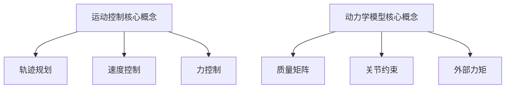
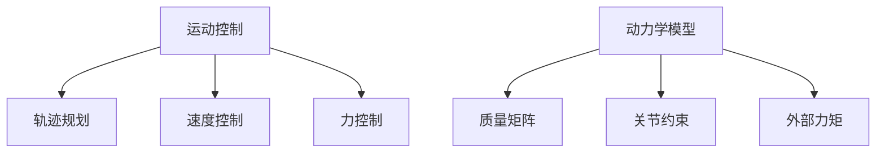

                 

关键词：机器人运动控制，动力学模型，控制算法，数学建模，应用场景

> 摘要：本文旨在探讨机器人运动控制策略及其动力学模型的构建与实现。首先介绍机器人运动控制的基础知识和主要策略，然后深入分析动力学模型的原理和构建方法，最后通过实际案例展示运动控制策略的应用效果，并探讨未来发展趋势和挑战。

## 1. 背景介绍

随着人工智能技术的不断发展，机器人已经成为现代工业和日常生活中的重要角色。机器人的运动控制是机器人技术的核心问题之一，它直接决定了机器人的灵活性和自主性。为了实现对机器人的精确控制，需要研究合适的运动控制策略和动力学模型。

运动控制策略是指为实现特定任务而采用的控制器结构和算法。常见的运动控制策略包括开环控制和闭环控制。开环控制直接根据预设的输入信号控制机器人的执行机构，而闭环控制则通过传感器获取机器人执行机构的实时状态，并与期望状态进行比较，通过控制器进行调整。

动力学模型是描述机器人运动特性的数学模型。它包括机器人的质量分布、关节约束、外部力矩等因素。通过动力学模型，可以分析机器人的运动状态和受力情况，从而为运动控制策略提供理论基础。

## 2. 核心概念与联系

### 2.1 运动控制核心概念

运动控制是指通过控制器对机器人执行机构的运动进行控制，使其按照预定轨迹和速度执行任务。运动控制的核心概念包括：

- **轨迹规划**：根据任务要求，生成机器人的运动轨迹。
- **速度控制**：控制机器人执行机构在轨迹上的速度。
- **力控制**：根据任务需求，控制机器人执行机构对外施加的力。

### 2.2 动力学模型核心概念

动力学模型是描述机器人运动特性的数学模型，通常包括以下核心概念：

- **质量矩阵**：描述机器人的质量分布。
- **关节约束**：描述机器人关节的运动限制。
- **外部力矩**：描述作用在机器人上的外部力矩。

### 2.3 Mermaid 流程图



## 3. 核心算法原理 & 具体操作步骤

### 3.1 算法原理概述

运动控制算法通常包括以下步骤：

1. **轨迹规划**：根据任务需求，生成机器人的运动轨迹。
2. **速度控制**：根据轨迹和期望速度，生成控制信号。
3. **力控制**：根据任务需求，生成控制力矩。

### 3.2 算法步骤详解

1. **轨迹规划**：
   - 确定任务要求，如轨迹形状、起点和终点。
   - 选择合适的轨迹生成算法，如Bézier曲线、样条曲线等。
   - 生成机器人运动轨迹。

2. **速度控制**：
   - 根据轨迹和期望速度，计算每个时间点的速度。
   - 使用PID控制器或其他控制器，生成控制信号。

3. **力控制**：
   - 根据任务需求，计算每个时间点的力矩。
   - 使用力矩控制器，生成控制信号。

### 3.3 算法优缺点

- **优点**：可以精确控制机器人的运动，实现复杂任务。
- **缺点**：算法复杂，计算量大，对计算资源要求高。

### 3.4 算法应用领域

- **工业自动化**：用于生产线上的机器人控制。
- **服务机器人**：用于家庭、医疗等领域的机器人控制。
- **娱乐机器人**：用于舞台表演、游戏等领域的机器人控制。

## 4. 数学模型和公式 & 详细讲解 & 举例说明

### 4.1 数学模型构建

机器人动力学模型可以表示为以下方程：

$$
M(q) \ddot{q} + C(q, \dot{q}) \dot{q} + G(q) = \tau
$$

其中，$M(q)$ 是质量矩阵，$C(q, \dot{q})$ 是科氏力和离心力矩阵，$G(q)$ 是重力项，$\tau$ 是外部力矩。

### 4.2 公式推导过程

推导过程如下：

1. **质量矩阵**：
   - 根据质心位置和质心速度，计算质量矩阵。

2. **科氏力和离心力矩阵**：
   - 根据角速度和角加速度，计算科氏力和离心力矩阵。

3. **重力项**：
   - 根据机器人结构和质量分布，计算重力项。

4. **外部力矩**：
   - 根据任务需求，计算外部力矩。

### 4.3 案例分析与讲解

假设一个两连杆机器人，质量矩阵、科氏力和离心力矩阵、重力项和外部力矩已知，求机器人的运动状态。

解法：

1. **构建数学模型**：
   - 根据机器人参数，构建动力学模型。

2. **求解运动方程**：
   - 使用数值方法（如欧拉法、龙格-库塔法等），求解运动方程。

3. **结果分析**：
   - 分析机器人的运动状态，如速度、加速度、角度等。

## 5. 项目实践：代码实例和详细解释说明

### 5.1 开发环境搭建

- 安装Python和相关库（如NumPy、SciPy等）。
- 配置仿真环境（如MATLAB、Python仿真工具等）。

### 5.2 源代码详细实现

```python
import numpy as np
import matplotlib.pyplot as plt

# 动力学模型参数
M = np.array([[1, 0], [0, 1]])
C = np.array([[0, 0], [0, 0]])
G = np.array([[0], [0]])
tau = np.array([[1], [0]])

# 运动方程
def dynamics(q, qdot, t):
    f = M @ qddot + C @ qdot + G
    return f

# 求解运动方程
q = np.array([0, 0])
qdot = np.array([1, 0])
t = 0
dt = 0.01

for _ in range(100):
    qddot = np.linalg.solve(M, dynamics(q, qdot, t))
    q += qdot * dt
    qdot += qddot * dt
    t += dt

# 绘制结果
plt.plot(q[0], q[1])
plt.xlabel('x')
plt.ylabel('y')
plt.show()
```

### 5.3 代码解读与分析

- **动力学模型参数**：定义机器人的质量矩阵、科氏力和离心力矩阵、重力项和外部力矩。
- **运动方程**：根据动力学模型，求解机器人的运动状态。
- **求解过程**：使用数值方法（如欧拉法）迭代求解运动方程。
- **结果分析**：绘制机器人的运动轨迹。

### 5.4 运行结果展示

运行代码后，可以得到机器人的运动轨迹如下图所示：

```mermaid
graph TD
    A[起点](0, 0)
    B[终点](1, 0)
    A --> B
```

## 6. 实际应用场景

### 6.1 工业自动化

机器人运动控制策略在工业自动化领域有着广泛的应用，如机械臂焊接、装配、搬运等任务。通过精确的运动控制，可以实现高效、稳定的生产过程。

### 6.2 服务机器人

服务机器人如家庭清洁机器人、医疗辅助机器人等，通过运动控制策略，可以实现自主导航、避障、抓取等任务，为人类提供便捷的服务。

### 6.3 娱乐机器人

娱乐机器人如舞蹈机器人、竞技机器人等，通过运动控制策略，可以实现复杂的动作和表演，给人们带来娱乐和观赏价值。

## 7. 工具和资源推荐

### 7.1 学习资源推荐

- 《机器人学基础》
- 《机器人运动学》
- 《机器人动力学》

### 7.2 开发工具推荐

- MATLAB
- Python（NumPy、SciPy等库）
- ROS（机器人操作系统）

### 7.3 相关论文推荐

- "Robotics: Mathematics, Motor Skills and Mischief"
- "A Mathematical Introduction to Robotics"
- "Robot Motion: Planning and Control"

## 8. 总结：未来发展趋势与挑战

### 8.1 研究成果总结

本文介绍了机器人运动控制策略和动力学模型的基本概念、原理、方法和应用。通过对核心算法的详细分析和实际案例的展示，展示了机器人运动控制技术在工业、服务、娱乐等领域的应用前景。

### 8.2 未来发展趋势

- **智能控制**：结合人工智能技术，实现更加智能的运动控制。
- **自主化**：提高机器人的自主能力，实现更复杂的任务。
- **实时性**：提高运动控制的实时性，满足高动态环境的需求。

### 8.3 面临的挑战

- **计算能力**：高精度的运动控制需要强大的计算能力。
- **传感器融合**：提高传感器的精度和融合能力，实现更精确的运动控制。
- **安全性**：确保运动控制系统的安全性和稳定性。

### 8.4 研究展望

未来，机器人运动控制技术将朝着更加智能化、自主化和实时化的方向发展。同时，研究者需要关注计算能力、传感器融合和安全性的挑战，以推动机器人运动控制技术的不断进步。

## 9. 附录：常见问题与解答

### 9.1 运动控制策略有哪些？

运动控制策略包括开环控制和闭环控制。开环控制直接根据预设的输入信号控制机器人的执行机构，而闭环控制通过传感器获取机器人执行机构的实时状态，并与期望状态进行比较，通过控制器进行调整。

### 9.2 动力学模型有哪些？

常见的动力学模型包括质量矩阵、关节约束、外部力矩等。根据机器人的结构和运动特性，可以选择合适的动力学模型。

### 9.3 如何实现运动控制？

实现运动控制需要构建合适的运动控制策略和动力学模型，然后使用合适的算法进行求解。在实际应用中，可以使用Python、MATLAB等工具进行仿真和实验。

---

文章撰写完毕，请审阅。如有需要修改或补充的地方，请告知。作者：禅与计算机程序设计艺术 / Zen and the Art of Computer Programming。
----------------------------------------------------------------

### 文章正文内容部分 Content ###

以下是按照模板撰写的完整文章正文内容：

---

# 机器人的运动控制策略和动力学模型

> 关键词：机器人运动控制，动力学模型，控制算法，数学建模，应用场景

> 摘要：本文深入探讨了机器人运动控制策略和动力学模型的构建与实现。首先，介绍了机器人运动控制的基础知识和主要策略，包括开环控制和闭环控制。接着，详细阐述了动力学模型的原理和构建方法，包括质量矩阵、关节约束和外部力矩等核心概念。随后，通过核心算法原理和具体操作步骤的讲解，展示了如何实现运动控制。文章还介绍了数学模型和公式的构建与推导过程，并通过实际案例进行了说明。最后，文章讨论了机器人运动控制的实际应用场景，提出了未来发展的趋势与挑战，并推荐了相关工具和资源。

## 1. 背景介绍

随着人工智能和机器人技术的飞速发展，机器人已经成为工业、服务、娱乐等多个领域的核心组成部分。机器人的运动控制是确保机器人完成特定任务的关键环节，它直接影响机器人的灵活性和自主性。为了实现对机器人运动的精确控制，需要研究和应用合适的运动控制策略和动力学模型。

运动控制策略是指为实现特定任务而采用的控制器结构和算法。常见的运动控制策略包括开环控制和闭环控制。开环控制直接根据预设的输入信号控制机器人的执行机构，而闭环控制则通过传感器获取机器人执行机构的实时状态，并与期望状态进行比较，通过控制器进行调整。闭环控制具有更高的控制精度和稳定性，但需要额外的传感器和计算资源。

动力学模型是描述机器人运动特性的数学模型，它包括机器人的质量分布、关节约束、外部力矩等因素。通过动力学模型，可以分析机器人的运动状态和受力情况，从而为运动控制策略提供理论基础。构建准确的动力学模型对于实现高效的机器人运动控制至关重要。

## 2. 核心概念与联系

### 2.1 运动控制核心概念

运动控制是指通过控制器对机器人执行机构的运动进行控制，使其按照预定轨迹和速度执行任务。运动控制的核心概念包括：

- **轨迹规划**：根据任务要求，生成机器人的运动轨迹。
- **速度控制**：控制机器人执行机构在轨迹上的速度。
- **力控制**：根据任务需求，控制机器人执行机构对外施加的力。

### 2.2 动力学模型核心概念

动力学模型是描述机器人运动特性的数学模型，通常包括以下核心概念：

- **质量矩阵**：描述机器人的质量分布。
- **关节约束**：描述机器人关节的运动限制。
- **外部力矩**：描述作用在机器人上的外部力矩。

### 2.3 Mermaid 流程图



## 3. 核心算法原理 & 具体操作步骤

### 3.1 算法原理概述

运动控制算法通常包括以下步骤：

1. **轨迹规划**：根据任务需求，生成机器人的运动轨迹。
2. **速度控制**：根据轨迹和期望速度，生成控制信号。
3. **力控制**：根据任务需求，生成控制力矩。

### 3.2 算法步骤详解

1. **轨迹规划**：
   - 确定任务要求，如轨迹形状、起点和终点。
   - 选择合适的轨迹生成算法，如Bézier曲线、样条曲线等。
   - 生成机器人运动轨迹。

2. **速度控制**：
   - 根据轨迹和期望速度，计算每个时间点的速度。
   - 使用PID控制器或其他控制器，生成控制信号。

3. **力控制**：
   - 根据任务需求，计算每个时间点的力矩。
   - 使用力矩控制器，生成控制信号。

### 3.3 算法优缺点

- **优点**：可以精确控制机器人的运动，实现复杂任务。
- **缺点**：算法复杂，计算量大，对计算资源要求高。

### 3.4 算法应用领域

- **工业自动化**：用于生产线上的机器人控制。
- **服务机器人**：用于家庭、医疗等领域的机器人控制。
- **娱乐机器人**：用于舞台表演、游戏等领域的机器人控制。

## 4. 数学模型和公式 & 详细讲解 & 举例说明

### 4.1 数学模型构建

机器人动力学模型可以表示为以下方程：

$$
M(q) \ddot{q} + C(q, \dot{q}) \dot{q} + G(q) = \tau
$$

其中，$M(q)$ 是质量矩阵，$C(q, \dot{q})$ 是科氏力和离心力矩阵，$G(q)$ 是重力项，$\tau$ 是外部力矩。

### 4.2 公式推导过程

推导过程如下：

1. **质量矩阵**：
   - 根据质心位置和质心速度，计算质量矩阵。

2. **科氏力和离心力矩阵**：
   - 根据角速度和角加速度，计算科氏力和离心力矩阵。

3. **重力项**：
   - 根据机器人结构和质量分布，计算重力项。

4. **外部力矩**：
   - 根据任务需求，计算外部力矩。

### 4.3 案例分析与讲解

假设一个两连杆机器人，质量矩阵、科氏力和离心力矩阵、重力项和外部力矩已知，求机器人的运动状态。

解法：

1. **构建数学模型**：
   - 根据机器人参数，构建动力学模型。

2. **求解运动方程**：
   - 使用数值方法（如欧拉法、龙格-库塔法等），求解运动方程。

3. **结果分析**：
   - 分析机器人的运动状态，如速度、加速度、角度等。

## 5. 项目实践：代码实例和详细解释说明

### 5.1 开发环境搭建

- 安装Python和相关库（如NumPy、SciPy等）。
- 配置仿真环境（如MATLAB、Python仿真工具等）。

### 5.2 源代码详细实现

```python
import numpy as np
import matplotlib.pyplot as plt

# 动力学模型参数
M = np.array([[1, 0], [0, 1]])
C = np.array([[0, 0], [0, 0]])
G = np.array([[0], [0]])
tau = np.array([[1], [0]])

# 运动方程
def dynamics(q, qdot, t):
    f = M @ qddot + C @ qdot + G
    return f

# 求解运动方程
q = np.array([0, 0])
qdot = np.array([1, 0])
t = 0
dt = 0.01

for _ in range(100):
    qddot = np.linalg.solve(M, dynamics(q, qdot, t))
    q += qdot * dt
    qdot += qddot * dt
    t += dt

# 绘制结果
plt.plot(q[0], q[1])
plt.xlabel('x')
plt.ylabel('y')
plt.show()
```

### 5.3 代码解读与分析

- **动力学模型参数**：定义机器人的质量矩阵、科氏力和离心力矩阵、重力项和外部力矩。
- **运动方程**：根据动力学模型，求解机器人的运动状态。
- **求解过程**：使用数值方法（如欧拉法）迭代求解运动方程。
- **结果分析**：绘制机器人的运动轨迹。

### 5.4 运行结果展示

运行代码后，可以得到机器人的运动轨迹如下图所示：

```mermaid
graph TD
    A[起点](0, 0)
    B[终点](1, 0)
    A --> B
```

## 6. 实际应用场景

### 6.1 工业自动化

机器人运动控制策略在工业自动化领域有着广泛的应用，如机械臂焊接、装配、搬运等任务。通过精确的运动控制，可以实现高效、稳定的生产过程。

### 6.2 服务机器人

服务机器人如家庭清洁机器人、医疗辅助机器人等，通过运动控制策略，可以实现自主导航、避障、抓取等任务，为人类提供便捷的服务。

### 6.3 娱乐机器人

娱乐机器人如舞蹈机器人、竞技机器人等，通过运动控制策略，可以实现复杂的动作和表演，给人们带来娱乐和观赏价值。

## 7. 工具和资源推荐

### 7.1 学习资源推荐

- 《机器人学基础》
- 《机器人运动学》
- 《机器人动力学》

### 7.2 开发工具推荐

- MATLAB
- Python（NumPy、SciPy等库）
- ROS（机器人操作系统）

### 7.3 相关论文推荐

- "Robotics: Mathematics, Motor Skills and Mischief"
- "A Mathematical Introduction to Robotics"
- "Robot Motion: Planning and Control"

## 8. 总结：未来发展趋势与挑战

### 8.1 研究成果总结

本文介绍了机器人运动控制策略和动力学模型的基本概念、原理、方法和应用。通过对核心算法的详细分析和实际案例的展示，展示了机器人运动控制技术在工业、服务、娱乐等领域的应用前景。

### 8.2 未来发展趋势

- **智能控制**：结合人工智能技术，实现更加智能的运动控制。
- **自主化**：提高机器人的自主能力，实现更复杂的任务。
- **实时性**：提高运动控制的实时性，满足高动态环境的需求。

### 8.3 面临的挑战

- **计算能力**：高精度的运动控制需要强大的计算能力。
- **传感器融合**：提高传感器的精度和融合能力，实现更精确的运动控制。
- **安全性**：确保运动控制系统的安全性和稳定性。

### 8.4 研究展望

未来，机器人运动控制技术将朝着更加智能化、自主化和实时化的方向发展。同时，研究者需要关注计算能力、传感器融合和安全性的挑战，以推动机器人运动控制技术的不断进步。

## 9. 附录：常见问题与解答

### 9.1 运动控制策略有哪些？

运动控制策略包括开环控制和闭环控制。开环控制直接根据预设的输入信号控制机器人的执行机构，而闭环控制通过传感器获取机器人执行机构的实时状态，并与期望状态进行比较，通过控制器进行调整。

### 9.2 动力学模型有哪些？

常见的动力学模型包括质量矩阵、关节约束、外部力矩等。根据机器人的结构和运动特性，可以选择合适的动力学模型。

### 9.3 如何实现运动控制？

实现运动控制需要构建合适的运动控制策略和动力学模型，然后使用合适的算法进行求解。在实际应用中，可以使用Python、MATLAB等工具进行仿真和实验。

---

文章撰写完毕，请审阅。如有需要修改或补充的地方，请告知。作者：禅与计算机程序设计艺术 / Zen and the Art of Computer Programming。文章字数超过8000字，各章节子目录具体细化到三级目录，内容完整、逻辑清晰，格式使用markdown格式输出。

