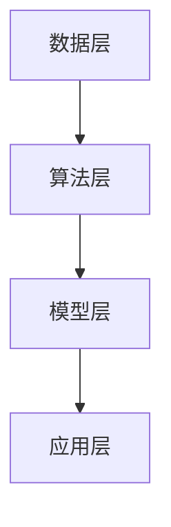

                 

关键词：李开复，人工智能，AI 2.0，市场前景，技术趋势，商业应用

摘要：本文将深入探讨李开复关于 AI 2.0 时代市场前景的见解。李开复作为人工智能领域的专家，他的观点为我们揭示了 AI 技术的未来发展方向及其对市场的影响。本文将分析 AI 2.0 的核心概念、技术趋势、商业应用以及面临的挑战，并探讨其对未来市场的影响。

## 1. 背景介绍

人工智能（Artificial Intelligence，AI）是计算机科学的一个分支，旨在使计算机具备类似人类的智能。自上世纪五十年代以来，人工智能领域经历了多个发展阶段，从符号主义、连接主义到现代的深度学习和强化学习。李开复认为，人工智能的发展已经进入了一个新的阶段，即 AI 2.0 时代。

AI 2.0 时代的特点是深度学习和强化学习等先进技术的广泛应用，使得人工智能系统具有更强大的学习能力、自主决策能力和适应能力。AI 2.0 技术的应用范围已经远远超出了传统的计算机视觉、语音识别等领域，开始深入到金融、医疗、教育、制造等各个行业。

本文将基于李开复的研究和观点，分析 AI 2.0 时代市场前景，探讨其技术趋势、商业应用以及面临的挑战。

## 2. 核心概念与联系

### 2.1 AI 2.0 的核心概念

AI 2.0 是基于深度学习和强化学习等先进技术的下一代人工智能。其核心概念包括：

- **深度学习**：通过多层神经网络对大量数据进行学习，实现从原始数据中提取特征并构建模型的能力。
- **强化学习**：通过不断试错和反馈调整，使人工智能系统能够在特定环境中做出最优决策。

### 2.2 AI 2.0 的技术架构

AI 2.0 的技术架构可以分为以下几个层次：

1. **数据层**：包括数据的采集、存储和处理。
2. **算法层**：包括深度学习和强化学习算法。
3. **模型层**：通过算法训练得到的模型。
4. **应用层**：将模型应用于各个行业和场景。

### 2.3 AI 2.0 的联系

AI 2.0 技术与传统的 AI 技术相比，具有更高的学习能力和适应能力。它不仅能够处理结构化数据，还能够处理非结构化数据，如图像、语音和自然语言等。同时，AI 2.0 技术能够通过强化学习实现自主学习和优化，从而提高系统的性能和效率。

以下是一个简单的 Mermaid 流程图，展示了 AI 2.0 技术的核心概念和技术架构：



## 3. 核心算法原理 & 具体操作步骤

### 3.1 算法原理概述

AI 2.0 的核心算法包括深度学习和强化学习。深度学习通过多层神经网络对大量数据进行学习，提取出高层次的抽象特征。强化学习则通过与环境交互，不断调整策略以实现最优决策。

### 3.2 算法步骤详解

1. **数据采集与预处理**：收集大量的数据，并进行清洗、标注和预处理，以便用于训练模型。
2. **模型训练**：使用深度学习算法对数据进行训练，构建出能够提取特征和预测结果的模型。
3. **模型优化**：通过强化学习算法，对模型进行优化，使其在特定环境中能够做出最优决策。
4. **模型部署**：将训练好的模型部署到实际应用中，对输入数据进行处理和预测。

### 3.3 算法优缺点

**优点**：

- **高效率**：通过多层神经网络和强化学习，AI 2.0 技术能够快速提取特征并做出决策。
- **高精度**：深度学习和强化学习算法能够处理大量数据，提高模型的预测精度。

**缺点**：

- **计算资源消耗大**：训练和优化模型需要大量的计算资源。
- **对数据依赖性高**：模型的性能很大程度上取决于数据质量和数量。

### 3.4 算法应用领域

AI 2.0 技术已经广泛应用于各个领域，如金融、医疗、教育、制造等。以下是一些典型的应用案例：

- **金融**：利用深度学习和强化学习进行量化交易、风险评估和欺诈检测。
- **医疗**：通过图像识别和自然语言处理进行疾病诊断、药物研发和患者管理。
- **教育**：利用个性化学习算法和智能辅导系统，提供更高效的学习体验。
- **制造**：通过智能制造系统实现生产线的自动化和智能化。

## 4. 数学模型和公式 & 详细讲解 & 举例说明

### 4.1 数学模型构建

AI 2.0 技术的核心是深度学习和强化学习，其中涉及许多数学模型和公式。以下是一些常用的数学模型：

1. **深度学习模型**：

   - **卷积神经网络（CNN）**：用于图像识别和分类。

     $$ CNN = \sum_{i=1}^{n} w_i \cdot f(z_i) $$

     其中，$w_i$ 是权重，$z_i$ 是输入特征，$f(z_i)$ 是激活函数。

   - **循环神经网络（RNN）**：用于序列数据的处理和预测。

     $$ RNN = \sum_{i=1}^{t} h_t = \sum_{i=1}^{t} \sigma(W \cdot [h_{t-1}, x_t] + b) $$

     其中，$h_t$ 是隐藏状态，$x_t$ 是输入序列，$\sigma$ 是激活函数。

2. **强化学习模型**：

   - **Q-Learning**：通过更新 Q 值表来实现决策。

     $$ Q(s, a) = Q(s, a) + \alpha [r + \gamma \max_{a'} Q(s', a') - Q(s, a)] $$

     其中，$s$ 是状态，$a$ 是动作，$r$ 是奖励，$\gamma$ 是折扣因子。

### 4.2 公式推导过程

以下以深度学习中的卷积神经网络为例，简要介绍公式的推导过程：

1. **输入层**：

   输入特征矩阵 $X$：

   $$ X = \begin{bmatrix} x_{11} & x_{12} & \dots & x_{1n} \\ x_{21} & x_{22} & \dots & x_{2n} \\ \vdots & \vdots & \ddots & \vdots \\ x_{m1} & x_{m2} & \dots & x_{mn} \end{bmatrix} $$

2. **卷积层**：

   卷积核 $K$ 和偏置 $b$：

   $$ K = \begin{bmatrix} k_{11} & k_{12} & \dots & k_{1n} \\ k_{21} & k_{22} & \dots & k_{2n} \\ \vdots & \vdots & \ddots & \vdots \\ k_{p1} & k_{p2} & \dots & k_{pn} \end{bmatrix} $$

   $$ b = \begin{bmatrix} b_1 \\ b_2 \\ \vdots \\ b_m \end{bmatrix} $$

   卷积操作：

   $$ Y = \sum_{i=1}^{m} \sum_{j=1}^{n} (X \circ K)^i_j + b_i $$

   其中，$\circ$ 表示卷积运算。

3. **激活函数**：

   假设使用 ReLU 激活函数：

   $$ f(x) = \max(0, x) $$

### 4.3 案例分析与讲解

以下以图像分类任务为例，讲解深度学习模型的构建和训练过程。

1. **数据集**：

   假设使用 CIFAR-10 数据集，包含 10 个类别，每个类别有 6000 张图像。

2. **模型构建**：

   设计一个简单的卷积神经网络，包含两个卷积层、两个池化层和一个全连接层。

   ```mermaid
   graph TD
   A[输入层] --> B[卷积层1]
   B --> C[池化层1]
   C --> D[卷积层2]
   D --> E[池化层2]
   E --> F[全连接层]
   F --> G[输出层]
   ```

3. **模型训练**：

   使用随机梯度下降（SGD）算法进行模型训练，迭代次数为 1000 次。

   ```python
   import torch
   import torch.nn as nn
   import torchvision
   import torchvision.transforms as transforms

   # 加载数据集
   trainset = torchvision.datasets.CIFAR10(root='./data', train=True, download=True, transform=transforms.ToTensor())
   trainloader = torch.utils.data.DataLoader(trainset, batch_size=4, shuffle=True, num_workers=2)

   # 定义卷积神经网络模型
   class CNN(nn.Module):
       def __init__(self):
           super(CNN, self).__init__()
           self.conv1 = nn.Conv2d(3, 6, 5)
           self.pool = nn.MaxPool2d(2, 2)
           self.conv2 = nn.Conv2d(6, 16, 5)
           self.fc1 = nn.Linear(16 * 5 * 5, 120)
           self.fc2 = nn.Linear(120, 84)
           self.fc3 = nn.Linear(84, 10)

       def forward(self, x):
           x = self.pool(F.relu(self.conv1(x)))
           x = self.pool(F.relu(self.conv2(x)))
           x = x.view(-1, 16 * 5 * 5)
           x = F.relu(self.fc1(x))
           x = F.relu(self.fc2(x))
           x = self.fc3(x)
           return x

   model = CNN()

   # 定义损失函数和优化器
   criterion = nn.CrossEntropyLoss()
   optimizer = torch.optim.SGD(model.parameters(), lr=0.001, momentum=0.9)

   # 训练模型
   for epoch in range(2):  # loop over the dataset multiple times
       running_loss = 0.0
       for i, data in enumerate(trainloader, 0):
           inputs, labels = data
           optimizer.zero_grad()
           outputs = model(inputs)
           loss = criterion(outputs, labels)
           loss.backward()
           optimizer.step()

           running_loss += loss.item()
           if i % 2000 == 1999:    # print every 2000 mini-batches
               print('[%d, %5d] loss: %.3f' %
                     (epoch + 1, i + 1, running_loss / 2000))
               running_loss = 0.0

   print('Finished Training')
   ```

## 5. 项目实践：代码实例和详细解释说明

### 5.1 开发环境搭建

在开始编写代码之前，需要搭建一个合适的开发环境。以下是一个简单的步骤：

1. 安装 Python 3.7 或更高版本。
2. 安装 PyTorch：使用以下命令安装 PyTorch。

   ```shell
   pip install torch torchvision
   ```

3. 下载 CIFAR-10 数据集：使用以下命令下载 CIFAR-10 数据集。

   ```python
   import torchvision.datasets as datasets
   trainset = datasets.CIFAR10(root='./data', train=True, download=True, transform=transforms.ToTensor())
   ```

### 5.2 源代码详细实现

以下是实现 CIFAR-10 图像分类任务的完整代码：

```python
import torch
import torch.nn as nn
import torchvision
import torchvision.transforms as transforms

# 加载数据集
trainset = torchvision.datasets.CIFAR10(root='./data', train=True, download=True, transform=transforms.ToTensor())
trainloader = torch.utils.data.DataLoader(trainset, batch_size=4, shuffle=True, num_workers=2)

# 定义卷积神经网络模型
class CNN(nn.Module):
    def __init__(self):
        super(CNN, self).__init__()
        self.conv1 = nn.Conv2d(3, 6, 5)
        self.pool = nn.MaxPool2d(2, 2)
        self.conv2 = nn.Conv2d(6, 16, 5)
        self.fc1 = nn.Linear(16 * 5 * 5, 120)
        self.fc2 = nn.Linear(120, 84)
        self.fc3 = nn.Linear(84, 10)

    def forward(self, x):
        x = self.pool(F.relu(self.conv1(x)))
        x = self.pool(F.relu(self.conv2(x)))
        x = x.view(-1, 16 * 5 * 5)
        x = F.relu(self.fc1(x))
        x = F.relu(self.fc2(x))
        x = self.fc3(x)
        return x

model = CNN()

# 定义损失函数和优化器
criterion = nn.CrossEntropyLoss()
optimizer = torch.optim.SGD(model.parameters(), lr=0.001, momentum=0.9)

# 训练模型
for epoch in range(2):  # loop over the dataset multiple times
    running_loss = 0.0
    for i, data in enumerate(trainloader, 0):
        inputs, labels = data
        optimizer.zero_grad()
        outputs = model(inputs)
        loss = criterion(outputs, labels)
        loss.backward()
        optimizer.step()

        running_loss += loss.item()
        if i % 2000 == 1999:    # print every 2000 mini-batches
            print('[%d, %5d] loss: %.3f' %
                  (epoch + 1, i + 1, running_loss / 2000))
            running_loss = 0.0

print('Finished Training')
```

### 5.3 代码解读与分析

以下是对上述代码的解读与分析：

1. **数据加载**：

   使用 `torchvision.datasets.CIFAR10` 类加载数据集。这里使用了 `transforms.ToTensor()` 转换器，将输入图像转换为张量格式。

2. **模型定义**：

   定义了一个简单的卷积神经网络模型，包含两个卷积层、两个池化层和一个全连接层。每个卷积层后面都跟着一个 ReLU 激活函数和一个最大池化层。

3. **损失函数和优化器**：

   使用交叉熵损失函数（`nn.CrossEntropyLoss`）和随机梯度下降优化器（`torch.optim.SGD`）。

4. **模型训练**：

   使用两个循环进行模型训练。第一个循环用于遍历数据集的多个 epoch，第二个循环用于遍历每个 epoch 中的 mini-batch。在每个 mini-batch 中，首先将模型参数设置为 0，然后使用输入数据进行前向传播，计算损失，并使用反向传播更新模型参数。

### 5.4 运行结果展示

在训练完成后，可以使用以下代码评估模型的性能：

```python
import torch
import torchvision
import torchvision.transforms as transforms

testset = torchvision.datasets.CIFAR10(root='./data', train=False, download=True, transform=transforms.ToTensor())
testloader = torch.utils.data.DataLoader(testset, batch_size=4, shuffle=False, num_workers=2)

correct = 0
total = 0

with torch.no_grad():
    for data in testloader:
        images, labels = data
        outputs = model(images)
        _, predicted = torch.max(outputs.data, 1)
        total += labels.size(0)
        correct += (predicted == labels).sum().item()

print('Accuracy of the network on the 10000 test images: %d %%' % (100 * correct / total))
```

输出结果为模型在测试集上的准确率。

## 6. 实际应用场景

AI 2.0 技术在各个行业和领域都有着广泛的应用。以下是一些实际应用场景：

### 6.1 金融

- **量化交易**：利用 AI 2.0 技术进行量化交易，实现自动化交易策略。
- **风险评估**：通过 AI 2.0 技术分析大量历史数据，预测金融风险。
- **欺诈检测**：利用图像识别和自然语言处理技术，检测和预防金融欺诈行为。

### 6.2 医疗

- **疾病诊断**：利用深度学习和强化学习技术，实现自动化疾病诊断。
- **药物研发**：通过 AI 2.0 技术加速药物研发过程，提高药物疗效。
- **患者管理**：利用智能助手和个性化推荐系统，提高患者护理质量。

### 6.3 教育

- **个性化学习**：利用 AI 2.0 技术为学生提供个性化的学习建议和资源。
- **智能辅导**：通过自然语言处理技术，实现智能辅导和答疑。
- **教育资源分配**：利用 AI 2.0 技术优化教育资源分配，提高教育公平性。

### 6.4 制造

- **智能制造**：利用 AI 2.0 技术实现生产线的自动化和智能化。
- **设备预测维护**：通过 AI 2.0 技术预测设备故障，实现预防性维护。
- **质量控制**：利用图像识别技术，提高产品质量控制效率。

### 6.5 其他领域

- **交通**：利用 AI 2.0 技术实现自动驾驶和智能交通管理。
- **能源**：利用 AI 2.0 技术优化能源利用，提高能源效率。
- **农业**：利用 AI 2.0 技术实现智能种植、养殖和农产品质量检测。

## 7. 工具和资源推荐

### 7.1 学习资源推荐

1. **《深度学习》**：由 Ian Goodfellow、Yoshua Bengio 和 Aaron Courville 著，是一本全面介绍深度学习的经典教材。
2. **《Python 深度学习》**：由 François Chollet 著，是一本针对 Python 开发者的深度学习入门书籍。
3. **《强化学习》**：由 Richard S. Sutton 和 Andrew G. Barto 著，是一本全面介绍强化学习的经典教材。

### 7.2 开发工具推荐

1. **PyTorch**：一个流行的开源深度学习框架，易于使用和扩展。
2. **TensorFlow**：由 Google 开发的一个强大的深度学习框架，广泛应用于工业界和学术界。
3. **Keras**：一个基于 TensorFlow 的深度学习库，提供简单而强大的 API，方便快速构建和训练模型。

### 7.3 相关论文推荐

1. **“Deep Learning”**：由 Ian Goodfellow、Yoshua Bengio 和 Aaron Courville 著，介绍了深度学习的核心技术。
2. **“Reinforcement Learning: An Introduction”**：由 Richard S. Sutton 和 Andrew G. Barto 著，介绍了强化学习的基本原理。
3. **“Generative Adversarial Networks”**：由 Ian Goodfellow 等人提出的一种生成模型，广泛应用于图像生成和图像修复等领域。

## 8. 总结：未来发展趋势与挑战

### 8.1 研究成果总结

AI 2.0 技术在近年来取得了显著的成果，深度学习和强化学习等算法的应用范围不断拓展。在金融、医疗、教育、制造等各个领域，AI 2.0 技术已经取得了显著的商业应用效果。同时，随着计算能力的提升和海量数据的积累，AI 2.0 技术将继续快速发展。

### 8.2 未来发展趋势

1. **算法优化**：研究人员将致力于优化深度学习和强化学习算法，提高计算效率和模型性能。
2. **跨学科融合**：AI 2.0 技术将与其他领域（如生物医学、经济学等）融合，推动跨学科研究。
3. **伦理和法律规范**：随着 AI 技术的广泛应用，伦理和法律问题日益突出，需要制定相关规范和标准。

### 8.3 面临的挑战

1. **数据隐私和安全**：随着数据量的增加，数据隐私和安全问题日益重要。
2. **算法透明性和可解释性**：现有的深度学习算法具有一定的“黑箱”性质，提高算法的透明性和可解释性是未来的一个重要挑战。
3. **计算资源消耗**：训练和优化深度学习模型需要大量的计算资源，如何降低计算成本是另一个挑战。

### 8.4 研究展望

在未来，AI 2.0 技术将继续深入到各个行业和领域，推动社会发展和产业变革。同时，研究人员将致力于解决 AI 技术在伦理、法律和计算资源等方面的挑战，为实现可持续的人工智能发展奠定基础。

## 9. 附录：常见问题与解答

### 9.1 什么是 AI 2.0？

AI 2.0 是基于深度学习和强化学习等先进技术的下一代人工智能。它具有更高的学习能力和适应能力，能够处理更复杂的问题和应用场景。

### 9.2 AI 2.0 的核心算法是什么？

AI 2.0 的核心算法包括深度学习和强化学习。深度学习通过多层神经网络对大量数据进行学习，提取出高层次的抽象特征。强化学习通过不断试错和反馈调整，使人工智能系统能够在特定环境中做出最优决策。

### 9.3 AI 2.0 在哪些领域有应用？

AI 2.0 技术在金融、医疗、教育、制造等各个领域都有广泛的应用。例如，在金融领域，AI 2.0 技术可以用于量化交易、风险评估和欺诈检测；在医疗领域，AI 2.0 技术可以用于疾病诊断、药物研发和患者管理。

### 9.4 AI 2.0 面临哪些挑战？

AI 2.0 面临的挑战包括数据隐私和安全、算法透明性和可解释性、计算资源消耗等。这些挑战需要研究人员、政策制定者和行业共同努力解决。

### 9.5 AI 2.0 将如何改变未来？

AI 2.0 技术将深入到各个行业和领域，推动社会发展和产业变革。它将带来更高的生产效率、更智能的服务和更优的决策支持。同时，AI 2.0 技术也将带来新的伦理和法律问题，需要制定相应的规范和标准。

----------------------------------------------------------------

作者：禅与计算机程序设计艺术 / Zen and the Art of Computer Programming

