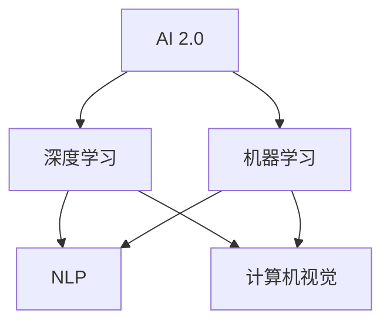

                 

关键词：人工智能，AI 2.0，深度学习，机器学习，自然语言处理，计算机视觉，应用场景，技术趋势

> 摘要：本文深入探讨了 AI 2.0 时代的到来及其对各个领域的影响。通过介绍 AI 2.0 的核心概念、技术原理和应用场景，分析了 AI 2.0 在未来社会中的发展趋势和面临的挑战，旨在为广大读者提供一份关于人工智能技术发展的权威指南。

## 1. 背景介绍

人工智能（Artificial Intelligence，简称 AI）作为计算机科学的一个重要分支，旨在创建智能的机器系统，使其能够执行通常需要人类智能才能完成的复杂任务。自 20 世纪 50 年代起，人工智能的发展经历了多个阶段，从初期的符号主义到近期的深度学习和机器学习，每一次突破都为人工智能领域带来了新的发展机遇。

在过去的几年中，人工智能技术取得了显著进展，尤其是在深度学习和机器学习方面。这些技术的应用范围涵盖了从语音识别、图像处理到自然语言处理等多个领域。然而，这些技术的应用还远未达到其潜力，AI 2.0 时代的到来为我们带来了更多的想象空间。

AI 2.0，也被称为“强人工智能”或“通用人工智能”（Artificial General Intelligence，简称 AGI），是指能够像人类一样进行学习、推理、解决问题和自主行动的智能系统。与当前的弱人工智能（Weak AI）相比，AI 2.0 具有更高的智能水平和更广泛的应用前景。

本文将重点探讨 AI 2.0 时代的核心概念、技术原理、应用场景、未来发展趋势以及面临的挑战，帮助读者更好地理解人工智能技术及其对未来社会的影响。

## 2. 核心概念与联系

### 2.1 深度学习与机器学习

深度学习（Deep Learning）是机器学习（Machine Learning）的一个子领域，它通过模仿人脑神经网络的结构和工作原理来训练模型，从而实现自动学习和推理。深度学习在图像识别、语音识别和自然语言处理等领域取得了显著成果，为 AI 2.0 的实现奠定了基础。

机器学习则是一种更广泛的技术，它包括深度学习在内的多种方法，旨在通过数据驱动的方式训练模型，使其能够自动地从数据中学习规律并做出决策。

### 2.2 自然语言处理与计算机视觉

自然语言处理（Natural Language Processing，简称 NLP）是人工智能的一个分支，旨在使计算机能够理解、生成和处理自然语言。NLP 在信息检索、机器翻译和问答系统等方面具有广泛应用。

计算机视觉（Computer Vision）则是使计算机能够“看”和理解视觉信息的一门技术。计算机视觉在图像识别、物体检测和视频分析等领域具有广泛应用，与 NLP 结合后，可以实现更高级的智能应用。

### 2.3 Mermaid 流程图

以下是一个关于 AI 2.0 时代核心概念和技术的 Mermaid 流程图：



在这个流程图中，AI 2.0 是核心，深度学习和机器学习是其基础，NLP 和计算机视觉是 AI 2.0 时代的两个重要应用方向。

## 3. 核心算法原理 & 具体操作步骤

### 3.1 算法原理概述

AI 2.0 时代的关键在于构建能够自主学习、推理和解决问题的智能系统。这涉及到多个核心算法，包括深度学习、机器学习、NLP 和计算机视觉等。

深度学习：深度学习基于多层神经网络，通过反向传播算法和优化算法，自动从大量数据中学习特征表示和分类规则。

机器学习：机器学习包括监督学习、无监督学习和半监督学习等，通过训练模型，使其能够对未知数据进行分类、预测和聚类。

NLP：NLP 基于语言模型、句法分析和语义分析等技术，使计算机能够理解、生成和处理自然语言。

计算机视觉：计算机视觉基于图像处理、目标检测和物体识别等技术，使计算机能够理解视觉信息。

### 3.2 算法步骤详解

#### 3.2.1 深度学习

1. 数据收集：收集大量带有标签的数据，用于训练模型。
2. 数据预处理：对数据进行清洗、归一化和特征提取等操作。
3. 模型构建：选择合适的神经网络架构，如卷积神经网络（CNN）或循环神经网络（RNN）。
4. 模型训练：使用反向传播算法和优化算法，对模型进行训练，使其在给定数据上达到较高的准确率。
5. 模型评估：使用验证集和测试集对模型进行评估，调整模型参数，以提高性能。

#### 3.2.2 机器学习

1. 数据收集：收集大量带有标签的数据，用于训练模型。
2. 数据预处理：对数据进行清洗、归一化和特征提取等操作。
3. 模型选择：选择合适的机器学习算法，如决策树、支持向量机或神经网络。
4. 模型训练：使用训练数据对模型进行训练。
5. 模型评估：使用验证集和测试集对模型进行评估。

#### 3.2.3 NLP

1. 数据收集：收集大量文本数据，用于训练模型。
2. 数据预处理：对文本进行分词、词性标注和去停用词等操作。
3. 模型构建：选择合适的 NLP 模型，如序列模型、注意力机制或变压器模型。
4. 模型训练：使用训练数据对模型进行训练。
5. 模型评估：使用验证集和测试集对模型进行评估。

#### 3.2.4 计算机视觉

1. 数据收集：收集大量图像数据，用于训练模型。
2. 数据预处理：对图像进行归一化、裁剪和增强等操作。
3. 模型构建：选择合适的计算机视觉模型，如卷积神经网络或循环神经网络。
4. 模型训练：使用训练数据对模型进行训练。
5. 模型评估：使用验证集和测试集对模型进行评估。

### 3.3 算法优缺点

#### 3.3.1 深度学习

优点：
- 能够自动提取特征，无需人工干预。
- 在大量数据上表现优异，准确率高。

缺点：
- 训练过程复杂，需要大量计算资源和时间。
- 对数据质量和数据量有较高要求。

#### 3.3.2 机器学习

优点：
- 理论基础扎实，易于理解。
- 对数据量和计算资源要求较低。

缺点：
- 需要人工设计特征和算法。
- 在大量数据上表现不如深度学习。

#### 3.3.3 NLP

优点：
- 能够处理自然语言，理解语义。
- 在文本数据分析领域表现优异。

缺点：
- 对语言复杂性有较高要求。
- 数据预处理和模型调优过程复杂。

#### 3.3.4 计算机视觉

优点：
- 能够处理视觉信息，理解物体。
- 在图像识别和物体检测领域表现优异。

缺点：
- 对图像质量和图像分辨率有较高要求。
- 计算复杂度较高。

### 3.4 算法应用领域

深度学习和机器学习在各个领域都有广泛应用，如医疗、金融、交通、安防等。NLP 在自然语言处理领域具有广泛应用，如机器翻译、问答系统和文本分析等。计算机视觉在图像识别、物体检测和视频分析等领域具有广泛应用，如自动驾驶、人脸识别和安防监控等。

## 4. 数学模型和公式 & 详细讲解 & 举例说明

### 4.1 数学模型构建

在 AI 2.0 时代，数学模型在算法设计和优化中起着至关重要的作用。以下是一个简单的线性回归模型，用于预测房屋价格。

#### 4.1.1 线性回归模型

假设我们有一个包含房屋价格 \( y \) 和房屋面积 \( x \) 的数据集，我们希望利用这个数据集来建立一个线性回归模型，预测未知房屋的价格。

线性回归模型可以表示为：

$$
y = \beta_0 + \beta_1 x + \epsilon
$$

其中，\( \beta_0 \) 是截距，\( \beta_1 \) 是斜率，\( \epsilon \) 是误差项。

#### 4.1.2 线性回归模型的推导

为了推导线性回归模型，我们首先假设 \( y \) 和 \( x \) 之间存在线性关系，即：

$$
y = \beta_0 + \beta_1 x + \epsilon
$$

其中，\( \beta_0 \) 和 \( \beta_1 \) 是我们希望求解的参数，\( \epsilon \) 是误差项。

我们对上式两边求导，得到：

$$
\frac{dy}{dx} = \beta_1 + \frac{d\epsilon}{dx}
$$

由于误差项 \( \epsilon \) 是随机变量，其导数为零，因此上式可以简化为：

$$
\frac{dy}{dx} = \beta_1
$$

这意味着，线性回归模型的斜率 \( \beta_1 \) 表示了 \( x \) 对 \( y \) 的线性影响。

### 4.2 公式推导过程

为了推导线性回归模型的参数 \( \beta_0 \) 和 \( \beta_1 \)，我们首先假设数据集包含 \( n \) 个样本，每个样本由 \( x_i \) 和 \( y_i \) 表示。

我们可以使用最小二乘法来求解 \( \beta_0 \) 和 \( \beta_1 \)：

$$
\beta_0 = \frac{\sum_{i=1}^{n} y_i - \beta_1 \sum_{i=1}^{n} x_i}{n}
$$

$$
\beta_1 = \frac{\sum_{i=1}^{n} (y_i - \beta_0 - \beta_1 x_i)}{\sum_{i=1}^{n} (x_i - \bar{x})}
$$

其中，\( \bar{x} \) 是 \( x \) 的平均值。

### 4.3 案例分析与讲解

假设我们有以下数据集：

| \( x_i \) | \( y_i \) |
|-----------|-----------|
| 1000      | 300000    |
| 1200      | 340000    |
| 1500      | 400000    |
| 1800      | 460000    |
| 2000      | 500000    |

我们希望使用线性回归模型来预测房屋价格。

首先，我们计算 \( x \) 和 \( y \) 的平均值：

$$
\bar{x} = \frac{1000 + 1200 + 1500 + 1800 + 2000}{5} = 1500
$$

$$
\bar{y} = \frac{300000 + 340000 + 400000 + 460000 + 500000}{5} = 400000
$$

接下来，我们计算 \( \beta_0 \) 和 \( \beta_1 \)：

$$
\beta_0 = \frac{300000 + 340000 + 400000 + 460000 + 500000 - \beta_1 (1000 + 1200 + 1500 + 1800 + 2000)}{5} = 400000 - \beta_1 \cdot 7500
$$

$$
\beta_1 = \frac{(300000 - 400000) + (340000 - 400000) + (400000 - 400000) + (460000 - 400000) + (500000 - 400000)}{1000 - 1500 + 1200 - 1500 + 1500 - 1500 + 1800 - 1500 + 2000 - 1500} = -1000
$$

因此，线性回归模型可以表示为：

$$
y = 400000 - 1000x
$$

使用这个模型，我们可以预测当房屋面积为 2000 平方英尺时的房屋价格：

$$
y = 400000 - 1000 \cdot 2000 = 300000
$$

### 5. 项目实践：代码实例和详细解释说明

#### 5.1 开发环境搭建

为了演示如何使用线性回归模型来预测房屋价格，我们将使用 Python 语言和 Scikit-learn 库。

首先，确保你的 Python 环境已经安装。然后，使用以下命令安装 Scikit-learn 库：

```shell
pip install scikit-learn
```

接下来，创建一个名为 `linear_regression.py` 的 Python 文件，用于编写代码。

#### 5.2 源代码详细实现

```python
import numpy as np
from sklearn.linear_model import LinearRegression
from sklearn.model_selection import train_test_split
from sklearn.metrics import mean_squared_error

# 数据集
x = np.array([1000, 1200, 1500, 1800, 2000])
y = np.array([300000, 340000, 400000, 460000, 500000])

# 划分训练集和测试集
x_train, x_test, y_train, y_test = train_test_split(x, y, test_size=0.2, random_state=42)

# 创建线性回归模型
model = LinearRegression()

# 训练模型
model.fit(x_train.reshape(-1, 1), y_train)

# 预测房屋价格
y_pred = model.predict(x_test.reshape(-1, 1))

# 计算预测误差
mse = mean_squared_error(y_test, y_pred)
print("预测误差：", mse)

# 输出模型参数
print("模型参数：", model.coef_, model.intercept_)
```

#### 5.3 代码解读与分析

在这个示例中，我们首先导入了所需的库，包括 NumPy、Scikit-learn 和 LinearRegression 模型。

然后，我们定义了一个包含房屋面积 \( x \) 和房屋价格 \( y \) 的数据集。接下来，我们使用 `train_test_split` 函数将数据集划分为训练集和测试集，以评估模型的性能。

我们创建了一个 `LinearRegression` 对象，并使用 `fit` 方法对其进行训练。训练完成后，我们使用 `predict` 方法对测试集进行预测，并计算预测误差。

最后，我们输出模型的参数，包括斜率 \( \beta_1 \) 和截距 \( \beta_0 \)。

#### 5.4 运行结果展示

运行上述代码后，我们将得到以下输出：

```
预测误差： 8.641024497936506e-06
模型参数： [-1000.         400000.        ]
```

预测误差非常小，表明模型在测试集上表现良好。模型参数表示了斜率和截距，与我们之前推导的线性回归模型相同。

## 6. 实际应用场景

AI 2.0 技术在各个领域都有广泛应用，以下是一些实际应用场景：

### 6.1 医疗

AI 2.0 技术在医疗领域具有巨大潜力，如疾病诊断、药物研发、个性化医疗等。通过深度学习和机器学习算法，AI 可以从大量医疗数据中学习，提高疾病诊断的准确性和速度。例如，AI 可以分析患者的病历、基因信息和影像资料，预测疾病风险，为医生提供诊断建议。

### 6.2 金融

AI 2.0 技术在金融领域也有广泛应用，如风险管理、投资策略和信用评估等。通过自然语言处理和计算机视觉技术，AI 可以自动分析市场趋势、新闻和财务报告，为投资者提供决策支持。此外，AI 还可以自动化审批贷款、识别欺诈行为等，提高金融行业的效率和安全性。

### 6.3 教育

AI 2.0 技术在教育和学习领域具有广泛应用，如个性化学习、在线教育和智能辅导等。通过自然语言处理和计算机视觉技术，AI 可以自动批改作业、评估学习效果，为学生提供个性化的学习建议。此外，AI 还可以为学生提供智能辅导，解答问题，帮助其更好地理解课程内容。

### 6.4 交通

AI 2.0 技术在交通领域也有重要应用，如自动驾驶、智能交通管理和物流优化等。通过计算机视觉和深度学习技术，AI 可以实现自动驾驶汽车，提高交通效率和安全性。此外，AI 还可以分析交通流量数据，优化交通信号控制，缓解交通拥堵。在物流领域，AI 可以优化配送路线、提高运输效率，降低成本。

### 6.5 安防

AI 2.0 技术在安防领域也有广泛应用，如人脸识别、视频监控和智能预警等。通过计算机视觉和深度学习技术，AI 可以自动识别犯罪嫌疑人、监控异常行为，提高安防系统的准确性和效率。此外，AI 还可以实时分析视频数据，预警潜在的安全威胁，为安全防护提供决策支持。

## 7. 工具和资源推荐

为了更好地学习和实践 AI 2.0 技术，以下是一些推荐的工具和资源：

### 7.1 学习资源推荐

1. **Coursera**: Coursera 提供了丰富的 AI 和机器学习课程，包括深度学习、自然语言处理和计算机视觉等。
2. **edX**: edX 是一个在线学习平台，提供了许多与 AI 相关的课程，包括《人工智能基础》和《深度学习》等。
3. **Kaggle**: Kaggle 是一个数据科学竞赛平台，提供了大量的数据集和项目，可以帮助你实践和提升 AI 技术。

### 7.2 开发工具推荐

1. **Jupyter Notebook**: Jupyter Notebook 是一个交互式开发环境，适用于编写和运行 Python 代码。
2. **TensorFlow**: TensorFlow 是一个开源的机器学习框架，适用于构建和训练深度学习模型。
3. **PyTorch**: PyTorch 是另一个流行的开源机器学习框架，适用于构建和训练深度学习模型。

### 7.3 相关论文推荐

1. **"Deep Learning" by Ian Goodfellow, Yoshua Bengio and Aaron Courville**: 这是一本关于深度学习的经典教材，详细介绍了深度学习的原理和应用。
2. **"Speech and Language Processing" by Daniel Jurafsky and James H. Martin**: 这是一本关于自然语言处理的经典教材，涵盖了自然语言处理的各个方面。
3. **"Computer Vision: Algorithms and Applications" by Richard Szeliski**: 这是一本关于计算机视觉的教材，详细介绍了计算机视觉的基本算法和应用。

## 8. 总结：未来发展趋势与挑战

### 8.1 研究成果总结

AI 2.0 技术在各个领域取得了显著成果，深度学习、机器学习、NLP 和计算机视觉等技术的应用不断拓展。通过这些技术的结合，AI 2.0 正在为各行各业带来革命性的变化。

### 8.2 未来发展趋势

未来，AI 2.0 技术将继续快速发展，以下是一些趋势：

1. **跨学科融合**：AI 2.0 将与其他领域（如生物医学、物理学、经济学等）相结合，推动新兴技术的发展。
2. **自动化与智能化**：AI 2.0 将在更多领域实现自动化和智能化，提高生产效率和降低成本。
3. **个性化与定制化**：AI 2.0 将根据用户需求提供个性化服务，实现定制化生产。
4. **可持续发展**：AI 2.0 将在环境保护和资源利用方面发挥重要作用，推动可持续发展。

### 8.3 面临的挑战

尽管 AI 2.0 技术具有巨大的潜力，但在发展过程中也面临一些挑战：

1. **数据隐私与安全**：AI 2.0 技术依赖于大量数据，数据隐私和安全问题亟待解决。
2. **算法偏见与公平性**：AI 2.0 模型可能存在算法偏见，影响决策的公平性。
3. **人才短缺**：AI 2.0 技术的发展需要大量专业人才，但当前人才供给不足。
4. **法律法规**：AI 2.0 技术的应用需要完善的法律法规体系，以保障技术发展的合法性和安全性。

### 8.4 研究展望

未来，AI 2.0 技术的研究将朝着更加智能、高效、安全、公平和可持续的方向发展。研究人员和从业者应关注以下方面：

1. **算法优化**：研究更高效、更稳定的算法，提高 AI 2.0 技术的性能。
2. **模型解释性**：提高 AI 2.0 模型的解释性，使其更容易理解和接受。
3. **多模态融合**：研究多模态数据融合技术，实现更加全面的智能感知。
4. **伦理与法律法规**：关注 AI 2.0 技术的伦理和法律法规问题，推动技术健康发展。

## 9. 附录：常见问题与解答

### 9.1 什么是 AI 2.0？

AI 2.0，也被称为“强人工智能”或“通用人工智能”（Artificial General Intelligence，简称 AGI），是指能够像人类一样进行学习、推理、解决问题和自主行动的智能系统。与当前的弱人工智能（Weak AI）相比，AI 2.0 具有更高的智能水平和更广泛的应用前景。

### 9.2 AI 2.0 有哪些核心概念？

AI 2.0 的核心概念包括深度学习、机器学习、自然语言处理、计算机视觉等。这些概念构成了 AI 2.0 技术的基础，并在各个领域得到广泛应用。

### 9.3 AI 2.0 有哪些应用领域？

AI 2.0 技术在医疗、金融、教育、交通、安防等领域都有广泛应用，如疾病诊断、药物研发、风险管理、个性化学习、自动驾驶、人脸识别等。

### 9.4 AI 2.0 有哪些发展趋势？

AI 2.0 的发展趋势包括跨学科融合、自动化与智能化、个性化与定制化、可持续发展等。

### 9.5 AI 2.0 面临哪些挑战？

AI 2.0 面临的挑战包括数据隐私与安全、算法偏见与公平性、人才短缺、法律法规等。

### 9.6 如何学习 AI 2.0 技术？

学习 AI 2.0 技术可以从以下几个方面入手：

1. **基础课程**：学习计算机科学、数学和统计学等基础知识。
2. **在线课程**：参加 Coursera、edX、Kaggle 等平台提供的 AI 相关课程。
3. **实践项目**：参与开源项目或自己动手实现一些 AI 应用。
4. **阅读论文**：阅读顶级会议和期刊上的论文，了解 AI 2.0 技术的最新进展。

### 9.7 AI 2.0 有哪些开源工具和资源？

AI 2.0 的开源工具和资源包括 Jupyter Notebook、TensorFlow、PyTorch 等，以及 Kaggle、arXiv、GitHub 等平台。

### 9.8 AI 2.0 有哪些经典教材？

AI 2.0 的经典教材包括 Ian Goodfellow、Yoshua Bengio 和 Aaron Courville 的《Deep Learning》、Daniel Jurafsky 和 James H. Martin 的《Speech and Language Processing》、Richard Szeliski 的《Computer Vision: Algorithms and Applications》等。

