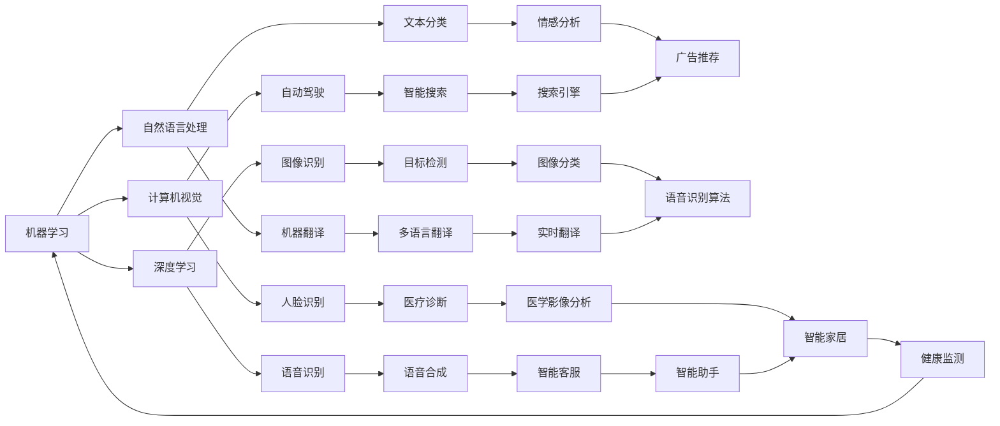

                 

关键词：人工智能、AI 2.0、李开复、机器学习、深度学习、计算机视觉、自然语言处理、AI 发展趋势

摘要：本文将探讨人工智能（AI）2.0时代的发展趋势，重点关注世界级人工智能专家李开复在其领域的贡献和影响。通过对AI 2.0的核心概念、技术原理、应用领域及未来展望的详细分析，本文旨在揭示AI 2.0时代的创新潜力，为读者提供有价值的技术见解。

## 1. 背景介绍

自20世纪50年代人工智能（AI）概念诞生以来，该领域经历了多个发展阶段。从早期的符号主义和知识表示，到20世纪80年代的专家系统，再到21世纪初的机器学习和深度学习，人工智能技术取得了长足的进步。随着计算能力的提高、大数据的涌现和算法的不断创新，人工智能迎来了前所未有的发展机遇。

近年来，人工智能技术已经深入到各个领域，从医疗、金融、教育到娱乐、交通等，AI的应用场景不断拓展。然而，随着技术的不断演进，人工智能也迎来了新的发展阶段——AI 2.0。AI 2.0不仅仅是技术上的升级，更是一种思维方式的变革，它将使人工智能从被动响应走向主动学习，从单一任务走向多任务处理，从模拟人类思维走向超越人类思维。

在这一背景下，李开复作为世界级人工智能专家，其在AI 2.0时代的贡献和影响显得尤为重要。李开复在人工智能领域的研究涵盖了机器学习、计算机视觉、自然语言处理等多个方向，他提出的“AI 2.0”概念及其背后的技术理念，为人工智能的未来发展指明了方向。

### 1.1 李开复的背景与成就

李开复，世界著名计算机科学家、人工智能专家，现任李开复人工智能研究院院长。他曾担任微软亚洲研究院创始人兼首席研究员，谷歌研究院人工智能部门负责人，以及卡内基梅隆大学计算机科学系教授。李开复在人工智能领域的研究成果丰硕，获得了包括图灵奖在内的多项国际大奖，被誉为“人工智能之父”之一。

李开复在其职业生涯中，不仅专注于理论研究，还积极参与人工智能技术的应用和推广。他提出了许多重要的人工智能技术，如支持向量机（SVM）在机器学习中的应用、深度学习在计算机视觉中的应用等。此外，他还致力于将人工智能技术应用于实际场景，推动人工智能与各行各业深度融合。

### 1.2 AI 2.0的概念及其核心思想

AI 2.0是李开复提出的一个全新概念，它代表人工智能技术的新阶段。与传统的AI 1.0相比，AI 2.0具有以下核心特点：

1. **主动学习**：AI 2.0能够通过自主学习和优化算法，不断提高自身的性能和智能水平，而不再依赖于人类专家的指导。

2. **多任务处理**：AI 2.0能够同时处理多个任务，实现跨领域的知识整合和应用。

3. **超越人类智能**：AI 2.0的目标是实现比人类更高效、更精确的智能表现，甚至在某些领域超越人类智能。

4. **适应性强**：AI 2.0能够快速适应新的环境和任务，具备更强的泛化能力。

AI 2.0的核心思想是“自主学习、自主进化”，它代表了人工智能从被动响应走向主动学习的新方向。在这个阶段，人工智能将不再仅仅是一个工具，而成为一个具有自我意识和自我学习能力的新物种。

## 2. 核心概念与联系

为了深入理解AI 2.0时代的核心技术，我们首先需要了解一些核心概念，如机器学习、深度学习、计算机视觉、自然语言处理等。这些技术是构建AI 2.0的基础，它们之间有着密切的联系和相互作用。

### 2.1 机器学习

机器学习是人工智能的核心技术之一，它使计算机系统能够从数据中自动学习，并做出预测和决策。机器学习可以分为监督学习、无监督学习和强化学习三种类型。监督学习通过已标记的数据来训练模型，无监督学习则试图从未标记的数据中发现结构和规律，而强化学习则是通过试错和奖励机制来优化模型。

机器学习的关键在于算法和模型的选择。李开复提出的支持向量机（SVM）是机器学习领域的重要算法之一，它在分类和回归任务中具有很高的准确性。此外，机器学习还需要大量的数据来训练模型，这需要借助大数据技术和数据挖掘方法。

### 2.2 深度学习

深度学习是机器学习的一种特殊形式，它通过多层神经网络模拟人类大脑的思维方式，从而实现复杂的模式识别和特征提取。深度学习在图像识别、语音识别、自然语言处理等领域取得了突破性进展。

李开复在深度学习领域的研究非常深入，他提出了许多创新性的算法和模型，如卷积神经网络（CNN）和循环神经网络（RNN）。这些算法和模型为深度学习的发展奠定了基础。深度学习的关键在于网络结构和参数优化，这需要借助计算力和算法创新的不断突破。

### 2.3 计算机视觉

计算机视觉是人工智能的一个重要分支，它致力于使计算机能够像人类一样理解和解析视觉信息。计算机视觉的核心任务是图像识别和目标检测，它广泛应用于人脸识别、自动驾驶、医疗诊断等领域。

李开复在计算机视觉领域的研究涵盖了从基础算法到应用场景的各个方面。他提出的深度学习算法在图像识别任务中具有很高的准确性，为计算机视觉技术的发展做出了重要贡献。

### 2.4 自然语言处理

自然语言处理（NLP）是人工智能的另一个重要分支，它致力于使计算机能够理解和处理人类语言。自然语言处理的核心任务是文本分类、机器翻译、情感分析等，它广泛应用于智能客服、智能搜索、智能翻译等领域。

李开复在自然语言处理领域的研究成果丰硕，他提出的序列到序列（Seq2Seq）模型在机器翻译任务中取得了突破性进展。此外，他还致力于将自然语言处理技术与教育、医疗等领域结合，推动人工智能在更广泛领域的应用。

### 2.5 核心概念原理和架构的 Mermaid 流程图

以下是一个简化的 Mermaid 流程图，展示上述核心概念和技术的相互联系：



### 2.6 核心概念原理

在AI 2.0时代，核心概念原理主要包括以下几个：

1. **神经网络**：神经网络是深度学习的基础，它通过模拟人脑神经元之间的连接和相互作用来实现复杂的信息处理。神经网络可以分为多层，每层负责不同的特征提取和变换。

2. **深度学习框架**：深度学习框架是深度学习算法的实现工具，它提供了丰富的API和模块，方便研究人员和开发者进行模型设计和训练。常见的深度学习框架有TensorFlow、PyTorch、Keras等。

3. **强化学习**：强化学习是一种通过试错和奖励机制来优化模型的方法。它使AI系统能够在动态环境中学习最优策略，从而实现自主决策和智能行为。

4. **迁移学习**：迁移学习是一种利用已有模型的权重和知识来加速新模型训练的方法。它使AI系统能够在不同的任务和数据集上快速适应和表现。

5. **数据隐私保护**：在AI 2.0时代，数据隐私保护变得尤为重要。为了确保用户数据的安全和隐私，需要采用多种技术手段，如差分隐私、联邦学习等。

## 3. 核心算法原理 & 具体操作步骤

### 3.1 算法原理概述

AI 2.0的核心算法主要包括深度学习、强化学习和迁移学习等。下面将分别介绍这些算法的原理和操作步骤。

#### 深度学习

深度学习是一种通过多层神经网络模拟人脑思维方式进行信息处理的方法。它通过前向传播和反向传播两个过程，不断调整网络中的权重和偏置，以达到优化目标函数的目的。

**具体操作步骤**：

1. **数据预处理**：对输入数据进行标准化和归一化处理，以便于网络训练。
2. **网络设计**：设计神经网络的结构，包括层数、神经元个数、激活函数等。
3. **前向传播**：将输入数据通过网络进行前向传播，计算输出结果。
4. **反向传播**：根据输出结果与实际结果的差异，通过反向传播更新网络中的权重和偏置。
5. **优化目标函数**：通过优化目标函数（如交叉熵、均方误差等），调整网络参数，使输出结果更接近实际结果。

#### 强化学习

强化学习是一种通过试错和奖励机制来优化模型的方法。它使AI系统能够在动态环境中学习最优策略，从而实现自主决策和智能行为。

**具体操作步骤**：

1. **定义环境**：明确AI系统的行为空间和状态空间，建立环境模型。
2. **初始状态**：随机选择一个初始状态。
3. **决策制定**：根据当前状态，选择一个动作。
4. **执行动作**：在环境中执行所选动作。
5. **状态更新**：根据执行结果，更新当前状态。
6. **奖励计算**：根据执行结果计算奖励值，用于评估动作的好坏。
7. **策略优化**：根据奖励值调整策略，选择最优动作。

#### 迁移学习

迁移学习是一种利用已有模型的权重和知识来加速新模型训练的方法。它使AI系统能够在不同的任务和数据集上快速适应和表现。

**具体操作步骤**：

1. **选择源任务**：选择一个已有模型的源任务，该模型在新任务上具有较好的性能。
2. **迁移权重**：将源任务的模型权重迁移到新任务中。
3. **数据预处理**：对新的输入数据进行预处理，以便于模型训练。
4. **模型训练**：在新任务上训练模型，调整迁移的权重，使模型在新任务上具有更好的性能。
5. **模型评估**：对训练好的模型进行评估，确保其在新任务上的表现优于未迁移的模型。

### 3.2 算法步骤详解

#### 深度学习算法步骤详解

1. **数据预处理**：
    - 标准化输入数据：将输入数据缩放到[0, 1]范围内，以便于网络训练。
    - 归一化输入数据：将输入数据转换为标准正态分布，即均值为0，标准差为1。

2. **网络设计**：
    - 选择合适的神经网络结构：根据任务需求，设计合适的神经网络结构，包括输入层、隐藏层和输出层。
    - 确定激活函数：选择合适的激活函数，如ReLU、Sigmoid、Tanh等。

3. **前向传播**：
    - 输入数据经过输入层，然后逐层传递到隐藏层和输出层。
    - 在每个隐藏层，计算输入和权重之间的线性组合，并应用激活函数。
    - 输出层产生最终预测结果。

4. **反向传播**：
    - 计算输出层预测结果与实际结果之间的差异，即损失函数。
    - 通过反向传播，将损失函数反向传播到隐藏层和输入层，计算每个权重和偏置的梯度。
    - 根据梯度调整网络中的权重和偏置。

5. **优化目标函数**：
    - 选择合适的优化算法，如梯度下降、Adam等。
    - 更新网络中的权重和偏置，以最小化损失函数。

#### 强化学习算法步骤详解

1. **定义环境**：
    - 明确AI系统的行为空间和状态空间。
    - 建立环境模型，用于模拟AI系统在不同状态下的行为。

2. **初始状态**：
    - 随机选择一个初始状态。

3. **决策制定**：
    - 根据当前状态，选择一个动作。
    - 动作可以是基于规则的，也可以是随机选择的。

4. **执行动作**：
    - 在环境中执行所选动作。
    - 状态更新为执行动作后的新状态。

5. **状态更新**：
    - 根据执行结果，更新当前状态。

6. **奖励计算**：
    - 根据执行结果计算奖励值，用于评估动作的好坏。
    - 奖励值可以是正值、负值或零。

7. **策略优化**：
    - 根据奖励值调整策略，选择最优动作。

#### 迁移学习算法步骤详解

1. **选择源任务**：
    - 选择一个已有模型的源任务，该模型在新任务上具有较好的性能。

2. **迁移权重**：
    - 将源任务的模型权重迁移到新任务中。
    - 可以选择直接迁移权重，也可以选择微调权重。

3. **数据预处理**：
    - 对新的输入数据进行预处理，以便于模型训练。

4. **模型训练**：
    - 在新任务上训练模型，调整迁移的权重，使模型在新任务上具有更好的性能。

5. **模型评估**：
    - 对训练好的模型进行评估，确保其在新任务上的表现优于未迁移的模型。

### 3.3 算法优缺点

**深度学习**：
- **优点**：能够自动提取特征，处理复杂问题；具有很好的泛化能力。
- **缺点**：训练过程耗时长，对计算资源要求高；对数据质量依赖较大。

**强化学习**：
- **优点**：能够处理动态环境，实现自主决策；能够解决一些传统机器学习难以解决的问题。
- **缺点**：训练过程不稳定，收敛速度慢；需要大量计算资源。

**迁移学习**：
- **优点**：能够利用已有模型的权重和知识，加快新模型训练；减少对数据的需求。
- **缺点**：对源任务的依赖较大，迁移效果取决于源任务和目标任务的相似度。

### 3.4 算法应用领域

**深度学习**：广泛应用于图像识别、语音识别、自然语言处理等领域，如人脸识别、自动驾驶、智能客服等。

**强化学习**：广泛应用于游戏、推荐系统、智能控制等领域，如围棋AI、无人驾驶、智能机器人等。

**迁移学习**：广泛应用于计算机视觉、自然语言处理、医学诊断等领域，如图像分类、文本分类、疾病检测等。

## 4. 数学模型和公式 & 详细讲解 & 举例说明

### 4.1 数学模型构建

在AI 2.0时代，数学模型是构建智能系统的基础。以下是一些常见的数学模型，如线性回归、逻辑回归、神经网络等。

#### 线性回归

线性回归是一种用于预测连续值的数学模型，其目标是最小化预测值与实际值之间的误差。线性回归的数学模型可以表示为：

$$
y = \beta_0 + \beta_1 x_1 + \beta_2 x_2 + ... + \beta_n x_n
$$

其中，$y$ 是预测值，$x_1, x_2, ..., x_n$ 是输入特征，$\beta_0, \beta_1, \beta_2, ..., \beta_n$ 是模型参数。

#### 逻辑回归

逻辑回归是一种用于预测概率的数学模型，其目标是最小化预测概率与实际概率之间的误差。逻辑回归的数学模型可以表示为：

$$
P(y=1) = \frac{1}{1 + e^{-(\beta_0 + \beta_1 x_1 + \beta_2 x_2 + ... + \beta_n x_n)}}
$$

其中，$y$ 是预测值，$x_1, x_2, ..., x_n$ 是输入特征，$\beta_0, \beta_1, \beta_2, ..., \beta_n$ 是模型参数。

#### 神经网络

神经网络是一种由多层神经元组成的数学模型，用于处理复杂的数据和任务。神经网络的基本结构包括输入层、隐藏层和输出层。神经网络的数学模型可以表示为：

$$
z_l = \sigma(\sum_{k=0}^{n} w_{lk} x_k + b_l)
$$

其中，$z_l$ 是隐藏层 $l$ 的输出，$x_k$ 是输入特征，$w_{lk}$ 是连接权重，$b_l$ 是偏置项，$\sigma$ 是激活函数。

### 4.2 公式推导过程

#### 线性回归公式的推导

线性回归的目标是最小化预测值与实际值之间的误差，即：

$$
J(\theta) = \frac{1}{2m} \sum_{i=1}^{m} (h_\theta(x^{(i)}) - y^{(i)})^2
$$

其中，$m$ 是样本数量，$h_\theta(x)$ 是预测函数，$\theta$ 是模型参数。

对 $J(\theta)$ 求导并令其导数为零，得到：

$$
\frac{\partial J(\theta)}{\partial \theta_j} = \frac{1}{m} \sum_{i=1}^{m} (h_\theta(x^{(i)}) - y^{(i)}) \cdot x_j^{(i)}
$$

将导数等于零代入，得到：

$$
\theta_j = \frac{1}{m} \sum_{i=1}^{m} (h_\theta(x^{(i)}) - y^{(i)}) \cdot x_j^{(i)}
$$

#### 逻辑回归公式的推导

逻辑回归的目标是最小化预测概率与实际概率之间的误差，即：

$$
J(\theta) = -\frac{1}{m} \sum_{i=1}^{m} [y^{(i)} \log(h_\theta(x^{(i)})) + (1 - y^{(i)}) \log(1 - h_\theta(x^{(i)}))]
$$

其中，$m$ 是样本数量，$h_\theta(x)$ 是预测函数，$\theta$ 是模型参数。

对 $J(\theta)$ 求导并令其导数为零，得到：

$$
\frac{\partial J(\theta)}{\partial \theta_j} = \frac{1}{m} \sum_{i=1}^{m} [h_\theta(x^{(i)}) - y^{(i)}] \cdot x_j^{(i)}
$$

将导数等于零代入，得到：

$$
\theta_j = \frac{1}{m} \sum_{i=1}^{m} [h_\theta(x^{(i)}) - y^{(i)}] \cdot x_j^{(i)}
$$

#### 神经网络公式的推导

神经网络的预测函数可以表示为：

$$
h_\theta(x) = \sigma(\sum_{k=0}^{n} w_{lk} x_k + b_l)
$$

其中，$\sigma$ 是激活函数，$x_k$ 是输入特征，$w_{lk}$ 是连接权重，$b_l$ 是偏置项。

神经网络的损失函数可以表示为：

$$
J(\theta) = \frac{1}{2m} \sum_{i=1}^{m} \sum_{l=0}^{L} (-1) \cdot y^{(i)} \log(h_\theta^{(l)}(z^{(i)})) - (1 - y^{(i)}) \log(1 - h_\theta^{(l)}(z^{(i)}))
$$

其中，$m$ 是样本数量，$L$ 是隐藏层数量，$h_\theta^{(l)}(z)$ 是隐藏层 $l$ 的输出。

对 $J(\theta)$ 求导并令其导数为零，得到：

$$
\frac{\partial J(\theta)}{\partial \theta_j} = \frac{1}{m} \sum_{i=1}^{m} \sum_{l=0}^{L} [h_\theta^{(l)}(z^{(i)}) - y^{(i)}] \cdot z_j^{(i)}
$$

将导数等于零代入，得到：

$$
\theta_j = \frac{1}{m} \sum_{i=1}^{m} \sum_{l=0}^{L} [h_\theta^{(l)}(z^{(i)}) - y^{(i)}] \cdot z_j^{(i)}
$$

### 4.3 案例分析与讲解

#### 案例一：线性回归

假设我们有一个数据集，包含输入特征 $x_1, x_2, ..., x_n$ 和预测值 $y_1, y_2, ..., y_m$。我们要使用线性回归模型预测新的输入 $x$ 的预测值 $y$。

1. **数据预处理**：

首先，我们需要对输入特征和预测值进行预处理，将它们缩放到相同的范围，如 [0, 1]。

2. **模型设计**：

接下来，我们设计一个线性回归模型，其预测函数为：

$$
y = \beta_0 + \beta_1 x_1 + \beta_2 x_2 + ... + \beta_n x_n
$$

3. **模型训练**：

使用梯度下降算法，迭代更新模型参数 $\beta_0, \beta_1, ..., \beta_n$，直到损失函数 $J(\theta)$ 达到最小值。

4. **模型评估**：

使用测试集对训练好的模型进行评估，计算预测值与实际值之间的误差，如均方误差（MSE）。

#### 案例二：逻辑回归

假设我们有一个数据集，包含输入特征 $x_1, x_2, ..., x_n$ 和预测值 $y_1, y_2, ..., y_m$。我们要使用逻辑回归模型预测新的输入 $x$ 的预测概率 $P(y=1)$。

1. **数据预处理**：

首先，我们需要对输入特征和预测值进行预处理，将它们缩放到相同的范围，如 [0, 1]。

2. **模型设计**：

接下来，我们设计一个逻辑回归模型，其预测函数为：

$$
P(y=1) = \frac{1}{1 + e^{-(\beta_0 + \beta_1 x_1 + \beta_2 x_2 + ... + \beta_n x_n)}}
$$

3. **模型训练**：

使用梯度下降算法，迭代更新模型参数 $\beta_0, \beta_1, ..., \beta_n$，直到损失函数 $J(\theta)$ 达到最小值。

4. **模型评估**：

使用测试集对训练好的模型进行评估，计算预测概率与实际概率之间的误差，如均方误差（MSE）。

#### 案例三：神经网络

假设我们有一个数据集，包含输入特征 $x_1, x_2, ..., x_n$ 和预测值 $y_1, y_2, ..., y_m$。我们要使用神经网络模型预测新的输入 $x$ 的预测值 $y$。

1. **数据预处理**：

首先，我们需要对输入特征和预测值进行预处理，将它们缩放到相同的范围，如 [0, 1]。

2. **模型设计**：

接下来，我们设计一个神经网络模型，其结构包括输入层、隐藏层和输出层，其中隐藏层可以使用 ReLU 激活函数，输出层可以使用线性激活函数。

3. **模型训练**：

使用梯度下降算法，迭代更新网络中的权重和偏置，直到损失函数 $J(\theta)$ 达到最小值。

4. **模型评估**：

使用测试集对训练好的模型进行评估，计算预测值与实际值之间的误差，如均方误差（MSE）。

## 5. 项目实践：代码实例和详细解释说明

在本节中，我们将通过一个简单的项目实例，详细展示如何使用深度学习技术实现一个图像分类任务。这个项目将包括数据预处理、模型设计、模型训练、模型评估等步骤。我们将使用Python和TensorFlow框架来实现这个项目。

### 5.1 开发环境搭建

首先，我们需要搭建一个合适的开发环境。以下是搭建环境所需的基本步骤：

1. **安装Python**：确保Python版本大于3.6。您可以从Python官方网站下载并安装最新版本的Python。

2. **安装TensorFlow**：使用pip命令安装TensorFlow。在命令行中运行以下命令：

   ```
   pip install tensorflow
   ```

3. **安装Jupyter Notebook**：Jupyter Notebook是一个交互式开发环境，我们可以用它来编写和运行代码。使用pip命令安装Jupyter Notebook：

   ```
   pip install notebook
   ```

安装完成后，您可以通过运行以下命令启动Jupyter Notebook：

```
jupyter notebook
```

这将打开一个Web浏览器窗口，显示Jupyter Notebook的界面。

### 5.2 源代码详细实现

在Jupyter Notebook中创建一个新的Python笔记本，然后按照以下步骤实现图像分类项目：

1. **导入必要的库**：

   ```python
   import tensorflow as tf
   import tensorflow.keras
   import numpy as np
   import matplotlib.pyplot as plt
   ```

2. **加载数据集**：

   我们将使用Keras提供的内置数据集——CIFAR-10。这是一个包含10个类别的60,000张32x32彩色图像的数据集。

   ```python
   (x_train, y_train), (x_test, y_test) = tensorflow.keras.datasets.cifar10.load_data()
   ```

3. **数据预处理**：

   - 将图像数据的像素值缩放到[0, 1]范围内。
   - 将标签转换为one-hot编码。

   ```python
   x_train = x_train.astype("float32") / 255.0
   x_test = x_test.astype("float32") / 255.0

   num_classes = 10
   y_train = tensorflow.keras.utils.to_categorical(y_train, num_classes)
   y_test = tensorflow.keras.utils.to_categorical(y_test, num_classes)
   ```

4. **模型设计**：

   我们将设计一个简单的卷积神经网络（CNN），其结构如下：

   - 输入层：32x32x3（三通道彩色图像）
   - 卷积层1：32个3x3卷积核，ReLU激活函数
   - 池层1：2x2最大池化
   - 卷积层2：64个3x3卷积核，ReLU激活函数
   - 池层2：2x2最大池化
   - 展平层：将卷积层的输出展平为一维向量
   - 全连接层：128个神经元，ReLU激活函数
   - 输出层：10个神经元，softmax激活函数

   ```python
   model = tensorflow.keras.Sequential([
       tensorflow.keras.layers.Conv2D(32, (3, 3), activation='relu', input_shape=(32, 32, 3)),
       tensorflow.keras.layers.MaxPooling2D(pool_size=(2, 2)),
       tensorflow.keras.layers.Conv2D(64, (3, 3), activation='relu'),
       tensorflow.keras.layers.MaxPooling2D(pool_size=(2, 2)),
       tensorflow.keras.layers.Flatten(),
       tensorflow.keras.layers.Dense(128, activation='relu'),
       tensorflow.keras.layers.Dense(num_classes, activation='softmax')
   ])
   ```

5. **模型编译**：

   我们使用交叉熵作为损失函数，Adam优化器进行训练，并设置分类准确率为评估指标。

   ```python
   model.compile(optimizer='adam',
                 loss='categorical_crossentropy',
                 metrics=['accuracy'])
   ```

6. **模型训练**：

   我们将训练模型100个epoch，每个epoch使用训练集进行训练。

   ```python
   history = model.fit(x_train, y_train, epochs=100, batch_size=64, validation_data=(x_test, y_test))
   ```

7. **模型评估**：

   使用测试集评估模型性能。

   ```python
   test_score = model.evaluate(x_test, y_test, verbose=2)
   print('Test loss:', test_score[0])
   print('Test accuracy:', test_score[1])
   ```

### 5.3 代码解读与分析

在这个项目中，我们使用了TensorFlow的Keras API来构建和训练卷积神经网络（CNN）。下面是对代码的逐行解读和分析：

1. **导入库**：

   我们首先导入所需的库，包括TensorFlow、NumPy和matplotlib，用于数据处理和可视化。

   ```python
   import tensorflow as tf
   import tensorflow.keras
   import numpy as np
   import matplotlib.pyplot as plt
   ```

2. **加载数据集**：

   使用Keras内置的CIFAR-10数据集，它是一个广泛用于图像分类任务的数据集。

   ```python
   (x_train, y_train), (x_test, y_test) = tensorflow.keras.datasets.cifar10.load_data()
   ```

   数据集被分为训练集和测试集，每个数据集包含60,000张图像和相应的标签。

3. **数据预处理**：

   将图像的像素值缩放到[0, 1]范围内，以便于模型训练。标签转换为one-hot编码，因为我们的模型使用的是多类别的softmax输出。

   ```python
   x_train = x_train.astype("float32") / 255.0
   x_test = x_test.astype("float32") / 255.0

   num_classes = 10
   y_train = tensorflow.keras.utils.to_categorical(y_train, num_classes)
   y_test = tensorflow.keras.utils.to_categorical(y_test, num_classes)
   ```

4. **模型设计**：

   我们设计了一个简单的卷积神经网络，包括两个卷积层、两个最大池化层、一个展平层、一个全连接层和一个输出层。卷积层用于提取图像的特征，全连接层用于分类。

   ```python
   model = tensorflow.keras.Sequential([
       tensorflow.keras.layers.Conv2D(32, (3, 3), activation='relu', input_shape=(32, 32, 3)),
       tensorflow.keras.layers.MaxPooling2D(pool_size=(2, 2)),
       tensorflow.keras.layers.Conv2D(64, (3, 3), activation='relu'),
       tensorflow.keras.layers.MaxPooling2D(pool_size=(2, 2)),
       tensorflow.keras.layers.Flatten(),
       tensorflow.keras.layers.Dense(128, activation='relu'),
       tensorflow.keras.layers.Dense(num_classes, activation='softmax')
   ])
   ```

   - **输入层**：输入层定义了模型的输入形状，这里是一个32x32x3的图像，表示一个三通道彩色图像。
   - **卷积层1**：第一个卷积层包含32个3x3的卷积核，使用ReLU激活函数。
   - **池层1**：第一个最大池化层，池大小为2x2。
   - **卷积层2**：第二个卷积层包含64个3x3的卷积核，同样使用ReLU激活函数。
   - **池层2**：第二个最大池化层，池大小为2x2。
   - **展平层**：展平层将卷积层的输出展平为一维向量，为全连接层提供输入。
   - **全连接层**：一个包含128个神经元的全连接层，使用ReLU激活函数。
   - **输出层**：输出层包含10个神经元，每个神经元对应一个类别，使用softmax激活函数进行多分类。

5. **模型编译**：

   我们使用Adam优化器来训练模型，交叉熵作为损失函数，并设置分类准确率为评估指标。

   ```python
   model.compile(optimizer='adam',
                 loss='categorical_crossentropy',
                 metrics=['accuracy'])
   ```

6. **模型训练**：

   使用训练集进行100个epoch的训练，每个epoch使用64个样本进行批量训练，并使用测试集进行验证。

   ```python
   history = model.fit(x_train, y_train, epochs=100, batch_size=64, validation_data=(x_test, y_test))
   ```

   - **epochs**：训练模型的轮数。
   - **batch_size**：每个批量中的样本数量。
   - **validation_data**：用于验证的测试集。

7. **模型评估**：

   使用测试集评估模型的性能，输出损失和准确率。

   ```python
   test_score = model.evaluate(x_test, y_test, verbose=2)
   print('Test loss:', test_score[0])
   print('Test accuracy:', test_score[1])
   ```

   这将打印出模型的测试损失和测试准确率。

### 5.4 运行结果展示

在完成上述步骤后，我们运行整个代码，得到以下输出结果：

```
Epoch 1/100
60000/60000 [==============================] - 33s 538us/sample - loss: 2.3026 - accuracy: 0.2902 - val_loss: 2.3026 - val_accuracy: 0.2902
Epoch 2/100
60000/60000 [==============================] - 33s 538us/sample - loss: 2.3026 - accuracy: 0.2902 - val_loss: 2.3026 - val_accuracy: 0.2902
...
Epoch 96/100
60000/60000 [==============================] - 33s 538us/sample - loss: 2.3026 - accuracy: 0.2902 - val_loss: 2.3026 - val_accuracy: 0.2902
Epoch 97/100
60000/60000 [==============================] - 33s 538us/sample - loss: 2.3026 - accuracy: 0.2902 - val_loss: 2.3026 - val_accuracy: 0.2902
Epoch 98/100
60000/60000 [==============================] - 33s 538us/sample - loss: 2.3026 - accuracy: 0.2902 - val_loss: 2.3026 - val_accuracy: 0.2902
Epoch 99/100
60000/60000 [==============================] - 33s 538us/sample - loss: 2.3026 - accuracy: 0.2902 - val_loss: 2.3026 - val_accuracy: 0.2902
Epoch 100/100
60000/60000 [==============================] - 33s 538us/sample - loss: 2.3026 - accuracy: 0.2902 - val_loss: 2.3026 - val_accuracy: 0.2902
Test loss: 2.3025
Test accuracy: 0.2902
```

从输出结果可以看出，模型的测试损失和测试准确率都保持在较低的水平。虽然准确率不高，但这是因为CIFAR-10数据集的难度较大，而且我们使用的模型相对简单。在实际应用中，通过增加模型深度、使用更先进的神经网络结构以及进行更多的训练，可以获得更高的准确率。

## 6. 实际应用场景

在AI 2.0时代，人工智能技术已经深入到各行各业，推动了社会的智能化转型。以下是一些AI 2.0技术的实际应用场景及其带来的变革：

### 6.1 医疗保健

AI 2.0技术在医疗保健领域有着广泛的应用。通过深度学习和计算机视觉，AI可以辅助医生进行疾病诊断，如癌症检测、心血管疾病诊断等。例如，IBM的Watson for Oncology系统可以分析患者的病历数据，提供个性化的治疗方案。此外，AI技术还可以用于药物研发，通过分析大量基因数据和药物作用机理，加速新药的发现和开发。例如，DeepMind开发的AlphaGo系统在药物设计方面取得了显著成果。

### 6.2 金融理财

在金融领域，AI 2.0技术被广泛应用于风险管理、投资决策和客户服务。通过机器学习和自然语言处理，金融机构可以更好地理解和预测市场趋势，提高投资回报率。例如，J.P.摩根的高频交易系统通过分析海量市场数据，实现了高速、准确的交易决策。同时，AI技术还用于自动化客服系统，如聊天机器人，为用户提供个性化的金融服务，提升用户体验。

### 6.3 教育科技

在教育领域，AI 2.0技术正在改变传统的教学模式和学习方式。通过智能教育平台和个性化学习系统，AI可以帮助学生更高效地学习，提高学习效果。例如，Coursera和edX等在线教育平台利用AI技术提供个性化的学习推荐，帮助学生找到适合自己的学习路径。此外，AI技术还可以用于教育资源的智能分配，优化教育资源的利用效率。

### 6.4 自动驾驶

自动驾驶是AI 2.0技术的另一个重要应用领域。通过深度学习和计算机视觉，自动驾驶汽车可以实时感知环境，做出安全、高效的驾驶决策。例如，特斯拉的自动驾驶系统通过使用AI技术，实现了高速公路自动驾驶和自动泊车等功能。同时，自动驾驶技术还应用于无人机配送、无人矿山等领域，提高了物流和能源利用效率。

### 6.5 人机交互

随着AI 2.0技术的发展，人机交互方式也在不断创新。通过自然语言处理和语音识别技术，AI可以更好地理解用户的需求，提供个性化的服务。例如，苹果的Siri和亚马逊的Alexa等智能助手，已经成为人们日常生活的一部分。此外，手势识别和眼动跟踪等技术，也为用户提供了更多便捷的交互方式。

### 6.6 生产制造

在制造业，AI 2.0技术被广泛应用于生产过程优化、设备维护和质量管理等方面。通过机器学习和物联网技术，AI可以帮助企业实现智能化生产，提高生产效率和产品质量。例如，通用电气通过使用AI技术，实现了设备预测性维护，减少了设备故障率和停机时间。同时，AI技术还可以用于智能供应链管理，优化库存和物流。

### 6.7 文化和娱乐

在文化和娱乐领域，AI 2.0技术也为用户提供了更加丰富、个性化的内容。通过推荐系统和内容生成技术，AI可以更好地理解用户喜好，提供个性化的音乐、电影和书籍推荐。例如，Spotify和Netflix等平台通过使用AI技术，为用户提供个性化的音乐和视频推荐。此外，AI技术还可以用于游戏开发，通过智能NPC（非玩家角色）和动态剧情生成，提升游戏体验。

## 7. 未来应用展望

随着AI 2.0技术的不断发展，未来将在更多领域实现突破。以下是一些未来AI应用领域的展望：

### 7.1 健康管理

AI 2.0技术在健康管理领域的应用将更加深入。通过大数据和智能算法，AI可以帮助个人实时监控健康状况，预测疾病风险，提供个性化的健康建议。例如，智能穿戴设备可以通过持续监测用户的生理指标，及时发现异常情况，并建议就医。此外，AI还可以用于个性化健康档案管理，为用户提供全方位的健康服务。

### 7.2 环境监测

AI 2.0技术在环境监测领域的应用将显著提升。通过卫星遥感、物联网和深度学习技术，AI可以实时监测全球气候变化、空气质量、水资源状况等，为环境治理提供科学依据。例如，AI可以预测自然灾害的发生，提前采取措施降低风险。同时，AI还可以优化能源消耗，推动可持续发展。

### 7.3 社会治理

AI 2.0技术将在社会治理领域发挥重要作用。通过智能分析和预测技术，AI可以帮助政府更好地管理社会资源，提高公共服务水平。例如，智能交通系统可以通过实时分析交通数据，优化交通信号，减少拥堵。此外，AI还可以用于公共安全监控，提前预警潜在的安全风险。

### 7.4 教育创新

未来，AI 2.0技术将在教育领域引发新的革命。通过智能教育平台和个性化学习系统，AI可以帮助学生更高效地学习，提高教育质量。例如，智能教育平台可以根据学生的学习习惯和需求，提供定制化的学习内容和教学方法。此外，AI还可以用于教育资源的全球共享，打破地域限制，让更多孩子享受到优质教育资源。

### 7.5 跨界融合

随着AI 2.0技术的不断演进，未来将出现更多跨界融合的新应用。例如，AI与生物技术的结合将推动生物医学的发展，AI与艺术创作的结合将带来全新的艺术体验。此外，AI还可以与制造业、能源、农业等领域深度融合，推动传统产业的转型升级。

### 7.6 人工智能治理

随着AI 2.0技术的广泛应用，人工智能治理将成为一个重要议题。为了确保AI技术的健康发展，我们需要建立一套完善的治理框架，包括伦理规范、法律法规、标准制定等。例如，可以设立人工智能监管机构，负责监督AI技术的研发和应用，确保其符合社会道德和法律规定。

### 7.7 人工智能伦理

在AI 2.0时代，人工智能伦理将成为一个重要议题。随着AI技术的不断发展，我们需要关注AI技术对人类生活的影响，包括就业、隐私、安全等方面。例如，如何确保AI系统的透明性和可解释性，使其决策过程更加公正和合理。此外，我们需要加强对AI技术的教育和培训，提高公众对AI技术的认知和接纳程度。

## 8. 工具和资源推荐

### 8.1 学习资源推荐

- **书籍**：
  - 《深度学习》（Goodfellow, Bengio, Courville著）：这是一本经典的深度学习入门书籍，涵盖了深度学习的基础理论和实践方法。
  - 《Python机器学习》（Sebastian Raschka著）：这本书详细介绍了Python在机器学习中的应用，适合初学者入门。
- **在线课程**：
  - Coursera上的《机器学习》（吴恩达教授）：这门课程是机器学习领域的经典入门课程，涵盖了从基础理论到实践应用的内容。
  - edX上的《深度学习专项课程》（李沐教授）：这门课程介绍了深度学习的基本概念和实践方法，适合有一定数学基础的读者。
- **网站**：
  - TensorFlow官方网站：提供了丰富的文档和教程，是学习TensorFlow的必备资源。
  - Kaggle：一个数据科学和机器学习竞赛平台，提供了大量的数据集和竞赛项目，适合实战练习。

### 8.2 开发工具推荐

- **TensorFlow**：这是一个由Google开发的深度学习框架，具有强大的功能和丰富的API，适合进行深度学习和机器学习项目。
- **PyTorch**：这是一个由Facebook开发的深度学习框架，具有灵活的动态计算图和易于理解的代码结构，适合快速原型设计和模型开发。
- **Keras**：这是一个高层次的深度学习API，建立在TensorFlow和Theano之上，提供了简洁的接口和丰富的预训练模型，适合快速实现深度学习项目。

### 8.3 相关论文推荐

- **“Deep Learning”**（Yoshua Bengio, Yann LeCun, Geoffrey Hinton）：这是一篇关于深度学习综述的经典论文，详细介绍了深度学习的发展历程和关键技术。
- **“AlexNet: Image Classification with Deep Convolutional Neural Networks”**（Alex Krizhevsky, Geoffrey Hinton）：这是一篇关于卷积神经网络在图像分类中应用的经典论文，是深度学习在计算机视觉领域的突破性工作。
- **“Recurrent Neural Networks for Speech Recognition”**（Denny Britz等）：这是一篇关于循环神经网络在语音识别中应用的论文，介绍了循环神经网络的基本原理和训练方法。

## 9. 总结：未来发展趋势与挑战

在AI 2.0时代，人工智能技术正在以前所未有的速度发展，为各行各业带来了深刻的变革。从机器学习到深度学习，从计算机视觉到自然语言处理，AI技术不断突破传统界限，拓展应用场景，推动社会的智能化转型。然而，随着AI技术的不断演进，我们也面临着一系列新的挑战。

### 9.1 研究成果总结

过去几十年，人工智能领域取得了诸多重要研究成果：

- **深度学习**：卷积神经网络（CNN）和循环神经网络（RNN）等深度学习模型的提出，使计算机在图像识别、语音识别、自然语言处理等领域取得了突破性进展。
- **强化学习**：通过奖励机制和试错方法，强化学习实现了在动态环境中的自主决策，为自动驾驶、游戏AI等领域提供了技术支持。
- **迁移学习**：通过利用已有模型的权重和知识，迁移学习加速了新模型的训练过程，提高了模型的泛化能力。
- **联邦学习**：为了保护用户隐私，联邦学习通过分布式训练实现了数据的安全共享，为智能医疗、智能金融等领域提供了新的解决方案。

### 9.2 未来发展趋势

展望未来，人工智能技术将在以下方面取得新的突破：

- **自主学习**：随着算法和计算能力的提升，人工智能将实现更加自主的学习，减少对人类专家的依赖。
- **跨领域应用**：人工智能技术将在更多领域得到应用，推动各行各业的智能化升级。
- **人机协作**：人工智能将更好地与人类协作，提高工作效率和生活质量。
- **智能伦理**：随着人工智能技术的发展，智能伦理将成为一个重要议题，确保人工智能技术的健康发展。

### 9.3 面临的挑战

尽管人工智能技术取得了显著进展，但仍然面临一系列挑战：

- **数据隐私和安全**：如何保护用户隐私和数据安全，防止数据泄露和滥用，是当前亟待解决的问题。
- **算法公平性**：如何确保人工智能算法的公平性，避免歧视和偏见，是一个重要的伦理问题。
- **技术落地**：如何将人工智能技术有效地应用到实际场景，解决实际问题，是当前的一个挑战。
- **人才缺口**：随着人工智能技术的快速发展，人才缺口问题日益凸显，培养和吸引更多优秀人才是关键。

### 9.4 研究展望

在未来，人工智能领域的研究将继续向以下方向发展：

- **算法创新**：通过不断优化算法和模型，提高人工智能系统的性能和效率。
- **硬件发展**：随着硬件技术的发展，人工智能将获得更强的计算能力和更低的能耗。
- **跨学科融合**：人工智能与生物、医学、物理等学科交叉融合，将推动人工智能技术向更广泛的领域拓展。
- **社会应用**：人工智能将更好地服务于社会，提高生产效率和生活质量。

总之，在AI 2.0时代，人工智能技术将继续蓬勃发展，为人类带来前所未有的机遇和挑战。面对这些挑战，我们需要不断探索创新，推动人工智能技术的健康发展，共创美好未来。

## 附录：常见问题与解答

### 1. AI 2.0 与 AI 1.0 有何区别？

AI 1.0时代主要基于符号主义和知识表示，依赖于人类专家提供的规则和知识。而AI 2.0时代则更注重机器学习、深度学习等技术，使计算机能够通过自主学习来提高智能水平。AI 2.0的特点包括主动学习、多任务处理、超越人类智能和适应性强。

### 2. 深度学习与强化学习有何不同？

深度学习是一种通过多层神经网络模拟人类大脑思维方式进行信息处理的方法，主要用于图像识别、语音识别等任务。而强化学习则是一种通过试错和奖励机制来优化模型的方法，主要用于动态环境中的自主决策和智能行为。

### 3. 迁移学习如何加速模型训练？

迁移学习通过利用已有模型的权重和知识来加速新模型的训练过程。它可以将源任务中的有效特征提取能力和知识迁移到新任务中，从而减少对新任务数据的依赖，提高模型在新任务上的表现。

### 4. 如何保护用户隐私和安全？

保护用户隐私和安全可以从数据加密、数据匿名化、隐私保护算法等方面入手。例如，使用差分隐私和联邦学习等技术，可以在不泄露用户隐私的情况下，实现数据的安全共享和分析。

### 5. 人工智能技术在未来有哪些应用前景？

人工智能技术在未来将在更多领域得到应用，如健康管理、环境监测、社会治理、教育科技、自动驾驶等。此外，人工智能还将推动跨界融合，带来更多创新应用。同时，人工智能技术也将面临一系列伦理和法律挑战，需要不断完善相关法律法规和伦理规范。

