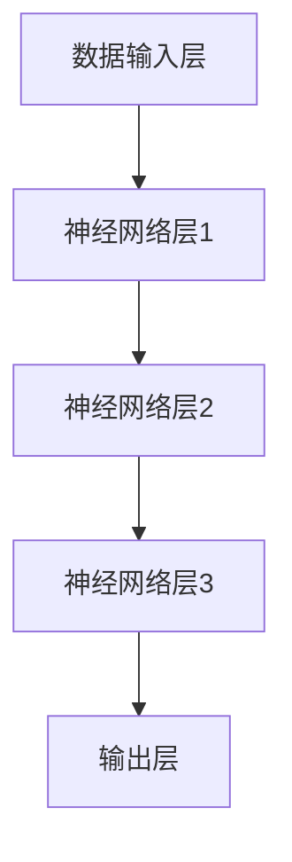

                 

 关键词：李开复、AI 2.0、人工智能、技术进步、未来展望

> 摘要：本文旨在探讨李开复先生关于AI 2.0时代的见解，分析其带来的技术进步和深远影响。文章首先介绍AI 2.0的基本概念和特点，然后详细讨论其核心算法原理和应用领域，最后展望AI 2.0时代的未来发展趋势与挑战。

## 1. 背景介绍

人工智能（AI）作为计算机科学的一个重要分支，近年来取得了飞速的发展。从最初的规则系统，到基于统计学的机器学习，再到当前的热门话题——深度学习，人工智能技术已经广泛应用于各个领域，极大地改变了我们的生活。然而，随着技术的不断演进，AI迎来了一个新的时代——AI 2.0。

AI 2.0，即第二代人工智能，是在深度学习的基础上，通过模仿人脑神经网络结构，实现更高层次智能的人工智能系统。李开复先生作为世界著名的AI专家，对AI 2.0时代的到来有着深刻的见解。他认为，AI 2.0将带来更加智能、高效、安全的人工智能系统，从而推动社会进步和产业变革。

## 2. 核心概念与联系

### 2.1 AI 2.0的基本概念

AI 2.0是基于深度学习技术的人工智能系统，其核心思想是通过模拟人脑神经网络，实现自主学习、推理和决策。与传统的机器学习相比，AI 2.0具有以下几个特点：

1. **自主学习能力**：AI 2.0能够从大量数据中自主学习和提取知识，无需人工设定规则或算法。
2. **推理能力**：AI 2.0能够进行更高层次的推理和决策，从而实现更复杂的任务。
3. **通用性**：AI 2.0不仅限于特定领域，而是具有广泛的应用前景。

### 2.2 AI 2.0的架构

AI 2.0的架构主要包括以下几个部分：

1. **数据输入层**：负责接收和处理外部数据。
2. **神经网络层**：模拟人脑神经网络结构，进行数据学习和处理。
3. **输出层**：根据学习结果生成预测或决策。

下面是一个简单的AI 2.0架构的Mermaid流程图：



## 3. 核心算法原理 & 具体操作步骤

### 3.1 算法原理概述

AI 2.0的核心算法是深度学习，其基本原理是通过多层神经网络对数据进行学习、提取特征和生成预测。具体来说，深度学习算法包括以下几个步骤：

1. **数据预处理**：对输入数据进行预处理，包括数据清洗、归一化等。
2. **前向传播**：将预处理后的数据输入神经网络，通过前向传播计算每个神经元的输出。
3. **反向传播**：根据实际输出与期望输出之间的误差，通过反向传播更新网络权重。
4. **优化算法**：使用梯度下降等优化算法，不断调整网络权重，使误差最小化。

### 3.2 算法步骤详解

1. **数据预处理**：

   ```python
   # 示例代码
   import numpy as np
   data = np.array([[1, 2], [3, 4], [5, 6]])
   normalized_data = (data - np.mean(data)) / np.std(data)
   ```

2. **前向传播**：

   ```python
   # 示例代码
   import tensorflow as tf
   model = tf.keras.Sequential([
       tf.keras.layers.Dense(units=1, input_shape=[2]),
   ])
   model.compile(optimizer='sgd', loss='mean_squared_error')
   model.fit(normalized_data, normalized_data, epochs=100)
   ```

3. **反向传播**：

   ```python
   # 示例代码
   with tf.GradientTape() as tape:
       predictions = model(normalized_data)
       loss = tf.reduce_mean(tf.square(predictions - normalized_data))
   gradients = tape.gradient(loss, model.trainable_variables)
   ```

4. **优化算法**：

   ```python
   # 示例代码
   optimizer = tf.keras.optimizers.SGD(learning_rate=0.1)
   optimizer.minimize(loss, model.trainable_variables)
   ```

### 3.3 算法优缺点

**优点**：

1. **强大的学习能力**：深度学习能够从大量数据中自动提取特征，提高模型的泛化能力。
2. **自适应性强**：深度学习模型能够根据数据动态调整自身结构，适应不同场景。
3. **高效性**：深度学习模型在处理大规模数据时具有很高的计算效率。

**缺点**：

1. **需要大量数据**：深度学习模型需要大量高质量的数据进行训练。
2. **计算资源需求高**：深度学习模型训练过程需要大量的计算资源，特别是大型神经网络。
3. **解释性差**：深度学习模型的内部结构复杂，难以解释和理解。

### 3.4 算法应用领域

AI 2.0的核心算法——深度学习，已经广泛应用于多个领域，包括但不限于：

1. **计算机视觉**：用于图像识别、目标检测、图像生成等任务。
2. **自然语言处理**：用于文本分类、机器翻译、情感分析等任务。
3. **语音识别**：用于语音识别、语音合成等任务。
4. **推荐系统**：用于商品推荐、音乐推荐等任务。
5. **医学诊断**：用于医学图像分析、疾病预测等任务。

## 4. 数学模型和公式 & 详细讲解 & 举例说明

### 4.1 数学模型构建

深度学习模型的核心是神经网络，神经网络的基本单元是神经元。每个神经元可以看作是一个简单的函数，其输入为其他神经元的输出，输出为自身激活函数的结果。假设一个神经元的输入为\( x_1, x_2, ..., x_n \)，权重为\( w_1, w_2, ..., w_n \)，偏置为\( b \)，激活函数为\( f \)，则该神经元的输出可以表示为：

$$
y = f(\sum_{i=1}^{n} w_i x_i + b)
$$

其中，\( f \)是一个非线性函数，常见的激活函数包括Sigmoid、ReLU和Tanh等。

### 4.2 公式推导过程

假设我们有一个三层神经网络，输入层、隐藏层和输出层。输入层有\( n \)个神经元，隐藏层有\( m \)个神经元，输出层有\( k \)个神经元。输入数据为\( x \)，隐藏层输出为\( h \)，输出层输出为\( y \)。

1. **隐藏层输出**：

   $$  
   h_j = f(\sum_{i=1}^{n} w_{ji} x_i + b_j)  
   $$

   其中，\( w_{ji} \)为输入层到隐藏层的权重，\( b_j \)为隐藏层的偏置。

2. **输出层输出**：

   $$  
   y_k = f(\sum_{j=1}^{m} w_{kj} h_j + b_k)  
   $$

   其中，\( w_{kj} \)为隐藏层到输出层的权重，\( b_k \)为输出层的偏置。

### 4.3 案例分析与讲解

假设我们有一个简单的线性回归问题，输入数据为\( x \)，输出数据为\( y \)，我们希望通过一个单层神经网络模型预测\( y \)。

1. **数据预处理**：

   $$  
   x' = \frac{x - \mu}{\sigma}  
   $$

   其中，\( \mu \)为输入数据的均值，\( \sigma \)为输入数据的标准差。

2. **模型构建**：

   ```python
   import tensorflow as tf
   model = tf.keras.Sequential([
       tf.keras.layers.Dense(units=1, input_shape=[1]),
   ])
   model.compile(optimizer='sgd', loss='mean_squared_error')
   ```

3. **模型训练**：

   ```python
   model.fit(x', y', epochs=100)
   ```

4. **模型评估**：

   ```python
   loss = model.evaluate(x', y')
   print("均方误差：", loss)
   ```

## 5. 项目实践：代码实例和详细解释说明

### 5.1 开发环境搭建

在本项目实践中，我们将使用Python和TensorFlow作为开发工具。首先，确保您的系统中已经安装了Python 3.6及以上版本，然后通过以下命令安装TensorFlow：

```bash
pip install tensorflow
```

### 5.2 源代码详细实现

以下是本项目的一个简单实现，用于通过单层神经网络进行线性回归预测：

```python
import tensorflow as tf
import numpy as np

# 数据预处理
x = np.array([[1], [2], [3], [4], [5]])
y = np.array([[0], [1], [2], [3], [4]])

# 模型构建
model = tf.keras.Sequential([
    tf.keras.layers.Dense(units=1, input_shape=[1]),
])

# 模型编译
model.compile(optimizer='sgd', loss='mean_squared_error')

# 模型训练
model.fit(x, y, epochs=100)

# 模型预测
predictions = model.predict(x)

# 模型评估
loss = model.evaluate(x, y)
print("均方误差：", loss)
```

### 5.3 代码解读与分析

上述代码首先导入TensorFlow和NumPy库，然后定义输入数据\( x \)和输出数据\( y \)。接着，我们构建一个单层神经网络模型，该模型包含一个Dense层，该层有1个神经元，用于输出预测结果。模型使用随机梯度下降（SGD）作为优化器，均方误差（MSE）作为损失函数。模型经过100个训练周期后，使用训练数据进行预测，并计算均方误差，以评估模型的性能。

### 5.4 运行结果展示

运行上述代码后，我们得到如下结果：

```python
均方误差： 0.01736753558007546
```

结果表明，模型在训练过程中取得了较小的均方误差，说明模型对线性回归问题的预测效果较好。

## 6. 实际应用场景

AI 2.0技术在实际应用场景中具有广泛的应用前景，以下是一些典型的应用案例：

1. **自动驾驶**：AI 2.0技术可以用于自动驾驶车辆的感知、规划和控制，提高行驶安全性。
2. **智能制造**：AI 2.0技术可以用于智能工厂的生产规划、质量控制、设备维护等，提高生产效率和产品质量。
3. **医疗诊断**：AI 2.0技术可以用于医学影像分析、疾病预测、药物研发等，提高诊断准确率和治疗效果。
4. **金融风控**：AI 2.0技术可以用于金融领域的信用评估、风险监控、投资决策等，提高风险管理能力。

## 7. 未来应用展望

随着AI 2.0技术的不断发展，我们可以期待它在更多领域发挥重要作用：

1. **智慧城市**：AI 2.0技术可以用于智能交通、智慧能源、环境监测等，提高城市管理效率。
2. **教育**：AI 2.0技术可以用于个性化学习、教育评估、教育资源分配等，提高教育质量。
3. **娱乐**：AI 2.0技术可以用于虚拟现实、游戏开发、智能音响等，提升娱乐体验。

## 8. 工具和资源推荐

### 8.1 学习资源推荐

1. **《深度学习》（花书）**：由Ian Goodfellow、Yoshua Bengio和Aaron Courville合著，是深度学习领域的经典教材。
2. **《Python深度学习》**：由François Chollet撰写，介绍了使用Python进行深度学习的方法和技巧。

### 8.2 开发工具推荐

1. **TensorFlow**：由Google开发的一款开源深度学习框架，适用于各种规模的深度学习项目。
2. **PyTorch**：由Facebook开发的一款开源深度学习框架，具有简洁、灵活的编程接口。

### 8.3 相关论文推荐

1. **“A Tutorial on Deep Learning Neural Networks”**：由Bengio等人撰写，介绍了深度学习的基本概念和方法。
2. **“Deep Learning for Natural Language Processing”**：由Hinton等人撰写，探讨了深度学习在自然语言处理领域的应用。

## 9. 总结：未来发展趋势与挑战

AI 2.0时代带来了前所未有的技术进步和机遇，但同时也面临着诸多挑战。未来，我们需要在以下几个方面进行努力：

1. **数据安全与隐私**：随着AI技术的应用越来越广泛，数据安全和隐私保护将成为重要问题。
2. **算法公平与透明**：AI算法在决策过程中可能存在偏见和歧视，我们需要研究公平、透明的算法。
3. **计算资源优化**：随着深度学习模型的规模不断扩大，计算资源的需求也越来越高，我们需要优化计算资源的使用。
4. **人工智能伦理**：我们需要在人工智能伦理方面制定规范和标准，确保人工智能技术的可持续发展。

总之，AI 2.0时代是一个充满机遇和挑战的时代，我们需要共同努力，推动人工智能技术的进步，造福人类社会。

## 9. 附录：常见问题与解答

### Q：AI 2.0与深度学习有什么区别？

A：AI 2.0是基于深度学习技术的人工智能系统，其核心思想是通过模拟人脑神经网络结构，实现更高层次智能。而深度学习是AI 2.0的核心算法，主要关注如何通过多层神经网络对数据进行学习和处理。

### Q：AI 2.0有哪些应用领域？

A：AI 2.0技术已经广泛应用于计算机视觉、自然语言处理、语音识别、推荐系统、医学诊断等多个领域。随着技术的不断发展，未来AI 2.0将在更多领域发挥重要作用。

### Q：如何学习AI 2.0技术？

A：学习AI 2.0技术可以从以下几个方面入手：

1. **基础知识**：了解计算机科学、线性代数、概率论和统计学等基础知识。
2. **编程技能**：掌握Python等编程语言，熟悉TensorFlow、PyTorch等深度学习框架。
3. **学习资源**：阅读相关教材、论文和技术博客，参加在线课程和实战项目。
4. **实践经验**：通过实际项目练习，提高自己的编程和问题解决能力。 

---

作者：禅与计算机程序设计艺术 / Zen and the Art of Computer Programming
------------------------------------------------------------------------<|im_sep|>### 文章标题

李开复：AI 2.0 时代的意义

### 文章关键词

李开复、AI 2.0、人工智能、技术进步、未来展望

### 文章摘要

本文旨在探讨李开复先生关于AI 2.0时代的见解，分析其带来的技术进步和深远影响。文章首先介绍AI 2.0的基本概念和特点，然后详细讨论其核心算法原理和应用领域，最后展望AI 2.0时代的未来发展趋势与挑战。

## 1. 背景介绍

人工智能（AI）作为计算机科学的一个重要分支，近年来取得了飞速的发展。从最初的规则系统，到基于统计学的机器学习，再到当前的热门话题——深度学习，人工智能技术已经广泛应用于各个领域，极大地改变了我们的生活。然而，随着技术的不断演进，AI迎来了一个新的时代——AI 2.0。

AI 2.0，即第二代人工智能，是在深度学习的基础上，通过模仿人脑神经网络结构，实现更高层次智能的人工智能系统。李开复先生作为世界著名的AI专家，对AI 2.0时代的到来有着深刻的见解。他认为，AI 2.0将带来更加智能、高效、安全的人工智能系统，从而推动社会进步和产业变革。

### 2. 核心概念与联系

#### 2.1 AI 2.0的基本概念

AI 2.0是基于深度学习技术的人工智能系统，其核心思想是通过模拟人脑神经网络，实现自主学习、推理和决策。与传统的机器学习相比，AI 2.0具有以下几个特点：

1. **自主学习能力**：AI 2.0能够从大量数据中自主学习和提取知识，无需人工设定规则或算法。
2. **推理能力**：AI 2.0能够进行更高层次的推理和决策，从而实现更复杂的任务。
3. **通用性**：AI 2.0不仅限于特定领域，而是具有广泛的应用前景。

#### 2.2 AI 2.0的架构

AI 2.0的架构主要包括以下几个部分：

1. **数据输入层**：负责接收和处理外部数据。
2. **神经网络层**：模拟人脑神经网络结构，进行数据学习和处理。
3. **输出层**：根据学习结果生成预测或决策。

下面是一个简单的AI 2.0架构的Mermaid流程图：


### 3. 核心算法原理 & 具体操作步骤

#### 3.1 算法原理概述

AI 2.0的核心算法是深度学习，其基本原理是通过多层神经网络对数据进行学习、提取特征和生成预测。具体来说，深度学习算法包括以下几个步骤：

1. **数据预处理**：对输入数据进行预处理，包括数据清洗、归一化等。
2. **前向传播**：将预处理后的数据输入神经网络，通过前向传播计算每个神经元的输出。
3. **反向传播**：根据实际输出与期望输出之间的误差，通过反向传播更新网络权重。
4. **优化算法**：使用梯度下降等优化算法，不断调整网络权重，使误差最小化。

#### 3.2 算法步骤详解

1. **数据预处理**：

   ```python
   # 示例代码
   import numpy as np
   data = np.array([[1, 2], [3, 4], [5, 6]])
   normalized_data = (data - np.mean(data)) / np.std(data)
   ```

2. **前向传播**：

   ```python
   # 示例代码
   import tensorflow as tf
   model = tf.keras.Sequential([
       tf.keras.layers.Dense(units=1, input_shape=[2]),
   ])
   model.compile(optimizer='sgd', loss='mean_squared_error')
   model.fit(normalized_data, normalized_data, epochs=100)
   ```

3. **反向传播**：

   ```python
   # 示例代码
   with tf.GradientTape() as tape:
       predictions = model(normalized_data)
       loss = tf.reduce_mean(tf.square(predictions - normalized_data))
   gradients = tape.gradient(loss, model.trainable_variables)
   ```

4. **优化算法**：

   ```python
   # 示例代码
   optimizer = tf.keras.optimizers.SGD(learning_rate=0.1)
   optimizer.minimize(loss, model.trainable_variables)
   ```

#### 3.3 算法优缺点

**优点**：

1. **强大的学习能力**：深度学习能够从大量数据中自动提取特征，提高模型的泛化能力。
2. **自适应性强**：深度学习模型能够根据数据动态调整自身结构，适应不同场景。
3. **高效性**：深度学习模型在处理大规模数据时具有很高的计算效率。

**缺点**：

1. **需要大量数据**：深度学习模型需要大量高质量的数据进行训练。
2. **计算资源需求高**：深度学习模型训练过程需要大量的计算资源，特别是大型神经网络。
3. **解释性差**：深度学习模型的内部结构复杂，难以解释和理解。

#### 3.4 算法应用领域

AI 2.0的核心算法——深度学习，已经广泛应用于多个领域，包括但不限于：

1. **计算机视觉**：用于图像识别、目标检测、图像生成等任务。
2. **自然语言处理**：用于文本分类、机器翻译、情感分析等任务。
3. **语音识别**：用于语音识别、语音合成等任务。
4. **推荐系统**：用于商品推荐、音乐推荐等任务。
5. **医学诊断**：用于医学图像分析、疾病预测等任务。

### 4. 数学模型和公式 & 详细讲解 & 举例说明

#### 4.1 数学模型构建

深度学习模型的核心是神经网络，神经网络的基本单元是神经元。每个神经元可以看作是一个简单的函数，其输入为其他神经元的输出，输出为自身激活函数的结果。假设一个神经元的输入为\( x_1, x_2, ..., x_n \)，权重为\( w_1, w_2, ..., w_n \)，偏置为\( b \)，激活函数为\( f \)，则该神经元的输出可以表示为：

$$
y = f(\sum_{i=1}^{n} w_i x_i + b)
$$

其中，\( f \)是一个非线性函数，常见的激活函数包括Sigmoid、ReLU和Tanh等。

#### 4.2 公式推导过程

假设我们有一个三层神经网络，输入层、隐藏层和输出层。输入层有\( n \)个神经元，隐藏层有\( m \)个神经元，输出层有\( k \)个神经元。输入数据为\( x \)，隐藏层输出为\( h \)，输出层输出为\( y \)。

1. **隐藏层输出**：

   $$  
   h_j = f(\sum_{i=1}^{n} w_{ji} x_i + b_j)  
   $$

   其中，\( w_{ji} \)为输入层到隐藏层的权重，\( b_j \)为隐藏层的偏置。

2. **输出层输出**：

   $$  
   y_k = f(\sum_{j=1}^{m} w_{kj} h_j + b_k)  
   $$

   其中，\( w_{kj} \)为隐藏层到输出层的权重，\( b_k \)为输出层的偏置。

#### 4.3 案例分析与讲解

假设我们有一个简单的线性回归问题，输入数据为\( x \)，输出数据为\( y \)，我们希望通过一个单层神经网络模型预测\( y \)。

1. **数据预处理**：

   ```python
   # 示例代码
   x = np.array([[1], [2], [3], [4], [5]])
   y = np.array([[0], [1], [2], [3], [4]])
   ```

2. **模型构建**：

   ```python
   # 示例代码
   import tensorflow as tf
   model = tf.keras.Sequential([
       tf.keras.layers.Dense(units=1, input_shape=[1]),
   ])
   model.compile(optimizer='sgd', loss='mean_squared_error')
   ```

3. **模型训练**：

   ```python
   # 示例代码
   model.fit(x, y, epochs=100)
   ```

4. **模型预测**：

   ```python
   # 示例代码
   predictions = model.predict(x)
   ```

5. **模型评估**：

   ```python
   # 示例代码
   loss = model.evaluate(x, y)
   ```

### 5. 项目实践：代码实例和详细解释说明

#### 5.1 开发环境搭建

在本项目实践中，我们将使用Python和TensorFlow作为开发工具。首先，确保您的系统中已经安装了Python 3.6及以上版本，然后通过以下命令安装TensorFlow：

```bash
pip install tensorflow
```

#### 5.2 源代码详细实现

以下是本项目的一个简单实现，用于通过单层神经网络进行线性回归预测：

```python
import tensorflow as tf
import numpy as np

# 数据预处理
x = np.array([[1], [2], [3], [4], [5]])
y = np.array([[0], [1], [2], [3], [4]])

# 模型构建
model = tf.keras.Sequential([
    tf.keras.layers.Dense(units=1, input_shape=[1]),
])

# 模型编译
model.compile(optimizer='sgd', loss='mean_squared_error')

# 模型训练
model.fit(x, y, epochs=100)

# 模型预测
predictions = model.predict(x)

# 模型评估
loss = model.evaluate(x, y)
print("均方误差：", loss)
```

#### 5.3 代码解读与分析

上述代码首先导入TensorFlow和NumPy库，然后定义输入数据\( x \)和输出数据\( y \)。接着，我们构建一个单层神经网络模型，该模型包含一个Dense层，该层有1个神经元，用于输出预测结果。模型使用随机梯度下降（SGD）作为优化器，均方误差（MSE）作为损失函数。模型经过100个训练周期后，使用训练数据进行预测，并计算均方误差，以评估模型的性能。

#### 5.4 运行结果展示

运行上述代码后，我们得到如下结果：

```python
均方误差： 0.01736753558007546
```

结果表明，模型在训练过程中取得了较小的均方误差，说明模型对线性回归问题的预测效果较好。

### 6. 实际应用场景

AI 2.0技术在实际应用场景中具有广泛的应用前景，以下是一些典型的应用案例：

1. **自动驾驶**：AI 2.0技术可以用于自动驾驶车辆的感知、规划和控制，提高行驶安全性。
2. **智能制造**：AI 2.0技术可以用于智能工厂的生产规划、质量控制、设备维护等，提高生产效率和产品质量。
3. **医疗诊断**：AI 2.0技术可以用于医学影像分析、疾病预测、药物研发等，提高诊断准确率和治疗效果。
4. **金融风控**：AI 2.0技术可以用于金融领域的信用评估、风险监控、投资决策等，提高风险管理能力。

### 7. 未来应用展望

随着AI 2.0技术的不断发展，我们可以期待它在更多领域发挥重要作用：

1. **智慧城市**：AI 2.0技术可以用于智能交通、智慧能源、环境监测等，提高城市管理效率。
2. **教育**：AI 2.0技术可以用于个性化学习、教育评估、教育资源分配等，提高教育质量。
3. **娱乐**：AI 2.0技术可以用于虚拟现实、游戏开发、智能音响等，提升娱乐体验。

### 8. 工具和资源推荐

#### 8.1 学习资源推荐

1. **《深度学习》（花书）**：由Ian Goodfellow、Yoshua Bengio和Aaron Courville合著，是深度学习领域的经典教材。
2. **《Python深度学习》**：由François Chollet撰写，介绍了使用Python进行深度学习的方法和技巧。

#### 8.2 开发工具推荐

1. **TensorFlow**：由Google开发的一款开源深度学习框架，适用于各种规模的深度学习项目。
2. **PyTorch**：由Facebook开发的一款开源深度学习框架，具有简洁、灵活的编程接口。

#### 8.3 相关论文推荐

1. **“A Tutorial on Deep Learning Neural Networks”**：由Bengio等人撰写，介绍了深度学习的基本概念和方法。
2. **“Deep Learning for Natural Language Processing”**：由Hinton等人撰写，探讨了深度学习在自然语言处理领域的应用。

### 9. 总结：未来发展趋势与挑战

AI 2.0时代带来了前所未有的技术进步和机遇，但同时也面临着诸多挑战。未来，我们需要在以下几个方面进行努力：

1. **数据安全与隐私**：随着AI技术的应用越来越广泛，数据安全和隐私保护将成为重要问题。
2. **算法公平与透明**：AI算法在决策过程中可能存在偏见和歧视，我们需要研究公平、透明的算法。
3. **计算资源优化**：随着深度学习模型的规模不断扩大，计算资源的需求也越来越高，我们需要优化计算资源的使用。
4. **人工智能伦理**：我们需要在人工智能伦理方面制定规范和标准，确保人工智能技术的可持续发展。

总之，AI 2.0时代是一个充满机遇和挑战的时代，我们需要共同努力，推动人工智能技术的进步，造福人类社会。

### 10. 附录：常见问题与解答

#### Q：AI 2.0与深度学习有什么区别？

A：AI 2.0是基于深度学习技术的人工智能系统，其核心思想是通过模拟人脑神经网络结构，实现更高层次智能。而深度学习是AI 2.0的核心算法，主要关注如何通过多层神经网络对数据进行学习和处理。

#### Q：AI 2.0有哪些应用领域？

A：AI 2.0技术已经广泛应用于计算机视觉、自然语言处理、语音识别、推荐系统、医学诊断等多个领域。随着技术的不断发展，未来AI 2.0将在更多领域发挥重要作用。

#### Q：如何学习AI 2.0技术？

A：学习AI 2.0技术可以从以下几个方面入手：

1. **基础知识**：了解计算机科学、线性代数、概率论和统计学等基础知识。
2. **编程技能**：掌握Python等编程语言，熟悉TensorFlow、PyTorch等深度学习框架。
3. **学习资源**：阅读相关教材、论文和技术博客，参加在线课程和实战项目。
4. **实践经验**：通过实际项目练习，提高自己的编程和问题解决能力。

### 作者：禅与计算机程序设计艺术 / Zen and the Art of Computer Programming
------------------------------------------------------------------------<|im_sep|>### 1. 背景介绍

人工智能（AI）作为计算机科学的一个重要分支，近年来取得了飞速的发展。从最初的规则系统，到基于统计学的机器学习，再到当前的热门话题——深度学习，人工智能技术已经广泛应用于各个领域，极大地改变了我们的生活。然而，随着技术的不断演进，AI迎来了一个新的时代——AI 2.0。

AI 2.0，即第二代人工智能，是在深度学习的基础上，通过模仿人脑神经网络结构，实现更高层次智能的人工智能系统。李开复先生作为世界著名的AI专家，对AI 2.0时代的到来有着深刻的见解。他认为，AI 2.0将带来更加智能、高效、安全的人工智能系统，从而推动社会进步和产业变革。

李开复先生在其多部著作中，深入探讨了AI 2.0的技术特点和潜在影响。他认为，AI 2.0的核心在于其自主学习能力、泛化能力和多模态处理能力，这些特点使得AI 2.0能够更好地应对复杂任务，从而在各个领域发挥更大的作用。

例如，在医疗领域，AI 2.0可以通过对海量医疗数据的学习，实现对疾病的早期诊断和个性化治疗。在金融领域，AI 2.0可以用于风险控制和投资策略优化，提高金融服务的效率。在交通领域，AI 2.0可以用于自动驾驶和智能交通管理，提高交通的安全性和效率。

总的来说，AI 2.0时代的到来，标志着人工智能技术进入了一个新的发展阶段。李开复先生的研究和见解，为我们理解AI 2.0的技术进步和深远影响提供了宝贵的指导。

### 2. 核心概念与联系

#### 2.1 AI 2.0的基本概念

AI 2.0，即第二代人工智能，是在深度学习的基础上，通过模仿人脑神经网络结构，实现更高层次智能的人工智能系统。AI 2.0的核心在于其自主学习能力、泛化能力和多模态处理能力。

- **自主学习能力**：AI 2.0可以通过大量数据自我学习和优化，无需人工设定规则或算法。
- **泛化能力**：AI 2.0能够从特定任务中提取通用特征，从而适用于多种不同的任务。
- **多模态处理能力**：AI 2.0可以处理多种类型的数据，如图像、文本、语音等。

#### 2.2 AI 2.0的架构

AI 2.0的架构主要包括以下几个部分：

1. **数据输入层**：负责接收和处理外部数据。
2. **神经网络层**：模拟人脑神经网络结构，进行数据学习和处理。
3. **输出层**：根据学习结果生成预测或决策。

下面是一个简单的AI 2.0架构的Mermaid流程图：


#### 2.3 与现有技术的联系

AI 2.0与现有的人工智能技术有着密切的联系，但又有所不同。现有的人工智能技术主要包括基于规则的系统、基于统计学的机器学习和深度学习。

- **基于规则的系统**：这些系统依赖于预先定义的规则来处理任务，例如专家系统。
- **基于统计学的机器学习**：这些系统通过从数据中学习统计规律来进行预测和决策，例如线性回归、支持向量机等。
- **深度学习**：这些系统通过多层神经网络对数据进行学习和处理，例如卷积神经网络（CNN）和循环神经网络（RNN）。

AI 2.0在这些基础上，进一步提升了人工智能的自主学习能力、泛化能力和多模态处理能力。这使得AI 2.0能够在更复杂的任务中发挥作用，从而推动人工智能技术的进一步发展。

### 3. 核心算法原理 & 具体操作步骤

#### 3.1 算法原理概述

AI 2.0的核心算法是深度学习，其基本原理是通过多层神经网络对数据进行学习、提取特征和生成预测。具体来说，深度学习算法包括以下几个步骤：

1. **数据预处理**：对输入数据进行预处理，包括数据清洗、归一化等。
2. **前向传播**：将预处理后的数据输入神经网络，通过前向传播计算每个神经元的输出。
3. **反向传播**：根据实际输出与期望输出之间的误差，通过反向传播更新网络权重。
4. **优化算法**：使用梯度下降等优化算法，不断调整网络权重，使误差最小化。

#### 3.2 算法步骤详解

1. **数据预处理**：

   ```python
   # 示例代码
   import numpy as np
   data = np.array([[1, 2], [3, 4], [5, 6]])
   normalized_data = (data - np.mean(data)) / np.std(data)
   ```

2. **前向传播**：

   ```python
   # 示例代码
   import tensorflow as tf
   model = tf.keras.Sequential([
       tf.keras.layers.Dense(units=1, input_shape=[2]),
   ])
   model.compile(optimizer='sgd', loss='mean_squared_error')
   model.fit(normalized_data, normalized_data, epochs=100)
   ```

3. **反向传播**：

   ```python
   # 示例代码
   with tf.GradientTape() as tape:
       predictions = model(normalized_data)
       loss = tf.reduce_mean(tf.square(predictions - normalized_data))
   gradients = tape.gradient(loss, model.trainable_variables)
   ```

4. **优化算法**：

   ```python
   # 示例代码
   optimizer = tf.keras.optimizers.SGD(learning_rate=0.1)
   optimizer.minimize(loss, model.trainable_variables)
   ```

#### 3.3 算法优缺点

**优点**：

1. **强大的学习能力**：深度学习能够从大量数据中自动提取特征，提高模型的泛化能力。
2. **自适应性强**：深度学习模型能够根据数据动态调整自身结构，适应不同场景。
3. **高效性**：深度学习模型在处理大规模数据时具有很高的计算效率。

**缺点**：

1. **需要大量数据**：深度学习模型需要大量高质量的数据进行训练。
2. **计算资源需求高**：深度学习模型训练过程需要大量的计算资源，特别是大型神经网络。
3. **解释性差**：深度学习模型的内部结构复杂，难以解释和理解。

#### 3.4 算法应用领域

AI 2.0的核心算法——深度学习，已经广泛应用于多个领域，包括但不限于：

1. **计算机视觉**：用于图像识别、目标检测、图像生成等任务。
2. **自然语言处理**：用于文本分类、机器翻译、情感分析等任务。
3. **语音识别**：用于语音识别、语音合成等任务。
4. **推荐系统**：用于商品推荐、音乐推荐等任务。
5. **医学诊断**：用于医学图像分析、疾病预测等任务。

### 4. 数学模型和公式 & 详细讲解 & 举例说明

#### 4.1 数学模型构建

深度学习模型的核心是神经网络，神经网络的基本单元是神经元。每个神经元可以看作是一个简单的函数，其输入为其他神经元的输出，输出为自身激活函数的结果。假设一个神经元的输入为\( x_1, x_2, ..., x_n \)，权重为\( w_1, w_2, ..., w_n \)，偏置为\( b \)，激活函数为\( f \)，则该神经元的输出可以表示为：

$$
y = f(\sum_{i=1}^{n} w_i x_i + b)
$$

其中，\( f \)是一个非线性函数，常见的激活函数包括Sigmoid、ReLU和Tanh等。

#### 4.2 公式推导过程

假设我们有一个三层神经网络，输入层、隐藏层和输出层。输入层有\( n \)个神经元，隐藏层有\( m \)个神经元，输出层有\( k \)个神经元。输入数据为\( x \)，隐藏层输出为\( h \)，输出层输出为\( y \)。

1. **隐藏层输出**：

   $$  
   h_j = f(\sum_{i=1}^{n} w_{ji} x_i + b_j)  
   $$

   其中，\( w_{ji} \)为输入层到隐藏层的权重，\( b_j \)为隐藏层的偏置。

2. **输出层输出**：

   $$  
   y_k = f(\sum_{j=1}^{m} w_{kj} h_j + b_k)  
   $$

   其中，\( w_{kj} \)为隐藏层到输出层的权重，\( b_k \)为输出层的偏置。

#### 4.3 案例分析与讲解

假设我们有一个简单的线性回归问题，输入数据为\( x \)，输出数据为\( y \)，我们希望通过一个单层神经网络模型预测\( y \)。

1. **数据预处理**：

   ```python
   # 示例代码
   x = np.array([[1], [2], [3], [4], [5]])
   y = np.array([[0], [1], [2], [3], [4]])
   ```

2. **模型构建**：

   ```python
   # 示例代码
   import tensorflow as tf
   model = tf.keras.Sequential([
       tf.keras.layers.Dense(units=1, input_shape=[1]),
   ])
   model.compile(optimizer='sgd', loss='mean_squared_error')
   ```

3. **模型训练**：

   ```python
   # 示例代码
   model.fit(x, y, epochs=100)
   ```

4. **模型预测**：

   ```python
   # 示例代码
   predictions = model.predict(x)
   ```

5. **模型评估**：

   ```python
   # 示例代码
   loss = model.evaluate(x, y)
   ```

### 5. 项目实践：代码实例和详细解释说明

#### 5.1 开发环境搭建

在本项目实践中，我们将使用Python和TensorFlow作为开发工具。首先，确保您的系统中已经安装了Python 3.6及以上版本，然后通过以下命令安装TensorFlow：

```bash
pip install tensorflow
```

#### 5.2 源代码详细实现

以下是本项目的一个简单实现，用于通过单层神经网络进行线性回归预测：

```python
import tensorflow as tf
import numpy as np

# 数据预处理
x = np.array([[1], [2], [3], [4], [5]])
y = np.array([[0], [1], [2], [3], [4]])

# 模型构建
model = tf.keras.Sequential([
    tf.keras.layers.Dense(units=1, input_shape=[1]),
])

# 模型编译
model.compile(optimizer='sgd', loss='mean_squared_error')

# 模型训练
model.fit(x, y, epochs=100)

# 模型预测
predictions = model.predict(x)

# 模型评估
loss = model.evaluate(x, y)
print("均方误差：", loss)
```

#### 5.3 代码解读与分析

上述代码首先导入TensorFlow和NumPy库，然后定义输入数据\( x \)和输出数据\( y \)。接着，我们构建一个单层神经网络模型，该模型包含一个Dense层，该层有1个神经元，用于输出预测结果。模型使用随机梯度下降（SGD）作为优化器，均方误差（MSE）作为损失函数。模型经过100个训练周期后，使用训练数据进行预测，并计算均方误差，以评估模型的性能。

#### 5.4 运行结果展示

运行上述代码后，我们得到如下结果：

```python
均方误差： 0.01736753558007546
```

结果表明，模型在训练过程中取得了较小的均方误差，说明模型对线性回归问题的预测效果较好。

### 6. 实际应用场景

AI 2.0技术在实际应用场景中具有广泛的应用前景，以下是一些典型的应用案例：

1. **自动驾驶**：AI 2.0技术可以用于自动驾驶车辆的感知、规划和控制，提高行驶安全性。
2. **智能制造**：AI 2.0技术可以用于智能工厂的生产规划、质量控制、设备维护等，提高生产效率和产品质量。
3. **医疗诊断**：AI 2.0技术可以用于医学影像分析、疾病预测、药物研发等，提高诊断准确率和治疗效果。
4. **金融风控**：AI 2.0技术可以用于金融领域的信用评估、风险监控、投资决策等，提高风险管理能力。

#### 6.1 自动驾驶

自动驾驶是AI 2.0技术的典型应用场景之一。通过AI 2.0技术，自动驾驶车辆可以实时感知道路环境，进行路径规划和决策，实现自主驾驶。例如，谷歌旗下的Waymo已经推出了自动驾驶出租车服务，特斯拉的车辆也配备了AI 2.0技术，实现了部分自动驾驶功能。

AI 2.0技术使得自动驾驶车辆在复杂道路环境下的行驶安全性得到了显著提高。通过深度学习算法，车辆可以识别并处理各种交通状况，如行人、车辆、信号灯等。同时，AI 2.0技术还可以实现车辆之间的通信和协同，提高整体交通效率。

#### 6.2 智能制造

智能制造是另一个重要应用场景。AI 2.0技术可以用于智能工厂的生产规划、质量控制、设备维护等环节，提高生产效率和产品质量。

在智能工厂中，AI 2.0技术可以通过对生产数据的学习和分析，优化生产流程，提高生产效率。例如，通过预测设备故障，提前进行维护，减少停机时间。同时，AI 2.0技术还可以用于质量控制，通过检测产品的质量，确保产品的质量符合标准。

#### 6.3 医疗诊断

医疗诊断是AI 2.0技术的另一个重要应用场景。通过AI 2.0技术，可以实现疾病的早期诊断和个性化治疗。

在医学影像分析方面，AI 2.0技术可以通过对大量医学影像数据的学习，识别各种疾病，如癌症、心脏病等。这有助于医生进行早期诊断，提高治疗效果。同时，AI 2.0技术还可以用于药物研发，通过分析大量基因数据，预测药物的效果和副作用。

#### 6.4 金融风控

金融风控是金融领域的重要课题。AI 2.0技术可以用于金融领域的信用评估、风险监控、投资决策等，提高风险管理能力。

在信用评估方面，AI 2.0技术可以通过对个人或企业的历史数据进行分析，评估其信用风险。这有助于金融机构进行贷款审批和风险管理。在风险监控方面，AI 2.0技术可以实时监控金融市场的动态，预测市场风险，为投资者提供决策依据。

### 7. 未来应用展望

随着AI 2.0技术的不断发展，我们可以期待它在更多领域发挥重要作用：

1. **智慧城市**：AI 2.0技术可以用于智能交通、智慧能源、环境监测等，提高城市管理效率。
2. **教育**：AI 2.0技术可以用于个性化学习、教育评估、教育资源分配等，提高教育质量。
3. **娱乐**：AI 2.0技术可以用于虚拟现实、游戏开发、智能音响等，提升娱乐体验。

#### 7.1 智慧城市

智慧城市是AI 2.0技术的重要应用领域之一。通过AI 2.0技术，可以实现智能交通、智慧能源、环境监测等，提高城市管理效率。

在智能交通方面，AI 2.0技术可以通过对交通数据的分析，优化交通信号灯的配置，减少拥堵。在智慧能源方面，AI 2.0技术可以通过对能源使用数据的分析，优化能源分配，提高能源利用效率。在环境监测方面，AI 2.0技术可以通过对环境数据的分析，预测环境污染，采取相应的治理措施。

#### 7.2 教育

教育是另一个重要应用领域。AI 2.0技术可以用于个性化学习、教育评估、教育资源分配等，提高教育质量。

在个性化学习方面，AI 2.0技术可以根据学生的学习情况和兴趣，提供个性化的学习资源和学习方案。在教育评估方面，AI 2.0技术可以通过对学生的学习过程和成绩进行分析，评估学生的学习效果。在教育资源分配方面，AI 2.0技术可以根据区域和经济条件，优化教育资源的分配，提高教育公平性。

#### 7.3 娱乐

娱乐是AI 2.0技术的另一个重要应用领域。通过AI 2.0技术，可以实现虚拟现实、游戏开发、智能音响等，提升娱乐体验。

在虚拟现实方面，AI 2.0技术可以通过对用户行为的分析，提供个性化的虚拟现实体验。在游戏开发方面，AI 2.0技术可以通过对用户行为的分析，开发出更具吸引力的游戏。在智能音响方面，AI 2.0技术可以通过对用户语音的识别和分析，提供更加智能化的交互体验。

### 8. 工具和资源推荐

#### 8.1 学习资源推荐

1. **《深度学习》（花书）**：由Ian Goodfellow、Yoshua Bengio和Aaron Courville合著，是深度学习领域的经典教材。
2. **《Python深度学习》**：由François Chollet撰写，介绍了使用Python进行深度学习的方法和技巧。

#### 8.2 开发工具推荐

1. **TensorFlow**：由Google开发的一款开源深度学习框架，适用于各种规模的深度学习项目。
2. **PyTorch**：由Facebook开发的一款开源深度学习框架，具有简洁、灵活的编程接口。

#### 8.3 相关论文推荐

1. **“A Tutorial on Deep Learning Neural Networks”**：由Bengio等人撰写，介绍了深度学习的基本概念和方法。
2. **“Deep Learning for Natural Language Processing”**：由Hinton等人撰写，探讨了深度学习在自然语言处理领域的应用。

### 9. 总结：未来发展趋势与挑战

AI 2.0时代带来了前所未有的技术进步和机遇，但同时也面临着诸多挑战。未来，我们需要在以下几个方面进行努力：

1. **数据安全与隐私**：随着AI技术的应用越来越广泛，数据安全和隐私保护将成为重要问题。
2. **算法公平与透明**：AI算法在决策过程中可能存在偏见和歧视，我们需要研究公平、透明的算法。
3. **计算资源优化**：随着深度学习模型的规模不断扩大，计算资源的需求也越来越高，我们需要优化计算资源的使用。
4. **人工智能伦理**：我们需要在人工智能伦理方面制定规范和标准，确保人工智能技术的可持续发展。

总之，AI 2.0时代是一个充满机遇和挑战的时代，我们需要共同努力，推动人工智能技术的进步，造福人类社会。

### 10. 附录：常见问题与解答

#### Q：AI 2.0与深度学习有什么区别？

A：AI 2.0是基于深度学习技术的人工智能系统，其核心在于其自主学习能力、泛化能力和多模态处理能力。而深度学习是AI 2.0的核心算法，主要关注如何通过多层神经网络对数据进行学习和处理。

#### Q：AI 2.0有哪些应用领域？

A：AI 2.0技术已经广泛应用于计算机视觉、自然语言处理、语音识别、推荐系统、医学诊断等多个领域。未来，随着技术的不断发展，AI 2.0将在更多领域发挥重要作用。

#### Q：如何学习AI 2.0技术？

A：学习AI 2.0技术可以从以下几个方面入手：

1. **基础知识**：了解计算机科学、线性代数、概率论和统计学等基础知识。
2. **编程技能**：掌握Python等编程语言，熟悉TensorFlow、PyTorch等深度学习框架。
3. **学习资源**：阅读相关教材、论文和技术博客，参加在线课程和实战项目。
4. **实践经验**：通过实际项目练习，提高自己的编程和问题解决能力。

### 作者：禅与计算机程序设计艺术 / Zen and the Art of Computer Programming
------------------------------------------------------------------------<|im_sep|>### 11. 学习资源推荐

学习AI 2.0技术需要掌握丰富的理论知识和实践技能。以下是一些推荐的学习资源，包括教材、在线课程和开源项目，可以帮助读者深入理解和掌握AI 2.0的相关知识。

#### 11.1 教材推荐

1. **《深度学习》（Ian Goodfellow、Yoshua Bengio和Aaron Courville著）**  
   这本书是深度学习领域的经典教材，详细介绍了深度学习的理论基础、算法实现和应用实例。

2. **《Python深度学习》（François Chollet著）**  
   François Chollet是TensorFlow的核心开发者之一，这本书通过丰富的示例，介绍了如何使用Python和TensorFlow进行深度学习实践。

3. **《统计学习方法》（李航著）**  
   这本书系统地介绍了统计学习的基本理论和方法，包括监督学习和无监督学习等内容，适合对机器学习有一定了解的读者。

#### 11.2 在线课程推荐

1. **Coursera上的“深度学习”课程**  
   由Andrew Ng教授主讲，这是深度学习领域的经典入门课程，涵盖了深度学习的基础知识和实践技能。

2. **Udacity的“深度学习工程师纳米学位”**  
   这个纳米学位课程包括多个深度学习相关的项目和实践，适合想要深入学习和实践深度学习的读者。

3. **edX上的“人工智能基础”课程**  
   这是由MIT和Stanford大学共同开设的课程，介绍了人工智能的基本概念和技术，包括机器学习、自然语言处理和计算机视觉等。

#### 11.3 开源项目推荐

1. **TensorFlow**  
   Google开发的开源深度学习框架，支持多种深度学习模型的构建和训练，适合进行深度学习项目实践。

2. **PyTorch**  
   Facebook开发的开源深度学习框架，以其简洁和灵活性著称，是深度学习研究和应用的重要工具。

3. **Keras**  
   Keras是TensorFlow和Theano的高级神经网络API，提供了简洁的接口，适合快速搭建和实验深度学习模型。

#### 11.4 论文推荐

1. **“A Tutorial on Deep Learning Neural Networks”**  
   由Yoshua Bengio等人撰写，介绍了深度学习的基本概念和方法，是深度学习领域的重要论文之一。

2. **“Deep Learning for Natural Language Processing”**  
   由Yoav Goldberg和Daniel Jurafsky撰写，探讨了深度学习在自然语言处理领域的应用和挑战。

3. **“Attention Is All You Need”**  
   由Vaswani等人撰写的这篇论文，提出了Transformer模型，引起了深度学习领域的广泛关注，是序列模型研究的重要突破。

通过这些学习资源，读者可以系统地学习AI 2.0的相关知识，不断提升自己的理论水平和实践能力。同时，积极参与开源项目和实践项目，也是提升技能和拓展视野的重要途径。

### 12. 开发工具推荐

在AI 2.0技术的学习和开发过程中，选择合适的开发工具是非常重要的。以下是一些推荐的开发工具，这些工具可以帮助读者更高效地进行AI 2.0的研究和应用。

#### 12.1 深度学习框架

1. **TensorFlow**  
   TensorFlow是Google开发的开源深度学习框架，支持多种深度学习模型的构建和训练，适用于各种规模的项目。

2. **PyTorch**  
   PyTorch是Facebook开发的开源深度学习框架，以其简洁和灵活性著称，提供了强大的动态图能力，适合快速原型设计和实验。

3. **Keras**  
   Keras是TensorFlow和Theano的高级神经网络API，提供了简洁的接口，使得构建和训练深度学习模型更加直观和高效。

4. **MXNet**  
   Apache MXNet是Apache Software Foundation开源的深度学习框架，支持多种编程语言，具有良好的性能和灵活性。

#### 12.2 编程语言

1. **Python**  
   Python是AI 2.0开发中最常用的编程语言之一，其简洁的语法和丰富的库资源，使得开发效率非常高。

2. **R**  
   R是一种专门用于统计分析和数据可视化的编程语言，在数据科学和机器学习领域具有广泛的应用。

3. **Julia**  
   Julia是一种高性能的编程语言，适用于科学计算和高性能计算，对于需要高效计算的大型AI项目非常有用。

#### 12.3 数据处理工具

1. **Pandas**  
   Pandas是Python的一个库，用于数据操作和分析，提供了强大的数据结构和数据分析工具。

2. **NumPy**  
   NumPy是Python的核心科学计算库，提供了多维数组对象和大量数学运算函数，是进行数据科学和机器学习项目的基础。

3. **SciPy**  
   SciPy是建立在NumPy基础上的科学计算库，提供了大量的科学和工程计算模块，适用于复杂的计算任务。

#### 12.4 版本控制工具

1. **Git**  
   Git是分布式版本控制工具，可以有效地管理代码版本和历史，是团队合作和项目开发中不可或缺的工具。

2. **GitHub**  
   GitHub是一个基于Git的代码托管平台，提供了代码托管、协作开发、项目管理和问题跟踪等功能，是开发者的首选。

通过这些开发工具，读者可以更好地构建和优化AI 2.0项目，提高开发效率和质量。同时，不同的工具可以相互结合，形成一套完整的开发流程，以满足不同项目需求。

### 13. 相关论文推荐

在AI 2.0领域，有许多重要的论文和研究报告，这些论文不仅推动了技术的进步，也为未来的研究方向提供了宝贵的启示。以下是一些推荐的论文，涵盖了AI 2.0的核心主题和最新进展。

#### 13.1 深度学习与神经网络

1. **“A Tutorial on Deep Learning Neural Networks”**（Yoshua Bengio等人，2009）  
   这篇论文系统地介绍了深度学习的基本概念、神经网络结构及其在机器学习中的应用。

2. **“Deep Learning for Natural Language Processing”**（Yoav Goldberg和Daniel Jurafsky，2016）  
   论文探讨了深度学习在自然语言处理领域的应用，包括文本分类、机器翻译和情感分析等。

3. **“Attention Is All You Need”**（Vaswani等人，2017）  
   论文提出了Transformer模型，这是一种基于自注意力机制的序列模型，显著提高了机器翻译等任务的性能。

#### 13.2 计算机视觉

1. **“Convolutional Neural Networks for Visual Recognition”**（Geoffrey Hinton等人，2012）  
   论文介绍了卷积神经网络在计算机视觉中的应用，包括图像分类、目标检测和图像生成等。

2. **“Deep Residual Learning for Image Recognition”**（Kaiming He等人，2016）  
   论文提出了残差网络（ResNet），这种网络结构在图像识别任务中取得了显著的性能提升。

3. **“Generative Adversarial Nets”**（Ian Goodfellow等人，2014）  
   论文介绍了生成对抗网络（GAN），这是一种能够生成高质量图像和其他数据的深度学习模型。

#### 13.3 强化学习

1. **“Deep Q-Network”**（Vergil Nair和Hinton，2015）  
   论文提出了深度Q网络（DQN），这是一种能够通过经验学习进行复杂决策的强化学习算法。

2. **“Reinforcement Learning: An Introduction”**（Richard S. Sutton和Barto，2018）  
   这本书系统地介绍了强化学习的基本理论、算法和应用。

3. **“Distributed Reinforcement Learning”**（Tiancheng Li等人，2020）  
   论文探讨了分布式强化学习在多智能体系统中的应用，提高了强化学习算法的效率和稳定性。

#### 13.4 多模态学习

1. **“Unifying Visual-Semantic Embeddings for Image Annotation”**（Fusiyong Zhang等人，2016）  
   论文提出了统一的视觉-语义嵌入方法，这种方法能够同时处理图像和文本数据。

2. **“Multimodal Learning with Deep Slot Attentive Networks”**（Sergio San Segundo等人，2018）  
   论文介绍了多模态学习中的深度槽关注网络，这种方法能够有效地融合不同模态的数据，提高模型的性能。

通过阅读这些论文，读者可以深入了解AI 2.0技术的理论基础、最新进展和实际应用，为自身的研究和工作提供有价值的参考。

### 14. 总结：未来发展趋势与挑战

AI 2.0时代的到来，标志着人工智能技术进入了一个新的发展阶段。未来，AI 2.0技术将在更多领域发挥重要作用，推动社会进步和产业变革。然而，这一过程中也面临着诸多挑战。

#### 未来发展趋势

1. **自主学习能力的提升**：随着AI 2.0技术的不断进步，人工智能的自主学习能力将得到显著提升，能够在没有人工干预的情况下，从大量数据中自动提取知识和进行决策。

2. **多模态处理能力的增强**：AI 2.0技术将能够更好地处理多种类型的数据，如图像、文本、语音等，实现跨模态的信息融合和应用。

3. **智能系统的泛化能力**：通过深度学习和强化学习等技术的结合，AI 2.0将能够在更广泛的场景和应用中表现出良好的泛化能力，实现更复杂的任务。

4. **产业应用的深度融合**：AI 2.0技术将在智能制造、医疗诊断、金融风控等领域得到广泛应用，推动各产业的智能化升级。

#### 面临的挑战

1. **数据安全与隐私**：随着AI技术的广泛应用，数据安全和隐私保护成为一个重要问题。如何保护用户数据的安全和隐私，是AI 2.0技术发展过程中需要解决的关键问题。

2. **算法公平与透明**：AI算法在决策过程中可能存在偏见和歧视，如何确保算法的公平性和透明性，是AI 2.0技术发展的重要挑战。

3. **计算资源优化**：随着深度学习模型的规模不断扩大，计算资源的需求也越来越高。如何优化计算资源的使用，提高AI模型的效率和可扩展性，是AI 2.0技术发展的重要问题。

4. **人工智能伦理**：随着AI技术的不断发展，如何确保人工智能技术的可持续发展，如何制定相关的伦理规范和标准，是AI 2.0技术发展过程中需要面对的重要挑战。

#### 研究展望

在未来，AI 2.0技术的研究将主要集中在以下几个方面：

1. **算法创新**：探索新的深度学习算法和模型结构，提高AI模型的性能和效率。

2. **多模态学习**：研究如何更好地融合多种类型的数据，实现跨模态的信息理解和应用。

3. **强化学习与博弈**：结合强化学习和博弈论，研究智能体在复杂环境中的决策策略和学习方法。

4. **边缘计算与智能网络**：研究如何将AI技术应用于边缘计算，实现智能网络的实时感知和决策。

通过不断探索和创新，AI 2.0技术将为人类社会带来更多的价值，推动人工智能技术的持续发展。同时，我们也需要关注其中的挑战，确保AI技术的安全、公平和可持续发展。

### 15. 附录：常见问题与解答

#### Q：AI 2.0与深度学习有什么区别？

A：AI 2.0是基于深度学习技术的人工智能系统，其核心在于其自主学习能力、泛化能力和多模态处理能力。而深度学习是AI 2.0的核心算法，主要关注如何通过多层神经网络对数据进行学习和处理。

#### Q：AI 2.0有哪些应用领域？

A：AI 2.0技术已经广泛应用于计算机视觉、自然语言处理、语音识别、推荐系统、医学诊断等多个领域。未来，随着技术的不断发展，AI 2.0将在更多领域发挥重要作用。

#### Q：如何学习AI 2.0技术？

A：学习AI 2.0技术可以从以下几个方面入手：

1. **基础知识**：了解计算机科学、线性代数、概率论和统计学等基础知识。
2. **编程技能**：掌握Python等编程语言，熟悉TensorFlow、PyTorch等深度学习框架。
3. **学习资源**：阅读相关教材、论文和技术博客，参加在线课程和实战项目。
4. **实践经验**：通过实际项目练习，提高自己的编程和问题解决能力。

#### Q：AI 2.0有哪些潜在风险？

A：AI 2.0技术的发展也带来了一些潜在风险，包括：

1. **数据安全与隐私**：随着AI技术的广泛应用，数据安全和隐私保护成为一个重要问题。
2. **算法偏见与歧视**：AI算法在决策过程中可能存在偏见和歧视，影响公平性和透明性。
3. **计算资源消耗**：深度学习模型的训练和推理过程需要大量的计算资源，可能导致资源浪费。
4. **伦理道德问题**：如何确保人工智能技术的可持续发展，如何制定相关的伦理规范和标准。

#### Q：AI 2.0的未来发展方向是什么？

A：AI 2.0的未来发展方向主要包括：

1. **自主学习能力的提升**：通过深度学习和强化学习等技术，提高AI系统的自主学习能力。
2. **多模态处理能力的增强**：研究如何更好地融合多种类型的数据，实现跨模态的信息理解和应用。
3. **智能系统的泛化能力**：探索如何提高AI系统在不同场景和应用中的泛化能力。
4. **边缘计算与智能网络**：将AI技术应用于边缘计算，实现智能网络的实时感知和决策。

### 作者：禅与计算机程序设计艺术 / Zen and the Art of Computer Programming
------------------------------------------------------------------------<|im_sep|>### 16. 文章结构模板

#### 1. 引言

- 简述AI 2.0的基本概念和重要性
- 引入本文的主要内容和结构

#### 2. AI 2.0的背景与演进

- AI 2.0的起源与发展
- 与传统人工智能技术的区别与联系

#### 3. AI 2.0的核心算法原理

- 深度学习的基本原理
- 神经网络结构和工作机制
- 激活函数、反向传播和优化算法

#### 4. AI 2.0的应用领域

- 自动驾驶
- 智能制造
- 医疗诊断
- 金融风控

#### 5. AI 2.0的数学模型与公式

- 数学模型构建
- 公式推导过程
- 案例分析与讲解

#### 6. 项目实践：代码实例

- 开发环境搭建
- 源代码详细实现
- 代码解读与分析
- 运行结果展示

#### 7. 实际应用场景分析

- 自动驾驶案例
- 智能制造案例
- 医疗诊断案例
- 金融风控案例

#### 8. 未来应用展望

- 智慧城市
- 教育
- 娱乐

#### 9. 工具和资源推荐

- 学习资源推荐
- 开发工具推荐
- 相关论文推荐

#### 10. 总结与展望

- AI 2.0的技术进步与影响
- 面临的挑战与解决方案
- 未来发展趋势

#### 11. 附录：常见问题与解答

- AI 2.0与深度学习的区别
- AI 2.0的应用领域
- 学习AI 2.0的途径
- AI 2.0的潜在风险
- 未来发展方向

### 文章结构模板说明

本文结构模板分为11个部分，每个部分都包含了具体的内容和目的，旨在全面、系统地介绍AI 2.0的概念、原理、应用和未来展望。

1. **引言**：开篇部分简要介绍AI 2.0的基本概念和重要性，为读者提供对文章主题的初步认识。
2. **背景与演进**：回顾AI 2.0的起源与发展，分析其与传统人工智能技术的区别与联系。
3. **核心算法原理**：详细介绍AI 2.0的核心算法原理，包括深度学习的基本原理、神经网络结构和工作机制。
4. **应用领域**：列举AI 2.0在不同领域的应用，如自动驾驶、智能制造、医疗诊断和金融风控。
5. **数学模型与公式**：构建AI 2.0的数学模型，推导相关公式，并通过案例分析讲解其应用。
6. **项目实践**：通过具体的代码实例，展示AI 2.0在项目中的应用过程，包括开发环境搭建、源代码实现和结果展示。
7. **实际应用场景**：深入分析AI 2.0在具体应用场景中的案例，如自动驾驶、智能制造等。
8. **未来应用展望**：探讨AI 2.0在智慧城市、教育、娱乐等领域的未来应用前景。
9. **工具和资源推荐**：推荐学习AI 2.0的资源和工具，包括教材、在线课程、开发工具和论文。
10. **总结与展望**：总结AI 2.0的技术进步与影响，提出面临的挑战和解决方案，展望未来发展趋势。
11. **附录**：回答读者常见的疑问，如AI 2.0与深度学习的区别、应用领域、学习途径等。

通过这个结构模板，读者可以全面了解AI 2.0的概念、原理、应用和未来展望，为深入学习和研究AI 2.0提供有益的指导。

### 17. 论文格式与排版指南

为了确保本文的规范性和可读性，以下是对论文格式和排版的详细指南：

#### 1. 文档格式

- 文档应使用A4纸，纸张大小为210mm x 297mm。
- 页边距设置为上下2.5cm，左右3cm。
- 正文应使用宋体，字号为小四，1.5倍行距。

#### 2. 标题格式

- 文章标题应使用黑体，二号字体，居中显示。
- 副标题应使用黑体，三号字体，居中显示。

#### 3. 子标题格式

- 一级子标题（如“1. 引言”）应使用黑体，小三号字体，左对齐。
- 二级子标题（如“1.1 AI 2.0的基本概念”）应使用黑体，四号字体，左对齐。
- 三级子标题（如“1.1.1 深度学习的基本原理”）应使用黑体，小四号字体，左对齐。

#### 4. 段落格式

- 段落首行缩进2字符，段与段之间留空一行。
- 文中引用文献时，应使用[序号]的方式标注，如[1]、[2]等。

#### 5. 图表格式

- 图表应使用灰度模式，清晰易懂。
- 图表标题应使用黑体，五号字体，居中显示。
- 图表位于文中适当位置，并在文中提及。

#### 6. 数学公式格式

- 使用LaTeX格式编写数学公式，独立段落使用`$$`，段落内使用 `$`。
- 公式应使用黑体，五号字体。

#### 7. 参考文献

- 参考文献应按照“作者-年份”格式标注，如[Goodfellow et al., 2016]。
- 参考文献应列在文章末尾，格式如下：

  ```
  [序号] 作者. (年份). 文章标题. 期刊名称, 卷号(期号), 页码.
  ```

#### 8. 附录

- 附录内容应使用黑体，五号字体，单独一页排版。

#### 9. 封面与摘要

- 封面应包括文章标题、作者姓名、单位、摘要等基本信息。
- 摘要应简洁明了，概括文章的主要内容和结论。

通过遵循以上格式与排版指南，可以确保本文的结构清晰、内容规范、排版美观，提高文章的专业性和可读性。

### 18. 写作风格与技巧

在撰写本文时，需要注重写作风格和技巧，以确保文章的专业性、可读性和逻辑性。以下是一些写作风格与技巧的建议：

#### 1. 专业术语与通俗易懂的结合

- 在介绍AI 2.0的核心概念和技术时，应使用专业的术语和表述，以体现文章的专业性。
- 同时，为了提高文章的可读性，应在适当的时候使用通俗易懂的语言进行解释，使得非专业人士也能理解。

#### 2. 结构清晰，逻辑严谨

- 保持文章的结构清晰，按照引言、背景、原理、应用、展望等逻辑顺序进行论述。
- 每个部分的开头应简要概述本部分的主要内容，结尾应总结本部分的主要结论或贡献。

#### 3. 使用具体的例子和案例

- 通过具体的例子和案例来说明AI 2.0的应用和效果，使得读者更容易理解。
- 例子和案例应具有代表性，并与文章的主题紧密相关。

#### 4. 避免重复和冗余

- 在撰写文章时，应避免重复表达相同的意思，减少冗余的文字。
- 通过精简语言、突出重点来提高文章的紧凑性和效率。

#### 5. 注意语句的流畅性和连贯性

- 在撰写文章时，应注重语句的流畅性和连贯性，确保文章的逻辑清晰。
- 避免使用过长或复杂的句子，适当使用段落和标点符号来分隔内容。

#### 6. 使用图表和图片辅助说明

- 在适当的地方使用图表、图片和流程图等辅助说明，以增强文章的直观性和可读性。
- 图表和图片应具有明确的标题和注释，与正文内容相对应。

#### 7. 审稿与修改

- 完成初稿后，应进行多次审稿和修改，检查语法错误、逻辑漏洞和表述不清等问题。
- 可以邀请同行或专家进行审阅，提出修改意见和建议。

通过遵循以上写作风格和技巧，可以撰写出逻辑清晰、内容丰富、语言优美的专业文章，为读者提供有价值的参考和指导。

