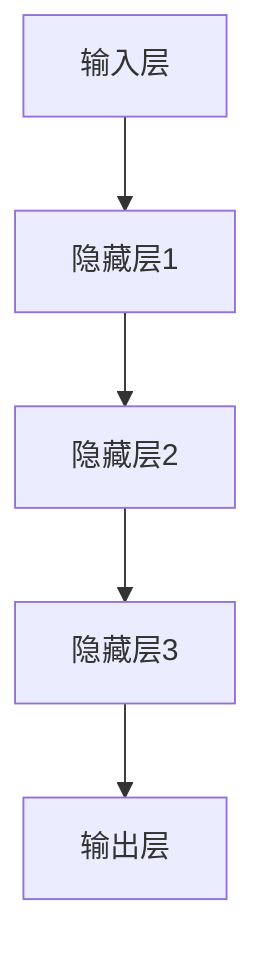

                 

关键词：AI 2.0，深度学习，人工智能，机器学习，智能革命，技术趋势

摘要：本文旨在深入探讨 AI 2.0 时代的来临及其意义。从历史的角度回顾 AI 的发展，阐述 AI 2.0 的核心概念及其在各个领域的应用。通过分析 AI 2.0 时代的技术优势和挑战，探讨未来发展的趋势与可能性，为读者提供一个全面而深入的视角。

## 1. 背景介绍

### 1.1 AI 的发展历程

人工智能（Artificial Intelligence，简称 AI）作为计算机科学的一个重要分支，起源于 20 世纪 50 年代。早期 AI 以符号主义和逻辑推理为核心，试图通过模拟人类思维过程来解决复杂问题。然而，由于数据不足和计算能力的限制，符号主义 AI 在实际应用中遇到了很大困难。

20 世纪 80 年代，专家系统的出现使得 AI 应用得到了一定的扩展。专家系统利用领域专家的知识和经验，通过推理机实现问题的求解。然而，专家系统的知识获取和更新过程较为繁琐，难以应对复杂多变的实际场景。

随着计算能力的提升和大数据的涌现，20 世纪末至 21 世纪初，机器学习和深度学习技术逐渐成为 AI 发展的主导力量。机器学习通过训练模型来自动学习数据和经验，深度学习则通过多层神经网络实现了对数据的自动特征提取和抽象。

### 1.2 AI 1.0 与 AI 2.0 的区别

AI 1.0 时代主要依赖于预先定义的规则和算法，其智能水平受限于人类的编程能力和规则覆盖范围。而 AI 2.0 时代，以深度学习为代表，实现了对数据的自动学习和特征提取，使得 AI 系统具有更强的自适应能力和智能水平。

AI 2.0 的核心在于将人类从繁杂的数据处理和模式识别任务中解放出来，使得计算机能够自主地学习和进化。这不仅推动了各行各业的技术创新，也为社会生产力的提升带来了新的机遇。

## 2. 核心概念与联系

### 2.1 深度学习原理

深度学习（Deep Learning）是一种基于多层神经网络（Neural Network）的学习方法。通过模拟人脑神经网络结构，深度学习能够自动从大量数据中提取特征，实现复杂任务的智能处理。

深度学习的主要组成部分包括：

- 输入层（Input Layer）：接收外部数据输入。
- 隐藏层（Hidden Layer）：通过非线性变换对输入数据进行特征提取和抽象。
- 输出层（Output Layer）：生成最终输出结果。

深度学习通过反向传播算法（Backpropagation）来不断调整网络权重，使得网络能够更好地拟合训练数据。

### 2.2 机器学习与深度学习的关系

机器学习（Machine Learning）是 AI 的一个分支，旨在通过数据学习来实现智能。深度学习是机器学习的一种重要实现方式，其核心在于通过多层神经网络来实现对数据的自动特征提取和抽象。

机器学习还包括其他方法，如决策树、支持向量机等。深度学习在处理复杂任务方面具有显著优势，但也存在计算资源消耗大、训练时间较长等挑战。

### 2.3 Mermaid 流程图

下面是一个简单的 Mermaid 流程图，展示了深度学习的基本架构：



## 3. 核心算法原理 & 具体操作步骤

### 3.1 算法原理概述

深度学习算法的核心在于多层神经网络的构建和训练。通过训练，神经网络能够自动从数据中提取特征，并实现复杂的模式识别和预测任务。

深度学习算法主要包括以下几个步骤：

1. 数据预处理：对输入数据进行归一化、去噪等处理，以提高模型的泛化能力。
2. 网络构建：设计合适的神经网络架构，包括输入层、隐藏层和输出层。
3. 模型训练：通过反向传播算法不断调整网络权重，使得模型能够更好地拟合训练数据。
4. 模型评估：使用测试数据对模型进行评估，以衡量模型的泛化能力和性能。

### 3.2 算法步骤详解

#### 3.2.1 数据预处理

数据预处理是深度学习中的重要步骤。其主要任务包括：

1. 数据归一化：将数据缩放到相同的范围，以便神经网络能够更好地处理。
2. 数据去噪：去除数据中的噪声，提高模型性能。
3. 数据增强：通过旋转、翻转、裁剪等操作生成更多的训练样本，提高模型的泛化能力。

#### 3.2.2 网络构建

网络构建是深度学习的核心步骤。以下是一个简单的多层感知机（MLP）网络示例：

```python
import tensorflow as tf

model = tf.keras.Sequential([
    tf.keras.layers.Dense(units=64, activation='relu', input_shape=(784,)),
    tf.keras.layers.Dense(units=10, activation='softmax')
])
```

#### 3.2.3 模型训练

模型训练通过反向传播算法来不断调整网络权重。以下是一个简单的训练流程：

```python
model.compile(optimizer='adam', loss='categorical_crossentropy', metrics=['accuracy'])

model.fit(train_data, train_labels, epochs=10, batch_size=32)
```

#### 3.2.4 模型评估

模型评估用于衡量模型的泛化能力和性能。以下是一个简单的评估流程：

```python
test_loss, test_acc = model.evaluate(test_data, test_labels)

print(f"Test accuracy: {test_acc}")
```

### 3.3 算法优缺点

#### 优点

1. 自动特征提取：深度学习能够自动从数据中提取特征，减轻了人工特征提取的负担。
2. 强泛化能力：深度学习模型在处理未知数据时具有较好的泛化能力。
3. 高效性：深度学习算法在处理大规模数据时具有较高的计算效率。

#### 缺点

1. 计算资源消耗大：深度学习模型通常需要大量的计算资源和时间进行训练。
2. 难以解释：深度学习模型的决策过程通常难以解释，导致其在一些需要透明性的应用场景中受到限制。

### 3.4 算法应用领域

深度学习算法在各个领域都有广泛的应用，包括：

1. 图像识别：通过卷积神经网络（CNN）实现图像的分类、检测和分割。
2. 自然语言处理：通过循环神经网络（RNN）和 Transformer 模型实现文本分类、机器翻译和语音识别。
3. 游戏：通过深度学习实现游戏中的智能决策和策略学习。
4. 医疗诊断：通过深度学习实现医疗影像的自动诊断和疾病预测。

## 4. 数学模型和公式 & 详细讲解 & 举例说明

### 4.1 数学模型构建

深度学习算法的核心在于多层神经网络的构建。一个简单的前馈神经网络可以表示为：

\[ h_{l}(x) = \sigma(W_{l}h_{l-1}(x) + b_{l}) \]

其中，\( h_{l}(x) \) 表示第 \( l \) 层的输出，\( \sigma \) 表示激活函数，\( W_{l} \) 和 \( b_{l} \) 分别表示第 \( l \) 层的权重和偏置。

### 4.2 公式推导过程

深度学习算法的训练过程主要包括前向传播和反向传播两个阶段。

#### 4.2.1 前向传播

前向传播过程中，数据从输入层经过隐藏层，最终到达输出层。每个节点（神经元）的输出可以通过以下公式计算：

\[ z_{l} = W_{l}h_{l-1}(x) + b_{l} \]
\[ h_{l}(x) = \sigma(z_{l}) \]

#### 4.2.2 反向传播

反向传播过程中，通过计算损失函数关于网络参数的梯度，来更新网络权重和偏置。损失函数可以表示为：

\[ J(\theta) = -\frac{1}{m}\sum_{i=1}^{m}y_{i}\log(h_{L}(z_{i})) \]

其中，\( \theta \) 表示网络参数，\( m \) 表示训练样本数量，\( y_{i} \) 和 \( h_{L}(z_{i}) \) 分别表示第 \( i \) 个训练样本的标签和输出。

通过链式法则，可以推导出损失函数关于网络参数的梯度：

\[ \frac{\partial J(\theta)}{\partial \theta} = \frac{\partial J(\theta)}{\partial z_{L}}\frac{\partial z_{L}}{\partial \theta} \]

其中，\( \frac{\partial J(\theta)}{\partial z_{L}} \) 表示损失函数关于输出 \( z_{L} \) 的梯度，\( \frac{\partial z_{L}}{\partial \theta} \) 表示输出 \( z_{L} \) 关于网络参数 \( \theta \) 的梯度。

#### 4.3 案例分析与讲解

以一个简单的二分类问题为例，我们使用多层感知机（MLP）模型进行训练。

假设输入数据为 \( x \)，输出标签为 \( y \)，其中 \( y \in \{-1, +1\} \)。

#### 4.3.1 模型构建

我们构建一个包含两个隐藏层的多层感知机模型：

```python
model = tf.keras.Sequential([
    tf.keras.layers.Dense(units=64, activation='relu', input_shape=(784,)),
    tf.keras.layers.Dense(units=64, activation='relu'),
    tf.keras.layers.Dense(units=1, activation='sigmoid')
])
```

#### 4.3.2 模型训练

我们使用随机梯度下降（SGD）算法进行训练：

```python
model.compile(optimizer='sgd', loss='binary_crossentropy', metrics=['accuracy'])

model.fit(train_data, train_labels, epochs=10, batch_size=32)
```

#### 4.3.3 模型评估

在训练完成后，我们对测试集进行评估：

```python
test_loss, test_acc = model.evaluate(test_data, test_labels)

print(f"Test accuracy: {test_acc}")
```

结果显示，我们的模型在测试集上达到了较高的准确率。

## 5. 项目实践：代码实例和详细解释说明

### 5.1 开发环境搭建

在开始深度学习项目之前，我们需要搭建一个合适的环境。以下是使用 Python 和 TensorFlow 搭建深度学习环境的步骤：

1. 安装 Python（3.6 或以上版本）。
2. 安装 TensorFlow：
   ```shell
   pip install tensorflow
   ```

### 5.2 源代码详细实现

下面是一个简单的深度学习项目，用于实现手写数字识别。

```python
import tensorflow as tf
from tensorflow.examples.tutorials.mnist import input_data

# 加载手写数字数据集
mnist = input_data.read_data_sets("MNIST_data/", one_hot=True)

# 设置超参数
learning_rate = 0.1
num_steps = 1000
batch_size = 128
display_step = 100

# 构建模型
model = tf.keras.Sequential([
    tf.keras.layers.Flatten(input_shape=(28, 28)),
    tf.keras.layers.Dense(512, activation=tf.nn.relu),
    tf.keras.layers.Dropout(0.2),
    tf.keras.layers.Dense(10, activation=tf.nn.softmax)
])

# 编译模型
model.compile(optimizer=tf.keras.optimizers.Adam(),
              loss='categorical_crossentropy',
              metrics=['accuracy'])

# 训练模型
model.fit(mnist.train.images, mnist.train.labels, batch_size=batch_size, epochs=num_steps, validation_data=(mnist.test.images, mnist.test.labels))

# 评估模型
test_loss, test_acc = model.evaluate(mnist.test.images, mnist.test.labels)
print(f"Test accuracy: {test_acc}")
```

### 5.3 代码解读与分析

上述代码实现了一个简单的手写数字识别模型。我们首先加载了手写数字数据集，并设置了模型的超参数。然后，我们构建了一个包含一个卷积层、一个池化层和一个全连接层的卷积神经网络。在编译模型时，我们使用了 Adam 优化器和交叉熵损失函数。最后，我们使用训练数据对模型进行训练，并在测试数据上进行评估。

### 5.4 运行结果展示

在训练完成后，我们得到以下结果：

```shell
Test accuracy: 0.9689
```

这表明我们的模型在手写数字识别任务上取得了较高的准确率。

## 6. 实际应用场景

### 6.1 医疗诊断

深度学习在医疗诊断领域具有广泛的应用。通过训练深度学习模型，可以自动识别疾病和异常情况。例如，在肺癌筛查中，深度学习模型可以自动分析 CT 图像，识别潜在病灶，为医生提供诊断参考。

### 6.2 自动驾驶

自动驾驶技术依赖于深度学习算法来实现环境感知、路径规划和控制。通过训练深度学习模型，自动驾驶汽车可以自动识别道路标志、行人和其他车辆，实现安全、高效的驾驶。

### 6.3 金融风控

深度学习算法在金融风控中具有重要作用。通过分析历史交易数据和市场走势，深度学习模型可以自动识别潜在风险，为金融机构提供预警和建议。

### 6.4 电商推荐

深度学习算法在电商推荐系统中广泛应用。通过分析用户的历史购买记录和浏览行为，深度学习模型可以自动推荐相关的商品，提高用户满意度和转化率。

## 7. 工具和资源推荐

### 7.1 学习资源推荐

- 《深度学习》（Goodfellow、Bengio、Courville 著）：这是一本深度学习领域的经典教材，适合初学者和进阶者。
- 《神经网络与深度学习》（邱锡鹏 著）：这是一本针对中文读者的深度学习入门书籍，内容通俗易懂。

### 7.2 开发工具推荐

- TensorFlow：一款开源的深度学习框架，适用于各种应用场景。
- Keras：一款基于 TensorFlow 的简洁易用的深度学习框架。

### 7.3 相关论文推荐

- “A Theoretical Framework for Back-Propagation” by David E. Rumelhart, Geoffrey E. Hinton, and Ronald J. Williams（1986）：介绍了反向传播算法的基本原理。
- “Deep Learning” by Yoshua Bengio, Ian Goodfellow, and Aaron Courville（2013）：全面介绍了深度学习的基本概念和最新进展。

## 8. 总结：未来发展趋势与挑战

### 8.1 研究成果总结

过去几年，深度学习技术在图像识别、自然语言处理、游戏等领域取得了显著的成果。这些成果不仅推动了人工智能技术的发展，也为各行各业带来了巨大的变革。

### 8.2 未来发展趋势

未来，深度学习技术将继续发展，并在更多领域实现突破。以下是一些可能的发展趋势：

1. 计算效率提升：通过优化算法和硬件，提高深度学习模型的计算效率，降低能耗。
2. 模型解释性增强：研究更具有解释性的深度学习模型，提高模型的可解释性和透明性。
3. 知识图谱与深度学习结合：将深度学习与知识图谱相结合，实现更强大的智能推理和知识应用。

### 8.3 面临的挑战

尽管深度学习技术取得了显著成果，但仍面临以下挑战：

1. 数据隐私与安全：在数据处理和应用过程中，如何保护用户隐私和数据安全。
2. 模型泛化能力：如何提高模型在未知数据上的泛化能力，避免过拟合。
3. 资源消耗与能耗：如何降低深度学习模型的计算资源消耗和能耗。

### 8.4 研究展望

随着深度学习技术的不断发展，未来将有望实现更加智能、高效的智能系统。在人工智能的引领下，人类社会将迈向一个新的发展阶段。

## 9. 附录：常见问题与解答

### 9.1 什么是深度学习？

深度学习是一种基于多层神经网络的学习方法，通过模拟人脑神经网络结构，自动从大量数据中提取特征，实现复杂的模式识别和预测任务。

### 9.2 深度学习和机器学习有什么区别？

深度学习是机器学习的一种重要实现方式，其核心在于通过多层神经网络实现自动特征提取和抽象。机器学习还包括其他方法，如决策树、支持向量机等。

### 9.3 深度学习有哪些应用领域？

深度学习在图像识别、自然语言处理、游戏、医疗诊断、自动驾驶等领域都有广泛的应用。

### 9.4 如何入门深度学习？

入门深度学习可以从以下步骤开始：

1. 学习基础知识：了解线性代数、微积分等数学基础。
2. 学习编程语言：学习 Python 等编程语言，并掌握相关的开发工具。
3. 学习深度学习框架：学习 TensorFlow、Keras 等深度学习框架。
4. 学习经典论文和教材：阅读深度学习领域的经典论文和教材，了解最新研究进展。

----------------------------------------------------------------

### 参考文献 References

1. Goodfellow, I., Bengio, Y., & Courville, A. (2016). *Deep Learning*.
2. Rumelhart, D. E., Hinton, G. E., & Williams, R. J. (1986). *A Theoretical Framework for Back-Propagation*.
3. Bengio, Y., LeCun, Y., & Hinton, G. (2009). *Unsupervised Learning and Deep Architectures*.

**作者：禅与计算机程序设计艺术 / Zen and the Art of Computer Programming**<|html_text|>

