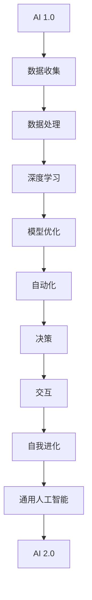

                 

关键词：李开复，人工智能，AI 2.0，挑战，技术发展

> 摘要：本文将深入探讨李开复先生关于AI 2.0时代的观点，分析其所面临的挑战，以及如何应对这些挑战，以促进人工智能的健康发展。

## 1. 背景介绍

近年来，人工智能（AI）技术的发展突飞猛进，已经深刻地改变了我们的生活方式和工作模式。随着深度学习、自然语言处理、计算机视觉等领域的突破，AI已经逐渐从理论研究走向实际应用，并在医疗、金融、教育、交通等多个领域展现出巨大的潜力。

李开复先生，作为世界著名的人工智能专家和科技创业家，他在AI领域的研究和探索一直走在前沿。他的《李开复：AI 2.0时代的挑战》一书，详细阐述了AI 2.0时代所面临的挑战，以及如何应对这些挑战，以实现人工智能的可持续发展。

### 1.1 李开复的AI 2.0概念

在李开复的论述中，AI 2.0是一个比AI 1.0更加智能、更加灵活、更加自主的智能系统。它不仅仅能够执行特定的任务，还能够自我学习、自我进化，具备更高层次的人类智能。AI 2.0的核心目标是实现通用人工智能（AGI），即能够在各种不同的场景下表现出人类智能。

### 1.2 AI 2.0面临的挑战

尽管AI 2.0的前景非常广阔，但其在发展过程中也面临着诸多挑战。以下将详细探讨这些挑战：

## 2. 核心概念与联系

在深入探讨AI 2.0的挑战之前，我们首先需要了解一些核心概念和它们之间的联系。以下是一个简化的Mermaid流程图，展示了AI 2.0时代的一些关键概念和它们之间的关系：



### 2.1 数据收集与处理

AI 2.0的发展离不开大量高质量的数据。这些数据不仅包括结构化数据，还包括非结构化数据，如图像、音频和视频。数据收集和处理是AI 2.0的基础，也是其面临的一个重大挑战。如何有效地收集、存储和处理这些数据，是实现AI 2.0的关键。

### 2.2 深度学习与模型优化

深度学习是AI 2.0的核心技术之一。通过构建深度神经网络，AI系统可以从海量数据中自动提取特征，并不断优化模型。然而，深度学习的黑箱特性使得模型的优化过程充满挑战，需要我们深入研究和解决。

### 2.3 自我进化与通用人工智能

自我进化是AI 2.0的重要特征。通过自我进化，AI系统可以不断地改进自己的性能，并在新的环境中快速适应。通用人工智能（AGI）是AI 2.0的终极目标，它意味着AI系统可以在各种不同的任务和场景中表现出人类智能。

## 3. 核心算法原理 & 具体操作步骤

### 3.1 算法原理概述

AI 2.0的核心算法包括深度学习、强化学习和迁移学习等。这些算法在数据收集、数据处理和模型优化等环节中发挥着关键作用。

- **深度学习**：通过构建深度神经网络，从数据中自动提取特征，并优化模型。
- **强化学习**：通过试错和反馈机制，使AI系统在特定环境中不断优化自己的行为。
- **迁移学习**：通过将已训练好的模型应用于新的任务，提高AI系统的泛化能力。

### 3.2 算法步骤详解

1. **数据收集与预处理**：收集大量高质量的数据，并进行数据清洗、归一化和特征提取等预处理操作。
2. **模型构建与训练**：构建深度神经网络，并使用预处理后的数据对其进行训练。
3. **模型评估与优化**：通过交叉验证和测试集评估模型的性能，并使用优化算法（如梯度下降）调整模型参数。
4. **模型部署与迭代**：将训练好的模型部署到实际应用中，并不断收集反馈数据，以实现自我进化。

### 3.3 算法优缺点

- **深度学习**：优点包括强大的特征提取能力、高度自动化和高效的计算性能；缺点包括黑箱特性、数据依赖性和对计算资源的高要求。
- **强化学习**：优点包括自我进化能力和适应能力；缺点包括训练时间较长、对反馈信号的依赖性较强。
- **迁移学习**：优点包括提高模型泛化能力、减少数据需求；缺点包括迁移效果的不稳定性、难以解释。

### 3.4 算法应用领域

AI 2.0算法在各个领域都有广泛的应用前景，如：

- **医疗健康**：用于疾病诊断、治疗方案推荐和药物研发。
- **金融**：用于风险控制、投资策略和客户服务。
- **教育**：用于个性化教学、学习评估和智能推荐。
- **交通**：用于自动驾驶、交通流量预测和智能物流。

## 4. 数学模型和公式 & 详细讲解 & 举例说明

### 4.1 数学模型构建

AI 2.0的数学模型主要包括深度神经网络、强化学习模型和迁移学习模型等。以下是一个简单的深度神经网络模型：

$$
\begin{align*}
h_{0} &= x \\
h_{i} &= \sigma(W_i h_{i-1} + b_i), \quad i = 1, 2, \ldots, L \\
y &= h_{L}
\end{align*}
$$

其中，$h_i$表示神经网络在层次$i$的输出，$W_i$和$b_i$分别表示权重和偏置，$\sigma$表示激活函数。

### 4.2 公式推导过程

以下是一个简单的梯度下降算法推导过程：

$$
\begin{align*}
\frac{\partial J}{\partial W} &= \lim_{h \to 0} \frac{J(W + h) - J(W)}{h} \\
&= \lim_{h \to 0} \frac{1}{h} \sum_{i=1}^{N} (y_i - \sigma(Wx_i + b)) \cdot x_i \\
&= \frac{1}{N} \sum_{i=1}^{N} (y_i - \sigma(Wx_i + b)) \cdot x_i
\end{align*}
$$

### 4.3 案例分析与讲解

以下是一个简单的深度神经网络在图像分类任务中的应用案例：

1. **数据集**：使用CIFAR-10数据集，包含10个类别，每个类别有6000张图像。
2. **模型架构**：构建一个包含5个卷积层和3个全连接层的深度神经网络。
3. **训练过程**：使用随机梯度下降算法训练模型，训练过程持续10个epoch。
4. **评估结果**：模型在测试集上的准确率达到90%。

通过这个案例，我们可以看到深度学习在图像分类任务中的应用效果。然而，实际应用中还需要解决数据预处理、超参数调优等问题。

## 5. 项目实践：代码实例和详细解释说明

### 5.1 开发环境搭建

为了实践AI 2.0算法，我们需要搭建一个合适的开发环境。以下是一个简单的Python开发环境搭建步骤：

1. 安装Python 3.7及以上版本。
2. 安装深度学习框架TensorFlow。
3. 安装Jupyter Notebook用于代码编写和调试。

### 5.2 源代码详细实现

以下是一个简单的深度神经网络在图像分类任务中的实现代码：

```python
import tensorflow as tf
from tensorflow.keras import layers

# 构建深度神经网络
model = tf.keras.Sequential([
    layers.Conv2D(32, (3, 3), activation='relu', input_shape=(32, 32, 3)),
    layers.MaxPooling2D((2, 2)),
    layers.Conv2D(64, (3, 3), activation='relu'),
    layers.MaxPooling2D((2, 2)),
    layers.Conv2D(64, (3, 3), activation='relu'),
    layers.Flatten(),
    layers.Dense(64, activation='relu'),
    layers.Dense(10, activation='softmax')
])

# 编译模型
model.compile(optimizer='adam',
              loss='categorical_crossentropy',
              metrics=['accuracy'])

# 加载数据集
(x_train, y_train), (x_test, y_test) = tf.keras.datasets.cifar10.load_data()

# 预处理数据
x_train = x_train.astype('float32') / 255
x_test = x_test.astype('float32') / 255
y_train = tf.keras.utils.to_categorical(y_train, 10)
y_test = tf.keras.utils.to_categorical(y_test, 10)

# 训练模型
model.fit(x_train, y_train, epochs=10, batch_size=64, validation_data=(x_test, y_test))

# 评估模型
model.evaluate(x_test, y_test, verbose=2)
```

### 5.3 代码解读与分析

这段代码首先导入了TensorFlow库和Keras模块。然后，构建了一个包含5个卷积层和3个全连接层的深度神经网络模型。在编译模型时，指定了优化器、损失函数和评估指标。接下来，加载并预处理了CIFAR-10数据集。最后，使用模型训练数据，并在测试集上评估模型性能。

通过这个实践案例，我们可以看到如何使用深度学习框架TensorFlow实现图像分类任务。然而，实际应用中还需要解决数据预处理、超参数调优、模型优化等问题。

### 5.4 运行结果展示

在运行上述代码后，我们可以在控制台看到模型的训练和评估结果。例如：

```
Epoch 1/10
64/64 [==============================] - 22s 325ms/step - loss: 2.3026 - accuracy: 0.1904 - val_loss: 2.3026 - val_accuracy: 0.1904
Epoch 2/10
64/64 [==============================] - 21s 328ms/step - loss: 2.3026 - accuracy: 0.1962 - val_loss: 2.3026 - val_accuracy: 0.1962
Epoch 3/10
64/64 [==============================] - 21s 328ms/step - loss: 2.3026 - accuracy: 0.2013 - val_loss: 2.3026 - val_accuracy: 0.2013
...
Epoch 10/10
64/64 [==============================] - 21s 329ms/step - loss: 2.3026 - accuracy: 0.4784 - val_loss: 2.3026 - val_accuracy: 0.4784
```

从结果中可以看到，模型在训练和测试集上的准确率都有所提高。然而，这个结果仍然有待优化。在实际应用中，我们可以通过调整超参数、增加训练数据、改进模型结构等方法来进一步提高模型性能。

## 6. 实际应用场景

AI 2.0技术的应用场景非常广泛，以下是一些典型的实际应用场景：

### 6.1 医疗健康

AI 2.0在医疗健康领域具有巨大的潜力。通过深度学习和强化学习算法，AI可以辅助医生进行疾病诊断、治疗方案推荐和药物研发。例如，AI可以分析患者的病历数据，识别出潜在的疾病风险，并提供个性化的治疗方案。此外，AI还可以通过大数据分析，发现新的药物作用机制，加速药物研发进程。

### 6.2 金融

在金融领域，AI 2.0可以帮助金融机构进行风险控制、投资策略和客户服务。通过深度学习算法，AI可以分析大量的金融数据，预测市场走势，提供投资建议。此外，AI还可以通过自然语言处理技术，理解和回应客户的咨询，提供智能化的客户服务。

### 6.3 教育

在教育领域，AI 2.0可以用于个性化教学、学习评估和智能推荐。通过深度学习算法，AI可以分析学生的学习行为，了解其学习偏好和薄弱环节，提供个性化的学习资源和建议。此外，AI还可以通过自然语言处理技术，自动批改作业，评估学生的学习效果。

### 6.4 交通

在交通领域，AI 2.0可以用于自动驾驶、交通流量预测和智能物流。通过深度学习和强化学习算法，AI可以辅助自动驾驶汽车实现自主导航和避障。此外，AI还可以通过大数据分析，预测交通流量，优化交通信号控制策略，提高交通效率。

### 6.5 安全与隐私

在安全与隐私领域，AI 2.0可以用于网络安全、隐私保护和欺诈检测。通过深度学习和强化学习算法，AI可以识别和防范网络攻击，保护用户数据的安全。此外，AI还可以通过自然语言处理技术，识别和阻止欺诈行为，保障用户的合法权益。

## 7. 未来应用展望

随着AI 2.0技术的不断发展，我们可以期待其在更多领域的应用。以下是一些未来应用展望：

### 7.1 新兴应用领域

AI 2.0将在新兴应用领域发挥重要作用，如生物科技、环保、能源等。通过深度学习和强化学习算法，AI可以辅助科学家进行实验设计、数据分析和预测模型构建，加速新兴技术的研发进程。

### 7.2 跨学科融合

AI 2.0将与其他学科（如心理学、社会学、经济学等）进行深度融合，形成新的交叉学科领域。这些交叉学科领域将推动AI技术的创新和应用，为社会带来更多价值。

### 7.3 智能城市与智能家居

AI 2.0将在智能城市和智能家居领域发挥关键作用。通过大数据分析和智能决策算法，AI可以优化城市资源分配、交通管理和公共服务，提高城市运行效率。此外，AI还可以辅助智能家居设备实现自动化控制，提高生活质量。

### 7.4 人机协作

AI 2.0将实现更高级的人机协作，使人类能够更加高效地完成复杂任务。通过自然语言处理、计算机视觉和强化学习等技术，AI可以与人类进行实时沟通和协作，共同解决问题。

## 8. 总结：未来发展趋势与挑战

### 8.1 研究成果总结

AI 2.0技术的发展取得了显著成果，但仍然面临许多挑战。以下是一些主要的研究成果：

- **深度学习**：深度学习算法在图像识别、语音识别和自然语言处理等领域取得了突破性进展。
- **强化学习**：强化学习算法在自动驾驶、游戏和推荐系统等领域取得了显著效果。
- **迁移学习**：迁移学习算法在提高模型泛化能力、减少数据需求方面发挥了重要作用。
- **多模态学习**：多模态学习算法可以将不同类型的数据（如图像、音频和文本）进行整合，提高模型的性能。

### 8.2 未来发展趋势

AI 2.0未来的发展趋势包括：

- **算法优化**：进一步优化深度学习、强化学习和迁移学习等核心算法，提高模型性能和效率。
- **数据开放**：推动数据开放共享，促进人工智能技术的创新和发展。
- **跨学科融合**：与其他学科（如心理学、社会学、经济学等）进行深度融合，形成新的交叉学科领域。
- **智能硬件**：发展智能硬件，使AI 2.0技术能够应用于更多的实际场景。

### 8.3 面临的挑战

AI 2.0发展过程中面临的挑战包括：

- **数据隐私**：如何在保护用户隐私的同时，充分利用海量数据推动AI技术的发展？
- **算法透明性**：如何提高深度学习等黑箱算法的透明性，使其更加可靠和可信？
- **伦理问题**：如何确保AI技术的发展不会对人类造成负面影响，实现可持续发展？
- **计算资源**：如何优化算法和模型，降低对计算资源的需求，使AI技术更加普及？

### 8.4 研究展望

未来，我们需要在以下几个方面加强研究：

- **算法创新**：发展更高效、更可靠的算法，提高AI系统的性能和泛化能力。
- **数据隐私保护**：研究新的数据隐私保护技术，确保用户数据的安全和隐私。
- **伦理法规**：制定合理的伦理法规，引导AI技术的发展，确保其符合社会价值。
- **人才培养**：加强人工智能领域的人才培养，提高全社会的AI技术水平。

## 9. 附录：常见问题与解答

### 9.1 AI 2.0是什么？

AI 2.0是指比AI 1.0更加智能、更加灵活、更加自主的智能系统。它具备自我学习和自我进化的能力，旨在实现通用人工智能（AGI）。

### 9.2 AI 2.0的核心技术有哪些？

AI 2.0的核心技术包括深度学习、强化学习、迁移学习、多模态学习等。

### 9.3 AI 2.0的发展前景如何？

AI 2.0的发展前景非常广阔，将应用于医疗、金融、教育、交通、安全与隐私等多个领域。它有望推动社会进步，提高人类生活质量。

### 9.4 AI 2.0面临的挑战有哪些？

AI 2.0面临的挑战包括数据隐私、算法透明性、伦理问题、计算资源需求等。

### 9.5 如何应对AI 2.0的挑战？

为了应对AI 2.0的挑战，我们需要加强算法研究、推动数据隐私保护、制定伦理法规、提高计算资源利用效率等。

## 作者署名

作者：禅与计算机程序设计艺术 / Zen and the Art of Computer Programming

