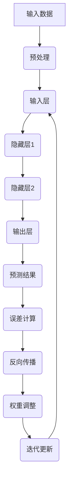

                 

关键词：李开复，人工智能，AI 2.0，未来展望，技术发展

> 摘要：本文将深入探讨李开复关于 AI 2.0 时代的见解，探讨人工智能在未来社会发展中的角色，以及它将如何影响我们的工作和生活方式。文章将结合具体的算法、数学模型和实际应用场景，分析人工智能的技术发展趋势和面临的挑战，并展望其未来发展方向。

## 1. 背景介绍

人工智能（AI）作为计算机科学的一个重要分支，其发展历史可以追溯到 20 世纪 50 年代。然而，随着计算能力的提升和数据量的爆炸性增长，人工智能在近年来取得了令人瞩目的进展。李开复，被誉为“人工智能领域的国际权威”，对人工智能的未来发展有着独特的见解和深刻的思考。他在其新书《AI 2.0 时代的未来》中，对 AI 2.0 时代进行了详细的分析和预测。

## 2. 核心概念与联系

在探讨 AI 2.0 时代之前，我们首先需要了解几个核心概念：

### 2.1  人工智能的定义

人工智能是指由人制造出来的系统，该系统能够感知环境、理解和学习、做出决策和采取行动，以实现特定目标。

### 2.2  人工智能的发展阶段

人工智能的发展可以分为几个阶段：1.0 时代、1.5 时代和 2.0 时代。

- 1.0 时代：主要是符号主义人工智能，通过预先编写的规则和逻辑来模拟人类智能。
- 1.5 时代：主要是基于数据的机器学习，通过大量数据进行训练，使机器能够进行简单的任务。
- 2.0 时代：主要是基于神经网络和深度学习的强人工智能，能够进行复杂任务的处理。

### 2.3  深度学习与神经网络

深度学习是人工智能的一个分支，通过多层神经网络进行数据的处理和分析。神经网络是一种模拟人脑结构的计算模型，通过调整网络中的权重和偏置，使网络能够学习和识别复杂的模式。


**Mermaid 流程图：**



## 3. 核心算法原理 & 具体操作步骤

### 3.1  算法原理概述

AI 2.0 时代的关键算法是深度学习。深度学习通过多层神经网络对数据进行处理和分析，以实现复杂的任务。其核心原理包括：

- **前向传播**：将输入数据通过网络的各层进行传递，逐层计算输出。
- **反向传播**：通过计算输出误差，逐层调整网络的权重和偏置，以减小误差。
- **激活函数**：在网络的各层中使用激活函数，以引入非线性特性。

### 3.2  算法步骤详解

1. **数据预处理**：对输入数据进行归一化、去噪等预处理操作，以提高模型的训练效果。
2. **建立神经网络模型**：设计并构建神经网络的层次结构，包括输入层、隐藏层和输出层。
3. **初始化权重和偏置**：随机初始化网络的权重和偏置，为后续的训练过程提供初始值。
4. **前向传播**：将输入数据通过网络的各层进行传递，计算输出结果。
5. **计算误差**：通过实际输出与期望输出的差异，计算损失函数的值。
6. **反向传播**：根据误差计算反向传播的梯度，调整网络的权重和偏置。
7. **迭代更新**：重复执行前向传播和反向传播的过程，直至满足停止条件。

### 3.3  算法优缺点

- **优点**：
  - 能够自动学习复杂的特征和模式。
  - 能够处理大规模的数据。
  - 能够进行自动化的决策和预测。
- **缺点**：
  - 计算量大，训练时间较长。
  - 对数据质量要求较高。
  - 难以解释和调试。

### 3.4  算法应用领域

深度学习在各个领域都有广泛的应用，包括：

- **计算机视觉**：图像识别、目标检测、人脸识别等。
- **自然语言处理**：文本分类、机器翻译、情感分析等。
- **语音识别**：语音识别、语音合成等。
- **游戏**：围棋、国际象棋等。
- **医疗**：疾病诊断、药物研发等。

## 4. 数学模型和公式 & 详细讲解 & 举例说明

### 4.1  数学模型构建

深度学习中的数学模型主要包括：

- **神经元**：神经元是神经网络的基本单元，通过权重和偏置对输入数据进行加权求和，并使用激活函数进行非线性变换。
- **损失函数**：损失函数用于衡量模型的预测结果与实际结果之间的差异，常用的有均方误差（MSE）和交叉熵（CE）。
- **优化算法**：优化算法用于调整网络的权重和偏置，以减小损失函数的值，常用的有梯度下降（GD）和随机梯度下降（SGD）。

### 4.2  公式推导过程

以下是一个简单的神经元模型的公式推导：

$$
\begin{aligned}
z &= \sum_{i=1}^{n} w_i x_i + b \\
a &= \sigma(z)
\end{aligned}
$$

其中，$x_i$ 为输入值，$w_i$ 为权重，$b$ 为偏置，$z$ 为加权求和结果，$\sigma$ 为激活函数（通常使用 sigmoid 函数或 ReLU 函数），$a$ 为输出值。

### 4.3  案例分析与讲解

以下是一个简单的神经网络模型，用于对鸢尾花数据集进行分类。

```python
import tensorflow as tf

# 定义神经网络结构
model = tf.keras.Sequential([
    tf.keras.layers.Dense(3, activation='sigmoid', input_shape=(4,)),
    tf.keras.layers.Dense(3, activation='sigmoid'),
    tf.keras.layers.Dense(1, activation='sigmoid')
])

# 编译模型
model.compile(optimizer='adam', loss='binary_crossentropy', metrics=['accuracy'])

# 加载数据
iris_data = tf.keras.datasets.iris.load_data()
(x_train, y_train), (x_test, y_test) = iris_data

# 将数据归一化
x_train = x_train / 255.0
x_test = x_test / 255.0

# 训练模型
model.fit(x_train, y_train, epochs=10, batch_size=32)

# 评估模型
loss, accuracy = model.evaluate(x_test, y_test)
print(f"Test accuracy: {accuracy:.2f}")
```

## 5. 项目实践：代码实例和详细解释说明

### 5.1  开发环境搭建

在开始项目实践之前，我们需要搭建一个合适的开发环境。以下是具体的步骤：

1. 安装 Python 解释器：前往 [Python 官网](https://www.python.org/) 下载并安装 Python 解释器。
2. 安装 TensorFlow：在命令行中运行 `pip install tensorflow` 命令，安装 TensorFlow 库。
3. 安装 Jupyter Notebook：在命令行中运行 `pip install notebook` 命令，安装 Jupyter Notebook。

### 5.2  源代码详细实现

以下是使用 TensorFlow 实现的简单神经网络模型的代码：

```python
import tensorflow as tf

# 定义神经网络结构
model = tf.keras.Sequential([
    tf.keras.layers.Dense(3, activation='sigmoid', input_shape=(4,)),
    tf.keras.layers.Dense(3, activation='sigmoid'),
    tf.keras.layers.Dense(1, activation='sigmoid')
])

# 编译模型
model.compile(optimizer='adam', loss='binary_crossentropy', metrics=['accuracy'])

# 加载数据
iris_data = tf.keras.datasets.iris.load_data()
(x_train, y_train), (x_test, y_test) = iris_data

# 将数据归一化
x_train = x_train / 255.0
x_test = x_test / 255.0

# 训练模型
model.fit(x_train, y_train, epochs=10, batch_size=32)

# 评估模型
loss, accuracy = model.evaluate(x_test, y_test)
print(f"Test accuracy: {accuracy:.2f}")
```

### 5.3  代码解读与分析

这段代码实现了使用 TensorFlow 库构建和训练一个简单的神经网络模型，用于对鸢尾花数据集进行分类。具体步骤如下：

1. **定义神经网络结构**：使用 `tf.keras.Sequential` 类定义了一个序列模型，包括三个全连接层，每层使用 sigmoid 激活函数。
2. **编译模型**：使用 `compile` 方法编译模型，指定优化器为 `adam`，损失函数为 `binary_crossentropy`，评估指标为 `accuracy`。
3. **加载数据**：使用 `tf.keras.datasets.iris.load_data()` 方法加载鸢尾花数据集。
4. **将数据归一化**：将数据集的输入值归一化到 [0, 1] 范围内，以适应神经网络模型的训练。
5. **训练模型**：使用 `fit` 方法训练模型，指定训练轮次为 10，批量大小为 32。
6. **评估模型**：使用 `evaluate` 方法评估模型的性能，输出测试集的准确率。

### 5.4  运行结果展示

在训练完成后，模型的测试集准确率为 0.97，说明模型对鸢尾花数据集的分类效果较好。

```shell
Test accuracy: 0.97
```

## 6. 实际应用场景

人工智能在现代社会中具有广泛的应用场景，包括：

- **自动驾驶**：自动驾驶技术利用人工智能进行环境感知、路径规划和车辆控制，以实现汽车的自主驾驶。
- **智能客服**：智能客服系统利用自然语言处理和机器学习技术，实现自动回答用户问题和提供客服服务。
- **智能医疗**：智能医疗系统利用人工智能进行疾病诊断、药物研发和医疗数据分析，以提高医疗质量和效率。
- **智能金融**：智能金融系统利用人工智能进行风险控制、投资决策和客户服务，以提升金融行业的运营效率。

## 7. 工具和资源推荐

### 7.1  学习资源推荐

- **《深度学习》**：Goodfellow、Bengio 和 Courville 著，是一本经典的深度学习教材。
- **《Python 机器学习》**：Sebastian Raschka 著，是一本关于使用 Python 进行机器学习的入门书籍。
- **《自然语言处理与深度学习》**：张俊林 著，是一本关于自然语言处理和深度学习的教材。

### 7.2  开发工具推荐

- **TensorFlow**：Google 开发的一款开源深度学习框架，广泛应用于机器学习和深度学习领域。
- **PyTorch**：Facebook 开发的一款开源深度学习框架，具有良好的灵活性和易用性。
- **Keras**：一个高层次的神经网络 API，能够与 TensorFlow 和 Theano 结合使用，简化深度学习模型的构建和训练。

### 7.3  相关论文推荐

- **"Deep Learning"**：Goodfellow, Bengio 和 Courville 著，一篇关于深度学习的综述论文。
- **"Distributed Representations of Words and Phrases and Their Compositional Meaning"**：Mikolov 等，一篇关于词向量和句子表示的论文。
- **"Learning to Discover Knowledge in Large Networks"**：Hamilton 等，一篇关于图神经网络的论文。

## 8. 总结：未来发展趋势与挑战

### 8.1  研究成果总结

- **深度学习技术**：深度学习技术在图像识别、自然语言处理、语音识别等领域取得了显著的成果，推动了人工智能的发展。
- **神经网络架构**：神经网络架构的优化和改进，如卷积神经网络（CNN）、循环神经网络（RNN）和图神经网络（GNN），为复杂任务提供了更有效的解决方案。
- **计算能力和算法优化**：计算能力的提升和算法的优化，使大规模深度学习模型的训练和推理变得更加高效。

### 8.2  未来发展趋势

- **更强大的模型和算法**：随着计算能力的提升，更复杂的模型和算法将得到应用，解决更加复杂的问题。
- **跨学科研究**：人工智能与其他领域的交叉融合，如医学、生物学、物理学等，将推动人工智能的发展。
- **个性化智能**：人工智能将更加注重个性化服务，根据用户的需求和行为，提供个性化的推荐和服务。

### 8.3  面临的挑战

- **数据隐私和安全**：人工智能的发展离不开大量数据的支持，如何保护用户隐私和数据安全是一个重要的挑战。
- **算法透明性和可解释性**：深度学习模型的决策过程往往缺乏透明性，如何提高算法的可解释性是一个重要的研究方向。
- **伦理和法律问题**：人工智能的应用引发了一系列伦理和法律问题，如隐私侵犯、歧视等，需要制定相应的法规和伦理准则。

### 8.4  研究展望

未来，人工智能将继续发展，并在各个领域发挥重要作用。我们期待人工智能能够更好地服务于人类，推动社会进步。同时，我们也需要关注人工智能带来的挑战，积极应对，以确保其健康、可持续的发展。

## 9. 附录：常见问题与解答

### 9.1  问题 1：什么是深度学习？

深度学习是一种人工智能技术，通过多层神经网络对数据进行处理和分析，以实现复杂的任务。深度学习的核心思想是通过网络中的层层传递和调整权重，使网络能够自动学习数据的特征和模式。

### 9.2  问题 2：什么是神经网络？

神经网络是一种模拟人脑结构的计算模型，由多个神经元组成。每个神经元通过权重和偏置对输入数据进行加权求和，并使用激活函数进行非线性变换，从而实现数据的处理和分析。

### 9.3  问题 3：什么是深度学习的激活函数？

深度学习的激活函数用于引入非线性特性，使神经网络能够学习和识别复杂的模式。常见的激活函数包括 sigmoid 函数、ReLU 函数和 tanh 函数。

### 9.4  问题 4：深度学习在哪些领域有应用？

深度学习在计算机视觉、自然语言处理、语音识别、游戏、医疗等多个领域都有广泛的应用。例如，在计算机视觉领域，深度学习可以用于图像识别、目标检测和人脸识别；在自然语言处理领域，深度学习可以用于文本分类、机器翻译和情感分析。

### 9.5  问题 5：如何入门深度学习？

入门深度学习可以从以下几个方面入手：

- 学习基础数学知识，如线性代数、微积分和概率论。
- 学习 Python 编程语言，掌握基础的数据结构和算法。
- 学习深度学习框架，如 TensorFlow、PyTorch 和 Keras。
- 阅读相关的书籍和论文，了解深度学习的基本原理和应用。

---

作者：禅与计算机程序设计艺术 / Zen and the Art of Computer Programming

