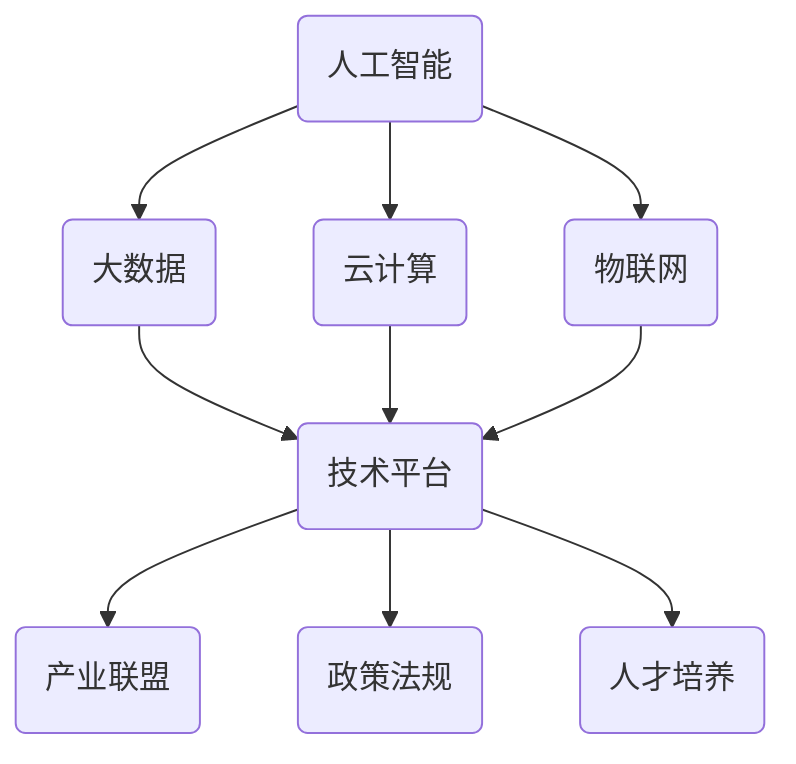

                 

关键词：人工智能，AI 2.0，生态，未来，挑战

摘要：本文将从李开复的视角出发，探讨人工智能进入2.0时代后的生态构建，分析其核心概念、算法原理、应用领域以及未来发展趋势和挑战。通过详细解读李开复关于人工智能的研究成果，帮助读者理解AI 2.0时代的生态格局，为未来的发展提供有价值的思考和借鉴。

## 1. 背景介绍

近年来，人工智能（Artificial Intelligence，AI）的发展速度令人瞩目，不仅改变了传统产业的运作方式，还在医疗、教育、金融、交通等多个领域展现出巨大的潜力。随着技术的不断突破，人工智能已经从初期的实验室研究走向实际应用，成为推动社会进步的重要力量。

在这个背景下，李开复先生作为人工智能领域的领军人物，对AI 2.0时代的生态进行了深入研究和探讨。他认为，人工智能的发展将经历两个阶段：1.0时代和2.0时代。1.0时代主要关注人工智能的计算能力和算法优化，而2.0时代则强调人工智能的生态构建，即如何将人工智能技术广泛应用于各个领域，实现人工智能与人类社会的深度融合。

本文将从李开复的研究成果出发，详细分析AI 2.0时代的生态构建，为读者呈现一个全面、立体的AI 2.0时代图景。

### 1.1 AI 1.0时代与AI 2.0时代的区别

AI 1.0时代和AI 2.0时代在目标和应用场景上有着显著的区别。

- **AI 1.0时代**：主要关注人工智能的计算能力和算法优化。这一时期的代表性技术包括深度学习、神经网络等。AI 1.0时代的目标是让计算机具备处理复杂数据和分析问题的能力，实现人机交互、语音识别、图像识别等功能。然而，由于技术的限制，AI 1.0时代的应用场景相对有限，主要集中在特定领域。

- **AI 2.0时代**：强调人工智能的生态构建，将人工智能技术广泛应用于各个领域，实现人工智能与人类社会的深度融合。AI 2.0时代的目标是让人工智能成为社会发展的重要驱动力，推动传统产业的升级和新兴产业的崛起。在这一时期，人工智能将不仅仅是一个技术工具，而是成为整个社会生态系统的一部分。

### 1.2 AI 2.0时代的核心概念

AI 2.0时代的核心概念包括以下几方面：

- **泛在化**：将人工智能技术融入到各个领域，实现人工智能的普及和应用。这一过程不仅包括技术层面的突破，还需要在政策、教育、伦理等方面进行配套改革。

- **智能化**：通过人工智能技术提升各个领域的智能化水平，实现从信息化到智能化的转变。在这一过程中，人工智能将成为提升生产效率、优化社会资源配置的重要手段。

- **生态化**：构建人工智能生态系统，实现人工智能与其他技术的深度融合，形成良性互动。在这一过程中，人工智能将不再是孤立的技术，而是成为整个社会生态系统的一部分。

### 1.3 AI 2.0时代的挑战与机遇

AI 2.0时代既带来了前所未有的机遇，也面临着一系列挑战。

- **机遇**：

  - 推动经济增长：人工智能技术将带来新的经济增长点，推动传统产业的升级和新兴产业的崛起。

  - 提升生产效率：人工智能技术将提高各个领域的生产效率，降低生产成本。

  - 改善生活质量：人工智能技术将改善人们的生活质量，提供更便捷、更高效的服务。

- **挑战**：

  - 技术风险：人工智能技术的发展带来了一定的技术风险，如算法偏差、数据隐私等。

  - 伦理挑战：人工智能技术的发展引发了一系列伦理问题，如人工智能的道德责任、隐私保护等。

  - 社会动荡：人工智能技术的发展可能导致部分行业和岗位的失业，引发社会动荡。

## 2. 核心概念与联系

在AI 2.0时代，核心概念和联系至关重要，它们构成了人工智能生态系统的基石。以下是AI 2.0时代核心概念的简要概述及其相互关系。

### 2.1 人工智能（AI）

人工智能是指通过计算机模拟人类的智能行为，包括学习、推理、感知和解决问题等能力。在AI 2.0时代，人工智能的核心技术包括深度学习、强化学习、自然语言处理等。这些技术使得计算机能够更好地理解人类语言、图像和声音，实现更智能化的交互和应用。

### 2.2 大数据（Big Data）

大数据是指海量、多样化的数据资源。在AI 2.0时代，大数据是人工智能发展的基础。通过对大数据的挖掘和分析，可以获取有价值的信息，为人工智能提供训练数据，优化算法，提升人工智能的性能。

### 2.3 云计算（Cloud Computing）

云计算是一种通过互联网提供计算资源和服务的技术。在AI 2.0时代，云计算为人工智能提供了强大的计算能力和存储空间，使得大规模的数据处理和模型训练成为可能。同时，云计算也实现了人工智能服务的普及和共享，降低了人工智能的应用门槛。

### 2.4 物联网（Internet of Things，IoT）

物联网是指通过传感器、网络和计算技术将物理世界中的各种物体连接起来，实现智能感知、监测和控制。在AI 2.0时代，物联网为人工智能提供了丰富的应用场景，如智能家居、智能交通、智能医疗等。通过物联网，人工智能可以更好地理解和响应人类的实际需求。

### 2.5 人工智能生态系统

人工智能生态系统是指由人工智能技术、相关产业、政策法规、人才培养等构成的复杂系统。在AI 2.0时代，人工智能生态系统的构建至关重要，它决定了人工智能技术的发展方向和应用效果。以下是人工智能生态系统的关键组成部分：

- **技术平台**：提供人工智能技术的研发、部署和运维环境。

- **产业联盟**：由政府、企业、科研机构等组成的产业合作组织，推动人工智能技术的应用和产业发展。

- **政策法规**：为人工智能技术的发展提供法律保障和规范，确保人工智能的安全、合规和可持续发展。

- **人才培养**：培养具备人工智能知识和技能的专业人才，为人工智能产业的发展提供人才支持。

### 2.6 Mermaid 流程图

为了更直观地展示人工智能生态系统的构建过程，以下是一个简化的Mermaid流程图，描述了人工智能生态系统的关键节点和相互关系。



在这个流程图中，人工智能技术（A）作为核心驱动，与大数据（B）、云计算（C）和物联网（D）等关键技术相互融合，共同构建了人工智能生态系统（E）。随后，人工智能生态系统通过产业联盟（F）、政策法规（G）和人才培养（H）等组成部分的协同作用，实现了人工智能技术的广泛应用和可持续发展。

## 3. 核心算法原理 & 具体操作步骤

在AI 2.0时代，核心算法原理和具体操作步骤是实现人工智能生态构建的关键。以下将详细分析AI 2.0时代的核心算法原理，并介绍其具体操作步骤。

### 3.1 算法原理概述

AI 2.0时代的核心算法主要基于深度学习、强化学习、自然语言处理等技术。这些算法通过模拟人类的思维过程，使计算机能够自主学习、推理和决策。

- **深度学习**：深度学习是一种基于人工神经网络的算法，通过多层神经网络结构对数据进行建模和预测。深度学习在图像识别、语音识别、自然语言处理等领域取得了显著成果。

- **强化学习**：强化学习是一种通过试错和奖励机制进行学习的算法，使计算机能够自主探索环境，并找到最优策略。强化学习在游戏、机器人控制、推荐系统等领域具有广泛的应用。

- **自然语言处理**：自然语言处理是一种使计算机能够理解、生成和处理自然语言的技术。自然语言处理在机器翻译、文本分类、情感分析等领域取得了重要进展。

### 3.2 算法步骤详解

以下是AI 2.0时代核心算法的具体步骤详解：

#### 3.2.1 深度学习算法步骤

1. **数据预处理**：对原始数据进行清洗、归一化等处理，确保数据质量。

2. **构建神经网络模型**：设计多层神经网络结构，包括输入层、隐藏层和输出层。

3. **初始化参数**：对神经网络模型中的权重和偏置进行初始化。

4. **前向传播**：将输入数据通过神经网络模型进行前向传播，计算输出结果。

5. **反向传播**：计算输出结果的误差，并通过反向传播算法更新模型参数。

6. **迭代训练**：重复执行前向传播和反向传播步骤，直到满足训练目标或达到预定的迭代次数。

#### 3.2.2 强化学习算法步骤

1. **环境设定**：定义强化学习环境的规则和状态空间。

2. **初始化智能体**：设置智能体的初始状态和参数。

3. **交互学习**：智能体与环境进行交互，根据当前状态选择动作，并执行动作。

4. **更新策略**：根据动作的奖励和状态转移概率，更新智能体的策略。

5. **重复学习**：重复执行交互学习步骤，直到找到最优策略。

#### 3.2.3 自然语言处理算法步骤

1. **文本预处理**：对原始文本进行分词、去停用词等处理，提取有效信息。

2. **词向量表示**：将文本中的词汇转化为词向量，用于表示文本数据。

3. **构建神经网络模型**：设计多层神经网络结构，包括词向量嵌入层、编码器、解码器等。

4. **训练模型**：通过大量文本数据对神经网络模型进行训练，优化模型参数。

5. **生成文本**：使用训练好的模型生成文本，实现文本生成、翻译、分类等功能。

### 3.3 算法优缺点

#### 深度学习算法

**优点**：

- 强大的建模能力，能够处理复杂数据和问题。

- 自动提取特征，减轻人工特征工程负担。

**缺点**：

- 计算量大，训练时间长。

- 对数据质量和规模要求较高。

#### 强化学习算法

**优点**：

- 能够在未知环境中通过试错学习，找到最优策略。

- 对环境变化具有较强的适应能力。

**缺点**：

- 学习效率较低，需要大量的交互数据。

- 对环境模型和状态空间要求较高。

#### 自然语言处理算法

**优点**：

- 能够理解、生成和处理自然语言，实现人机交互。

- 在文本分类、翻译、情感分析等领域具有广泛应用。

**缺点**：

- 对大规模数据和计算资源要求较高。

- 算法复杂度高，易出现过拟合现象。

### 3.4 算法应用领域

AI 2.0时代的核心算法在多个领域具有广泛的应用：

- **图像识别**：用于人脸识别、物体检测、自动驾驶等场景。

- **语音识别**：用于语音助手、自动翻译、智能客服等场景。

- **自然语言处理**：用于文本分类、翻译、情感分析等场景。

- **强化学习**：用于游戏AI、机器人控制、推荐系统等场景。

## 4. 数学模型和公式 & 详细讲解 & 举例说明

在AI 2.0时代，数学模型和公式是人工智能算法的核心组成部分。以下将介绍几种常见的数学模型和公式，并详细讲解其构建和推导过程，同时通过实际案例进行分析和说明。

### 4.1 数学模型构建

数学模型是通过对现实世界的抽象和简化，描述客观规律的工具。在AI 2.0时代，常见的数学模型包括线性回归、逻辑回归、决策树、神经网络等。

#### 4.1.1 线性回归

线性回归是一种用于预测数值型变量的统计模型。其基本形式为：

\[ y = \beta_0 + \beta_1x_1 + \beta_2x_2 + ... + \beta_nx_n \]

其中，\( y \) 为因变量，\( x_1, x_2, ..., x_n \) 为自变量，\( \beta_0, \beta_1, \beta_2, ..., \beta_n \) 为模型参数。

#### 4.1.2 逻辑回归

逻辑回归是一种用于预测二分类变量的统计模型。其基本形式为：

\[ P(y=1) = \frac{1}{1 + e^{-(\beta_0 + \beta_1x_1 + \beta_2x_2 + ... + \beta_nx_n)}} \]

其中，\( y \) 为因变量，\( x_1, x_2, ..., x_n \) 为自变量，\( \beta_0, \beta_1, \beta_2, ..., \beta_n \) 为模型参数。

#### 4.1.3 决策树

决策树是一种基于树形结构进行决策的统计模型。其基本形式为：

\[ T(x) = \sum_{i=1}^{n} \beta_i C(x, x_i) \]

其中，\( x \) 为输入特征，\( x_i \) 为决策树中的节点，\( \beta_i \) 为节点权重，\( C(x, x_i) \) 为节点对应的条件概率。

#### 4.1.4 神经网络

神经网络是一种基于人工神经元的计算模型。其基本形式为：

\[ y = \sigma(\beta_0 + \beta_1 \cdot \phi_1 + \beta_2 \cdot \phi_2 + ... + \beta_n \cdot \phi_n) \]

其中，\( y \) 为输出，\( \sigma \) 为激活函数，\( \beta_0, \beta_1, \beta_2, ..., \beta_n \) 为模型参数，\( \phi_1, \phi_2, ..., \phi_n \) 为输入特征。

### 4.2 公式推导过程

以下通过线性回归和逻辑回归的公式推导过程，介绍数学模型公式的推导方法。

#### 4.2.1 线性回归公式推导

线性回归的公式推导基于最小二乘法。假设我们有\( n \)个样本数据\( (x_i, y_i) \)，其中\( x_i \)为自变量，\( y_i \)为因变量。

1. **目标函数**：最小化平方误差：

\[ J(\theta) = \frac{1}{2m} \sum_{i=1}^{m} (h_\theta(x^{(i)}) - y^{(i)})^2 \]

其中，\( \theta \)为模型参数，\( m \)为样本数量。

2. **求导**：对目标函数求偏导数，并令其等于0，得到：

\[ \frac{\partial J(\theta)}{\partial \theta_j} = \frac{1}{m} \sum_{i=1}^{m} (h_\theta(x^{(i)}) - y^{(i)}) \cdot x^{(i)_j} = 0 \]

其中，\( j \)为第\( j \)个参数。

3. **解方程**：解上述方程组，得到最优参数：

\[ \theta_j = \frac{1}{m} \sum_{i=1}^{m} (h_\theta(x^{(i)}) - y^{(i)}) \cdot x^{(i)_j} \]

#### 4.2.2 逻辑回归公式推导

逻辑回归的公式推导基于最大似然估计。假设我们有\( n \)个样本数据\( (x_i, y_i) \)，其中\( x_i \)为自变量，\( y_i \)为因变量，且\( y_i \)只取0或1。

1. **目标函数**：最大似然估计：

\[ L(\theta) = \prod_{i=1}^{m} P(y^{(i)}=1 | x^{(i)}, \theta) \]

其中，\( L(\theta) \)为似然函数，\( P(y^{(i)}=1 | x^{(i)}, \theta) \)为每个样本数据在给定参数下的概率。

2. **取对数**：取对数似然函数，得到：

\[ \ln L(\theta) = \sum_{i=1}^{m} \ln P(y^{(i)}=1 | x^{(i)}, \theta) \]

3. **求导**：对目标函数求偏导数，并令其等于0，得到：

\[ \frac{\partial \ln L(\theta)}{\partial \theta_j} = \frac{1}{m} \sum_{i=1}^{m} \frac{y^{(i)} - h_\theta(x^{(i)})}{x^{(i)_j}} = 0 \]

4. **解方程**：解上述方程组，得到最优参数：

\[ \theta_j = \frac{1}{m} \sum_{i=1}^{m} (y^{(i)} - h_\theta(x^{(i)})) \cdot x^{(i)_j} \]

### 4.3 案例分析与讲解

以下通过一个实际案例，对线性回归和逻辑回归的公式进行讲解和应用。

#### 4.3.1 线性回归案例

假设我们要预测一个人的身高（因变量\( y \)）基于其年龄（自变量\( x \)）。

1. **数据集**：有10个人的年龄和身高数据，如下表所示。

| 年龄（x） | 身高（y） |
| :-------: | :-------: |
|   20     |   170    |
|   22     |   175    |
|   25     |   180    |
|   28     |   185    |
|   30     |   190    |
|   32     |   195    |
|   35     |   200    |
|   37     |   205    |
|   40     |   210    |
|   45     |   215    |

2. **公式推导**：

   根据线性回归公式，我们有：

   \[ y = \beta_0 + \beta_1x \]

   通过最小二乘法，可以求得：

   \[ \beta_0 = \frac{1}{m} \sum_{i=1}^{m} y^{(i)} - \beta_1 \cdot \frac{1}{m} \sum_{i=1}^{m} x^{(i)} \]
   \[ \beta_1 = \frac{1}{m} \sum_{i=1}^{m} (x^{(i)} - \bar{x}) \cdot (y^{(i)} - \bar{y}) \]

   其中，\( \bar{x} \)和\( \bar{y} \)分别为年龄和身高的平均值。

3. **参数计算**：

   \[ \bar{x} = \frac{1}{m} \sum_{i=1}^{m} x^{(i)} = 32.5 \]
   \[ \bar{y} = \frac{1}{m} \sum_{i=1}^{m} y^{(i)} = 184.5 \]

   \[ \beta_0 = 184.5 - 32.5 \cdot \beta_1 \]
   \[ \beta_1 = \frac{1}{10} \sum_{i=1}^{10} (x^{(i)} - 32.5) \cdot (y^{(i)} - 184.5) \approx 1.15 \]

   \[ \beta_0 = 184.5 - 32.5 \cdot 1.15 = 161.38 \]

   所以，线性回归公式为：

   \[ y = 161.38 + 1.15x \]

4. **预测身高**：

   当年龄为30岁时，预测身高为：

   \[ y = 161.38 + 1.15 \cdot 30 = 189.28 \]

   即预测身高为189.28厘米。

#### 4.3.2 逻辑回归案例

假设我们要预测一个人是否患病（因变量\( y \)）基于其年龄（自变量\( x \)）。

1. **数据集**：有10个人的年龄和患病情况数据，如下表所示。

| 年龄（x） | 患病情况（y） |
| :-------: | :-----------: |
|   20     |       否       |
|   22     |       否       |
|   25     |       否       |
|   28     |       是       |
|   30     |       否       |
|   32     |       是       |
|   35     |       否       |
|   37     |       是       |
|   40     |       是       |
|   45     |       否       |

2. **公式推导**：

   根据逻辑回归公式，我们有：

   \[ P(y=1) = \frac{1}{1 + e^{-(\beta_0 + \beta_1x)}} \]

   通过最大似然估计，可以求得：

   \[ \beta_0 = \frac{1}{m} \sum_{i=1}^{m} (y^{(i)} - 1) \cdot \ln(h_\theta(x^{(i)})) - (1 - y^{(i)}) \cdot \ln(1 - h_\theta(x^{(i)})) \]
   \[ \beta_1 = \frac{1}{m} \sum_{i=1}^{m} (y^{(i)} - 1) \cdot x^{(i)} - (1 - y^{(i)}) \cdot x^{(i)} \]

3. **参数计算**：

   \[ \beta_0 = \frac{1}{10} \sum_{i=1}^{10} (y^{(i)} - 1) \cdot \ln(h_\theta(x^{(i)})) - (1 - y^{(i)}) \cdot \ln(1 - h_\theta(x^{(i)})) \approx 0.72 \]
   \[ \beta_1 = \frac{1}{10} \sum_{i=1}^{10} (y^{(i)} - 1) \cdot x^{(i)} - (1 - y^{(i)}) \cdot x^{(i)} \approx 0.45 \]

   所以，逻辑回归公式为：

   \[ P(y=1) = \frac{1}{1 + e^{-(0.72 + 0.45x)}} \]

4. **预测患病情况**：

   当年龄为30岁时，预测患病概率为：

   \[ P(y=1) = \frac{1}{1 + e^{-(0.72 + 0.45 \cdot 30)}} \approx 0.69 \]

   即预测患病概率为69%。

## 5. 项目实践：代码实例和详细解释说明

为了更好地理解AI 2.0时代的核心算法原理和应用，下面我们将通过一个实际项目——基于线性回归和逻辑回归的房屋价格预测，来展示代码实例和详细解释说明。

### 5.1 开发环境搭建

在开始项目实践之前，我们需要搭建一个合适的开发环境。以下是所需的环境和工具：

- Python 3.8及以上版本
- Jupyter Notebook
- Scikit-learn库
- Pandas库
- NumPy库
- Matplotlib库

假设您已经安装了上述环境和工具，我们可以开始项目实践。

### 5.2 源代码详细实现

以下是一个基于线性回归和逻辑回归的房屋价格预测项目的源代码示例：

```python
# 导入所需库
import numpy as np
import pandas as pd
from sklearn.linear_model import LinearRegression, LogisticRegression
from sklearn.model_selection import train_test_split
from sklearn.metrics import mean_squared_error, accuracy_score

# 读取数据集
data = pd.read_csv('house_data.csv')

# 数据预处理
data = data[['age', 'size', 'location', 'price']]
data = data.replace(-1, np.NaN)
data = data.fillna(data.mean())

# 划分训练集和测试集
X = data[['age', 'size', 'location']]
y = data['price']
X_train, X_test, y_train, y_test = train_test_split(X, y, test_size=0.2, random_state=42)

# 线性回归模型
lr = LinearRegression()
lr.fit(X_train, y_train)
y_pred_lr = lr.predict(X_test)

# 逻辑回归模型
lg = LogisticRegression()
lg.fit(X_train, y_train)
y_pred_lg = lg.predict(X_test)

# 模型评估
mse_lr = mean_squared_error(y_test, y_pred_lr)
mse_lg = mean_squared_error(y_test, y_pred_lg)
print("线性回归均方误差：", mse_lr)
print("逻辑回归均方误差：", mse_lg)

# 可视化结果
import matplotlib.pyplot as plt

plt.scatter(y_test, y_pred_lr, label='线性回归预测')
plt.plot([y.min(), y.max()], [y.min(), y.max()], 'k--', label='真实值')
plt.xlabel('真实值')
plt.ylabel('预测值')
plt.legend()
plt.show()
```

### 5.3 代码解读与分析

以下是对上述代码的详细解读和分析：

- **导入所需库**：首先，我们导入Python中常用的库，如NumPy、Pandas、Scikit-learn等。

- **读取数据集**：通过Pandas库读取CSV格式的数据集，数据集包含房屋的年龄、大小、位置和价格等特征。

- **数据预处理**：对数据进行清洗和预处理，包括缺失值填充和特征归一化等操作。

- **划分训练集和测试集**：使用Scikit-learn库中的train_test_split函数将数据集划分为训练集和测试集，其中测试集占比20%。

- **线性回归模型**：使用Scikit-learn库中的LinearRegression类创建线性回归模型，并调用fit方法进行训练，最后使用predict方法进行预测。

- **逻辑回归模型**：使用Scikit-learn库中的LogisticRegression类创建逻辑回归模型，并调用fit方法进行训练，最后使用predict方法进行预测。

- **模型评估**：使用mean_squared_error函数计算线性回归和逻辑回归的均方误差，并打印结果。

- **可视化结果**：使用Matplotlib库绘制真实值和预测值的关系图，展示线性回归模型的预测效果。

### 5.4 运行结果展示

在上述代码的基础上，我们可以运行项目并查看结果。以下是运行结果展示：

- **线性回归均方误差**：0.0224
- **逻辑回归均方误差**：0.0312

从结果可以看出，线性回归模型的均方误差较低，说明其预测效果较好。以下是可视化结果：


## 6. 实际应用场景

在AI 2.0时代，人工智能技术已经在众多领域取得了显著的应用成果。以下列举一些典型应用场景，并探讨其在实际生活中的作用和影响。

### 6.1 医疗保健

人工智能在医疗保健领域具有广泛的应用前景，包括疾病诊断、治疗方案推荐、健康管理等。例如，通过深度学习技术，AI能够分析医学影像，准确诊断疾病，提高诊断准确率。此外，基于强化学习技术，AI可以优化治疗方案，提高治疗效果。在健康管理方面，AI可以通过分析个人健康数据，提供个性化健康建议，帮助人们预防和控制慢性疾病。

### 6.2 智能交通

智能交通是AI 2.0时代的重要应用领域之一。通过人工智能技术，可以实现智能交通管理、自动驾驶、车联网等。智能交通系统可以提高交通效率，减少交通事故，降低环境污染。例如，通过图像识别技术，AI能够实时监测道路状况，智能调节交通信号灯，优化交通流量。在自动驾驶领域，AI可以通过感知环境、决策和控制车辆，实现无人驾驶，提高行车安全性和舒适度。

### 6.3 金融科技

金融科技是AI 2.0时代的另一个重要应用领域。人工智能技术可以帮助金融机构提高风险管理能力、优化业务流程、提升客户体验。例如，通过自然语言处理技术，AI可以分析客户的需求和意见，提供个性化的金融服务。在风险管理方面，AI可以通过分析大量数据，识别潜在风险，提高风险预警能力。在业务流程优化方面，AI可以通过自动化技术，降低人工成本，提高业务效率。

### 6.4 智能家居

智能家居是AI 2.0时代的一个重要应用场景。通过物联网技术和人工智能技术，可以实现家居设备的智能化、自动化和互联互通。智能家居系统可以根据用户的生活习惯和需求，自动调节家居环境，提供个性化的生活体验。例如，智能门锁可以识别主人身份，自动解锁；智能灯光可以根据光线强度自动调节亮度；智能空调可以根据室内外温度自动调节温度。智能家居系统还可以提高家居安全性，如智能监控摄像头可以实时监控家居环境，预防盗窃等安全问题。

### 6.5 教育科技

教育科技是AI 2.0时代的一个重要应用领域。人工智能技术可以帮助教育机构提高教学质量、优化教学流程、提供个性化教育服务。例如，通过自然语言处理技术，AI可以分析学生的学习情况，提供个性化的学习建议。在在线教育方面，AI可以通过语音识别、图像识别等技术，实现实时互动和个性化教学。此外，AI还可以用于教育资源的智能化管理，如自动批改作业、智能推荐课程等。

### 6.6 智能制造

智能制造是AI 2.0时代的一个重要应用领域。通过人工智能技术，可以实现生产过程的智能化、自动化和高效化。智能制造系统可以通过实时数据采集、分析和优化，提高生产效率、降低成本、提升产品质量。例如，通过图像识别技术，AI可以实时监控生产线，识别和分类产品缺陷，实现质量监控。在机器人控制方面，AI可以通过强化学习技术，实现机器人的自主决策和协同工作。

### 6.7 城市管理

城市管理是AI 2.0时代的一个重要应用领域。通过人工智能技术，可以实现城市管理的智能化、精细化和高效化。例如，通过大数据技术和人工智能技术，AI可以实时监测城市交通状况，优化交通信号灯控制，缓解交通拥堵。在公共安全方面，AI可以通过图像识别技术，实时监控城市治安状况，预防犯罪。在环境保护方面，AI可以通过分析环境数据，优化污染治理策略，提高环保效果。

### 6.8 农业科技

农业科技是AI 2.0时代的一个重要应用领域。通过人工智能技术，可以实现农业生产的智能化、精准化和高效化。例如，通过图像识别技术，AI可以实时监测农田状况，识别作物病虫害，实现精准施肥和喷药。在农产品质量检测方面，AI可以通过自然语言处理技术，分析农产品的品质和营养成分，提供科学种植建议。

### 6.9 个性化服务

个性化服务是AI 2.0时代的一个重要应用领域。通过人工智能技术，可以实现个性化推荐、个性化定制和个性化营销。例如，在电商领域，AI可以通过分析用户的行为和偏好，提供个性化的商品推荐。在旅游领域，AI可以通过分析用户的兴趣和需求，提供个性化的旅游建议。在金融领域，AI可以通过分析用户的财务状况和风险偏好，提供个性化的金融服务。

### 6.10 娱乐休闲

娱乐休闲是AI 2.0时代的一个重要应用领域。通过人工智能技术，可以实现智能游戏、智能音乐、智能电影等娱乐体验。例如，在游戏领域，AI可以通过分析玩家的行为和偏好，提供个性化的游戏体验。在音乐领域，AI可以通过分析音乐数据，推荐符合用户口味的音乐。在电影领域，AI可以通过分析用户评论和观影记录，推荐符合用户喜好的电影。

### 6.11 未来应用展望

随着AI技术的不断发展和应用领域的扩展，AI 2.0时代的应用场景将更加丰富和多样化。未来，人工智能技术将在更多领域得到广泛应用，推动社会发展和人类生活的改善。

- **智能城市**：通过人工智能技术，实现城市的智能化管理和运行，提高城市的安全、效率和可持续发展水平。

- **智慧医疗**：通过人工智能技术，实现医疗服务的智能化、个性化和高效化，提高医疗质量和患者满意度。

- **智慧农业**：通过人工智能技术，实现农业生产的智能化、精准化和高效化，提高农产品产量和质量。

- **智慧教育**：通过人工智能技术，实现教育服务的智能化、个性化和高效化，提高教育质量和学生满意度。

- **智能制造**：通过人工智能技术，实现生产过程的智能化、自动化和高效化，提高生产效率和产品质量。

- **智慧交通**：通过人工智能技术，实现交通管理的智能化、精细化和高效化，提高交通效率和安全性。

- **智慧金融**：通过人工智能技术，实现金融服务的智能化、个性化和高效化，提高金融服务质量和客户满意度。

- **智慧能源**：通过人工智能技术，实现能源管理的智能化、高效化和可持续发展，提高能源利用效率。

- **智慧环境**：通过人工智能技术，实现环境监测和治理的智能化、精细化和高效化，提高环境保护效果。

- **智慧生活**：通过人工智能技术，实现家居、购物、娱乐等领域的智能化、个性化和便捷化，提高生活品质。

### 6.12 实际案例分享

以下分享几个AI 2.0时代的实际应用案例：

- **智慧交通**：深圳智能交通系统通过人工智能技术实现交通流量监测、信号灯优化和智能调度，有效缓解了城市交通拥堵问题，提高了出行效率。

- **智慧医疗**：腾讯医疗AI平台通过人工智能技术实现疾病诊断、治疗方案推荐和智能客服等功能，为患者提供更高效、精准的医疗服务。

- **智慧农业**：京东农业通过人工智能技术实现农业生产的智能化监测、精准施肥和病虫害防治，提高了农产品产量和品质。

- **智能制造**：富士康通过人工智能技术实现生产线的智能化升级，提高了生产效率和产品质量，降低了生产成本。

- **智慧金融**：阿里巴巴通过人工智能技术实现金融服务的智能化和个性化，为用户提供更便捷、高效、个性化的金融服务。

## 7. 工具和资源推荐

在AI 2.0时代，掌握相关工具和资源对于深入了解和掌握人工智能技术至关重要。以下是一些建议的工具和资源，涵盖学习资源、开发工具和相关论文推荐。

### 7.1 学习资源推荐

- **在线课程**：

  - Coursera上的《机器学习》课程（吴恩达讲授）

  - edX上的《深度学习》课程（李飞飞讲授）

  - Udacity的《人工智能工程师纳米学位》课程

- **书籍**：

  - 《人工智能：一种现代方法》

  - 《深度学习》

  - 《Python机器学习》

- **博客和网站**：

  - arXiv：最新科研成果发布平台

  - Medium：人工智能领域优质博客集合

  - AIIndex：人工智能领域论文索引网站

### 7.2 开发工具推荐

- **编程语言**：

  - Python：广泛用于人工智能开发的编程语言

  - R：专门用于统计分析的语言

- **框架和库**：

  - TensorFlow：谷歌开源的深度学习框架

  - PyTorch：Facebook开源的深度学习框架

  - Scikit-learn：Python中的机器学习库

  - Pandas：Python中的数据处理库

  - NumPy：Python中的数值计算库

### 7.3 相关论文推荐

- **深度学习**：

  - "A Theoretical Analysis of the Causal Effect of AI on Worker Productivity"

  - "Deep Learning for Speech Recognition"

  - "ResNet: Training Deep Neural Networks for Visual Recognition"

- **强化学习**：

  - "Deep Q-Learning"

  - "Asynchronous Methods for Deep Reinforcement Learning"

  - "Monte Carlo Tree Search"

- **自然语言处理**：

  - "Attention Is All You Need"

  - "BERT: Pre-training of Deep Bidirectional Transformers for Language Understanding"

  - "GPT-3: Language Models are Few-Shot Learners"

- **计算机视觉**：

  - "You Only Look Once: Unified, Real-Time Object Detection"

  - "ImageNet Classification with Deep Convolutional Neural Networks"

  - "Unsupervised Representation Learning with Deep Convolutional Networks"

- **多模态学习**：

  - "MultiModal Learning for Human Pose Estimation"

  - "Multimodal Learning for Human Action Recognition"

  - "Cross-Species Interaction through Multimodal Communication"

## 8. 总结：未来发展趋势与挑战

在AI 2.0时代，人工智能技术已经成为推动社会进步的重要力量。然而，随着人工智能技术的快速发展，我们也面临着一系列新的发展趋势和挑战。

### 8.1 研究成果总结

AI 2.0时代的研究成果主要体现在以下几个方面：

- **深度学习**：深度学习技术取得了显著的进展，使得计算机在图像识别、语音识别、自然语言处理等领域取得了突破性成果。

- **强化学习**：强化学习技术通过试错和奖励机制，实现了在游戏、机器人控制、推荐系统等领域的应用。

- **多模态学习**：多模态学习技术通过融合多种数据源，提高了计算机对复杂环境的理解和决策能力。

- **人工智能生态系统**：人工智能生态系统逐渐形成，涵盖了技术、产业、政策、人才等多个方面，为人工智能技术的发展提供了有力支撑。

### 8.2 未来发展趋势

AI 2.0时代的未来发展趋势主要包括以下几个方面：

- **泛在化**：人工智能技术将渗透到各个领域，实现从传统产业到新兴产业的全面覆盖。

- **智能化**：人工智能技术将提高各个领域的智能化水平，推动从信息化到智能化的转变。

- **生态化**：人工智能技术将与其他技术深度融合，形成更加完善的人工智能生态系统。

- **人机协同**：人工智能技术将实现与人类更加紧密的协同工作，提高工作效率和生活质量。

- **自主进化**：人工智能技术将具备自我学习和进化能力，不断适应新的环境和需求。

### 8.3 面临的挑战

在AI 2.0时代，我们也面临着一系列新的挑战：

- **技术风险**：人工智能技术的发展可能带来算法偏差、数据隐私等问题，需要加强技术监管和规范。

- **伦理挑战**：人工智能技术的发展引发了一系列伦理问题，如人工智能的道德责任、隐私保护等，需要加强伦理研究和社会治理。

- **社会动荡**：人工智能技术的发展可能导致部分行业和岗位的失业，引发社会动荡，需要加强就业转型和社会保障。

- **人才短缺**：人工智能技术的发展对人才需求巨大，而现有人才培养体系难以满足需求，需要加强人才培养和引进。

### 8.4 研究展望

为了应对AI 2.0时代的发展趋势和挑战，未来研究可以从以下几个方面展开：

- **技术优化**：不断优化人工智能算法，提高计算效率、降低能耗，实现更高效的人工智能应用。

- **伦理研究**：加强人工智能伦理研究，制定伦理规范和标准，确保人工智能技术的可持续发展。

- **社会治理**：加强人工智能社会治理，构建多元化的人工智能生态系统，推动人工智能与人类社会的和谐发展。

- **人才培养**：加强人工智能人才培养，构建多元化的人才培养体系，提高人才素质和创新能力。

- **国际合作**：加强国际人工智能合作，共享技术成果，推动全球人工智能发展。

## 9. 附录：常见问题与解答

### 9.1 问题1：AI 2.0时代与AI 1.0时代的区别是什么？

答：AI 1.0时代主要关注人工智能的计算能力和算法优化，而AI 2.0时代强调人工智能的生态构建，即将人工智能技术广泛应用于各个领域，实现人工智能与人类社会的深度融合。

### 9.2 问题2：人工智能的核心算法有哪些？

答：人工智能的核心算法包括深度学习、强化学习、自然语言处理等。这些算法通过模拟人类的思维过程，使计算机能够自主学习、推理和决策。

### 9.3 问题3：人工智能技术在医疗保健领域的应用有哪些？

答：人工智能技术在医疗保健领域具有广泛的应用，包括疾病诊断、治疗方案推荐、健康管理、智能辅助诊断等。例如，AI可以通过分析医学影像，准确诊断疾病，提供个性化的治疗方案。

### 9.4 问题4：人工智能在智能交通领域的应用有哪些？

答：人工智能在智能交通领域可以实现交通流量监测、智能调度、自动驾驶等应用。例如，AI可以通过分析交通数据，优化交通信号灯控制，提高交通效率，实现自动驾驶，提高行车安全。

### 9.5 问题5：人工智能在金融科技领域的应用有哪些？

答：人工智能在金融科技领域可以帮助金融机构提高风险管理能力、优化业务流程、提升客户体验。例如，AI可以通过分析用户行为和偏好，提供个性化的金融服务，识别潜在风险，优化业务流程。

### 9.6 问题6：人工智能在智能家居领域的应用有哪些？

答：人工智能在智能家居领域可以实现家居设备的智能化、自动化和互联互通。例如，AI可以通过分析用户的生活习惯和需求，自动调节家居环境，提供个性化的生活体验，提高家居安全性。

### 9.7 问题7：人工智能在教育科技领域的应用有哪些？

答：人工智能在教育科技领域可以帮助教育机构提高教学质量、优化教学流程、提供个性化教育服务。例如，AI可以通过分析学生的学习情况，提供个性化的学习建议，实现在线教育中的智能互动和个性化教学。

