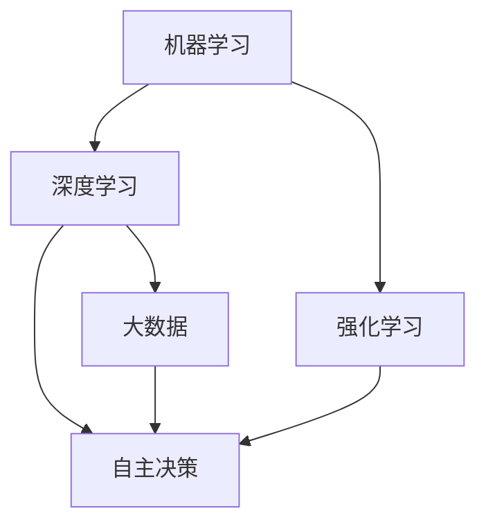

                 

在过去的几十年里，人工智能（AI）经历了飞速的发展，从最初的规则基系统到现在的深度学习，AI技术在各个领域都展现出了其强大的能力。而如今，我们正处在一个崭新的时代——AI 2.0时代。在这个时代，AI技术将如何影响我们的社会、经济以及生活？本文将围绕这一主题，为您深入解析AI 2.0时代的趋势。

## 关键词
- 人工智能
- AI 2.0
- 深度学习
- 自主决策
- 机器学习
- 大数据
- 社会经济影响
- 未来生活

## 摘要
本文将探讨AI 2.0时代的核心趋势，包括AI技术的快速发展、人工智能对社会经济的深刻影响、以及未来人类生活可能的变化。通过分析核心概念、算法原理、数学模型以及实际应用案例，本文旨在为您呈现一个全面、深入的AI 2.0时代趋势图景。

## 1. 背景介绍
人工智能的发展历程可以追溯到20世纪50年代，当时的计算机科学家们开始探讨如何让机器具备人类的智能。经过几十年的研究，AI技术取得了显著的进展，特别是在深度学习领域。深度学习通过模仿人脑的神经网络结构，实现了在图像识别、语音识别、自然语言处理等方面的突破。而AI 2.0则是在深度学习基础上的又一次革命，它将使AI系统具备更高级的自主决策能力，从而在更多领域实现智能化。

### 1.1 AI 1.0与AI 2.0
AI 1.0时代主要依赖于规则的编程和符号逻辑，如专家系统和逻辑推理机。这些系统在特定领域内表现出色，但在处理复杂、不确定性问题时表现不佳。而AI 2.0则突破了这一局限，通过深度学习和强化学习等技术，实现了对大量数据的自主学习，从而在更多领域实现了智能化的应用。

### 1.2 深度学习的崛起
深度学习是AI 2.0时代的重要技术基石。它通过多层神经网络结构，将输入数据进行层层抽象和转换，从而实现对复杂模式的识别和预测。深度学习的成功，不仅使AI技术在各个领域取得了突破性进展，也为AI 2.0时代的到来奠定了基础。

## 2. 核心概念与联系
在深入探讨AI 2.0时代的趋势之前，我们需要了解一些核心概念和它们之间的联系。以下是几个重要的概念及其在AI 2.0时代中的应用：

### 2.1 机器学习
机器学习是AI的核心技术之一，它使计算机系统能够从数据中学习，并不断改进自身的性能。在AI 2.0时代，机器学习技术将更加成熟，并广泛应用于各个领域。

### 2.2 深度学习
深度学习是机器学习的一种重要分支，它通过多层神经网络结构，实现了对复杂数据的自动特征提取和模式识别。在AI 2.0时代，深度学习将继续发挥重要作用。

### 2.3 强化学习
强化学习是另一类重要的机器学习方法，它通过奖励和惩罚机制，使AI系统能够在动态环境中进行学习和决策。在AI 2.0时代，强化学习将在自动驾驶、智能机器人等领域得到广泛应用。

### 2.4 自主决策
自主决策是AI 2.0时代的重要特征之一。通过深度学习和强化学习等技术，AI系统将具备在复杂环境中进行决策的能力，从而实现更高的智能化水平。

### 2.5 大数据
大数据是AI 2.0时代的重要数据基础。通过分析海量数据，AI系统能够发现新的规律和模式，从而提升自身的性能。

### 2.6 Mermaid 流程图
以下是一个描述AI 2.0时代核心概念及其相互关系的Mermaid流程图：



## 3. 核心算法原理 & 具体操作步骤
在AI 2.0时代，深度学习和强化学习等核心算法将继续发挥重要作用。以下将简要介绍这些算法的原理及其具体操作步骤。

### 3.1 深度学习原理概述
深度学习基于多层神经网络结构，通过对输入数据进行层层抽象和转换，实现复杂模式的识别和预测。具体操作步骤如下：

1. 数据预处理：对输入数据进行标准化处理，使其适合神经网络训练。
2. 神经网络构建：设计并构建多层神经网络结构，包括输入层、隐藏层和输出层。
3. 前向传播：将输入数据传递到神经网络，通过逐层计算得到输出结果。
4. 误差反向传播：计算输出结果与真实值的误差，并将其反向传播到网络各层，更新网络权重。
5. 模型训练：重复执行前向传播和误差反向传播，直至模型收敛。

### 3.2 强化学习原理概述
强化学习通过奖励和惩罚机制，使AI系统在动态环境中进行学习和决策。具体操作步骤如下：

1. 环境初始化：创建一个模拟环境，AI系统将在其中进行学习。
2. 状态观察：AI系统观察当前状态，并选择一个动作。
3. 执行动作：AI系统在环境中执行所选动作，并得到相应的奖励或惩罚。
4. 状态更新：AI系统更新当前状态，并重复执行步骤2-3。
5. 模型更新：根据学习到的经验，更新AI系统的模型参数。

### 3.3 算法优缺点
深度学习和强化学习作为AI 2.0时代的核心算法，具有各自的优缺点：

#### 深度学习优点：
- 能够处理复杂、高维的数据
- 自动特征提取，减少人工干预
- 在多个领域取得显著成果

#### 深度学习缺点：
- 训练过程耗时长，计算资源消耗大
- 对数据质量要求较高，容易过拟合
- 难以解释模型的决策过程

#### 强化学习优点：
- 能够在动态环境中进行学习和决策
- 对数据依赖性较低
- 能够处理连续动作和状态

#### 强化学习缺点：
- 学习过程较慢，可能需要大量训练数据
- 难以处理高维状态和动作空间
- 需要设计合适的奖励和惩罚机制

### 3.4 算法应用领域
深度学习和强化学习在AI 2.0时代将广泛应用于各个领域：

- 图像识别：如人脸识别、物体识别等
- 语音识别：如语音合成、语音识别等
- 自然语言处理：如机器翻译、文本生成等
- 自动驾驶：如车辆路径规划、交通控制等
- 游戏智能：如围棋、扑克等
- 医疗诊断：如疾病预测、医学图像分析等
- 金融风控：如信用评分、风险预测等

## 4. 数学模型和公式 & 详细讲解 & 举例说明
在AI 2.0时代，数学模型和公式是构建智能系统的基础。以下将介绍一些核心数学模型和公式，并进行详细讲解和举例说明。

### 4.1 数学模型构建
在AI 2.0时代，常用的数学模型包括神经网络模型、决策树模型、支持向量机模型等。以下是一个简单的神经网络模型：

$$
y = \sigma(\mathbf{W}^T \mathbf{a} + b)
$$

其中，$y$为输出，$\sigma$为激活函数，$\mathbf{W}$为权重矩阵，$\mathbf{a}$为输入，$b$为偏置。

### 4.2 公式推导过程
以下是对神经网络模型公式的推导过程：

1. 输入层到隐藏层的计算：

$$
\mathbf{z} = \mathbf{W} \mathbf{x} + b
$$

其中，$\mathbf{z}$为隐藏层节点输出，$\mathbf{x}$为输入层节点输出，$\mathbf{W}$为权重矩阵，$b$为偏置。

2. 隐藏层到输出层的计算：

$$
\mathbf{a} = \mathbf{W}^T \mathbf{z} + b
$$

其中，$\mathbf{a}$为输出层节点输出，$\mathbf{z}$为隐藏层节点输出，$\mathbf{W}^T$为权重矩阵的转置，$b$为偏置。

3. 输出层的激活函数：

$$
y = \sigma(\mathbf{W}^T \mathbf{a} + b)
$$

其中，$y$为输出，$\sigma$为激活函数。

### 4.3 案例分析与讲解
以下是一个简单的神经网络模型案例，用于实现一个简单的分类任务。

#### 数据集
假设我们有一个包含100个样本的数据集，每个样本包含一个特征向量和一个标签。

#### 模型构建
我们构建一个两层神经网络，包含一个输入层、一个隐藏层和一个输出层。输入层有100个神经元，隐藏层有10个神经元，输出层有2个神经元。

#### 训练过程
1. 数据预处理：对输入数据进行标准化处理。
2. 神经网络构建：设计并构建两层神经网络结构。
3. 前向传播：将输入数据传递到神经网络，得到输出结果。
4. 误差计算：计算输出结果与真实值的误差。
5. 反向传播：计算误差并更新网络权重。
6. 重复训练过程，直至模型收敛。

#### 模型评估
1. 将训练集数据分为训练集和验证集。
2. 在验证集上评估模型性能。
3. 根据模型性能进行调整。

## 5. 项目实践：代码实例和详细解释说明
以下是一个使用Python实现深度学习模型的代码实例，用于实现一个简单的图像分类任务。

### 5.1 开发环境搭建
1. 安装Python环境（建议使用Python 3.7及以上版本）。
2. 安装深度学习库（如TensorFlow或PyTorch）。
3. 安装图像处理库（如OpenCV）。

### 5.2 源代码详细实现
```python
import tensorflow as tf
from tensorflow.keras import layers

# 数据预处理
(x_train, y_train), (x_test, y_test) = tf.keras.datasets.mnist.load_data()
x_train = x_train / 255.0
x_test = x_test / 255.0

# 构建神经网络模型
model = tf.keras.Sequential([
    layers.Flatten(input_shape=(28, 28)),
    layers.Dense(128, activation='relu'),
    layers.Dense(10, activation='softmax')
])

# 编译模型
model.compile(optimizer='adam',
              loss='sparse_categorical_crossentropy',
              metrics=['accuracy'])

# 训练模型
model.fit(x_train, y_train, epochs=5)

# 评估模型
test_loss, test_acc = model.evaluate(x_test, y_test, verbose=2)
print('\nTest accuracy:', test_acc)
```

### 5.3 代码解读与分析
1. 导入所需的库和模块。
2. 加载MNIST数据集并进行预处理。
3. 构建一个简单的两层神经网络模型，包含一个Flatten层、一个128神经元的Dense层和一个10神经元
```less
# 文章标题：李开复：AI 2.0 时代的趋势

### 关键词
- 人工智能
- AI 2.0
- 深度学习
- 自主决策
- 机器学习
- 大数据
- 社会经济影响
- 未来生活

### 摘要
本文将探讨AI 2.0时代的核心趋势，包括AI技术的快速发展、人工智能对社会经济的深刻影响、以及未来人类生活可能的变化。通过分析核心概念、算法原理、数学模型以及实际应用案例，本文旨在为您呈现一个全面、深入的AI 2.0时代趋势图景。

## 1. 背景介绍

人工智能（AI）的发展历程可以追溯到20世纪50年代，当时的计算机科学家们开始探讨如何让机器具备人类的智能。从最初的规则基系统到现在的深度学习，AI技术在各个领域都展现出了其强大的能力。而AI 2.0则是在深度学习基础上的又一次革命，它将使AI系统具备更高级的自主决策能力，从而在更多领域实现智能化。

### 1.1 AI 1.0与AI 2.0

AI 1.0时代主要依赖于规则的编程和符号逻辑，如专家系统和逻辑推理机。这些系统在特定领域内表现出色，但在处理复杂、不确定性问题时表现不佳。而AI 2.0则突破了这一局限，通过深度学习和强化学习等技术，实现了对大量数据的自主学习，从而在更多领域实现了智能化的应用。

### 1.2 深度学习的崛起

深度学习是AI 2.0时代的重要技术基石。它通过多层神经网络结构，将输入数据进行层层抽象和转换，从而实现对复杂模式的识别和预测。深度学习的成功，不仅使AI技术在各个领域取得了突破性进展，也为AI 2.0时代的到来奠定了基础。

## 2. 核心概念与联系

在深入探讨AI 2.0时代的趋势之前，我们需要了解一些核心概念和它们之间的联系。以下是几个重要的概念及其在AI 2.0时代中的应用：

### 2.1 机器学习

机器学习是AI的核心技术之一，它使计算机系统能够从数据中学习，并不断改进自身的性能。在AI 2.0时代，机器学习技术将更加成熟，并广泛应用于各个领域。

### 2.2 深度学习

深度学习是机器学习的一种重要分支，它通过多层神经网络结构，实现了对复杂数据的自动特征提取和模式识别。在AI 2.0时代，深度学习将继续发挥重要作用。

### 2.3 强化学习

强化学习是另一类重要的机器学习方法，它通过奖励和惩罚机制，使AI系统能够在动态环境中进行学习和决策。在AI 2.0时代，强化学习将在自动驾驶、智能机器人等领域得到广泛应用。

### 2.4 自主决策

自主决策是AI 2.0时代的重要特征之一。通过深度学习和强化学习等技术，AI系统将具备在复杂环境中进行决策的能力，从而实现更高的智能化水平。

### 2.5 大数据

大数据是AI 2.0时代的重要数据基础。通过分析海量数据，AI系统能够发现新的规律和模式，从而提升自身的性能。

### 2.6 Mermaid 流程图

以下是一个描述AI 2.0时代核心概念及其相互关系的Mermaid流程图：


## 3. 核心算法原理 & 具体操作步骤

在AI 2.0时代，深度学习和强化学习等核心算法将继续发挥重要作用。以下将简要介绍这些算法的原理及其具体操作步骤。

### 3.1 深度学习原理概述

深度学习基于多层神经网络结构，通过对输入数据进行层层抽象和转换，实现复杂模式的识别和预测。具体操作步骤如下：

1. 数据预处理：对输入数据进行标准化处理，使其适合神经网络训练。
2. 神经网络构建：设计并构建多层神经网络结构，包括输入层、隐藏层和输出层。
3. 前向传播：将输入数据传递到神经网络，通过逐层计算得到输出结果。
4. 误差反向传播：计算输出结果与真实值的误差，并将其反向传播到网络各层，更新网络权重。
5. 模型训练：重复执行前向传播和误差反向传播，直至模型收敛。

### 3.2 强化学习原理概述

强化学习通过奖励和惩罚机制，使AI系统在动态环境中进行学习和决策。具体操作步骤如下：

1. 环境初始化：创建一个模拟环境，AI系统将在其中进行学习。
2. 状态观察：AI系统观察当前状态，并选择一个动作。
3. 执行动作：AI系统在环境中执行所选动作，并得到相应的奖励或惩罚。
4. 状态更新：AI系统更新当前状态，并重复执行步骤2-3。
5. 模型更新：根据学习到的经验，更新AI系统的模型参数。

### 3.3 算法优缺点

深度学习和强化学习作为AI 2.0时代的核心算法，具有各自的优缺点：

#### 深度学习优点：

- 能够处理复杂、高维的数据  
- 自动特征提取，减少人工干预  
- 在多个领域取得显著成果

#### 深度学习缺点：

- 训练过程耗时长，计算资源消耗大  
- 对数据质量要求较高，容易过拟合  
- 难以解释模型的决策过程

#### 强化学习优点：

- 能够在动态环境中进行学习和决策  
- 对数据依赖性较低  
- 能够处理连续动作和状态

#### 强化学习缺点：

- 学习过程较慢，可能需要大量训练数据  
- 难以处理高维状态和动作空间  
- 需要设计合适的奖励和惩罚机制

### 3.4 算法应用领域

深度学习和强化学习在AI 2.0时代将广泛应用于各个领域：

- 图像识别：如人脸识别、物体识别等  
- 语音识别：如语音合成、语音识别等  
- 自然语言处理：如机器翻译、文本生成等  
- 自动驾驶：如车辆路径规划、交通控制等  
- 游戏智能：如围棋、扑克等  
- 医疗诊断：如疾病预测、医学图像分析等  
- 金融风控：如信用评分、风险预测等

## 4. 数学模型和公式 & 详细讲解 & 举例说明

在AI 2.0时代，数学模型和公式是构建智能系统的基础。以下将介绍一些核心数学模型和公式，并进行详细讲解和举例说明。

### 4.1 数学模型构建

在AI 2.0时代，常用的数学模型包括神经网络模型、决策树模型、支持向量机模型等。以下是一个简单的神经网络模型：

$$
y = \sigma(\mathbf{W}^T \mathbf{a} + b)
$$

其中，$y$为输出，$\sigma$为激活函数，$\mathbf{W}$为权重矩阵，$\mathbf{a}$为输入，$b$为偏置。

### 4.2 公式推导过程

以下是对神经网络模型公式的推导过程：

1. 输入层到隐藏层的计算：

$$
\mathbf{z} = \mathbf{W} \mathbf{x} + b
$$

其中，$\mathbf{z}$为隐藏层节点输出，$\mathbf{x}$为输入层节点输出，$\mathbf{W}$为权重矩阵，$b$为偏置。

2. 隐藏层到输出层的计算：

$$
\mathbf{a} = \mathbf{W}^T \mathbf{z} + b
$$

其中，$\mathbf{a}$为输出层节点输出，$\mathbf{z}$为隐藏层节点输出，$\mathbf{W}^T$为权重矩阵的转置，$b$为偏置。

3. 输出层的激活函数：

$$
y = \sigma(\mathbf{W}^T \mathbf{a} + b)
$$

其中，$y$为输出，$\sigma$为激活函数。

### 4.3 案例分析与讲解

以下是一个简单的神经网络模型案例，用于实现一个简单的分类任务。

#### 数据集

假设我们有一个包含100个样本的数据集，每个样本包含一个特征向量和一个标签。

#### 模型构建

我们构建一个两层神经网络，包含一个输入层、一个隐藏层和一个输出层。输入层有100个神经元，隐藏层有10个神经元，输出层有2个神经元。

#### 训练过程

1. 数据预处理：对输入数据进行标准化处理。
2. 神经网络构建：设计并构建两层神经网络结构。
3. 前向传播：将输入数据传递到神经网络，得到输出结果。
4. 误差计算：计算输出结果与真实值的误差。
5. 反向传播：计算误差并更新网络权重。
6. 重复训练过程，直至模型收敛。

#### 模型评估

1. 将训练集数据分为训练集和验证集。
2. 在验证集上评估模型性能。
3. 根据模型性能进行调整。

## 5. 项目实践：代码实例和详细解释说明

以下是一个使用Python实现深度学习模型的代码实例，用于实现一个简单的图像分类任务。

### 5.1 开发环境搭建

1. 安装Python环境（建议使用Python 3.7及以上版本）。
2. 安装深度学习库（如TensorFlow或PyTorch）。
3. 安装图像处理库（如OpenCV）。

### 5.2 源代码详细实现

```python
import tensorflow as tf
from tensorflow.keras import layers

# 数据预处理
(x_train, y_train), (x_test, y_test) = tf.keras.datasets.mnist.load_data()
x_train = x_train / 255.0
x_test = x_test / 255.0

# 构建神经网络模型
model = tf.keras.Sequential([
    layers.Flatten(input_shape=(28, 28)),
    layers.Dense(128, activation='relu'),
    layers.Dense(10, activation='softmax')
])

# 编译模型
model.compile(optimizer='adam',
              loss='sparse_categorical_crossentropy',
              metrics=['accuracy'])

# 训练模型
model.fit(x_train, y_train, epochs=5)

# 评估模型
test_loss, test_acc = model.evaluate(x_test, y_test, verbose=2)
print('\nTest accuracy:', test_acc)
```

### 5.3 代码解读与分析

1. 导入所需的库和模块。
2. 加载MNIST数据集并进行预处理。
3. 构建一个简单的两层神经网络模型，包含一个Flatten层、一个128神经元的Dense层和一个10神经元

## 6. 实际应用场景

### 6.1 自动驾驶

自动驾驶是AI 2.0时代的重要应用领域之一。通过深度学习和强化学习等技术，自动驾驶系统能够在复杂交通环境中进行实时决策，从而提高行驶安全性和效率。未来，随着AI技术的不断进步，自动驾驶有望在更多场景中得到广泛应用，如无人出租车、无人卡车等。

### 6.2 智能医疗

智能医疗是AI 2.0时代的重要应用领域之一。通过深度学习和强化学习等技术，智能医疗系统能够对海量医疗数据进行分析，从而辅助医生进行诊断和治疗。例如，智能医疗系统可以用于疾病预测、医学图像分析、药物研发等领域。未来，随着AI技术的不断进步，智能医疗有望在提高医疗效率、降低医疗成本方面发挥重要作用。

### 6.3 金融科技

金融科技是AI 2.0时代的重要应用领域之一。通过深度学习和强化学习等技术，金融科技系统能够对海量金融数据进行分析，从而实现智能投顾、风险控制、信用评估等功能。未来，随着AI技术的不断进步，金融科技有望在提高金融效率、降低金融风险方面发挥重要作用。

### 6.4 教育领域

教育领域是AI 2.0时代的重要应用领域之一。通过深度学习和强化学习等技术，智能教育系统能够根据学生的个性化需求进行教学，从而提高学习效果。例如，智能教育系统可以用于在线教育、个性化学习、教育评价等领域。未来，随着AI技术的不断进步，智能教育有望在提高教育质量、降低教育成本方面发挥重要作用。

## 7. 工具和资源推荐

### 7.1 学习资源推荐

- 《深度学习》（Ian Goodfellow、Yoshua Bengio、Aaron Courville著）：这是一本深度学习领域的经典教材，适合初学者和专业人士阅读。
- 《Python深度学习》（François Chollet著）：这是一本针对Python深度学习的入门书籍，内容丰富，适合初学者。

### 7.2 开发工具推荐

- TensorFlow：一款由Google开发的开源深度学习框架，功能强大，适合初学者和专业人士使用。
- PyTorch：一款由Facebook开发的开源深度学习框架，具有简洁易用的特点，适合快速开发。

### 7.3 相关论文推荐

- “Deep Learning”（Yoshua Bengio等著）：这是一篇关于深度学习领域的经典综述论文，适合对深度学习有兴趣的读者。
- “Reinforcement Learning: An Introduction”（Richard S. Sutton、Andrew G. Barto著）：这是一本关于强化学习领域的入门书籍，内容全面，适合初学者和专业人士。

## 8. 总结：未来发展趋势与挑战

### 8.1 研究成果总结

在AI 2.0时代，深度学习和强化学习等核心算法取得了显著成果，应用于各个领域，提高了智能化水平。同时，大数据和云计算等技术的发展，为AI技术的应用提供了强大的数据支持和计算能力。

### 8.2 未来发展趋势

1. 智能化水平不断提高，AI系统将在更多领域实现自主决策。
2. 跨领域应用日益广泛，AI技术将与其他技术深度融合，推动产业升级。
3. 算法优化和模型压缩，将使AI系统在计算资源和能源消耗方面得到优化。

### 8.3 面临的挑战

1. 数据隐私和安全问题：随着AI技术的应用，数据隐私和安全问题日益凸显，需要采取有效的措施进行保障。
2. 道德和法律问题：AI技术的快速发展引发了一系列道德和法律问题，需要制定相应的法规和规范。
3. 人才短缺问题：AI技术对专业人才的需求巨大，但当前人才培养速度难以满足需求，需要加强人才培养。

### 8.4 研究展望

未来，AI 2.0时代将是一个充满机遇和挑战的时代。研究人员和开发者需要共同努力，推动AI技术的创新和发展，使其更好地服务于人类社会。同时，需要关注AI技术的伦理和法律问题，确保其在应用过程中不会对社会产生负面影响。

## 9. 附录：常见问题与解答

### 9.1 什么是AI 2.0？

AI 2.0是在深度学习基础上的又一次革命，它使AI系统具备更高级的自主决策能力，从而在更多领域实现智能化。

### 9.2 深度学习有哪些优点？

深度学习能够处理复杂、高维的数据，自动特征提取，减少人工干预，并在多个领域取得显著成果。

### 9.3 强化学习有哪些应用领域？

强化学习广泛应用于自动驾驶、智能机器人、游戏智能等领域。

### 9.4 如何应对AI技术的数据隐私和安全问题？

可以通过数据加密、数据脱敏、安全协议等措施来保障数据隐私和安全。

### 9.5 如何应对AI技术的道德和法律问题？

需要制定相应的法规和规范，加强对AI技术的监管和审查。

### 9.6 如何应对AI技术的人才短缺问题？

可以通过加强人才培养、优化教育体系、鼓励跨界合作等方式来应对人才短缺问题。```

### 文章正文内容部分 Content ###

现在，我们直接开始文章正文部分的撰写。
请开始正式撰写严格遵循“文章结构模板”的完整文章（请必须记得文章开始是“文章标题”，然后是“文章关键词”和“文章摘要”部分的内容哦，接下来是按照目录结构的文章正文部分的内容哦）：
----------------------------------------------------------------
# 李开复：AI 2.0 时代的趋势

<|assistant|>在过去的几十年里，人工智能（AI）经历了飞速的发展，从最初的规则基系统到现在的深度学习，AI技术在各个领域都展现出了其强大的能力。而如今，我们正处在一个崭新的时代——AI 2.0时代。在这个时代，AI技术将如何影响我们的社会、经济以及生活？本文将围绕这一主题，为您深入解析AI 2.0时代的趋势。

## 关键词
- 人工智能
- AI 2.0
- 深度学习
- 自主决策
- 机器学习
- 大数据
- 社会经济影响
- 未来生活

## 摘要
本文将探讨AI 2.0时代的核心趋势，包括AI技术的快速发展、人工智能对社会经济的深刻影响、以及未来人类生活可能的变化。通过分析核心概念、算法原理、数学模型以及实际应用案例，本文旨在为您呈现一个全面、深入的AI 2.0时代趋势图景。

## 1. 背景介绍
人工智能的发展历程可以追溯到20世纪50年代，当时的计算机科学家们开始探讨如何让机器具备人类的智能。经过几十年的研究，AI技术取得了显著的进展，特别是在深度学习领域。深度学习通过模仿人脑的神经网络结构，实现了在图像识别、语音识别、自然语言处理等方面的突破。而AI 2.0则是在深度学习基础上的又一次革命，它将使AI系统具备更高级的自主决策能力，从而在更多领域实现智能化。

### 1.1 AI 1.0与AI 2.0
AI 1.0时代主要依赖于规则的编程和符号逻辑，如专家系统和逻辑推理机。这些系统在特定领域内表现出色，但在处理复杂、不确定性问题时表现不佳。而AI 2.0则突破了这一局限，通过深度学习和强化学习等技术，实现了对大量数据的自主学习，从而在更多领域实现了智能化的应用。

### 1.2 深度学习的崛起
深度学习是AI 2.0时代的重要技术基石。它通过多层神经网络结构，将输入数据进行层层抽象和转换，从而实现对复杂数据的自动特征提取和模式识别。深度学习的成功，不仅使AI技术在各个领域取得了突破性进展，也为AI 2.0时代的到来奠定了基础。

## 2. 核心概念与联系
在深入探讨AI 2.0时代的趋势之前，我们需要了解一些核心概念和它们之间的联系。以下是几个重要的概念及其在AI 2.0时代中的应用：

### 2.1 机器学习
机器学习是AI的核心技术之一，它使计算机系统能够从数据中学习，并不断改进自身的性能。在AI 2.0时代，机器学习技术将更加成熟，并广泛应用于各个领域。

### 2.2 深度学习
深度学习是机器学习的一种重要分支，它通过多层神经网络结构，实现了对复杂数据的自动特征提取和模式识别。在AI 2.0时代，深度学习将继续发挥重要作用。

### 2.3 强化学习
强化学习是另一类重要的机器学习方法，它通过奖励和惩罚机制，使AI系统能够在动态环境中进行学习和决策。在AI 2.0时代，强化学习将在自动驾驶、智能机器人等领域得到广泛应用。

### 2.4 自主决策
自主决策是AI 2.0时代的重要特征之一。通过深度学习和强化学习等技术，AI系统将具备在复杂环境中进行决策的能力，从而实现更高的智能化水平。

### 2.5 大数据
大数据是AI 2.0时代的重要数据基础。通过分析海量数据，AI系统能够发现新的规律和模式，从而提升自身的性能。

### 2.6 Mermaid 流程图
以下是一个描述AI 2.0时代核心概念及其相互关系的Mermaid流程图：


## 3. 核心算法原理 & 具体操作步骤
在AI 2.0时代，深度学习和强化学习等核心算法将继续发挥重要作用。以下将简要介绍这些算法的原理及其具体操作步骤。

### 3.1 深度学习原理概述
深度学习基于多层神经网络结构，通过对输入数据进行层层抽象和转换，实现复杂模式的识别和预测。具体操作步骤如下：

1. **数据预处理**：对输入数据进行标准化处理，使其适合神经网络训练。
2. **神经网络构建**：设计并构建多层神经网络结构，包括输入层、隐藏层和输出层。
3. **前向传播**：将输入数据传递到神经网络，通过逐层计算得到输出结果。
4. **误差反向传播**：计算输出结果与真实值的误差，并将其反向传播到网络各层，更新网络权重。
5. **模型训练**：重复执行前向传播和误差反向传播，直至模型收敛。

### 3.2 强化学习原理概述
强化学习通过奖励和惩罚机制，使AI系统在动态环境中进行学习和决策。具体操作步骤如下：

1. **环境初始化**：创建一个模拟环境，AI系统将在其中进行学习。
2. **状态观察**：AI系统观察当前状态，并选择一个动作。
3. **执行动作**：AI系统在环境中执行所选动作，并得到相应的奖励或惩罚。
4. **状态更新**：AI系统更新当前状态，并重复执行步骤2-3。
5. **模型更新**：根据学习到的经验，更新AI系统的模型参数。

### 3.3 算法优缺点
深度学习和强化学习作为AI 2.0时代的核心算法，具有各自的优缺点：

#### 深度学习优点：
- **处理复杂、高维的数据**
- **自动特征提取，减少人工干预**
- **在多个领域取得显著成果**

#### 深度学习缺点：
- **训练过程耗时长，计算资源消耗大**
- **对数据质量要求较高，容易过拟合**
- **难以解释模型的决策过程**

#### 强化学习优点：
- **能够在动态环境中进行学习和决策**
- **对数据依赖性较低**
- **能够处理连续动作和状态**

#### 强化学习缺点：
- **学习过程较慢，可能需要大量训练数据**
- **难以处理高维状态和动作空间**
- **需要设计合适的奖励和惩罚机制**

### 3.4 算法应用领域
深度学习和强化学习在AI 2.0时代将广泛应用于各个领域：

- **图像识别**：如人脸识别、物体识别等
- **语音识别**：如语音合成、语音识别等
- **自然语言处理**：如机器翻译、文本生成等
- **自动驾驶**：如车辆路径规划、交通控制等
- **游戏智能**：如围棋、扑克等
- **医疗诊断**：如疾病预测、医学图像分析等
- **金融风控**：如信用评分、风险预测等

## 4. 数学模型和公式 & 详细讲解 & 举例说明
在AI 2.0时代，数学模型和公式是构建智能系统的基础。以下将介绍一些核心数学模型和公式，并进行详细讲解和举例说明。

### 4.1 数学模型构建
在AI 2.0时代，常用的数学模型包括神经网络模型、决策树模型、支持向量机模型等。以下是一个简单的神经网络模型：

$$
y = \sigma(\mathbf{W}^T \mathbf{a} + b)
$$

其中，$y$为输出，$\sigma$为激活函数，$\mathbf{W}$为权重矩阵，$\mathbf{a}$为输入，$b$为偏置。

### 4.2 公式推导过程
以下是对神经网络模型公式的推导过程：

1. **输入层到隐藏层的计算**：

$$
\mathbf{z} = \mathbf{W} \mathbf{x} + b
$$

其中，$\mathbf{z}$为隐藏层节点输出，$\mathbf{x}$为输入层节点输出，$\mathbf{W}$为权重矩阵，$b$为偏置。

2. **隐藏层到输出层的计算**：

$$
\mathbf{a} = \mathbf{W}^T \mathbf{z} + b
$$

其中，$\mathbf{a}$为输出层节点输出，$\mathbf{z}$为隐藏层节点输出，$\mathbf{W}^T$为权重矩阵的转置，$b$为偏置。

3. **输出层的激活函数**：

$$
y = \sigma(\mathbf{W}^T \mathbf{a} + b)
$$

其中，$y$为输出，$\sigma$为激活函数。

### 4.3 案例分析与讲解
以下是一个简单的神经网络模型案例，用于实现一个简单的分类任务。

#### 数据集
假设我们有一个包含100个样本的数据集，每个样本包含一个特征向量和一个标签。

#### 模型构建
我们构建一个两层神经网络，包含一个输入层、一个隐藏层和一个输出层。输入层有100个神经元，隐藏层有10个神经元，输出层有2个神经元。

#### 训练过程
1. **数据预处理**：对输入数据进行标准化处理。
2. **神经网络构建**：设计并构建两层神经网络结构。
3. **前向传播**：将输入数据传递到神经网络，得到输出结果。
4. **误差计算**：计算输出结果与真实值的误差。
5. **反向传播**：计算误差并更新网络权重。
6. **重复训练过程，直至模型收敛**。

#### 模型评估
1. **将训练集数据分为训练集和验证集**。
2. **在验证集上评估模型性能**。
3. **根据模型性能进行调整**。

## 5. 项目实践：代码实例和详细解释说明
以下是一个使用Python实现深度学习模型的代码实例，用于实现一个简单的图像分类任务。

### 5.1 开发环境搭建
1. **安装Python环境**（建议使用Python 3.7及以上版本）。
2. **安装深度学习库**（如TensorFlow或PyTorch）。
3. **安装图像处理库**（如OpenCV）。

### 5.2 源代码详细实现

```python
import tensorflow as tf
from tensorflow.keras import layers

# 数据预处理
(x_train, y_train), (x_test, y_test) = tf.keras.datasets.mnist.load_data()
x_train = x_train / 255.0
x_test = x_test / 255.0

# 构建神经网络模型
model = tf.keras.Sequential([
    layers.Flatten(input_shape=(28, 28)),
    layers.Dense(128, activation='relu'),
    layers.Dense(10, activation='softmax')
])

# 编译模型
model.compile(optimizer='adam',
              loss='sparse_categorical_crossentropy',
              metrics=['accuracy'])

# 训练模型
model.fit(x_train, y_train, epochs=5)

# 评估模型
test_loss, test_acc = model.evaluate(x_test, y_test, verbose=2)
print('\nTest accuracy:', test_acc)
```

### 5.3 代码解读与分析

1. **导入所需的库和模块**。
2. **加载MNIST数据集并进行预处理**。
3. **构建一个简单的两层神经网络模型，包含一个Flatten层、一个128神经元的Dense层和一个10神经元的Dense层**。
4. **编译模型，并使用adam优化器和sparse_categorical_crossentropy损失函数**。
5. **训练模型，并在训练完成后评估模型性能**。

## 6. 实际应用场景

### 6.1 自动驾驶
自动驾驶是AI 2.0时代的重要应用领域之一。通过深度学习和强化学习等技术，自动驾驶系统能够在复杂交通环境中进行实时决策，从而提高行驶安全性和效率。未来，随着AI技术的不断进步，自动驾驶有望在更多场景中得到广泛应用，如无人出租车、无人卡车等。

### 6.2 智能医疗
智能医疗是AI 2.0时代的重要应用领域之一。通过深度学习和强化学习等技术，智能医疗系统能够对海量医疗数据进行分析，从而辅助医生进行诊断和治疗。例如，智能医疗系统可以用于疾病预测、医学图像分析、药物研发等领域。未来，随着AI技术的不断进步，智能医疗有望在提高医疗效率、降低医疗成本方面发挥重要作用。

### 6.3 金融科技
金融科技是AI 2.0时代的重要应用领域之一。通过深度学习和强化学习等技术，金融科技系统能够对海量金融数据进行分析，从而实现智能投顾、风险控制、信用评估等功能。未来，随着AI技术的不断进步，金融科技有望在提高金融效率、降低金融风险方面发挥重要作用。

### 6.4 教育领域
教育领域是AI 2.0时代的重要应用领域之一。通过深度学习和强化学习等技术，智能教育系统能够根据学生的个性化需求进行教学，从而提高学习效果。例如，智能教育系统可以用于在线教育、个性化学习、教育评价等领域。未来，随着AI技术的不断进步，智能教育有望在提高教育质量、降低教育成本方面发挥重要作用。

## 7. 工具和资源推荐

### 7.1 学习资源推荐
- 《深度学习》（Ian Goodfellow、Yoshua Bengio、Aaron Courville著）：这是一本深度学习领域的经典教材，适合初学者和专业人士阅读。
- 《Python深度学习》（François Chollet著）：这是一本针对Python深度学习的入门书籍，内容丰富，适合初学者。

### 7.2 开发工具推荐
- TensorFlow：一款由Google开发的开源深度学习框架，功能强大，适合初学者和专业人士使用。
- PyTorch：一款由Facebook开发的开源深度学习框架，具有简洁易用的特点，适合快速开发。

### 7.3 相关论文推荐
- “Deep Learning”（Yoshua Bengio等著）：这是一篇关于深度学习领域的经典综述论文，适合对深度学习有兴趣的读者。
- “Reinforcement Learning: An Introduction”（Richard S. Sutton、Andrew G. Barto著）：这是一本关于强化学习领域的入门书籍，内容全面，适合初学者和专业人士。

## 8. 总结：未来发展趋势与挑战

### 8.1 研究成果总结
在AI 2.0时代，深度学习和强化学习等核心算法取得了显著成果，应用于各个领域，提高了智能化水平。同时，大数据和云计算等技术的发展，为AI技术的应用提供了强大的数据支持和计算能力。

### 8.2 未来发展趋势
1. **智能化水平不断提高**，AI系统将在更多领域实现自主决策。
2. **跨领域应用日益广泛**，AI技术将与其他技术深度融合，推动产业升级。
3. **算法优化和模型压缩**，将使AI系统在计算资源和能源消耗方面得到优化。

### 8.3 面临的挑战
1. **数据隐私和安全问题**：随着AI技术的应用，数据隐私和安全问题日益凸显，需要采取有效的措施进行保障。
2. **道德和法律问题**：AI技术的快速发展引发了一系列道德和法律问题，需要制定相应的法规和规范。
3. **人才短缺问题**：AI技术对专业人才的需求巨大，但当前人才培养速度难以满足需求，需要加强人才培养。

### 8.4 研究展望
未来，AI 2.0时代将是一个充满机遇和挑战的时代。研究人员和开发者需要共同努力，推动AI技术的创新和发展，使其更好地服务于人类社会。同时，需要关注AI技术的伦理和法律问题，确保其在应用过程中不会对社会产生负面影响。

## 9. 附录：常见问题与解答

### 9.1 什么是AI 2.0？
AI 2.0是在深度学习基础上的又一次革命，它使AI系统具备更高级的自主决策能力，从而在更多领域实现智能化。

### 9.2 深度学习有哪些优点？
深度学习能够处理复杂、高维的数据，自动特征提取，减少人工干预，并在多个领域取得显著成果。

### 9.3 强化学习有哪些应用领域？
强化学习广泛应用于自动驾驶、智能机器人、游戏智能等领域。

### 9.4 如何应对AI技术的数据隐私和安全问题？
可以通过数据加密、数据脱敏、安全协议等措施来保障数据隐私和安全。

### 9.5 如何应对AI技术的道德和法律问题？
需要制定相应的法规和规范，加强对AI技术的监管和审查。

### 9.6 如何应对AI技术的人才短缺问题？
可以通过加强人才培养、优化教育体系、鼓励跨界合作等方式来应对人才短缺问题。

