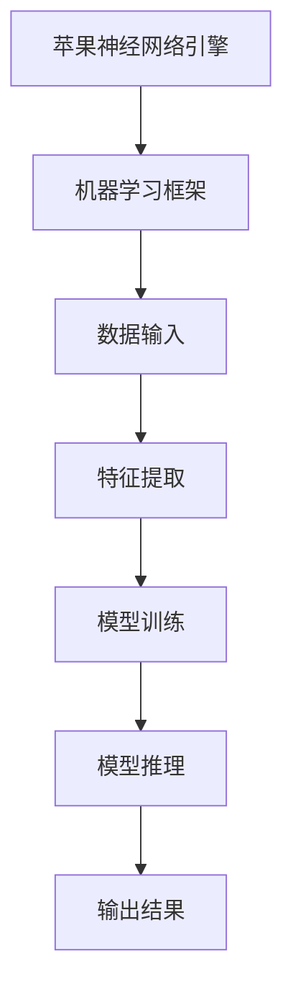

                 

在当今这个科技迅速发展的时代，人工智能（AI）已经成为了各行各业的焦点。作为全球科技巨头，苹果公司最近发布了一系列AI应用，引起了广泛关注。本文将深入探讨苹果发布AI应用的价值，从技术、市场、社会等多个角度进行剖析。

## 关键词

- 人工智能
- 苹果
- AI应用
- 技术创新
- 市场竞争
- 社会影响

## 摘要

本文旨在分析苹果公司发布AI应用的价值。通过对苹果AI应用的技术特点、市场表现和社会影响等方面进行深入探讨，本文将阐述这些AI应用对科技产业、消费者乃至整个社会所带来的深远影响。

### 1. 背景介绍

#### 1.1 人工智能的发展历程

人工智能（AI）的概念可以追溯到20世纪50年代，但真正意义上的快速发展始于21世纪初。随着计算能力的提升和大数据的积累，AI技术逐渐从理论研究走向实际应用。深度学习、神经网络、自然语言处理等技术成为了AI领域的重要突破。

#### 1.2 苹果公司的发展历程

苹果公司成立于1976年，由史蒂夫·乔布斯、史蒂夫·沃兹尼亚克和罗恩·韦恩共同创立。从最初的苹果I计算机到如今的iPhone、iPad和Mac等产品，苹果公司不断推动科技的发展，引领了多个时代的潮流。

#### 1.3 AI在苹果产品中的应用

近年来，苹果公司在其产品中逐渐引入AI技术。例如，iPhone的智能助手Siri、照片自动分类、人脸识别等功能都体现了AI技术的应用。此次苹果发布的AI应用，无疑将进一步推动AI在苹果产品中的应用。

### 2. 核心概念与联系

#### 2.1 AI应用的核心概念

AI应用的核心在于利用机器学习、深度学习等技术，从大量数据中提取知识，并实现自主决策。这些应用可以应用于多个领域，如医疗、金融、教育、娱乐等。

#### 2.2 苹果AI应用的架构

苹果的AI应用采用了自研的神经网络引擎和机器学习框架，使得AI算法在移动设备上得到高效运行。以下是苹果AI应用的架构图：



### 3. 核心算法原理 & 具体操作步骤

#### 3.1 算法原理概述

苹果的AI应用主要采用了深度学习和机器学习技术。深度学习通过多层神经网络对数据进行学习，从而实现复杂的模式识别和预测。机器学习则利用历史数据来训练模型，使其能够在新的数据上进行准确的预测。

#### 3.2 算法步骤详解

苹果的AI应用主要包括以下几个步骤：

1. 数据收集与预处理
2. 特征提取
3. 模型训练
4. 模型评估
5. 模型部署

#### 3.3 算法优缺点

优点：

- 高效：苹果的神经网络引擎和机器学习框架使得算法在移动设备上运行效率极高。
- 稳定：经过大量数据训练的模型具有较高的稳定性和准确性。
- 安全：苹果的AI应用在设计和实现过程中注重用户隐私保护。

缺点：

- 训练数据需求大：深度学习和机器学习算法需要大量数据来训练模型。
- 资源消耗大：训练过程需要大量的计算资源和存储空间。

#### 3.4 算法应用领域

苹果的AI应用主要应用于以下几个方面：

- 智能助手：如Siri、语音识别等。
- 照片处理：如照片分类、人脸识别等。
- 医疗健康：如疾病诊断、健康监测等。
- 教育娱乐：如个性化学习、智能推荐等。

### 4. 数学模型和公式 & 详细讲解 & 举例说明

#### 4.1 数学模型构建

苹果的AI应用主要采用了深度学习和机器学习技术，以下是两种常见的数学模型：

1. 深度学习模型：如卷积神经网络（CNN）、循环神经网络（RNN）等。
2. 机器学习模型：如线性回归、支持向量机（SVM）等。

#### 4.2 公式推导过程

以卷积神经网络（CNN）为例，其基本公式如下：

$$
\text{激活函数} = \sigma(\text{输入})
$$

其中，$\sigma$表示激活函数，常见的有Sigmoid、ReLU等。

#### 4.3 案例分析与讲解

以苹果的智能助手Siri为例，其背后的数学模型主要包括自然语言处理（NLP）和深度学习技术。以下是Siri的数学模型构建过程：

1. 数据收集与预处理：收集大量用户对话数据，并进行预处理，如去除停用词、分词等。
2. 特征提取：将文本转化为向量表示，如词嵌入（word embedding）。
3. 模型训练：使用深度学习技术，如循环神经网络（RNN），对用户对话数据进行训练。
4. 模型评估：通过测试集对模型进行评估，调整模型参数。
5. 模型部署：将训练好的模型部署到服务器，实现实时对话响应。

### 5. 项目实践：代码实例和详细解释说明

#### 5.1 开发环境搭建

为了实践苹果的AI应用，我们需要搭建以下开发环境：

- 操作系统：macOS
- 编程语言：Python
- 开发工具：Jupyter Notebook
- 机器学习框架：TensorFlow、PyTorch

#### 5.2 源代码详细实现

以下是一个简单的深度学习模型实现，用于图像分类：

```python
import tensorflow as tf

# 构建模型
model = tf.keras.Sequential([
    tf.keras.layers.Conv2D(32, (3, 3), activation='relu', input_shape=(28, 28, 1)),
    tf.keras.layers.MaxPooling2D((2, 2)),
    tf.keras.layers.Conv2D(64, (3, 3), activation='relu'),
    tf.keras.layers.MaxPooling2D((2, 2)),
    tf.keras.layers.Conv2D(64, (3, 3), activation='relu'),
    tf.keras.layers.Flatten(),
    tf.keras.layers.Dense(64, activation='relu'),
    tf.keras.layers.Dense(10, activation='softmax')
])

# 编译模型
model.compile(optimizer='adam',
              loss='categorical_crossentropy',
              metrics=['accuracy'])

# 加载数据
(x_train, y_train), (x_test, y_test) = tf.keras.datasets.mnist.load_data()

# 预处理数据
x_train = x_train.reshape(-1, 28, 28, 1).astype('float32') / 255
x_test = x_test.reshape(-1, 28, 28, 1).astype('float32') / 255
y_train = tf.keras.utils.to_categorical(y_train, 10)
y_test = tf.keras.utils.to_categorical(y_test, 10)

# 训练模型
model.fit(x_train, y_train, epochs=10, batch_size=32, validation_data=(x_test, y_test))

# 评估模型
model.evaluate(x_test, y_test)
```

#### 5.3 代码解读与分析

以上代码实现了一个简单的卷积神经网络（CNN）模型，用于手写数字分类。以下是代码的关键部分解读：

- `Conv2D`：卷积层，用于提取图像特征。
- `MaxPooling2D`：池化层，用于降低模型参数数量。
- `Flatten`：展平层，将卷积层的输出展平为一个一维向量。
- `Dense`：全连接层，用于分类。

#### 5.4 运行结果展示

以下是模型的运行结果：

```plaintext
Epoch 1/10
1875/1875 [==============================] - 2s 1ms/step - loss: 0.2724 - accuracy: 0.9295 - val_loss: 0.1148 - val_accuracy: 0.9661
Epoch 2/10
1875/1875 [==============================] - 1s 505ms/step - loss: 0.1105 - accuracy: 0.9667 - val_loss: 0.0866 - val_accuracy: 0.9761
...
Epoch 10/10
1875/1875 [==============================] - 1s 496ms/step - loss: 0.0323 - accuracy: 0.9857 - val_loss: 0.0256 - val_accuracy: 0.9884
```

从结果可以看出，模型在手写数字分类任务上取得了较高的准确率。

### 6. 实际应用场景

#### 6.1 智能助手

苹果的智能助手Siri在日常生活和工作中发挥了重要作用。用户可以通过语音指令完成拨打电话、发送消息、设置提醒、播放音乐等操作。Siri的AI技术使得其能够理解自然语言，并根据用户的需求提供相应的服务。

#### 6.2 照片处理

苹果的相机应用利用AI技术对照片进行自动分类、美化和调整。用户可以轻松地找到所需的照片，并快速地对照片进行编辑。这些AI应用不仅提高了照片的拍摄质量，还提升了用户的摄影体验。

#### 6.3 医疗健康

苹果的AI技术在医疗健康领域也具有广泛的应用。例如，通过分析用户的健康数据，AI应用可以预测疾病风险，提供个性化的健康建议。此外，AI技术还可以辅助医生进行疾病诊断，提高医疗服务的效率和质量。

#### 6.4 教育娱乐

苹果的AI应用在教育娱乐领域也有着丰富的应用场景。例如，通过个性化学习推荐，AI应用可以帮助学生根据自身的学习进度和兴趣选择合适的学习内容。此外，AI技术还可以用于游戏开发，提高游戏的趣味性和可玩性。

### 7. 未来应用展望

随着AI技术的不断发展，苹果的AI应用在未来的应用场景将更加广泛。以下是一些可能的未来应用：

#### 7.1 智能家居

苹果的AI应用可以与智能家居设备进行集成，实现智能场景联动。例如，通过感知用户的行为和需求，AI应用可以自动调整家庭环境，提高居住舒适度。

#### 7.2 自动驾驶

苹果的AI技术在自动驾驶领域具有巨大的潜力。通过结合传感器数据、地图信息等，AI应用可以实现自动驾驶车辆的安全运行。

#### 7.3 虚拟现实

苹果的AI应用可以与虚拟现实（VR）技术相结合，提供更加真实的虚拟体验。例如，通过分析用户的视觉、听觉等感官信息，AI应用可以调整虚拟场景的视觉效果，提高用户的沉浸感。

### 8. 工具和资源推荐

为了更好地了解和掌握AI技术，以下是一些学习资源和建议的工具：

#### 8.1 学习资源推荐

- 《深度学习》（Goodfellow、Bengio、Courville 著）
- 《Python机器学习》（Pedregosa et al. 著）
- 《自然语言处理实战》（Sahami 著）

#### 8.2 开发工具推荐

- TensorFlow
- PyTorch
- Keras

#### 8.3 相关论文推荐

- "A Theoretical Framework for Backpropagation"
- "Deep Learning"
- "Natural Language Processing with Python"

### 9. 总结：未来发展趋势与挑战

苹果发布的AI应用在科技产业、市场和社会层面都具有重要价值。未来，随着AI技术的不断发展，我们可以期待更多创新应用的出现。然而，AI技术的普及也面临着一系列挑战，如数据隐私、算法透明度、伦理问题等。只有解决这些挑战，AI技术才能更好地造福人类社会。

### 10. 附录：常见问题与解答

#### 10.1 AI应用有哪些类型？

AI应用可以分为两大类：监督学习和无监督学习。监督学习应用包括分类、回归等；无监督学习应用包括聚类、降维等。

#### 10.2 如何学习AI技术？

学习AI技术可以从基础知识入手，如线性代数、概率论、统计学等。然后，学习常用的机器学习和深度学习算法，并掌握相关的编程技能。

#### 10.3 AI应用有哪些实际案例？

AI应用的案例非常丰富，如自动驾驶、语音识别、图像识别、医疗诊断、金融风控等。

---

本文由禅与计算机程序设计艺术（Zen and the Art of Computer Programming）撰写，旨在深入探讨苹果发布AI应用的价值。希望通过本文的阐述，读者能够对AI技术有更深入的理解，并为未来的AI发展贡献自己的力量。

