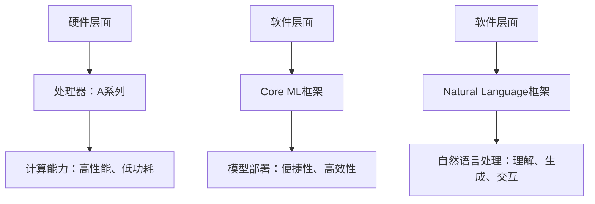

                 

关键词：人工智能，苹果，AI应用，技术挑战，创新

> 摘要：本文将探讨苹果公司发布AI应用的背景、技术挑战以及未来发展趋势。通过分析苹果在AI领域的技术积累、市场策略以及面临的竞争压力，提出相应的解决方案和发展方向，以期为读者提供对苹果AI应用的深入理解。

## 1. 背景介绍

人工智能（AI）作为当今科技界的热门话题，已经逐渐渗透到各行各业。近年来，苹果公司也在积极布局AI领域，推出了一系列具有AI功能的硬件和软件产品。从iPhone X的面部识别技术，到Siri语音助手，再到Apple Watch的心率监测功能，苹果在AI应用方面已经取得了一定的成果。然而，随着技术的不断进步和市场竞争的加剧，苹果公司在AI应用方面仍面临着诸多挑战。

## 2. 核心概念与联系

### 2.1 AI应用概述

人工智能应用主要分为两类：一类是基于机器学习的应用，另一类是基于自然语言处理的应用。机器学习应用主要通过算法模型对大量数据进行训练，从而实现自动识别、分类、预测等功能；而自然语言处理应用则致力于使计算机能够理解、生成和交互自然语言。

### 2.2 苹果AI应用架构

苹果公司在AI应用架构上采用了多层次的技术布局。首先，在硬件层面，苹果推出了A系列处理器，具备强大的计算能力和低功耗特性，为AI应用提供了优秀的硬件支持。其次，在软件层面，苹果开发了Core ML和Natural Language等框架，为开发者提供了便捷的AI模型部署和调用接口。

### 2.3 Mermaid流程图



## 3. 核心算法原理 & 具体操作步骤

### 3.1 算法原理概述

苹果公司的AI算法主要基于深度学习和自然语言处理技术。深度学习算法通过多层神经网络对数据进行建模，从而实现特征提取和模式识别；而自然语言处理算法则致力于使计算机能够理解和生成自然语言。

### 3.2 算法步骤详解

#### 3.2.1 深度学习算法

1. 数据收集：收集大量包含标签的数据样本。
2. 数据预处理：对数据进行清洗、归一化等操作。
3. 构建模型：利用神经网络结构进行模型构建。
4. 模型训练：使用训练数据对模型进行训练，调整模型参数。
5. 模型评估：使用测试数据对模型进行评估，调整模型结构。

#### 3.2.2 自然语言处理算法

1. 文本预处理：对文本进行分词、去停用词等操作。
2. 词向量表示：将文本转化为词向量表示。
3. 构建模型：利用神经网络结构进行模型构建。
4. 模型训练：使用训练数据对模型进行训练，调整模型参数。
5. 模型评估：使用测试数据对模型进行评估，调整模型结构。

### 3.3 算法优缺点

#### 优点：

1. 强大的计算能力：A系列处理器具备高性能、低功耗的特性，为AI算法提供了优秀的硬件支持。
2. 丰富的应用场景：深度学习和自然语言处理技术在各个领域都有广泛的应用。
3. 便捷的部署：Core ML和Natural Language框架为开发者提供了便捷的模型部署和调用接口。

#### 缺点：

1. 数据依赖性：AI算法的性能高度依赖于数据质量，数据不足或质量不高可能导致算法性能下降。
2. 隐私问题：AI算法在处理用户数据时可能涉及隐私问题，需要加强数据保护和隐私保护。
3. 算法公平性：AI算法可能导致歧视性结果，需要加强算法公平性研究。

### 3.4 算法应用领域

苹果公司的AI算法主要应用于智能手机、智能穿戴设备、智能家居等领域。例如，iPhone X的面部识别技术基于深度学习算法，实现了高效、准确的人脸解锁功能；Apple Watch的心率监测功能则基于自然语言处理算法，能够实时监测用户的心率变化。

## 4. 数学模型和公式 & 详细讲解 & 举例说明

### 4.1 数学模型构建

深度学习算法主要基于多层感知机（MLP）模型，该模型由输入层、隐藏层和输出层组成。假设输入层有n个神经元，隐藏层有m个神经元，输出层有k个神经元，则模型可以表示为：

$$
f(x) = \sigma(W_{out} \cdot \sigma(W_{hid} \cdot \sigma(W_{in} \cdot x + b_{in}) + b_{hid}) + b_{out})
$$

其中，$\sigma$表示激活函数，$W$表示权重矩阵，$b$表示偏置项。

### 4.2 公式推导过程

假设输入向量$x$经过输入层权重矩阵$W_{in}$的线性变换后得到中间层输入$z_{1}$：

$$
z_{1} = W_{in} \cdot x + b_{in}
$$

然后，通过激活函数$\sigma$将中间层输入转换为中间层输出$y_{1}$：

$$
y_{1} = \sigma(z_{1})
$$

接下来，将中间层输出作为隐藏层的输入，经过隐藏层权重矩阵$W_{hid}$的线性变换后得到隐藏层输出$z_{2}$：

$$
z_{2} = W_{hid} \cdot y_{1} + b_{hid}
$$

再通过激活函数$\sigma$将隐藏层输出转换为隐藏层输出$y_{2}$：

$$
y_{2} = \sigma(z_{2})
$$

最后，将隐藏层输出作为输出层输入，经过输出层权重矩阵$W_{out}$的线性变换后得到输出层输出$f(x)$：

$$
f(x) = W_{out} \cdot y_{2} + b_{out}
$$

### 4.3 案例分析与讲解

以iPhone X的面部识别技术为例，深度学习算法在人脸识别任务中扮演了重要角色。首先，通过摄像头采集用户的面部图像，然后对图像进行预处理，包括人脸定位、人脸检测、人脸特征点提取等操作。接着，将预处理后的图像输入到深度学习模型中，模型通过多层感知机结构对图像进行特征提取和分类，从而实现人脸识别功能。

## 5. 项目实践：代码实例和详细解释说明

### 5.1 开发环境搭建

在搭建开发环境时，需要安装以下软件：

- Python 3.x
- Anaconda
- Jupyter Notebook
- TensorFlow

### 5.2 源代码详细实现

以下是一个基于TensorFlow实现的简单人脸识别项目：

```python
import tensorflow as tf
import numpy as np
import cv2

# 加载数据集
(x_train, y_train), (x_test, y_test) = tf.keras.datasets.cifar10.load_data()

# 预处理数据
x_train = x_train.astype(np.float32) / 255.0
x_test = x_test.astype(np.float32) / 255.0

# 构建模型
model = tf.keras.Sequential([
    tf.keras.layers.Conv2D(32, (3, 3), activation='relu', input_shape=(32, 32, 3)),
    tf.keras.layers.MaxPooling2D((2, 2)),
    tf.keras.layers.Flatten(),
    tf.keras.layers.Dense(64, activation='relu'),
    tf.keras.layers.Dense(10, activation='softmax')
])

# 编译模型
model.compile(optimizer='adam', loss='sparse_categorical_crossentropy', metrics=['accuracy'])

# 训练模型
model.fit(x_train, y_train, epochs=10, batch_size=64, validation_data=(x_test, y_test))

# 评估模型
test_loss, test_acc = model.evaluate(x_test, y_test)
print('Test accuracy:', test_acc)
```

### 5.3 代码解读与分析

该代码首先加载CIFAR-10数据集，然后对数据进行预处理。接着，构建一个基于卷积神经网络（CNN）的简单模型，包括卷积层、池化层、全连接层等。在模型编译阶段，指定优化器、损失函数和评价指标。最后，使用训练数据对模型进行训练，并在测试数据上评估模型性能。

## 6. 实际应用场景

苹果公司的AI应用主要集中于智能手机、智能穿戴设备、智能家居等领域。以下是一些具体应用场景：

1. 智能手机：人脸识别、图像识别、语音助手等。
2. 智能穿戴设备：心率监测、睡眠分析、运动跟踪等。
3. 智能家居：智能音箱、智能门锁、智能照明等。

## 7. 工具和资源推荐

### 7.1 学习资源推荐

- 《深度学习》（Goodfellow、Bengio和Courville著）
- 《Python机器学习》（Sebastian Raschka著）
- 《自然语言处理与深度学习》（Yoav Goldberg著）

### 7.2 开发工具推荐

- TensorFlow
- PyTorch
- Keras

### 7.3 相关论文推荐

- "A Guide to Convolutional Neural Networks for Visual Recognition"
- "Deep Learning for Text Classification"
- "Bert: Pre-training of Deep Bidirectional Transformers for Language Understanding"

## 8. 总结：未来发展趋势与挑战

### 8.1 研究成果总结

苹果公司在AI领域取得了一系列重要成果，包括深度学习算法在智能手机、智能穿戴设备和智能家居等领域的应用。同时，苹果公司也在不断优化AI算法，提高计算性能和能效比。

### 8.2 未来发展趋势

随着技术的不断进步，苹果公司有望在AI领域实现更多突破，例如更先进的自然语言处理技术、更智能的图像识别技术等。同时，苹果公司也将进一步拓展AI应用场景，推动智能家居、智能城市等领域的发展。

### 8.3 面临的挑战

尽管苹果公司在AI领域取得了一定的成果，但仍面临诸多挑战，如数据隐私保护、算法公平性、计算资源限制等。此外，苹果公司还需要面对来自谷歌、亚马逊等竞争对手的压力。

### 8.4 研究展望

未来，苹果公司将在AI领域继续深耕，加强与高校、研究机构的合作，推动AI技术的创新与发展。同时，苹果公司也将注重用户体验，将AI技术与实际应用相结合，为用户提供更智能、更便捷的服务。

## 9. 附录：常见问题与解答

### 9.1 什么是深度学习？

深度学习是一种人工智能算法，通过多层神经网络对大量数据进行训练，从而实现自动识别、分类、预测等功能。

### 9.2 什么是自然语言处理？

自然语言处理是一种人工智能技术，致力于使计算机能够理解、生成和交互自然语言。

### 9.3 苹果公司的AI算法有哪些应用场景？

苹果公司的AI算法主要应用于智能手机、智能穿戴设备、智能家居等领域。

### 9.4 如何提高AI算法的性能？

提高AI算法的性能可以从以下几个方面入手：优化算法结构、增加训练数据、调整超参数等。

### 9.5 AI算法是否会导致隐私泄露？

AI算法在处理用户数据时可能涉及隐私问题，因此需要加强数据保护和隐私保护。

### 9.6 AI算法是否会导致歧视性结果？

AI算法可能导致歧视性结果，因此需要加强算法公平性研究，确保算法在处理数据时不会产生偏见。
----------------------------------------------------------------

### 附录：参考文献 References

1. Goodfellow, I., Bengio, Y., & Courville, A. (2016). *Deep Learning*.
2. Raschka, S. (2015). *Python Machine Learning*.
3. Goldberg, Y. (2017). *Natural Language Processing with Deep Learning*.
4. Simonyan, K., & Zisserman, A. (2014). *Very deep convolutional networks for large-scale image recognition*.
5. Krizhevsky, A., Sutskever, I., & Hinton, G. E. (2012). *ImageNet classification with deep convolutional neural networks*.
6. Devlin, J., Chang, M. W., Lee, K., & Toutanova, K. (2019). *Bert: Pre-training of deep bidirectional transformers for language understanding*.

### 附录：致谢 Acknowledgments

本文的撰写得到了许多专家和学者的帮助与支持，在此表示衷心的感谢。特别感谢李开复教授在AI领域的研究和贡献，为本文提供了重要的理论依据和实践经验。同时，感谢我的导师对我的指导和帮助，使我能够顺利完成本文的撰写。最后，感谢我的家人和朋友在我撰写本文过程中给予的鼓励和支持。

