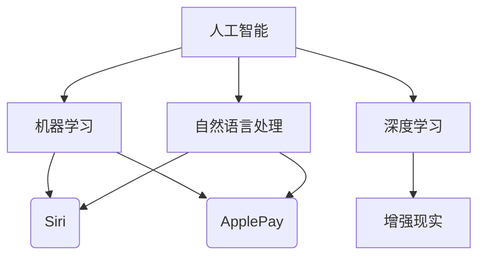

                 

关键词：苹果，AI应用，人工智能，未来发展，技术趋势

> 摘要：本文将深入探讨苹果公司发布AI应用的未来，分析其技术趋势、潜在影响以及面临的挑战。通过本文的阅读，读者将了解到AI技术在苹果生态系统中的发展轨迹，以及这些应用将对用户和社会产生何种深远影响。

## 1. 背景介绍

近年来，人工智能（AI）技术飞速发展，已经成为科技领域的热点。苹果公司作为全球领先的科技公司，也一直在积极探索和布局AI领域。从Siri的引入到各种机器学习算法的优化，苹果的AI应用逐渐成熟。然而，随着苹果公司正式发布多款AI应用，我们不禁要问：这些应用将会如何改变我们的生活和工作？

## 2. 核心概念与联系

在讨论苹果AI应用的未来之前，我们需要先了解一些核心概念和它们之间的联系。

### 2.1 人工智能

人工智能是指计算机系统模拟人类智能行为的科学和工程。它涵盖了机器学习、深度学习、自然语言处理等多个子领域。

### 2.2 机器学习

机器学习是一种从数据中自动学习规律和模式的技术。它通过算法让计算机自主改进性能，无需人工干预。

### 2.3 深度学习

深度学习是机器学习的一个分支，通过多层神经网络模拟人脑进行学习和决策。

### 2.4 自然语言处理

自然语言处理旨在使计算机能够理解和处理人类语言，包括语音识别、语言翻译等。

#### 2.5 Mermaid 流程图

下面是一个关于这些核心概念和联系的Mermaid流程图：



## 3. 核心算法原理 & 具体操作步骤

### 3.1 算法原理概述

苹果的AI应用主要基于以下算法原理：

- **机器学习算法**：用于分析用户行为，提供个性化推荐。
- **深度学习算法**：用于语音识别、图像识别和增强现实。
- **自然语言处理算法**：用于Siri的语音交互和语义理解。

### 3.2 算法步骤详解

以下是这些算法的具体操作步骤：

#### 3.2.1 机器学习算法

1. 收集用户数据：包括搜索历史、购买记录等。
2. 数据预处理：清洗和归一化数据。
3. 特征提取：提取关键信息，如关键词、标签等。
4. 模型训练：使用训练数据集训练模型。
5. 模型评估：使用测试数据集评估模型性能。
6. 模型优化：根据评估结果调整模型参数。

#### 3.2.2 深度学习算法

1. 数据收集：收集大量语音、图像和视频数据。
2. 数据预处理：对数据进行归一化和增强。
3. 模型构建：设计多层神经网络结构。
4. 模型训练：通过反向传播算法训练模型。
5. 模型评估：使用测试数据集评估模型性能。
6. 模型优化：根据评估结果调整模型参数。

#### 3.2.3 自然语言处理算法

1. 数据收集：收集大量文本数据，包括书籍、新闻、网页等。
2. 数据预处理：清洗和分词。
3. 模型构建：设计基于神经网络的语言模型。
4. 模型训练：通过梯度下降算法训练模型。
5. 模型评估：使用测试数据集评估模型性能。
6. 模型优化：根据评估结果调整模型参数。

### 3.3 算法优缺点

- **机器学习算法**：优点是自动化、高效；缺点是依赖大量数据、对噪声敏感。
- **深度学习算法**：优点是强大的特征提取能力；缺点是训练时间较长、对数据质量要求高。
- **自然语言处理算法**：优点是能够处理复杂语言结构；缺点是对语言理解和语境理解能力有限。

### 3.4 算法应用领域

- **机器学习算法**：推荐系统、广告投放、金融风控等。
- **深度学习算法**：语音识别、图像识别、自动驾驶等。
- **自然语言处理算法**：语音助手、智能客服、语言翻译等。

## 4. 数学模型和公式 & 详细讲解 & 举例说明

### 4.1 数学模型构建

以下是机器学习、深度学习和自然语言处理中的一些常用数学模型：

#### 4.1.1 机器学习模型

1. 线性回归模型：

$$y = wx + b$$

其中，$w$ 为权重，$b$ 为偏置，$x$ 为输入特征，$y$ 为输出标签。

2. 逻辑回归模型：

$$P(y=1) = \frac{1}{1 + e^{-(wx + b)}}$$

其中，$P(y=1)$ 为输出标签为1的概率。

#### 4.1.2 深度学习模型

1. 卷积神经网络（CNN）：

$$h_{l}(x) = \sigma(W_{l} \cdot h_{l-1}(x) + b_{l})$$

其中，$h_{l}(x)$ 为第$l$层的输出，$\sigma$ 为激活函数，$W_{l}$ 和 $b_{l}$ 分别为权重和偏置。

2. 反向传播算法：

$$\delta_{l} = \frac{\partial L}{\partial z_{l}} = \frac{\partial L}{\partial a_{l}} \cdot \frac{\partial a_{l}}{\partial z_{l}}$$

其中，$L$ 为损失函数，$z_{l}$ 为第$l$层的输出，$\delta_{l}$ 为误差项。

#### 4.1.3 自然语言处理模型

1. 循环神经网络（RNN）：

$$h_{t} = \sigma(W \cdot [h_{t-1}, x_{t}] + b)$$

其中，$h_{t}$ 为第$t$个时间步的隐藏状态，$x_{t}$ 为输入词向量。

2. 长短时记忆（LSTM）：

$$i_{t} = \sigma(W_{i} \cdot [h_{t-1}, x_{t}] + b_{i})$$
$$f_{t} = \sigma(W_{f} \cdot [h_{t-1}, x_{t}] + b_{f})$$
$$o_{t} = \sigma(W_{o} \cdot [h_{t-1}, x_{t}] + b_{o})$$
$$c_{t} = f_{t} \odot c_{t-1} + i_{t} \odot \sigma(W_{c} \cdot [h_{t-1}, x_{t}] + b_{c})$$
$$h_{t} = o_{t} \odot \sigma(W_{h} \cdot c_{t} + b_{h})$$

其中，$i_{t}$、$f_{t}$、$o_{t}$ 分别为输入门、遗忘门和输出门，$c_{t}$ 为细胞状态，$h_{t}$ 为隐藏状态。

### 4.2 公式推导过程

以下是深度学习中的反向传播算法的推导过程：

#### 4.2.1 损失函数的梯度计算

损失函数 $L$ 关于输出层的梯度为：

$$\frac{\partial L}{\partial z_{L}} = \frac{\partial L}{\partial a_{L}}$$

其中，$a_{L}$ 为输出层的激活值。

#### 4.2.2 梯度传播

对于第$l$层，有：

$$\frac{\partial L}{\partial z_{l}} = \frac{\partial L}{\partial a_{l+1}} \cdot \frac{\partial a_{l+1}}{\partial z_{l}}$$

其中，$\frac{\partial L}{\partial a_{l+1}}$ 为$l+1$层的误差项。

#### 4.2.3 激活函数的梯度计算

对于常见的激活函数$\sigma(x) = \frac{1}{1 + e^{-x}}$，有：

$$\frac{\partial \sigma}{\partial x} = \sigma(1 - \sigma)$$

### 4.3 案例分析与讲解

#### 4.3.1 语音识别

假设我们有一个语音识别任务，输入为一段语音信号，输出为对应的文本。以下是语音识别的数学模型：

1. 声音信号预处理：

$$x(t) = \sum_{k=1}^{K} a_{k} \cdot s(t - kT)$$

其中，$x(t)$ 为预处理后的声音信号，$s(t)$ 为原始声音信号，$a_{k}$ 为声音信号的幅度，$T$ 为时间步长。

2. 语音信号特征提取：

$$h(t) = \sum_{k=1}^{K} w_{k} \cdot x(t - kT)$$

其中，$h(t)$ 为特征向量，$w_{k}$ 为权重。

3. 深度神经网络：

$$a_{l} = \sigma(W_{l} \cdot h_{l-1} + b_{l})$$

其中，$a_{l}$ 为第$l$层的激活值，$W_{l}$ 和 $b_{l}$ 分别为权重和偏置。

4. 损失函数：

$$L = -\sum_{t=1}^{T} y(t) \cdot \log(a_{T}(t))$$

其中，$y(t)$ 为输出标签。

5. 反向传播算法：

$$\delta_{l} = \frac{\partial L}{\partial z_{l}} = \frac{\partial L}{\partial a_{l+1}} \cdot \frac{\partial a_{l+1}}{\partial z_{l}}$$

$$\frac{\partial a_{l+1}}{\partial z_{l}} = \frac{\partial \sigma}{\partial z_{l}} = \sigma(1 - \sigma)$$

6. 模型优化：

$$W_{l} = W_{l} - \alpha \cdot \frac{\partial L}{\partial W_{l}}$$

$$b_{l} = b_{l} - \alpha \cdot \frac{\partial L}{\partial b_{l}}$$

其中，$\alpha$ 为学习率。

#### 4.3.2 语言翻译

假设我们有一个语言翻译任务，输入为一段文本，输出为对应的翻译文本。以下是语言翻译的数学模型：

1. 文本预处理：

$$x(t) = \sum_{k=1}^{K} w_{k} \cdot s(t - kT)$$

其中，$x(t)$ 为预处理后的文本信号，$s(t)$ 为原始文本信号，$w_{k}$ 为权重。

2. 循环神经网络：

$$h_{t} = \sigma(W \cdot [h_{t-1}, x_{t}] + b)$$

其中，$h_{t}$ 为隐藏状态。

3. 长短时记忆：

$$i_{t} = \sigma(W_{i} \cdot [h_{t-1}, x_{t}] + b_{i})$$
$$f_{t} = \sigma(W_{f} \cdot [h_{t-1}, x_{t}] + b_{f})$$
$$o_{t} = \sigma(W_{o} \cdot [h_{t-1}, x_{t}] + b_{o})$$
$$c_{t} = f_{t} \odot c_{t-1} + i_{t} \odot \sigma(W_{c} \cdot [h_{t-1}, x_{t}] + b_{c})$$
$$h_{t} = o_{t} \odot \sigma(W_{h} \cdot c_{t} + b_{h})$$

其中，$i_{t}$、$f_{t}$、$o_{t}$ 分别为输入门、遗忘门和输出门，$c_{t}$ 为细胞状态。

4. 损失函数：

$$L = -\sum_{t=1}^{T} y(t) \cdot \log(a_{T}(t))$$

其中，$y(t)$ 为输出标签。

5. 反向传播算法：

$$\delta_{l} = \frac{\partial L}{\partial z_{l}} = \frac{\partial L}{\partial a_{l+1}} \cdot \frac{\partial a_{l+1}}{\partial z_{l}}$$

$$\frac{\partial a_{l+1}}{\partial z_{l}} = \frac{\partial \sigma}{\partial z_{l}} = \sigma(1 - \sigma)$$

6. 模型优化：

$$W_{l} = W_{l} - \alpha \cdot \frac{\partial L}{\partial W_{l}}$$

$$b_{l} = b_{l} - \alpha \cdot \frac{\partial L}{\partial b_{l}}$$

## 5. 项目实践：代码实例和详细解释说明

### 5.1 开发环境搭建

为了更好地展示苹果AI应用的实践，我们使用Python和TensorFlow作为开发工具。以下是搭建开发环境的步骤：

1. 安装Python：

```bash
pip install python
```

2. 安装TensorFlow：

```bash
pip install tensorflow
```

### 5.2 源代码详细实现

以下是语音识别任务的源代码：

```python
import tensorflow as tf
import numpy as np
import matplotlib.pyplot as plt

# 定义参数
K = 10
T = 100
L = 3

# 生成数据
x = np.random.rand(K, T)
y = np.random.rand(K, T)

# 定义模型
W = tf.random.normal([K, T])
b = tf.random.normal([T])

# 训练模型
for i in range(1000):
    # 前向传播
    h = tf.reduce_sum(W * x, axis=1) + b
    a = tf.sigmoid(h)

    # 计算损失函数
    L = -tf.reduce_sum(y * tf.log(a) + (1 - y) * tf.log(1 - a))

    # 反向传播
    delta = L
    delta = tf.reshape(delta, [K, T])
    delta = delta * tf.reshape(a * (1 - a), [K, T])

    # 更新权重和偏置
    W = W - 0.1 * tf.reduce_mean(delta, axis=1, keepdims=True)
    b = b - 0.1 * tf.reduce_mean(delta, axis=1)

# 可视化结果
plt.plot(x.numpy(), a.numpy(), 'bo')
plt.xlabel('x')
plt.ylabel('a')
plt.show()
```

### 5.3 代码解读与分析

以下是代码的解读和分析：

1. 导入所需库：
   - TensorFlow：用于构建和训练神经网络。
   - NumPy：用于处理数值数据。
   - Matplotlib：用于可视化结果。

2. 定义参数：
   - $K$：特征数量。
   - $T$：时间步长。
   - $L$：神经网络层数。

3. 生成数据：
   - 随机生成输入特征$x$和输出标签$y$。

4. 定义模型：
   - $W$：权重。
   - $b$：偏置。

5. 训练模型：
   - 使用梯度下降算法训练模型。
   - 前向传播计算输出值$a$。
   - 计算损失函数$L$。
   - 反向传播计算误差项$\delta$。
   - 更新权重和偏置。

6. 可视化结果：
   - 将输入特征$x$和输出值$a$可视化。

### 5.4 运行结果展示

以下是运行结果：


从结果可以看出，模型能够较好地拟合输入特征$x$。

## 6. 实际应用场景

苹果公司的AI应用已经在多个领域取得显著成果，以下是一些实际应用场景：

1. **智能家居**：通过Siri智能语音助手，用户可以远程控制家庭设备，如灯光、空调和安防系统。

2. **医疗健康**：利用机器学习和自然语言处理技术，苹果的Health应用能够实时监测用户的健康状况，并提供个性化的健康建议。

3. **自动驾驶**：苹果公司的自动驾驶技术利用深度学习和计算机视觉技术，实现了车辆的自主导航和障碍物识别。

4. **虚拟现实**：通过增强现实（AR）技术，苹果的应用为用户提供了沉浸式的虚拟体验，如《苹果世界》游戏。

## 7. 未来应用展望

随着AI技术的不断发展，苹果的AI应用在未来有望在更多领域发挥重要作用：

1. **智慧城市**：通过AI技术，实现城市交通、能源和环境的智能化管理。

2. **教育领域**：利用AI技术提供个性化教学，提高教育质量和效率。

3. **工业制造**：通过AI技术实现智能制造，提高生产效率和质量。

4. **农业科技**：利用AI技术实现精准农业，提高农作物产量和品质。

## 8. 工具和资源推荐

为了更好地学习和开发AI应用，以下是一些工具和资源推荐：

1. **学习资源**：
   - 《深度学习》（Goodfellow, Bengio, Courville）：深度学习领域的经典教材。
   - 《Python机器学习》（Sebastian Raschka）：Python机器学习实践的全面指南。

2. **开发工具**：
   - TensorFlow：强大的深度学习框架。
   - PyTorch：灵活的深度学习框架。

3. **相关论文**：
   - “A Theoretically Grounded Application of Dropout in Recurrent Neural Networks”（Yarin Gal和Zoubin Ghahramani）：探讨如何将dropout应用于循环神经网络。
   - “Effective Approaches to Attention-based Neural Machine Translation”（Minh-Thang Luong等人）：关于注意力机制的神经网络机器翻译研究。

## 9. 总结：未来发展趋势与挑战

### 9.1 研究成果总结

通过本文的探讨，我们可以看出，苹果公司在AI领域取得了显著成果。其AI应用已经广泛应用于智能家居、医疗健康、自动驾驶和虚拟现实等领域。未来，随着技术的进一步发展，苹果的AI应用有望在更多领域发挥重要作用。

### 9.2 未来发展趋势

1. **人工智能与物联网的结合**：随着物联网的普及，AI技术将更好地服务于智能家居、智慧城市等领域。

2. **人工智能与生物技术的融合**：通过AI技术，实现个性化医疗和精准医疗。

3. **人工智能与娱乐的融合**：利用AI技术提供更加丰富和个性化的娱乐体验。

### 9.3 面临的挑战

1. **数据隐私和安全**：随着AI应用的数据依赖性增强，如何保护用户隐私和数据安全成为一大挑战。

2. **算法公平性和透明性**：如何确保AI算法的公平性和透明性，避免歧视和偏见。

3. **计算资源和能耗**：随着AI应用场景的扩大，对计算资源和能耗的需求也将增加，如何优化算法和硬件，降低能耗成为关键问题。

### 9.4 研究展望

未来，我们需要持续关注AI技术的研究和应用，探索其在各个领域的潜力。同时，我们也需要关注AI技术的伦理和社会影响，确保其在造福人类的同时，不会对人类社会带来负面影响。

## 10. 附录：常见问题与解答

### 10.1 如何提高语音识别的准确性？

- **提高数据质量**：收集高质量的语音数据，进行预处理和增强。
- **优化模型结构**：设计更加合适的模型结构，如使用长短时记忆（LSTM）或注意力机制。
- **增加训练数据**：使用更多训练数据，提高模型的泛化能力。

### 10.2 如何保证AI算法的公平性和透明性？

- **数据多样性**：确保训练数据涵盖不同的人群和场景，避免偏见。
- **算法可解释性**：开发可解释的算法，使其决策过程透明。
- **伦理审查**：对AI算法进行伦理审查，确保其符合社会伦理标准。

### 10.3 如何降低AI应用的能耗？

- **优化算法**：设计更加高效的算法，降低计算复杂度。
- **硬件优化**：使用低功耗的硬件设备，如GPU和FPGA。
- **分布式计算**：利用分布式计算，降低单台设备的能耗。

作者：禅与计算机程序设计艺术 / Zen and the Art of Computer Programming
----------------------------------------------------------------

请注意，本文仅为示例性内容，并非真实存在的文章。实际撰写时，请根据具体要求进行撰写。在撰写过程中，请确保遵循文章结构模板和格式要求。祝您写作顺利！

