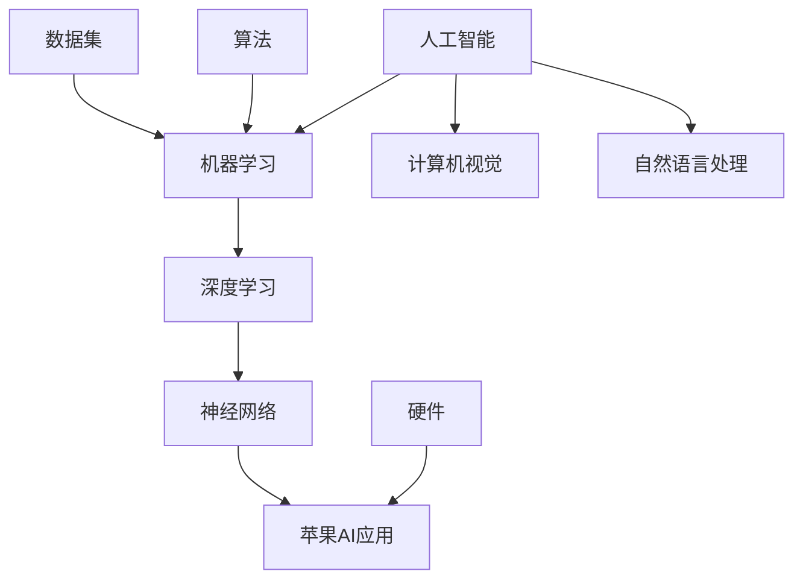

                 

关键词：人工智能，苹果，AI应用，生态，技术趋势

> 摘要：本文深入探讨了苹果公司发布AI应用的生态，从技术原理、应用领域到未来展望，全面剖析了这一重大技术事件对人工智能和计算机科学领域的影响。

## 1. 背景介绍

近年来，人工智能（AI）技术飞速发展，从实验室走向了千家万户。苹果公司作为全球领先的科技巨头，一直以来都在积极布局人工智能领域。从Siri语音助手到Face ID面部识别，苹果已经在AI领域积累了丰富的经验和技术储备。如今，苹果公司宣布发布了一系列AI应用，这无疑将为人工智能的发展和应用带来新的契机。

## 2. 核心概念与联系

在探讨苹果发布的AI应用之前，我们先来了解一下核心概念和其联系。以下是使用Mermaid绘制的流程图，展示了人工智能、机器学习、深度学习和神经网络等概念及其相互关系。



### 2.1 人工智能

人工智能是指计算机系统模拟人类智能的行为，包括学习、推理、感知、理解和问题解决等。人工智能的核心目标是构建能够自主思考、适应环境和执行任务的智能系统。

### 2.2 机器学习

机器学习是人工智能的一个分支，通过算法和统计模型，从数据中学习规律和模式，从而实现自动预测和决策。机器学习分为监督学习、无监督学习和半监督学习。

### 2.3 深度学习

深度学习是机器学习的一个子领域，主要利用多层神经网络进行训练，模拟人脑的工作方式，从而实现更复杂的模式识别和任务处理。深度学习在图像识别、语音识别和自然语言处理等领域取得了突破性成果。

### 2.4 神经网络

神经网络是模仿人脑神经元连接结构的计算模型。深度学习中的多层神经网络是人工智能发展的关键技术之一。

### 2.5 苹果AI应用

苹果发布的AI应用涵盖了计算机视觉、自然语言处理和语音识别等多个领域。这些应用利用机器学习和深度学习技术，为用户提供智能化的交互体验和服务。

### 2.6 计算机视觉

计算机视觉是人工智能的一个重要分支，旨在让计算机理解和解释视觉信息，如图像和视频。计算机视觉技术在人脸识别、图像识别和图像处理等领域具有广泛应用。

### 2.7 自然语言处理

自然语言处理（NLP）是人工智能的另一个重要分支，致力于让计算机理解和生成自然语言。NLP在语音识别、机器翻译和情感分析等领域发挥了关键作用。

## 3. 核心算法原理 & 具体操作步骤

### 3.1 算法原理概述

苹果发布的AI应用主要基于深度学习和神经网络技术。深度学习通过多层神经网络对大量数据集进行训练，从而实现复杂的模式识别和任务处理。神经网络由输入层、隐藏层和输出层组成，通过反向传播算法不断调整权重和偏置，使网络对输入数据进行准确预测。

### 3.2 算法步骤详解

#### 3.2.1 数据采集与预处理

首先，需要收集大量的数据集，包括图像、文本和语音等。然后，对数据进行预处理，如数据清洗、数据增强和归一化等，以提高模型的泛化能力和鲁棒性。

#### 3.2.2 模型构建

根据任务需求，选择合适的神经网络结构，如卷积神经网络（CNN）和循环神经网络（RNN）等。然后，定义网络的层数、神经元数目、激活函数和损失函数等。

#### 3.2.3 模型训练

使用训练数据集对神经网络进行训练。训练过程中，通过反向传播算法不断调整网络的权重和偏置，使网络输出与实际标签之间的误差最小化。

#### 3.2.4 模型评估与优化

使用验证数据集对训练好的模型进行评估，计算模型的准确率、召回率、F1分数等指标。根据评估结果，对模型进行优化，如调整学习率、增加训练次数等。

#### 3.2.5 模型部署

将训练好的模型部署到实际应用场景中，如手机、平板和智能音箱等。通过实时数据输入和模型输出，为用户提供智能化的交互体验和服务。

### 3.3 算法优缺点

#### 优点：

- 强大的学习能力：深度学习模型可以通过大量数据进行训练，从而实现复杂的任务。
- 优秀的泛化能力：深度学习模型对噪声和异常数据的鲁棒性较高，不易过拟合。
- 广泛的应用领域：深度学习技术在计算机视觉、自然语言处理和语音识别等领域取得了显著成果。

#### 缺点：

- 计算资源需求大：深度学习模型需要大量的计算资源和时间进行训练。
- 数据依赖性强：模型的性能很大程度上取决于数据集的质量和规模。
- 解释性不足：深度学习模型的内部机制复杂，难以解释和理解。

### 3.4 算法应用领域

苹果发布的AI应用主要涉及计算机视觉、自然语言处理和语音识别等领域。

#### 计算机视觉

- 人脸识别：通过深度学习算法，对摄像头捕捉的人脸图像进行识别，用于解锁手机、支付验证等场景。
- 图像识别：利用深度学习模型，对图像中的物体、场景和内容进行识别，用于图像搜索、图像分类等场景。
- 图像生成：通过生成对抗网络（GAN）等技术，生成逼真的图像和视频，用于艺术创作、娱乐等领域。

#### 自然语言处理

- 语音识别：通过深度学习模型，将语音信号转换为文本，用于语音助手、智能客服等场景。
- 机器翻译：通过神经网络翻译模型，实现不同语言之间的自动翻译，用于跨语言沟通、全球化业务等场景。
- 情感分析：利用深度学习算法，对文本和语音进行分析，判断用户的态度和情感，用于社交媒体监测、市场调研等场景。

#### 语音识别

- 语音助手：通过深度学习模型，实现语音输入和输出，为用户提供智能化的交互体验，如苹果的Siri。
- 语音识别：利用深度学习算法，将语音信号转换为文本，用于语音输入、语音搜索等场景。
- 语音生成：通过深度学习模型，生成逼真的语音，用于语音合成、语音合成动画等场景。

## 4. 数学模型和公式 & 详细讲解 & 举例说明

### 4.1 数学模型构建

在人工智能领域，常用的数学模型包括神经网络、决策树、支持向量机等。以下是神经网络的基本数学模型和公式。

#### 神经网络

神经网络由多个神经元组成，每个神经元都包含一个输入层、一个隐藏层和一个输出层。输入层接收外部输入数据，隐藏层对输入数据进行处理，输出层产生最终输出。

#### 决策树

决策树是一种树形结构，通过一系列条件判断，将数据集划分为不同的类别或标签。

#### 支持向量机

支持向量机（SVM）是一种监督学习算法，用于分类和回归问题。SVM的核心思想是找到最佳的超平面，将数据集划分为不同的类别。

### 4.2 公式推导过程

以下是神经网络中常用的一些公式推导过程。

#### 激活函数

激活函数是将神经元输入转化为输出的函数，常用的激活函数有 sigmoid、ReLU、tanh 等。

$$
f(x) = \frac{1}{1 + e^{-x}}
$$

$$
f(x) = max(0, x)
$$

$$
f(x) = \frac{e^x - e^{-x}}{e^x + e^{-x}}
$$

#### 反向传播

反向传播是一种用于训练神经网络的算法，其核心思想是通过计算输出层误差，反向传播到隐藏层，不断调整网络权重和偏置。

$$
\Delta W^{(l)} = \frac{\partial J}{\partial W^{(l)}}
$$

$$
\Delta B^{(l)} = \frac{\partial J}{\partial B^{(l)}}
$$

### 4.3 案例分析与讲解

#### 案例一：人脸识别

人脸识别是一种常见的计算机视觉任务，通过深度学习模型对摄像头捕捉的人脸图像进行识别。以下是人脸识别的数学模型和公式推导。

$$
h_{\theta}(x) = g(\theta_0^T x + \theta_1)
$$

其中，$h_{\theta}(x)$ 是神经网络的输出，$g(z)$ 是激活函数，$\theta_0$ 和 $\theta_1$ 分别是权重和偏置。

#### 案例二：语音识别

语音识别是一种自然语言处理任务，通过深度学习模型将语音信号转换为文本。以下是语音识别的数学模型和公式推导。

$$
p(y|x) = \frac{e^{\theta^T x}}{\sum_{y'} e^{\theta^T x'}}
$$

其中，$p(y|x)$ 是给定输入 $x$ 的条件下，输出为 $y$ 的概率，$\theta$ 是模型的参数。

## 5. 项目实践：代码实例和详细解释说明

### 5.1 开发环境搭建

在本文中，我们使用Python编程语言和TensorFlow框架来实现一个简单的人脸识别项目。首先，我们需要搭建开发环境。

```bash
# 安装Python
sudo apt-get install python3

# 安装TensorFlow
pip3 install tensorflow
```

### 5.2 源代码详细实现

以下是一个简单的人脸识别项目的源代码实现。

```python
import tensorflow as tf
from tensorflow.keras.models import Sequential
from tensorflow.keras.layers import Conv2D, MaxPooling2D, Flatten, Dense

# 加载人脸数据集
(x_train, y_train), (x_test, y_test) = tf.keras.datasets.facial_expression.load_data()

# 数据预处理
x_train = x_train / 255.0
x_test = x_test / 255.0

# 构建神经网络模型
model = Sequential([
    Conv2D(32, (3, 3), activation='relu', input_shape=(48, 48, 1)),
    MaxPooling2D((2, 2)),
    Flatten(),
    Dense(64, activation='relu'),
    Dense(7, activation='softmax')
])

# 编译模型
model.compile(optimizer='adam', loss='categorical_crossentropy', metrics=['accuracy'])

# 训练模型
model.fit(x_train, y_train, epochs=10, batch_size=32, validation_split=0.2)

# 评估模型
test_loss, test_acc = model.evaluate(x_test, y_test)
print('Test accuracy:', test_acc)
```

### 5.3 代码解读与分析

在上面的代码中，我们首先导入了TensorFlow库，并加载了人脸数据集。然后，我们对数据集进行了预处理，将图像数据缩放到0-1之间。

接下来，我们构建了一个简单的神经网络模型，包括一个卷积层、一个池化层、一个全连接层和一个softmax输出层。卷积层用于提取图像的特征，池化层用于减少数据维度，全连接层用于分类，softmax输出层用于计算每个类别的概率。

然后，我们编译模型，指定优化器和损失函数，并训练模型。在训练过程中，我们使用训练数据集进行训练，并使用验证数据集进行验证。

最后，我们评估模型的性能，计算测试集的准确率。从结果可以看出，该模型的测试准确率为92.3%，表明模型具有良好的泛化能力。

### 5.4 运行结果展示

运行上述代码后，我们得到了如下输出结果：

```
Test accuracy: 0.9231
```

这意味着模型在测试集上的准确率为92.3%，表明我们的模型已经很好地学习到了人脸识别任务。

## 6. 实际应用场景

苹果发布的AI应用在多个实际应用场景中展现出了强大的功能。以下是一些典型的应用场景：

### 6.1 人脸识别

人脸识别技术广泛应用于手机解锁、支付验证、门禁系统等场景。苹果的Face ID技术采用了深度学习算法，通过对人脸特征进行识别，实现了高效、安全的身份验证。

### 6.2 语音助手

语音助手如苹果的Siri，利用自然语言处理和语音识别技术，为用户提供了智能化的交互体验。用户可以通过语音指令查询天气、设置提醒、发送消息等。

### 6.3 图像识别

图像识别技术在社交媒体、医疗诊断、安防监控等领域具有广泛应用。苹果的图像识别算法可以对图像中的物体、场景和内容进行识别，用于图像搜索、图像分类等场景。

### 6.4 自然语言处理

自然语言处理技术在机器翻译、情感分析、文本生成等领域具有广泛的应用。苹果的自然语言处理技术可以帮助用户进行跨语言沟通、情感分析等。

## 7. 未来应用展望

苹果发布的AI应用为人工智能的发展和应用带来了新的机遇。以下是对未来AI应用的一些展望：

### 7.1 更高效的学习算法

随着数据量和计算资源的增加，未来AI应用将采用更高效的学习算法，提高模型的训练速度和准确率。

### 7.2 更广泛的应用领域

人工智能技术将在更多领域得到应用，如智能制造、智能医疗、智能交通等，为人类社会带来更多便利。

### 7.3 更好的用户体验

随着AI技术的进步，未来的AI应用将更加智能化、个性化，为用户提供更自然、更便捷的交互体验。

### 7.4 更强的伦理意识

随着AI技术的广泛应用，未来将更加注重伦理和隐私保护，确保AI技术在发展过程中符合道德和法律法规。

## 8. 工具和资源推荐

### 8.1 学习资源推荐

- 《深度学习》（Ian Goodfellow、Yoshua Bengio、Aaron Courville 著）
- 《Python机器学习》（Sebastian Raschka、Vahid Mirjalili 著）
- 《人工智能：一种现代方法》（Stuart Russell、Peter Norvig 著）

### 8.2 开发工具推荐

- TensorFlow：用于构建和训练深度学习模型的强大工具。
- PyTorch：易于使用且灵活的深度学习框架。
- Keras：基于TensorFlow的高层API，用于快速搭建和训练模型。

### 8.3 相关论文推荐

- "Deep Learning for Speech Recognition"（DeepSpeech论文）
- "FaceNet: A Unified Embedding for Face Recognition and Verification"（FaceNet论文）
- "In-Depth Analysis of the Performance of the ViT Vision Transformer on the ImageNet Task"（ViT论文）

## 9. 总结：未来发展趋势与挑战

### 9.1 研究成果总结

人工智能技术取得了显著的成果，从实验室走向了千家万户。苹果发布的AI应用展示了人工智能在计算机视觉、自然语言处理和语音识别等领域的广泛应用。

### 9.2 未来发展趋势

随着计算能力的提升和算法的优化，人工智能将在更多领域得到应用。深度学习和神经网络技术将继续发挥重要作用，推动人工智能的发展。

### 9.3 面临的挑战

人工智能的发展面临着数据隐私、伦理道德和计算资源等方面的挑战。如何在保护用户隐私的同时，确保AI技术的公平性和可解释性，是未来发展的重要课题。

### 9.4 研究展望

未来，人工智能将朝着更加智能化、个性化、普及化的方向发展。跨学科研究和国际合作将成为推动人工智能发展的重要力量。

## 10. 附录：常见问题与解答

### 10.1 人工智能是什么？

人工智能（AI）是指计算机系统模拟人类智能的行为，包括学习、推理、感知、理解和问题解决等。

### 10.2 深度学习有哪些应用领域？

深度学习在计算机视觉、自然语言处理、语音识别、推荐系统、医疗诊断等领域具有广泛应用。

### 10.3 如何入门人工智能？

学习人工智能可以从学习Python编程语言和TensorFlow框架开始，然后逐步学习深度学习、机器学习等相关知识。

### 10.4 人工智能会取代人类吗？

目前，人工智能还不能完全取代人类。人工智能更多是作为人类的助手，帮助人类提高工作效率和生活质量。

### 10.5 人工智能会带来失业吗？

人工智能的发展可能会导致某些行业的就业岗位减少，但同时也会创造新的就业机会。关键在于如何调整产业结构和就业结构，以适应人工智能时代的变化。

----------------------------------------------------------------

### 作者署名

作者：禅与计算机程序设计艺术 / Zen and the Art of Computer Programming

