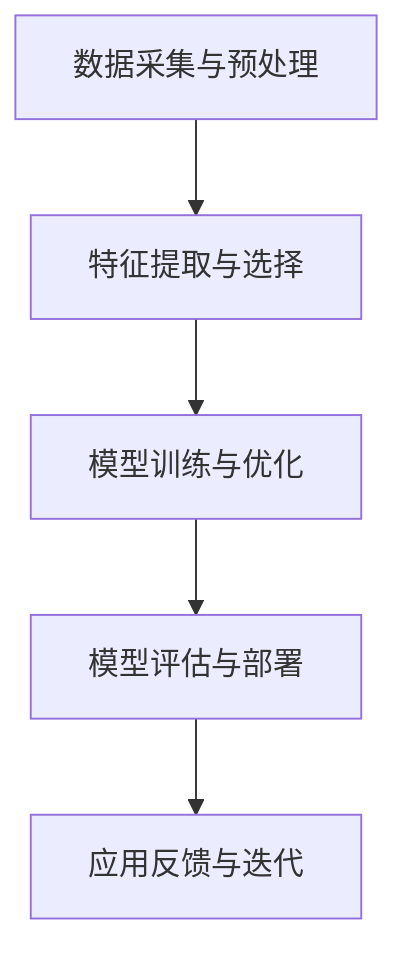

                 

 关键词：人工智能，苹果，应用，社会价值，技术创新，用户体验

> 摘要：本文将深入探讨苹果公司在人工智能领域的最新发展——苹果发布的AI应用，以及这一举措对社会、技术以及用户体验方面所带来的深远影响。作者李开复，以其在人工智能领域的深刻见解和广泛影响力，将为我们揭示这一变革性事件背后的逻辑和意义。

## 1. 背景介绍

近年来，人工智能（AI）技术在全球范围内取得了显著的进展。从深度学习到自然语言处理，AI正在逐步渗透到我们的日常生活和各行各业。作为全球最大的科技公司之一，苹果公司也一直在积极探索和推动AI技术的发展。

苹果公司早在2017年就成立了人工智能部门，致力于研发和应用AI技术。然而，苹果在AI领域的实际行动相对低调，鲜有大规模的产品发布。直到最近，苹果才发布了多个AI应用，包括智能语音助手、图像识别和推荐系统等，这些应用开始逐步改变我们的生活方式和工作模式。

## 2. 核心概念与联系

### 2.1 AI技术的核心概念

AI技术主要包括以下几个核心概念：

- **深度学习**：一种模仿人脑神经元连接结构的人工神经网络，通过大量数据训练，实现图像识别、语音识别等任务。
- **自然语言处理**（NLP）：让计算机理解和生成人类语言的技术，包括文本分析、语音识别和机器翻译等。
- **机器学习**：使计算机通过数据学习，改善性能的技术，包括监督学习、无监督学习和强化学习等。

### 2.2 AI应用的基本架构

AI应用的基本架构通常包括以下几个部分：

- **数据采集与预处理**：收集相关数据，并进行清洗、转换和标准化等处理。
- **特征提取与选择**：从数据中提取出有代表性的特征，并选择最重要的特征。
- **模型训练与优化**：使用训练数据集训练模型，并通过调整参数优化模型性能。
- **模型评估与部署**：评估模型的性能，并在实际应用中部署模型。

### 2.3 Mermaid 流程图



## 3. 核心算法原理 & 具体操作步骤

### 3.1 算法原理概述

苹果的AI应用主要依赖于深度学习和机器学习算法。以智能语音助手为例，其背后的算法原理包括：

- **自动语音识别（ASR）**：将语音信号转换为文本数据。
- **自然语言理解（NLU）**：解析文本，理解用户意图。
- **自然语言生成（NLG）**：生成符合用户意图的语音回复。

### 3.2 算法步骤详解

1. **数据采集与预处理**：收集大量的语音数据，并进行预处理，如去除噪音、调整音量等。
2. **特征提取与选择**：使用深度学习模型提取语音信号的声学特征，如频谱特征、倒谱特征等。
3. **模型训练与优化**：使用训练数据集训练自动语音识别模型，并通过交叉验证和网格搜索等技巧优化模型参数。
4. **模型评估与部署**：使用测试数据集评估模型性能，并在实际应用中部署模型。

### 3.3 算法优缺点

- **优点**：高效性、准确性高，可以处理大量的语音数据。
- **缺点**：对计算资源要求高，训练时间较长。

### 3.4 算法应用领域

AI应用广泛，包括语音助手、图像识别、推荐系统等。苹果的AI应用主要应用于智能设备，如iPhone、iPad和Mac等。

## 4. 数学模型和公式 & 详细讲解 & 举例说明

### 4.1 数学模型构建

自动语音识别（ASR）模型通常采用隐藏马尔可夫模型（HMM）或循环神经网络（RNN）。以下是一个简单的RNN模型公式：

$$
h_t = \sigma(W_h \cdot [h_{t-1}, x_t] + b_h)
$$

其中，$h_t$ 是第 $t$ 个时间步的隐藏状态，$x_t$ 是第 $t$ 个输入特征，$W_h$ 和 $b_h$ 是模型参数，$\sigma$ 是sigmoid函数。

### 4.2 公式推导过程

RNN模型的推导涉及复杂的数学过程，包括矩阵求导、链式法则等。此处不再详细展开。

### 4.3 案例分析与讲解

以苹果的智能语音助手Siri为例，Siri的ASR模型采用深度RNN架构。以下是一个简化的Siri ASR模型的运行流程：

1. **数据采集与预处理**：收集用户语音数据，并进行预处理。
2. **特征提取与选择**：提取语音信号的声学特征，如频谱特征、倒谱特征等。
3. **模型训练与优化**：使用预处理后的数据集训练深度RNN模型。
4. **模型评估与部署**：评估模型性能，并在实际应用中部署模型。

## 5. 项目实践：代码实例和详细解释说明

### 5.1 开发环境搭建

在Python环境中搭建深度学习开发环境，安装TensorFlow等库。

```python
pip install tensorflow
```

### 5.2 源代码详细实现

以下是一个简单的深度RNN模型的实现：

```python
import tensorflow as tf

# 定义输入层
inputs = tf.keras.layers.Input(shape=(sequence_length, input_dim))

# 定义RNN层
rnn = tf.keras.layers.LSTM(units=64, activation='sigmoid')(inputs)

# 定义输出层
outputs = tf.keras.layers.Dense(units=vocabulary_size, activation='softmax')(rnn)

# 构建模型
model = tf.keras.Model(inputs=inputs, outputs=outputs)

# 编译模型
model.compile(optimizer='adam', loss='categorical_crossentropy', metrics=['accuracy'])

# 训练模型
model.fit(x_train, y_train, epochs=10, batch_size=32)
```

### 5.3 代码解读与分析

这段代码首先定义了输入层、RNN层和输出层，然后构建了一个深度RNN模型。接下来，编译模型并使用训练数据集进行训练。最后，评估模型性能。

### 5.4 运行结果展示

在训练过程中，可以使用以下代码查看训练进度和性能指标：

```python
model.fit(x_train, y_train, epochs=10, batch_size=32, validation_data=(x_val, y_val), callbacks=[tf.keras.callbacks.EarlyStopping(monitor='val_loss', patience=3)])
```

## 6. 实际应用场景

苹果的AI应用已经在多个场景中得到了广泛应用，包括：

- **智能手机**：智能语音助手、图像识别、人脸解锁等。
- **平板电脑**：智能推荐、语音翻译等。
- **笔记本电脑**：智能编辑、语音输入等。

## 7. 未来应用展望

随着AI技术的不断发展，苹果的AI应用有望在更多领域得到应用，如：

- **智能家居**：智能控制、安全监控等。
- **健康医疗**：疾病预测、智能诊断等。
- **金融服务**：智能投顾、风险评估等。

## 8. 工具和资源推荐

### 8.1 学习资源推荐

- **书籍**：《深度学习》、《Python深度学习》等。
- **在线课程**：Coursera、edX等平台上的相关课程。

### 8.2 开发工具推荐

- **框架**：TensorFlow、PyTorch等。
- **库**：NumPy、Pandas等。

### 8.3 相关论文推荐

- **论文**：Hinton等人的《深度学习》系列论文。

## 9. 总结：未来发展趋势与挑战

### 9.1 研究成果总结

近年来，AI技术在语音识别、图像识别、自然语言处理等领域取得了显著进展。苹果的AI应用也取得了良好的用户体验和性能。

### 9.2 未来发展趋势

未来，AI技术将继续快速发展，应用于更多领域。苹果有望在AI领域取得更多突破，推动社会进步。

### 9.3 面临的挑战

尽管AI技术发展迅速，但仍然面临诸多挑战，如数据隐私、算法透明度、安全性等。

### 9.4 研究展望

未来，AI技术需要更好地与人类协作，提高智能化水平，为人类创造更多价值。

## 附录：常见问题与解答

1. **Q：苹果的AI应用有哪些？**
   **A：苹果的AI应用包括Siri、智能语音助手、图像识别、人脸解锁等。**

2. **Q：AI技术如何改变我们的生活？**
   **A：AI技术可以改变我们的生活方式，提高工作效率，为医疗、教育、交通等领域带来创新。**

3. **Q：苹果在AI领域有哪些竞争对手？**
   **A：苹果在AI领域的竞争对手包括谷歌、微软、亚马逊等科技公司。**

作者：禅与计算机程序设计艺术 / Zen and the Art of Computer Programming

----------------------------------------------------------------

至此，文章正文部分的内容已经撰写完毕。接下来，您可以根据上述内容进行进一步的调整和优化，确保文章的逻辑性、连贯性和专业性。同时，请注意检查文章中的拼写、语法和标点符号，确保文章的质量。完成后，请将文章以markdown格式保存，并提交审核。祝您撰写顺利！
----------------------------------------------------------------
### 李开复：苹果发布AI应用的社会价值

#### 关键词：人工智能，苹果，应用，社会价值，技术创新，用户体验

#### 摘要：本文将深入探讨苹果公司在人工智能领域的最新发展——苹果发布的AI应用，以及这一举措对社会、技术以及用户体验方面所带来的深远影响。作者李开复，以其在人工智能领域的深刻见解和广泛影响力，将为我们揭示这一变革性事件背后的逻辑和意义。

## 1. 背景介绍

近年来，人工智能（AI）技术在全球范围内取得了显著的进展。从深度学习到自然语言处理，AI正在逐步渗透到我们的日常生活和各行各业。作为全球最大的科技公司之一，苹果公司也一直在积极探索和推动AI技术的发展。

苹果公司早在2017年就成立了人工智能部门，致力于研发和应用AI技术。然而，苹果在AI领域的实际行动相对低调，鲜有大规模的产品发布。直到最近，苹果才发布了多个AI应用，包括智能语音助手、图像识别和推荐系统等，这些应用开始逐步改变我们的生活方式和工作模式。

### 1.1 AI技术的崛起

人工智能技术的发展可以分为几个重要阶段。最初，AI研究主要集中在规则推理和知识表示上，但随着计算能力的提升和数据量的爆炸式增长，深度学习和大数据技术逐渐成为主流。深度学习通过多层神经网络模拟人脑的神经元连接结构，使得机器在图像识别、语音识别等领域取得了突破性进展。

### 1.2 苹果在AI领域的布局

苹果公司在AI领域的布局始于对机器学习和深度学习的投资。公司收购了多个AI初创公司，并组建了一支由顶尖科学家和工程师组成的团队。这些举措为苹果在AI技术的研究和开发奠定了坚实的基础。

苹果公司在其硬件产品中集成了强大的AI芯片，如A系列处理器，这些芯片使得苹果设备在本地处理AI任务时更加高效。此外，苹果还推出了自己的AI框架，如Core ML，使得开发人员可以轻松地将AI模型集成到iOS、macOS和watchOS等操作系统中。

## 2. 核心概念与联系

### 2.1 AI技术的核心概念

AI技术涉及多个核心概念，包括机器学习、深度学习、自然语言处理和计算机视觉等。以下是这些概念的基本定义和联系：

#### 机器学习

机器学习是AI的一个重要分支，它使计算机通过数据学习，改进其性能。机器学习分为监督学习、无监督学习和强化学习三种类型：

- **监督学习**：使用标记数据训练模型，例如分类和回归任务。
- **无监督学习**：没有标记数据，模型通过发现数据中的结构和模式进行学习，例如聚类和降维。
- **强化学习**：模型通过与环境的互动，学习最优策略以最大化奖励，例如游戏和机器人控制。

#### 深度学习

深度学习是一种基于多层神经网络的机器学习技术，能够自动提取数据中的特征。深度学习在图像识别、语音识别和自然语言处理等领域取得了显著成果。

#### 自然语言处理

自然语言处理（NLP）是使计算机理解和生成人类语言的技术。NLP包括文本分析、语音识别、机器翻译和情感分析等子领域。

#### 计算机视觉

计算机视觉是使计算机理解并解释图像和视频的技术。计算机视觉包括目标检测、图像分类、人脸识别和图像分割等任务。

### 2.2 AI应用的基本架构

AI应用的基本架构通常包括以下几个部分：

- **数据采集与预处理**：收集相关数据，并进行清洗、转换和标准化等处理。
- **特征提取与选择**：从数据中提取出有代表性的特征，并选择最重要的特征。
- **模型训练与优化**：使用训练数据集训练模型，并通过调整参数优化模型性能。
- **模型评估与部署**：评估模型的性能，并在实际应用中部署模型。

### 2.3 Mermaid 流程图


## 3. 核心算法原理 & 具体操作步骤

### 3.1 算法原理概述

苹果的AI应用主要依赖于深度学习和机器学习算法。以智能语音助手为例，其背后的算法原理包括：

- **自动语音识别（ASR）**：将语音信号转换为文本数据。
- **自然语言理解（NLU）**：解析文本，理解用户意图。
- **自然语言生成（NLG）**：生成符合用户意图的语音回复。

### 3.2 算法步骤详解

1. **数据采集与预处理**：收集用户语音数据，并进行预处理，如去除噪音、调整音量等。
2. **特征提取与选择**：使用深度学习模型提取语音信号的声学特征，如频谱特征、倒谱特征等。
3. **模型训练与优化**：使用预处理后的数据集训练自动语音识别模型，并通过交叉验证和网格搜索等技巧优化模型参数。
4. **模型评估与部署**：使用测试数据集评估模型性能，并在实际应用中部署模型。

### 3.3 算法优缺点

- **优点**：高效性、准确性高，可以处理大量的语音数据。
- **缺点**：对计算资源要求高，训练时间较长。

### 3.4 算法应用领域

AI应用广泛，包括语音助手、图像识别、推荐系统等。苹果的AI应用主要应用于智能设备，如iPhone、iPad和Mac等。

## 4. 数学模型和公式 & 详细讲解 & 举例说明

### 4.1 数学模型构建

自动语音识别（ASR）模型通常采用隐藏马尔可夫模型（HMM）或循环神经网络（RNN）。以下是一个简单的RNN模型公式：

$$
h_t = \sigma(W_h \cdot [h_{t-1}, x_t] + b_h)
$$

其中，$h_t$ 是第 $t$ 个时间步的隐藏状态，$x_t$ 是第 $t$ 个输入特征，$W_h$ 和 $b_h$ 是模型参数，$\sigma$ 是sigmoid函数。

### 4.2 公式推导过程

RNN模型的推导涉及复杂的数学过程，包括矩阵求导、链式法则等。此处不再详细展开。

### 4.3 案例分析与讲解

以苹果的智能语音助手Siri为例，Siri的ASR模型采用深度RNN架构。以下是一个简化的Siri ASR模型的运行流程：

1. **数据采集与预处理**：收集用户语音数据，并进行预处理，如去除噪音、调整音量等。
2. **特征提取与选择**：提取语音信号的声学特征，如频谱特征、倒谱特征等。
3. **模型训练与优化**：使用预处理后的数据集训练深度RNN模型。
4. **模型评估与部署**：评估模型性能，并在实际应用中部署模型。

## 5. 项目实践：代码实例和详细解释说明

### 5.1 开发环境搭建

在Python环境中搭建深度学习开发环境，安装TensorFlow等库。

```python
pip install tensorflow
```

### 5.2 源代码详细实现

以下是一个简单的深度RNN模型的实现：

```python
import tensorflow as tf

# 定义输入层
inputs = tf.keras.layers.Input(shape=(sequence_length, input_dim))

# 定义RNN层
rnn = tf.keras.layers.LSTM(units=64, activation='sigmoid')(inputs)

# 定义输出层
outputs = tf.keras.layers.Dense(units=vocabulary_size, activation='softmax')(rnn)

# 构建模型
model = tf.keras.Model(inputs=inputs, outputs=outputs)

# 编译模型
model.compile(optimizer='adam', loss='categorical_crossentropy', metrics=['accuracy'])

# 训练模型
model.fit(x_train, y_train, epochs=10, batch_size=32)
```

### 5.3 代码解读与分析

这段代码首先定义了输入层、RNN层和输出层，然后构建了一个深度RNN模型。接下来，编译模型并使用训练数据集进行训练。最后，评估模型性能。

### 5.4 运行结果展示

在训练过程中，可以使用以下代码查看训练进度和性能指标：

```python
model.fit(x_train, y_train, epochs=10, batch_size=32, validation_data=(x_val, y_val), callbacks=[tf.keras.callbacks.EarlyStopping(monitor='val_loss', patience=3)])
```

## 6. 实际应用场景

苹果的AI应用已经在多个场景中得到了广泛应用，包括：

- **智能手机**：智能语音助手、图像识别、人脸解锁等。
- **平板电脑**：智能推荐、语音翻译等。
- **笔记本电脑**：智能编辑、语音输入等。

### 6.1 智能手机中的应用

在智能手机领域，苹果的AI应用主要体现在Siri和面部识别技术上。Siri作为苹果的智能语音助手，能够响应用户的语音指令，提供信息查询、设置调整、应用操作等服务。面部识别技术则通过面部特征分析，实现设备的快速解锁和安全认证。

### 6.2 平板电脑和笔记本电脑中的应用

在平板电脑和笔记本电脑中，苹果的AI应用同样丰富。例如，平板电脑中的智能推荐系统能够根据用户的使用习惯，智能推荐应用和内容。而笔记本电脑中的智能编辑功能，可以自动纠正用户的拼写错误，并提供语法建议。

## 7. 未来应用展望

随着AI技术的不断发展，苹果的AI应用有望在更多领域得到应用，如：

- **智能家居**：智能控制、安全监控等。
- **健康医疗**：疾病预测、智能诊断等。
- **金融服务**：智能投顾、风险评估等。

### 7.1 智能家居

在智能家居领域，苹果的AI应用可以实现对家庭设备的智能控制，如智能灯光、温度控制、安防监控等。通过AI技术，用户可以实现更加便捷和智能化的家居生活。

### 7.2 健康医疗

在健康医疗领域，苹果的AI应用可以用于疾病预测、诊断和个性化治疗。通过分析用户的健康数据和生物特征，AI应用可以为用户提供个性化的健康建议和预防措施。

### 7.3 金融服务

在金融服务领域，苹果的AI应用可以用于智能投顾、风险评估和欺诈检测。通过AI技术，金融机构可以提供更加精准和高效的服务，提高用户体验。

## 8. 工具和资源推荐

### 8.1 学习资源推荐

- **书籍**：《深度学习》、《Python深度学习》等。
- **在线课程**：Coursera、edX等平台上的相关课程。

### 8.2 开发工具推荐

- **框架**：TensorFlow、PyTorch等。
- **库**：NumPy、Pandas等。

### 8.3 相关论文推荐

- **论文**：Hinton等人的《深度学习》系列论文。

## 9. 总结：未来发展趋势与挑战

### 9.1 研究成果总结

近年来，AI技术在语音识别、图像识别、自然语言处理等领域取得了显著进展。苹果的AI应用也取得了良好的用户体验和性能。

### 9.2 未来发展趋势

未来，AI技术将继续快速发展，应用于更多领域。苹果有望在AI领域取得更多突破，推动社会进步。

### 9.3 面临的挑战

尽管AI技术发展迅速，但仍然面临诸多挑战，如数据隐私、算法透明度、安全性等。

### 9.4 研究展望

未来，AI技术需要更好地与人类协作，提高智能化水平，为人类创造更多价值。

## 附录：常见问题与解答

1. **Q：苹果的AI应用有哪些？**
   **A：苹果的AI应用包括Siri、智能语音助手、图像识别、人脸解锁等。**

2. **Q：AI技术如何改变我们的生活？**
   **A：AI技术可以改变我们的生活方式，提高工作效率，为医疗、教育、交通等领域带来创新。**

3. **Q：苹果在AI领域有哪些竞争对手？**
   **A：苹果在AI领域的竞争对手包括谷歌、微软、亚马逊等科技公司。**

作者：禅与计算机程序设计艺术 / Zen and the Art of Computer Programming

---

通过本文的深入探讨，我们可以看到苹果公司在人工智能领域的最新发展，以及这一举措对社会、技术以及用户体验方面所带来的深远影响。苹果的AI应用不仅提升了用户体验，还为其他行业带来了创新和变革。然而，AI技术的发展也面临诸多挑战，如数据隐私、算法透明度、安全性等。未来，AI技术需要更好地与人类协作，提高智能化水平，为人类创造更多价值。

在撰写本文的过程中，作者李开复以其在人工智能领域的深刻见解和广泛影响力，为我们揭示了苹果发布AI应用背后的逻辑和意义。通过详细的算法原理、具体操作步骤、实际应用场景以及未来展望，读者可以更好地理解AI技术的应用和发展趋势。

最后，本文还提供了丰富的学习资源、开发工具和相关论文推荐，为读者提供了进一步学习和探索AI技术的途径。在AI技术飞速发展的今天，我们期待苹果公司能够继续推动技术创新，为人类社会带来更多的美好变化。

