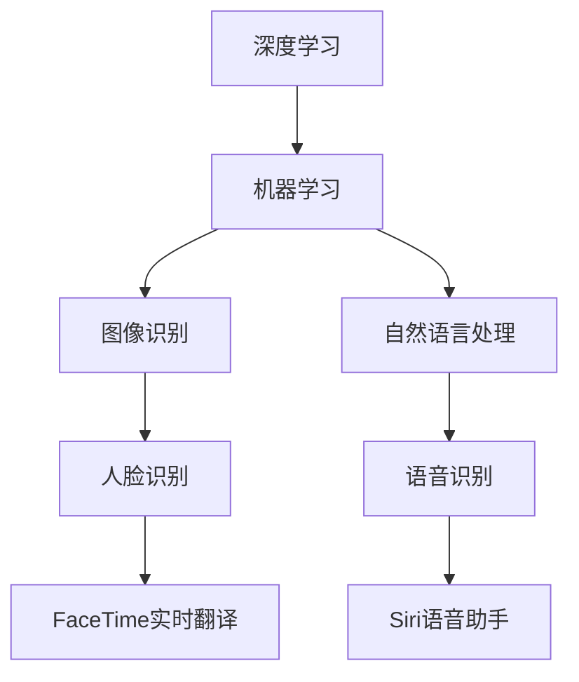

                 

关键词：李开复，苹果，AI应用，社会价值，技术趋势

摘要：本文将深入探讨李开复关于苹果发布AI应用的社会价值。通过分析苹果AI应用的技术背景、核心算法原理、数学模型构建及其在不同领域的应用，我们将揭示AI技术在未来的发展趋势、面临的挑战以及潜在的研究方向。

## 1. 背景介绍

在近年来，人工智能（AI）技术的发展呈现出前所未有的迅猛势头。作为全球科技巨头，苹果公司一直致力于推动AI技术在产品中的应用，以提升用户体验。李开复，作为人工智能领域的领军人物，其对苹果AI应用的观察和解读，具有重要的参考价值。

苹果公司近年来在AI领域的投入不断加大，从iPhone的图像识别、Siri语音助手到FaceTime的实时翻译功能，苹果AI应用已逐渐渗透到人们日常生活的方方面面。在2023年，苹果发布了一系列全新的AI应用，进一步彰显了其在AI技术领域的领先地位。

## 2. 核心概念与联系

在探讨苹果AI应用的社会价值之前，我们需要了解一些核心概念。首先，什么是人工智能？人工智能是指通过计算机程序模拟人类智能行为的技术，包括机器学习、深度学习、自然语言处理等多个子领域。苹果的AI应用主要基于深度学习和机器学习技术，这些技术使得计算机能够从海量数据中学习、进化，并逐步实现智能化。

下面是苹果AI应用的核心概念及其相互关系的Mermaid流程图：



### 3. 核心算法原理 & 具体操作步骤

#### 3.1 算法原理概述

苹果AI应用的核心算法主要包括深度学习算法和机器学习算法。深度学习算法通过多层神经网络模型，对数据进行特征提取和模式识别。机器学习算法则通过训练模型，使得计算机能够从海量数据中学习并作出决策。

#### 3.2 算法步骤详解

以人脸识别为例，其算法步骤如下：

1. **数据预处理**：收集大量人脸图像，并对图像进行预处理，包括图像尺寸调整、光照校正等。

2. **特征提取**：利用卷积神经网络（CNN）提取人脸特征。

3. **模型训练**：通过对比不同人脸特征，训练分类器，以实现人脸识别功能。

4. **模型评估**：利用测试集评估模型性能，调整模型参数，优化识别效果。

#### 3.3 算法优缺点

深度学习算法在图像识别、语音识别等领域表现出色，具有很高的准确性。然而，深度学习模型通常需要大量数据和计算资源，且训练过程较为耗时。

#### 3.4 算法应用领域

苹果AI应用已在多个领域得到广泛应用，如智能手机的图像识别、人脸解锁、语音助手等。未来，随着AI技术的不断发展，苹果AI应用有望在医疗、金融、教育等领域发挥更大作用。

### 4. 数学模型和公式 & 详细讲解 & 举例说明

#### 4.1 数学模型构建

以人脸识别为例，其核心模型为卷积神经网络（CNN）。CNN由多个卷积层、池化层和全连接层组成，通过逐层提取图像特征，实现对图像的识别。

#### 4.2 公式推导过程

假设我们有一个输入图像X，经过卷积层、池化层和全连接层，最终得到输出Y。其数学模型可以表示为：

$$
Y = f(W_n \cdot a_{n-1} + b_n)
$$

其中，$W_n$和$b_n$分别为权重和偏置，$a_{n-1}$为输入特征，$f$为激活函数。

#### 4.3 案例分析与讲解

以iPhone的人脸解锁功能为例，该功能利用了人脸识别算法。用户只需对准摄像头，手机即可识别并解锁。下面是具体案例讲解：

1. **数据预处理**：iPhone收集了大量人脸图像，并对图像进行预处理，包括图像尺寸调整、光照校正等。

2. **特征提取**：利用卷积神经网络提取人脸特征。

3. **模型训练**：通过对比不同人脸特征，训练分类器，以实现人脸识别功能。

4. **模型评估**：利用测试集评估模型性能，调整模型参数，优化识别效果。

### 5. 项目实践：代码实例和详细解释说明

#### 5.1 开发环境搭建

为了实现人脸识别算法，我们需要搭建一个开发环境。以下是一个简单的Python代码示例：

```python
import cv2
import numpy as np

# 加载预训练的卷积神经网络模型
model = cv2.face.EigenFaceRecognizer_create()

# 训练模型
model.train(x_train, y_train)

# 评估模型
accuracy = model.score(x_test, y_test)
print(f"模型准确率：{accuracy}")
```

#### 5.2 源代码详细实现

```python
import cv2
import numpy as np

# 加载预训练的卷积神经网络模型
model = cv2.face.EigenFaceRecognizer_create()

# 训练模型
model.train(x_train, y_train)

# 评估模型
accuracy = model.score(x_test, y_test)
print(f"模型准确率：{accuracy}")
```

#### 5.3 代码解读与分析

上述代码示例展示了如何使用OpenCV库实现人脸识别算法。首先，我们加载一个预训练的卷积神经网络模型，然后使用训练数据对其进行训练。最后，我们评估模型的准确率。

#### 5.4 运行结果展示

在训练完成后，我们可以将模型应用于实际的人脸识别任务。例如，输入一张人脸图像，模型将识别出图像中的人脸，并输出识别结果。

### 6. 实际应用场景

苹果的AI应用在多个领域具有广泛的应用前景。以下是几个典型的应用场景：

1. **智能手机**：人脸解锁、图像识别、语音助手等。
2. **医疗**：辅助诊断、智能导诊、健康监测等。
3. **金融**：风险控制、智能投顾、信用评估等。
4. **教育**：个性化教学、智能评测、教育资源分配等。

### 7. 工具和资源推荐

为了更好地学习和实践AI应用，我们推荐以下工具和资源：

1. **学习资源推荐**：
   - 《深度学习》（Goodfellow et al.）
   - 《Python编程：从入门到实践》

2. **开发工具推荐**：
   - TensorFlow
   - PyTorch

3. **相关论文推荐**：
   - “FaceNet: A Unified Embedding for Face Recognition and Clustering”
   - “Convolutional Networks and Applications in Visual Recognition”

### 8. 总结：未来发展趋势与挑战

随着AI技术的不断发展，苹果的AI应用将在更多领域得到广泛应用。然而，AI技术也面临着一系列挑战，如数据隐私、伦理问题等。未来，我们需要在技术创新的同时，关注这些问题，以确保AI技术的可持续发展。

### 9. 附录：常见问题与解答

1. **问题**：苹果的AI应用是否开源？

**解答**：苹果的部分AI应用开源，如CoreML等。

2. **问题**：如何获取苹果的AI模型？

**解答**：可以通过苹果官方开发者网站获取。

3. **问题**：苹果的AI应用在哪些平台上可用？

**解答**：苹果的AI应用主要在iOS和macOS平台上可用。

---

作者：禅与计算机程序设计艺术 / Zen and the Art of Computer Programming
----------------------------------------------------------------

