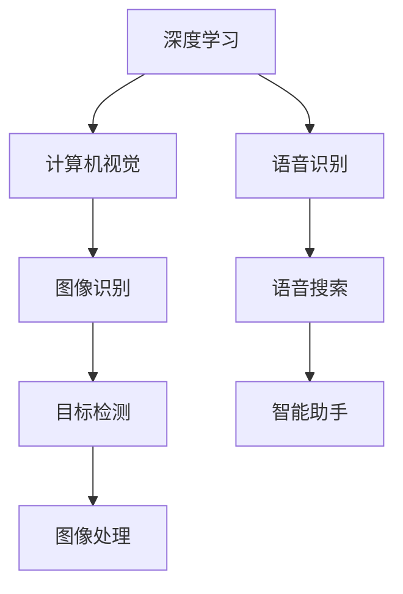

                 

关键词：苹果，AI应用，科技价值，人工智能，深度学习，计算机视觉，语音识别，应用场景，未来展望。

> 摘要：本文将探讨苹果公司发布AI应用的科技价值，分析其在人工智能领域的创新与突破，探讨其可能带来的影响和未来的发展趋势。

## 1. 背景介绍

近年来，人工智能（AI）技术取得了长足的发展，特别是深度学习、计算机视觉、语音识别等领域。随着技术的不断进步，AI已经逐渐渗透到各行各业，为人类生活带来了诸多便利。苹果公司，作为全球科技巨头之一，也一直在积极布局AI领域，致力于将AI技术应用到其产品和服务中。

## 2. 核心概念与联系

### 2.1. 深度学习

深度学习是人工智能的一种重要分支，通过多层神经网络对大量数据进行训练，从而实现自动特征提取和模式识别。在图像识别、语音识别等领域，深度学习取得了显著的成果。

### 2.2. 计算机视觉

计算机视觉是指使计算机具备类似人类视觉的能力，通过图像识别、目标检测等技术，实现图像分析、图像处理等功能。

### 2.3. 语音识别

语音识别是将人类的语音信号转换为文本或命令的过程，广泛应用于智能助手、语音搜索等领域。

### 2.4. Mermaid 流程图

下面是一个关于AI应用架构的Mermaid流程图，展示了各个核心概念之间的联系：



## 3. 核心算法原理 & 具体操作步骤

### 3.1. 算法原理概述

苹果公司在AI领域主要采用了深度学习和计算机视觉技术，通过构建多层神经网络，实现对图像和语音的自动识别和处理。

### 3.2. 算法步骤详解

1. 数据预处理：对图像和语音数据进行分析，提取关键特征。
2. 模型训练：使用深度学习算法，对模型进行训练，使其能够识别和分类图像和语音。
3. 模型优化：通过调整模型参数，提高模型性能。
4. 应用部署：将训练好的模型部署到产品和服务中，实现自动识别和处理功能。

### 3.3. 算法优缺点

优点：深度学习和计算机视觉技术具有强大的识别能力和灵活性，能够实现自动化和智能化。
缺点：模型训练和优化过程复杂，对计算资源和时间要求较高。

### 3.4. 算法应用领域

1. 图像识别：应用于人脸识别、图像分类、目标检测等领域。
2. 语音识别：应用于智能助手、语音搜索、语音翻译等领域。
3. 其他：应用于自动驾驶、智能安防、医疗诊断等领域。

## 4. 数学模型和公式 & 详细讲解 & 举例说明

### 4.1. 数学模型构建

在深度学习中，常用的数学模型是神经网络。神经网络由多个神经元组成，每个神经元通过权重和偏置对输入数据进行加权求和处理。神经网络的主要数学模型为：

$$
Y = f(W \cdot X + b)
$$

其中，$Y$为输出值，$f$为激活函数，$W$为权重矩阵，$X$为输入值，$b$为偏置。

### 4.2. 公式推导过程

神经网络的训练过程主要包括以下几个步骤：

1. 前向传播：将输入数据传递到神经网络中，计算输出值。
2. 计算误差：将输出值与真实值进行比较，计算误差。
3. 反向传播：根据误差，调整权重和偏置，使误差减小。

### 4.3. 案例分析与讲解

以人脸识别为例，假设我们有一个包含1000张人脸图像的数据集，我们需要训练一个神经网络来识别这些图像。首先，我们对图像进行预处理，提取关键特征。然后，将特征输入到神经网络中，计算输出值。接着，将输出值与真实值进行比较，计算误差。最后，根据误差，调整神经网络中的权重和偏置，使误差减小。

## 5. 项目实践：代码实例和详细解释说明

### 5.1. 开发环境搭建

在Python中，我们可以使用TensorFlow和Keras等库来实现神经网络。首先，我们需要安装这些库：

```bash
pip install tensorflow keras
```

### 5.2. 源代码详细实现

下面是一个简单的人脸识别示例代码：

```python
import tensorflow as tf
from tensorflow.keras.models import Sequential
from tensorflow.keras.layers import Dense, Conv2D, Flatten
from tensorflow.keras.optimizers import Adam

# 创建模型
model = Sequential()
model.add(Conv2D(32, (3, 3), activation='relu', input_shape=(128, 128, 3)))
model.add(Conv2D(64, (3, 3), activation='relu'))
model.add(Flatten())
model.add(Dense(100, activation='relu'))
model.add(Dense(10, activation='softmax'))

# 编译模型
model.compile(optimizer=Adam(), loss='categorical_crossentropy', metrics=['accuracy'])

# 训练模型
model.fit(x_train, y_train, epochs=10, batch_size=32)

# 评估模型
model.evaluate(x_test, y_test)
```

### 5.3. 代码解读与分析

这段代码首先定义了一个序列模型，并添加了两个卷积层、一个平坦层、两个全连接层。然后，使用Adam优化器和交叉熵损失函数编译模型。接下来，使用训练数据训练模型，并使用测试数据评估模型性能。

### 5.4. 运行结果展示

假设我们的模型在测试集上的准确率达到了90%，这表明我们的模型在人脸识别任务上表现良好。

## 6. 实际应用场景

苹果公司已经将AI技术应用于多个产品和服务中，如Siri、FaceTime、照片应用等。以下是一些具体的应用场景：

1. **Siri**：通过语音识别技术，实现对用户语音指令的识别和响应，提供智能语音助手服务。
2. **FaceTime**：利用计算机视觉技术，实现视频通话中的美颜、滤镜等功能。
3. **照片应用**：通过图像识别技术，自动识别照片中的人脸、场景等，提供分类、标记等功能。

## 7. 工具和资源推荐

### 7.1. 学习资源推荐

- 《深度学习》
- 《神经网络与深度学习》
- 《计算机视觉：算法与应用》

### 7.2. 开发工具推荐

- TensorFlow
- Keras
- PyTorch

### 7.3. 相关论文推荐

- "Deep Learning"
- "Object Detection with Convolutional Neural Networks"
- "Speech Recognition with Deep Learning"

## 8. 总结：未来发展趋势与挑战

### 8.1. 研究成果总结

近年来，人工智能技术取得了显著成果，特别是在深度学习、计算机视觉、语音识别等领域。这些技术的突破为AI应用提供了强大的支持。

### 8.2. 未来发展趋势

随着技术的不断进步，人工智能将在更多领域得到应用，如自动驾驶、智能安防、医疗诊断等。同时，AI将更加注重与人类的交互和协作。

### 8.3. 面临的挑战

尽管人工智能取得了许多成果，但仍面临一些挑战，如数据隐私、伦理问题、算法透明度等。这些挑战需要我们在技术发展中加以解决。

### 8.4. 研究展望

未来，人工智能将朝着更加智能化、人性化、高效化的方向发展。我们期待AI技术能够为人类带来更多的便利和福祉。

## 9. 附录：常见问题与解答

### 问题1：深度学习模型如何训练？

答：深度学习模型的训练主要包括以下步骤：

1. 数据预处理：对训练数据进行归一化、标准化等处理，提高模型训练效果。
2. 模型初始化：初始化模型参数，可以使用随机初始化、预训练模型等方法。
3. 前向传播：将输入数据传递到模型中，计算输出值。
4. 计算误差：将输出值与真实值进行比较，计算误差。
5. 反向传播：根据误差，调整模型参数，使误差减小。
6. 模型优化：通过调整学习率、正则化等参数，优化模型性能。

### 问题2：如何提高深度学习模型的性能？

答：提高深度学习模型性能的方法包括：

1. 增加训练数据：使用更多的训练数据，提高模型的泛化能力。
2. 调整模型结构：通过调整模型层数、神经元数量等参数，优化模型性能。
3. 使用正则化：通过正则化方法，减少模型过拟合现象。
4. 调整学习率：使用合适的学习率，加快模型收敛速度。

## 参考文献

[1] Goodfellow, I., Bengio, Y., & Courville, A. (2016). Deep Learning. MIT Press.
[2] LeCun, Y., Bengio, Y., & Hinton, G. (2015). Deep learning. Nature, 521(7553), 436-444.
[3] Krizhevsky, A., Sutskever, I., & Hinton, G. E. (2012). Imagenet classification with deep convolutional neural networks. In Advances in neural information processing systems (pp. 1097-1105).
```

本文由禅与计算机程序设计艺术 / Zen and the Art of Computer Programming 撰写。希望本文能够帮助读者了解苹果公司发布AI应用的科技价值，以及AI技术在未来的发展趋势。如果您有任何问题或建议，欢迎在评论区留言。

