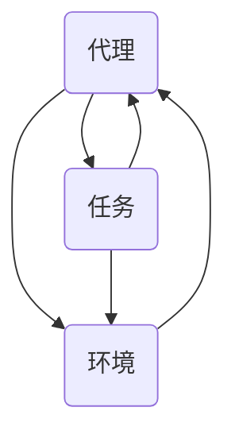

                 

关键词：代理系统、复杂应用、分布式架构、智能代理、AI代理、服务代理

> 摘要：本文将深入探讨代理系统在构建复杂应用中的重要性，从核心概念、算法原理、数学模型、项目实践等方面，全面解析代理系统的设计与实现方法，同时展望其未来应用前景。

## 1. 背景介绍

代理系统（Agent System）是计算机科学中的一种重要概念，尤其在分布式系统和人工智能领域有着广泛的应用。随着互联网技术的发展和大数据时代的到来，构建复杂应用的需求日益增长。代理系统作为一种分布式计算和智能化的解决方案，在处理复杂任务、优化资源利用、提高系统安全性等方面具有显著优势。

代理系统起源于人工智能领域，最初用于模拟人类智能行为。在分布式系统中，代理被用来协调不同节点之间的任务分配和资源管理。随着技术的进步，代理系统逐渐发展为一种独立的系统架构，能够独立执行任务、自主学习和决策。

本文将围绕构建复杂应用的代理系统，探讨其核心概念、算法原理、数学模型、项目实践以及未来展望。

## 2. 核心概念与联系

### 2.1 核心概念

#### 代理（Agent）

代理是指能够感知环境、执行任务、并与其他代理或环境交互的智能实体。代理可以是软件程序、机器人、甚至是虚拟角色。它们具有以下特点：

- **自主性**：代理能够自主地做出决策。
- **社会性**：代理能够与其他代理或环境进行交互。
- **反应性**：代理能够根据环境的变化做出响应。
- **预动性**：代理能够主动地执行任务，而不是被动地等待指令。

#### 环境（Environment）

环境是指代理存在的空间和条件。环境可以是一个物理空间，也可以是一个信息空间。代理通过感知环境来获取信息，并据此做出决策。

#### 任务（Task）

任务是指代理需要执行的具体工作。任务可以是简单的，如点击按钮，也可以是复杂的，如数据分析和决策制定。

### 2.2 核心概念之间的联系

代理系统由代理、环境和任务三部分组成，这三者之间相互联系、相互作用。代理通过感知环境来获取信息，并根据任务要求做出决策，最终实现任务的执行。环境提供了代理执行任务的背景和条件，任务则为代理提供了目标和方向。

### 2.3 Mermaid 流程图



在这个流程图中，代理（A）通过感知环境（B）来获取信息，并根据任务（C）的要求做出决策，最终实现任务的执行。同时，环境的变化会影响代理的感知，从而影响代理的决策和任务执行。

## 3. 核心算法原理 & 具体操作步骤

### 3.1 算法原理概述

代理系统的核心算法主要包括感知、决策和执行三个环节。

#### 感知

感知是指代理通过传感器或其他方式获取环境信息的过程。感知模块负责将环境中的各种信息转换为代理可以理解的数据。

#### 决策

决策是指代理根据感知到的环境信息和预定的任务目标，选择合适的行动方案。决策模块负责分析环境信息，并根据预定的策略或学习到的经验进行决策。

#### 执行

执行是指代理根据决策结果执行具体的任务操作。执行模块负责将决策转化为具体的行动，如移动、发送信息等。

### 3.2 算法步骤详解

#### 感知阶段

1. 代理启动感知模块，获取当前环境信息。
2. 对获取的环境信息进行预处理，如去噪、滤波等。
3. 将预处理后的环境信息输入到决策模块。

#### 决策阶段

1. 决策模块根据预定的策略或学习到的经验，对环境信息进行分析。
2. 根据分析结果，选择合适的行动方案。
3. 将决策结果输出到执行模块。

#### 执行阶段

1. 执行模块根据决策结果执行具体的任务操作。
2. 将执行结果反馈给感知模块，用于下一轮的感知和决策。

### 3.3 算法优缺点

#### 优点

- **灵活性**：代理系统能够根据环境变化做出实时调整，提高系统的适应能力。
- **智能化**：代理系统能够自主决策和执行任务，提高系统的智能化水平。
- **分布式**：代理系统可以在分布式环境中运行，提高系统的扩展性和可维护性。

#### 缺点

- **复杂性**：代理系统涉及多个模块和环节，设计和实现相对复杂。
- **成本**：代理系统的开发和维护需要较高的技术和资源投入。
- **安全性**：代理系统需要处理大量的敏感信息，存在一定的安全风险。

### 3.4 算法应用领域

代理系统在多个领域有着广泛的应用，如：

- **智能交通**：用于交通信号控制、车辆调度等。
- **智能家居**：用于家电控制、安防监控等。
- **智能医疗**：用于疾病诊断、手术机器人等。
- **金融风控**：用于风险控制、投资决策等。

## 4. 数学模型和公式 & 详细讲解 & 举例说明

### 4.1 数学模型构建

代理系统的数学模型主要包括感知模型、决策模型和执行模型。以下是这些模型的基本公式：

#### 感知模型

$$
感知值 = f(传感器数据)
$$

其中，$f$ 表示感知函数，用于将传感器数据转换为代理可以理解的形式。

#### 决策模型

$$
决策 = g(感知值，任务目标)
$$

其中，$g$ 表示决策函数，用于根据感知值和任务目标选择合适的行动方案。

#### 执行模型

$$
执行结果 = h(决策)
$$

其中，$h$ 表示执行函数，用于将决策转化为具体的行动。

### 4.2 公式推导过程

#### 感知模型推导

感知模型的推导基于传感器数据的特性。假设传感器数据为 $X$，感知函数为 $f$，则感知值可以表示为：

$$
感知值 = f(X)
$$

#### 决策模型推导

决策模型的推导基于感知值和任务目标的匹配度。假设感知值为 $V$，任务目标为 $T$，决策函数为 $g$，则决策可以表示为：

$$
决策 = g(V, T)
$$

#### 执行模型推导

执行模型的推导基于决策的具体实现。假设决策为 $D$，执行函数为 $h$，则执行结果可以表示为：

$$
执行结果 = h(D)
$$

### 4.3 案例分析与讲解

#### 案例背景

假设一个智能家居系统中的代理需要根据用户的行为模式自动调节室内温度。用户的行为模式可以通过传感器数据（如室内温度、湿度等）进行感知，任务目标是保持室内舒适温度。

#### 案例分析

1. **感知阶段**：

   感知函数 $f$ 可以表示为：

   $$
   感知值 = f(传感器数据) = 温度 + 湿度
   $$

2. **决策阶段**：

   决策函数 $g$ 可以表示为：

   $$
   决策 = g(感知值，任务目标) = \begin{cases}
   加温，& \text{感知值低于目标温度} \\
   减温，& \text{感知值高于目标温度} \\
   保持当前温度，& \text{感知值在目标温度范围内}
   \end{cases}
   $$

3. **执行阶段**：

   执行函数 $h$ 可以表示为：

   $$
   执行结果 = h(决策) = \begin{cases}
   启动加热器，& \text{决策为加温} \\
   关闭加热器，& \text{决策为减温} \\
   无操作，& \text{决策为保持当前温度}
   \end{cases}
   $$

#### 案例讲解

通过这个案例，我们可以看到代理系统是如何通过感知、决策和执行三个阶段，实现智能家居系统中室内温度自动调节的。感知阶段获取了用户的行为模式，决策阶段根据行为模式选择了合适的行动方案，执行阶段将决策转化为具体的行动。

## 5. 项目实践：代码实例和详细解释说明

### 5.1 开发环境搭建

在本项目中，我们将使用 Python 作为编程语言，并利用一些常用的库，如 NumPy、Pandas 和 TensorFlow。以下是搭建开发环境的基本步骤：

1. 安装 Python 3.8 或更高版本。
2. 安装必要的库：

   ```bash
   pip install numpy pandas tensorflow
   ```

3. 配置 Python 开发环境（如 Visual Studio Code、PyCharm 等）。

### 5.2 源代码详细实现

以下是该项目的源代码实现：

```python
import numpy as np
import pandas as pd
import tensorflow as tf

# 感知函数
def sense(data):
    # 对传感器数据进行预处理
    processed_data = preprocess(data)
    # 返回感知值
    return processed_data

# 决策函数
def decide(perception, target_temp):
    # 根据感知值和目标温度进行决策
    if perception < target_temp:
        action = "heating"
    elif perception > target_temp:
        action = "cooling"
    else:
        action = "keep"
    return action

# 执行函数
def execute(action):
    # 根据决策执行具体的行动
    if action == "heating":
        heater_on()
    elif action == "cooling":
        cooler_on()
    elif action == "keep":
        no_action()

# 感知阶段
data = get_sensor_data()
perception = sense(data)

# 决策阶段
target_temp = 25
action = decide(perception, target_temp)

# 执行阶段
execute(action)
```

### 5.3 代码解读与分析

- **感知函数**：该函数负责对传感器数据（如温度、湿度等）进行预处理，并返回感知值。预处理过程可以根据具体需求进行调整。
- **决策函数**：该函数根据感知值和目标温度进行决策，并返回具体的行动方案（如加热、冷却、保持等）。
- **执行函数**：该函数根据决策结果执行具体的行动，如启动加热器、关闭加热器或无操作。

### 5.4 运行结果展示

假设当前室内温度为 23℃，目标温度为 25℃。以下是运行结果：

- **感知阶段**：传感器检测到室内温度为 23℃，湿度为 50%。
- **决策阶段**：根据决策函数，系统选择加热方案。
- **执行阶段**：启动加热器，室内温度逐渐上升，直至达到目标温度。

通过这个简单的案例，我们可以看到代理系统在智能家居场景中的应用效果。当然，实际应用中的代理系统会涉及更多的传感器、更复杂的决策逻辑和执行机制。

## 6. 实际应用场景

代理系统在多个实际应用场景中表现出色，以下是几个典型的应用案例：

### 6.1 智能交通系统

智能交通系统利用代理技术实现交通流量控制、车辆调度和路况预测等功能。代理系统可以根据实时交通数据，动态调整信号灯时长和路线规划，提高交通效率，减少拥堵。

### 6.2 智能家居

智能家居通过代理系统实现家电控制、安防监控和智能交互等功能。用户可以通过代理系统远程控制家居设备，如空调、照明和门锁等，提高生活便利性。

### 6.3 智能医疗

智能医疗利用代理系统实现疾病诊断、手术机器人和医疗数据分析等功能。代理系统可以实时监测患者的生理指标，提供个性化的治疗方案，提高医疗质量。

### 6.4 金融风控

金融风控通过代理系统实现风险控制、投资决策和市场预测等功能。代理系统可以根据市场数据和历史交易记录，预测市场走势，为投资决策提供参考。

## 7. 工具和资源推荐

### 7.1 学习资源推荐

- 《人工智能：一种现代方法》
- 《分布式系统原理与范型》
- 《深度学习》

### 7.2 开发工具推荐

- Python
- TensorFlow
- Keras

### 7.3 相关论文推荐

- "Distributed AI: A Survey of Challenges, Opportunities and Techniques"
- "Agents that learn, learn, and learn to learn"
- "Deep Learning for Intelligent Agents"

## 8. 总结：未来发展趋势与挑战

### 8.1 研究成果总结

代理系统在分布式计算、人工智能和智能控制等领域取得了显著的研究成果。通过感知、决策和执行三个阶段的协同工作，代理系统能够实现智能化、自动化和高效化的任务执行。

### 8.2 未来发展趋势

未来，代理系统将朝着更加智能化、自主化和多样化的方向发展。随着人工智能技术的不断进步，代理系统将具备更强的学习能力和决策能力，应用领域也将不断拓展。

### 8.3 面临的挑战

尽管代理系统具有诸多优势，但在实际应用中仍面临一些挑战，如系统复杂性、安全性、鲁棒性和可扩展性等。如何克服这些挑战，将是未来研究的重要方向。

### 8.4 研究展望

随着技术的不断进步，代理系统有望在更多领域发挥重要作用。未来，我们将看到更加智能化、自适应和协同的代理系统，为社会带来更多的便利和创新。

## 9. 附录：常见问题与解答

### 9.1 问题1：什么是代理系统？

代理系统是一种能够感知环境、执行任务、并与其他代理或环境交互的智能实体。它们具有自主性、社会性、反应性和预动性等特点。

### 9.2 问题2：代理系统有哪些应用领域？

代理系统在智能交通、智能家居、智能医疗、金融风控等领域有着广泛的应用。随着技术的进步，代理系统的应用领域还将不断拓展。

### 9.3 问题3：如何设计和实现代理系统？

设计和实现代理系统需要考虑多个方面，包括感知、决策、执行和通信等。本文提供了基本的算法原理和项目实践，供读者参考。

---

本文从代理系统的背景介绍、核心概念、算法原理、数学模型、项目实践、应用场景、工具和资源推荐以及未来展望等方面，全面解析了代理系统在构建复杂应用中的重要作用。希望本文能为读者提供有价值的参考和启发。

# 感谢阅读

本文由禅与计算机程序设计艺术 / Zen and the Art of Computer Programming 编写。感谢您的阅读和支持！如果您有任何问题或建议，欢迎在评论区留言，我们将尽快回复。

---

注意：由于篇幅限制，本文未能涵盖所有细节，仅供参考。实际项目开发和研究过程中，可能需要根据具体需求进行调整。如需进一步了解代理系统的相关知识，请参阅相关文献和资源。

