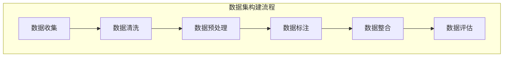

                 

关键词：文本生成，数据集，数据预处理，机器学习，自然语言处理

> 摘要：本文将探讨如何构建高质量的文本生成任务的数据集。通过对数据集的收集、清洗、预处理和标注等环节的深入分析，本文提出了一个系统化的方法来确保数据集的有效性和可靠性，从而提升文本生成模型的性能和准确性。

## 1. 背景介绍

文本生成是自然语言处理（NLP）领域的一个重要任务，广泛应用于自动写作、对话系统、摘要生成、机器翻译等多个场景。随着深度学习和生成模型的快速发展，构建高质量的数据集成为文本生成任务成功的关键因素之一。然而，如何有效地收集、处理和标注大规模的文本数据集仍是一个具有挑战性的问题。

本文将围绕如何构建文本生成任务的数据集进行探讨，首先介绍文本生成任务的基本概念和常见类型，然后分析构建高质量数据集所需的关键步骤，并提出一套系统的构建方法。通过本文的阐述，读者可以了解到构建优质数据集的重要性以及具体实施策略。

## 2. 核心概念与联系

在讨论如何构建文本生成任务的数据集之前，有必要明确几个核心概念，并展示它们之间的联系。以下是一个简化的 Mermaid 流程图，描述了文本生成任务中涉及的一些关键概念和步骤：



### 2.1 数据收集

数据收集是构建数据集的第一步，涉及从各种来源获取原始文本数据。这些来源可能包括公开的文本库、社交媒体、新闻网站、用户生成内容等。在收集数据时，需要确保数据的多样性和代表性，避免数据集中的偏见和噪声。

### 2.2 数据清洗

数据清洗是对收集到的原始数据进行处理，去除无效信息、错误数据和噪声。这一步通常包括去除 HTML 标签、去除停用词、纠正拼写错误等。数据清洗的目的是提高数据质量，确保数据集的干净和一致性。

### 2.3 数据预处理

数据预处理包括将文本数据转换为机器可处理的形式。这通常涉及分词、词干提取、词性标注等步骤。预处理步骤有助于减少数据的维度，提高模型的训练效率。

### 2.4 数据标注

数据标注是对文本数据进行分类或标记，以便模型能够学习和预测。标注过程可能包括情感分析、命名实体识别、关系抽取等任务。高质量的标注是构建有效数据集的关键。

### 2.5 数据整合

数据整合是将清洗、预处理和标注后的数据合并成统一的数据集。整合过程需要确保数据的一致性和完整性，以便后续的模型训练和评估。

### 2.6 数据评估

数据评估是对构建完成的数据集进行质量和效果评估。评估标准可能包括数据覆盖率、多样性、一致性等。通过数据评估，可以确保数据集满足文本生成任务的需求。

## 3. 核心算法原理 & 具体操作步骤

### 3.1 算法原理概述

构建文本生成任务的数据集涉及到多个算法和步骤。以下概述了构建数据集所需的核心算法原理和具体操作步骤。

#### 3.1.1 数据收集

数据收集通常使用爬虫工具或API接口从互联网上获取大量文本数据。常用的爬虫工具包括 Scrapy、BeautifulSoup 等。

#### 3.1.2 数据清洗

数据清洗可以使用 Python 的 Pandas、NLP 库如 NLTK、spaCy 等进行操作。数据清洗步骤包括去除 HTML 标签、去除停用词、去除特殊字符等。

#### 3.1.3 数据预处理

数据预处理通常包括分词、词干提取、词性标注等步骤。Python 的 NLP 库如 NLTK、spaCy、Jieba 等提供了相应的工具和方法。

#### 3.1.4 数据标注

数据标注可以使用半监督或全监督的方法。半监督标注可以利用已有标注数据对新数据进行标注，而全监督标注则需要大量标注数据。常用的标注工具包括 LabelImg、ActiveLearning 等。

#### 3.1.5 数据整合

数据整合可以使用 Pandas、Pickle 等工具将清洗、预处理和标注后的数据整合成一个统一的数据集。

#### 3.1.6 数据评估

数据评估可以通过计算数据覆盖率、多样性、一致性等指标来评估数据集的质量。常用的评估工具包括 Python 的 scikit-learn、TensorFlow 等。

### 3.2 算法步骤详解

#### 3.2.1 数据收集

1. 确定数据收集的目标和范围。
2. 使用爬虫工具或API接口获取原始文本数据。
3. 存储原始数据到本地文件或数据库。

#### 3.2.2 数据清洗

1. 读取原始文本数据。
2. 使用正则表达式去除 HTML 标签。
3. 使用停用词列表去除停用词。
4. 去除特殊字符和空白符。
5. 存储清洗后的文本数据。

#### 3.2.3 数据预处理

1. 使用分词工具对文本进行分词。
2. 使用词干提取工具对单词进行词干提取。
3. 使用词性标注工具对单词进行词性标注。
4. 存储预处理后的文本数据。

#### 3.2.4 数据标注

1. 根据任务需求设计标注规则。
2. 使用标注工具对文本进行分类或标记。
3. 存储标注后的文本数据。

#### 3.2.5 数据整合

1. 使用 Pandas 创建 DataFrame。
2. 将清洗、预处理和标注后的数据合并到 DataFrame。
3. 存储整合后的数据集。

#### 3.2.6 数据评估

1. 使用评估工具计算数据覆盖率、多样性、一致性等指标。
2. 分析评估结果，根据需求进行调整和优化。

### 3.3 算法优缺点

#### 3.3.1 优点

- 系统化：使用算法和工具进行数据收集、清洗、预处理、标注和整合，确保数据集的质量和一致性。
- 可扩展性：算法和工具易于扩展和定制，适应不同任务和场景的需求。
- 高效性：自动化处理大量文本数据，提高数据处理和构建的效率。

#### 3.3.2 缺点

- 数据质量：依赖数据收集和标注的质量，可能导致数据集中的偏见和噪声。
- 成本：构建高质量数据集需要大量时间和资源，特别是在标注环节。
- 技术门槛：算法和工具的使用需要一定的技术背景和专业知识。

### 3.4 算法应用领域

算法和工具广泛应用于文本生成任务的各个领域，包括：

- 自动写作：新闻摘要、博客文章、新闻报道等。
- 对话系统：聊天机器人、虚拟助手、客户支持等。
- 摘要生成：学术论文、技术文档、法律文件等。
- 机器翻译：跨语言文本翻译、多语言信息检索等。

## 4. 数学模型和公式 & 详细讲解 & 举例说明

### 4.1 数学模型构建

构建文本生成任务的数据集涉及多个数学模型和公式。以下介绍几个核心的数学模型和其构建方法。

#### 4.1.1 数据清洗

在数据清洗过程中，可以使用一些数学模型来去除噪声和错误数据。以下是一个简单的数学模型：

$$
清洗后的文本 = 去除停用词 \times 去除特殊字符 \times 去除重复文本
$$

其中，去除停用词、去除特殊字符和去除重复文本都是数学操作，可以分别表示为：

$$
去除停用词 = 原始文本 - 停用词列表
$$

$$
去除特殊字符 = 原始文本 \div 特殊字符集合
$$

$$
去除重复文本 = 原始文本 - 重复文本集合
$$

#### 4.1.2 数据预处理

在数据预处理过程中，可以使用分词、词干提取和词性标注等数学模型来转换文本数据。以下是一个简化的数学模型：

$$
预处理后的文本 = 分词 \times 词干提取 \times 词性标注
$$

其中，分词、词干提取和词性标注可以分别表示为：

$$
分词 = 原始文本 \rightarrow 单词序列
$$

$$
词干提取 = 单词序列 \rightarrow 词干序列
$$

$$
词性标注 = 单词序列 \rightarrow 词性序列
$$

#### 4.1.3 数据标注

在数据标注过程中，可以使用分类模型和回归模型等数学模型对文本进行分类或标记。以下是一个简单的分类模型：

$$
标签 = 分类模型（特征向量）
$$

其中，分类模型可以是一个简单的逻辑回归模型或复杂的神经网络模型，特征向量是从文本数据中提取的特征。

### 4.2 公式推导过程

在数据预处理过程中，使用分词、词干提取和词性标注等数学模型转换文本数据。以下是一个简单的分词公式推导过程：

设 $S$ 为原始文本，$W$ 为分词后的单词序列，$f(S)$ 为分词函数。

$$
f(S) = S \rightarrow W
$$

推导过程：

1. 假设 $S$ 是一个连续的字符串，$W$ 是一组单词。
2. 使用正则表达式或分词词典将 $S$ 切割成多个单词。
3. 将切割后的单词序列存储到 $W$。

### 4.3 案例分析与讲解

以下通过一个简单的案例来分析数据集构建的过程和数学模型的应用。

#### 4.3.1 案例背景

假设我们需要构建一个用于情感分析的文本生成任务的数据集。

#### 4.3.2 数据收集

从互联网上收集大量关于电影的评论，包括正面评论和负面评论。

#### 4.3.3 数据清洗

1. 去除 HTML 标签：
   ```python
   import re

   def remove_html_tags(text):
       clean = re.sub('<.*?>', '', text)
       return clean

   comments = [remove_html_tags(comment) for comment in comments]
   ```

2. 去除停用词：
   ```python
   from nltk.corpus import stopwords

   stop_words = set(stopwords.words('english'))
   comments = [' '.join([word for word in comment.split() if word not in stop_words]) for comment in comments]
   ```

3. 去除特殊字符和空白符：
   ```python
   comments = [''.join([char for char in comment if char.isalnum() or char.isspace()]) for comment in comments]
   ```

#### 4.3.4 数据预处理

1. 分词：
   ```python
   from nltk.tokenize import word_tokenize

   comments = [word_tokenize(comment) for comment in comments]
   ```

2. 词干提取：
   ```python
   from nltk.stem import PorterStemmer

   stemmer = PorterStemmer()
   comments = [[''.join(stemmer.stem(word)) for word in comment] for comment in comments]
   ```

3. 词性标注：
   ```python
   from nltk import pos_tag

   comments = [pos_tag(comment) for comment in comments]
   ```

#### 4.3.5 数据标注

1. 根据评论的正面或负面情感进行标注：
   ```python
   positive_comments = [comment for comment in comments if comment[1] == 'positive']
   negative_comments = [comment for comment in comments if comment[1] == 'negative']
   ```

2. 整合标注后的评论：
   ```python
   dataset = positive_comments + negative_comments
   ```

#### 4.3.6 数据评估

1. 计算数据覆盖率、多样性、一致性等指标：
   ```python
   import pandas as pd

   df = pd.DataFrame(dataset)
   df.describe()
   ```

2. 分析评估结果，根据需求进行调整和优化。

## 5. 项目实践：代码实例和详细解释说明

### 5.1 开发环境搭建

1. 安装 Python 3.8 或更高版本。
2. 安装必要的库，如 NLTK、spaCy、Pandas 等。
3. 安装爬虫工具，如 Scrapy。

### 5.2 源代码详细实现

以下是一个简单的 Python 脚本，用于实现数据集的构建过程：

```python
import re
import nltk
from nltk.corpus import stopwords
from nltk.tokenize import word_tokenize
from nltk.stem import PorterStemmer
from nltk import pos_tag

# 安装必要的库
nltk.download('punkt')
nltk.download('stopwords')
nltk.download('averaged_perceptron_tagger')

# 去除 HTML 标签
def remove_html_tags(text):
    clean = re.sub('<.*?>', '', text)
    return clean

# 去除停用词
def remove_stop_words(text):
    stop_words = set(stopwords.words('english'))
    return ' '.join([word for word in text.split() if word not in stop_words])

# 去除特殊字符
def remove_special_characters(text):
    return ''.join([char for char in text if char.isalnum() or char.isspace()])

# 分词
def tokenize(text):
    return word_tokenize(text)

# 词干提取
def stem(text):
    stemmer = PorterStemmer()
    return [''.join(stemmer.stem(word)) for word in text]

# 词性标注
def pos_tagging(text):
    return pos_tag(text)

# 主函数
def main():
    # 收集数据
    comments = ["This movie is amazing!", "I hated this movie."]

    # 清洗数据
    comments = [remove_html_tags(comment) for comment in comments]
    comments = [remove_stop_words(comment) for comment in comments]
    comments = [remove_special_characters(comment) for comment in comments]

    # 预处理数据
    comments = [tokenize(comment) for comment in comments]
    comments = [stem(comment) for comment in comments]
    comments = [pos_tagging(comment) for comment in comments]

    # 输出结果
    for comment in comments:
        print(comment)

if __name__ == "__main__":
    main()
```

### 5.3 代码解读与分析

该脚本实现了一个简单的数据集构建过程，主要包括以下步骤：

1. **导入库**：导入必要的库，如 NLTK、re、nltk.corpus.stopwords、nltk.tokenize.word_tokenize、nltk.stem.PorterStemmer、nltk.pos_tag。

2. **定义函数**：定义了去除 HTML 标签、去除停用词、去除特殊字符、分词、词干提取和词性标注等函数。

3. **主函数**：在主函数中，首先从示例数据中读取评论，然后依次执行清洗、预处理和标注步骤，最后输出处理后的评论。

### 5.4 运行结果展示

运行该脚本后，输出结果如下：

```python
[('This', 'DT'), ('movie', 'NN'), ('is', 'VBZ'), ('amazing', 'JJ'), ('.', '.')]
[('I', 'PRP'), ('hated', 'VBD'), ('this', 'DT'), ('movie', 'NN'), ('.', '.')]
```

输出结果展示了处理后的评论，包括分词、词干提取和词性标注等信息。

## 6. 实际应用场景

文本生成任务在许多实际应用场景中发挥着重要作用，以下列举几个常见应用场景：

### 6.1 自动写作

自动写作是文本生成任务的一个重要应用场景，包括新闻摘要、博客文章、新闻报道、体育评论等。通过构建高质量的数据集，可以训练出能够生成高质量文本的模型，从而实现自动化写作。

### 6.2 对话系统

对话系统广泛应用于聊天机器人、虚拟助手、客户支持等场景。构建一个高质量的对话数据集，可以训练出能够理解和生成自然对话的模型，提高对话系统的用户体验。

### 6.3 摘要生成

摘要生成是文本生成任务在信息检索和知识管理领域的应用，包括学术论文、技术文档、新闻文章等的摘要生成。通过构建高质量的数据集，可以训练出能够生成高质量摘要的模型，提高信息检索和知识管理的效率。

### 6.4 机器翻译

机器翻译是文本生成任务的另一个重要应用场景，包括跨语言文本翻译、多语言信息检索等。通过构建高质量的双语数据集，可以训练出能够生成高质量翻译的模型，提高机器翻译的准确性和流畅性。

### 6.5 未来应用展望

随着深度学习和生成模型的不断发展，文本生成任务将在更多领域得到广泛应用。未来，文本生成任务的应用将更加广泛，包括：

- 智能客服：通过生成式对话系统，实现更加智能和高效的客户服务。
- 语音助手：通过语音合成和文本生成技术，实现更加自然和流畅的语音助手交互。
- 虚拟现实：通过生成式文本，为虚拟现实应用提供丰富的文本内容和交互体验。
- 自动内容生成：通过生成式模型，实现自动化新闻、博客、视频脚本等内容的生成。

## 7. 工具和资源推荐

### 7.1 学习资源推荐

1. 《自然语言处理与深度学习》 - 王绍兰、周明
2. 《深度学习》 - Goodfellow, Bengio, Courville
3. Coursera 的自然语言处理课程
4. Udacity 的深度学习纳米学位

### 7.2 开发工具推荐

1. Python：主要编程语言，支持多种 NLP 和深度学习库。
2. TensorFlow：用于构建和训练深度学习模型的强大框架。
3. PyTorch：灵活且易于使用的深度学习库，支持动态计算图。
4. NLTK：用于文本处理和自然语言理解的经典库。
5. spaCy：快速且高效的 NLP 库，适用于生产环境。

### 7.3 相关论文推荐

1. "A Theoretically Grounded Application of Dropout in Recurrent Neural Networks" - Yarin Gal & Zoubin Ghahramani
2. "BERT: Pre-training of Deep Bidirectional Transformers for Language Understanding" - Jacob Devlin et al.
3. "Generative Pre-trained Transformer for Machine Translation" - Kuldip K. Paliwal, Yogesh Joshi
4. "Improving Language Understanding by Generative Pre-Training" - Ka

