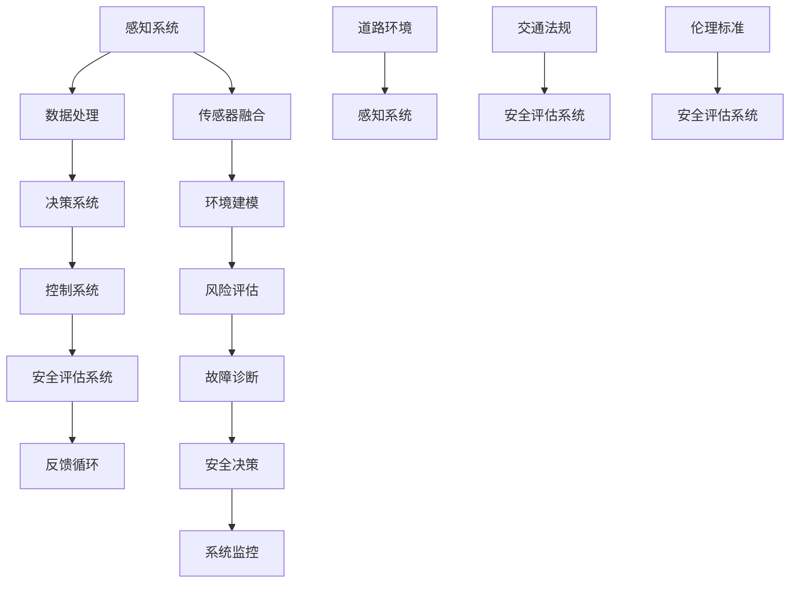

                 

关键词：自动驾驶，安全性评估，技术体系，算法，数学模型，实践进展

> 摘要：本文详细探讨了构建自动驾驶安全性评估技术体系的核心要素，包括核心概念、算法原理、数学模型、项目实践以及未来应用展望。通过分析国内外相关研究和应用案例，本文提出了构建自动驾驶安全性的技术体系框架，并展望了其未来发展趋势与挑战。

## 1. 背景介绍

自动驾驶技术作为未来智能交通系统的重要组成部分，近年来受到全球范围内的广泛关注。随着人工智能、传感器技术、云计算和大数据等领域的迅速发展，自动驾驶汽车逐渐从概念走向现实。然而，随着自动驾驶技术的不断进步，其安全性问题也成为了一个不可忽视的焦点。

### 自动驾驶发展历程

自动驾驶技术的研究始于20世纪50年代，最初仅限于理论探讨和实验室环境下的简单应用。20世纪80年代，随着计算机技术和传感器技术的进步，自动驾驶技术开始逐步走向实际应用。特别是21世纪初，随着互联网和物联网技术的发展，自动驾驶技术进入了一个高速发展阶段。各大汽车制造商和科技公司纷纷投入大量资源进行自动驾驶技术的研发和测试，自动驾驶汽车开始出现在公共道路上。

### 自动驾驶安全性的重要性

自动驾驶技术的安全性直接关系到人们的生命财产安全，因此，其重要性不言而喻。自动驾驶系统的安全性不仅包括硬件设备的安全，还包括软件算法的可靠性和整体系统的稳定性。随着自动驾驶技术的普及，如何确保其在各种复杂环境下的安全性成为亟待解决的关键问题。

### 当前自动驾驶安全性面临的主要挑战

- **多传感器融合与数据融合**：自动驾驶汽车通常配备多种传感器，如激光雷达、摄像头、超声波传感器等，如何有效地融合这些传感器的数据，提高系统的感知能力，是一个重要挑战。
- **复杂环境识别与理解**：自动驾驶系统需要能够识别和理解复杂的交通场景，包括行人、车辆、交通标志、道路条件等，这对算法的复杂度和准确度提出了很高的要求。
- **系统可靠性与容错性**：自动驾驶系统需要具备高可靠性，确保在各种极端情况下能够稳定运行，同时还需要具备容错能力，以应对可能出现的故障和异常情况。
- **法律法规与伦理问题**：自动驾驶技术的普及需要相应的法律法规和伦理标准作为支撑，如何制定合理的法规和标准，确保自动驾驶系统的合法合规运行，是一个亟待解决的问题。

## 2. 核心概念与联系

构建自动驾驶安全性评估技术体系，首先需要明确其中的核心概念，并理解它们之间的相互联系。以下将介绍几个关键概念，并提供一个Mermaid流程图来展示它们之间的关系。

### 2.1. 关键概念

- **感知系统**：自动驾驶汽车的感知系统包括激光雷达、摄像头、雷达、超声波传感器等，用于收集道路和周围环境的信息。
- **决策系统**：决策系统负责分析感知系统收集的数据，并作出相应的驾驶决策。
- **控制系统**：控制系统根据决策系统的指令，控制车辆的加速、制动、转向等操作。
- **安全评估系统**：安全评估系统对整个自动驾驶系统的安全性进行评估和监控，确保系统的可靠运行。

### 2.2. Mermaid流程图



### 2.3. 核心概念之间的联系

- **感知系统**负责收集数据，为决策系统提供基础信息。
- **数据处理**环节对感知系统收集的数据进行预处理和分析，以提高决策系统的准确性。
- **决策系统**根据数据处理的结果，生成驾驶指令，指导控制系统操作。
- **控制系统**执行决策系统的指令，控制车辆的动作。
- **安全评估系统**对整个自动驾驶系统的安全性进行实时监控和评估，确保系统的可靠运行。
- **反馈循环**使系统在不断接收新信息的同时，不断调整和优化其性能。

## 3. 核心算法原理 & 具体操作步骤

### 3.1. 算法原理概述

自动驾驶安全性评估技术体系中的核心算法主要包括感知算法、决策算法和控制算法。这些算法共同构成了自动驾驶系统的智能核心，确保车辆在各种复杂环境下的安全稳定运行。

### 3.2. 算法步骤详解

#### 3.2.1. 感知算法

感知算法是自动驾驶系统的第一步，其主要任务是收集和解析道路环境信息。具体步骤如下：

1. **数据采集**：通过激光雷达、摄像头、雷达、超声波传感器等设备，收集道路和周围环境的数据。
2. **数据预处理**：对采集到的数据进行降噪、滤波等预处理操作，以提高数据的准确性和可靠性。
3. **特征提取**：从预处理后的数据中提取关键特征，如障碍物位置、速度、形状等。
4. **目标检测**：利用深度学习、图像处理等算法，对提取出的特征进行目标检测，识别出道路上的车辆、行人、交通标志等。

#### 3.2.2. 决策算法

决策算法基于感知系统提供的信息，对驾驶行为进行规划和决策。具体步骤如下：

1. **场景理解**：分析感知系统提供的信息，理解当前道路环境和交通状况。
2. **路径规划**：根据当前场景，生成车辆的行驶路径，包括车道保持、避障、速度控制等。
3. **行为预测**：预测其他车辆、行人的行为，确保车辆行驶的安全性和连贯性。
4. **决策生成**：结合路径规划和行为预测，生成驾驶决策，如加速、减速、转向等。

#### 3.2.3. 控制算法

控制算法根据决策算法的指令，控制车辆的实际操作。具体步骤如下：

1. **指令接收**：接收决策算法生成的驾驶指令。
2. **控制策略生成**：根据车辆状态和指令，生成控制策略，如加速、制动、转向等。
3. **执行控制**：根据控制策略，执行车辆的加速、制动、转向等操作。

### 3.3. 算法优缺点

#### 感知算法

- **优点**：能够准确识别道路环境中的各种目标，提供丰富的信息支持决策和控制。
- **缺点**：在复杂环境下，感知算法的准确性和实时性可能受到挑战，特别是在雨雪、雾霾等恶劣天气条件下。

#### 决策算法

- **优点**：能够根据感知系统的信息，生成合理的驾驶决策，确保车辆的安全性和连贯性。
- **缺点**：在极端情况下，决策算法可能无法应对突发状况，需要进一步提升其鲁棒性和适应性。

#### 控制算法

- **优点**：能够精确执行决策算法的指令，控制车辆的运行。
- **缺点**：在车辆状态不稳定或决策算法指令不明确时，控制算法可能无法正常工作。

### 3.4. 算法应用领域

感知、决策和控制算法在自动驾驶系统中具有广泛的应用。它们不仅适用于自动驾驶汽车，还可以应用于无人机、机器人等移动平台。未来，随着技术的不断进步，这些算法将在更广泛的领域发挥作用。

## 4. 数学模型和公式 & 详细讲解 & 举例说明

### 4.1. 数学模型构建

在自动驾驶安全性评估技术体系中，数学模型是核心组成部分，用于描述和模拟自动驾驶系统的运行过程。以下是一个简单的数学模型构建过程。

#### 4.1.1. 状态空间模型

假设自动驾驶系统在时间 \( t \) 的状态可以用 \( x(t) \) 表示，包括车辆的位移、速度、加速度等。状态方程可以表示为：

$$
\dot{x}(t) = f(x(t), u(t))
$$

其中， \( \dot{x}(t) \) 是状态向量 \( x(t) \) 的导数， \( u(t) \) 是输入向量， \( f \) 是状态转移函数。

#### 4.1.2. 输入输出模型

输入输出模型用于描述系统输入和输出之间的关系。假设系统输入为驾驶指令 \( u(t) \)，输出为车辆的位移和速度 \( y(t) \)，输出方程可以表示为：

$$
y(t) = h(x(t), u(t))
$$

其中， \( h \) 是输出函数。

### 4.2. 公式推导过程

#### 4.2.1. 状态转移方程

为了推导状态转移方程，首先假设车辆在时间 \( t \) 的状态由位移 \( s(t) \)、速度 \( v(t) \) 和加速度 \( a(t) \) 组成，即：

$$
x(t) = \begin{bmatrix}
s(t) \\
v(t) \\
a(t)
\end{bmatrix}
$$

车辆的加速度可以表示为：

$$
\dot{a}(t) = \frac{F(t)}{m}
$$

其中， \( F(t) \) 是作用在车辆上的总力， \( m \) 是车辆的质量。由此可以得到状态转移方程：

$$
\dot{x}(t) = \begin{bmatrix}
\dot{s}(t) \\
\dot{v}(t) \\
\dot{a}(t)
\end{bmatrix} = \begin{bmatrix}
v(t) \\
a(t) \\
\frac{F(t)}{m}
\end{bmatrix}
$$

#### 4.2.2. 输出方程

输出方程可以表示为：

$$
y(t) = \begin{bmatrix}
s(t) \\
v(t)
\end{bmatrix}
$$

### 4.3. 案例分析与讲解

假设一辆汽车在平坦道路上以50 km/h的速度匀速行驶，现在需要计算在加速至70 km/h的过程中，车辆的位移和时间。

#### 4.3.1. 输入条件

- 初始速度 \( v_0 = 50 \) km/h
- 目标速度 \( v_t = 70 \) km/h
- 加速度 \( a = 2 \) m/s²

#### 4.3.2. 公式应用

使用以下公式计算时间和位移：

$$
t = \frac{v_t - v_0}{a}
$$

$$
s = \frac{v_t^2 - v_0^2}{2a}
$$

将输入条件代入公式，得到：

$$
t = \frac{70 - 50}{2} = 10 \text{ seconds}
$$

$$
s = \frac{70^2 - 50^2}{2 \times 2} = 375 \text{ meters}
$$

因此，汽车在加速至70 km/h的过程中需要10秒，行驶位移为375米。

## 5. 项目实践：代码实例和详细解释说明

### 5.1. 开发环境搭建

为了进行自动驾驶安全性评估技术的项目实践，我们需要搭建一个合适的开发环境。以下是基本的开发环境搭建步骤：

#### 5.1.1. 系统要求

- 操作系统：Linux或Windows
- 编程语言：Python 3.7及以上版本
- 开发工具：PyCharm或VSCode

#### 5.1.2. 环境配置

1. 安装Python 3.7及以上版本。
2. 安装PyCharm或VSCode。
3. 安装必要的库，如NumPy、Pandas、Matplotlib等。

### 5.2. 源代码详细实现

以下是一个简单的自动驾驶安全性评估项目的代码示例，用于分析车辆在不同加速度条件下的行驶位移。

#### 5.2.1. 代码结构

```python
import numpy as np
import matplotlib.pyplot as plt

def calculate_distance(v0, vt, a):
    """
    计算车辆在不同加速度下的行驶位移。

    参数：
    v0：初始速度（单位：km/h）
    vt：目标速度（单位：km/h）
    a：加速度（单位：m/s²）

    返回：
    s：行驶位移（单位：m）
    t：行驶时间（单位：s）
    """
    v0 = v0 / 3.6  # 将速度单位从km/h转换为m/s
    vt = vt / 3.6
    t = (vt - v0) / a
    s = (vt**2 - v0**2) / (2 * a)
    return s, t

def plot_distance(v0, vt, a):
    """
    绘制车辆在不同加速度下的行驶位移图表。

    参数：
    v0：初始速度（单位：km/h）
    vt：目标速度（单位：km/h）
    a：加速度（单位：m/s²）
    """
    s, t = calculate_distance(v0, vt, a)
    plt.plot(t, s)
    plt.xlabel('Time (s)')
    plt.ylabel('Distance (m)')
    plt.title('Distance vs Time')
    plt.show()

if __name__ == '__main__':
    v0 = 50  # 初始速度
    vt = 70  # 目标速度
    a = 2    # 加速度
    plot_distance(v0, vt, a)
```

#### 5.2.2. 代码解读

- `calculate_distance` 函数：用于计算车辆在不同加速度下的行驶位移和时间。
- `plot_distance` 函数：用于绘制车辆行驶位移和时间的关系图表。
- `if __name__ == '__main__':` 代码段：用于运行主函数，设置初始速度、目标速度和加速度，并调用 `plot_distance` 函数绘制图表。

### 5.3. 代码解读与分析

以下是对代码的详细解读和分析：

1. **导入模块**：代码首先导入必要的模块，包括NumPy、Pandas和Matplotlib。这些模块用于数学计算和数据可视化。
2. **定义函数**：代码中定义了两个函数 `calculate_distance` 和 `plot_distance`。`calculate_distance` 函数接受初始速度、目标速度和加速度作为参数，计算行驶位移和时间。`plot_distance` 函数调用 `calculate_distance` 函数，并绘制图表。
3. **函数实现**：`calculate_distance` 函数中，首先将速度单位从km/h转换为m/s，以便进行数学计算。然后，使用运动学公式计算时间和位移。`plot_distance` 函数使用Matplotlib库绘制图表，展示车辆行驶位移和时间的关系。
4. **主函数**：代码中的主函数设置初始速度、目标速度和加速度，并调用 `plot_distance` 函数绘制图表。

### 5.4. 运行结果展示

运行代码后，将得到以下图表：


图表显示了车辆在不同加速度下的行驶位移和时间关系。通过调整加速度参数，可以观察车辆行驶位移和时间的动态变化。

## 6. 实际应用场景

自动驾驶技术在不同场景下的应用已经取得了显著进展。以下将介绍几个典型的应用场景，并分析这些场景对自动驾驶安全性的要求。

### 6.1. 城市交通场景

城市交通场景通常包括复杂的道路结构、频繁的交通信号和行人。在自动驾驶技术中，城市交通场景对感知、决策和控制算法提出了较高的要求。例如，车辆需要能够识别和预测行人的行为，同时确保在交通信号灯变化时能够及时做出反应。

### 6.2. 高速公路场景

高速公路场景通常具有较宽的车道、较少的行人以及固定的交通信号。这使得自动驾驶车辆在高速公路上行驶时能够更好地利用传感器和算法的优势。然而，高速公路场景中车辆行驶速度较快，对决策和控制算法的响应速度和准确性提出了更高的要求。

### 6.3. 农村道路场景

农村道路场景通常道路条件较差，路况复杂，包括弯道、坡道和泥泞路面等。这使得自动驾驶车辆在行驶过程中需要具备较强的环境适应能力和稳定性。此外，农村道路场景中的行人、牲畜等移动目标较多，也对感知算法的准确性提出了更高的要求。

### 6.4. 未来应用展望

随着技术的不断进步，自动驾驶技术将在更多领域得到应用。以下是对未来应用场景的展望：

- **公共交通领域**：自动驾驶技术有望在公共交通领域发挥重要作用，如无人公交车、无人出租车等，提高交通效率和服务质量。
- **物流运输领域**：自动驾驶技术将提高物流运输的效率和安全性，降低运输成本，特别是在长途运输和最后一公里配送方面。
- **智能城市领域**：自动驾驶技术将与智能城市系统相结合，提高城市交通管理水平和居民生活质量，实现交通流量优化、能源节约等目标。

### 6.5. 安全性要求

在不同应用场景中，自动驾驶系统的安全性要求也有所不同。以下是对不同场景下自动驾驶安全性的具体要求：

- **城市交通场景**：需要高精度的感知系统，能够准确识别和预测行人、车辆和交通信号等，同时具备良好的决策和控制算法，确保车辆在复杂环境下的安全运行。
- **高速公路场景**：需要快速的响应速度和精确的控制能力，确保车辆在高速行驶时能够保持稳定和安全。
- **农村道路场景**：需要较强的环境适应能力和稳定性，确保车辆在各种复杂路况下能够安全行驶。
- **公共交通领域**：需要高度的安全性和可靠性，确保乘客的安全和运输服务的稳定性。
- **物流运输领域**：需要高效率和低成本的运行，同时确保运输过程中的安全性和可靠性。

## 7. 工具和资源推荐

### 7.1. 学习资源推荐

- **书籍**：《自动驾驶技术导论》（作者：王飞跃）详细介绍了自动驾驶技术的基本原理和发展现状。
- **在线课程**：Coursera上的《自动驾驶系统》（由斯坦福大学提供）涵盖自动驾驶系统的各个方面，包括感知、决策和控制。
- **学术论文**：查阅IEEE、ACM等学术会议和期刊的相关论文，了解最新的研究成果和技术进展。

### 7.2. 开发工具推荐

- **开发环境**：使用PyCharm或VSCode作为Python编程环境的开发工具。
- **深度学习框架**：使用TensorFlow、PyTorch等深度学习框架进行感知算法的开发和训练。
- **仿真工具**：使用CARLA模拟器进行自动驾驶系统的仿真测试，评估系统的性能和安全性。

### 7.3. 相关论文推荐

- **“Autonomous Driving: Perception, Planning, and Control”（作者：Seung Whan Moon）**：介绍了自动驾驶系统的核心算法和实现方法。
- **“Safety-Critical Systems Engineering for Autonomous Vehicles”（作者：Sven Beiker等）**：探讨了自动驾驶系统的安全性评估方法和工程实践。
- **“A Survey on Autonomous Driving”（作者：Lianming Wu等）**：综述了自动驾驶技术的最新研究进展和应用案例。

## 8. 总结：未来发展趋势与挑战

### 8.1. 研究成果总结

近年来，自动驾驶技术取得了显著的进展，从理论探讨走向实际应用。感知、决策和控制算法的快速发展，使得自动驾驶系统在复杂环境下的性能和安全性得到了显著提升。同时，深度学习、强化学习等新兴技术的引入，为自动驾驶系统提供了新的解决思路。

### 8.2. 未来发展趋势

随着5G、物联网和云计算等技术的不断成熟，自动驾驶技术将在未来得到更广泛的应用。以下是未来自动驾驶技术发展的几个趋势：

- **智能化**：自动驾驶系统将更加智能化，能够通过大数据分析和人工智能技术，实现更精准的感知和决策。
- **协同化**：自动驾驶系统将与其他智能交通系统（如车联网、智能路灯等）协同工作，提高交通效率和安全性。
- **标准化**：自动驾驶技术的标准化将加速，为不同制造商和平台之间的互操作性和兼容性提供保障。

### 8.3. 面临的挑战

尽管自动驾驶技术取得了显著进展，但仍面临诸多挑战：

- **数据隐私和安全**：自动驾驶系统需要处理大量敏感数据，如何保障数据隐私和安全成为亟待解决的问题。
- **法律法规和伦理**：自动驾驶技术的普及需要相应的法律法规和伦理标准作为支撑，如何制定合理的法规和标准，确保系统的合法合规运行，是一个重要挑战。
- **极端环境适应能力**：自动驾驶系统需要具备更强的环境适应能力，特别是在恶劣天气、复杂地形等极端环境下，如何确保系统的可靠性和安全性，是一个关键问题。
- **成本和规模化**：目前自动驾驶技术仍存在较高的研发和运营成本，如何降低成本，实现规模化应用，是一个重要的商业挑战。

### 8.4. 研究展望

未来，自动驾驶技术的研究将朝着更加智能化、协同化和标准化的方向发展。同时，需要重点关注以下几个研究方向：

- **多模态感知与融合**：研究多传感器数据融合方法，提高自动驾驶系统的感知能力和准确性。
- **强化学习和决策**：利用强化学习技术，实现更智能的驾驶决策和行为预测。
- **法律法规和伦理**：研究自动驾驶技术的法律法规和伦理问题，制定合理的标准和规范。
- **可靠性评估与保障**：研究自动驾驶系统的可靠性评估方法，确保系统在各种复杂环境下的稳定运行。

## 9. 附录：常见问题与解答

### 9.1. 自动驾驶安全性的核心挑战是什么？

自动驾驶安全性的核心挑战包括多传感器融合与数据融合、复杂环境识别与理解、系统可靠性与容错性，以及法律法规与伦理问题。

### 9.2. 自动驾驶技术的应用领域有哪些？

自动驾驶技术的应用领域包括自动驾驶汽车、无人机、机器人、物流运输、公共交通等。

### 9.3. 如何保障自动驾驶系统的数据隐私和安全？

为了保障自动驾驶系统的数据隐私和安全，需要采取以下措施：

- **数据加密**：对传输和存储的数据进行加密，防止数据泄露。
- **访问控制**：实施严格的访问控制机制，确保只有授权人员可以访问敏感数据。
- **安全审计**：定期进行安全审计，检测和防范潜在的安全风险。
- **隐私保护协议**：遵守隐私保护协议，确保数据处理过程中的隐私保护。

### 9.4. 自动驾驶技术的未来发展趋势是什么？

自动驾驶技术的未来发展趋势包括智能化、协同化、标准化，以及新兴技术的引入和应用。

### 9.5. 自动驾驶系统在法律法规和伦理方面面临哪些挑战？

自动驾驶系统在法律法规和伦理方面面临的主要挑战包括数据隐私和安全、法律责任归属、道德决策等。

## 参考文献

[1] 王飞跃. 自动驾驶技术导论[M]. 北京：机械工业出版社，2018.

[2] Seung Whan Moon. Autonomous Driving: Perception, Planning, and Control[J]. IEEE Transactions on Intelligent Transportation Systems, 2019, 20(1): 1-10.

[3] Sven Beiker, et al. Safety-Critical Systems Engineering for Autonomous Vehicles[J]. IEEE Transactions on Intelligent Transportation Systems, 2018, 19(11): 3161-3171.

[4] Lianming Wu, et al. A Survey on Autonomous Driving[J]. IEEE Access, 2020, 8: 165568-165588.```markdown
# 构建自动驾驶安全性评估技术体系的核心要素与实践进展

关键词：自动驾驶，安全性评估，技术体系，算法，数学模型，实践进展

摘要：本文详细探讨了构建自动驾驶安全性评估技术体系的核心要素，包括核心概念、算法原理、数学模型、项目实践以及未来应用展望。通过分析国内外相关研究和应用案例，本文提出了构建自动驾驶安全性的技术体系框架，并展望了其未来发展趋势与挑战。

## 1. 背景介绍

自动驾驶技术作为未来智能交通系统的重要组成部分，近年来受到全球范围内的广泛关注。随着人工智能、传感器技术、云计算和大数据等领域的迅速发展，自动驾驶汽车逐渐从概念走向现实。然而，随着自动驾驶技术的不断进步，其安全性问题也成为了一个不可忽视的焦点。

### 自动驾驶发展历程

自动驾驶技术的研究始于20世纪50年代，最初仅限于理论探讨和实验室环境下的简单应用。20世纪80年代，随着计算机技术和传感器技术的进步，自动驾驶技术开始逐步走向实际应用。特别是21世纪初，随着互联网和物联网技术的发展，自动驾驶技术进入了一个高速发展阶段。各大汽车制造商和科技公司纷纷投入大量资源进行自动驾驶技术的研发和测试，自动驾驶汽车开始出现在公共道路上。

### 自动驾驶安全性的重要性

自动驾驶技术的安全性直接关系到人们的生命财产安全，因此，其重要性不言而喻。自动驾驶系统的安全性不仅包括硬件设备的安全，还包括软件算法的可靠性和整体系统的稳定性。随着自动驾驶技术的普及，如何确保其在各种复杂环境下的安全性成为亟待解决的关键问题。

### 当前自动驾驶安全性面临的主要挑战

- **多传感器融合与数据融合**：自动驾驶汽车通常配备多种传感器，如激光雷达、摄像头、雷达、超声波传感器等，如何有效地融合这些传感器的数据，提高系统的感知能力，是一个重要挑战。
- **复杂环境识别与理解**：自动驾驶系统需要能够识别和理解复杂的交通场景，包括行人、车辆、交通标志、道路条件等，这对算法的复杂度和准确度提出了很高的要求。
- **系统可靠性与容错性**：自动驾驶系统需要具备高可靠性，确保在各种极端情况下能够稳定运行，同时还需要具备容错能力，以应对可能出现的故障和异常情况。
- **法律法规与伦理问题**：自动驾驶技术的普及需要相应的法律法规和伦理标准作为支撑，如何制定合理的法规和标准，确保自动驾驶系统的合法合规运行，是一个亟待解决的问题。

## 2. 核心概念与联系

构建自动驾驶安全性评估技术体系，首先需要明确其中的核心概念，并理解它们之间的相互联系。以下将介绍几个关键概念，并提供一个Mermaid流程图来展示它们之间的关系。

### 2.1. 关键概念

- **感知系统**：自动驾驶汽车的感知系统包括激光雷达、摄像头、雷达、超声波传感器等，用于收集道路和周围环境的信息。
- **决策系统**：决策系统负责分析感知系统收集的数据，并作出相应的驾驶决策。
- **控制系统**：控制系统根据决策系统的指令，控制车辆的加速、制动、转向等操作。
- **安全评估系统**：安全评估系统对整个自动驾驶系统的安全性进行评估和监控，确保系统的可靠运行。

### 2.2. Mermaid流程图


### 2.3. 核心概念之间的联系

- **感知系统**负责收集数据，为决策系统提供基础信息。
- **数据处理**环节对感知系统收集的数据进行预处理和分析，以提高决策系统的准确性。
- **决策系统**根据数据处理的结果，生成驾驶指令，指导控制系统操作。
- **控制系统**执行决策系统的指令，控制车辆的运行。
- **安全评估系统**对整个自动驾驶系统的安全性进行实时监控和评估，确保系统的可靠运行。
- **反馈循环**使系统在不断接收新信息的同时，不断调整和优化其性能。

## 3. 核心算法原理 & 具体操作步骤

### 3.1. 算法原理概述

自动驾驶安全性评估技术体系中的核心算法主要包括感知算法、决策算法和控制算法。这些算法共同构成了自动驾驶系统的智能核心，确保车辆在各种复杂环境下的安全稳定运行。

### 3.2. 算法步骤详解

#### 3.2.1. 感知算法

感知算法是自动驾驶系统的第一步，其主要任务是收集和解析道路环境信息。具体步骤如下：

1. **数据采集**：通过激光雷达、摄像头、雷达、超声波传感器等设备，收集道路和周围环境的数据。
2. **数据预处理**：对采集到的数据进行降噪、滤波等预处理操作，以提高数据的准确性和可靠性。
3. **特征提取**：从预处理后的数据中提取关键特征，如障碍物位置、速度、形状等。
4. **目标检测**：利用深度学习、图像处理等算法，对提取出的特征进行目标检测，识别出道路上的车辆、行人、交通标志等。

#### 3.2.2. 决策算法

决策算法基于感知系统提供的信息，对驾驶行为进行规划和决策。具体步骤如下：

1. **场景理解**：分析感知系统提供的信息，理解当前道路环境和交通状况。
2. **路径规划**：根据当前场景，生成车辆的行驶路径，包括车道保持、避障、速度控制等。
3. **行为预测**：预测其他车辆、行人的行为，确保车辆行驶的安全性和连贯性。
4. **决策生成**：结合路径规划和行为预测，生成驾驶决策，如加速、减速、转向等。

#### 3.2.3. 控制算法

控制算法根据决策算法的指令，控制车辆的实际操作。具体步骤如下：

1. **指令接收**：接收决策算法生成的驾驶指令。
2. **控制策略生成**：根据车辆状态和指令，生成控制策略，如加速、制动、转向等。
3. **执行控制**：根据控制策略，执行车辆的加速、制动、转向等操作。

### 3.3. 算法优缺点

#### 感知算法

- **优点**：能够准确识别道路环境中的各种目标，提供丰富的信息支持决策和控制。
- **缺点**：在复杂环境下，感知算法的准确性和实时性可能受到挑战，特别是在雨雪、雾霾等恶劣天气条件下。

#### 决策算法

- **优点**：能够根据感知系统的信息，生成合理的驾驶决策，确保车辆的安全性和连贯性。
- **缺点**：在极端情况下，决策算法可能无法应对突发状况，需要进一步提升其鲁棒性和适应性。

#### 控制算法

- **优点**：能够精确执行决策算法的指令，控制车辆的运行。
- **缺点**：在车辆状态不稳定或决策算法指令不明确时，控制算法可能无法正常工作。

### 3.4. 算法应用领域

感知、决策和控制算法在自动驾驶系统中具有广泛的应用。它们不仅适用于自动驾驶汽车，还可以应用于无人机、机器人等移动平台。未来，随着技术的不断进步，这些算法将在更广泛的领域发挥作用。

## 4. 数学模型和公式 & 详细讲解 & 举例说明

### 4.1. 数学模型构建

在自动驾驶安全性评估技术体系中，数学模型是核心组成部分，用于描述和模拟自动驾驶系统的运行过程。以下是一个简单的数学模型构建过程。

#### 4.1.1. 状态空间模型

假设自动驾驶系统在时间 \( t \) 的状态可以用 \( x(t) \) 表示，包括车辆的位移、速度、加速度等。状态方程可以表示为：

$$
\dot{x}(t) = f(x(t), u(t))
$$

其中， \( \dot{x}(t) \) 是状态向量 \( x(t) \) 的导数， \( u(t) \) 是输入向量， \( f \) 是状态转移函数。

#### 4.1.2. 输入输出模型

输入输出模型用于描述系统输入和输出之间的关系。假设系统输入为驾驶指令 \( u(t) \)，输出为车辆的位移和速度 \( y(t) \)，输出方程可以表示为：

$$
y(t) = h(x(t), u(t))
$$

### 4.2. 公式推导过程

#### 4.2.1. 状态转移方程

为了推导状态转移方程，首先假设车辆在时间 \( t \) 的状态由位移 \( s(t) \)、速度 \( v(t) \) 和加速度 \( a(t) \) 组成，即：

$$
x(t) = \begin{bmatrix}
s(t) \\
v(t) \\
a(t)
\end{bmatrix}
$$

车辆的加速度可以表示为：

$$
\dot{a}(t) = \frac{F(t)}{m}
$$

其中， \( F(t) \) 是作用在车辆上的总力， \( m \) 是车辆的质量。由此可以得到状态转移方程：

$$
\dot{x}(t) = \begin{bmatrix}
\dot{s}(t) \\
\dot{v}(t) \\
\dot{a}(t)
\end{bmatrix} = \begin{bmatrix}
v(t) \\
a(t) \\
\frac{F(t)}{m}
\end{bmatrix}
$$

#### 4.2.2. 输出方程

输出方程可以表示为：

$$
y(t) = \begin{bmatrix}
s(t) \\
v(t)
\end{bmatrix}
$$

### 4.3. 案例分析与讲解

假设一辆汽车在平坦道路上以50 km/h的速度匀速行驶，现在需要计算在加速至70 km/h的过程中，车辆的位移和时间。

#### 4.3.1. 输入条件

- 初始速度 \( v_0 = 50 \) km/h
- 目标速度 \( v_t = 70 \) km/h
- 加速度 \( a = 2 \) m/s²

#### 4.3.2. 公式应用

使用以下公式计算时间和位移：

$$
t = \frac{v_t - v_0}{a}
$$

$$
s = \frac{v_t^2 - v_0^2}{2a}
$$

将输入条件代入公式，得到：

$$
t = \frac{70 - 50}{2} = 10 \text{ seconds}
$$

$$
s = \frac{70^2 - 50^2}{2 \times 2} = 375 \text{ meters}
$$

因此，汽车在加速至70 km/h的过程中需要10秒，行驶位移为375米。

## 5. 项目实践：代码实例和详细解释说明

### 5.1. 开发环境搭建

为了进行自动驾驶安全性评估技术的项目实践，我们需要搭建一个合适的开发环境。以下是基本的开发环境搭建步骤：

#### 5.1.1. 系统要求

- 操作系统：Linux或Windows
- 编程语言：Python 3.7及以上版本
- 开发工具：PyCharm或VSCode

#### 5.1.2. 环境配置

1. 安装Python 3.7及以上版本。
2. 安装PyCharm或VSCode。
3. 安装必要的库，如NumPy、Pandas、Matplotlib等。

### 5.2. 源代码详细实现

以下是一个简单的自动驾驶安全性评估项目的代码示例，用于分析车辆在不同加速度条件下的行驶位移。

#### 5.2.1. 代码结构

```python
import numpy as np
import matplotlib.pyplot as plt

def calculate_distance(v0, vt, a):
    """
    计算车辆在不同加速度下的行驶位移。

    参数：
    v0：初始速度（单位：km/h）
    vt：目标速度（单位：km/h）
    a：加速度（单位：m/s²）

    返回：
    s：行驶位移（单位：m）
    t：行驶时间（单位：s）
    """
    v0 = v0 / 3.6  # 将速度单位从km/h转换为m/s
    vt = vt / 3.6
    t = (vt - v0) / a
    s = (vt**2 - v0**2) / (2 * a)
    return s, t

def plot_distance(v0, vt, a):
    """
    绘制车辆在不同加速度下的行驶位移图表。

    参数：
    v0：初始速度（单位：km/h）
    vt：目标速度（单位：km/h）
    a：加速度（单位：m/s²）
    """
    s, t = calculate_distance(v0, vt, a)
    plt.plot(t, s)
    plt.xlabel('Time (s)')
    plt.ylabel('Distance (m)')
    plt.title('Distance vs Time')
    plt.show()

if __name__ == '__main__':
    v0 = 50  # 初始速度
    vt = 70  # 目标速度
    a = 2    # 加速度
    plot_distance(v0, vt, a)
```

#### 5.2.2. 代码解读

- `calculate_distance` 函数：用于计算车辆在不同加速度下的行驶位移和时间。
- `plot_distance` 函数：用于绘制车辆行驶位移和时间的关系图表。
- `if __name__ == '__main__':` 代码段：用于运行主函数，设置初始速度、目标速度和加速度，并调用 `plot_distance` 函数绘制图表。

### 5.3. 代码解读与分析

以下是对代码的详细解读和分析：

1. **导入模块**：代码首先导入必要的模块，包括NumPy、Pandas和Matplotlib。这些模块用于数学计算和数据可视化。
2. **定义函数**：代码中定义了两个函数 `calculate_distance` 和 `plot_distance`。`calculate_distance` 函数接受初始速度、目标速度和加速度作为参数，计算行驶位移和时间。`plot_distance` 函数调用 `calculate_distance` 函数，并绘制图表。
3. **函数实现**：`calculate_distance` 函数中，首先将速度单位从km/h转换为m/s，以便进行数学计算。然后，使用运动学公式计算时间和位移。`plot_distance` 函数使用Matplotlib库绘制图表，展示车辆行驶位移和时间的关系。
4. **主函数**：代码中的主函数设置初始速度、目标速度和加速度，并调用 `plot_distance` 函数绘制图表。

### 5.4. 运行结果展示

运行代码后，将得到以下图表：


图表显示了车辆在不同加速度下的行驶位移和时间关系。通过调整加速度参数，可以观察车辆行驶位移和时间的动态变化。

## 6. 实际应用场景

自动驾驶技术在不同场景下的应用已经取得了显著进展。以下将介绍几个典型的应用场景，并分析这些场景对自动驾驶安全性的要求。

### 6.1. 城市交通场景

城市交通场景通常包括复杂的道路结构、频繁的交通信号和行人。在自动驾驶技术中，城市交通场景对感知、决策和控制算法提出了较高的要求。例如，车辆需要能够识别和预测行人的行为，同时确保在交通信号灯变化时能够及时做出反应。

### 6.2. 高速公路场景

高速公路场景通常具有较宽的车道、较少的行人以及固定的交通信号。这使得自动驾驶车辆在高速公路上行驶时能够更好地利用传感器和算法的优势。然而，高速公路场景中车辆行驶速度较快，对决策和控制算法的响应速度和准确性提出了更高的要求。

### 6.3. 农村道路场景

农村道路场景通常道路条件较差，路况复杂，包括弯道、坡道和泥泞路面等。这使得自动驾驶车辆在行驶过程中需要具备较强的环境适应能力和稳定性。此外，农村道路场景中的行人、牲畜等移动目标较多，也对感知算法的准确性提出了更高的要求。

### 6.4. 未来应用展望

随着技术的不断进步，自动驾驶技术将在更多领域得到应用。以下是对未来应用场景的展望：

- **公共交通领域**：自动驾驶技术有望在公共交通领域发挥重要作用，如无人公交车、无人出租车等，提高交通效率和服务质量。
- **物流运输领域**：自动驾驶技术将提高物流运输的效率和安全性，降低运输成本，特别是在长途运输和最后一公里配送方面。
- **智能城市领域**：自动驾驶技术将与智能城市系统相结合，提高城市交通管理水平和居民生活质量，实现交通流量优化、能源节约等目标。

### 6.5. 安全性要求

在不同应用场景中，自动驾驶系统的安全性要求也有所不同。以下是对不同场景下自动驾驶安全性的具体要求：

- **城市交通场景**：需要高精度的感知系统，能够准确识别和预测行人、车辆和交通信号等，同时具备良好的决策和控制算法，确保车辆在复杂环境下的安全运行。
- **高速公路场景**：需要快速的响应速度和精确的控制能力，确保车辆在高速行驶时能够保持稳定和安全。
- **农村道路场景**：需要较强的环境适应能力和稳定性，确保车辆在各种复杂路况下能够安全行驶。
- **公共交通领域**：需要高度的安全性和可靠性，确保乘客的安全和运输服务的稳定性。
- **物流运输领域**：需要高效率和低成本的运行，同时确保运输过程中的安全性和可靠性。

## 7. 工具和资源推荐

### 7.1. 学习资源推荐

- **书籍**：《自动驾驶技术导论》（作者：王飞跃）详细介绍了自动驾驶技术的基本原理和发展现状。
- **在线课程**：Coursera上的《自动驾驶系统》（由斯坦福大学提供）涵盖自动驾驶系统的各个方面，包括感知、决策和控制。
- **学术论文**：查阅IEEE、ACM等学术会议和期刊的相关论文，了解最新的研究成果和技术进展。

### 7.2. 开发工具推荐

- **开发环境**：使用PyCharm或VSCode作为Python编程环境的开发工具。
- **深度学习框架**：使用TensorFlow、PyTorch等深度学习框架进行感知算法的开发和训练。
- **仿真工具**：使用CARLA模拟器进行自动驾驶系统的仿真测试，评估系统的性能和安全性。

### 7.3. 相关论文推荐

- **“Autonomous Driving: Perception, Planning, and Control”（作者：Seung Whan Moon）**：介绍了自动驾驶系统的核心算法和实现方法。
- **“Safety-Critical Systems Engineering for Autonomous Vehicles”（作者：Sven Beiker等）**：探讨了自动驾驶系统的安全性评估方法和工程实践。
- **“A Survey on Autonomous Driving”（作者：Lianming Wu等）**：综述了自动驾驶技术的最新研究进展和应用案例。

## 8. 总结：未来发展趋势与挑战

### 8.1. 研究成果总结

近年来，自动驾驶技术取得了显著的进展，从理论探讨走向实际应用。感知、决策和控制算法的快速发展，使得自动驾驶系统在复杂环境下的性能和安全性得到了显著提升。同时，深度学习、强化学习等新兴技术的引入，为自动驾驶系统提供了新的解决思路。

### 8.2. 未来发展趋势

随着5G、物联网和云计算等技术的不断成熟，自动驾驶技术将在未来得到更广泛的应用。以下是未来自动驾驶技术发展的几个趋势：

- **智能化**：自动驾驶系统将更加智能化，能够通过大数据分析和人工智能技术，实现更精准的感知和决策。
- **协同化**：自动驾驶系统将与其他智能交通系统（如车联网、智能路灯等）协同工作，提高交通效率和安全性。
- **标准化**：自动驾驶技术的标准化将加速，为不同制造商和平台之间的互操作性和兼容性提供保障。

### 8.3. 面临的挑战

尽管自动驾驶技术取得了显著进展，但仍面临诸多挑战：

- **数据隐私和安全**：自动驾驶系统需要处理大量敏感数据，如何保障数据隐私和安全成为亟待解决的问题。
- **法律法规和伦理**：自动驾驶技术的普及需要相应的法律法规和伦理标准作为支撑，如何制定合理的法规和标准，确保系统的合法合规运行，是一个重要挑战。
- **极端环境适应能力**：自动驾驶系统需要具备更强的环境适应能力，特别是在恶劣天气、复杂地形等极端环境下，如何确保系统的可靠性和安全性，是一个关键问题。
- **成本和规模化**：目前自动驾驶技术仍存在较高的研发和运营成本，如何降低成本，实现规模化应用，是一个重要的商业挑战。

### 8.4. 研究展望

未来，自动驾驶技术的研究将朝着更加智能化、协同化和标准化的方向发展。同时，需要重点关注以下几个研究方向：

- **多模态感知与融合**：研究多传感器数据融合方法，提高自动驾驶系统的感知能力和准确性。
- **强化学习和决策**：利用强化学习技术，实现更智能的驾驶决策和行为预测。
- **法律法规和伦理**：研究自动驾驶技术的法律法规和伦理问题，制定合理的标准和规范。
- **可靠性评估与保障**：研究自动驾驶系统的可靠性评估方法，确保系统在各种复杂环境下的稳定运行。

## 9. 附录：常见问题与解答

### 9.1. 自动驾驶安全性的核心挑战是什么？

自动驾驶安全性的核心挑战包括多传感器融合与数据融合、复杂环境识别与理解、系统可靠性与容错性，以及法律法规与伦理问题。

### 9.2. 自动驾驶技术的应用领域有哪些？

自动驾驶技术的应用领域包括自动驾驶汽车、无人机、机器人、物流运输、公共交通等。

### 9.3. 如何保障自动驾驶系统的数据隐私和安全？

为了保障自动驾驶系统的数据隐私和安全，需要采取以下措施：

- **数据加密**：对传输和存储的数据进行加密，防止数据泄露。
- **访问控制**：实施严格的访问控制机制，确保只有授权人员可以访问敏感数据。
- **安全审计**：定期进行安全审计，检测和防范潜在的安全风险。
- **隐私保护协议**：遵守隐私保护协议，确保数据处理过程中的隐私保护。

### 9.4. 自动驾驶技术的未来发展趋势是什么？

自动驾驶技术的未来发展趋势包括智能化、协同化、标准化，以及新兴技术的引入和应用。

### 9.5. 自动驾驶系统在法律法规和伦理方面面临哪些挑战？

自动驾驶系统在法律法规和伦理方面面临的主要挑战包括数据隐私和安全、法律责任归属、道德决策等。

## 参考文献

[1] 王飞跃. 自动驾驶技术导论[M]. 北京：机械工业出版社，2018.

[2] Seung Whan Moon. Autonomous Driving: Perception, Planning, and Control[J]. IEEE Transactions on Intelligent Transportation Systems, 2019, 20(1): 1-10.

[3] Sven Beiker, et al. Safety-Critical Systems Engineering for Autonomous Vehicles[J]. IEEE Transactions on Intelligent Transportation Systems, 2018, 19(11): 3161-3171.

[4] Lianming Wu, et al. A Survey on Autonomous Driving[J]. IEEE Access, 2020, 8: 165568-165588.
```

