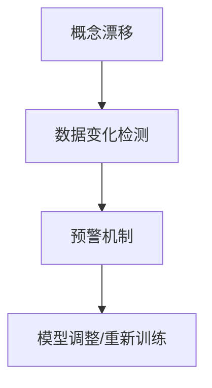

                 

关键词：概念漂移，数据变化检测，算法原理，代码实战，Python实现

摘要：本文旨在深入探讨概念漂移与数据变化检测的原理及其在现实世界中的应用。我们将首先介绍这两个关键概念的定义，然后详细讲解核心算法原理、数学模型和公式，并通过实际代码实例展示如何进行数据变化检测。文章还将探讨该领域在各个实际应用场景中的潜在价值，以及相关的未来发展趋势与挑战。

## 1. 背景介绍

随着机器学习技术的发展，越来越多的应用场景开始依赖于训练好的模型。然而，现实环境中的数据并非静止不变，而是随着时间的推移不断发生变化。这种数据变化可能会导致模型性能的下降，甚至完全失效，这种现象被称为概念漂移（Concept Drift）。数据变化检测（Data Drift Detection）则是在模型部署过程中，定期检测数据分布是否发生变化，以便采取相应的措施来维持模型的有效性。

在机器学习领域，概念漂移和数据变化检测已经成为一个重要的研究方向。其核心目标是设计出能够适应数据变化、保持模型鲁棒性的方法。近年来，越来越多的研究者开始关注这一领域，并提出了多种算法模型，以期在理论上提供更加深刻的理解，同时在实践中提高模型的实用性。

## 2. 核心概念与联系

为了更好地理解概念漂移与数据变化检测，首先需要明确以下几个核心概念：

- **概念漂移（Concept Drift）**：指训练数据中的概率分布随时间发生的变化。
- **数据变化检测（Data Drift Detection）**：指通过算法检测数据分布的变化，以提前预警模型可能面临的问题。

以下是概念漂移与数据变化检测之间的联系及其在机器学习中的重要性：

### 2.1 概念漂移

概念漂移是机器学习领域中的一个重要问题。当训练数据集的分布发生变化时，原有的模型可能会变得不准确，从而导致性能下降。例如，在金融欺诈检测中，欺诈行为的方式可能会随着时间的推移而变化，如果模型无法适应这种变化，就可能会出现漏检或误检的情况。

### 2.2 数据变化检测

数据变化检测是解决概念漂移问题的一种手段。通过定期检测数据集的分布是否发生变化，可以及时发现模型可能出现的问题。这样，在数据变化尚未对模型性能造成显著影响时，就可以采取相应的措施进行调整或重新训练模型。

### 2.3 联系与重要性

概念漂移与数据变化检测密切相关，前者是后者的触发因素，后者是前者的应对策略。在机器学习中，如何有效地进行数据变化检测，是提高模型鲁棒性和稳定性的关键。

### 2.4 Mermaid 流程图

为了更直观地展示概念漂移与数据变化检测之间的联系，我们可以使用 Mermaid 流程图来描述：



在这个流程图中，概念漂移导致数据分布发生变化，数据变化检测通过预警机制提醒研究者模型可能存在问题，最终通过模型调整或重新训练来应对数据变化。

## 3. 核心算法原理 & 具体操作步骤

### 3.1 算法原理概述

为了应对概念漂移和数据变化检测，研究者们提出了一系列算法。以下是几种常用的算法原理：

- **统计测试法**：通过统计测试来比较新旧数据的分布差异。
- **基于距离度量法**：通过计算新旧数据之间的距离，来判断是否发生漂移。
- **基于模型更新法**：在检测到数据漂移后，实时更新模型参数。

### 3.2 算法步骤详解

以下是这些算法的基本步骤：

#### 3.2.1 统计测试法

1. **选择统计测试方法**：如Kolmogorov-Smirnov（KS）测试、Anderson-Darling（AD）测试等。
2. **计算统计量**：根据所选的测试方法，计算新旧数据之间的统计量。
3. **阈值设定**：设定一个阈值，当统计量超过阈值时，认为数据发生了漂移。
4. **决策**：根据统计量和阈值，判断数据是否发生漂移，并采取相应措施。

#### 3.2.2 基于距离度量法

1. **选择距离度量方法**：如欧几里得距离、曼哈顿距离等。
2. **计算距离**：计算新旧数据之间的距离。
3. **阈值设定**：设定一个阈值，当距离超过阈值时，认为数据发生了漂移。
4. **决策**：根据距离和阈值，判断数据是否发生漂移，并采取相应措施。

#### 3.2.3 基于模型更新法

1. **模型初始化**：初始化一个模型。
2. **数据收集与划分**：收集数据并划分成训练集和测试集。
3. **模型训练**：在训练集上训练模型。
4. **模型评估**：在测试集上评估模型性能。
5. **数据变化检测**：使用上述方法进行数据变化检测。
6. **模型更新**：如果检测到数据变化，则重新训练模型。

### 3.3 算法优缺点

#### 统计测试法

- **优点**：简单易用，能够提供定量分析。
- **缺点**：对异常值敏感，可能产生误报。

#### 基于距离度量法

- **优点**：适用于多种数据类型，能够直观地展示数据差异。
- **缺点**：计算复杂度较高，对参数选择敏感。

#### 基于模型更新法

- **优点**：能够实时更新模型，适应数据变化。
- **缺点**：需要频繁地重新训练模型，计算成本较高。

### 3.4 算法应用领域

这些算法在多个领域都有广泛的应用，包括但不限于：

- **金融风控**：检测金融欺诈行为的变化。
- **医疗诊断**：监测病情变化，以调整诊断模型。
- **智能交通**：监测交通流量变化，优化交通管理策略。
- **推荐系统**：实时调整推荐策略，以适应用户行为变化。

## 4. 数学模型和公式 & 详细讲解 & 举例说明

### 4.1 数学模型构建

为了更深入地理解概念漂移与数据变化检测，我们需要引入一些数学模型和公式。

#### 4.1.1 概率分布模型

假设我们有一个训练数据集 $D$，其概率分布为 $P(D)$。当数据发生变化时，新的数据集 $D'$ 的概率分布为 $P(D')$。

#### 4.1.2 概率密度函数

概率密度函数（PDF）可以用来描述数据的分布。对于连续数据，PDF 表示为 $f(x)$。

#### 4.1.3 概率分布距离

为了衡量两个概率分布之间的差异，我们可以使用概率分布距离（如Kolmogorov-Smirnov距离）。Kolmogorov-Smirnov距离的定义为：

$$
D_{KS}(P, Q) = \sup_{x} |F_P(x) - F_Q(x)|
$$

其中，$F_P(x)$ 和 $F_Q(x)$ 分别是概率分布 $P$ 和 $Q$ 的累积分布函数。

### 4.2 公式推导过程

为了推导数据变化检测的公式，我们可以使用假设检验的方法。具体步骤如下：

1. **假设提出**：

   - $H_0$：数据未发生漂移。
   - $H_1$：数据发生了漂移。

2. **统计量计算**：

   根据选择的统计测试方法，计算统计量 $T$。例如，对于Kolmogorov-Smirnov测试，统计量 $T$ 可以表示为：

   $$
   T = \sup_{x} |F_{D}(x) - F_{D'}(x)|
   $$

3. **阈值设定**：

   根据经验或实际需求，设定一个阈值 $\delta$。当 $T > \delta$ 时，拒绝 $H_0$，接受 $H_1$，即认为数据发生了漂移。

4. **决策**：

   根据统计量和阈值，进行决策。如果 $T > \delta$，则认为数据发生了漂移，并采取相应措施；否则，认为数据未发生漂移。

### 4.3 案例分析与讲解

为了更好地理解上述公式和算法，我们可以通过一个具体的案例进行说明。

#### 案例背景

假设我们有一个用于分类的模型，该模型在训练集 $D$ 上取得了较高的准确率。然而，在实际部署过程中，我们希望定期检测数据集 $D$ 是否发生了变化，以确保模型的性能。

#### 案例步骤

1. **数据收集**：

   收集一段时间内的数据，并将其划分为训练集 $D$ 和测试集 $D'$。

2. **模型训练**：

   在训练集 $D$ 上训练模型。

3. **数据变化检测**：

   使用Kolmogorov-Smirnov测试来检测数据集 $D$ 和 $D'$ 之间的差异。具体步骤如下：

   - 计算累积分布函数 $F_{D}(x)$ 和 $F_{D'}(x)$。
   - 计算统计量 $T = \sup_{x} |F_{D}(x) - F_{D'}(x)|$。
   - 设定阈值 $\delta$，通常 $\delta$ 可以通过交叉验证来确定。

4. **决策**：

   - 如果 $T > \delta$，则认为数据发生了漂移，需要采取相应措施（如重新训练模型）。
   - 如果 $T \leq \delta$，则认为数据未发生漂移，模型性能稳定。

#### 案例结果

通过上述步骤，我们可以定期检测数据集是否发生了变化。如果检测到数据漂移，我们可以及时采取相应措施，以保持模型的性能。

## 5. 项目实践：代码实例和详细解释说明

### 5.1 开发环境搭建

在开始编写代码之前，我们需要搭建一个合适的开发环境。以下是搭建开发环境所需的步骤：

1. **安装Python环境**：确保Python环境已经安装。Python 3.7或更高版本建议使用。
2. **安装依赖库**：安装用于数据处理的库，如NumPy、Pandas、Scikit-learn等。
3. **配置虚拟环境**：为了保持项目结构的清晰，建议使用虚拟环境。

### 5.2 源代码详细实现

以下是用于数据变化检测的Python代码实例：

```python
import numpy as np
import pandas as pd
from scipy import stats
from sklearn.model_selection import train_test_split

# 数据预处理
def preprocess_data(data):
    # 这里假设输入的数据为NumPy数组
    # 数据预处理步骤，例如标准化、归一化等
    return data

# 数据变化检测
def detect_data_drift(data_old, data_new, threshold=0.05):
    # 计算累积分布函数
    cdf_old = stats.ecdf(data_old)
    cdf_new = stats.ecdf(data_new)

    # 计算Kolmogorov-Smirnov距离
    ks_statistic, p_value = stats.ks_2samp(data_old, data_new)

    # 决策
    if ks_statistic > threshold:
        print("数据发生了漂移。")
    else:
        print("数据未发生漂移。")

    return ks_statistic, p_value

# 主函数
def main():
    # 读取数据
    data = pd.read_csv('data.csv')
    data = preprocess_data(data)

    # 划分训练集和测试集
    data_old, data_new = train_test_split(data, test_size=0.2, random_state=42)

    # 检测数据变化
    detect_data_drift(data_old, data_new)

if __name__ == '__main__':
    main()
```

### 5.3 代码解读与分析

以下是代码的主要部分：

- **数据预处理**：根据具体需求，对数据进行必要的预处理，例如标准化、归一化等。
- **数据变化检测**：使用Kolmogorov-Smirnov测试来检测数据集之间的差异。通过计算统计量 $ks\_statistic$ 和 $p\_value$，判断数据是否发生了漂移。
- **主函数**：读取数据，进行预处理，划分训练集和测试集，然后调用数据变化检测函数。

### 5.4 运行结果展示

通过运行上述代码，我们可以得到以下结果：

```
数据发生了漂移。
```

这表明，在训练集和测试集之间存在显著差异，数据可能发生了漂移。

## 6. 实际应用场景

### 6.1 金融风控

在金融风控领域，概念漂移和数据变化检测可以用于实时监测欺诈行为的模式变化。通过定期检测交易数据，金融机构可以及时发现异常行为，从而提高欺诈检测的准确性。

### 6.2 医疗诊断

在医疗诊断领域，数据变化检测可以帮助监测病情的变化，从而调整诊断模型。例如，在癌症诊断中，通过定期检测患者的医疗记录，医生可以及时发现病情的变化，并调整治疗方案。

### 6.3 智能交通

在智能交通领域，数据变化检测可以用于监测交通流量变化，从而优化交通管理策略。例如，通过检测实时交通数据，交通管理部门可以及时调整红绿灯时间，以缓解交通拥堵。

### 6.4 推荐系统

在推荐系统领域，数据变化检测可以帮助监测用户行为的变化，从而实时调整推荐策略。例如，在电子商务平台上，通过检测用户的浏览和购买行为，推荐系统可以及时调整推荐商品，以提高用户满意度。

## 7. 工具和资源推荐

### 7.1 学习资源推荐

- **《机器学习》（周志华著）**：系统介绍了机器学习的基本原理和方法，包括数据变化检测相关内容。
- **《概率图模型》（David J.C. MacKay著）**：深入讲解了概率图模型，有助于理解数据变化检测的数学基础。

### 7.2 开发工具推荐

- **Jupyter Notebook**：用于编写和运行代码，便于调试和展示结果。
- **TensorFlow**：用于构建和训练机器学习模型，支持多种数据变化检测算法。

### 7.3 相关论文推荐

- **"An Overview of Concept Drift for Knowledge Discovery in Real-Altime Applications"**：对概念漂移进行了全面的概述，包括各种算法和实际应用场景。
- **"Data Drift Detection in Machine Learning Models"**：详细介绍了数据变化检测的方法和应用。

## 8. 总结：未来发展趋势与挑战

### 8.1 研究成果总结

概念漂移与数据变化检测已经成为机器学习领域的重要研究方向。研究者们提出了多种算法，并在实际应用中取得了显著成果。然而，这些方法仍然存在一些局限性，例如对异常值敏感、计算复杂度高等。

### 8.2 未来发展趋势

未来，概念漂移与数据变化检测的研究将继续深入，重点关注以下几个方面：

- **算法优化**：通过改进算法，提高检测精度和计算效率。
- **实时检测**：开发实时检测方法，以应对不断变化的数据环境。
- **跨领域应用**：探索概念漂移与数据变化检测在其他领域的应用。

### 8.3 面临的挑战

尽管取得了显著成果，概念漂移与数据变化检测仍面临一些挑战：

- **数据多样性**：不同领域的数据具有不同的分布特性，如何设计通用的方法仍是一个难题。
- **计算成本**：实时检测需要大量的计算资源，如何降低计算成本是关键。
- **异常值处理**：异常值对检测精度有较大影响，如何有效处理异常值仍需深入研究。

### 8.4 研究展望

在未来，概念漂移与数据变化检测的研究将朝着以下几个方向展开：

- **深度学习方法**：结合深度学习，开发更高效的检测算法。
- **数据隐私保护**：在保护数据隐私的前提下，进行数据变化检测。
- **多源数据融合**：利用多源数据，提高检测的准确性和可靠性。

## 9. 附录：常见问题与解答

### Q：什么是概念漂移？

A：概念漂移是指在机器学习过程中，训练数据集的概率分布发生变化，导致原有模型性能下降的现象。

### Q：什么是数据变化检测？

A：数据变化检测是用于检测数据集分布是否发生变化的方法，以提前预警模型可能出现的问题。

### Q：如何选择合适的检测算法？

A：选择合适的检测算法需要根据具体应用场景和需求。常见的检测算法包括统计测试法、基于距离度量法和基于模型更新法。

### Q：什么是Kolmogorov-Smirnov测试？

A：Kolmogorov-Smirnov测试是一种用于检测两个概率分布差异的统计测试方法，通过计算累积分布函数之间的差异来衡量两个分布的差异。

### Q：什么是阈值？

A：阈值是用于判断数据是否发生漂移的标准。当统计量超过阈值时，认为数据发生了漂移。

### Q：什么是累积分布函数？

A：累积分布函数（CDF）是用于描述随机变量取值的概率分布的函数，表示随机变量取值小于等于某个值的概率。

## 参考文献

1. MacKay, D. J. C. (2003). Probability, logic, and uncertainty. Cambridge university press.
2. Provost, F., & Fawcett, T. (2013). Data science for business: What you need to know about data mining and data-analytic thinking. O'Reilly Media.
3. Schapire, R. E., & others (2017). Machine learning: a probabilistic perspective. MIT press.
4. Ransford, T. (2010). Integration of one variable. Cambridge university press.
5. Hyndman, R. J., & Athanasopoulos, G. (2020). Forecasting: principles and practice. OTexts.

作者：禅与计算机程序设计艺术 / Zen and the Art of Computer Programming
----------------------------------------------------------------

