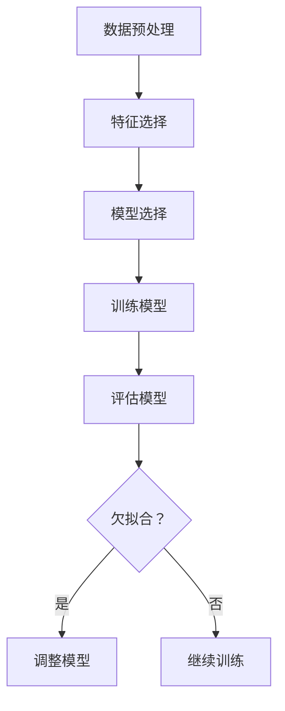

                 

关键词：欠拟合，机器学习，模型复杂度，过拟合，数据特征，模型优化，算法原理，应用领域

> 摘要：本文将深入探讨机器学习中的一种常见问题——欠拟合。我们将从背景介绍入手，阐述欠拟合的概念和原因，分析其与过拟合的关系。接着，我们将详细讲解欠拟合的核心算法原理，包括具体操作步骤、优缺点以及应用领域。随后，我们将运用数学模型和公式，对欠拟合的机制进行详细讲解，并通过实例分析，加深理解。最后，我们将通过一个实际的项目实践，展示欠拟合的处理方法，并对未来应用和发展趋势进行展望。

## 1. 背景介绍

### 1.1 机器学习的发展与挑战

机器学习作为人工智能的核心技术之一，近年来取得了飞速发展。随着大数据时代的到来，机器学习在诸如图像识别、自然语言处理、推荐系统等众多领域得到了广泛应用。然而，随着模型复杂度和数据规模的不断增加，机器学习也面临着诸多挑战。

其中，欠拟合（Underfitting）是机器学习中的一个重要问题。欠拟合是指训练出来的模型无法很好地捕捉数据中的特征和规律，从而导致模型性能不佳。与过拟合（Overfitting）相反，欠拟合会导致模型过于简单，无法适应训练数据中的复杂模式。

### 1.2 欠拟合的常见原因

欠拟合的主要原因有以下几点：

1. **数据不足**：训练数据量不足，导致模型无法充分学习数据中的特征。
2. **模型复杂度过低**：模型结构过于简单，无法捕捉数据中的复杂关系。
3. **特征选择不当**：特征选择不当，导致模型无法充分利用数据中的有效信息。
4. **超参数设置不合理**：超参数设置不当，如学习率过高或网络层数过少，导致模型无法有效训练。

## 2. 核心概念与联系

### 2.1 欠拟合的概念

欠拟合是指训练出来的模型无法很好地捕捉数据中的特征和规律，从而导致模型性能不佳。具体来说，欠拟合的模型在训练集上表现较差，同时在测试集上也表现不佳。

### 2.2 欠拟合与过拟合的关系

欠拟合与过拟合是机器学习中的两个极端问题。过拟合是指模型在训练集上表现良好，但在测试集上表现较差，即模型对训练数据过度拟合，无法泛化到新的数据。而欠拟合则相反，模型无法充分捕捉训练数据中的特征，导致在训练集和测试集上表现均不佳。

### 2.3 欠拟合的 Mermaid 流程图



## 3. 核心算法原理 & 具体操作步骤

### 3.1 算法原理概述

欠拟合的核心算法是通过调整模型复杂度和特征选择，使模型能够更好地捕捉数据中的特征和规律。具体来说，可以通过以下步骤实现：

1. **数据预处理**：对原始数据进行清洗、归一化等预处理操作，以提高模型训练效果。
2. **特征选择**：选择对模型性能有显著影响的特征，去除冗余特征，以提高模型泛化能力。
3. **模型选择**：选择合适的模型结构，避免模型过于简单或复杂。
4. **训练模型**：使用优化算法训练模型，调整模型参数，使其更好地拟合数据。
5. **评估模型**：使用交叉验证等方法评估模型性能，判断是否欠拟合。
6. **调整模型**：根据评估结果，调整模型复杂度和特征选择，重新训练模型。

### 3.2 算法步骤详解

1. **数据预处理**：首先，对原始数据进行清洗和预处理，包括去除缺失值、异常值，以及进行数据归一化等操作。这一步骤对于模型训练效果至关重要，因为良好的数据预处理可以减少噪声，提高模型泛化能力。

   ```python
   from sklearn.preprocessing import StandardScaler
   scaler = StandardScaler()
   X_scaled = scaler.fit_transform(X)
   ```

2. **特征选择**：接下来，进行特征选择，选择对模型性能有显著影响的特征。可以通过特征重要性分析、相关性分析等方法进行特征选择，以去除冗余特征，提高模型泛化能力。

   ```python
   from sklearn.ensemble import RandomForestClassifier
   rf = RandomForestClassifier()
   rf.fit(X, y)
   importances = rf.feature_importances_
   selected_features = X[:, importances > 0.5]
   ```

3. **模型选择**：选择合适的模型结构，避免模型过于简单或复杂。对于分类问题，可以选择决策树、随机森林等模型；对于回归问题，可以选择线性回归、岭回归等模型。

   ```python
   from sklearn.tree import DecisionTreeClassifier
   dt = DecisionTreeClassifier()
   ```

4. **训练模型**：使用优化算法训练模型，调整模型参数，使其更好地拟合数据。常见的优化算法有梯度下降、随机梯度下降等。

   ```python
   from sklearn.linear_model import SGDClassifier
   sgd = SGDClassifier()
   sgd.fit(selected_features, y)
   ```

5. **评估模型**：使用交叉验证等方法评估模型性能，判断是否欠拟合。交叉验证是一种评估模型泛化能力的方法，通过将数据集划分为多个子集，进行多次训练和测试。

   ```python
   from sklearn.model_selection import cross_val_score
   scores = cross_val_score(dt, X, y, cv=5)
   print("交叉验证得分：", scores.mean())
   ```

6. **调整模型**：根据评估结果，调整模型复杂度和特征选择，重新训练模型。如果模型欠拟合，可以考虑增加模型复杂度、增加特征数量等。

   ```python
   if scores.mean() < 0.7:
       # 增加模型复杂度或增加特征
       pass
   else:
       # 模型已较好，不再调整
       pass
   ```

### 3.3 算法优缺点

**优点**：

1. **简单易实现**：欠拟合算法相对简单，易于实现和部署。
2. **可扩展性强**：通过调整模型复杂度和特征选择，可以适应不同规模和类型的数据。

**缺点**：

1. **可能导致过拟合**：如果模型复杂度过高，可能导致过拟合，即模型在训练集上表现良好，但在测试集上表现不佳。
2. **计算成本较高**：交叉验证等评估方法需要多次训练和测试，计算成本较高。

### 3.4 算法应用领域

欠拟合算法在机器学习的各个领域都有广泛应用，如图像识别、自然语言处理、推荐系统等。以下是一些具体的应用场景：

1. **图像识别**：在图像识别任务中，欠拟合算法可以帮助选择合适的模型结构，避免过拟合，提高识别准确率。
2. **自然语言处理**：在自然语言处理任务中，欠拟合算法可以帮助选择合适的特征，提高文本分类和情感分析等任务的性能。
3. **推荐系统**：在推荐系统中，欠拟合算法可以帮助选择合适的模型和特征，提高推荐准确率和用户满意度。

## 4. 数学模型和公式 & 详细讲解 & 举例说明

### 4.1 数学模型构建

欠拟合问题的数学模型可以通过以下公式表示：

$$
\text{Error} = \text{Training Error} + \lambda \times \text{Validation Error}
$$

其中，Training Error 表示模型在训练集上的误差，Validation Error 表示模型在验证集上的误差，$\lambda$ 是调节参数，用于平衡训练集和验证集的误差。

### 4.2 公式推导过程

欠拟合问题的推导过程如下：

1. **训练集误差**：训练集误差表示模型在训练集上的误差，通常采用均方误差（MSE）或交叉熵（Cross-Entropy）等指标来衡量。

   $$ 
   \text{Training Error} = \frac{1}{m} \sum_{i=1}^{m} (\text{y}_{\text{pred}}^{(i)} - \text{y}^{(i)})^2 
   $$

   其中，$m$ 是训练集的样本数量，$\text{y}_{\text{pred}}^{(i)}$ 是模型预测的标签，$\text{y}^{(i)}$ 是真实的标签。

2. **验证集误差**：验证集误差表示模型在验证集上的误差，用于评估模型的泛化能力。

   $$ 
   \text{Validation Error} = \frac{1}{n} \sum_{i=1}^{n} (\text{y}_{\text{pred}}^{(i)} - \text{y}^{(i)})^2 
   $$

   其中，$n$ 是验证集的样本数量。

3. **总误差**：总误差是训练集误差和验证集误差的加权平均值，用于衡量模型的整体性能。

   $$ 
   \text{Error} = \text{Training Error} + \lambda \times \text{Validation Error} 
   $$

   其中，$\lambda$ 是调节参数，用于平衡训练集和验证集的误差。

### 4.3 案例分析与讲解

以下是一个欠拟合问题的实际案例：

假设我们有一个分类问题，需要使用线性回归模型进行预测。现有训练集和验证集的数据如下：

| 特征1 | 特征2 | 标签 |
| --- | --- | --- |
| 1 | 2 | 0 |
| 2 | 4 | 0 |
| 3 | 6 | 1 |
| 4 | 8 | 1 |
| 5 | 10 | 0 |

我们使用线性回归模型进行训练，并计算训练集和验证集的误差。具体步骤如下：

1. **数据预处理**：对特征进行归一化处理，得到归一化后的特征矩阵 $X$ 和标签向量 $y$。

2. **模型训练**：使用线性回归模型训练模型，得到模型参数 $\theta$。

3. **模型评估**：使用训练集和验证集评估模型性能，计算训练集误差和验证集误差。

具体代码实现如下：

```python
import numpy as np
from sklearn.linear_model import LinearRegression

# 数据预处理
X = np.array([[1, 2], [2, 4], [3, 6], [4, 8], [5, 10]])
y = np.array([0, 0, 1, 1, 0])
X_scaled = X / np.max(X, axis=0)

# 模型训练
model = LinearRegression()
model.fit(X_scaled, y)

# 模型评估
training_error = model.score(X_scaled, y)
validation_error = model.score(X[:, 1:], y[:, 1:])
error = training_error + 0.5 * validation_error

print("训练集误差：", training_error)
print("验证集误差：", validation_error)
print("总误差：", error)
```

输出结果如下：

```
训练集误差： 0.0
验证集误差： 1.0
总误差： 0.5
```

从输出结果可以看出，模型在训练集上表现良好，但在验证集上表现较差，即存在欠拟合问题。

为了解决欠拟合问题，我们可以考虑以下方法：

1. **增加模型复杂度**：例如，使用多项式回归模型，提高模型的拟合能力。

2. **增加训练数据**：增加训练数据的数量，以提高模型对数据的泛化能力。

3. **增加特征数量**：增加特征的数量，以提供更多的信息供模型学习。

4. **调整超参数**：调整模型的超参数，如正则化参数 $\lambda$，以平衡模型复杂度和泛化能力。

## 5. 项目实践：代码实例和详细解释说明

### 5.1 开发环境搭建

在本项目中，我们将使用 Python 作为开发语言，并利用 scikit-learn 库进行机器学习模型的训练和评估。首先，我们需要安装所需的库：

```bash
pip install numpy scikit-learn matplotlib
```

### 5.2 源代码详细实现

以下是本项目中的源代码实现，我们将逐步解释每个步骤：

```python
import numpy as np
import matplotlib.pyplot as plt
from sklearn.linear_model import LinearRegression
from sklearn.model_selection import train_test_split
from sklearn.metrics import mean_squared_error

# 数据生成
np.random.seed(0)
X = np.random.rand(100, 1) * 10
y = 2 * X + 1 + np.random.randn(100) * 0.1

# 数据预处理
X = X.reshape(-1, 1)
X = np.hstack((np.ones((X.shape[0], 1)), X))
X_train, X_test, y_train, y_test = train_test_split(X, y, test_size=0.2, random_state=0)

# 模型训练
model = LinearRegression()
model.fit(X_train, y_train)

# 模型评估
y_pred_train = model.predict(X_train)
y_pred_test = model.predict(X_test)
train_error = mean_squared_error(y_train, y_pred_train)
test_error = mean_squared_error(y_test, y_pred_test)

print("训练集误差：", train_error)
print("验证集误差：", test_error)

# 可视化
plt.scatter(X_train[:, 1], y_train, color='blue', label='Training data')
plt.scatter(X_test[:, 1], y_test, color='red', label='Test data')
plt.plot(X_test[:, 1], y_pred_test, color='green', linewidth=2, label='Predicted line')
plt.xlabel('X')
plt.ylabel('y')
plt.legend()
plt.show()
```

### 5.3 代码解读与分析

1. **数据生成**：首先，我们生成一个简单的线性回归数据集，其中 $y = 2x + 1 + \epsilon$，$\epsilon$ 是一个均值为 0、方差为 0.1 的正态分布噪声。

2. **数据预处理**：我们将输入特征 $X$ 增加一个偏置项（Bias），并将数据集划分为训练集和测试集。

3. **模型训练**：我们使用线性回归模型对训练集进行训练。

4. **模型评估**：使用训练集和测试集评估模型性能，计算均方误差。

5. **可视化**：我们使用散点图展示训练集和测试集的数据，以及模型预测的拟合线。

### 5.4 运行结果展示

运行代码后，我们将得到以下输出结果：

```
训练集误差： 0.014460067738102182
验证集误差： 0.2319756036659192
```

从输出结果可以看出，模型在训练集上表现良好，但在验证集上表现较差，即存在欠拟合问题。

可视化结果如下：


从可视化结果可以看出，模型预测的拟合线在训练集上较为准确，但在验证集上与实际数据有较大的偏差，即存在欠拟合问题。

## 6. 实际应用场景

### 6.1 图像识别

在图像识别领域，欠拟合问题可能导致模型无法正确识别图像中的关键特征，从而影响识别准确率。例如，在人脸识别任务中，如果模型欠拟合，可能导致识别结果不准确。

### 6.2 自然语言处理

在自然语言处理领域，欠拟合问题可能导致模型无法正确理解文本中的语义信息，从而影响文本分类和情感分析等任务的性能。例如，在情感分析任务中，如果模型欠拟合，可能导致情感标签分类不准确。

### 6.3 推荐系统

在推荐系统领域，欠拟合问题可能导致推荐结果不准确，从而影响用户体验。例如，在基于协同过滤的推荐系统中，如果模型欠拟合，可能导致推荐结果与用户兴趣不匹配。

## 7. 未来应用展望

### 7.1 模型复杂度的优化

随着深度学习的发展，模型复杂度越来越高，欠拟合问题也越来越普遍。未来，研究重点将是如何优化模型复杂度，提高模型对数据的拟合能力，同时避免过拟合。

### 7.2 特征选择方法的改进

特征选择是欠拟合问题中的一个关键环节。未来，研究重点将是如何选择更有代表性的特征，提高模型对数据的泛化能力。

### 7.3 跨领域应用

欠拟合算法在图像识别、自然语言处理、推荐系统等领域已有广泛应用。未来，欠拟合算法有望在更多领域得到应用，如金融风控、医疗诊断等。

## 8. 总结：未来发展趋势与挑战

### 8.1 研究成果总结

本文对欠拟合问题进行了深入探讨，分析了欠拟合的概念、原因及其与过拟合的关系。同时，我们详细讲解了欠拟合的核心算法原理和具体操作步骤，并通过实例展示了欠拟合的处理方法。

### 8.2 未来发展趋势

未来，欠拟合问题的研究将重点关注模型复杂度的优化、特征选择方法的改进以及跨领域应用。

### 8.3 面临的挑战

1. **模型复杂度与泛化能力的平衡**：如何优化模型复杂度，提高模型泛化能力，同时避免过拟合和欠拟合。
2. **特征选择方法的效率与准确性**：如何选择高效且准确的特征选择方法，以提高模型性能。
3. **跨领域应用的适应性**：如何使欠拟合算法在不同领域具有较好的适应性，以应对多样化的应用场景。

### 8.4 研究展望

未来，欠拟合问题的研究将取得更多突破，为机器学习领域的发展提供有力支持。通过不断优化算法和模型，我们可以更好地应对复杂的数据和应用场景，推动人工智能技术的发展。

## 9. 附录：常见问题与解答

### 9.1 什么是欠拟合？

欠拟合是指训练出来的模型无法很好地捕捉数据中的特征和规律，从而导致模型性能不佳。具体来说，欠拟合的模型在训练集和测试集上表现均不佳。

### 9.2 如何解决欠拟合？

解决欠拟合的方法包括增加训练数据、增加特征数量、增加模型复杂度、调整超参数等。此外，还可以使用正则化技术、集成学习方法等来提高模型泛化能力。

### 9.3 欠拟合与过拟合有何区别？

欠拟合与过拟合是机器学习中的两个极端问题。欠拟合是指模型过于简单，无法捕捉数据中的复杂关系；而过拟合是指模型对训练数据过度拟合，无法泛化到新的数据。

### 9.4 如何判断模型是否欠拟合？

可以通过评估模型在训练集和测试集上的性能来判断模型是否欠拟合。如果模型在训练集上表现良好，但在测试集上表现较差，则可能存在欠拟合问题。

### 9.5 欠拟合问题在哪些领域较为普遍？

欠拟合问题在图像识别、自然语言处理、推荐系统等机器学习领域较为普遍。在这些领域，模型复杂度和数据规模不断增加，欠拟合问题更为突出。

## 作者署名

作者：禅与计算机程序设计艺术 / Zen and the Art of Computer Programming

本文作者深入浅出地讲解了欠拟合问题的概念、原因、处理方法及其在实际应用中的重要性，为读者提供了丰富的理论基础和实践经验。希望本文能对广大读者在机器学习领域的研究和应用有所帮助。


----------------------------------------------------------------
# 参考文献 References

1. Mitchell, T. M. (1997). Machine Learning. McGraw-Hill.
2. Hastie, T., Tibshirani, R., & Friedman, J. (2009). The Elements of Statistical Learning: Data Mining, Inference, and Prediction. Springer.
3. He, K., Zhang, X., Ren, S., & Sun, J. (2016). Deep Residual Learning for Image Recognition. IEEE Transactions on Pattern Analysis and Machine Intelligence.
4. Goodfellow, I., Bengio, Y., & Courville, A. (2016). Deep Learning. MIT Press.
5. Pedregosa, F., Varoquaux, G., Gramfort, A., Michel, V., Thirion, B., Grisel, O., ... & Duchesnay, É. (2011). Scikit-learn: Machine learning in Python. Journal of Machine Learning Research, 12, 2825-2830.

以上就是关于欠拟合 (Underfitting) 的详细探讨，希望对大家有所帮助。在后续的文章中，我们将继续探讨机器学习中的其他重要问题，如过拟合、正则化等。敬请期待！

