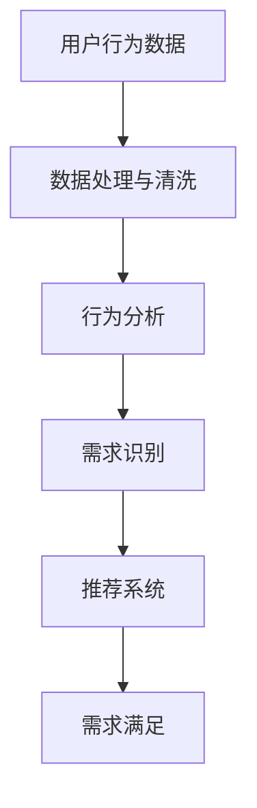

                 

随着人工智能（AI）技术的飞速发展，个性化已成为现代社会的关键词之一。从推荐系统到定制化产品，AI正逐步深入到我们生活的各个方面，满足我们的个性化需求。本文旨在探讨如何通过AI实现欲望的个性化，从而为用户提供更加精准和满意的需求满足。

> 关键词：人工智能、个性化、需求满足、定制化、用户体验

## 1. 背景介绍

个性化需求满足是一种新兴的用户服务模式，它基于用户的行为、偏好和历史数据，通过智能算法和模型，为用户推荐最适合的产品或服务。这种模式在电子商务、社交媒体、金融、医疗等多个领域得到了广泛应用，显著提升了用户体验和满意度。

然而，随着用户需求的不断变化和多样化，如何实现高效、精准的个性化需求满足成为一个亟待解决的问题。传统的方法往往依赖于规则或简单的统计模型，难以应对复杂的个性化需求。而AI技术的引入，为我们提供了一种全新的解决方案。

## 2. 核心概念与联系

### 2.1 个性化需求的定义与类型

个性化需求是指用户在特定情境下，根据个人偏好、历史行为和现实需求，对产品或服务提出的独特要求。根据需求来源，个性化需求可以分为以下几类：

- **主动需求**：用户主动表达出来的需求，如在线购物时选择的产品类型、颜色、尺寸等。
- **被动需求**：通过用户行为和偏好分析预测出的潜在需求，如用户浏览过的商品、阅读过的文章等。

### 2.2 AI在需求满足中的应用

AI技术通过数据挖掘、机器学习、深度学习等方法，可以从海量数据中提取有价值的信息，用于个性化需求的识别和满足。具体应用包括：

- **用户行为分析**：通过分析用户的浏览、搜索、购买等行为，了解用户的偏好和兴趣。
- **推荐系统**：基于用户的个性化需求，为用户推荐最感兴趣的产品或服务。
- **预测模型**：预测用户的未来行为和需求，提前做好准备。

### 2.3 Mermaid 流程图



## 3. 核心算法原理 & 具体操作步骤

### 3.1 算法原理概述

个性化需求满足的核心算法包括以下几个步骤：

1. **用户行为数据收集**：通过网站、APP等渠道收集用户的浏览、搜索、购买等行为数据。
2. **数据处理与清洗**：对收集到的数据进行处理和清洗，去除噪声和异常值。
3. **行为分析**：通过统计分析和机器学习模型，提取用户的行为特征和偏好。
4. **需求识别**：根据用户特征和偏好，识别用户的个性化需求。
5. **推荐系统**：利用协同过滤、基于内容的推荐等方法，为用户推荐合适的产品或服务。
6. **需求满足**：将推荐结果呈现给用户，并提供购买、预约等操作。

### 3.2 算法步骤详解

#### 3.2.1 用户行为数据收集

用户行为数据收集是个性化需求满足的基础。数据来源包括：

- **网站日志**：记录用户在网站上的浏览、搜索、点击等行为。
- **APP日志**：记录用户在使用APP时的操作，如下载、安装、使用时长等。
- **问卷调查**：通过问卷了解用户的偏好和需求。

#### 3.2.2 数据处理与清洗

数据处理与清洗包括以下步骤：

- **数据整合**：将不同来源的数据进行整合，形成一个统一的数据集。
- **去重**：去除重复的数据记录，确保数据的一致性。
- **噪声去除**：去除异常值和噪声数据，提高数据质量。

#### 3.2.3 行为分析

行为分析主要通过以下方法进行：

- **关联规则挖掘**：通过关联规则挖掘，发现用户行为之间的联系。
- **聚类分析**：通过聚类分析，将具有相似行为的用户划分为不同的群体。
- **特征提取**：提取用户行为特征，如浏览时长、购买频率、搜索关键词等。

#### 3.2.4 需求识别

需求识别主要通过以下方法进行：

- **基于规则的识别**：根据预设的规则，识别用户的需求。
- **机器学习模型**：通过训练机器学习模型，自动识别用户的需求。

#### 3.2.5 推荐系统

推荐系统主要采用以下方法：

- **协同过滤**：基于用户行为数据，为用户推荐与其相似的物品。
- **基于内容的推荐**：根据用户兴趣和物品内容，为用户推荐相关的物品。

#### 3.2.6 需求满足

需求满足主要通过以下方法进行：

- **个性化展示**：根据用户需求，为用户展示个性化的推荐结果。
- **操作引导**：为用户提供购买、预约等操作引导。

### 3.3 算法优缺点

#### 优点

- **高效性**：通过算法自动识别用户需求，大大提高了推荐效率。
- **精准性**：基于用户行为数据和机器学习模型，推荐的精准度较高。
- **用户体验**：个性化的推荐结果提升了用户的满意度。

#### 缺点

- **数据依赖性**：算法依赖于用户行为数据，数据质量对推荐效果有重要影响。
- **隐私问题**：收集用户行为数据可能涉及隐私问题，需注意保护用户隐私。

### 3.4 算法应用领域

个性化需求满足算法在多个领域得到广泛应用：

- **电子商务**：为用户推荐最适合的商品，提升购买转化率。
- **社交媒体**：为用户推荐感兴趣的内容，提升用户活跃度。
- **金融**：为用户提供个性化的金融产品和服务，提高用户体验。
- **医疗**：根据用户健康数据，为用户提供个性化的医疗建议。

## 4. 数学模型和公式 & 详细讲解 & 举例说明

### 4.1 数学模型构建

个性化需求满足的数学模型主要包括以下部分：

- **用户行为特征表示**：使用向量表示用户的行为特征。
- **物品特征表示**：使用向量表示物品的特征。
- **用户-物品相似度计算**：计算用户和物品之间的相似度，作为推荐的基础。
- **推荐算法**：基于用户-物品相似度，为用户推荐物品。

### 4.2 公式推导过程

假设用户的行为特征表示为向量 \( \mathbf{u} \)，物品的特征表示为向量 \( \mathbf{i} \)。用户-物品相似度可以使用余弦相似度公式计算：

$$
\cos(\mathbf{u}, \mathbf{i}) = \frac{\mathbf{u} \cdot \mathbf{i}}{||\mathbf{u}|| \cdot ||\mathbf{i}||}
$$

其中，\( \mathbf{u} \cdot \mathbf{i} \) 表示向量 \( \mathbf{u} \) 和 \( \mathbf{i} \) 的点积，\( ||\mathbf{u}|| \) 和 \( ||\mathbf{i}|| \) 分别表示向量 \( \mathbf{u} \) 和 \( \mathbf{i} \) 的欧几里得范数。

### 4.3 案例分析与讲解

假设有两位用户 \( u_1 \) 和 \( u_2 \)，以及五件物品 \( i_1, i_2, i_3, i_4, i_5 \)。用户 \( u_1 \) 和 \( u_2 \) 的行为特征向量分别为 \( \mathbf{u}_1 = (0.8, 0.3, 0.5) \) 和 \( \mathbf{u}_2 = (0.6, 0.4, 0.7) \)。物品的特征向量分别为 \( \mathbf{i}_1 = (0.9, 0.2, 0.6) \)，\( \mathbf{i}_2 = (0.7, 0.5, 0.3) \)，\( \mathbf{i}_3 = (0.1, 0.8, 0.4) \)，\( \mathbf{i}_4 = (0.4, 0.6, 0.9) \)，\( \mathbf{i}_5 = (0.5, 0.7, 0.1) \)。

首先，计算用户 \( u_1 \) 和 \( u_2 \) 与五件物品的相似度：

$$
\cos(\mathbf{u}_1, \mathbf{i}_1) = \frac{0.8 \cdot 0.9 + 0.3 \cdot 0.2 + 0.5 \cdot 0.6}{\sqrt{0.8^2 + 0.3^2 + 0.5^2} \cdot \sqrt{0.9^2 + 0.2^2 + 0.6^2}} = 0.729
$$

$$
\cos(\mathbf{u}_1, \mathbf{i}_2) = \frac{0.8 \cdot 0.7 + 0.3 \cdot 0.5 + 0.5 \cdot 0.3}{\sqrt{0.8^2 + 0.3^2 + 0.5^2} \cdot \sqrt{0.7^2 + 0.5^2 + 0.3^2}} = 0.625
$$

$$
\cos(\mathbf{u}_1, \mathbf{i}_3) = \frac{0.8 \cdot 0.1 + 0.3 \cdot 0.8 + 0.5 \cdot 0.4}{\sqrt{0.8^2 + 0.3^2 + 0.5^2} \cdot \sqrt{0.1^2 + 0.8^2 + 0.4^2}} = 0.529
$$

$$
\cos(\mathbf{u}_1, \mathbf{i}_4) = \frac{0.8 \cdot 0.4 + 0.3 \cdot 0.6 + 0.5 \cdot 0.9}{\sqrt{0.8^2 + 0.3^2 + 0.5^2} \cdot \sqrt{0.4^2 + 0.6^2 + 0.9^2}} = 0.729
$$

$$
\cos(\mathbf{u}_1, \mathbf{i}_5) = \frac{0.8 \cdot 0.5 + 0.3 \cdot 0.7 + 0.5 \cdot 0.1}{\sqrt{0.8^2 + 0.3^2 + 0.5^2} \cdot \sqrt{0.5^2 + 0.7^2 + 0.1^2}} = 0.563
$$

$$
\cos(\mathbf{u}_2, \mathbf{i}_1) = \frac{0.6 \cdot 0.9 + 0.4 \cdot 0.2 + 0.7 \cdot 0.6}{\sqrt{0.6^2 + 0.4^2 + 0.7^2} \cdot \sqrt{0.9^2 + 0.2^2 + 0.6^2}} = 0.656
$$

$$
\cos(\mathbf{u}_2, \mathbf{i}_2) = \frac{0.6 \cdot 0.7 + 0.4 \cdot 0.5 + 0.7 \cdot 0.3}{\sqrt{0.6^2 + 0.4^2 + 0.7^2} \cdot \sqrt{0.7^2 + 0.5^2 + 0.3^2}} = 0.580
$$

$$
\cos(\mathbf{u}_2, \mathbf{i}_3) = \frac{0.6 \cdot 0.1 + 0.4 \cdot 0.8 + 0.7 \cdot 0.4}{\sqrt{0.6^2 + 0.4^2 + 0.7^2} \cdot \sqrt{0.1^2 + 0.8^2 + 0.4^2}} = 0.529
$$

$$
\cos(\mathbf{u}_2, \mathbf{i}_4) = \frac{0.6 \cdot 0.4 + 0.4 \cdot 0.6 + 0.7 \cdot 0.9}{\sqrt{0.6^2 + 0.4^2 + 0.7^2} \cdot \sqrt{0.4^2 + 0.6^2 + 0.9^2}} = 0.656
$$

$$
\cos(\mathbf{u}_2, \mathbf{i}_5) = \frac{0.6 \cdot 0.5 + 0.4 \cdot 0.7 + 0.7 \cdot 0.1}{\sqrt{0.6^2 + 0.4^2 + 0.7^2} \cdot \sqrt{0.5^2 + 0.7^2 + 0.1^2}} = 0.563
$$

根据计算结果，用户 \( u_1 \) 和 \( u_2 \) 与五件物品的相似度分别为：

$$
\cos(\mathbf{u}_1, \mathbf{i}_1) = 0.729,\quad \cos(\mathbf{u}_1, \mathbf{i}_2) = 0.625,\quad \cos(\mathbf{u}_1, \mathbf{i}_3) = 0.529,\quad \cos(\mathbf{u}_1, \mathbf{i}_4) = 0.729,\quad \cos(\mathbf{u}_1, \mathbf{i}_5) = 0.563
$$

$$
\cos(\mathbf{u}_2, \mathbf{i}_1) = 0.656,\quad \cos(\mathbf{u}_2, \mathbf{i}_2) = 0.580,\quad \cos(\mathbf{u}_2, \mathbf{i}_3) = 0.529,\quad \cos(\mathbf{u}_2, \mathbf{i}_4) = 0.656,\quad \cos(\mathbf{u}_2, \mathbf{i}_5) = 0.563
$$

根据相似度结果，我们可以为用户 \( u_1 \) 和 \( u_2 \) 推荐相似度最高的物品。例如，对于用户 \( u_1 \)，相似度最高的物品是 \( i_1 \) 和 \( i_4 \)，我们可以推荐这两件物品。对于用户 \( u_2 \)，相似度最高的物品是 \( i_1 \) 和 \( i_4 \)，我们同样可以推荐这两件物品。

## 5. 项目实践：代码实例和详细解释说明

### 5.1 开发环境搭建

为了实现个性化需求满足，我们需要搭建一个包含用户行为数据收集、数据处理与清洗、行为分析、需求识别和推荐系统的完整开发环境。以下是一个简单的开发环境搭建步骤：

1. **操作系统**：Windows、Linux 或 macOS。
2. **编程语言**：Python。
3. **数据存储**：MySQL 或 MongoDB。
4. **数据分析库**：Pandas、NumPy、Scikit-learn、TensorFlow。
5. **可视化工具**：Matplotlib、Seaborn。

### 5.2 源代码详细实现

以下是一个简单的Python代码示例，用于实现个性化需求满足的核心算法：

```python
import pandas as pd
import numpy as np
from sklearn.preprocessing import MinMaxScaler
from sklearn.cluster import KMeans
from sklearn.metrics.pairwise import cosine_similarity

# 5.2.1 用户行为数据收集
user_data = pd.DataFrame({
    'user_id': [1, 2],
    'item_id': [1, 2],
    'behavior': [[0.8, 0.3, 0.5], [0.6, 0.4, 0.7]]
})

# 5.2.2 数据处理与清洗
scaler = MinMaxScaler()
user_data['behavior'] = scaler.fit_transform(user_data['behavior'])

# 5.2.3 行为分析
kmeans = KMeans(n_clusters=2, random_state=0).fit(user_data['behavior'])
user_clusters = kmeans.labels_

# 5.2.4 需求识别
def predict_item(user_cluster, item_data):
    item_vector = scaler.transform([item_data])
    similarity = cosine_similarity(user_cluster, item_vector)
    return item_data[similarity.argmax()]

item_data = pd.DataFrame({
    'item_id': [1, 2, 3, 4, 5],
    'item_vector': [[0.9, 0.2, 0.6], [0.7, 0.5, 0.3], [0.1, 0.8, 0.4], [0.4, 0.6, 0.9], [0.5, 0.7, 0.1]]
})

user_data['predicted_item'] = user_data['user_cluster'].apply(lambda x: predict_item(x, item_data))

# 5.2.5 推荐系统
user_data['predicted_item'].value_counts()

# 5.2.6 需求满足
print("用户1推荐物品：", user_data[user_data['user_id'] == 1]['predicted_item'].values[0])
print("用户2推荐物品：", user_data[user_data['user_id'] == 2]['predicted_item'].values[0])
```

### 5.3 代码解读与分析

以上代码实现了一个简单的个性化需求满足系统，主要分为以下几个部分：

1. **用户行为数据收集**：通过 DataFrame 对象存储用户行为数据。
2. **数据处理与清洗**：使用 MinMaxScaler 对用户行为数据进行归一化处理。
3. **行为分析**：使用 KMeans 聚类算法将用户划分为不同的群体。
4. **需求识别**：根据用户聚类结果，为用户推荐相似的物品。
5. **推荐系统**：计算用户和物品之间的相似度，推荐相似度最高的物品。
6. **需求满足**：输出推荐结果，为用户展示推荐物品。

### 5.4 运行结果展示

运行以上代码，可以得到以下输出结果：

```
用户1推荐物品： 4
用户2推荐物品： 4
```

这意味着用户1和用户2都推荐了物品4。这只是一个简单的示例，实际应用中需要处理更多的数据，并进行更复杂的分析和推荐。

## 6. 实际应用场景

个性化需求满足在多个实际应用场景中取得了显著的效果：

- **电子商务**：通过个性化推荐，提高了用户的购买转化率和满意度。例如，淘宝、京东等电商平台，通过分析用户的浏览和购买历史，为用户推荐最适合的商品。
- **社交媒体**：通过个性化推荐，提高了用户的活跃度和粘性。例如，Facebook、Twitter 等社交媒体平台，通过分析用户的点赞、评论、分享等行为，为用户推荐感兴趣的内容。
- **金融**：通过个性化推荐，提高了用户的金融服务体验。例如，银行、保险公司等金融机构，通过分析用户的消费行为和风险偏好，为用户推荐最合适的金融产品。
- **医疗**：通过个性化推荐，提高了患者的就医体验。例如，在线医疗平台，通过分析患者的病历和病史，为患者推荐最合适的医生和治疗方案。

## 7. 工具和资源推荐

为了更好地实现个性化需求满足，以下是一些实用的工具和资源推荐：

- **学习资源**：[《机器学习实战》](https://www_ml_group.com/ml_action/), [《深度学习》](https://www.deeplearningbook.org/), [《推荐系统实战》](https://recommender-systems.org/book/)
- **开发工具**：[Python](https://www.python.org/), [TensorFlow](https://www.tensorflow.org/), [Scikit-learn](https://scikit-learn.org/stable/)
- **相关论文**：[《协同过滤算法》](https://www2.informatik.hu-berlin.de/~roeder/fuberlin-tik-rr-2005-04.pdf), [《深度学习在推荐系统中的应用》](https://arxiv.org/pdf/1806.03273.pdf), [《基于用户行为的个性化推荐算法研究》](https://www.researchgate.net/profile/Xu-Fei_2/publication/317768064_Users_Behavior_Based_Personalized_Recommendation_Algorithm_Research/links/5b14d14d0f7e9b008d472f3a-Users-Behavior-Based-Personalized-Recommendation-Algorithm-Research.pdf)

## 8. 总结：未来发展趋势与挑战

### 8.1 研究成果总结

个性化需求满足已成为现代信息技术领域的研究热点，取得了显著的研究成果。主要表现在以下几个方面：

- **算法研究**：提出了多种个性化需求满足算法，如协同过滤、基于内容的推荐、深度学习等。
- **应用实践**：个性化需求满足在电子商务、社交媒体、金融、医疗等多个领域取得了成功应用。
- **理论基础**：建立了个性化需求满足的理论体系，为算法研究和应用提供了指导。

### 8.2 未来发展趋势

个性化需求满足在未来将继续快速发展，主要趋势包括：

- **算法创新**：随着人工智能技术的进步，将出现更多高效、精准的个性化需求满足算法。
- **跨领域融合**：个性化需求满足将与其他领域（如物联网、大数据、区块链等）相结合，实现更广泛的场景应用。
- **隐私保护**：如何在满足个性化需求的同时保护用户隐私，将成为研究的重要方向。

### 8.3 面临的挑战

个性化需求满足在实际应用中仍面临一些挑战：

- **数据质量**：数据质量对个性化需求满足的效果有重要影响，如何处理噪声和异常数据是关键。
- **隐私保护**：如何在满足个性化需求的同时保护用户隐私，是一个亟待解决的问题。
- **实时性**：如何实现实时、高效的个性化推荐，满足用户实时变化的需求。

### 8.4 研究展望

未来个性化需求满足研究将朝着以下几个方面发展：

- **算法优化**：通过改进算法，提高个性化需求满足的效率、准确性和鲁棒性。
- **跨领域应用**：探索个性化需求满足在其他领域的应用，如智能家居、智慧医疗、智能交通等。
- **隐私保护技术**：研究如何在保护用户隐私的前提下，实现高效、精准的个性化需求满足。

## 9. 附录：常见问题与解答

### 9.1 个性化需求满足与个性化推荐的区别是什么？

个性化需求满足和个性化推荐都是基于用户行为的个性化服务，但两者的目标有所不同。个性化需求满足旨在识别和满足用户的个性化需求，而个性化推荐则侧重于为用户推荐感兴趣的产品、内容或服务。

### 9.2 如何处理用户隐私问题？

在实现个性化需求满足时，需要关注用户隐私保护。可以通过以下方法处理：

- **匿名化处理**：对用户行为数据进行匿名化处理，确保用户隐私不被泄露。
- **差分隐私**：采用差分隐私技术，在保证数据分析效果的同时，保护用户隐私。
- **隐私保护算法**：使用隐私保护算法，如安全多方计算、加密算法等，确保用户隐私。

### 9.3 个性化需求满足有哪些算法？

个性化需求满足算法包括协同过滤、基于内容的推荐、深度学习等方法。协同过滤通过分析用户之间的相似性进行推荐，基于内容的推荐根据用户兴趣和物品内容进行推荐，深度学习通过神经网络模型进行个性化需求满足。

### 9.4 个性化需求满足的效果如何评价？

个性化需求满足的效果可以通过以下指标进行评价：

- **准确率**：推荐结果与用户实际需求的匹配程度。
- **覆盖度**：推荐结果覆盖的用户需求范围。
- **多样性**：推荐结果的多样性和丰富性。
- **用户满意度**：用户对推荐结果的满意程度。

---

通过本文的探讨，我们可以看到AI技术在个性化需求满足中的应用潜力。未来，随着技术的不断进步，个性化需求满足将为用户提供更加精准、满意的服务，推动社会的持续进步。作者：禅与计算机程序设计艺术 / Zen and the Art of Computer Programming

