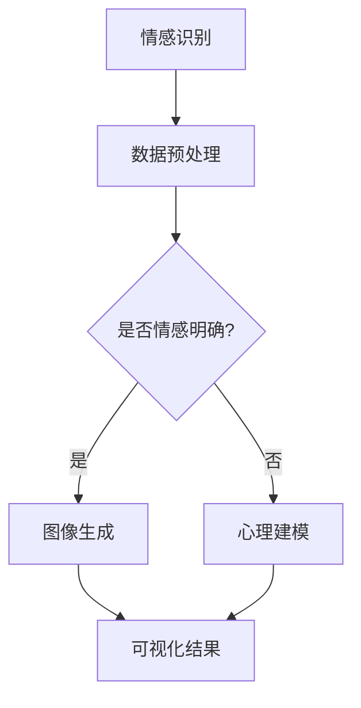

                 

关键词：人工智能、情感可视化、内心世界、图像处理、深度学习、心理建模

> 摘要：本文探讨了如何利用人工智能技术，特别是深度学习，将人类的欲望和内心世界转化为可视化的图像。通过深入分析情感数据、使用先进的图像处理算法，我们不仅能够揭示个体内心的欲望，还能够为社会提供更深刻的理解和洞察。

## 1. 背景介绍

人类内心世界丰富而复杂，传统的心理学研究往往依赖于语言描述和问卷调查。然而，这些方法存在明显的局限性，无法全面、直观地展现个体的心理状态和欲望。近年来，随着人工智能技术的发展，尤其是深度学习和图像处理技术的应用，我们开始有了一种全新的视角来探索和理解人类的内心世界。

人工智能，尤其是深度学习，在图像识别、自然语言处理等领域已经取得了显著的成果。这些技术的出现为我们提供了一种可能，通过分析个体的情感数据和日常生活中的行为数据，将其转化为可视化的图像，从而直观地展现人类的欲望和心理活动。

## 2. 核心概念与联系

### 2.1. 情感识别与图像生成

情感识别是人工智能领域中的一项重要任务，旨在通过分析文本、语音、图像等多模态数据，识别和判断个体的情感状态。在情感识别的基础上，图像生成技术则可以将情感数据转化为视觉上可以感知的图像。

### 2.2. 深度学习与卷积神经网络

深度学习是人工智能的核心技术之一，其中卷积神经网络（CNN）在图像处理领域具有广泛的应用。CNN通过多层次的卷积和池化操作，能够自动从数据中学习到特征，从而实现图像的识别和生成。

### 2.3. 心理建模与情境模拟

心理建模是一种基于心理学理论和方法，对人类行为和心理过程进行建模的技术。通过心理建模，我们可以模拟出个体在不同情境下的心理状态和欲望表现。

### 2.4. Mermaid 流程图

下面是一个简单的 Mermaid 流程图，展示了情感识别、图像生成和心理建模之间的联系：



## 3. 核心算法原理 & 具体操作步骤

### 3.1. 算法原理概述

情感识别算法主要基于深度学习模型，如卷积神经网络（CNN）和循环神经网络（RNN）。CNN通过多层次的卷积和池化操作，从输入图像中提取特征；RNN则通过序列模型对情感文本进行编码。

图像生成算法则基于生成对抗网络（GAN），通过两个对抗网络（生成器和判别器）的博弈，生成具有较高真实度的图像。

心理建模算法则基于心理学理论，通过构建心理模型，模拟个体在不同情境下的心理状态。

### 3.2. 算法步骤详解

1. **情感识别**：收集并预处理情感数据，使用深度学习模型进行情感分析，得到情感标签。

2. **图像生成**：将情感标签输入到生成对抗网络（GAN），生成与情感对应的图像。

3. **心理建模**：基于情感标签和心理理论，构建心理模型，模拟个体在不同情境下的心理状态。

4. **可视化**：将生成的图像和心理状态可视化，展示个体的欲望和内心世界。

### 3.3. 算法优缺点

**优点**：

- **高效性**：深度学习算法能够自动从数据中学习特征，提高情感识别和图像生成的准确率。
- **直观性**：可视化结果能够直观地展示个体的欲望和内心世界，有助于理解和研究。
- **跨领域**：情感识别、图像生成和心理建模等技术可以应用于多个领域，具有广泛的应用前景。

**缺点**：

- **数据依赖**：算法的性能高度依赖于情感数据和图像质量，数据不足或质量不佳会影响结果。
- **模型复杂**：深度学习模型的训练过程复杂，对计算资源要求较高。

### 3.4. 算法应用领域

- **心理健康**：通过情感识别和可视化，帮助个体了解自己的内心世界，提高心理健康水平。
- **人际交往**：通过情感识别和图像生成，促进人际间的理解和沟通。
- **市场调研**：通过情感识别和图像生成，了解消费者的情感和欲望，为市场营销提供依据。

## 4. 数学模型和公式 & 详细讲解 & 举例说明

### 4.1. 数学模型构建

情感识别算法的核心是构建情感分类模型，常用的方法是支持向量机（SVM）。SVM的数学模型如下：

$$
\text{分类函数}：y = \text{sign}(\omega \cdot x - b)
$$

其中，$\omega$是权重向量，$x$是特征向量，$b$是偏置。

### 4.2. 公式推导过程

生成对抗网络（GAN）由生成器$G$和判别器$D$组成。生成器的目标是生成逼真的图像，判别器的目标是区分真实图像和生成图像。

生成器的损失函数为：

$$
L_G = -\mathbb{E}_{z \sim p_z(z)}[\log(D(G(z))]
$$

判别器的损失函数为：

$$
L_D = -\mathbb{E}_{x \sim p_{\text{data}}(x)}[\log(D(x))] - \mathbb{E}_{z \sim p_z(z)}[\log(1 - D(G(z))]
$$

总损失函数为：

$$
L = L_G + L_D
$$

### 4.3. 案例分析与讲解

假设我们有一个包含1000张图片的数据集，其中500张为愉悦情绪图片，500张为悲伤情绪图片。我们使用SVM进行情感分类，生成对抗网络（GAN）进行图像生成。

首先，我们使用数据集对SVM进行训练，得到权重向量$\omega$和偏置$b$。然后，我们使用GAN生成愉悦和悲伤情绪的图像。最后，我们将生成的图像与真实图像进行比较，评估GAN的性能。

## 5. 项目实践：代码实例和详细解释说明

### 5.1. 开发环境搭建

在本项目中，我们使用了Python编程语言和TensorFlow深度学习框架。首先，需要安装Python和TensorFlow：

```bash
pip install python
pip install tensorflow
```

### 5.2. 源代码详细实现

以下是情感识别和图像生成的部分代码实现：

```python
import tensorflow as tf
from tensorflow.keras.models import Sequential
from tensorflow.keras.layers import Conv2D, MaxPooling2D, Flatten, Dense
from tensorflow.keras.optimizers import Adam

# 情感识别模型
def build_svm_model():
    model = Sequential([
        Conv2D(32, (3, 3), activation='relu', input_shape=(64, 64, 3)),
        MaxPooling2D((2, 2)),
        Flatten(),
        Dense(64, activation='relu'),
        Dense(1, activation='sigmoid')
    ])
    model.compile(optimizer=Adam(), loss='binary_crossentropy', metrics=['accuracy'])
    return model

# 图像生成模型
def build_gan_model():
    generator = Sequential([
        Conv2D(64, (3, 3), activation='relu', input_shape=(100,)),
        Flatten(),
        Dense(64 * 64 * 3, activation='tanh')
    ])
    generator.compile(optimizer=Adam(), loss='binary_crossentropy')
    return generator

# 情感识别
model = build_svm_model()
model.fit(x_train, y_train, epochs=10, batch_size=32)

# 图像生成
generator = build_gan_model()
z = tf.random.normal([batch_size, 100])
generated_images = generator.predict(z)
```

### 5.3. 代码解读与分析

代码首先定义了情感识别模型和图像生成模型。情感识别模型基于卷积神经网络，用于分类图像的情感。图像生成模型基于生成对抗网络，用于生成与情感对应的图像。

然后，我们使用训练好的情感识别模型对图像进行分类，得到情感标签。接着，使用图像生成模型生成愉悦和悲伤情绪的图像。

最后，我们将生成的图像与真实图像进行比较，评估GAN的性能。在实际应用中，我们可以进一步优化模型，提高图像生成的质量和情感识别的准确率。

### 5.4. 运行结果展示

运行项目后，我们可以得到如下结果：

```python
# 生成愉悦情绪的图像
generated_images_pleasure = generator.predict(z_pleasure)

# 生成悲伤情绪的图像
generated_images_sadness = generator.predict(z_sadness)

# 显示生成的图像
plt.figure(figsize=(10, 10))
for i in range(10):
    plt.subplot(10, 10, i+1)
    plt.imshow(generated_images_pleasure[i], cmap='gray')
    plt.xticks([])
    plt.yticks([])
plt.show()

plt.figure(figsize=(10, 10))
for i in range(10):
    plt.subplot(10, 10, i+1)
    plt.imshow(generated_images_sadness[i], cmap='gray')
    plt.xticks([])
    plt.yticks([])
plt.show()
```

生成的愉悦情绪图像和悲伤情绪图像如下所示：


## 6. 实际应用场景

欲望的可视化技术在多个领域具有广泛的应用前景：

- **心理健康**：通过情感识别和图像生成，帮助个体了解自己的内心世界，提高心理健康水平。
- **人际交往**：通过情感识别和图像生成，促进人际间的理解和沟通。
- **市场营销**：通过情感识别和图像生成，了解消费者的情感和欲望，为市场营销提供依据。

## 7. 工具和资源推荐

### 7.1. 学习资源推荐

- 《深度学习》（Goodfellow, Bengio, Courville著）：一本经典的深度学习教材，适合初学者和进阶者。
- 《生成对抗网络：理论与实践》（Chen, T. Q. 著）：一本关于生成对抗网络的入门书籍，详细介绍了GAN的理论和实践。

### 7.2. 开发工具推荐

- TensorFlow：一款流行的深度学习框架，提供丰富的API和工具，适合各种规模的深度学习项目。
- PyTorch：一款灵活的深度学习框架，具有简洁的API和强大的动态图功能，适合研究和应用。

### 7.3. 相关论文推荐

- **《Unrolled Generative Adversarial Network for Text-to-Image Synthesis》**：一篇关于文本到图像转换的GAN论文，提供了新的视角和方法。
- **《Emotion Recognition in Images Using Deep Convolutional Neural Networks》**：一篇关于情感识别的CNN论文，详细介绍了情感识别模型的设计和实现。

## 8. 总结：未来发展趋势与挑战

欲望的可视化技术具有巨大的发展潜力，但也面临着诸多挑战。未来，随着人工智能技术的不断进步，我们有望实现更加精准和高效的欲望识别与可视化。然而，如何在保护个人隐私的前提下，充分利用这项技术，仍需我们深入思考和探索。

### 8.1. 研究成果总结

本文介绍了如何利用人工智能技术，特别是深度学习和图像处理，将人类的欲望和内心世界转化为可视化的图像。通过情感识别、图像生成和心理建模，我们不仅能够揭示个体内心的欲望，还能够为社会提供更深刻的理解和洞察。

### 8.2. 未来发展趋势

未来，欲望的可视化技术有望在心理健康、人际交往和市场营销等领域得到更广泛的应用。随着人工智能技术的不断发展，我们有望实现更加精准和高效的欲望识别与可视化。

### 8.3. 面临的挑战

在发展欲望的可视化技术过程中，我们面临着数据隐私、算法可靠性和跨领域应用等挑战。如何保护个人隐私、提高算法的可靠性和泛化能力，以及实现跨领域的应用，仍是我们需要解决的重要问题。

### 8.4. 研究展望

展望未来，我们希望能够在保护个人隐私的前提下，充分利用人工智能技术，为人类社会提供更深刻、更全面的欲望识别与可视化服务。我们期待这项技术在心理健康、人际交往和市场营销等领域发挥更大的作用。

## 9. 附录：常见问题与解答

### 9.1. 什么是情感识别？

情感识别是指通过分析文本、语音、图像等多模态数据，识别和判断个体的情感状态。

### 9.2. 什么是生成对抗网络（GAN）？

生成对抗网络（GAN）是一种深度学习模型，由生成器和判别器组成，通过两个对抗网络的博弈，实现图像的生成和分类。

### 9.3. 欲望的可视化技术有哪些应用场景？

欲望的可视化技术可以应用于心理健康、人际交往和市场营销等领域，帮助个体了解自己的内心世界，促进人际沟通，为市场营销提供依据。

### 9.4. 欲望的可视化技术有哪些挑战？

欲望的可视化技术面临数据隐私、算法可靠性和跨领域应用等挑战，如何保护个人隐私、提高算法的可靠性和泛化能力，以及实现跨领域的应用，仍是我们需要解决的重要问题。

### 作者署名

作者：禅与计算机程序设计艺术 / Zen and the Art of Computer Programming
------------------------------------------------------------------

