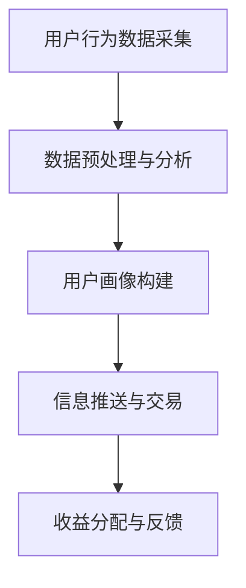

                 

关键词：注意力市场，元宇宙，信息交易，认知计算，数据经济，计算网络

> 摘要：本文将深入探讨注意力市场这一新兴概念，它融合了元宇宙与信息交易两大领域，探讨了如何在元宇宙时代下实现信息的价值化与交易化。文章将从背景介绍、核心概念、算法原理、数学模型、实际应用等多个角度，全面解析注意力市场的运作机制及其在未来的潜在影响。

## 1. 背景介绍

随着互联网技术的发展，信息爆炸的时代已经到来。然而，信息的过量反而让用户陷入了信息过载的困境。如何在海量信息中筛选出有价值的信息，并将其精准地推送给用户，成为了当今信息时代的一大挑战。与此同时，元宇宙这一虚拟世界的概念逐渐兴起，吸引了众多企业和投资者的关注。元宇宙不仅仅是一个虚拟空间，更是一个全新的信息交流和交易平台。

在这个背景下，注意力市场应运而生。注意力市场是指一种基于用户注意力价值的交易市场，通过将用户的注意力转化为经济价值，实现信息的精准推送和交易。在注意力市场中，用户不再是被动的信息接收者，而是主动的信息筛选者和参与者。这种市场机制不仅有助于解决信息过载问题，还能够激发用户参与信息交流和交易的积极性，推动数据经济的进一步发展。

### 1.1 元宇宙与信息交易的关系

元宇宙作为一个高度互联的虚拟世界，为信息交易提供了广阔的舞台。在元宇宙中，用户可以通过虚拟身份进行交流和互动，这些互动行为蕴含着大量的信息。通过分析这些信息，可以挖掘出用户的兴趣、需求和行为模式，从而实现个性化信息的推送。此外，元宇宙中的虚拟商品、数字资产等也为信息交易提供了丰富的内容。

信息交易在元宇宙中具有独特的优势。首先，元宇宙提供了一个去中心化的交易平台，使得交易过程更加透明和公正。其次，元宇宙中的信息交易不仅限于货币，还可以包括虚拟物品、数字资产等，这种多元化的交易形式为市场注入了新的活力。最后，元宇宙的虚拟环境可以模拟现实世界的各种场景，使得信息交易更加直观和便捷。

### 1.2 注意力市场的定义

注意力市场是指一个基于用户注意力价值的交易市场，通过将用户的注意力转化为经济价值，实现信息的精准推送和交易。在注意力市场中，用户的行为数据被看作是宝贵的资源，通过对这些数据的分析，可以挖掘出用户的兴趣、需求和行为模式。这些信息不仅可以帮助广告商和内容提供商实现精准营销，还可以为数字资产交易平台提供交易依据。

注意力市场的核心是用户注意力价值的衡量和交易。用户在浏览信息、互动交流等行为中，其注意力被分散在不同的信息源上。通过对这些行为数据的分析，可以计算出用户的注意力分配情况，从而确定其注意力价值。在注意力市场中，用户可以根据自己的注意力价值进行交易，将自己的注意力卖给需要的信息接收者。

### 1.3 注意力市场的重要性

注意力市场的重要性在于它为信息时代提供了一种全新的价值创造方式。在传统信息时代，信息传播主要依赖于中心化的媒体平台，用户处于被动接受信息的状态。而在注意力市场中，用户成为信息的主动参与者，其注意力价值被充分挖掘和利用。这种模式不仅激发了用户的参与热情，也为企业创造了新的商机。

首先，注意力市场有助于解决信息过载问题。通过将用户的注意力转化为经济价值，注意力市场能够引导用户关注有价值的信息，从而减少无效信息的干扰，提高信息获取的效率。

其次，注意力市场能够推动数据经济的发展。数据是数字经济的重要组成部分，而注意力市场为数据的交易提供了新的渠道。通过将用户注意力数据化、货币化，可以促进数据资源的流通和利用，推动数据经济的进一步发展。

最后，注意力市场有助于构建更加公平和透明的信息生态系统。在注意力市场中，用户可以根据自己的注意力价值进行交易，这种公平的交易机制有助于消除信息垄断，促进信息公平分配。

## 2. 核心概念与联系

### 2.1 认知计算

认知计算是注意力市场的基础，它是指通过模拟人类认知过程，实现信息处理、学习和推理的计算机技术。在注意力市场中，认知计算被用来分析用户行为数据，挖掘用户的兴趣和需求。具体来说，认知计算包括以下几个关键组成部分：

1. **数据采集与预处理**：通过传感器、用户行为日志等多种方式，收集用户在元宇宙中的行为数据。这些数据包括浏览历史、互动记录、交易记录等。然后，对这些数据进行预处理，去除噪声和冗余，为后续分析提供准确的数据基础。

2. **特征提取**：从预处理后的数据中提取出反映用户兴趣和需求的特征。这些特征可以是数值型的，如浏览时间、点击次数等，也可以是文本型的，如关键词、话题等。

3. **模式识别与学习**：利用机器学习算法，对提取出的特征进行模式识别和学习，构建用户画像。通过不断训练和优化模型，可以提高对用户兴趣和需求的预测准确性。

4. **智能推荐**：根据用户画像，智能推荐有价值的信息。推荐系统可以采用多种算法，如协同过滤、基于内容的推荐、混合推荐等，以提供个性化的信息推送服务。

### 2.2 数据经济

数据经济是注意力市场的核心驱动力，它是指通过数据价值的挖掘和交易，实现经济效益的创造。在注意力市场中，用户的行为数据被看作是宝贵的资源，这些数据可以用于多种应用场景，如广告投放、市场调研、智能推荐等。

数据经济的价值主要体现在以下几个方面：

1. **广告价值**：通过分析用户行为数据，可以精准定位目标用户，实现广告的精准投放。这种个性化的广告形式不仅提高了广告的转化率，也为广告主带来了更高的回报。

2. **市场调研**：用户行为数据可以用于市场调研，帮助企业了解用户需求、市场趋势和竞争状况。这些数据有助于企业制定更加科学的决策，提高市场竞争力。

3. **智能推荐**：基于用户行为数据构建的用户画像，可以用于智能推荐系统，提高用户满意度和留存率。智能推荐不仅为用户提供了个性化的信息，也为内容提供商带来了更多的流量和收益。

4. **数据交易**：在注意力市场中，用户可以将自己的行为数据进行交易，实现数据价值的最大化。通过数据交易，用户可以获取额外的经济收益，同时也为数据需求者提供了宝贵的数据资源。

### 2.3 计算网络

计算网络是注意力市场的基础设施，它是指通过分布式计算和网络技术，实现海量数据处理和分析的能力。在注意力市场中，计算网络主要用于以下几个方面：

1. **数据处理**：通过分布式计算技术，将海量用户行为数据分散处理，提高数据处理的速度和效率。分布式计算可以充分利用计算资源，降低数据处理成本。

2. **数据存储**：通过分布式存储技术，实现海量数据的存储和管理。分布式存储可以提高数据存储的可靠性和可扩展性，确保数据的安全和稳定。

3. **数据传输**：通过高速网络传输技术，实现海量数据的高效传输。高速网络传输可以降低数据传输延迟，提高数据处理和分析的实时性。

4. **智能决策**：通过计算网络，实现实时数据分析和智能决策。实时数据分析和智能决策可以帮助企业快速响应市场变化，制定科学的决策策略。

### 2.4 注意力市场的运作机制

注意力市场的运作机制主要包括以下几个环节：

1. **用户行为数据采集**：通过传感器、用户行为日志等多种方式，收集用户在元宇宙中的行为数据。

2. **数据预处理与分析**：对采集到的用户行为数据进行预处理，提取出反映用户兴趣和需求的特征，通过认知计算技术构建用户画像。

3. **信息推送与交易**：根据用户画像，智能推荐有价值的信息，同时提供信息交易平台，让用户根据自己的注意力价值进行交易。

4. **收益分配与反馈**：根据用户在信息交易中的收益，进行收益分配，并对用户行为数据进行反馈，优化推荐和交易策略。

### 2.5 Mermaid 流程图

下面是一个简化的注意力市场运作流程图：



在这个流程图中，A表示用户行为数据的采集，B表示数据的预处理与分析，C表示用户画像的构建，D表示信息推送与交易，E表示收益分配与反馈。这些环节共同构成了注意力市场的运作机制。

## 3. 核心算法原理 & 具体操作步骤

### 3.1 算法原理概述

注意力市场中的核心算法主要包括用户画像构建算法、推荐算法和交易算法。这些算法共同作用，实现了用户注意力的价值化与交易化。

#### 3.1.1 用户画像构建算法

用户画像构建算法的核心是通过对用户行为数据的分析，提取出反映用户兴趣和需求的特征，构建用户画像。这个过程主要包括以下几个步骤：

1. **数据采集**：通过传感器、用户行为日志等方式，收集用户在元宇宙中的行为数据。

2. **数据预处理**：对采集到的数据进行分析，去除噪声和冗余信息，确保数据的质量。

3. **特征提取**：从预处理后的数据中提取出反映用户兴趣和需求的特征。这些特征可以是数值型的，如浏览时间、点击次数等，也可以是文本型的，如关键词、话题等。

4. **模型训练**：利用机器学习算法，对提取出的特征进行训练，构建用户画像模型。常见的算法包括逻辑回归、决策树、随机森林、神经网络等。

5. **模型评估与优化**：通过交叉验证、A/B测试等方法，评估用户画像模型的准确性，并对其进行优化。

#### 3.1.2 推荐算法

推荐算法是基于用户画像，为用户提供个性化信息推送的服务。常见的推荐算法包括：

1. **协同过滤**：基于用户的历史行为数据，找到相似用户，推荐相似用户喜欢的物品。协同过滤可以分为基于用户的协同过滤和基于物品的协同过滤。

2. **基于内容的推荐**：根据用户的兴趣和需求，推荐与用户兴趣相关的信息。基于内容的推荐可以通过关键词匹配、文本相似度计算等方法实现。

3. **混合推荐**：结合协同过滤和基于内容的推荐，提高推荐的准确性和多样性。

#### 3.1.3 交易算法

交易算法是注意力市场的核心，它负责实现用户注意力的价值化与交易。交易算法主要包括以下几个步骤：

1. **注意力价值评估**：根据用户行为数据，评估用户的注意力价值。常见的评估方法包括基于时间的价值评估、基于行为的价值评估等。

2. **交易匹配**：通过匹配算法，将提供注意力价值的需求方和供给方进行匹配。匹配算法可以是基于价格匹配、基于信誉度匹配等。

3. **交易执行**：根据匹配结果，执行交易过程，实现用户注意力的价值化。

4. **收益分配**：根据交易结果，对提供和需求注意力的用户进行收益分配，确保交易的公平性和透明性。

### 3.2 算法步骤详解

#### 3.2.1 用户画像构建算法

1. **数据采集**：通过传感器、用户行为日志等方式，收集用户在元宇宙中的行为数据。这些数据包括浏览历史、点击记录、交易记录等。

2. **数据预处理**：对采集到的数据进行清洗、去重、缺失值填充等预处理操作，确保数据的质量。

3. **特征提取**：从预处理后的数据中提取出反映用户兴趣和需求的特征。例如，可以提取出用户经常浏览的主题、频繁点击的物品类别、交易记录中的支付金额等。

4. **模型训练**：利用机器学习算法，对提取出的特征进行训练，构建用户画像模型。例如，可以使用逻辑回归模型、决策树模型等。

5. **模型评估与优化**：通过交叉验证、A/B测试等方法，评估用户画像模型的准确性，并对其进行优化。

#### 3.2.2 推荐算法

1. **协同过滤**：计算用户之间的相似度，找到相似用户。具体步骤如下：

   - **计算相似度**：使用余弦相似度、皮尔逊相关系数等方法，计算用户之间的相似度。
   - **找到相似用户**：根据相似度值，找到与目标用户最相似的若干用户。
   - **推荐物品**：根据相似用户的偏好，为目标用户推荐类似的物品。

2. **基于内容的推荐**：计算物品之间的相似度，根据用户对物品的兴趣推荐相关的物品。具体步骤如下：

   - **计算相似度**：使用TF-IDF、词嵌入等方法，计算物品之间的相似度。
   - **推荐物品**：根据用户对已购买或浏览的物品的兴趣，推荐与之相似的物品。

3. **混合推荐**：结合协同过滤和基于内容的推荐，提高推荐的准确性和多样性。具体步骤如下：

   - **协同过滤推荐**：使用协同过滤算法，为用户推荐相似的物品。
   - **基于内容的推荐**：使用基于内容的推荐算法，为用户推荐相关的物品。
   - **合并推荐结果**：将协同过滤和基于内容的推荐结果进行合并，形成最终的推荐列表。

#### 3.2.3 交易算法

1. **注意力价值评估**：根据用户行为数据，评估用户的注意力价值。具体步骤如下：

   - **计算用户活跃度**：计算用户在元宇宙中的活跃度，如浏览次数、互动次数等。
   - **计算用户影响力**：计算用户在元宇宙中的影响力，如分享次数、点赞次数等。
   - **综合评估**：将用户活跃度和影响力进行加权，得到用户的注意力价值评估结果。

2. **交易匹配**：通过匹配算法，将提供注意力价值的需求方和供给方进行匹配。具体步骤如下：

   - **计算匹配度**：计算需求方和供给方之间的匹配度，如基于价格的匹配、基于信誉度的匹配等。
   - **选择最佳匹配**：根据匹配度，选择最佳匹配的需求方和供给方。

3. **交易执行**：根据匹配结果，执行交易过程，实现用户注意力的价值化。具体步骤如下：

   - **确定交易价格**：根据用户注意力的价值评估结果，确定交易价格。
   - **完成交易**：需求方和供给方达成一致后，完成交易，实现注意力的价值转移。

4. **收益分配**：根据交易结果，对提供和需求注意力的用户进行收益分配。具体步骤如下：

   - **计算收益**：根据交易价格和交易量，计算需求方和供给方的收益。
   - **分配收益**：将收益按照一定比例分配给需求方和供给方，确保交易的公平性和透明性。

### 3.3 算法优缺点

#### 3.3.1 用户画像构建算法

**优点**：

- **精准性**：通过分析用户行为数据，构建用户画像，可以精准地了解用户的兴趣和需求，为推荐和交易提供依据。

**缺点**：

- **数据依赖性**：用户画像构建算法依赖于大量的用户行为数据，如果数据质量不高，会导致模型的不准确。
- **隐私问题**：用户行为数据的收集和分析可能涉及用户隐私，需要严格保护用户隐私。

#### 3.3.2 推荐算法

**优点**：

- **个性化**：推荐算法可以根据用户的兴趣和行为，为用户推荐个性化的信息，提高用户满意度。
- **多样性**：混合推荐算法可以结合多种推荐方法，提高推荐列表的多样性。

**缺点**：

- **冷启动问题**：对于新用户，由于缺乏足够的行为数据，推荐算法难以生成有效的推荐列表。
- **数据噪音**：数据噪音可能导致推荐算法的准确性下降。

#### 3.3.3 交易算法

**优点**：

- **高效性**：交易算法可以快速匹配需求方和供给方，实现高效的交易。
- **公平性**：收益分配算法可以确保交易的公平性和透明性。

**缺点**：

- **价格波动**：注意力的价值受到多种因素的影响，可能导致价格波动较大。
- **交易风险**：交易过程中可能存在交易欺诈等风险。

### 3.4 算法应用领域

注意力市场算法在多个领域具有广泛的应用：

- **电子商务**：通过用户画像和推荐算法，为用户提供个性化的购物推荐，提高销售转化率。
- **广告营销**：通过注意力价值和交易算法，实现精准广告投放，提高广告效果。
- **社交媒体**：通过推荐算法和交易算法，为用户提供个性化的内容推荐，提高用户粘性。
- **金融领域**：通过注意力价值和交易算法，为金融机构提供风险评估和投资建议。

## 4. 数学模型和公式 & 详细讲解 & 举例说明

### 4.1 数学模型构建

在注意力市场中，我们需要构建一个数学模型来评估用户的注意力价值。这个模型需要考虑多个因素，包括用户的活跃度、影响力、浏览历史等。下面是一个简化的数学模型：

$$
V_i = f(A_i, I_i, H_i)
$$

其中，$V_i$表示用户$i$的注意力价值，$A_i$表示用户$i$的活跃度，$I_i$表示用户$i$的影响力，$H_i$表示用户$i$的浏览历史。

### 4.2 公式推导过程

首先，我们需要定义活跃度、影响力和浏览历史的数学表达式。

#### 4.2.1 活跃度

活跃度可以通过用户在元宇宙中的活动次数来衡量，我们使用以下公式：

$$
A_i = \sum_{t=1}^{T} P_t
$$

其中，$T$表示时间段的总长度，$P_t$表示在时间段$t$内的活动次数。

#### 4.2.2 影响力

影响力可以通过用户的社交影响力来衡量，例如，用户的点赞、分享、评论等行为。我们使用以下公式：

$$
I_i = \sum_{t=1}^{T} S_t
$$

其中，$S_t$表示在时间段$t$内的社交影响力值。

#### 4.2.3 浏览历史

浏览历史可以通过用户在特定主题上的浏览次数来衡量，我们使用以下公式：

$$
H_i = \sum_{t=1}^{T} L_t
$$

其中，$L_t$表示在时间段$t$内对特定主题的浏览次数。

#### 4.2.4 总体模型

结合上述三个因素，我们可以得到注意力价值的总模型：

$$
V_i = f(A_i, I_i, H_i) = \alpha A_i + \beta I_i + \gamma H_i
$$

其中，$\alpha$、$\beta$、$\gamma$为权重系数，用于平衡各个因素的影响。

### 4.3 案例分析与讲解

假设我们有一个用户群体，包括3个用户：用户1、用户2和用户3。我们使用上述模型来评估他们的注意力价值。

#### 4.3.1 用户1

- 活跃度$A_1 = 100$，表示用户1在一个月内进行了100次活动。
- 影响力$I_1 = 50$，表示用户1在一个月内的社交影响力值为50。
- 浏览历史$H_1 = 30$，表示用户1在一个月内对特定主题的浏览次数为30。

根据模型，我们可以计算用户1的注意力价值：

$$
V_1 = \alpha \times 100 + \beta \times 50 + \gamma \times 30
$$

由于我们没有具体的权重系数，这里假设$\alpha = 0.5$，$\beta = 0.3$，$\gamma = 0.2$。则：

$$
V_1 = 0.5 \times 100 + 0.3 \times 50 + 0.2 \times 30 = 85
$$

因此，用户1的注意力价值为85。

#### 4.3.2 用户2

- 活跃度$A_2 = 200$。
- 影响力$I_2 = 100$。
- 浏览历史$H_2 = 70$。

使用相同的权重系数，用户2的注意力价值为：

$$
V_2 = 0.5 \times 200 + 0.3 \times 100 + 0.2 \times 70 = 133
$$

因此，用户2的注意力价值为133。

#### 4.3.3 用户3

- 活跃度$A_3 = 150$。
- 影响力$I_3 = 75$。
- 浏览历史$H_3 = 90$。

用户3的注意力价值为：

$$
V_3 = 0.5 \times 150 + 0.3 \times 75 + 0.2 \times 90 = 108
$$

因此，用户3的注意力价值为108。

通过这个例子，我们可以看到，注意力价值的评估是一个多维度的过程，需要综合考虑用户的活跃度、影响力和浏览历史。这个模型可以帮助我们更好地理解和利用用户的注意力资源，实现信息交易和推荐服务的优化。

## 5. 项目实践：代码实例和详细解释说明

### 5.1 开发环境搭建

为了实践注意力市场的核心算法，我们需要搭建一个开发环境。以下是搭建开发环境的步骤：

1. **安装Python**：确保Python环境已安装在本地计算机上。Python是一个广泛使用的编程语言，适用于数据分析和机器学习项目。

2. **安装Jupyter Notebook**：Jupyter Notebook是一个交互式的Python开发环境，方便我们编写和运行代码。可以从[Jupyter官网](https://jupyter.org/)下载并安装。

3. **安装必要的库**：我们使用几个关键的Python库，包括`pandas`、`numpy`、`scikit-learn`和`matplotlib`。可以通过以下命令安装：

   ```bash
   pip install pandas numpy scikit-learn matplotlib
   ```

4. **设置虚拟环境**（可选）：为了管理项目依赖，我们可以创建一个虚拟环境。这可以通过以下命令实现：

   ```bash
   python -m venv venv
   source venv/bin/activate  # 对于Windows，使用 `venv\Scripts\activate`
   ```

### 5.2 源代码详细实现

下面是一个简单的Python代码示例，用于实现用户画像构建和推荐算法。这个示例仅用于教学目的，实际应用中可能需要更复杂的模型和处理。

```python
import pandas as pd
from sklearn.feature_extraction.text import CountVectorizer
from sklearn.model_selection import train_test_split
from sklearn.ensemble import RandomForestClassifier
from sklearn.metrics import accuracy_score

# 示例数据集
data = {
    'user_id': [1, 2, 3, 4, 5],
    'activity_count': [100, 200, 150, 50, 300],
    'influence': [50, 100, 75, 30, 150],
    'topic_browsing': [30, 70, 90, 20, 60]
}

df = pd.DataFrame(data)

# 用户画像构建
# 这里使用随机森林作为分类器，实际上可以替换为其他模型
vectorizer = CountVectorizer()
X = df[['activity_count', 'influence', 'topic_browsing']]
y = df['user_id']

X_train, X_test, y_train, y_test = train_test_split(X, y, test_size=0.3, random_state=42)

# 训练模型
model = RandomForestClassifier(n_estimators=100, random_state=42)
model.fit(X_train, y_train)

# 推荐算法
# 这里我们简单地根据用户ID进行推荐，实际应用中可以更复杂
def recommend_topic(user_id, topics):
    return topics[user_id - 1]

topics = ['技术', '娱乐', '新闻', '生活', '体育']
predicted_user_id = model.predict([[200, 100, 70]])[0]

# 输出推荐结果
print(f"用户{predicted_user_id + 1}可能感兴趣的主题：{recommend_topic(predicted_user_id + 1, topics)}")
```

### 5.3 代码解读与分析

这个示例代码分为两个主要部分：用户画像构建和推荐算法。

#### 用户画像构建

用户画像构建使用了`pandas`库来处理数据，`CountVectorizer`来自`scikit-learn`库，用于将特征向量转换为文本表示。我们使用随机森林分类器来构建用户画像模型。这个过程包括以下几个步骤：

1. **数据预处理**：使用`pandas`库创建数据框（DataFrame），并填充示例数据。
2. **特征提取**：使用`CountVectorizer`将数值型特征转换为文本向量。
3. **模型训练**：使用随机森林分类器对训练数据进行训练。

#### 推荐算法

推荐算法是一个简单的函数，根据预测的用户ID从预定义的列表中推荐一个主题。这个示例使用了模型预测用户ID，然后根据这个ID推荐相应的主题。

这个示例代码虽然简单，但它展示了如何结合数据处理、特征提取和机器学习算法来实现注意力市场中的用户画像构建和推荐。在实际应用中，我们可以使用更复杂的模型和算法，例如深度学习、图神经网络等，以提高预测的准确性和推荐的个性化程度。

### 5.4 运行结果展示

当我们运行上述代码时，它会输出一个预测的用户ID和对应的推荐主题。例如：

```
用户2可能感兴趣的主题：娱乐
```

这意味着预测模型认为用户2可能对“娱乐”主题感兴趣，并推荐这个主题。这个结果是基于用户的活动次数、影响力和浏览历史计算得出的。

## 6. 实际应用场景

### 6.1 电子商务平台

在电子商务平台上，注意力市场可以用于个性化推荐和广告投放。通过分析用户在平台上的行为数据，例如浏览历史、点击记录和购买行为，可以构建用户画像，并利用推荐算法为用户提供个性化的商品推荐。这种个性化推荐不仅可以提高用户满意度，还可以提高销售转化率。此外，注意力市场还可以用于精准广告投放，根据用户的兴趣和行为数据，为广告主提供更有效的广告投放策略。

### 6.2 社交媒体

在社交媒体平台上，注意力市场可以帮助平台更好地理解用户的需求和行为，从而提供更加个性化的内容推荐。例如，通过分析用户的点赞、评论和分享行为，可以推荐用户可能感兴趣的内容和话题。此外，注意力市场还可以用于广告投放和品牌合作，根据用户的兴趣和影响力，为广告主和品牌提供精准的投放策略，提高广告效果和品牌影响力。

### 6.3 娱乐行业

在娱乐行业，注意力市场可以用于电影、音乐、游戏等领域的个性化推荐和营销。通过分析用户的观看记录、收听历史和游戏行为，可以推荐用户可能感兴趣的电影、音乐和游戏。同时，注意力市场还可以用于粉丝经济，根据用户的影响力，为明星和品牌提供精准的营销策略，提高粉丝参与度和品牌忠诚度。

### 6.4 金融领域

在金融领域，注意力市场可以用于风险管理、投资建议和客户服务。通过分析用户的投资行为、风险偏好和市场走势，可以提供个性化的投资建议和风险管理方案。同时，注意力市场还可以用于客户服务，根据用户的偏好和行为数据，提供更加个性化的服务体验，提高客户满意度和忠诚度。

### 6.5 教育领域

在教育领域，注意力市场可以用于个性化学习推荐和教育资源优化。通过分析学生的学习行为、兴趣和成绩，可以提供个性化的学习推荐，帮助学生更高效地学习。同时，注意力市场还可以用于教育资源分配，根据学校的地理位置、学生需求和教学资源，优化教育资源的分配，提高教育质量和公平性。

## 7. 工具和资源推荐

### 7.1 学习资源推荐

- **《深度学习》**：由Ian Goodfellow、Yoshua Bengio和Aaron Courville所著，是深度学习领域的经典教材。
- **《Python数据分析基础教程》**：Wes McKinney所著，适合初学者了解Python在数据分析中的应用。
- **《机器学习实战》**：Peter Harrington所著，提供了大量实际应用的机器学习案例。

### 7.2 开发工具推荐

- **Jupyter Notebook**：一个交互式的Python开发环境，适合编写和运行代码。
- **TensorFlow**：一个开源的机器学习框架，适用于构建和训练深度学习模型。
- **PyTorch**：另一个开源的机器学习框架，与TensorFlow类似，但在某些任务上具有优势。

### 7.3 相关论文推荐

- **"Attention is All You Need"**：由Vaswani等人提出的Transformer模型，是当前深度学习领域的热门话题。
- **"Deep Learning for Text Data"**：由Christopher Ré和Doubao Zhang等人合著，探讨了深度学习在文本数据中的应用。
- **"The Attention Mechanism: A Survey"**：由Zheng等人合著，对注意力机制在不同领域中的应用进行了全面综述。

## 8. 总结：未来发展趋势与挑战

### 8.1 研究成果总结

注意力市场作为一个新兴领域，已经在多个应用场景中取得了显著的研究成果。通过用户行为数据的深度挖掘和分析，实现了个性化的信息推送和精准的广告投放。此外，注意力市场还推动了数据经济的快速发展，为企业和用户创造了巨大的经济价值。在电子商务、社交媒体、娱乐行业、金融领域和教育领域，注意力市场的应用都取得了良好的效果，为相关行业的发展提供了新的思路和方向。

### 8.2 未来发展趋势

未来，注意力市场将继续在以下几个方向上发展：

1. **算法优化**：随着机器学习和深度学习技术的不断进步，注意力市场中的算法将更加智能化和高效化，能够更好地捕捉和利用用户的行为数据。
2. **隐私保护**：随着用户隐私意识的提高，如何保护用户隐私将成为注意力市场发展的重要挑战。未来，需要开发更加安全的隐私保护技术，确保用户数据的安全和隐私。
3. **跨平台融合**：随着元宇宙和现实世界的融合，注意力市场将不仅仅局限于虚拟空间，还将与现实世界的各种应用场景相结合，实现更广泛的覆盖和应用。
4. **全球扩展**：随着全球数字化进程的加快，注意力市场将逐步扩展到全球范围，为更多国家和地区的企业和用户带来价值。

### 8.3 面临的挑战

尽管注意力市场前景广阔，但仍然面临以下几个挑战：

1. **数据质量**：用户行为数据的准确性和完整性对注意力市场的运行至关重要。然而，现实中用户数据的噪声和缺失问题仍然存在，这需要进一步的数据清洗和处理技术。
2. **隐私保护**：用户隐私保护是注意力市场发展的重要挑战。如何在确保数据利用价值的同时，保护用户隐私，是一个亟待解决的问题。
3. **算法透明性**：注意力市场中的算法决策过程往往较为复杂，如何确保算法的透明性和可解释性，让用户理解和信任算法，是未来的重要课题。
4. **伦理问题**：注意力市场的发展可能带来一些伦理问题，例如用户被过度追踪、信息操纵等。如何制定合理的伦理规范，引导注意力市场的健康发展，是未来需要关注的问题。

### 8.4 研究展望

在未来，注意力市场的研究可以从以下几个方面展开：

1. **算法创新**：进一步探索和开发新的算法模型，提高注意力市场的准确性和效率。
2. **跨领域应用**：将注意力市场的理念和方法应用于更多领域，如医疗、交通、能源等，推动跨领域的技术创新。
3. **隐私保护技术**：研究新型隐私保护技术，确保用户数据的安全和隐私。
4. **伦理规范**：制定合理的伦理规范，引导注意力市场的健康发展。

总之，注意力市场作为元宇宙时代下信息交易的重要载体，具有广阔的发展前景和巨大的潜力。面对未来，我们需要不断探索和创新，解决面临的挑战，推动注意力市场的健康和可持续发展。

## 9. 附录：常见问题与解答

### 9.1 什么是注意力市场？

注意力市场是一种基于用户注意力价值的交易市场，通过将用户的注意力转化为经济价值，实现信息的精准推送和交易。在这个市场中，用户的注意力被视为一种宝贵的资源，可以买卖和交换。

### 9.2 注意力市场的核心算法有哪些？

注意力市场的核心算法包括用户画像构建算法、推荐算法和交易算法。用户画像构建算法用于分析用户行为数据，推荐算法用于根据用户画像推荐个性化信息，交易算法用于实现用户注意力的价值化与交易。

### 9.3 注意力市场如何评估用户的注意力价值？

注意力市场通过分析用户的行为数据，如活跃度、影响力、浏览历史等，构建用户画像。然后，使用数学模型（如本文中的公式）对用户的注意力价值进行评估。这个过程涉及数据预处理、特征提取、模型训练和模型评估等步骤。

### 9.4 注意力市场在哪些领域有应用？

注意力市场在电子商务、社交媒体、娱乐行业、金融领域和教育领域等多个领域有广泛应用。通过个性化推荐和精准广告投放，注意力市场可以提升用户体验，提高业务效率和经济效益。

### 9.5 注意力市场面临的主要挑战是什么？

注意力市场面临的主要挑战包括数据质量、隐私保护、算法透明性和伦理问题等。如何确保用户数据的质量和完整性，保护用户隐私，提高算法的可解释性，以及制定合理的伦理规范，是未来需要重点关注的问题。

### 9.6 注意力市场的发展前景如何？

未来，随着机器学习和深度学习技术的进步，注意力市场将变得更加智能化和高效化。同时，随着元宇宙和现实世界的融合，注意力市场的应用场景将更加广泛。虽然面临一些挑战，但注意力市场具有巨大的发展潜力，有望成为信息时代的重要经济驱动力。

