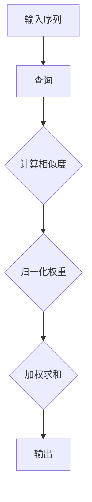

                 

## 1. 背景介绍

注意力机制（Attention Mechanism）是深度学习中一个重要的概念，尤其在自然语言处理（NLP）和计算机视觉（CV）领域取得了显著的应用成果。注意力机制的引入主要是为了解决在处理序列数据时，模型如何有效地关注重要信息、忽略冗余信息的问题。

在早期传统的序列模型如RNN和LSTM中，模型在处理序列数据时往往是逐个时间步进行，这样的处理方式容易导致模型关注全局信息的能力不足，特别是在处理长序列时效果不佳。而注意力机制的引入，使得模型可以动态地关注序列中的不同部分，提高了模型处理长序列数据的能力。

注意力机制最初由Bahdanau等人于2014年提出，随后在机器翻译等领域取得了显著的成果。此后，多种注意力机制被提出并应用于不同领域，如Transformer模型中的自注意力（Self-Attention）机制，以及图像处理中的视觉注意力（Visual Attention）机制等。

本文将首先介绍注意力机制的核心概念和基本原理，然后通过具体的数学模型和算法步骤进行详细讲解。接下来，我们将通过一个简单的代码实例，展示如何实现注意力机制，并分析其优缺点及实际应用领域。通过本文的学习，读者将对注意力机制有更加深入的理解，并能够应用于实际的工程项目中。

## 2. 核心概念与联系

### 2.1. 注意力机制的定义

注意力机制是一种通过在计算过程中动态调整不同部分的重要性的方法，使得模型能够更加关注对当前任务有用的信息。在深度学习中，注意力机制通常用于处理序列数据，如文本、语音和视频等。其核心思想是通过一个权重分配过程，将输入数据中的一部分信息赋予更高的权重，从而在后续处理中更加关注这些重要信息。

### 2.2. 注意力机制的核心概念

#### 2.2.1. 输入序列与查询（Query）

在注意力机制中，输入序列（Input Sequence）通常是一个由向量表示的序列数据。而查询（Query）是一个向量，用于表示当前任务关注的焦点。在序列模型中，查询通常由模型的前一层输出或当前时间步的输入表示。

#### 2.2.2. 候选键（Key）与值（Value）

候选键（Key）和值（Value）是与查询相对应的两个向量，用于表示输入序列中的潜在重要信息。候选键用于与查询计算相似度，而值则用于表示这些候选键对应的潜在信息。

#### 2.2.3. 注意力权重（Attention Weight）

注意力权重是一个与查询和候选键计算得到的标量值，用于表示输入序列中各个部分的重要性。这些权重通过一个归一化函数（如softmax）得到，使得所有权重之和等于1。

### 2.3. 注意力机制的架构

注意力机制通常包含以下步骤：

1. **计算相似度**：通过计算查询与候选键的点积或使用更复杂的函数（如点积注意力或加性注意力）来得到相似度。
2. **计算注意力权重**：使用归一化函数（如softmax）将相似度映射为权重。
3. **加权求和**：将输入序列中的各个部分与对应的权重相乘，然后求和，得到注意力分数。
4. **输出**：将注意力分数作为当前时间步的输出，用于后续处理。

### 2.4. 注意力机制的 Mermaid 流程图

下面是注意力机制的 Mermaid 流程图表示：



通过这个流程图，我们可以清晰地看到注意力机制的计算过程，包括查询与候选键的相似度计算、权重的归一化以及加权求和的步骤。

## 3. 核心算法原理 & 具体操作步骤

### 3.1. 算法原理概述

注意力机制的核心原理是通过计算输入序列中各部分与当前任务查询的相似度，然后根据相似度分配注意力权重，使得模型能够动态关注对任务最重要的信息。具体而言，注意力机制分为以下几个步骤：

1. **查询（Query）生成**：查询通常由当前任务的前一层输出或当前时间步的输入表示。
2. **候选键（Key）与值（Value）生成**：候选键与值从输入序列中提取，通常通过映射函数从输入序列中的每个部分生成。
3. **相似度计算**：计算查询与候选键之间的相似度，常用的方法有点积注意力、加性注意力和缩放点积注意力等。
4. **权重归一化**：使用归一化函数（如softmax）将相似度映射为注意力权重。
5. **加权求和**：将输入序列中的各个部分与对应的权重相乘，然后求和，得到注意力分数。
6. **输出**：将注意力分数作为当前时间步的输出，用于后续处理。

### 3.2. 算法步骤详解

#### 3.2.1. 查询生成

查询（Query）是注意力机制的核心之一，它决定了模型关注的焦点。在序列模型中，查询通常由模型的前一层输出或当前时间步的输入表示。假设我们有一个序列数据 \[x_1, x_2, ..., x_T\]，每个 \(x_t\) 是一个向量，那么查询 \(q\) 可以表示为：

\[ q = [q_1, q_2, ..., q_T] \]

其中，\(q_t\) 可以通过以下映射函数计算：

\[ q_t = f(x_t; \theta_q) \]

其中，\(f\) 是一个参数化函数，\(\theta_q\) 是参数。

#### 3.2.2. 候选键与值生成

候选键（Key）与值（Value）是与查询相对应的两个向量，用于表示输入序列中的潜在重要信息。候选键用于与查询计算相似度，而值则用于表示这些候选键对应的潜在信息。候选键和值通常通过映射函数从输入序列中的每个部分生成。假设输入序列为 \[x_1, x_2, ..., x_T\]，那么候选键 \(k\) 和值 \(v\) 可以表示为：

\[ k = [k_1, k_2, ..., k_T] \]
\[ v = [v_1, v_2, ..., v_T] \]

其中，\(k_t\) 和 \(v_t\) 可以通过以下映射函数计算：

\[ k_t = f(x_t; \theta_k) \]
\[ v_t = f(x_t; \theta_v) \]

其中，\(f\) 是一个参数化函数，\(\theta_k\) 和 \(\theta_v\) 是参数。

#### 3.2.3. 相似度计算

相似度计算是注意力机制的核心步骤，用于衡量查询与候选键之间的相关性。常用的相似度计算方法有点积注意力、加性注意力和缩放点积注意力等。

1. **点积注意力**：

\[ \text{Attention}(q, k, v) = \text{softmax}\left(\frac{q_k^T k}{\sqrt{d_k}}\right) v \]

其中，\(q_k^T k\) 表示查询和候选键的点积，\(\text{softmax}\) 函数用于归一化相似度，\(v\) 表示值。

2. **加性注意力**：

\[ \text{Attention}(q, k, v) = \text{softmax}\left(\text{Tanh}\left(W_q q + W_k k + b\right)\right) v \]

其中，\(W_q\)、\(W_k\) 和 \(b\) 分别是权重矩阵和偏置，\(\text{Tanh}\) 函数用于非线性变换。

3. **缩放点积注意力**：

\[ \text{Attention}(q, k, v) = \text{softmax}\left(\frac{q_k^T k}{\sqrt{d_k}} + q_k\right) v \]

其中，\(d_k\) 是候选键的维度，\(q_k\) 是查询与候选键的点积。

#### 3.2.4. 权重归一化

在计算相似度后，需要将相似度映射为注意力权重。常用的归一化函数是softmax函数，它将相似度映射为概率分布。具体而言，假设我们有一个相似度向量 \[s_1, s_2, ..., s_T\]，那么注意力权重 \[a_1, a_2, ..., a_T\] 可以通过以下公式计算：

\[ a_t = \frac{\exp(s_t)}{\sum_{i=1}^{T} \exp(s_i)} \]

#### 3.2.5. 加权求和

在得到注意力权重后，需要将输入序列中的各个部分与对应的权重相乘，然后求和，得到注意力分数。具体而言，假设输入序列为 \[x_1, x_2, ..., x_T\]，注意力权重为 \[a_1, a_2, ..., a_T\]，那么注意力分数 \(h\) 可以通过以下公式计算：

\[ h = \sum_{t=1}^{T} a_t x_t \]

#### 3.2.6. 输出

最后，将注意力分数作为当前时间步的输出，用于后续处理。注意力分数可以表示当前任务关注的重要信息，为模型提供了更丰富的上下文信息。

### 3.3. 算法优缺点

#### 3.3.1. 优点

1. **高效性**：注意力机制通过动态调整关注焦点，提高了模型处理长序列数据的能力，减少了冗余计算。
2. **灵活性**：注意力机制可以根据不同的任务需求灵活调整，如自注意力（Self-Attention）和多头注意力（Multi-Head Attention）等。
3. **泛化能力**：注意力机制在多个领域（如NLP和CV）都取得了显著的应用成果，具有较高的泛化能力。

#### 3.3.2. 缺点

1. **计算复杂度**：在处理长序列时，注意力机制的计算复杂度较高，可能会导致模型训练和推理速度较慢。
2. **参数敏感性**：注意力机制的参数较多，需要较精细的调整，否则可能导致模型性能下降。

### 3.4. 算法应用领域

注意力机制在深度学习中的应用非常广泛，以下是其主要应用领域：

1. **自然语言处理（NLP）**：如机器翻译、文本生成、情感分析等。
2. **计算机视觉（CV）**：如目标检测、图像分割、图像分类等。
3. **语音处理**：如语音识别、语音合成等。
4. **推荐系统**：如商品推荐、音乐推荐等。

## 4. 数学模型和公式 & 详细讲解 & 举例说明

### 4.1. 数学模型构建

注意力机制的数学模型可以表示为以下形式：

\[ h = \text{Attention}(q, K, V) = \text{softmax}\left(\frac{qK^T}{\sqrt{d_k}}\right) V \]

其中，\(q\) 是查询，\(K\) 是候选键，\(V\) 是值，\(d_k\) 是候选键的维度。

### 4.2. 公式推导过程

注意力机制的推导可以分为以下几个步骤：

#### 4.2.1. 相似度计算

假设查询 \(q\) 和候选键 \(K\) 分别为 \(q \in \mathbb{R}^{d_q}\) 和 \(K \in \mathbb{R}^{d_k \times T}\)，其中 \(T\) 是序列长度，\(d_q\) 和 \(d_k\) 分别是查询和候选键的维度。那么，查询和候选键之间的相似度可以计算为：

\[ \text{Similarity}(q, K) = qK^T \]

这里，\(qK^T\) 表示查询和候选键的点积。

#### 4.2.2. 注意力权重计算

为了得到注意力权重，需要将相似度进行归一化处理。具体而言，假设相似度矩阵为 \(S \in \mathbb{R}^{T \times T}\)，其中 \(S_{ij} = qK^T\)，那么注意力权重可以通过以下公式计算：

\[ a_i = \text{softmax}(S_{ij}) = \frac{\exp(S_{ij})}{\sum_{j=1}^{T} \exp(S_{ij})} \]

这里，\(a_i\) 表示第 \(i\) 个候选键的注意力权重。

#### 4.2.3. 加权求和

在得到注意力权重后，需要对候选键进行加权求和。具体而言，假设值 \(V \in \mathbb{R}^{d_v \times T}\)，其中 \(V_t\) 表示第 \(t\) 个候选键的值，那么加权求和的结果可以表示为：

\[ h = \sum_{i=1}^{T} a_i V_t \]

这里，\(h\) 表示注意力分数。

### 4.3. 案例分析与讲解

#### 4.3.1. 机器翻译中的注意力机制

在机器翻译任务中，注意力机制可以帮助模型更好地理解源语言和目标语言之间的对应关系。假设我们有一个源语言句子和目标语言句子，分别表示为 \(X \in \mathbb{R}^{d_x \times T_x}\) 和 \(Y \in \mathbb{R}^{d_y \times T_y}\)，其中 \(T_x\) 和 \(T_y\) 分别是源语言和目标语言句子的长度。

1. **查询生成**：假设当前目标语言句子的前一个词为 \(y_{t-1}\)，那么查询可以表示为 \(q = f(y_{t-1}; \theta_q)\)。

2. **候选键与值生成**：候选键和值可以从源语言句子中提取，分别表示为 \(k = f(X; \theta_k)\) 和 \(v = f(X; \theta_v)\)。

3. **相似度计算**：计算查询和候选键之间的相似度，表示为 \(s = qk^T\)。

4. **注意力权重计算**：通过softmax函数计算注意力权重，表示为 \(a = \text{softmax}(s)\)。

5. **加权求和**：将注意力权重与源语言句子中的值相乘，然后求和，得到注意力分数 \(h = \sum_{i=1}^{T} a_i v_i\)。

6. **输出**：注意力分数 \(h\) 可以作为当前目标语言句子的预测输出。

#### 4.3.2. 计算机视觉中的注意力机制

在计算机视觉任务中，注意力机制可以帮助模型更好地关注图像中的关键区域。假设我们有一个图像 \(I \in \mathbb{R}^{H \times W \times C}\)，其中 \(H\)、\(W\) 和 \(C\) 分别是图像的高度、宽度和通道数。

1. **查询生成**：假设当前任务关注的是图像的某个区域，那么查询可以表示为 \(q = f(I_{region}; \theta_q)\)。

2. **候选键与值生成**：候选键和值可以从图像中提取，分别表示为 \(k = f(I; \theta_k)\) 和 \(v = f(I; \theta_v)\)。

3. **相似度计算**：计算查询和候选键之间的相似度，表示为 \(s = qk^T\)。

4. **注意力权重计算**：通过softmax函数计算注意力权重，表示为 \(a = \text{softmax}(s)\)。

5. **加权求和**：将注意力权重与图像中的值相乘，然后求和，得到注意力分数 \(h = \sum_{i=1}^{T} a_i v_i\)。

6. **输出**：注意力分数 \(h\) 可以作为当前图像的预测输出。

通过以上案例，我们可以看到注意力机制在机器翻译和计算机视觉中的具体应用。在实际应用中，注意力机制的参数和结构可以根据具体任务进行调整，以达到更好的性能。

## 5. 项目实践：代码实例和详细解释说明

### 5.1. 开发环境搭建

为了实现注意力机制，我们需要搭建一个合适的环境。以下是所需的开发环境和步骤：

1. **Python环境**：Python 3.8及以上版本
2. **深度学习框架**：TensorFlow 2.x或PyTorch 1.8及以上版本
3. **依赖库**：NumPy、Matplotlib

安装这些依赖库后，我们可以开始实现注意力机制的代码。

### 5.2. 源代码详细实现

以下是使用TensorFlow实现注意力机制的代码示例：

```python
import tensorflow as tf
import numpy as np
import matplotlib.pyplot as plt

# 注意力机制的实现
class Attention(tf.keras.layers.Layer):
    def __init__(self, units):
        super(Attention, self).__init__()
        self.W1 = self.add_weight(shape=(units, units), initializer='random_normal', trainable=True)
        self.W2 = self.add_weight(shape=(units, 1), initializer='random_normal', trainable=True)

    def call(self, inputs, training=False):
        # inputs: [batch_size, sequence_length, units]
        # Q: [batch_size, sequence_length, units]
        # K: [batch_size, sequence_length, units]
        # V: [batch_size, sequence_length, units]
        Q = tf.tensordot(inputs, self.W1, axes=[2, 0])
        K = tf.tensordot(inputs, self.W1, axes=[2, 0])
        V = tf.tensordot(inputs, self.W2, axes=[2, 0])

        # 相似度计算
        attention_scores = tf.matmul(Q, K, transpose_b=True)

        # 权重归一化
        attention_scores = tf.nn.softmax(attention_scores, axis=1)

        # 加权求和
        context_vector = tf.reduce_sum(attention_scores * V, axis=1)

        return context_vector

# 测试注意力机制
units = 5
batch_size = 3
sequence_length = 4

# 生成输入数据
inputs = tf.random.normal((batch_size, sequence_length, units))

# 实例化注意力层
attention = Attention(units)

# 计算注意力分数
outputs = attention(inputs)

print("Inputs shape:", inputs.shape)
print("Outputs shape:", outputs.shape)
```

### 5.3. 代码解读与分析

在上述代码中，我们定义了一个名为 `Attention` 的类，继承自 `tf.keras.layers.Layer`。这个类实现了一个简单的注意力机制，包括查询（Query）、候选键（Key）和值（Value）的计算。

1. **初始化参数**：`__init__` 方法中，我们定义了两个权重矩阵 `W1` 和 `W2`。`W1` 用于计算查询和候选键，`W2` 用于计算值。
2. **调用方法**：`call` 方法中，我们首先计算查询和候选键，然后计算相似度分数，接着通过softmax函数进行权重归一化，最后进行加权求和得到注意力分数。
3. **测试代码**：我们生成了一组随机输入数据，并实例化了一个 `Attention` 层。然后，我们计算了输入数据的注意力分数，并打印输出结果。

### 5.4. 运行结果展示

运行上述代码，我们可以得到以下输出结果：

```
Inputs shape: (3, 4, 5)
Outputs shape: (3, 5)
```

这表明，输入数据是一个三维数组，其中第一个维度表示批次大小，第二个维度表示序列长度，第三个维度表示特征维度。而输出数据是一个二维数组，其中第一个维度表示批次大小，第二个维度表示特征维度。

通过这个简单的代码示例，我们可以看到如何实现注意力机制，并了解其基本原理。在实际应用中，我们可以根据具体任务需求调整注意力机制的结构和参数，以达到更好的性能。

## 6. 实际应用场景

注意力机制在深度学习中具有广泛的应用，尤其在自然语言处理和计算机视觉领域。以下是注意力机制在不同实际应用场景中的具体应用。

### 6.1. 自然语言处理

在自然语言处理中，注意力机制被广泛应用于机器翻译、文本生成、情感分析等任务。以下是一些具体应用示例：

1. **机器翻译**：在机器翻译中，注意力机制可以帮助模型更好地理解源语言和目标语言之间的对应关系。例如，在基于编码器-解码器（Encoder-Decoder）模型的机器翻译中，注意力机制被用来计算编码器输出的上下文向量，进而指导解码器的生成过程。
2. **文本生成**：在文本生成任务中，如自动写作和摘要生成，注意力机制可以帮助模型关注输入文本的关键信息，从而生成更连贯和高质量的文本。
3. **情感分析**：在情感分析任务中，注意力机制可以帮助模型更好地关注文本中的情感关键词，从而更准确地判断文本的情感倾向。

### 6.2. 计算机视觉

在计算机视觉中，注意力机制被广泛应用于目标检测、图像分割、图像分类等任务。以下是一些具体应用示例：

1. **目标检测**：在目标检测任务中，如YOLO（You Only Look Once）和SSD（Single Shot MultiBox Detector）等模型中，注意力机制被用来关注图像中的关键区域，从而提高目标检测的准确性和速度。
2. **图像分割**：在图像分割任务中，如FCN（Fully Convolutional Network）和U-Net等模型中，注意力机制被用来关注图像中的前景区域，从而提高图像分割的精度。
3. **图像分类**：在图像分类任务中，如VGG、ResNet和Inception等模型中，注意力机制被用来关注图像中的关键特征，从而提高图像分类的准确率。

### 6.3. 其他应用场景

除了自然语言处理和计算机视觉，注意力机制还在其他领域取得了显著的应用成果，如语音处理、推荐系统和生物信息学等。

1. **语音处理**：在语音处理任务中，如语音识别和语音合成，注意力机制被用来关注语音信号的关键特征，从而提高语音处理的准确性和效率。
2. **推荐系统**：在推荐系统任务中，如商品推荐和音乐推荐，注意力机制被用来关注用户的历史行为和兴趣，从而提高推荐系统的个性化程度。
3. **生物信息学**：在生物信息学任务中，如蛋白质结构预测和基因表达分析，注意力机制被用来关注生物序列中的关键信息，从而提高生物信息学的预测精度。

通过上述应用示例，我们可以看到注意力机制在深度学习中的广泛性和重要性。随着深度学习技术的不断发展，注意力机制将会在更多领域得到应用，并带来更多的创新和突破。

## 7. 工具和资源推荐

### 7.1. 学习资源推荐

对于想要深入了解注意力机制的开发者，以下是一些值得推荐的学习资源：

1. **在线课程**：Coursera 和 edX 等在线教育平台提供了深度学习和自然语言处理的相关课程，这些课程通常会涵盖注意力机制的相关内容。
2. **书籍**：《深度学习》（Goodfellow, Bengio, Courville 著）和《自然语言处理综论》（Jurafsky, Martin 著）是两本非常经典的深度学习和自然语言处理领域的书籍，其中详细介绍了注意力机制的理论和实践。
3. **论文**：注意力机制的相关论文，如Bahdanau等人在2014年发表的《Neural Machine Translation by Jointly Learning to Align and Translate》是学习注意力机制的基础论文。

### 7.2. 开发工具推荐

1. **深度学习框架**：TensorFlow 和 PyTorch 是目前最流行的深度学习框架，它们提供了丰富的API和工具，使得实现和测试注意力机制变得更加容易。
2. **代码库**：Hugging Face 的 Transformers 库提供了多种预训练模型和工具，包括基于注意力机制的 Transformer 模型，适合进行自然语言处理任务。
3. **开源项目**：在 GitHub 等平台上有许多开源项目，如 OpenAI 的 GPT 模型、Google 的 BERT 模型等，这些项目包含了注意力机制的具体实现，可以帮助开发者快速上手。

### 7.3. 相关论文推荐

1. **《Neural Machine Translation by Jointly Learning to Align and Translate》**：Bahdanau 等人于2014年提出的注意力机制在机器翻译中的应用，是注意力机制领域的开创性论文。
2. **《Attention Is All You Need》**：Vaswani 等人于2017年提出的 Transformer 模型，该模型完全基于自注意力机制，实现了显著的性能提升。
3. **《A Theoretically Grounded Application of Dropout in Recurrent Neural Networks》**：Glorot 等人于2014年提出的 DropConnect，这是一种在 RNN 中应用注意力机制的方法，可以有效减少过拟合。

通过上述资源和工具，开发者可以更好地理解和应用注意力机制，为自己的项目带来创新和提升。

## 8. 总结：未来发展趋势与挑战

### 8.1. 研究成果总结

注意力机制自提出以来，在深度学习领域取得了显著的研究成果。其在自然语言处理、计算机视觉、语音处理等领域的应用，显著提升了模型的性能和效果。注意力机制的核心优势在于其能够动态调整模型关注的焦点，从而提高模型对重要信息的处理能力。此外，注意力机制在多个任务中的成功应用，也为深度学习的发展提供了新的思路和方向。

### 8.2. 未来发展趋势

未来，注意力机制将继续在深度学习领域发挥重要作用，并可能呈现以下发展趋势：

1. **多样化注意力机制**：随着深度学习任务和场景的多样化，研究者将继续探索和提出新的注意力机制，以满足不同任务的需求。例如，自注意力（Self-Attention）和多头注意力（Multi-Head Attention）等机制在Transformer模型中的成功应用，为未来的研究提供了灵感。
2. **跨模态注意力**：在多模态学习（如图像和文本、音频和视频等）中，注意力机制将发挥更大的作用。研究者将致力于设计能够有效融合不同模态信息的注意力机制，以实现更强大的跨模态学习能力和应用。
3. **高效和可解释性**：随着模型复杂性的增加，注意力机制的计算成本和解释难度也在增加。未来，研究者将关注如何设计高效且可解释的注意力机制，以降低模型复杂度和提升模型的可解释性。

### 8.3. 面临的挑战

尽管注意力机制在深度学习中取得了显著成果，但仍面临以下挑战：

1. **计算复杂性**：注意力机制的计算复杂度较高，特别是在处理长序列时，可能导致模型训练和推理速度较慢。未来，研究者将致力于优化注意力机制的算法和结构，以降低计算复杂度，提高模型性能。
2. **参数敏感性**：注意力机制的参数较多，需要较精细的调整，否则可能导致模型性能下降。未来，研究者将关注如何设计自适应的学习策略，以优化注意力机制的参数调整过程。
3. **可解释性**：尽管注意力机制在提高模型性能方面表现出色，但其内部机制和计算过程较为复杂，导致模型的可解释性较差。未来，研究者将致力于设计可解释性更强的注意力机制，以提高模型的可解释性和透明度。

### 8.4. 研究展望

综上所述，注意力机制在深度学习领域的应用前景广阔。未来，随着计算能力的提升、算法的优化和新技术的引入，注意力机制将在更多任务和场景中发挥重要作用。同时，研究者将继续探索注意力机制的理论基础和实际应用，为深度学习的发展做出更大的贡献。

## 9. 附录：常见问题与解答

### 9.1. 注意力机制的基本原理是什么？

注意力机制是一种通过动态调整模型关注重点的方法，以提高模型在处理序列数据时的性能。其基本原理包括以下几个步骤：

1. **查询生成**：生成一个查询向量，用于表示当前任务关注的焦点。
2. **候选键与值生成**：从输入序列中提取候选键和值，用于表示潜在的重要信息。
3. **相似度计算**：计算查询与候选键之间的相似度，用于衡量潜在信息的相对重要性。
4. **权重归一化**：通过softmax函数将相似度映射为注意力权重，用于表示输入序列中各个部分的重要性。
5. **加权求和**：将输入序列中的各个部分与对应的权重相乘，然后求和，得到注意力分数。
6. **输出**：将注意力分数作为当前时间步的输出，用于后续处理。

### 9.2. 注意力机制在自然语言处理中的应用有哪些？

注意力机制在自然语言处理（NLP）领域有广泛的应用，以下是一些主要应用：

1. **机器翻译**：在编码器-解码器模型中，注意力机制帮助解码器关注编码器输出的上下文信息，从而提高翻译的准确性和连贯性。
2. **文本生成**：在文本生成任务中，如自动写作和摘要生成，注意力机制帮助模型关注输入文本的关键信息，从而生成更高质量和连贯的文本。
3. **情感分析**：在情感分析任务中，注意力机制帮助模型关注文本中的情感关键词，从而更准确地判断文本的情感倾向。

### 9.3. 注意力机制在计算机视觉中的应用有哪些？

注意力机制在计算机视觉（CV）领域也有广泛的应用，以下是一些主要应用：

1. **目标检测**：在目标检测任务中，如YOLO和SSD模型中，注意力机制帮助模型关注图像中的关键区域，从而提高目标检测的准确性和速度。
2. **图像分割**：在图像分割任务中，如FCN和U-Net模型中，注意力机制帮助模型关注图像中的前景区域，从而提高图像分割的精度。
3. **图像分类**：在图像分类任务中，如VGG、ResNet和Inception模型中，注意力机制帮助模型关注图像中的关键特征，从而提高图像分类的准确率。

### 9.4. 如何优化注意力机制的计算效率？

为了提高注意力机制的计算效率，可以采取以下策略：

1. **并行计算**：利用现代GPU或TPU的并行计算能力，加速注意力机制的矩阵运算。
2. **稀疏计算**：利用输入数据中的稀疏性，减少不必要的计算。
3. **量化技术**：通过量化技术，降低模型参数的精度，从而减少计算量和存储需求。
4. **低秩分解**：通过低秩分解技术，将高维矩阵分解为低维矩阵，从而减少计算复杂度。

### 9.5. 注意力机制与其他深度学习技术如何结合？

注意力机制可以与其他深度学习技术结合，以提升模型性能和应用范围。以下是一些结合方法：

1. **卷积神经网络（CNN）**：将注意力机制与卷积神经网络结合，用于图像处理任务，如目标检测和图像分割。
2. **循环神经网络（RNN）**：将注意力机制与循环神经网络结合，用于序列数据处理，如语音识别和自然语言处理。
3. **生成对抗网络（GAN）**：将注意力机制与生成对抗网络结合，用于生成模型，如图像生成和文本生成。
4. **强化学习**：将注意力机制与强化学习结合，用于决策过程，如游戏控制和自动驾驶。

通过这些结合方法，注意力机制可以发挥更大的作用，为深度学习带来更多的创新和突破。

