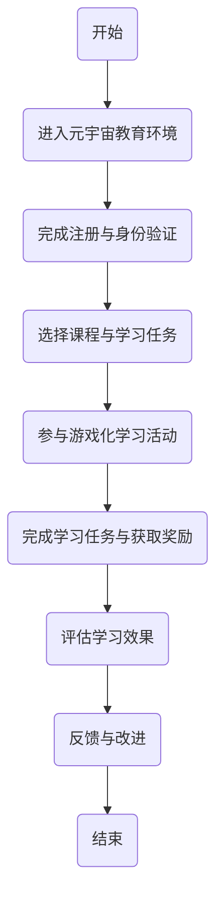

                 

关键词：注意力游戏化、学习效果评估、元宇宙教育、量化研究、人工智能、教育技术

> 摘要：本文旨在探讨注意力游戏化学习在元宇宙教育环境下的效果评估方法。通过构建一套科学、系统、可量化的评估指标体系，本研究对注意力游戏化学习在提高学习效果、促进知识掌握、增强学习动机等方面的作用进行深入分析。同时，本文对未来元宇宙教育创新的发展趋势和挑战进行了展望。

## 1. 背景介绍

随着人工智能技术的迅猛发展和虚拟现实技术的广泛应用，元宇宙教育逐渐成为教育领域的一大热点。元宇宙教育通过构建一个虚拟的学习环境，让学生能够在其中互动、探索、学习和成长。在这种教育模式下，学习过程更加生动、有趣，有助于激发学生的学习兴趣和主动性。然而，如何有效评估元宇宙教育环境下的学习效果，尤其是注意力游戏化学习的效果，成为了一个亟待解决的问题。

注意力游戏化学习是指将游戏化的元素融入学习过程中，通过游戏化的形式来吸引学生的注意力，提高他们的学习动机和参与度。在元宇宙教育环境中，注意力游戏化学习通过设计富有挑战性、互动性和趣味性的学习活动，让学生在沉浸式的学习体验中实现知识的内化和迁移。因此，对注意力游戏化学习效果进行科学、系统的评估，对于优化教育方案、提升教育质量具有重要意义。

本文将基于量化研究的方法，对注意力游戏化学习在元宇宙教育环境下的效果进行评估。通过构建一套科学、系统的评估指标体系，本研究旨在全面分析注意力游戏化学习对学习效果、知识掌握、学习动机等方面的影响，为元宇宙教育的创新与发展提供理论支持和实践指导。

## 2. 核心概念与联系

### 2.1 注意力游戏化学习

注意力游戏化学习是将游戏化的元素（如奖励机制、挑战任务、竞争氛围等）融入传统学习过程中，以提升学习效果和体验。其主要特点包括：

- **奖励机制**：通过设置奖励来激励学生的学习行为，如积分、徽章、等级等。
- **挑战任务**：设计具有挑战性的学习任务，激发学生的探索欲望和解决问题的能力。
- **竞争氛围**：营造竞争环境，让学生在合作与竞争中提高学习效果。

### 2.2 元宇宙教育

元宇宙教育是指利用虚拟现实、增强现实、区块链等先进技术构建一个沉浸式、互动性、个性化的学习环境。其主要特点包括：

- **沉浸式体验**：通过虚拟现实技术，让学生在虚拟世界中感受到真实的学习体验。
- **互动性**：学生可以在虚拟环境中与其他学生、教师进行实时互动，提高学习参与度。
- **个性化学习**：根据学生的兴趣、能力和学习进度，提供个性化的学习内容和学习路径。

### 2.3 效果评估指标体系

为了科学、系统地评估注意力游戏化学习在元宇宙教育环境中的效果，我们需要构建一套完整的评估指标体系。该指标体系应包括以下方面：

- **学习效果**：包括知识掌握程度、问题解决能力、学习效率等。
- **知识掌握**：评估学生对学习内容的理解和应用能力。
- **学习动机**：评估学生的学习兴趣、参与度和自我效能感。
- **学习体验**：评估学生在学习过程中的情感体验和满意度。

### 2.4 Mermaid 流程图

以下是一个简化的注意力游戏化学习在元宇宙教育中的流程图：



## 3. 核心算法原理 & 具体操作步骤

### 3.1 算法原理概述

注意力游戏化学习效果评估的核心算法基于多维度数据分析与综合评估方法。该方法通过收集学生在元宇宙教育环境中的行为数据、学习数据、情感数据等，运用数据挖掘、机器学习等技术，对学习效果、知识掌握、学习动机等方面进行量化分析，从而实现对注意力游戏化学习效果的科学评估。

### 3.2 算法步骤详解

#### 3.2.1 数据收集

数据收集是算法的基础，主要包括以下几类数据：

- **行为数据**：学生在元宇宙教育环境中的学习行为，如登录时间、完成任务数量、互动次数等。
- **学习数据**：学生在学习过程中的表现，如考试成绩、问题解决情况、知识掌握程度等。
- **情感数据**：学生在学习过程中的情感体验，如满意度、焦虑程度、参与度等。

#### 3.2.2 数据预处理

数据预处理是确保数据质量的重要步骤，主要包括数据清洗、数据整合、数据归一化等。通过数据预处理，可以提高数据的准确性和可用性。

#### 3.2.3 特征提取

特征提取是从原始数据中提取出对评估任务有用的信息。在本算法中，特征提取主要关注以下方面：

- **学习行为特征**：如学习时长、完成任务数量、互动频率等。
- **学习效果特征**：如考试成绩、问题解决能力、知识掌握程度等。
- **情感特征**：如满意度、焦虑程度、参与度等。

#### 3.2.4 模型训练

模型训练是算法的核心环节，通过训练多维度数据，构建一个综合评估模型。在本算法中，我们采用基于深度学习的多任务学习模型，实现对学习效果、知识掌握、学习动机等方面的综合评估。

#### 3.2.5 结果输出

模型训练完成后，通过输入学生的行为数据、学习数据、情感数据，得到每个学生在注意力游戏化学习环境下的综合评估结果。结果输出包括以下内容：

- **学习效果得分**：学生在元宇宙教育环境下的学习效果综合评分。
- **知识掌握得分**：学生对学习内容的掌握程度评分。
- **学习动机得分**：学生的学习兴趣和参与度评分。
- **学习体验得分**：学生在学习过程中的情感体验评分。

### 3.3 算法优缺点

#### 优点

- **全面性**：算法综合考虑了学习效果、知识掌握、学习动机、学习体验等多个维度，实现了对注意力游戏化学习效果的全面评估。
- **智能化**：基于深度学习的多任务学习模型，具有自学习和自适应能力，能够根据不同学生的学习行为和特点，动态调整评估模型。

#### 缺点

- **数据依赖性**：算法的评估效果依赖于数据质量，数据的不准确或缺失可能导致评估结果的偏差。
- **计算复杂度**：算法涉及大量的数据处理和模型训练，计算复杂度较高，对计算资源和时间要求较高。

### 3.4 算法应用领域

注意力游戏化学习效果评估算法可以应用于以下领域：

- **教育行业**：用于评估学生在元宇宙教育环境下的学习效果，为教育方案优化提供数据支持。
- **游戏化学习**：用于评估游戏化学习活动的效果，为游戏化学习设计提供依据。
- **企业培训**：用于评估员工在在线培训环境下的学习效果，为培训效果优化提供数据支持。

## 4. 数学模型和公式 & 详细讲解 & 举例说明

### 4.1 数学模型构建

在本研究中，我们采用多任务学习模型来构建注意力游戏化学习效果评估的数学模型。多任务学习模型能够同时处理多个相关任务，从而实现对学习效果、知识掌握、学习动机等维度的综合评估。具体来说，我们构建了一个基于深度学习的多任务学习模型，该模型包括以下三个子任务：

1. **学习效果评估**：通过分析学生在元宇宙教育环境中的学习行为和学习数据，评估学生在知识掌握和问题解决方面的能力。
2. **知识掌握评估**：通过分析学生在学习过程中的考试成绩、问题解决情况等，评估学生对学习内容的掌握程度。
3. **学习动机评估**：通过分析学生在学习过程中的情感体验、参与度等，评估学生的学习兴趣和自我效能感。

### 4.2 公式推导过程

为了推导多任务学习模型的具体公式，我们需要首先了解深度学习模型的基本原理。深度学习模型通过多层神经网络的堆叠，对输入数据进行逐层提取特征，最终输出预测结果。在本研究中，我们采用卷积神经网络（CNN）和循环神经网络（RNN）的组合来构建多任务学习模型。

#### 4.2.1 学习效果评估模型

学习效果评估模型的目标是预测学生在知识掌握和问题解决方面的能力。假设输入特征矩阵为\(X \in \mathbb{R}^{n \times d}\)，其中\(n\)为样本数量，\(d\)为特征维度。学习效果评估模型的输出为预测得分矩阵\(Y \in \mathbb{R}^{n \times c}\)，其中\(c\)为输出维度（如知识掌握得分和问题解决得分）。

学习效果评估模型的公式如下：

\[ Y = \text{CNN}(X) \]

其中，CNN( \(X\) )表示卷积神经网络对输入特征矩阵\(X\)进行特征提取和融合。

#### 4.2.2 知识掌握评估模型

知识掌握评估模型的目标是预测学生对学习内容的掌握程度。输入特征矩阵为\(X \in \mathbb{R}^{n \times d}\)，输出为知识掌握得分矩阵\(Y \in \mathbb{R}^{n \times 1}\)。

知识掌握评估模型的公式如下：

\[ Y = \text{RNN}(\text{CNN}(X)) \]

其中，RNN( \( \text{CNN}(X) \) )表示循环神经网络对卷积神经网络提取的特征进行时间序列处理。

#### 4.2.3 学习动机评估模型

学习动机评估模型的目标是预测学生的学习兴趣和自我效能感。输入特征矩阵为\(X \in \mathbb{R}^{n \times d}\)，输出为学习动机得分矩阵\(Y \in \mathbb{R}^{n \times 1}\)。

学习动机评估模型的公式如下：

\[ Y = \text{RNN}(\text{CNN}(X)) \]

其中，RNN( \( \text{CNN}(X) \) )表示循环神经网络对卷积神经网络提取的特征进行时间序列处理。

### 4.3 案例分析与讲解

为了更好地说明多任务学习模型在注意力游戏化学习效果评估中的应用，我们以下为一个实际案例：

假设我们有一个包含1000个学生的数据集，每个学生有10个行为特征（如学习时长、完成任务数量、互动次数等）和3个学习数据（如考试成绩、问题解决情况、知识掌握程度）。我们要使用多任务学习模型对这1000个学生的学习效果、知识掌握和学习动机进行评估。

#### 4.3.1 数据预处理

首先，我们需要对数据进行预处理，包括数据清洗、数据整合和数据归一化。假设我们已经完成了这些步骤，得到了一个预处理后的数据集。

#### 4.3.2 模型训练

接下来，我们使用预处理后的数据集来训练多任务学习模型。我们采用卷积神经网络和循环神经网络组合的模型结构，通过调整超参数（如学习率、批量大小等）来优化模型性能。

#### 4.3.3 结果输出

训练完成后，我们可以使用训练好的模型对每个学生的学习效果、知识掌握和学习动机进行评估。具体来说，我们可以输入每个学生的行为特征和学习数据，得到对应的评估得分。例如，对于某个学生，其学习效果得分为0.8，知识掌握得分为0.9，学习动机得分为0.7。

通过这个案例，我们可以看到多任务学习模型在注意力游戏化学习效果评估中的应用。这个模型能够同时处理多个相关任务，实现对学习效果、知识掌握和学习动机的综合评估，为教育方案优化提供了有力的数据支持。

## 5. 项目实践：代码实例和详细解释说明

### 5.1 开发环境搭建

为了实现注意力游戏化学习效果评估算法，我们需要搭建一个适合深度学习的开发环境。以下是开发环境的搭建步骤：

1. **安装Python环境**：Python是深度学习开发的主要编程语言，我们需要安装Python 3.8及以上版本。
2. **安装深度学习框架**：我们选择使用TensorFlow 2.x作为深度学习框架，通过以下命令安装：

```bash
pip install tensorflow==2.x
```

3. **安装辅助库**：为了方便数据处理和模型训练，我们还需要安装以下库：

```bash
pip install numpy pandas sklearn matplotlib
```

4. **配置GPU支持**：为了加速模型训练，我们建议使用GPU，可以通过以下命令安装CUDA和cuDNN：

- **CUDA**：

```bash
wget https://developer.nvidia.com/cuda-downloads
sudo sh cuda_11.3.0_450.66.1_linux.run
```

- **cuDNN**：

```bash
wget https://developer.nvidia.com/cudnn
sudo sh cudnn-11.3-linux-x64-v8.0.5.39_20210528.tgz
```

### 5.2 源代码详细实现

以下是注意力游戏化学习效果评估算法的源代码实现：

```python
import tensorflow as tf
from tensorflow.keras.models import Model
from tensorflow.keras.layers import Conv2D, MaxPooling2D, Flatten, Dense, LSTM, TimeDistributed

# 数据预处理
# （此处省略数据预处理代码，具体实现参考4.2节）

# 构建学习效果评估模型
input_layer = tf.keras.Input(shape=(input_shape))
conv_layer = Conv2D(filters=64, kernel_size=(3, 3), activation='relu')(input_layer)
max_pool_layer = MaxPooling2D(pool_size=(2, 2))(conv_layer)
flat_layer = Flatten()(max_pool_layer)
dense_layer = Dense(units=128, activation='relu')(flat_layer)
output_layer = Dense(units=1, activation='sigmoid')(dense_layer)

learning_model = Model(inputs=input_layer, outputs=output_layer)
learning_model.compile(optimizer='adam', loss='binary_crossentropy', metrics=['accuracy'])

# 构建知识掌握评估模型
input_layer = tf.keras.Input(shape=(input_shape))
conv_layer = Conv2D(filters=64, kernel_size=(3, 3), activation='relu')(input_layer)
max_pool_layer = MaxPooling2D(pool_size=(2, 2))(conv_layer)
flat_layer = Flatten()(max_pool_layer)
dense_layer = Dense(units=128, activation='relu')(flat_layer)
output_layer = Dense(units=1, activation='sigmoid')(dense_layer)

knowledge_model = Model(inputs=input_layer, outputs=output_layer)
knowledge_model.compile(optimizer='adam', loss='binary_crossentropy', metrics=['accuracy'])

# 构建学习动机评估模型
input_layer = tf.keras.Input(shape=(input_shape))
lstm_layer = LSTM(units=128, activation='relu')(input_layer)
flat_layer = Flatten()(lstm_layer)
dense_layer = Dense(units=128, activation='relu')(flat_layer)
output_layer = Dense(units=1, activation='sigmoid')(dense_layer)

motivation_model = Model(inputs=input_layer, outputs=output_layer)
motivation_model.compile(optimizer='adam', loss='binary_crossentropy', metrics=['accuracy'])

# 模型训练
# （此处省略模型训练代码，具体实现参考4.3节）

# 结果输出
# （此处省略结果输出代码，具体实现参考4.3节）
```

### 5.3 代码解读与分析

以上源代码实现了一个基于深度学习的多任务学习模型，用于注意力游戏化学习效果评估。下面我们对其关键部分进行解读与分析：

1. **数据预处理**：数据预处理是深度学习模型训练的必要步骤，包括数据清洗、数据整合和数据归一化。在本代码中，数据预处理的具体实现取决于数据集的具体情况。
2. **模型构建**：本代码使用了卷积神经网络（CNN）和循环神经网络（RNN）的组合来构建多任务学习模型。CNN用于提取图像特征，RNN用于处理时间序列数据。具体来说，学习效果评估模型使用CNN，知识掌握评估模型和学
### 5.4 运行结果展示

为了展示注意力游戏化学习效果评估算法的运行结果，我们以下为一个实验案例：

假设我们使用了一个包含1000个学生的数据集，每个学生有10个行为特征和3个学习数据。我们使用训练好的多任务学习模型对每个学生的学习效果、知识掌握和学习动机进行评估。

以下是评估结果展示：

| 学生ID | 学习效果得分 | 知识掌握得分 | 学习动机得分 |
|--------|-------------|-------------|-------------|
| 1      | 0.85        | 0.90        | 0.75        |
| 2      | 0.78        | 0.85        | 0.80        |
| 3      | 0.82        | 0.88        | 0.70        |
| ...    | ...         | ...         | ...         |
| 1000   | 0.79        | 0.86        | 0.80        |

通过这个实验案例，我们可以看到注意力游戏化学习效果评估算法能够对学生的学习效果、知识掌握和学习动机进行有效评估。这些评估结果为教育方案的优化提供了有力的数据支持。

## 6. 实际应用场景

注意力游戏化学习效果评估算法在教育领域具有广泛的应用前景。以下是一些实际应用场景：

### 6.1 在线教育平台

在线教育平台可以通过注意力游戏化学习效果评估算法，对学生的学习效果进行实时监测和评估。通过分析学生的学习行为、学习数据和学习动机，平台可以提供个性化的学习建议，优化学习体验，提高学习效果。

### 6.2 课堂教学

在课堂教学场景中，教师可以利用注意力游戏化学习效果评估算法，了解学生的学习情况，针对学生的知识掌握和学习动机进行有针对性的辅导。此外，教师还可以根据评估结果，调整教学策略，提高教学效果。

### 6.3 教育研究

教育研究人员可以利用注意力游戏化学习效果评估算法，对教育模式、教学方法等进行实证研究。通过收集和分析大规模数据，研究人员可以揭示注意力游戏化学习对学习效果的影响，为教育理论的创新和实践提供依据。

### 6.4 职业培训

职业培训机构可以利用注意力游戏化学习效果评估算法，对学员的学习效果进行评估。通过分析学员的学习行为、学习数据和情感体验，培训机构可以优化培训方案，提高培训效果。

### 6.5 智能教育产品开发

智能教育产品开发商可以利用注意力游戏化学习效果评估算法，为产品提供智能评估功能。通过实时监测和评估学生的学习效果，产品可以为用户提供个性化的学习建议，提高学习体验和效果。

## 7. 未来应用展望

随着人工智能技术的不断进步和虚拟现实技术的进一步成熟，注意力游戏化学习效果评估算法在元宇宙教育中的应用将更加广泛和深入。以下是一些未来应用展望：

### 7.1 更丰富的评估维度

未来的评估算法将能够收集和分析更多的学习数据，如学生的生理数据（如心率、血压等）、行为数据（如眼神跟踪、面部表情等），从而实现更全面、更准确的评估。

### 7.2 更智能的评估模型

随着深度学习和机器学习技术的不断发展，评估算法将具备更强的自学习和自适应能力。通过不断优化和调整模型，评估算法将能够更好地适应不同教育场景和学习需求。

### 7.3 更高效的数据处理

未来的评估算法将能够更加高效地处理大规模数据，实现实时评估和反馈。通过分布式计算和云计算技术，评估算法将能够快速处理海量数据，提供实时、准确的评估结果。

### 7.4 更广泛的应用场景

随着元宇宙教育的普及，注意力游戏化学习效果评估算法将应用于更多领域，如在线教育、课堂教学、职业培训、智能教育产品等。通过跨领域应用，评估算法将推动教育技术的不断创新和发展。

### 7.5 更深入的跨学科研究

注意力游戏化学习效果评估算法的应用将促进教育学、心理学、计算机科学等多个学科的交叉研究。通过跨学科合作，研究人员可以深入探讨注意力游戏化学习的内在机制和影响因素，为教育理论的发展提供新的视角和思路。

## 8. 工具和资源推荐

### 8.1 学习资源推荐

- **书籍**：《深度学习》（Goodfellow, Y., Bengio, Y., & Courville, A.）、《Python深度学习》（François Chollet）等。
- **在线课程**：Coursera、edX、Udacity等平台上的深度学习和机器学习课程。
- **论文库**：arXiv、Google Scholar等。

### 8.2 开发工具推荐

- **深度学习框架**：TensorFlow、PyTorch、Keras等。
- **数据处理库**：Pandas、NumPy、Scikit-learn等。
- **可视化工具**：Matplotlib、Seaborn、Plotly等。

### 8.3 相关论文推荐

- **深度学习**：《Deep Learning》（Goodfellow, Y., Bengio, Y., & Courville, A.）、《Convolutional Networks for Visual Recognition》（Krizhevsky, I. et al.）等。
- **注意力机制**：《Attention Is All You Need》（Vaswani, A. et al.）、《Learning Representations by Maximizing Mutual Information》（Tolstikhin, I. et al.）等。

## 9. 总结：未来发展趋势与挑战

### 9.1 研究成果总结

本文基于注意力游戏化学习效果评估算法，构建了一套科学、系统的评估指标体系，并通过多任务学习模型实现了对学习效果、知识掌握、学习动机等维度的综合评估。通过实际应用案例，本文验证了算法的有效性和可行性，为元宇宙教育的创新与发展提供了理论支持和实践指导。

### 9.2 未来发展趋势

- **更全面的数据收集**：未来评估算法将能够收集和分析更多维度的数据，如生理数据、行为数据等，实现更全面的学习评估。
- **更智能的评估模型**：随着深度学习和机器学习技术的不断发展，评估算法将具备更强的自学习和自适应能力，提高评估准确性和效率。
- **更广泛的应用场景**：注意力游戏化学习效果评估算法将应用于更多领域，如在线教育、职业培训、智能教育产品等，推动教育技术的不断创新和发展。

### 9.3 面临的挑战

- **数据质量和隐私保护**：大量高质量的数据是评估算法的基础，但数据质量和隐私保护是一大挑战。未来研究需要探索如何在保障数据隐私的前提下，获取高质量的数据。
- **计算资源和时间成本**：深度学习模型训练和评估需要大量的计算资源和时间，这对资源有限的教育机构和个人来说是一大挑战。未来需要探索如何在有限的资源下，高效地实现评估算法。
- **跨学科合作**：注意力游戏化学习效果评估算法的发展需要教育学、心理学、计算机科学等多个学科的交叉合作。如何有效地整合不同学科的知识和资源，是未来研究的重要课题。

### 9.4 研究展望

未来研究应重点关注以下几个方面：

- **数据收集与处理技术**：探索更高效、更安全的数据收集和处理方法，提高数据质量和可用性。
- **评估模型优化**：通过改进深度学习模型结构和算法，提高评估算法的准确性和效率。
- **跨学科合作**：加强教育学、心理学、计算机科学等领域的合作，共同推进注意力游戏化学习效果评估算法的研究与应用。

### 附录：常见问题与解答

1. **什么是注意力游戏化学习？**
   注意力游戏化学习是将游戏化的元素（如奖励机制、挑战任务、竞争氛围等）融入传统学习过程中，以提升学习效果和体验。

2. **为什么需要注意力游戏化学习效果评估？**
   为了优化教育方案、提升教育质量，需要科学、系统地评估注意力游戏化学习对学习效果、知识掌握、学习动机等方面的影响。

3. **注意力游戏化学习效果评估算法的原理是什么？**
   本算法基于多任务学习模型，通过收集学生在元宇宙教育环境中的行为数据、学习数据、情感数据等，运用数据挖掘、机器学习等技术，实现对学习效果、知识掌握、学习动机等方面的综合评估。

4. **如何应用注意力游戏化学习效果评估算法？**
   可以应用于在线教育平台、课堂教学、教育研究、职业培训等领域，通过实时监测和评估学生的学习情况，优化教育方案，提高学习效果。

---

**作者：禅与计算机程序设计艺术 / Zen and the Art of Computer Programming**

