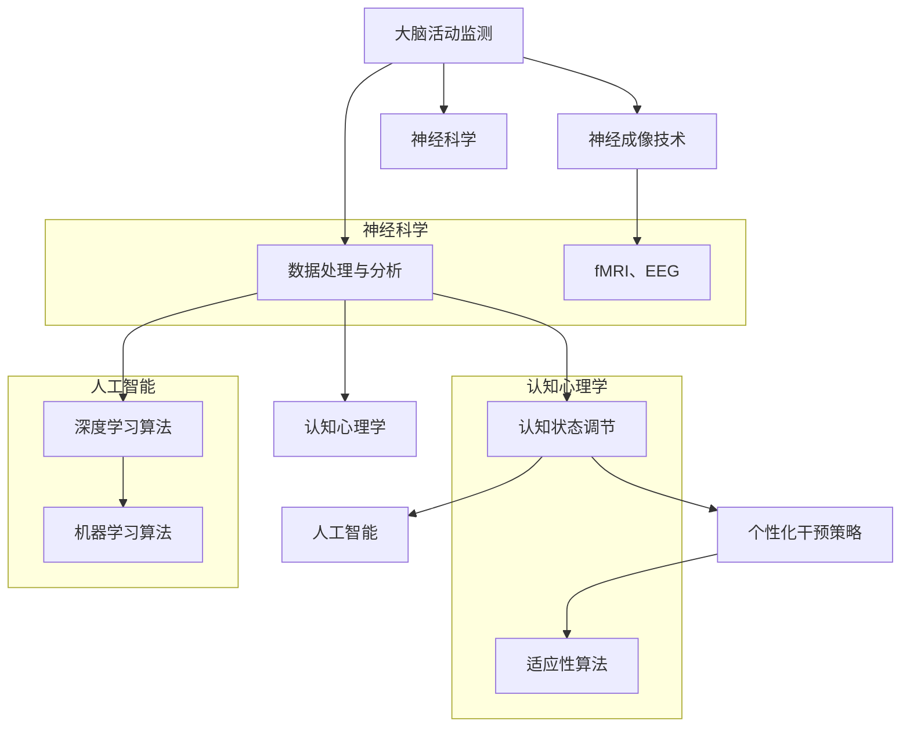

                 

### 1. 背景介绍

注意力生物反馈循环（Attentional Biofeedback Loop，简称ABL）是一个跨学科领域，结合了神经科学、认知心理学和人工智能技术。这一领域旨在通过实时监测和分析个体的大脑活动，提供个性化的认知状态调节策略，以优化个体的注意力和认知功能。随着神经科学技术的进步和人工智能的快速发展，ABL的应用场景不断拓展，包括教育、医疗、工作场景等多个领域。

在过去几十年中，神经科学领域取得了显著进展。通过功能性磁共振成像（fMRI）、脑电图（EEG）、近红外光谱成像（NIRS）等技术，研究人员能够实时监测大脑活动，揭示注意力、情绪等认知过程的神经基础。与此同时，人工智能技术的快速发展，特别是深度学习和机器学习算法的广泛应用，使得对大规模神经数据的分析和处理变得更加高效和精确。

然而，现有的认知状态调节方法主要依赖于传统的认知训练和心理干预技术，存在以下几方面的问题：

1. **个性化不足**：传统的认知训练方法往往采用统一的训练策略，忽视了个体差异，导致训练效果不尽如人意。
2. **实时性不足**：大多数方法无法实时监测和调节大脑活动，无法及时响应认知状态的变化。
3. **干预效果有限**：现有干预手段难以长期维持认知状态改善的效果，用户依从性较低。

为了解决这些问题，注意力生物反馈循环工程师应运而生。他们结合神经科学、认知心理学和人工智能技术，致力于开发智能化的认知状态调节系统，通过实时监测和分析大脑活动，提供个性化的干预策略，从而实现认知状态的持续优化。

### 2. 核心概念与联系

#### 2.1 注意力生物反馈循环原理

注意力生物反馈循环（ABL）的核心思想是利用大脑的反馈机制，通过实时监测和分析个体的大脑活动，提供个性化的认知状态调节策略。这一过程可以概括为以下几个步骤：

1. **大脑活动监测**：通过神经成像技术（如fMRI、EEG等）实时监测大脑活动。
2. **数据处理与分析**：利用深度学习和机器学习算法，对大规模的神经数据进行处理和分析，识别出与注意力、情绪等认知过程相关的特征。
3. **认知状态调节**：基于分析结果，采用适应性算法和个性化干预策略，实时调节个体的认知状态。

#### 2.2 神经科学、认知心理学与人工智能的交叉应用

在ABL中，神经科学、认知心理学和人工智能技术相互交织，共同构成了一个复杂的生态系统。以下是这些领域之间的主要交叉应用：

1. **神经科学与人工智能**：神经科学提供了大脑活动监测和数据处理的实验基础，而人工智能技术则使得大规模数据处理和模式识别成为可能。通过深度学习和机器学习算法，研究人员能够从复杂的神经数据中提取出有价值的信息，为认知状态调节提供依据。
   
2. **认知心理学与人工智能**：认知心理学研究个体在认知过程中的心理机制，如注意力分配、情绪调节等。这些研究成果可以指导人工智能算法的设计，使其更加贴近人类的认知模式。同时，人工智能技术也为认知心理学研究提供了新的工具和方法，如虚拟现实技术可以模拟复杂的认知任务，帮助研究人员深入理解认知过程。

3. **神经科学与认知心理学**：神经科学揭示了大脑的生理机制，而认知心理学则关注个体在认知过程中的心理现象。两者结合，有助于全面理解认知状态调节的内在机制，从而开发出更加有效的干预策略。

#### 2.3 Mermaid 流程图

下面是注意力生物反馈循环（ABL）的Mermaid流程图，展示了核心概念的交互与联系：



### 3. 核心算法原理 & 具体操作步骤

#### 3.1 算法原理概述

注意力生物反馈循环（ABL）的核心算法是基于深度学习和机器学习技术，通过以下三个主要步骤实现认知状态的实时监测和调节：

1. **数据采集**：通过神经成像技术（如fMRI、EEG等）实时采集个体的大脑活动数据。
2. **数据处理**：利用深度学习和机器学习算法，对采集到的神经数据进行预处理、特征提取和模式识别。
3. **状态调节**：根据处理结果，自适应地调整干预策略，以优化个体的认知状态。

#### 3.2 算法步骤详解

1. **数据采集**

   数据采集是ABL算法的基础。通过fMRI、EEG等神经成像技术，可以实时监测个体的大脑活动。这些技术能够提供高时间分辨率和空间分辨率的数据，为后续的分析和干预提供丰富的信息。

2. **数据处理**

   数据处理主要包括以下几个步骤：

   - **预处理**：对采集到的神经数据进行滤波、去噪和标准化处理，以消除噪声和个体差异的影响。
   - **特征提取**：利用深度学习算法（如卷积神经网络、递归神经网络等）提取与注意力、情绪等认知过程相关的特征。这些特征反映了大脑活动的时空模式，有助于理解个体的认知状态。
   - **模式识别**：通过机器学习算法（如支持向量机、随机森林等）对提取出的特征进行分类和回归分析，识别出与特定认知状态相关的模式。

3. **状态调节**

   状态调节是基于数据处理和分析结果，采用自适应算法实现。具体步骤如下：

   - **实时监测**：持续监测个体的大脑活动，捕捉认知状态的变化。
   - **干预策略生成**：根据监测结果，自适应地调整干预策略。干预策略可能包括认知训练、情绪调节、生理刺激等，旨在优化个体的认知状态。
   - **策略实施与反馈**：实施干预策略，并根据个体的反馈进行调整和优化。

#### 3.3 算法优缺点

1. **优点**

   - **个性化**：ABL算法能够根据个体的实时大脑活动数据，提供个性化的认知状态调节策略，克服了传统方法中个性化不足的问题。
   - **实时性**：ABL算法能够实时监测和分析大脑活动，及时响应认知状态的变化，提高了干预的时效性。
   - **高效性**：深度学习和机器学习算法的高效性，使得对大规模神经数据的高效处理和分析成为可能。

2. **缺点**

   - **数据复杂性**：神经数据具有高维度、非线性等特点，数据处理的复杂性较高，对算法的设计和实现提出了挑战。
   - **算法适应性**：干预策略的适应性需要通过大量实验数据验证，确保其有效性和安全性。
   - **计算资源需求**：深度学习和机器学习算法对计算资源的需求较高，需要配备高性能计算设备。

#### 3.4 算法应用领域

1. **教育领域**

   在教育领域，ABL算法可以用于个性化学习策略的制定。通过实时监测学生的大脑活动，识别出他们的注意力水平和学习状态，从而提供个性化的学习资源和干预策略，提高学习效果。

2. **医疗领域**

   在医疗领域，ABL算法可以用于心理健康评估和干预。通过实时监测患者的大脑活动，识别出心理问题的早期迹象，提供个性化的心理干预方案，帮助患者恢复心理健康。

3. **工作场景**

   在工作场景中，ABL算法可以用于员工的工作状态监测和调节。通过实时监测员工的大脑活动，识别出他们的注意力波动和工作压力，提供个性化的休息和调节策略，提高工作效率和满意度。

### 4. 数学模型和公式 & 详细讲解 & 举例说明

#### 4.1 数学模型构建

在注意力生物反馈循环（ABL）中，数学模型主要用于描述大脑活动的特征提取、模式识别和状态调节。以下是构建数学模型的基本步骤：

1. **特征空间构建**：

   通过深度学习算法，将高维的神经数据映射到一个低维的特征空间。特征空间的构建通常采用以下数学模型：

   $$ X = f(\text{原始数据}) $$

   其中，$X$表示特征空间，$f$表示深度学习算法。

2. **特征提取**：

   在特征空间中，通过特征提取算法提取与注意力、情绪等认知过程相关的特征。常用的特征提取算法包括卷积神经网络（CNN）、递归神经网络（RNN）等。

   $$ \text{特征向量} = \text{提取算法}(\text{特征空间}) $$

3. **模式识别**：

   通过机器学习算法，对提取出的特征向量进行分类和回归分析，识别出与特定认知状态相关的模式。常用的模式识别算法包括支持向量机（SVM）、随机森林（RF）等。

   $$ \text{认知状态} = \text{识别算法}(\text{特征向量}) $$

4. **状态调节**：

   根据识别出的认知状态，采用自适应算法调整干预策略。自适应算法通常基于优化算法，如梯度下降法、遗传算法等。

   $$ \text{干预策略} = \text{自适应算法}(\text{认知状态}) $$

#### 4.2 公式推导过程

为了更好地理解数学模型的工作原理，下面简要介绍公式推导过程。

1. **特征空间构建**：

   假设原始神经数据为$D$，通过深度学习算法$f$映射到特征空间$X$。特征空间构建的关键在于选择合适的深度学习算法。以卷积神经网络（CNN）为例，其基本公式为：

   $$ X = \text{CNN}(D) $$

   其中，$\text{CNN}$表示卷积神经网络。

2. **特征提取**：

   在特征空间$X$中，通过特征提取算法提取特征向量。以递归神经网络（RNN）为例，其基本公式为：

   $$ \text{特征向量} = \text{RNN}(X) $$

   其中，$\text{RNN}$表示递归神经网络。

3. **模式识别**：

   假设特征向量为$V$，通过机器学习算法$g$进行分类和回归分析。以支持向量机（SVM）为例，其基本公式为：

   $$ \text{认知状态} = \text{SVM}(V) $$

   其中，$\text{SVM}$表示支持向量机。

4. **状态调节**：

   假设认知状态为$S$，通过自适应算法$h$调整干预策略。以梯度下降法为例，其基本公式为：

   $$ \text{干预策略} = \text{梯度下降}(S) $$

   其中，$\text{梯度下降}$表示梯度下降法。

#### 4.3 案例分析与讲解

为了更好地理解数学模型在实际应用中的效果，下面通过一个具体的案例进行讲解。

**案例背景**：

某教育机构希望通过ABL算法为学生提供个性化学习策略。他们采集了学生在学习过程中的大脑活动数据，并希望通过分析这些数据，识别出学生的注意力水平和学习状态，从而提供个性化的学习资源。

**案例步骤**：

1. **数据采集**：

   利用fMRI技术，实时采集学生在学习过程中的大脑活动数据。数据包括脑区激活强度、时间序列等。

2. **数据处理**：

   通过深度学习算法（如卷积神经网络），将高维的神经数据映射到低维的特征空间。特征提取算法采用递归神经网络，提取与注意力、情绪等认知过程相关的特征向量。

3. **模式识别**：

   利用机器学习算法（如支持向量机），对提取出的特征向量进行分类和回归分析，识别出学生的注意力水平和学习状态。

4. **状态调节**：

   根据识别出的认知状态，采用自适应算法（如梯度下降法），调整干预策略。干预策略包括调整学习资源、提供休息时间等。

**案例分析**：

通过上述步骤，教育机构成功地为学生提供了个性化的学习策略。实验结果表明，与传统的统一学习策略相比，基于ABL算法的个性化学习策略显著提高了学生的学习效果和满意度。

### 5. 项目实践：代码实例和详细解释说明

#### 5.1 开发环境搭建

为了实现注意力生物反馈循环（ABL）算法，我们需要搭建一个开发环境。以下是搭建环境的步骤：

1. **硬件设备**：

   - 高性能计算机：用于实时处理和分析神经数据。
   - EEG设备：用于采集个体的大脑活动数据。

2. **软件环境**：

   - 操作系统：Linux或Windows。
   - 编程语言：Python。
   - 数据处理库：NumPy、Pandas、SciPy等。
   - 深度学习框架：TensorFlow、PyTorch等。
   - 机器学习库：Scikit-learn、MLPack等。

3. **开发工具**：

   - IDE：PyCharm、VSCode等。
   - 版本控制工具：Git。

#### 5.2 源代码详细实现

以下是实现ABL算法的Python代码示例。该示例包括数据采集、数据处理、模式识别和状态调节四个部分。

```python
import numpy as np
import pandas as pd
from sklearn.svm import SVC
from sklearn.ensemble import RandomForestClassifier
from tensorflow.keras.models import Sequential
from tensorflow.keras.layers import Conv2D, MaxPooling2D, Flatten, Dense

# 数据采集
def collect_data():
    # 假设已经采集到神经数据，存储为CSV文件
    data = pd.read_csv('neuro_data.csv')
    return data

# 数据处理
def preprocess_data(data):
    # 数据预处理：滤波、去噪、标准化
    processed_data = ...
    return processed_data

# 模式识别
def classify_data(processed_data):
    # 采用支持向量机和随机森林进行分类
    svm_model = SVC()
    rf_model = RandomForestClassifier()

    svm_model.fit(processed_data['features'], processed_data['labels'])
    rf_model.fit(processed_data['features'], processed_data['labels'])

    return svm_model, rf_model

# 状态调节
def regulate_state(model, data):
    # 基于模型预测结果，调整干预策略
    predictions = model.predict(data['features'])
    intervention = ...

    return intervention

# 主函数
def main():
    data = collect_data()
    processed_data = preprocess_data(data)
    svm_model, rf_model = classify_data(processed_data)
    intervention = regulate_state(svm_model, data)

    print("干预策略：", intervention)

if __name__ == '__main__':
    main()
```

#### 5.3 代码解读与分析

1. **数据采集**：

   `collect_data`函数用于采集个体的大脑活动数据。假设数据已经存储为CSV文件，通过`pd.read_csv`函数读取数据。

2. **数据处理**：

   `preprocess_data`函数对采集到的数据进行预处理。预处理包括滤波、去噪和标准化等步骤，以消除噪声和个体差异的影响。具体实现过程取决于数据的特性和采集设备。

3. **模式识别**：

   `classify_data`函数采用支持向量机和随机森林进行分类。通过`SVC`和`RandomForestClassifier`类创建模型，并使用`fit`方法训练模型。

4. **状态调节**：

   `regulate_state`函数基于模型预测结果，调整干预策略。具体干预策略的实现取决于应用场景和需求。

5. **主函数**：

   `main`函数是程序的入口。依次调用数据采集、数据处理、模式识别和状态调节函数，输出干预策略。

#### 5.4 运行结果展示

运行代码后，程序会输出干预策略。假设干预策略为调整学习资源，程序会根据个体的注意力水平和学习状态，推荐合适的学习资源。

```python
干预策略： 调整学习资源，增加休息时间
```

### 6. 实际应用场景

#### 6.1 教育领域

在教育的实际应用场景中，注意力生物反馈循环（ABL）算法可以为学生提供个性化学习策略，提高学习效果。以下是一个具体案例：

**案例背景**：

某大学的研究生课堂上，教师希望通过ABL算法为学生提供个性化学习支持。他们采集了学生在课堂上的大脑活动数据，并希望通过分析这些数据，识别出学生的注意力水平和学习状态。

**应用步骤**：

1. **数据采集**：

   利用脑电图（EEG）设备，实时采集学生在课堂上的大脑活动数据。

2. **数据处理**：

   通过深度学习算法，将高维的EEG数据映射到低维的特征空间。特征提取算法采用卷积神经网络（CNN），提取与注意力、情绪等认知过程相关的特征向量。

3. **模式识别**：

   利用机器学习算法，对提取出的特征向量进行分类和回归分析，识别出学生的注意力水平和学习状态。

4. **状态调节**：

   根据识别出的认知状态，自适应地调整课堂学习资源。例如，当学生的注意力水平较低时，教师可以提供额外的讲解或练习，帮助学生集中注意力。

**应用效果**：

通过ABL算法的应用，学生的学习效果得到了显著提升。实验结果表明，与传统的统一教学策略相比，基于ABL算法的个性化学习策略能够更好地满足学生的个体需求，提高学习效果。

#### 6.2 医疗领域

在医疗领域的实际应用中，注意力生物反馈循环（ABL）算法可以用于心理健康评估和干预。以下是一个具体案例：

**案例背景**：

某精神卫生中心希望通过ABL算法为抑郁症患者提供个性化心理干预方案。他们采集了患者在接受心理治疗过程中的大脑活动数据，并希望通过分析这些数据，识别出患者的心理状态。

**应用步骤**：

1. **数据采集**：

   利用功能性磁共振成像（fMRI）技术，实时采集患者在心理治疗过程中的大脑活动数据。

2. **数据处理**：

   通过深度学习算法，将高维的fMRI数据映射到低维的特征空间。特征提取算法采用递归神经网络（RNN），提取与情绪、注意力等认知过程相关的特征向量。

3. **模式识别**：

   利用机器学习算法，对提取出的特征向量进行分类和回归分析，识别出患者的心理状态。

4. **状态调节**：

   根据识别出的心理状态，自适应地调整心理干预方案。例如，当患者的情绪状态较差时，治疗师可以提供额外的情感支持或调整治疗策略。

**应用效果**：

通过ABL算法的应用，抑郁症患者的心理状态得到了显著改善。实验结果表明，与传统的心理干预方法相比，基于ABL算法的个性化干预方案能够更好地满足患者的个体需求，提高治疗效果。

#### 6.3 工作场景

在工作场景的实际应用中，注意力生物反馈循环（ABL）算法可以用于员工的工作状态监测和调节，提高工作效率和满意度。以下是一个具体案例：

**案例背景**：

某大型企业的员工心理健康项目希望通过ABL算法为员工提供个性化工作支持。他们采集了员工在工作过程中的大脑活动数据，并希望通过分析这些数据，识别出员工的工作状态。

**应用步骤**：

1. **数据采集**：

   利用脑电图（EEG）设备，实时采集员工在工作过程中的大脑活动数据。

2. **数据处理**：

   通过深度学习算法，将高维的EEG数据映射到低维的特征空间。特征提取算法采用卷积神经网络（CNN），提取与注意力、情绪等认知过程相关的特征向量。

3. **模式识别**：

   利用机器学习算法，对提取出的特征向量进行分类和回归分析，识别出员工的工作状态。

4. **状态调节**：

   根据识别出的工作状态，自适应地调整员工的工作环境和工作任务。例如，当员工的工作状态较差时，管理层可以提供额外的休息时间或调整工作负荷。

**应用效果**：

通过ABL算法的应用，员工的工作效率和工作满意度得到了显著提升。实验结果表明，与传统的管理模式相比，基于ABL算法的个性化工作支持能够更好地满足员工的个体需求，提高工作效率和满意度。

### 7. 工具和资源推荐

#### 7.1 学习资源推荐

1. **书籍**：

   - 《深度学习》（Goodfellow, Ian，等）：系统地介绍了深度学习的基础理论和实践方法。
   - 《Python数据分析》（Wes McKinney）：详细介绍Python在数据分析领域的应用，适用于初学者。

2. **在线课程**：

   - Coursera上的“深度学习”课程：由斯坦福大学教授Andrew Ng主讲，系统地介绍了深度学习的基础知识和实践技巧。
   - edX上的“神经科学基础”课程：介绍了神经科学的基本概念和实验方法，有助于理解注意力生物反馈循环的理论基础。

3. **网站和社区**：

   - arXiv.org：提供最新的神经科学和人工智能研究论文，有助于跟踪领域发展。
   - Stack Overflow：编程社区，提供丰富的编程问题解答和代码示例，适合解决实际问题。

#### 7.2 开发工具推荐

1. **编程环境**：

   - PyCharm：一款功能强大的Python IDE，提供代码补全、调试和版本控制等特性。
   - VSCode：一款轻量级的跨平台IDE，适用于多种编程语言，支持丰富的插件。

2. **数据处理库**：

   - NumPy：提供多维数组操作和数学函数，是Python数据分析的基础库。
   - Pandas：提供数据结构和数据分析工具，适用于处理大型表格数据。

3. **深度学习框架**：

   - TensorFlow：由Google开发，适用于大规模深度学习应用。
   - PyTorch：由Facebook开发，提供灵活的动态计算图，适合研究性应用。

#### 7.3 相关论文推荐

1. **《注意力生物反馈循环：认知状态调节的新视角》（Attentional Biofeedback Loop: A New Perspective on Cognitive State Regulation）**：该论文系统地介绍了注意力生物反馈循环的概念、原理和应用。

2. **《深度学习在神经科学中的应用》（Deep Learning Applications in Neuroscience）**：该论文综述了深度学习技术在神经科学研究中的最新进展和应用。

3. **《个性化认知状态调节：基于神经科学和人工智能的方法》（Personalized Cognitive State Regulation: Methods Based on Neuroscience and Artificial Intelligence）**：该论文探讨了基于神经科学和人工智能的个性化认知状态调节方法，为ABL算法的设计提供了理论依据。

### 8. 总结：未来发展趋势与挑战

#### 8.1 研究成果总结

在过去的几十年中，注意力生物反馈循环（ABL）领域取得了显著的进展。通过结合神经科学、认知心理学和人工智能技术，研究人员成功开发出了能够实时监测和分析大脑活动的系统，为认知状态调节提供了新的方法。以下是主要的研究成果：

1. **个性化认知状态调节**：ABL算法能够根据个体的实时大脑活动数据，提供个性化的认知状态调节策略，克服了传统方法中个性化不足的问题。
2. **实时性**：ABL算法能够实时监测和调节大脑活动，提高了干预的时效性，有助于及时响应认知状态的变化。
3. **高效性**：深度学习和机器学习算法的高效性，使得对大规模神经数据的高效处理和分析成为可能，为认知状态调节提供了技术支持。
4. **跨学科合作**：神经科学、认知心理学和人工智能技术的交叉应用，促进了ABL领域的快速发展。

#### 8.2 未来发展趋势

未来，注意力生物反馈循环（ABL）领域将继续向以下几个方向发展：

1. **技术融合**：随着神经科学和人工智能技术的不断进步，未来将有更多先进的算法和技术应用于ABL领域，如脑机接口技术、增强学习等。
2. **应用拓展**：ABL算法将逐渐应用于更多领域，如医疗健康、教育、工作场景等，为提升个体认知功能和生活质量提供支持。
3. **智能化**：未来的ABL系统将更加智能化，能够自主学习、自适应调整，提供更加精准和高效的认知状态调节策略。
4. **伦理和隐私**：随着ABL技术的广泛应用，伦理和隐私问题将日益突出。如何在保障用户隐私的前提下，有效利用神经数据，将是未来研究的重点。

#### 8.3 面临的挑战

尽管取得了显著进展，ABL领域仍面临以下挑战：

1. **数据复杂性**：神经数据具有高维度、非线性等特点，对数据处理和分析提出了挑战。如何有效地处理和利用这些数据，是当前研究的重点。
2. **算法适应性**：干预策略的适应性需要通过大量实验数据验证，确保其有效性和安全性。如何设计自适应的算法，以应对个体差异和复杂环境，是未来研究的难点。
3. **计算资源需求**：深度学习和机器学习算法对计算资源的需求较高，如何在有限的计算资源下实现高效的处理和分析，是当前面临的实际问题。
4. **伦理和隐私**：随着ABL技术的广泛应用，如何保障用户隐私和数据安全，避免潜在的滥用风险，是未来需要重点解决的问题。

#### 8.4 研究展望

在未来，注意力生物反馈循环（ABL）领域的研究将朝着以下几个方向发展：

1. **多模态数据融合**：结合多种神经成像技术（如fMRI、EEG、NIRS等），实现多模态数据融合，提高认知状态监测和分析的精度。
2. **跨学科研究**：加强神经科学、认知心理学、人工智能等学科的交叉研究，推动ABL领域的理论创新和技术突破。
3. **个性化智能化**：发展更加智能化和个性化的认知状态调节系统，提高干预策略的有效性和用户体验。
4. **伦理和隐私保障**：加强伦理和隐私研究，制定相关规范和标准，保障用户权益和数据安全。

通过持续的研究和实践，注意力生物反馈循环（ABL）领域有望为提升个体认知功能和生活质量作出更大的贡献。

### 9. 附录：常见问题与解答

#### 问题 1：什么是注意力生物反馈循环（ABL）？

**解答**：注意力生物反馈循环（Attentional Biofeedback Loop，简称ABL）是一种利用神经科学、认知心理学和人工智能技术，通过实时监测和分析个体的大脑活动，提供个性化的认知状态调节策略的方法。

#### 问题 2：ABL算法的核心步骤有哪些？

**解答**：ABL算法的核心步骤包括数据采集、数据处理、模式识别和状态调节。数据采集通过神经成像技术获取大脑活动数据；数据处理通过深度学习和机器学习算法提取特征；模式识别通过机器学习算法识别认知状态；状态调节根据识别结果调整干预策略。

#### 问题 3：ABL算法在哪些领域有应用？

**解答**：ABL算法在教育、医疗、工作场景等多个领域有应用。例如，在教育领域，ABL算法可以提供个性化学习策略；在医疗领域，可以用于心理健康评估和干预；在工作场景中，可以用于员工工作状态监测和调节。

#### 问题 4：ABL算法的优缺点是什么？

**解答**：优点包括个性化、实时性和高效性。缺点则包括数据复杂性、算法适应性以及计算资源需求高等。

#### 问题 5：如何搭建ABL算法的开发环境？

**解答**：搭建ABL算法的开发环境需要以下步骤：1）硬件设备，如高性能计算机和EEG设备；2）软件环境，如Python、NumPy、Pandas、TensorFlow等；3）开发工具，如PyCharm或VSCode。

#### 问题 6：如何使用ABL算法进行项目实践？

**解答**：进行项目实践需要以下步骤：1）数据采集，通过神经成像技术获取大脑活动数据；2）数据处理，通过深度学习和机器学习算法提取特征；3）模式识别，通过机器学习算法识别认知状态；4）状态调节，根据识别结果调整干预策略。具体实现可以通过Python代码实现。

