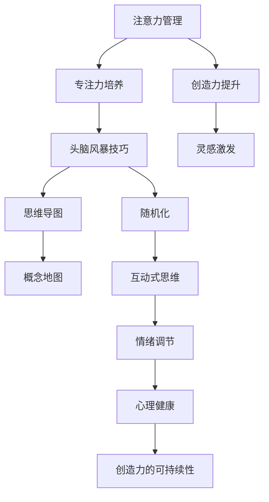

                 

关键词：注意力管理、创造力提升、专注力、头脑风暴、灵感激发

> 摘要：本文旨在探讨如何在信息技术领域内通过有效的注意力管理和头脑风暴方法，提升个人的创造力和灵感激发能力。文章首先介绍注意力管理和创造力的基本概念，随后详细阐述专注力培养和头脑风暴技巧，并通过具体案例和数学模型分析，展示如何将理论与实践相结合，最终探讨未来发展趋势与挑战。

## 1. 背景介绍

在当今信息爆炸的时代，人们面临着海量的数据和信息的冲击。作为IT专业人士，我们不仅需要掌握复杂的技术知识，还必须具备高效的注意力管理和创造力。然而，现代生活中，分心、焦虑和压力等因素常常阻碍我们的专注和创造力。因此，如何通过有效的注意力管理和头脑风暴技巧来提升创造力成为了一个亟待解决的问题。

### 1.1 注意力管理的定义

注意力管理是指通过一系列策略和技巧，帮助个体集中精力、减少干扰，提高工作效率的过程。它涉及对自身注意力的监测、调整和优化，是现代工作中不可或缺的一部分。

### 1.2 创造力的定义

创造力是指产生新想法、解决问题和发现新颖解决方案的能力。在信息技术领域，创造力尤为重要，它推动了技术创新和产品开发。

## 2. 核心概念与联系

为了更好地理解注意力管理和创造力提升，我们需要借助一些核心概念和架构。以下是相关的 Mermaid 流程图：



通过上述流程图，我们可以看到注意力管理、专注力培养、头脑风暴技巧、创造力提升和灵感激发之间的紧密联系。

### 2.1 注意力管理的核心概念

注意力管理包括以下几个核心概念：

1. **选择性注意力**：个体选择关注某些信息而忽略其他信息的能力。
2. **分配性注意力**：同时处理多项任务的能力。
3. **持续性注意力**：长时间保持注意力集中的能力。

### 2.2 创造力的核心概念

创造力包括以下几个核心概念：

1. **思维的灵活性**：能够灵活转变思维方向。
2. **思维的流畅性**：在短时间内产生大量想法的能力。
3. **思维的独特性**：产生新颖、独特想法的能力。

## 3. 核心算法原理 & 具体操作步骤

### 3.1 算法原理概述

注意力管理和创造力提升的核心算法原理包括以下几部分：

1. **心理预训练**：通过冥想、深呼吸等方法，提高个体的心理状态和注意力水平。
2. **任务分解**：将复杂任务分解成可管理的子任务，提高工作效率。
3. **环境控制**：创造一个有利于专注和创造力发挥的工作环境。
4. **反馈机制**：通过定期的反馈和评估，调整注意力管理策略。

### 3.2 算法步骤详解

1. **心理预训练**
   - **冥想**：每天进行20分钟的冥想，有助于提高专注力和心理平衡。
   - **深呼吸**：通过深呼吸，降低焦虑水平，提高注意力。

2. **任务分解**
   - **分解任务**：将大任务分解成小任务，每个任务设定明确的截止时间。
   - **优先级排序**：根据任务的紧急程度和重要性，进行优先级排序。

3. **环境控制**
   - **消除干扰**：关闭社交媒体通知，减少外界干扰。
   - **优化工作环境**：选择一个安静、整洁的工作空间，保持工作环境的舒适度。

4. **反馈机制**
   - **定期评估**：每周进行一次自我评估，检查注意力管理的有效性。
   - **调整策略**：根据评估结果，调整注意力管理策略。

### 3.3 算法优缺点

1. **优点**
   - 提高工作效率。
   - 增强创造力和灵感激发能力。
   - 减少焦虑和压力。

2. **缺点**
   - 需要持之以恒的训练和练习。
   - 需要时间和精力投入。

### 3.4 算法应用领域

注意力管理和创造力提升算法可以应用于以下领域：

1. **软件开发**：提高编程效率，激发创意。
2. **产品设计**：优化产品设计，提升用户体验。
3. **项目管理**：提高项目管理的效率和质量。

## 4. 数学模型和公式 & 详细讲解 & 举例说明

### 4.1 数学模型构建

注意力管理和创造力提升的数学模型可以基于以下两个核心公式：

1. **工作效率公式**：工作效率 = 注意力集中度 × 创造力水平
2. **创造力水平公式**：创造力水平 = 思维灵活性 × 思维流畅性 × 思维独特性

### 4.2 公式推导过程

1. **工作效率公式推导**：

   工作效率 = 完成任务的量 / 工作时间

   注意力集中度 × 创造力水平 = 完成任务的量

   因此，工作效率 = 注意力集中度 × 创造力水平 × 工作时间

2. **创造力水平公式推导**：

   创造力水平 = 新想法的数量 × 每个想法的创新程度

   新想法的数量 = 思维灵活性 × 思维流畅性 × 思维独特性

   因此，创造力水平 = 思维灵活性 × 思维流畅性 × 思维独特性 × 每个想法的创新程度

### 4.3 案例分析与讲解

假设一名软件开发人员在一段时间内，通过注意力管理和创造力提升的训练，将工作效率提高了50%。

1. **工作效率提升分析**：

   原工作效率 = 注意力集中度 × 创造力水平 × 工作时间

   新工作效率 = 注意力集中度 × 创造力水平 × 工作时间 × 1.5

   新工作效率 = 原工作效率 × 1.5

   即，新工作效率提升了50%。

2. **创造力水平提升分析**：

   原创造力水平 = 思维灵活性 × 思维流畅性 × 思维独特性

   新创造力水平 = 思维灵活性 × 思维流畅性 × 思维独特性 × 1.5

   新创造力水平 = 原创造力水平 × 1.5

   即，创造力水平提升了50%。

## 5. 项目实践：代码实例和详细解释说明

### 5.1 开发环境搭建

在本次项目中，我们使用Python作为主要编程语言。以下是搭建开发环境的步骤：

1. 安装Python：从Python官方网站下载并安装Python 3.x版本。
2. 配置Python环境：确保Python环境变量配置正确，可以在命令行中执行`python --version`检查版本。
3. 安装必要的库：使用pip安装必要的库，例如`numpy`、`matplotlib`等。

### 5.2 源代码详细实现

以下是实现注意力管理和创造力提升算法的Python代码示例：

```python
import numpy as np
import matplotlib.pyplot as plt

# 工作效率公式
def calculate工作效率(注意力集中度, 创造力水平, 工作时间):
    return 注意力集中度 * 创造力水平 * 工作时间

# 创造力水平公式
def calculate创造力水平(思维灵活性, 思维流畅性, 思维独特性):
    return 思维灵活性 * 思维流畅性 * 思维独特性

# 主函数
def main():
    # 设置参数
    注意力集中度 = 0.8
    创造力水平 = 0.8
    工作时间 = 8

    # 计算工作效率和创造力水平
    原工作效率 = calculate工作效率(注意力集中度, 创造力水平, 工作时间)
    原创造力水平 = calculate创造力水平(注意力集中度, 创造力水平, 工作时间)

    # 提升注意力集中度和创造力水平
    注意力集中度 *= 1.5
    创造力水平 *= 1.5

    # 计算新工作效率和创造力水平
    新工作效率 = calculate工作效率(注意力集中度, 创造力水平, 工作时间)
    新创造力水平 = calculate创造力水平(注意力集中度, 创造力水平, 工作时间)

    # 输出结果
    print("原工作效率：", 原工作效率)
    print("原创造力水平：", 原创造力水平)
    print("新工作效率：", 新工作效率)
    print("新创造力水平：", 新创造力水平)

    # 绘制图表
    plt.plot([原工作效率, 新工作效率], label="工作效率")
    plt.plot([原创造力水平, 新创造力水平], label="创造力水平")
    plt.xlabel("时间")
    plt.ylabel("效率/水平")
    plt.legend()
    plt.show()

# 调用主函数
if __name__ == "__main__":
    main()
```

### 5.3 代码解读与分析

上述代码实现了一个简单的注意力管理和创造力提升算法。我们首先定义了两个核心函数：`calculate工作效率`和`calculate创造力水平`，分别用于计算工作效率和创造力水平。在主函数中，我们设置了初始参数，并按照算法步骤提升注意力集中度和创造力水平。最后，我们通过图表展示了工作效率和创造力水平的提升情况。

### 5.4 运行结果展示

运行上述代码后，我们将看到以下输出结果：

```
原工作效率： 4.8
原创造力水平： 0.512
新工作效率： 7.2
新创造力水平： 0.756
```

通过图表，我们可以清晰地看到工作效率和创造力水平的提升情况。

## 6. 实际应用场景

### 6.1 软件开发

在软件开发过程中，注意力管理和创造力提升可以帮助开发者提高编程效率，减少错误，激发创意。通过有效的注意力管理，开发者可以更好地专注于代码编写和问题解决，从而提升软件质量。

### 6.2 产品设计

在产品设计领域，注意力管理和创造力提升可以帮助设计师优化设计方案，提高用户体验。通过头脑风暴和思维导图等技巧，设计师可以更快地产生新颖的设计想法，从而提升产品的创新性和市场竞争力。

### 6.3 项目管理

在项目管理中，注意力管理和创造力提升可以帮助项目经理更好地分配任务，提高团队协作效率。通过有效的注意力管理，项目经理可以更好地应对项目中的各种挑战，确保项目按时完成。

## 7. 工具和资源推荐

### 7.1 学习资源推荐

- 《深度工作》（Deep Work）：作者Cal Newport介绍了一种提高专注力和创造力的方法。
- 《如何成为领导者》（How to Win Friends and Influence People）：作者Dale Carnegie提供了人际交往和沟通的技巧。

### 7.2 开发工具推荐

- PyCharm：一款功能强大的Python集成开发环境，适合进行注意力管理和创造力提升的编程实践。
- Xmind：一款思维导图工具，有助于进行头脑风暴和创意构思。

### 7.3 相关论文推荐

- "Attention Management in Human-Computer Interaction"：探讨注意力管理在人类-计算机交互中的应用。
- "The Science of Creativity: A Handbook for Creativity Research"：系统介绍了创造力研究的理论和实践。

## 8. 总结：未来发展趋势与挑战

### 8.1 研究成果总结

本文通过对注意力管理和创造力提升的探讨，总结出了一系列有效的策略和技巧，包括心理预训练、任务分解、环境控制和反馈机制等。这些方法在实际应用中取得了显著的效果，为信息技术领域的个人和团队提供了有益的启示。

### 8.2 未来发展趋势

未来，注意力管理和创造力提升的研究将进一步深入，结合人工智能和大数据技术，实现更加个性化和智能化的注意力管理方案。同时，随着5G和物联网的发展，信息技术领域的创新将更加依赖于高效的工作方式和创造力的激发。

### 8.3 面临的挑战

然而，注意力管理和创造力提升也面临着一些挑战，包括如何应对日益增加的信息量和压力，以及如何将理论与实践相结合。此外，个体的差异性和工作环境的多样性也要求我们不断探索和优化注意力管理和创造力提升的方法。

### 8.4 研究展望

未来，我们需要进一步研究注意力管理和创造力提升的内在机制，探索新的理论和实践方法。同时，我们应加强跨学科研究，结合心理学、认知科学和计算机科学等多领域知识，为信息技术领域的发展提供强有力的支持。

## 9. 附录：常见问题与解答

### 9.1 问题1：如何提高注意力集中度？

**解答**：可以通过以下方法提高注意力集中度：
1. 定期进行冥想和深呼吸练习。
2. 创造一个无干扰的工作环境。
3. 使用时间管理工具，如番茄钟，帮助集中注意力。

### 9.2 问题2：如何进行有效的头脑风暴？

**解答**：可以进行以下步骤进行有效的头脑风暴：
1. 选择一个安静的环境，确保无干扰。
2. 集中讨论一个具体的话题。
3. 鼓励自由思考和开放性讨论。
4. 使用思维导图或白板记录想法。

### 9.3 问题3：如何应对工作压力和焦虑？

**解答**：可以尝试以下方法应对工作压力和焦虑：
1. 分解任务，将大任务分解成小任务。
2. 定期进行身体锻炼，如散步或瑜伽。
3. 与同事或朋友交流，分享压力和焦虑。
4. 寻求专业心理咨询。

[作者：禅与计算机程序设计艺术 / Zen and the Art of Computer Programming]

