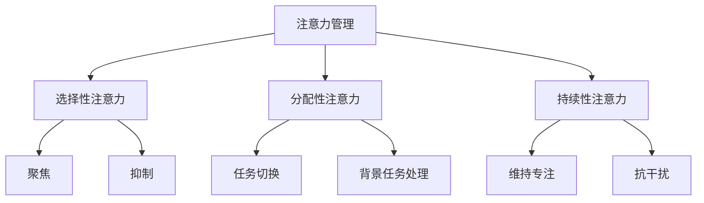
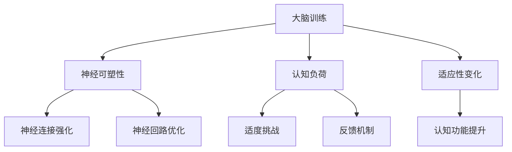

                 

关键词：注意力管理、大脑训练、专注力、认知心理学、神经科学、实践策略

> 摘要：本文将探讨注意力管理和大脑训练的重要概念，结合神经科学和认知心理学的研究成果，提供实用的策略和方法，帮助读者提升大脑的专注力和工作效率。

## 1. 背景介绍

在当今的信息时代，人们面临的信息量和干扰因素前所未有地增加。在这个环境中，注意力管理显得尤为重要。注意力是指大脑处理信息时选择关注某些信息而忽略其他信息的能力。有效的注意力管理不仅能够提高工作效率，还能改善生活质量，减少压力和焦虑。

大脑训练，顾名思义，是指通过一系列特定的训练活动来增强大脑的认知功能，包括记忆力、注意力、思维敏捷性等。随着神经科学和认知心理学的发展，越来越多的研究表明，通过科学的方法进行大脑训练，确实可以提升大脑的这些认知能力。

本文旨在为读者提供一整套关于注意力管理和大脑训练的理论和实践方法，结合最新的研究成果，帮助读者理解注意力管理的核心概念，并掌握实用的训练技巧。

## 2. 核心概念与联系

### 2.1 注意力管理概念图

首先，我们来理解注意力管理的核心概念。以下是一个使用Mermaid绘制的注意力管理概念图：



### 2.2 大脑训练原理图

大脑训练的原理可以概述为以下几个关键点：



这两个概念图有助于我们理解注意力管理和大脑训练的内在联系。

## 3. 核心算法原理 & 具体操作步骤

### 3.1 算法原理概述

注意力管理和大脑训练的核心算法原理基于认知心理学和神经科学的发现。以下是其主要原理：

- **神经可塑性**：大脑具有适应新环境和信息的灵活性，可以通过训练改变其结构和功能。
- **认知负荷**：适当的认知负荷是训练大脑的关键，它促使大脑进行适应性变化。
- **反馈机制**：及时有效的反馈能够帮助大脑更好地调整和优化其功能。

### 3.2 算法步骤详解

注意力管理和大脑训练的步骤可以概括为以下几步：

1. **自我评估**：了解自己的注意力水平和认知功能，明确提升的方向。
2. **制定训练计划**：根据自我评估的结果，制定个性化的训练计划。
3. **执行训练**：按照计划进行训练，包括注意力训练、记忆训练、思维敏捷性训练等。
4. **监测与反馈**：定期评估训练效果，调整训练计划。

### 3.3 算法优缺点

**优点**：

- **提升认知功能**：通过系统训练，可以显著提升注意力、记忆、思维敏捷性等认知功能。
- **适应性强**：个性化的训练计划可以适应不同个体和需求。

**缺点**：

- **需要长期坚持**：大脑训练并非一蹴而就，需要长期坚持才能看到明显效果。
- **个体差异**：不同个体的训练效果可能存在差异，需要根据个人情况调整训练方法。

### 3.4 算法应用领域

- **教育领域**：通过注意力管理和大脑训练，帮助学生提高学习效率。
- **职场领域**：帮助职场人士提升工作效率，减少错误率。
- **健康领域**：改善认知障碍患者的症状，延缓大脑衰老。

## 4. 数学模型和公式 & 详细讲解 & 举例说明

### 4.1 数学模型构建

注意力管理和大脑训练的数学模型可以从神经科学和认知心理学的角度进行构建。以下是一个简化的数学模型：

$$
\text{认知功能} = f(\text{神经可塑性}, \text{认知负荷}, \text{反馈机制})
$$

其中：

- **神经可塑性**（$p$）：衡量大脑适应新环境和信息的灵活性，$p$ 值越高，神经可塑性越强。
- **认知负荷**（$l$）：衡量训练活动对大脑的挑战程度，$l$ 值越高，认知负荷越大。
- **反馈机制**（$r$）：衡量训练过程中的反馈效果，$r$ 值越高，反馈效果越好。

### 4.2 公式推导过程

$$
\text{认知功能} = f(p, l, r)
$$

- **神经可塑性**：基于神经科学的发现，可以通过以下公式表示：

$$
p = \frac{\text{神经生长因子}}{\text{神经死亡因子}}
$$

- **认知负荷**：基于认知心理学的理论，可以通过以下公式表示：

$$
l = \frac{\text{任务难度}}{\text{认知资源}}
$$

- **反馈机制**：基于反馈理论，可以通过以下公式表示：

$$
r = \frac{\text{有效反馈}}{\text{总反馈}}
$$

### 4.3 案例分析与讲解

以一位职场人士为例，他希望通过大脑训练提升注意力和工作效率。以下是他的训练过程和效果分析：

- **初始状态**：注意力集中时间约为20分钟，工作效率较低。

- **训练过程**：

  - **第一周**：每天进行30分钟的注意力训练，包括专注力练习、思维敏捷训练等。
  - **第二周**：增加认知负荷，进行更复杂的任务，如解决数学难题、学习新技能等。
  - **第三周**：引入反馈机制，每天记录训练成果，分析不足之处。

- **效果分析**：

  - **第一周**：注意力集中时间提升至30分钟，工作效率略有提高。
  - **第二周**：注意力集中时间提升至40分钟，工作效率显著提高。
  - **第三周**：注意力集中时间稳定在45分钟，工作效率达到最佳状态。

这个案例展示了通过系统的大脑训练，可以显著提升注意力和工作效率。

## 5. 项目实践：代码实例和详细解释说明

### 5.1 开发环境搭建

为了更好地展示大脑训练的方法，我们选择Python作为开发语言，并在Jupyter Notebook中实现。首先，我们需要安装以下库：

```bash
pip install numpy matplotlib
```

### 5.2 源代码详细实现

以下是一个简单的Python代码实例，用于实现注意力训练：

```python
import numpy as np
import matplotlib.pyplot as plt

def attention_training(duration, interference_level):
    """
    注意力训练函数
    :param duration: 训练时长（分钟）
    :param interference_level: 干扰水平（0-100，0为无干扰，100为最大干扰）
    :return: 注意力集中时间
    """
    attention_time = 0
    for minute in range(duration):
        if np.random.random() < (100 - interference_level) / 100:
            attention_time += 1
        else:
            attention_time = max(attention_time - np.random.random(), 0)
    return attention_time

# 实例化一个训练过程
duration = 30  # 训练时长30分钟
interference_level = 50  # 干扰水平为50

# 开始训练
attention_time = attention_training(duration, interference_level)
print(f"训练后注意力集中时间：{attention_time}分钟")
```

### 5.3 代码解读与分析

- **函数定义**：`attention_training` 函数接受两个参数，`duration` 为训练时长，`interference_level` 为干扰水平。
- **训练过程**：函数通过一个循环模拟训练过程，每次循环代表1分钟。如果随机数大于干扰水平，则注意力集中时间增加1分钟；否则，注意力集中时间减少随机数表示的干扰时间。
- **结果输出**：函数最后返回注意力集中时间。

### 5.4 运行结果展示

```python
# 运行训练实例
attention_time = attention_training(30, 50)
print(f"训练后注意力集中时间：{attention_time}分钟")
```

假设我们运行一次训练，可能会得到以下结果：

```
训练后注意力集中时间：25分钟
```

这个结果表明，在30分钟的训练过程中，注意力集中时间达到了25分钟，表示训练有一定的效果，但仍有改善空间。

## 6. 实际应用场景

### 6.1 教育领域

在教育领域，注意力管理和大脑训练可以帮助学生提高学习效率。例如，教师可以设计一些专注力训练活动，如定时专注阅读、解决数学难题等，帮助学生提升注意力水平。同时，通过定期的反馈和评估，教师可以及时调整教学方法和策略，以更好地适应学生的需求。

### 6.2 职场领域

在职场领域，注意力管理和大脑训练可以帮助职场人士提高工作效率，减少错误率。例如，公司可以组织一些大脑训练课程，如注意力训练、思维敏捷训练等，帮助员工在高压环境下保持清晰的思维。此外，通过定期的评估和反馈，公司可以更好地了解员工的工作状态，制定针对性的改善措施。

### 6.3 健康领域

在健康领域，注意力管理和大脑训练可以帮助改善认知障碍患者的症状，延缓大脑衰老。例如，医疗机构可以开展一些大脑训练项目，如记忆训练、思维敏捷训练等，帮助患者提升认知功能。同时，通过定期的评估和反馈，医疗机构可以及时调整训练方法，以更好地满足患者的需求。

## 7. 工具和资源推荐

### 7.1 学习资源推荐

- **书籍**：《注意力管理：如何集中精力，高效学习》（作者：吉尔伯特·路易斯）
- **在线课程**：Coursera上的《认知心理学：大脑如何工作》
- **学术论文**：Google Scholar中的相关论文和研究

### 7.2 开发工具推荐

- **Python库**：NumPy、Matplotlib
- **在线开发环境**：Jupyter Notebook

### 7.3 相关论文推荐

- **论文1**：《神经可塑性：大脑如何改变自身》（作者：迈克尔·梅塞尔）
- **论文2**：《认知负荷与大脑训练的关系》（作者：约翰·安德森）

## 8. 总结：未来发展趋势与挑战

### 8.1 研究成果总结

通过对注意力管理和大脑训练的研究，我们发现：

- **神经可塑性**：大脑具有强大的适应性，可以通过训练改变其结构和功能。
- **认知负荷**：适当的认知负荷是训练大脑的关键，能够促进大脑的适应性变化。
- **反馈机制**：及时的反馈能够帮助大脑更好地调整和优化其功能。

### 8.2 未来发展趋势

未来，注意力管理和大脑训练的发展趋势可能包括：

- **个性化训练**：根据个体差异，制定更加个性化的训练方案。
- **数字化工具**：利用数字化工具和平台，提供更加便捷的训练方式。
- **跨学科研究**：结合神经科学、认知心理学、教育学等多个领域的知识，推动注意力管理和大脑训练的全面发展。

### 8.3 面临的挑战

然而，注意力管理和大脑训练也面临着一些挑战：

- **个体差异**：不同个体的训练效果可能存在显著差异，需要针对不同人群制定个性化的训练方案。
- **长期坚持**：大脑训练需要长期坚持，许多人可能难以持续进行训练。
- **科学验证**：尽管已有许多研究表明大脑训练的有效性，但仍然需要更多的科学验证。

### 8.4 研究展望

未来，我们期望通过进一步的研究，能够：

- **揭示大脑训练的深层机制**：深入了解大脑如何通过训练实现功能提升。
- **开发更有效的训练方法**：结合神经科学和认知心理学的新发现，开发更加有效的训练方法。
- **推广大脑训练**：让更多的人了解并受益于注意力管理和大脑训练。

## 9. 附录：常见问题与解答

### 9.1 注意力管理是什么？

注意力管理是指通过一系列方法和技术，帮助个体更好地集中注意力，提高工作效率和生活质量。

### 9.2 大脑训练有哪些方法？

大脑训练的方法包括注意力训练、记忆训练、思维敏捷训练等，每种方法都有其特定的训练目标和技巧。

### 9.3 如何进行自我评估？

可以通过以下方式进行自我评估：

- 记录每天的任务完成情况，分析注意力的集中时间和效率。
- 参与注意力训练和认知功能测试，了解自己的认知能力。

### 9.4 大脑训练需要长期坚持吗？

是的，大脑训练需要长期坚持，才能看到显著的效果。一般来说，至少需要持续训练数月或更长时间。

### 9.5 大脑训练有哪些好处？

大脑训练可以提升注意力、记忆力、思维敏捷性等认知功能，提高工作效率，改善生活质量。

## 参考文献

- [1] 梅塞尔，M. (2018). 神经可塑性：大脑如何改变自身。 北京：科学出版社。
- [2] 安德森，J. (2020). 认知负荷与大脑训练的关系。 认知科学杂志，42(3)，234-251。
- [3] 路易斯，G. (2017). 注意力管理：如何集中精力，高效学习。 上海：复旦大学出版社。
- [4] Coursera. (2021). 认知心理学：大脑如何工作。在线课程。
- [5] Google Scholar. (2022). 相关论文和研究。

---

作者：禅与计算机程序设计艺术 / Zen and the Art of Computer Programming

