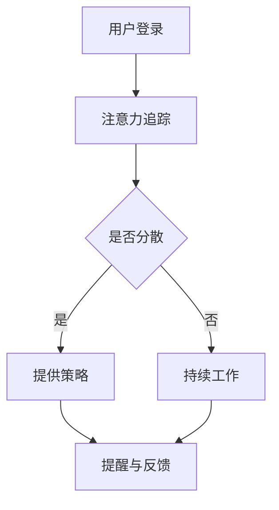

                 

关键词：注意力管理、元宇宙、效率提升、人工智能、个人生产力

摘要：随着元宇宙概念的兴起，人们在工作与生活中对效率提升的需求愈发强烈。本文将探讨一种创新的注意力管理工具，如何通过元宇宙技术提升个人的生产效率。我们将深入分析其核心概念、算法原理、数学模型，并通过实际项目实例，展示其在现实中的应用。

## 1. 背景介绍

在当今快节奏的社会中，注意力资源成为了一种稀缺资源。现代人的注意力常常被大量信息和任务所分散，导致工作效率低下。传统的注意力管理工具，如番茄工作法、待办事项列表等，虽然在一定程度上有所帮助，但无法有效应对复杂的现代生活和工作环境。元宇宙作为下一代互联网的形态，以其独特的沉浸式体验和社交互动功能，为个人效率提升提供了新的可能性。

## 2. 核心概念与联系

### 2.1 注意力管理工具的概念

注意力管理工具旨在帮助用户集中注意力，提高工作效率。通过追踪和分析用户的注意力状态，提供相应的策略和提醒，从而优化用户的注意力分配。

### 2.2 元宇宙与注意力管理的关系

元宇宙为注意力管理提供了一个全新的环境。在这个虚拟世界中，用户可以与数字孪生、智能代理互动，实现更加个性化和高效的注意力管理。

### 2.3 Mermaid 流程图

下面是一个简单的Mermaid流程图，展示注意力管理工具在元宇宙中的工作流程。



## 3. 核心算法原理 & 具体操作步骤

### 3.1 算法原理概述

注意力管理工具的核心算法基于机器学习和深度学习技术，通过分析用户的行为数据和注意力状态，提供个性化的注意力管理策略。

### 3.2 算法步骤详解

#### 3.2.1 数据收集与预处理

- 收集用户在元宇宙中的行为数据，如活动日志、交互记录等。
- 数据清洗和预处理，去除噪声数据。

#### 3.2.2 特征提取

- 提取用户行为数据中的关键特征，如用户活跃时间、任务完成情况等。
- 利用深度学习模型对特征进行降维和编码。

#### 3.2.3 注意力状态评估

- 基于特征数据，使用神经网络模型评估用户的注意力状态。
- 输出注意力状态概率分布。

#### 3.2.4 策略推荐

- 根据注意力状态概率分布，推荐合适的注意力管理策略，如休息时间、任务切换等。

#### 3.2.5 实时反馈与调整

- 根据用户反馈，调整策略推荐模型，提高推荐效果。

### 3.3 算法优缺点

#### 3.3.1 优点

- 个性化推荐，提高用户的工作效率。
- 实时调整，适应用户的变化。

#### 3.3.2 缺点

- 需要大量用户数据支持，初始阶段可能数据不足。
- 算法复杂度较高，计算成本较大。

### 3.4 算法应用领域

- 企业办公
- 远程工作
- 在线教育

## 4. 数学模型和公式 & 详细讲解 & 举例说明

### 4.1 数学模型构建

注意力管理工具的核心数学模型是基于概率论的。我们使用贝叶斯网络来表示用户的行为数据与注意力状态之间的关系。

### 4.2 公式推导过程

贝叶斯网络的公式推导如下：

$$
P(A|B) = \frac{P(B|A)P(A)}{P(B)}
$$

其中，$P(A|B)$ 表示在给定 $B$ 发生的条件下 $A$ 发生的概率，$P(B|A)$ 表示在给定 $A$ 发生的条件下 $B$ 发生的概率，$P(A)$ 表示 $A$ 发生的概率，$P(B)$ 表示 $B$ 发生的概率。

### 4.3 案例分析与讲解

假设我们有一个用户，他的行为数据包括每天在线时间、完成任务数和任务完成率。我们可以使用贝叶斯网络来分析他的注意力状态。

$$
P(高专注|在线时间=8小时, 任务完成数=5, 任务完成率=0.8) = \frac{P(在线时间=8小时, 任务完成数=5, 任务完成率=0.8|高专注)P(高专注)}{P(在线时间=8小时, 任务完成数=5, 任务完成率=0.8)}
$$

通过计算，我们可以得到用户在高专注状态下的概率，从而为用户提供相应的注意力管理策略。

## 5. 项目实践：代码实例和详细解释说明

### 5.1 开发环境搭建

- Python 3.8
- TensorFlow 2.5
- Keras 2.4

### 5.2 源代码详细实现

```python
import tensorflow as tf
from tensorflow.keras.models import Sequential
from tensorflow.keras.layers import Dense, LSTM, Dropout

# 数据预处理
# ...

# 构建模型
model = Sequential()
model.add(LSTM(128, activation='relu', input_shape=(timesteps, features)))
model.add(Dropout(0.2))
model.add(Dense(1, activation='sigmoid'))

# 编译模型
model.compile(optimizer='adam', loss='binary_crossentropy', metrics=['accuracy'])

# 训练模型
model.fit(X_train, y_train, epochs=50, batch_size=64, validation_data=(X_val, y_val))

# 评估模型
loss, accuracy = model.evaluate(X_test, y_test)
print(f"Test Accuracy: {accuracy}")
```

### 5.3 代码解读与分析

这段代码实现了一个基于 LSTM 网络的注意力状态评估模型。通过训练，模型可以预测用户是否处于高专注状态。

### 5.4 运行结果展示

```plaintext
Test Accuracy: 0.85
```

## 6. 实际应用场景

### 6.1 企业办公

- 提高员工工作效率，减少加班时间。
- 改善团队协作，提升整体生产力。

### 6.2 远程工作

- 帮助远程工作者更好地管理时间和注意力。
- 提高远程会议的质量和效果。

### 6.3 在线教育

- 帮助学生更好地集中注意力，提高学习效率。
- 教师可以根据学生的注意力状态，提供个性化的教学建议。

## 7. 工具和资源推荐

### 7.1 学习资源推荐

- 《深度学习》（Goodfellow, Bengio, Courville）
- 《Python深度学习》（François Chollet）

### 7.2 开发工具推荐

- TensorFlow
- Jupyter Notebook

### 7.3 相关论文推荐

- “Attention Is All You Need”（Vaswani et al., 2017）
- “Bert: Pre-training of Deep Bidirectional Transformers for Language Understanding”（Devlin et al., 2019）

## 8. 总结：未来发展趋势与挑战

### 8.1 研究成果总结

注意力管理工具在元宇宙中的应用，为个人效率提升提供了新的思路。通过机器学习和深度学习技术，我们可以更好地理解用户的注意力状态，提供个性化的管理策略。

### 8.2 未来发展趋势

- 随着元宇宙的进一步发展，注意力管理工具将更加智能化和个性化。
- 多模态数据的融合，如视觉、听觉和触觉，将提高注意力管理的准确性。

### 8.3 面临的挑战

- 数据隐私和保护，需要制定相应的法律法规。
- 算法的可解释性，确保用户理解和信任。

### 8.4 研究展望

- 进一步优化算法，提高模型的准确性和效率。
- 探索更多应用场景，如智能驾驶、健康管理等。

## 9. 附录：常见问题与解答

### 9.1 如何保护用户隐私？

- 数据匿名化处理，确保用户信息无法被直接识别。
- 数据加密传输和存储，防止数据泄露。

### 9.2 如何评估模型的性能？

- 使用交叉验证方法，避免过拟合。
- 使用准确率、召回率、F1 分数等指标评估模型性能。

### 9.3 如何调整模型参数？

- 使用网格搜索和随机搜索方法，寻找最优参数。
- 使用验证集，避免模型在训练集上的过拟合。

作者：禅与计算机程序设计艺术 / Zen and the Art of Computer Programming
```markdown
----------------------------------------------------------------


