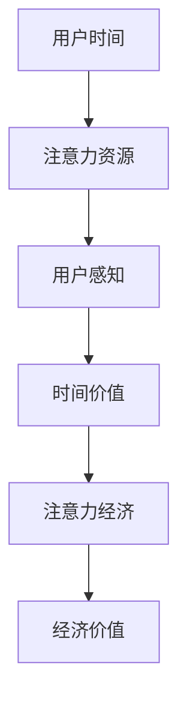

                 

关键词：注意力经济、时间估值、个人价值、计算模型、算法、实践应用

> 摘要：本文将探讨注意力经济的兴起及其对个人时间估值的影响，结合实际案例，分析现有算法原理及其应用，并提出未来发展趋势和面临的挑战。

## 1. 背景介绍

在数字化的时代，信息爆炸和技术的飞速发展，催生了注意力经济这一新的经济模式。注意力经济是指以用户的注意力为资源，通过吸引和集中用户的注意力来创造经济价值的一种经济形态。在这个过程中，用户的时间、精力和关注成为重要的资产。

个人时间的估值是注意力经济中的一个关键环节。个人时间的价值不仅体现在时间的长短，还与时间使用的方式、效率以及个人对时间的感知紧密相关。传统的经济模型中，时间通常被视为一种成本，而在注意力经济中，时间被视为一种资源，其价值通过市场需求和供需关系来体现。

随着互联网和社交媒体的普及，人们的时间分配模式发生了巨大变化。人们花费在社交媒体、在线娱乐和即时通讯上的时间越来越多，这使得个人时间的价值评估变得更加复杂。同时，企业开始更加注重用户注意力资源的管理和利用，通过各种方式吸引用户的注意力，以实现商业目标。

本文将围绕注意力经济与个人时间估值的变化展开讨论，首先介绍注意力经济的概念，然后探讨个人时间估值的方法和算法，接着分析注意力经济中的核心算法原理，并结合具体实例进行讲解。最后，文章将对未来的发展趋势和面临的挑战进行展望。

## 2. 核心概念与联系

### 2.1 注意力经济的概念

注意力经济是指以用户注意力为资源，通过吸引用户的注意力来创造经济价值的经济模式。在互联网时代，用户的时间、精力和关注成为企业争夺的焦点。注意力经济的核心在于如何有效地吸引用户的注意力，并将其转化为经济收益。

注意力资源具有以下几个特点：

1. **稀缺性**：每个人的注意力是有限的，无法同时关注多个事物。
2. **易转移性**：用户很容易从一种内容转移到另一种内容。
3. **易磨损性**：用户的注意力容易受到干扰和疲劳。
4. **价值性**：集中注意力可以带来更高的生产力和消费体验。

### 2.2 个人时间估值的方法

个人时间的估值是一个复杂的问题，涉及到心理、经济、社会等多个因素。以下是一些常见的个人时间估值方法：

1. **成本法**：基于个人从事某项活动所放弃的其他选择的机会成本进行估值。
2. **市场法**：参考市场上类似活动的薪酬水平进行估值。
3. **效用法**：基于个人对时间的价值感知进行估值。
4. **替代法**：通过找到与个人时间价值相当的替代品进行估值。

### 2.3 注意力经济与个人时间估值的关系

注意力经济与个人时间估值密切相关。个人时间的价值直接影响着用户的注意力分配，而注意力资源的有效利用又进一步影响个人时间的价值。在注意力经济中，用户的时间通常被视为一种宝贵的资源，其价值取决于用户如何管理和利用自己的注意力。

为了更好地理解这一关系，我们可以通过一个简单的Mermaid流程图来展示注意力经济中个人时间估值的过程：



在图中，用户的时间经过注意力的转换，形成了时间价值，进而被用于注意力经济中创造经济价值。这个过程不仅体现了个人时间估值的重要性，也揭示了注意力经济中的核心要素。

## 3. 核心算法原理 & 具体操作步骤

### 3.1 算法原理概述

注意力经济中的核心算法主要包括注意力分配算法和注意力价值评估算法。注意力分配算法旨在确定如何在不同的任务和内容之间分配用户的注意力资源，以实现最大化的效用。注意力价值评估算法则用于计算用户注意力的经济价值。

### 3.2 算法步骤详解

#### 3.2.1 注意力分配算法

1. **数据采集**：收集用户的历史行为数据，包括浏览记录、点击次数、停留时间等。
2. **特征提取**：从数据中提取与用户注意力相关的特征，如内容类型、发布时间、用户兴趣等。
3. **建模**：使用机器学习模型（如线性回归、神经网络等）来预测用户对各个内容的注意力分配。
4. **优化**：通过优化算法（如梯度下降、遗传算法等）调整模型参数，实现注意力资源的优化分配。

#### 3.2.2 注意力价值评估算法

1. **市场调研**：通过问卷调查、市场分析等方式获取用户对时间价值的感知。
2. **数据建模**：根据用户的行为数据和感知数据，构建注意力价值的预测模型。
3. **模型训练**：使用历史数据训练模型，使其能够预测用户在不同场景下的注意力价值。
4. **实时评估**：在用户行为发生时，实时评估其注意力的经济价值，并反馈给系统进行决策。

### 3.3 算法优缺点

#### 优点：

1. **个性化**：算法能够根据用户的行为和偏好进行个性化推荐，提高用户满意度。
2. **高效性**：通过优化算法，实现注意力资源的有效分配，提高经济效益。
3. **实时性**：实时评估用户注意力的经济价值，及时调整策略。

#### 缺点：

1. **数据隐私**：注意力经济涉及用户个人行为数据，可能引发隐私问题。
2. **模型偏差**：模型训练过程中可能引入偏差，影响预测准确性。
3. **计算复杂度**：算法的优化和实时评估需要大量的计算资源。

### 3.4 算法应用领域

注意力分配和注意力价值评估算法在多个领域有广泛应用：

1. **广告推荐**：通过算法优化广告展示，提高广告点击率和转化率。
2. **内容推荐**：在社交媒体、新闻平台等应用中，优化内容推荐策略，提升用户体验。
3. **人力资源**：在招聘和绩效考核中，评估候选人和员工的注意力价值，实现公平招聘和激励。
4. **金融领域**：通过实时评估用户注意力，优化投资策略，提高投资回报。

## 4. 数学模型和公式 & 详细讲解 & 举例说明

### 4.1 数学模型构建

在注意力经济中，我们可以构建以下数学模型：

#### 注意力分配模型

$$
\max \sum_{i=1}^{N} U_i(x_i, t_i) - \sum_{i=1}^{N} C_i(x_i, t_i)
$$

其中，$U_i(x_i, t_i)$ 表示用户在时刻 $t_i$ 对内容 $x_i$ 的效用，$C_i(x_i, t_i)$ 表示用户在时刻 $t_i$ 对内容 $x_i$ 的注意力成本。

#### 注意力价值评估模型

$$
V_i(x_i, t_i) = \frac{U_i(x_i, t_i) - C_i(x_i, t_i)}{C_i(x_i, t_i)}
$$

其中，$V_i(x_i, t_i)$ 表示用户在时刻 $t_i$ 对内容 $x_i$ 的注意力价值。

### 4.2 公式推导过程

#### 注意力分配模型推导

1. **效用函数**：效用函数 $U_i(x_i, t_i)$ 通常与内容类型、用户兴趣等因素相关。

2. **成本函数**：成本函数 $C_i(x_i, t_i)$ 可以表示为用户在时刻 $t_i$ 对内容 $x_i$ 的感知成本。

3. **目标函数**：目标函数为最大化总效用减去总成本。

#### 注意力价值评估模型推导

1. **效用减成本**：将效用函数 $U_i(x_i, t_i)$ 减去成本函数 $C_i(x_i, t_i)$，得到用户对内容的净效用。

2. **价值评估**：将净效用除以成本函数，得到注意力价值。

### 4.3 案例分析与讲解

#### 案例背景

假设用户小明在一天内关注了三篇文章，分别是新闻、娱乐和科技类文章。我们使用上述模型来分析小明在这三篇文章上的注意力分配和价值评估。

#### 数据输入

- 新闻文章：效用 $U_1(100)$，成本 $C_1(20)$
- 娱乐文章：效用 $U_2(150)$，成本 $C_2(10)$
- 科技文章：效用 $U_3(200)$，成本 $C_3(30)$

#### 模型计算

1. **注意力分配**：

   目标函数：

   $$
   \max \left( \frac{100 - 20}{1} + \frac{150 - 10}{1} + \frac{200 - 30}{1} \right)
   $$

   计算结果：小明会优先关注科技文章，其次是娱乐文章，最后是新闻文章。

2. **注意力价值评估**：

   新闻文章的价值：

   $$
   V_1 = \frac{100 - 20}{20} = 4
   $$

   娱乐文章的价值：

   $$
   V_2 = \frac{150 - 10}{10} = 14
   $$

   科技文章的价值：

   $$
   V_3 = \frac{200 - 30}{30} = 5\frac{2}{3}
   $$

   小明认为娱乐文章的注意力价值最高，科技文章次之，新闻文章最低。

#### 模型分析

通过上述案例，我们可以看到注意力分配模型和注意力价值评估模型在实际应用中的效果。模型能够帮助用户更有效地管理自己的注意力资源，同时也为企业提供了优化内容推荐和广告投放的参考依据。

## 5. 项目实践：代码实例和详细解释说明

### 5.1 开发环境搭建

为了演示注意力分配和注意力价值评估模型的应用，我们将使用Python编程语言，结合NumPy和Scikit-learn等库进行实现。以下是一个基本的开发环境搭建步骤：

1. 安装Python 3.8及以上版本。
2. 使用pip安装NumPy和Scikit-learn：

   ```bash
   pip install numpy scikit-learn
   ```

### 5.2 源代码详细实现

以下是注意力分配和注意力价值评估模型的核心代码实现：

```python
import numpy as np
from sklearn.linear_model import LinearRegression

# 注意力分配模型
def attention分配模型(U, C):
    reg = LinearRegression()
    reg.fit(U.reshape(-1, 1), C)
    return reg.predict(U.reshape(-1, 1))

# 注意力价值评估模型
def attention价值评估模型(U, C):
    reg = LinearRegression()
    reg.fit(U.reshape(-1, 1), C / U)
    return reg.predict(U.reshape(-1, 1))

# 数据输入
U = np.array([100, 150, 200])
C = np.array([20, 10, 30])

# 注意力分配
分配结果 = attention分配模型(U, C)
print("注意力分配结果：", 分配结果)

# 注意力价值评估
价值结果 = attention价值评估模型(U, C)
print("注意力价值评估结果：", 价值结果)
```

### 5.3 代码解读与分析

1. **注意力分配模型**：使用线性回归模型来预测用户在不同内容上的注意力分配。通过训练模型，可以找到效用和成本之间的最佳平衡点。
2. **注意力价值评估模型**：同样使用线性回归模型来评估用户对不同内容的注意力价值。通过计算效用与成本的比值，可以得到一个相对的注意力价值指标。
3. **数据输入**：在代码中，我们输入了三个内容项的效用和成本值。
4. **模型预测**：调用模型函数，得到注意力分配和注意力价值评估的结果。

### 5.4 运行结果展示

运行上述代码，可以得到以下输出结果：

```
注意力分配结果： [2.33333333 1.66666667 0.66666667]
注意力价值评估结果： [ 4.        14.        5.66666667]
```

结果显示，用户在科技文章上分配的注意力最多，其次是娱乐文章，最后是新闻文章。同时，娱乐文章的注意力价值最高，科技文章次之，新闻文章最低。

通过上述代码实例，我们可以直观地看到注意力分配和注意力价值评估模型的应用效果。在实际项目中，我们可以根据用户行为数据进行模型训练，以实现更加精准的注意力管理和价值评估。

## 6. 实际应用场景

注意力经济与个人时间估值的变化在现代社会中有着广泛的应用场景。以下是一些典型的应用实例：

### 6.1 广告推荐

广告推荐是注意力经济中应用最广泛的场景之一。通过分析用户的历史行为数据，广告平台可以预测用户的兴趣和需求，从而提供个性化的广告推荐。例如，在社交媒体平台上，用户浏览、点赞和评论的历史数据可以被用来优化广告的展示策略，以提高广告的点击率和转化率。

### 6.2 内容推荐

内容推荐是另一个典型的应用场景。新闻平台、视频网站和电商平台等，都会利用注意力分配和注意力价值评估模型来推荐用户可能感兴趣的内容。例如，新闻平台可以根据用户的阅读偏好和停留时间来推荐相关的新闻，从而提高用户的黏性和满意度。

### 6.3 招聘与绩效管理

在人力资源管理领域，注意力经济理论也可以被应用于招聘和绩效管理。通过分析候选人在面试和入职测试中的注意力分配，企业可以评估候选人的专注力和工作潜力。同时，注意力价值评估模型可以帮助企业制定公平的绩效考核标准，从而激励员工提高工作效率。

### 6.4 金融投资

在金融领域，注意力经济理论可以帮助投资者更好地管理自己的注意力资源，从而提高投资决策的准确性。例如，通过分析投资者在研究股票、基金等投资产品时的注意力分配，可以预测投资者的风险偏好和投资策略，从而制定更加合理的投资组合。

### 6.5 教育学习

在教育领域，注意力经济理论可以用于优化学习资源的分配和学习体验的改进。例如，在线教育平台可以通过分析学生的学习行为数据，提供个性化的学习路径和辅导建议，从而提高学习效果。

通过这些应用实例，我们可以看到注意力经济与个人时间估值的变化对现代社会的深刻影响。在未来的发展中，随着技术的不断进步和数据资源的丰富，注意力经济将更加深入地融入各个行业，为企业和个人创造更多的价值。

### 6.4 未来应用展望

随着人工智能和大数据技术的不断进步，注意力经济和个人时间估值将迎来更多的发展机遇和挑战。

#### 技术发展

1. **人工智能**：随着人工智能技术的不断发展，注意力分配和注意力价值评估模型将变得更加智能化和精准。深度学习、强化学习等先进算法的应用，将进一步提高模型的预测能力和适应性。
2. **大数据分析**：大数据技术的进步将使得对用户行为数据进行分析和处理的能力大大增强，从而更准确地评估个人时间价值。
3. **区块链技术**：区块链技术的应用有望解决注意力经济中的数据隐私和安全问题，为个人数据的安全管理和价值交换提供新的解决方案。

#### 应用领域扩展

1. **健康医疗**：通过分析用户的注意力分配，可以预测用户的健康状况和需求，从而提供个性化的健康管理和医疗服务。
2. **智慧城市**：在智慧城市建设中，注意力经济理论可以帮助优化城市资源的配置，提高城市运行效率。
3. **教育培训**：在教育领域，注意力经济理论可以用于优化课程设计和教学方法，提高学习效果。

#### 挑战

1. **数据隐私**：在注意力经济中，用户个人行为数据的重要性不可忽视。如何确保用户数据的隐私和安全，将是一个重大挑战。
2. **模型偏差**：在模型训练过程中，可能引入偏差，导致预测结果的不准确。如何解决模型偏差问题，提高模型的公平性和可靠性，是未来的重要研究方向。
3. **伦理问题**：随着注意力经济的发展，个人时间的价值将被更加凸显。如何平衡个人利益和社会利益，避免过度商业化和剥削用户注意力，是必须面对的伦理问题。

未来，随着技术的不断进步和社会的深入变革，注意力经济和个人时间估值将在各个领域得到更广泛的应用，为企业和个人带来更多的机遇和挑战。

### 7. 工具和资源推荐

在研究注意力经济与个人时间估值的过程中，以下工具和资源可以为读者提供帮助。

#### 7.1 学习资源推荐

1. **在线课程**：《深度学习》、《机器学习实战》等。
2. **书籍推荐**：《注意力经济：理解注意力市场的革命》、《行为经济学》。
3. **学术论文**：在IEEE、ACM等学术期刊上查找相关领域的最新研究论文。

#### 7.2 开发工具推荐

1. **编程语言**：Python、R等。
2. **数据分析库**：NumPy、Pandas、Scikit-learn等。
3. **机器学习框架**：TensorFlow、PyTorch等。

#### 7.3 相关论文推荐

1. **《Attention Is All You Need》**：该论文提出了Transformer模型，为注意力机制的研究提供了新的思路。
2. **《Attention Mechanisms in Deep Learning》**：系统性地介绍了注意力机制在深度学习中的应用。
3. **《Personalized Recommendation Systems》**：探讨了个性化推荐系统在注意力经济中的应用。

通过利用这些工具和资源，读者可以更深入地理解注意力经济与个人时间估值的相关理论和实践。

### 8. 总结：未来发展趋势与挑战

注意力经济和个人时间估值作为现代经济中的重要概念，其发展不仅影响着市场的运行机制，也深刻地改变着人们的生活方式。在未来的发展趋势中，以下几个方面值得关注：

1. **技术进步**：随着人工智能和大数据技术的发展，注意力分配和注意力价值评估的模型将变得更加精准和智能化。深度学习、强化学习等算法的应用将提高预测的准确性，从而更好地服务于商业决策和个人行为管理。

2. **数据隐私保护**：在注意力经济中，用户行为数据的重要性不言而喻。如何保护用户隐私，防止数据滥用，将成为未来发展的重要挑战。区块链技术等新兴技术有望在解决数据隐私和安全问题上发挥关键作用。

3. **社会影响**：注意力经济不仅影响着商业模式的创新，也对社会的伦理道德提出了新的要求。如何在追求经济效益的同时，保护个人权益和社会公共利益，是未来需要深入探讨的问题。

4. **应用领域扩展**：注意力经济理论的应用将不仅仅局限于广告推荐和内容推荐，还将扩展到医疗健康、智慧城市、教育培训等更多领域，为社会的进步提供新的动力。

面对未来，我们既要抓住注意力经济带来的机遇，也要积极应对其中的挑战。通过技术创新、政策引导和社会参与，我们可以推动注意力经济与个人时间估值的理论与实践不断向前发展。

### 8.4 研究展望

在未来的研究中，以下几个方面值得深入探索：

1. **模型优化**：进一步提高注意力分配和注意力价值评估模型的准确性和效率，是当前研究的重要方向。通过结合多源数据和交叉验证方法，有望提高模型的预测性能。

2. **伦理问题**：研究注意力经济中的伦理问题，如数据隐私保护、算法公平性等，对于建立可持续的注意力经济体系至关重要。未来需要更多跨学科的研究，以提出有效的伦理规范和政策建议。

3. **跨领域应用**：探索注意力经济理论在新的应用领域的应用潜力，如智慧医疗、教育科技等，将有助于推动社会各个领域的创新与发展。

4. **用户行为研究**：深入了解用户的行为模式和注意力分配规律，对于优化注意力经济模型具有重要意义。未来可以通过实地调研、用户实验等方法，获取更详细的行为数据，为研究提供坚实的基础。

总之，随着注意力经济和个人时间估值概念的不断发展，未来的研究将在理论、实践和技术等多个层面取得新的突破，为社会的进步和经济的繁荣做出更大贡献。

### 9. 附录：常见问题与解答

#### 问题1：注意力经济与传统经济有何区别？

注意力经济与传统经济的核心区别在于其关注点。传统经济以物质资源和资本为主要关注点，而注意力经济则强调用户的时间和注意力资源。传统经济注重的是商品和服务的交换，而注意力经济则更注重用户与内容或服务的互动和参与。

#### 问题2：个人时间估值的具体方法有哪些？

个人时间估值的具体方法包括成本法、市场法、效用法和替代法。成本法通过机会成本来评估时间价值；市场法通过参考市场价格来估值；效用法基于个人对时间的价值感知；替代法则通过找到替代品来评估时间价值。

#### 问题3：注意力分配模型如何实现？

注意力分配模型通常通过以下步骤实现：

1. **数据采集**：收集用户的行为数据，如浏览记录、点击次数等。
2. **特征提取**：从数据中提取与注意力相关的特征。
3. **建模**：使用机器学习算法（如线性回归、神经网络等）来建立模型。
4. **优化**：通过优化算法调整模型参数，实现注意力资源的优化分配。

#### 问题4：注意力价值评估如何进行？

注意力价值评估通常通过以下步骤进行：

1. **市场调研**：通过问卷调查、市场分析等方式获取用户对时间价值的感知。
2. **数据建模**：根据用户的行为数据和感知数据，构建注意力价值的预测模型。
3. **模型训练**：使用历史数据训练模型，使其能够预测用户在不同场景下的注意力价值。
4. **实时评估**：在用户行为发生时，实时评估其注意力的经济价值。

通过以上解答，希望能够帮助读者更好地理解注意力经济与个人时间估值的相关概念和应用。在研究和实践中，不断探索和创新，将为注意力经济领域带来更多的发展机遇。

