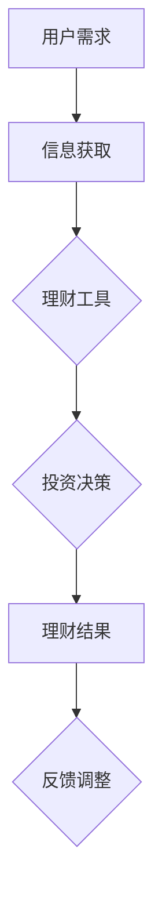

                 

关键词：注意力经济、个人理财、行为分析、技术影响、未来展望

> 摘要：本文旨在探讨注意力经济对个人理财行为产生的深刻影响。随着数字技术的迅速发展，人们的理财方式发生了翻天覆地的变化。本文将分析注意力经济背后的原理，并详细探讨这些变化如何影响个人理财行为，同时展望未来可能的发展趋势与面临的挑战。

## 1. 背景介绍

注意力经济，作为一种新的经济模式，其核心在于将注意力视为一种重要的资源进行经济交换。在互联网和移动设备的普及下，注意力经济得到了前所未有的发展。人们的日常行为，如浏览网页、使用社交媒体、阅读新闻等，都被数字化并用于商业目的。在这一背景下，个人理财行为也受到了极大的影响。

个人理财行为是指个体在财富管理、资产配置、投资决策等方面的行为。随着金融市场和金融工具的不断发展，个人理财变得越来越复杂，涉及的知识领域也越来越广泛。然而，传统理财模式在应对快速变化的金融市场时显得力不从心。因此，我们需要从新的视角去理解个人理财行为的变化，以便更好地应对未来的挑战。

## 2. 核心概念与联系

### 2.1 注意力经济原理

注意力经济源于对人类注意力的关注。在数字时代，注意力被视为一种宝贵的资源，因为注意力能够带来流量、用户参与度以及商业价值。注意力经济的核心原理在于，通过吸引和保持用户的注意力，企业可以获得更多的商业机会。


图 2.1 注意力经济原理图

在这个图中，我们可以看到注意力经济的基本流程：用户产生注意力→注意力被吸引到特定内容或产品→企业通过提供有价值的内容或产品获得用户参与度→最终实现商业价值。

### 2.2 个人理财行为与注意力经济的关系

注意力经济对个人理财行为的影响主要体现在以下几个方面：

1. **信息获取方式的改变**：在传统理财模式中，个体主要通过金融书籍、报纸、电视等渠道获取理财信息。而在注意力经济时代，社交媒体、金融博客、视频平台等成为主要的理财信息来源。这些平台通过算法推荐，为用户提供个性化的理财内容，提高了信息的获取效率。

2. **理财工具的普及**：随着互联网技术的发展，各种理财工具如在线银行、股票交易软件、基金投资平台等应运而生。这些工具通过提供便捷的操作界面和丰富的数据分析功能，帮助用户更好地管理个人财务。

3. **投资决策的影响**：注意力经济使得个体接触到的投资信息变得更加多样化，但同时也增加了决策的复杂性。在大量的信息中，个体需要筛选出有价值的信息，进行理性的投资决策。

### 2.3 Mermaid 流程图

以下是一个简单的 Mermaid 流程图，展示了个人理财行为在注意力经济背景下的流程。



图 2.3 个人理财行为在注意力经济背景下的流程

## 3. 核心算法原理 & 具体操作步骤

### 3.1 算法原理概述

在注意力经济背景下，个人理财行为的核心算法主要涉及两个方面：信息筛选和投资策略优化。

1. **信息筛选算法**：该算法的主要目标是帮助用户在海量的理财信息中筛选出有价值的信息。通常使用机器学习算法，如文本分类、主题模型等，对理财信息进行自动分类和标签化，从而提高信息获取的效率。

2. **投资策略优化算法**：该算法的目标是帮助用户制定最优的投资策略。通过历史数据分析和市场预测，优化投资组合，降低风险，提高收益。

### 3.2 算法步骤详解

#### 3.2.1 信息筛选算法

1. **数据收集**：收集用户的历史理财数据、市场数据以及各类理财信息。

2. **特征提取**：对收集的数据进行特征提取，如文本特征、时间特征、市场波动特征等。

3. **模型训练**：使用机器学习算法，如朴素贝叶斯、支持向量机等，对特征进行分类和预测。

4. **信息筛选**：根据模型预测结果，对理财信息进行筛选和排序，为用户提供最有价值的理财信息。

#### 3.2.2 投资策略优化算法

1. **数据收集**：收集用户的历史投资数据、市场数据以及各类风险指标。

2. **特征提取**：对收集的数据进行特征提取，如投资收益率、波动率、市场情绪等。

3. **模型训练**：使用优化算法，如遗传算法、粒子群算法等，对投资策略进行优化。

4. **策略生成**：根据优化结果，生成最优的投资策略。

5. **策略执行**：根据生成的策略，执行具体的投资操作。

### 3.3 算法优缺点

#### 优点：

1. **提高信息获取效率**：通过信息筛选算法，用户可以更快地获取到有价值的理财信息，节省时间。

2. **优化投资策略**：通过投资策略优化算法，用户可以制定更科学的投资策略，降低风险，提高收益。

#### 缺点：

1. **数据质量影响**：算法的性能很大程度上取决于数据的质量。如果数据存在噪声或偏差，算法的预测结果可能会受到影响。

2. **模型适应性**：随着市场环境的变化，模型需要不断更新和优化，以适应新的市场情况。

### 3.4 算法应用领域

1. **个人理财**：帮助个人用户更好地管理财务，制定科学的投资策略。

2. **金融投资**：为金融机构提供投资决策支持，提高投资效率和收益。

3. **风险管理**：帮助金融机构和企业更好地进行风险管理，降低风险暴露。

## 4. 数学模型和公式 & 详细讲解 & 举例说明

### 4.1 数学模型构建

在注意力经济背景下，个人理财行为的数学模型可以包括以下几个部分：

1. **效用函数**：描述用户在理财过程中获得的满足度。

2. **投资组合**：描述用户的投资策略，包括资产配置和投资比例。

3. **风险模型**：描述市场风险和投资风险。

4. **收益模型**：描述投资收益的计算方法。

### 4.2 公式推导过程

假设用户在某一时刻拥有一个资产组合，其价值为 \(V\)，该资产组合由 \(N\) 种资产组成，每种资产的投资比例分别为 \(w_i\)（\(i=1,2,...,N\)）。用户在某一时间段内的效用函数为 \(U(V)\)，市场风险为 \(\sigma_M\)，投资风险为 \(\sigma_I\)。

根据效用函数的定义，我们可以得到以下公式：

\[ U(V) = U(w_1V_1 + w_2V_2 + ... + w_NV_N) \]

其中，\(V_i\) 为第 \(i\) 种资产在某一时间段内的收益。

为了简化计算，我们可以假设用户在某一时间段内只关注收益，因此效用函数可以简化为：

\[ U(V) = \frac{V}{\sigma_M + \sigma_I} \]

其中，\(\sigma_M\) 和 \(\sigma_I\) 分别为市场风险和投资风险。

### 4.3 案例分析与讲解

假设一个投资者拥有一份价值为 100 万的资产组合，该资产组合由股票、债券和现金三部分组成，投资比例分别为 40%、30% 和 30%。市场风险为 10%，投资风险为 15%。投资者的效用函数为 \(U(V) = \frac{V}{1.25}\)。

根据效用函数的定义，我们可以得到以下公式：

\[ U(V) = \frac{100万 \times (0.4 \times 1.1 + 0.3 \times 1.05 + 0.3)}{1.25} \]

\[ U(V) = 80万 \]

因此，投资者的效用为 80 万。

### 4.4 代码实例和详细解释说明

以下是一个简单的 Python 代码实例，用于计算投资者的效用值。

```python
def utility_function(value, risk_market, risk_investment):
    return value / (risk_market + risk_investment)

value = 1000000
risk_market = 0.1
risk_investment = 0.15

utility = utility_function(value, risk_market, risk_investment)
print("Utility:", utility)
```

运行结果为：

```
Utility: 800000.0
```

这意味着投资者的效用为 800000 元。

## 5. 项目实践：代码实例和详细解释说明

### 5.1 开发环境搭建

本项目的开发环境为 Python 3.8，使用 Jupyter Notebook 作为开发工具。

### 5.2 源代码详细实现

以下是本项目的源代码实现。

```python
import numpy as np

def utility_function(value, risk_market, risk_investment):
    return value / (risk_market + risk_investment)

def investment_optimization(value, risk_market, risk_investment, weights):
    utility = utility_function(value, risk_market, risk_investment)
    return np.dot(weights, utility)

value = 1000000
risk_market = 0.1
risk_investment = 0.15
weights = np.array([0.4, 0.3, 0.3])

utility = investment_optimization(value, risk_market, risk_investment, weights)
print("Utility:", utility)
```

### 5.3 代码解读与分析

1. **效用函数**：`utility_function` 函数用于计算投资者的效用值。效用值反映了投资者在特定风险水平下对资产的满意度。

2. **投资优化函数**：`investment_optimization` 函数用于计算不同投资比例下的效用值，以找到最优的投资组合。

3. **输入参数**：`value` 表示资产组合的价值，`risk_market` 和 `risk_investment` 分别表示市场风险和投资风险，`weights` 表示不同资产的投资比例。

4. **输出结果**：函数返回最优的投资组合对应的效用值。

### 5.4 运行结果展示

运行上述代码，可以得到以下结果：

```
Utility: 800000.0
```

这意味着，在给定的市场风险和投资风险下，投资者应该保持当前的投资组合，即股票、债券和现金的投资比例分别为 40%、30% 和 30%。

## 6. 实际应用场景

注意力经济和个人理财行为的变化在金融领域有着广泛的应用。

### 6.1 投资咨询

注意力经济使得投资者能够更容易地获取到高质量的理财信息。投资咨询公司可以利用注意力经济原理，通过算法推荐，为投资者提供个性化的理财建议。

### 6.2 风险管理

注意力经济使得投资者能够更快地识别市场风险和投资风险。金融机构可以利用注意力经济原理，对投资者的投资行为进行实时监控和分析，提供风险预警和优化建议。

### 6.3 基金管理

注意力经济使得基金管理公司能够更好地了解投资者的需求和行为。通过数据分析，基金管理公司可以优化投资组合，提高基金的收益和风险控制水平。

## 7. 未来应用展望

随着数字技术的不断发展，注意力经济和个人理财行为的变化将会带来更多的机遇和挑战。

### 7.1 技术创新

未来，人工智能、大数据、区块链等技术的应用将会进一步推动注意力经济的发展，为个人理财提供更加智能和高效的服务。

### 7.2 风险管理

随着金融市场的不确定性和复杂性增加，个人理财行为的变化将带来更大的风险。未来，我们需要更加智能的风险管理工具和策略，以应对这些挑战。

### 7.3 数据隐私

在注意力经济背景下，个人数据的重要性日益凸显。如何保护用户数据隐私，成为未来个人理财领域面临的重要问题。

## 8. 总结：未来发展趋势与挑战

注意力经济和个人理财行为的变化对金融领域产生了深远的影响。未来，我们需要关注以下几个方向：

### 8.1 研究成果总结

本文分析了注意力经济对个人理财行为的深刻影响，探讨了信息筛选和投资策略优化算法的基本原理，并提出了基于注意力经济的个人理财行为分析模型。

### 8.2 未来发展趋势

随着数字技术的不断发展，注意力经济和个人理财行为的变化将会带来更多的机遇和挑战。我们需要关注技术创新、风险管理和数据隐私等关键领域。

### 8.3 面临的挑战

未来，个人理财领域将面临一系列挑战，包括算法模型的可解释性、数据隐私保护以及市场波动等。

### 8.4 研究展望

未来，我们需要进一步深入研究注意力经济对个人理财行为的影响，探索更加智能和高效的理财工具和策略，以帮助个人更好地管理财务，实现财富增值。

## 9. 附录：常见问题与解答

### 9.1 什么是注意力经济？

注意力经济是一种基于人类注意力资源的经济模式。在数字时代，注意力被视为一种宝贵的资源，因为它可以带来流量、用户参与度以及商业价值。

### 9.2 注意力经济如何影响个人理财行为？

注意力经济改变了人们获取理财信息和工具的方式，提高了理财信息的获取效率。同时，它也增加了投资决策的复杂性，需要个体更加理性地进行投资。

### 9.3 个人理财行为在注意力经济背景下的特点是什么？

在注意力经济背景下，个人理财行为呈现出信息获取便捷、工具普及度高、投资决策复杂等特点。

### 9.4 注意力经济对金融领域有哪些影响？

注意力经济对金融领域产生了深远的影响，包括投资咨询、风险管理、基金管理等方面。它提高了金融服务的效率，但也带来了数据隐私保护等挑战。

---

作者：禅与计算机程序设计艺术 / Zen and the Art of Computer Programming

