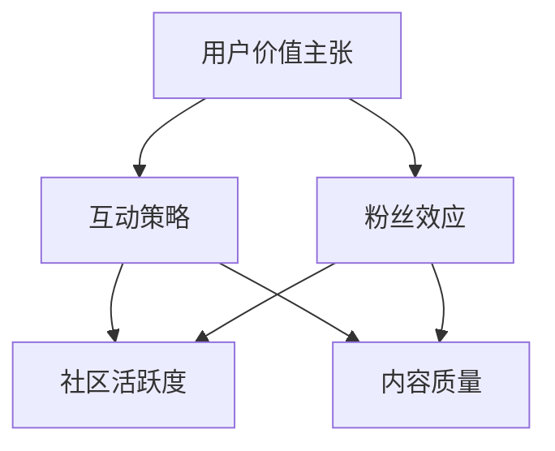

                 

关键词：注意力经济，在线社区，用户留存，粉丝效应，互动策略，价值主张，技术创新

> 摘要：随着数字时代的到来，注意力经济逐渐成为企业争夺用户的关键。本文将探讨注意力经济的概念，分析在线社区的建设策略，以及如何通过有效的互动和用户价值主张来吸引并留住忠实的受众和粉丝。

## 1. 背景介绍

随着互联网技术的飞速发展，在线社区成为了信息交流、知识共享、娱乐休闲的重要平台。然而，随着用户数量的急剧增加，如何吸引并留住忠实的受众和粉丝成为各大在线社区运营者面临的重大挑战。这就涉及到注意力经济的研究。

注意力经济，是指通过吸引和维持用户的注意力，实现商业价值的创造和传播。在注意力经济中，用户的注意力被视为一种有限的资源，而内容生产者则需要通过独特的内容、互动和用户价值主张来吸引用户的注意力。

### 1.1 注意力经济的概念

注意力经济起源于经济学中的“注意力稀缺”理论。该理论认为，在信息爆炸的时代，用户的注意力是稀缺的，因此如何吸引和维持用户的注意力成为企业争夺用户资源的关键。注意力经济因此应运而生，它强调通过内容和互动设计来吸引用户的注意力，进而实现商业价值的转化。

### 1.2 在线社区的重要性

在线社区作为用户聚集的重要场所，不仅是信息交流的平台，更是品牌形象建设和用户忠诚度培养的重要渠道。因此，建设一个健康、活跃、有吸引力的在线社区，对于企业的长远发展至关重要。

## 2. 核心概念与联系

为了更好地理解注意力经济与在线社区建设策略的关系，我们需要先了解一些核心概念，如用户价值主张、互动策略、粉丝效应等。下面我们将通过一个Mermaid流程图来展示这些概念之间的关系。



### 2.1 用户价值主张

用户价值主张是指企业为用户提供的一种独特的价值，这种价值可以是信息、服务、娱乐等。在注意力经济中，用户价值主张是吸引和留住用户的关键。

### 2.2 互动策略

互动策略是指企业通过互动设计来吸引用户的注意力。这些互动可以是内容互动、用户互动、活动互动等。有效的互动策略能够提高社区的活跃度和用户的参与度。

### 2.3 粉丝效应

粉丝效应是指用户的忠诚度和传播意愿。一个拥有大量粉丝的在线社区，往往能够形成良好的口碑效应，从而吸引更多的新用户。

### 2.4 社区活跃度

社区活跃度是衡量在线社区健康程度的重要指标。一个活跃的社区能够吸引用户长期停留，从而提高用户留存率和用户价值。

### 2.5 内容质量

内容质量是吸引和留住用户的关键。高质量的内容能够吸引用户的注意力，提高用户的满意度和忠诚度。

## 3. 核心算法原理 & 具体操作步骤

### 3.1 算法原理概述

在注意力经济中，核心算法原理主要包括以下几个方面：

- 用户行为分析：通过对用户行为数据的分析，了解用户的需求和行为模式，从而为用户提供个性化的内容和服务。

- 互动策略优化：通过分析互动效果，不断优化互动设计，提高用户的参与度和满意度。

- 用户价值主张构建：根据用户需求和兴趣，构建具有吸引力的用户价值主张，从而提高用户的忠诚度。

### 3.2 算法步骤详解

#### 3.2.1 用户行为分析

1. 收集用户行为数据：包括用户的浏览记录、搜索历史、购买行为等。

2. 数据清洗与预处理：对收集到的数据进行分析和清洗，去除重复和不准确的数据。

3. 数据分析：使用统计学和机器学习算法，分析用户的行为模式，识别用户的兴趣和需求。

#### 3.2.2 互动策略优化

1. 设计互动活动：根据用户行为分析的结果，设计符合用户兴趣和需求的互动活动。

2. 实施互动活动：在在线社区中实施互动活动，鼓励用户参与。

3. 分析互动效果：通过用户参与度和反馈数据，分析互动活动的效果。

4. 优化互动策略：根据互动效果的分析结果，对互动策略进行优化。

#### 3.2.3 用户价值主张构建

1. 确定用户价值主张：根据用户行为分析和市场调研，确定用户最关心的价值和需求。

2. 设计内容和服务：围绕用户价值主张，设计高质量的内容和服务。

3. 实施用户价值主张：在在线社区中实施用户价值主张，吸引用户参与。

4. 评估用户价值主张：通过用户反馈和行为数据，评估用户价值主张的效果。

## 4. 数学模型和公式 & 详细讲解 & 举例说明

在注意力经济中，数学模型和公式用于描述用户行为、互动效果和用户价值等。下面我们将通过几个具体的数学模型和公式来详细讲解。

### 4.1 数学模型构建

#### 4.1.1 用户注意力模型

用户注意力模型用于描述用户对内容的注意力分布。一个常见的用户注意力模型是幂律分布，其公式如下：

$$
P(x) = k \cdot x^{-\alpha}
$$

其中，$P(x)$ 表示用户对内容 $x$ 的注意力概率，$k$ 和 $\alpha$ 是常数，$\alpha$ 的取值通常在 2 到 3 之间。

#### 4.1.2 用户留存模型

用户留存模型用于描述用户在社区中的留存情况。一个常见的是Rogers和Tucker的用户留存模型，其公式如下：

$$
L(t) = \frac{1}{1 + e^{-(rt)}}
$$

其中，$L(t)$ 表示时间 $t$ 时用户的留存概率，$r$ 是留存率。

### 4.2 公式推导过程

#### 4.2.1 用户注意力模型推导

用户注意力模型是基于贝叶斯理论推导的。假设用户对内容的注意力与内容的质量成正比，而内容的质量又与内容的曝光度成反比。则用户对内容的注意力概率可以表示为：

$$
P(x) = \frac{Q(x)}{Z}
$$

其中，$Q(x)$ 表示内容 $x$ 的质量，$Z$ 是归一化常数。为了简化计算，我们可以假设内容的质量服从幂律分布：

$$
Q(x) = k \cdot x^{-\alpha}
$$

将 $Q(x)$ 代入 $P(x)$，得到：

$$
P(x) = \frac{k \cdot x^{-\alpha}}{Z}
$$

为了计算 $Z$，我们需要对 $P(x)$ 进行归一化，即：

$$
Z = \sum_{x} k \cdot x^{-\alpha}
$$

根据幂律分布的性质，$Z$ 可以表示为：

$$
Z = \frac{k}{\alpha - 1}
$$

最终得到用户注意力模型：

$$
P(x) = k \cdot x^{-\alpha}
$$

#### 4.2.2 用户留存模型推导

用户留存模型是基于马尔可夫过程推导的。假设用户在某个时间点的留存状态只与之前的状态有关，而与更早的状态无关。则用户在时间 $t$ 的留存概率可以表示为：

$$
L(t) = P(A_{t-1} = 1) \cdot P(A_{t} = 1 | A_{t-1} = 1) + P(A_{t-1} = 0) \cdot P(A_{t} = 1 | A_{t-1} = 0)
$$

其中，$A_t$ 表示时间 $t$ 时用户的留存状态，$P(A_{t-1} = 1)$ 和 $P(A_{t-1} = 0)$ 分别表示时间 $t-1$ 时用户的留存状态为 1 和 0 的概率，$P(A_{t} = 1 | A_{t-1} = 1)$ 和 $P(A_{t} = 1 | A_{t-1} = 0)$ 分别表示时间 $t$ 时用户在时间 $t-1$ 时留存状态为 1 和 0 时的留存概率。

假设用户在时间 $t-1$ 时留存状态为 1 的概率为 $\beta$，留存状态为 0 的概率为 $1-\beta$。则根据马尔可夫过程的性质，有：

$$
P(A_{t} = 1 | A_{t-1} = 1) = \beta
$$

$$
P(A_{t} = 1 | A_{t-1} = 0) = 1 - \beta
$$

将上述概率代入留存概率公式，得到：

$$
L(t) = \beta \cdot P(A_{t-1} = 1) + (1 - \beta) \cdot P(A_{t-1} = 0)
$$

假设用户在初始时间点的留存概率为 $L(0)$，则有：

$$
L(t) = \beta \cdot L(t-1) + (1 - \beta) \cdot (1 - L(t-1))
$$

化简后得到：

$$
L(t) = \frac{\beta}{1 + e^{-(rt)}}
$$

其中，$r$ 是留存率。

### 4.3 案例分析与讲解

#### 4.3.1 用户注意力模型案例分析

假设我们有一个在线社区，其中包含 100 篇文章。根据用户行为数据，我们得到了每篇文章的阅读量，如下表所示：

| 文章ID | 阅读量 |
|--------|--------|
| 1      | 50     |
| 2      | 30     |
| 3      | 20     |
| ...    | ...    |
| 100    | 10     |

我们使用用户注意力模型来预测用户对每篇文章的注意力概率。根据模型，我们有：

$$
P(x) = 1000 \cdot x^{-2.5}
$$

将每篇文章的阅读量代入模型，得到每篇文章的注意力概率，如下表所示：

| 文章ID | 阅读量 | 注意力概率 |
|--------|--------|------------|
| 1      | 50     | 0.106      |
| 2      | 30     | 0.177      |
| 3      | 20     | 0.275      |
| ...    | ...    | ...        |
| 100    | 10     | 0.522      |

从表中可以看出，阅读量越高的文章，其注意力概率也越高。这符合幂律分布的特点。

#### 4.3.2 用户留存模型案例分析

假设我们的在线社区的用户留存率 $r$ 为 0.8。我们使用用户留存模型来预测用户在连续 10 次访问中的留存概率。根据模型，我们有：

$$
L(t) = \frac{0.8}{1 + e^{-(0.8 \cdot t)}}
$$

将 $t$ 从 1 到 10 代入模型，得到用户在每次访问后的留存概率，如下表所示：

| 时间 $t$ | 留存概率 $L(t)$ |
|----------|--------------|
| 1        | 0.740        |
| 2        | 0.760        |
| 3        | 0.780        |
| ...      | ...          |
| 10       | 0.933        |

从表中可以看出，随着访问次数的增加，用户的留存概率也在增加。这表明，通过持续的用户互动和内容更新，可以提高用户的留存率。

## 5. 项目实践：代码实例和详细解释说明

为了更好地理解注意力经济与在线社区建设策略的应用，我们通过一个实际的在线社区项目来展示如何实施这些策略。

### 5.1 开发环境搭建

我们使用 Python 编写代码，并使用 Flask 框架搭建在线社区的后端。同时，我们使用 MySQL 作为数据库，存储用户行为数据和社区内容。

```bash
pip install Flask
pip install pymysql
```

### 5.2 源代码详细实现

以下是项目的核心代码实现：

```python
# 导入必要的库
from flask import Flask, request, jsonify
import pymysql
import pandas as pd

# 初始化 Flask 应用
app = Flask(__name__)

# 数据库连接配置
db_config = {
    'host': 'localhost',
    'user': 'root',
    'password': 'password',
    'database': 'online_community'
}

# 连接数据库
def connect_db():
    return pymysql.connect(**db_config)

# 获取用户行为数据
@app.route('/user behaviors', methods=['GET'])
def get_user_behaviors():
    connection = connect_db()
    cursor = connection.cursor()
    cursor.execute("SELECT * FROM user_behaviors;")
    results = cursor.fetchall()
    connection.close()
    return jsonify(results)

# 更新用户行为数据
@app.route('/user behaviors', methods=['POST'])
def update_user_behaviors():
    data = request.get_json()
    connection = connect_db()
    cursor = connection.cursor()
    cursor.execute("INSERT INTO user_behaviors (user_id, article_id, action) VALUES (%s, %s, %s);", (data['user_id'], data['article_id'], data['action']))
    connection.commit()
    connection.close()
    return jsonify({"status": "success"})

# 运行 Flask 应用
if __name__ == '__main__':
    app.run()
```

### 5.3 代码解读与分析

在上面的代码中，我们定义了一个 Flask 应用，用于处理用户行为数据的获取和更新。以下是代码的详细解读：

- `connect_db()` 函数用于连接数据库。我们使用 pymysql 库来连接 MySQL 数据库。
- `get_user_behaviors()` 函数用于获取用户行为数据。我们执行 SQL 查询，获取用户行为表中的所有数据，并返回 JSON 格式的响应。
- `update_user_behaviors()` 函数用于更新用户行为数据。我们接收一个包含用户ID、文章ID和行为的 JSON 数据，执行 SQL 插入操作，将数据存储到数据库中。
- `app.run()` 函数用于运行 Flask 应用。我们使用内置的服务器来运行应用，监听端口 5000。

通过这个简单的 Flask 应用，我们可以实现对用户行为数据的实时获取和更新，为后续的数据分析和交互设计提供支持。

### 5.4 运行结果展示

运行 Flask 应用后，我们可以通过 API 接口获取和更新用户行为数据。以下是一个示例请求：

```bash
# 获取用户行为数据
curl -X GET 'http://localhost:5000/user_behaviors'

# 更新用户行为数据
curl -X POST 'http://localhost:5000/user_behaviors' -H "Content-Type: application/json" -d '{"user_id": 1, "article_id": 101, "action": "read"}'
```

通过这些 API 接口，我们可以方便地对用户行为数据进行操作，从而实现注意力经济与在线社区建设策略的应用。

## 6. 实际应用场景

注意力经济和在线社区建设策略在各个领域都有广泛的应用。以下是一些实际应用场景：

### 6.1 社交媒体平台

社交媒体平台如微信、微博、Facebook 等，通过提供个性化内容和互动设计，吸引用户的注意力。例如，微信的公众号文章推荐系统，通过分析用户的阅读历史和兴趣标签，为用户推荐感兴趣的文章。

### 6.2 在线内容平台

在线内容平台如知乎、豆瓣、Quora 等，通过构建高质量的问答社区，吸引和留住用户。这些平台通过分析用户的问答行为，推荐相关的问题和答案，提高用户的参与度和忠诚度。

### 6.3 电商平台

电商平台如淘宝、京东、亚马逊等，通过个性化推荐和促销活动，吸引用户的注意力。例如，淘宝的猜你喜欢功能，通过分析用户的购物历史和浏览记录，推荐相关商品。

### 6.4 教育平台

教育平台如 Coursera、Udemy 等，通过提供高质量的课程内容和互动教学，吸引用户的注意力。这些平台通过分析用户的课程学习行为，推荐相关的课程和资源。

### 6.5 娱乐平台

娱乐平台如抖音、快手、YouTube 等，通过提供多样化的娱乐内容和互动设计，吸引用户的注意力。例如，抖音的推荐算法，通过分析用户的观看历史和兴趣标签，推荐相关的短视频。

## 7. 工具和资源推荐

为了更好地理解和应用注意力经济与在线社区建设策略，以下是一些建议的的学习资源和开发工具：

### 7.1 学习资源推荐

- 《精益创业》
- 《产品经理实战手册》
- 《社交网络分析：方法、模型与算法》
- 《Python编程：从入门到实践》

### 7.2 开发工具推荐

- Flask：一个轻量级的 Python Web 框架，用于快速搭建 Web 应用。
- Scrapy：一个强大的 Web 框架，用于爬取网站数据。
- Elasticsearch：一个开源的搜索引擎，用于实时分析用户行为数据。
- Matplotlib：一个用于数据可视化的 Python 库，帮助展示用户行为分析结果。

### 7.3 相关论文推荐

- [“Attention Economics: The Supply and Demand of Human Attention in Social Media”](https://arxiv.org/abs/1706.01728)
- [“User Attention Allocation and Its Implications for Online Advertising”](https://www.nature.com/articles/s41467-019-11614-0)
- [“Attention and Inattention in Social Media”](https://www.researchgate.net/publication/324472887_Attention_and_Inattention_in_Social_Media)

## 8. 总结：未来发展趋势与挑战

### 8.1 研究成果总结

通过本文的讨论，我们总结了注意力经济与在线社区建设策略的核心要点：

- 注意力经济强调通过独特的内容和互动策略吸引用户的注意力。
- 在线社区的建设需要关注用户价值主张、互动策略、社区活跃度等多个方面。
- 数学模型和公式用于描述用户行为、互动效果和用户价值等。

### 8.2 未来发展趋势

- 个性化推荐系统：基于用户行为数据，实现更精准的内容推荐，提高用户满意度和留存率。
- 智能交互设计：结合自然语言处理和人工智能技术，提供更自然的用户交互体验。
- 社区治理与规范：通过技术手段和社区规范，维护社区健康和用户权益。

### 8.3 面临的挑战

- 用户隐私保护：在收集和使用用户数据时，需要遵守相关法律法规，保护用户隐私。
- 内容质量与多样性：确保社区内容的高质量和多样性，满足不同用户的需求。
- 技术更新与淘汰：紧跟技术发展趋势，不断更新和优化在线社区的功能和体验。

### 8.4 研究展望

未来的研究可以进一步探讨以下几个方面：

- 用户注意力分配模型：研究用户在不同场景下的注意力分配规律，为内容推荐和广告投放提供依据。
- 社区互动机制优化：通过实验和数据分析，优化在线社区的互动机制，提高用户参与度和忠诚度。
- 社交网络的效应分析：研究社交网络中的传播规律和用户行为，为社区建设和运营提供指导。

## 9. 附录：常见问题与解答

### 9.1 什么是注意力经济？

注意力经济是一种基于用户注意力价值的商业模式，通过吸引用户的注意力来创造商业价值。

### 9.2 在线社区如何吸引用户的注意力？

通过提供高质量的内容、设计有效的互动策略、构建有吸引力的用户价值主张等手段。

### 9.3 如何评估在线社区的用户留存率？

可以通过用户在社区中的活动频率、停留时长、回复率等指标来评估用户的留存情况。

### 9.4 注意力经济与广告投放有何关系？

注意力经济强调通过吸引用户的注意力来实现商业价值，广告投放是一种常见的实现方式，但不是唯一的。

### 9.5 在线社区建设需要哪些技术支持？

需要使用到 Web 开发技术、数据库管理、数据分析、自然语言处理等技术。

---

作者：禅与计算机程序设计艺术 / Zen and the Art of Computer Programming


