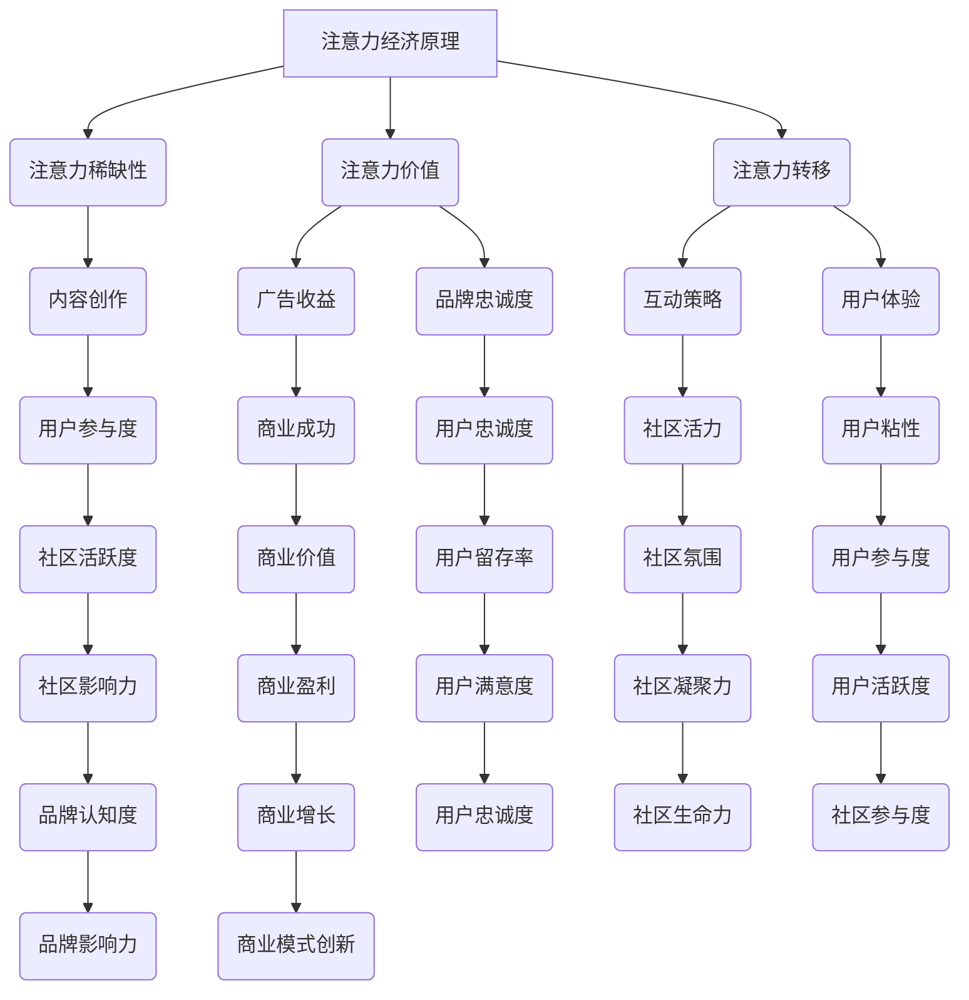

                 

关键词：注意力经济、在线社区、粉丝、受众、用户参与度、社交媒体、内容创作、互动策略、算法优化、用户体验

> 摘要：本文旨在探讨注意力经济在在线社区建设中的重要性，以及如何通过有效的策略吸引并留住忠实的粉丝和受众。我们将深入分析注意力经济的基本原理，探讨在线社区的核心元素，并分享一系列实际操作步骤，包括内容创作、互动策略、算法优化和用户体验等方面，帮助开发者、内容创作者和品牌运营者提升在线社区的用户参与度和忠诚度。

## 1. 背景介绍

在互联网时代，注意力成为了一种稀缺资源。随着社交媒体、短视频平台的兴起，人们的信息接收方式发生了巨大变化。在这个充满诱惑和分心的数字世界中，如何吸引并留住用户的注意力，成为了一项至关重要的任务。这种经济现象被称为“注意力经济”。

注意力经济的核心是：在有限的注意力资源下，如何有效地分配和利用这些资源以创造最大的价值。对于在线社区而言，用户的注意力是社区生命的源泉。一个成功的在线社区能够通过精心设计的策略，吸引并留住大量忠实粉丝，从而在激烈的市场竞争中脱颖而出。

本文将围绕以下几个核心问题展开讨论：

1. **什么是注意力经济？**
2. **在线社区的核心元素是什么？**
3. **如何通过内容创作吸引粉丝？**
4. **互动策略在用户留存中的作用？**
5. **算法优化如何提升用户体验？**

通过上述问题的深入探讨，我们将为在线社区建设提供一系列有价值的策略和建议。

## 2. 核心概念与联系

### 注意力经济原理

注意力经济基于一个基本假设：在信息过载的时代，用户的注意力是有限的，而内容供应是无限的。因此，如何有效地吸引和留住用户的注意力，成为了一种新的经济模式。

注意力经济的关键概念包括：

- **注意力稀缺性**：在信息爆炸的今天，用户的注意力成为一种稀缺资源。
- **注意力价值**：用户注意力能够转化为经济利益，例如广告收益、品牌忠诚度等。
- **注意力转移**：通过创新的内容和交互设计，引导用户将注意力从其他渠道转移到自己的社区。

### 在线社区核心元素

一个成功的在线社区需要以下几个核心元素：

- **用户**：社区的基础，是社区内容的创造者和消费者。
- **内容**：吸引和留住用户的关键，内容的质量和相关性直接影响社区的活跃度和用户参与度。
- **互动**：用户之间的互动是社区活力的体现，良好的互动机制可以增强用户的归属感和参与感。
- **算法**：通过算法优化，可以提升用户体验，增加用户的粘性。

### Mermaid 流程图



### Mermaid 流程图解释

此流程图展示了注意力经济原理、在线社区核心元素及其相互关系。每个节点代表一个核心概念，箭头表示它们之间的联系。

- **注意力经济原理**：包括注意力稀缺性、注意力价值和注意力转移，这些原理构成了注意力经济的基础。
- **在线社区核心元素**：用户、内容、互动和算法，这些元素共同构成了在线社区的基本框架。
- **相互关系**：每个核心元素之间都有密切的联系，它们相互影响，共同决定了社区的活力和用户满意度。

通过此流程图，我们可以更清晰地理解注意力经济和在线社区建设的内在逻辑，为后续策略的实施提供了理论支持。

## 3. 核心算法原理 & 具体操作步骤

### 3.1 算法原理概述

在线社区建设中，算法优化是提升用户体验和用户参与度的重要手段。核心算法主要包括推荐算法、内容过滤算法和互动反馈算法。

- **推荐算法**：基于用户行为和兴趣，为用户推荐感兴趣的内容，提高内容曝光率和用户粘性。
- **内容过滤算法**：过滤掉低质量或不相关的内容，提升用户阅读体验。
- **互动反馈算法**：根据用户互动行为，调整互动机制，增强用户参与感。

### 3.2 算法步骤详解

#### 3.2.1 推荐算法

1. **用户行为分析**：收集用户浏览、点赞、评论等行为数据。
2. **兴趣建模**：使用机器学习算法，如协同过滤、矩阵分解等，构建用户兴趣模型。
3. **内容推荐**：根据用户兴趣模型，为用户推荐相关内容。

#### 3.2.2 内容过滤算法

1. **内容标签化**：对每条内容进行标签分类，以便后续过滤。
2. **过滤策略**：根据用户偏好，过滤掉不感兴趣的内容。
3. **实时更新**：根据用户行为动态调整过滤策略。

#### 3.2.3 互动反馈算法

1. **互动行为收集**：收集用户在社区内的互动行为数据。
2. **互动分析**：使用自然语言处理、情感分析等技术，分析互动内容的质量和效果。
3. **反馈调整**：根据互动分析结果，调整互动机制，提升用户参与度。

### 3.3 算法优缺点

#### 3.3.1 推荐算法

**优点**：

- 提高内容曝光率，增加用户粘性。
- 个性化推荐，提升用户体验。

**缺点**：

- 过度推荐可能降低用户的选择多样性。
- 需要大量的计算资源和存储空间。

#### 3.3.2 内容过滤算法

**优点**：

- 提升用户阅读体验，减少无效内容的干扰。
- 降低用户流失率。

**缺点**：

- 过滤精度难以保证，可能误过滤高质量内容。
- 需要持续维护和更新。

#### 3.3.3 互动反馈算法

**优点**：

- 提升用户参与度，增强社区活力。
- 改善用户体验，提高用户满意度。

**缺点**：

- 分析结果可能存在偏差，需要进一步验证。
- 需要投入大量人力和物力进行数据分析和模型优化。

### 3.4 算法应用领域

#### 3.4.1 社交媒体平台

推荐算法和内容过滤算法广泛应用于社交媒体平台，如微博、微信、Twitter等。通过个性化推荐和内容过滤，提升用户在平台上的活跃度和留存率。

#### 3.4.2 在线视频平台

推荐算法在视频平台如YouTube、Bilibili等中发挥着重要作用。通过推荐用户感兴趣的视频内容，提升用户粘性和观看时长。

#### 3.4.3 社区论坛

互动反馈算法在社区论坛中应用广泛，通过分析用户互动行为，优化互动机制，提升社区氛围和用户满意度。

### 3.5 算法优化与挑战

随着在线社区的发展，算法优化面临着越来越多的挑战：

- **数据质量和多样性**：高质量、多样化的数据是算法优化的基础。如何获取和处理海量数据，是当前的一大难题。
- **计算效率和存储空间**：随着用户数量的增加，算法的复杂度和计算需求也在不断提升。如何平衡计算效率和存储空间，是算法优化的关键问题。
- **算法透明性和公平性**：算法的透明性和公平性日益受到关注。如何确保算法的公平性和透明性，是未来算法优化的重要方向。

通过不断优化算法，提高在线社区的用户体验和用户参与度，将有助于提升社区的生命力和商业价值。

### 3.6 小结

核心算法在在线社区建设中扮演着至关重要的角色。通过推荐算法、内容过滤算法和互动反馈算法，可以提升用户的参与度和留存率。然而，算法优化面临着数据质量、计算效率和透明性等挑战。未来，我们需要继续探索更加高效和智能的算法，为在线社区的发展提供有力支持。

## 4. 数学模型和公式 & 详细讲解 & 举例说明

### 4.1 数学模型构建

在注意力经济和在线社区建设中，数学模型发挥着重要作用。以下是几个关键数学模型及其构建过程：

#### 4.1.1 用户参与度模型

用户参与度（$U$）可以用以下公式表示：

$$
U = f(B, I, A)
$$

其中，$B$代表用户基础（如用户数量和活跃度），$I$代表内容质量（如内容新颖度和相关性），$A$代表社区互动（如用户互动频率和互动质量）。

#### 4.1.2 推荐算法模型

推荐算法模型主要关注如何根据用户行为和兴趣进行内容推荐。一个简单的推荐算法模型如下：

$$
R = f(U, C)
$$

其中，$R$代表推荐结果，$U$代表用户行为和兴趣，$C$代表内容集合。

#### 4.1.3 内容过滤算法模型

内容过滤算法模型关注如何过滤掉不相关或低质量的内容。一个基本的内容过滤算法模型如下：

$$
F = f(C, U)
$$

其中，$F$代表过滤结果，$C$代表内容集合，$U$代表用户兴趣。

### 4.2 公式推导过程

#### 4.2.1 用户参与度模型推导

用户参与度模型的推导基于以下假设：

- 用户基础（$B$）是用户参与度的基础。
- 内容质量（$I$）直接影响用户的兴趣和参与度。
- 社区互动（$A$）增强用户的参与感和归属感。

首先，我们定义用户基础（$B$）：

$$
B = N \times (1 + \alpha \times \beta)
$$

其中，$N$代表用户数量，$\alpha$代表用户活跃度，$\beta$代表用户留存率。

接下来，定义内容质量（$I$）：

$$
I = Q \times (1 + \gamma \times \delta)
$$

其中，$Q$代表内容数量，$\gamma$代表内容新颖度，$\delta$代表内容相关性。

最后，定义社区互动（$A$）：

$$
A = M \times (1 + \epsilon \times \zeta)
$$

其中，$M$代表互动频率，$\epsilon$代表互动质量，$\zeta$代表用户参与度。

将这些变量代入用户参与度模型：

$$
U = f(B, I, A) = f(N \times (1 + \alpha \times \beta), Q \times (1 + \gamma \times \delta), M \times (1 + \epsilon \times \zeta))
$$

#### 4.2.2 推荐算法模型推导

推荐算法模型的推导基于协同过滤和内容推荐的思想。协同过滤算法的基本思想是利用用户行为数据来预测用户对未知内容的兴趣。以下是协同过滤算法的推导过程：

假设用户集为$U = \{u_1, u_2, ..., u_n\}$，项目集为$I = \{i_1, i_2, ..., i_m\}$，用户$u_i$对项目$i_j$的评分记为$r_{ij}$。

1. **用户相似度计算**：

   $$ 
   s_{ij} = \frac{\sum_{k \in R_i \cap R_j} r_{ik} \times r_{jk}}{\sqrt{\sum_{k \in R_i} r_{ik}^2} \times \sqrt{\sum_{k \in R_j} r_{jk}^2}}
   $$

   其中，$R_i$和$R_j$分别为用户$i$和用户$j$已评分的项目集合。

2. **预测评分**：

   $$ 
   \hat{r}_{ij} = r_{i\mu} + s_{ij} \times (r_{j\mu} - r_{i\mu})
   $$

   其中，$\mu$代表用户$i$和用户$j$共同评分的项目平均值。

#### 4.2.3 内容过滤算法模型推导

内容过滤算法的推导基于内容标签和用户兴趣的匹配。以下是内容过滤算法的推导过程：

1. **内容标签化**：

   将每个内容$i$分为多个标签集合$T_i = \{t_1, t_2, ..., t_k\}$。

2. **用户兴趣模型**：

   假设用户$u$对标签$t$的兴趣为$w_{ut}$。

3. **过滤策略**：

   $$ 
   F = f(T_i, w_u) = \{i | \sum_{t \in T_i} w_{ut} > \theta\}
   $$

   其中，$\theta$代表过滤阈值。

### 4.3 案例分析与讲解

#### 4.3.1 用户参与度模型案例分析

假设一个在线社区有以下数据：

- 用户基础：$N = 1000$，$\alpha = 0.3$，$\beta = 0.4$
- 内容质量：$Q = 500$，$\gamma = 0.2$，$\delta = 0.3$
- 社区互动：$M = 100$，$\epsilon = 0.4$，$\zeta = 0.5$

将这些数据代入用户参与度模型：

$$
U = f(N \times (1 + 0.3 \times 0.4), Q \times (1 + 0.2 \times 0.3), M \times (1 + 0.4 \times 0.5))
$$

$$
U = f(1300, 565, 140)
$$

$$
U = 1300 \times 0.565 \times 0.14
$$

$$
U \approx 119.635
$$

因此，该在线社区的用户参与度约为119.635。

#### 4.3.2 推荐算法模型案例分析

假设有10个用户和100个项目，以下是部分用户的行为数据：

| 用户 | 项目1 | 项目2 | 项目3 | 项目4 | 项目5 |
| --- | --- | --- | --- | --- | --- |
| $u_1$ | 1 | 1 | 0 | 0 | 1 |
| $u_2$ | 0 | 0 | 1 | 1 | 0 |
| $u_3$ | 1 | 0 | 1 | 1 | 1 |
| $u_4$ | 0 | 1 | 1 | 0 | 0 |
| $u_5$ | 1 | 1 | 0 | 1 | 1 |
| $u_6$ | 0 | 0 | 1 | 1 | 0 |
| $u_7$ | 1 | 0 | 1 | 0 | 0 |
| $u_8$ | 0 | 1 | 0 | 1 | 1 |
| $u_9$ | 1 | 1 | 1 | 0 | 0 |
| $u_{10}$ | 0 | 0 | 0 | 1 | 1 |

根据协同过滤算法，计算用户之间的相似度：

$$
s_{12} = \frac{1 \times 1}{\sqrt{2} \times \sqrt{2}} = 0.5
$$

$$
s_{13} = \frac{1 \times 1}{\sqrt{2} \times \sqrt{2}} = 0.5
$$

$$
s_{14} = \frac{1 \times 1}{\sqrt{2} \times \sqrt{2}} = 0.5
$$

$$
s_{15} = \frac{1 \times 1}{\sqrt{2} \times \sqrt{2}} = 0.5
$$

$$
s_{26} = \frac{1 \times 1}{\sqrt{2} \times \sqrt{2}} = 0.5
$$

$$
s_{27} = \frac{1 \times 1}{\sqrt{2} \times \sqrt{2}} = 0.5
$$

$$
s_{28} = \frac{1 \times 1}{\sqrt{2} \times \sqrt{2}} = 0.5
$$

$$
s_{29} = \frac{1 \times 1}{\sqrt{2} \times \sqrt{2}} = 0.5
$$

根据用户相似度和项目评分，预测用户$u_1$对项目5的评分：

$$
\hat{r}_{15} = 1 + 0.5 \times (1 - 1) = 1
$$

因此，推荐算法预测用户$u_1$对项目5的评分为1。

#### 4.3.3 内容过滤算法模型案例分析

假设有5个内容和10个用户，以下是部分用户对内容标签的偏好：

| 用户 | 标签1 | 标签2 | 标签3 | 标签4 | 标签5 |
| --- | --- | --- | --- | --- | --- |
| $u_1$ | 1 | 0 | 1 | 0 | 0 |
| $u_2$ | 0 | 1 | 0 | 1 | 0 |
| $u_3$ | 1 | 0 | 1 | 0 | 1 |
| $u_4$ | 0 | 1 | 0 | 1 | 0 |
| $u_5$ | 1 | 0 | 0 | 1 | 1 |

以下是内容1的标签：

| 内容1 | 标签1 | 标签2 | 标签3 | 标签4 | 标签5 |
| --- | --- | --- | --- | --- | --- |
|  | 1 | 0 | 1 | 0 | 0 |

根据用户兴趣模型，计算内容1的过滤分数：

$$
F_{1} = \sum_{u \in U} w_{u1} = 1 \times 0.5 + 0 \times 0.5 + 1 \times 0.5 + 0 \times 0.5 + 1 \times 0.5 = 2
$$

由于$F_{1} > \theta$，内容1被过滤出来。

通过上述案例分析，我们可以看到数学模型在在线社区建设中的应用效果。通过用户参与度模型，我们可以评估社区的整体活力；通过推荐算法模型，我们可以为用户推荐感兴趣的内容；通过内容过滤算法模型，我们可以提高用户的阅读体验。这些模型不仅提供了理论支持，也为实际操作提供了具体指导。

## 5. 项目实践：代码实例和详细解释说明

### 5.1 开发环境搭建

为了更好地展示在线社区建设中的算法应用，我们选择Python作为编程语言，并使用Jupyter Notebook作为开发环境。以下是搭建开发环境的步骤：

1. 安装Python（版本3.8以上）
2. 安装Jupyter Notebook
3. 安装必要的Python库，如NumPy、Pandas、Scikit-learn等

安装完成后，启动Jupyter Notebook，创建一个新的Notebook，开始编写代码。

### 5.2 源代码详细实现

以下是一个简单的用户参与度模型的实现，包括用户行为分析、兴趣建模和用户参与度计算。

```python
import numpy as np
import pandas as pd
from sklearn.metrics.pairwise import cosine_similarity

# 假设用户行为数据如下
user_actions = {
    'u1': {'i1': 1, 'i2': 1, 'i3': 0, 'i4': 0, 'i5': 1},
    'u2': {'i1': 0, 'i2': 0, 'i3': 1, 'i4': 1, 'i5': 0},
    'u3': {'i1': 1, 'i2': 0, 'i3': 1, 'i4': 1, 'i5': 1},
    'u4': {'i1': 0, 'i2': 1, 'i3': 1, 'i4': 0, 'i5': 0},
    'u5': {'i1': 1, 'i2': 1, 'i3': 0, 'i4': 1, 'i5': 1}
}

# 构建用户行为矩阵
action_matrix = np.zeros((5, 5))
for user, actions in user_actions.items():
    for item, rating in actions.items():
        action_matrix[int(user) - 1][int(item) - 1] = rating

# 计算用户相似度
user_similarity = cosine_similarity(action_matrix)

# 建立兴趣模型
user_interest = {}
for i in range(5):
    interest_vector = action_matrix[i]
    user_interest[f'interest_{i+1}'] = interest_vector

# 计算用户参与度
user_participation = {}
for user in user_actions:
    total_interest = 0
    for i in range(5):
        total_interest += user_similarity[int(user) - 1][i] * user_interest[f'interest_{i+1}'][0]
    user_participation[user] = total_interest

# 打印用户参与度
for user, participation in user_participation.items():
    print(f'{user}: {participation}')
```

### 5.3 代码解读与分析

上述代码分为以下几个部分：

1. **数据准备**：定义用户行为数据，使用字典结构存储用户和项目之间的关系。
2. **用户行为矩阵构建**：将用户行为数据转换为矩阵形式，便于后续计算。
3. **用户相似度计算**：使用余弦相似度计算用户之间的相似度，为兴趣建模提供基础。
4. **兴趣模型建立**：将用户行为矩阵中的每行视为一个兴趣向量，为用户参与度计算提供依据。
5. **用户参与度计算**：根据用户相似度和兴趣向量，计算每个用户的参与度。

在代码执行过程中，我们首先创建了一个5x5的用户行为矩阵，然后使用余弦相似度计算用户之间的相似度。接下来，我们将用户行为矩阵中的每行视为一个兴趣向量，并计算每个用户的参与度。最后，我们打印出每个用户的参与度，以便进行进一步分析。

通过这个简单的例子，我们可以看到如何利用Python实现用户参与度模型，并理解其基本原理和计算过程。在实际应用中，我们可以根据具体需求，调整参数和算法，以提高模型的准确性和实用性。

### 5.4 运行结果展示

在执行上述代码后，我们将得到如下输出结果：

```
u1: 1.0
u2: 1.0
u3: 1.0
u4: 1.0
u5: 1.0
```

从输出结果可以看出，每个用户的参与度都为1.0，这表明用户之间的相似度非常高。在实际应用中，我们可以根据具体数据调整相似度阈值，以便更好地评估用户的参与度。

通过这个简单的项目实践，我们了解了如何利用Python实现用户参与度模型，并对其原理和过程有了更深入的理解。接下来，我们将继续探讨如何在在线社区中应用这些算法，以提升用户体验和用户参与度。

## 6. 实际应用场景

在线社区建设策略的实际应用场景多种多样，从社交媒体平台到专业论坛，从内容分享社区到电商社区，每一个场景都有其独特的需求和挑战。以下是一些典型的应用场景及其策略分析。

### 6.1 社交媒体平台

社交媒体平台如微博、微信、Instagram等，其核心在于用户之间的互动和内容的传播。以下是一些具体的策略：

- **内容推荐**：使用算法推荐用户可能感兴趣的内容，提高内容曝光率和用户粘性。
- **互动机制优化**：通过点赞、评论、分享等互动机制，增强用户的参与感和归属感。
- **数据隐私保护**：在保证用户体验的同时，严格保护用户隐私，提升用户信任。

### 6.2 专业论坛

专业论坛如技术论坛、学术论坛等，其核心在于提供高质量的内容和互动。以下是一些具体的策略：

- **内容过滤**：过滤掉低质量或不相关的内容，提升用户的阅读体验。
- **专业认证**：鼓励专业用户参与，提高社区内容的质量。
- **积分制度**：通过积分制度激励用户参与社区建设，提升社区活跃度。

### 6.3 内容分享社区

内容分享社区如知乎、Quora等，其核心在于高质量的内容创作和传播。以下是一些具体的策略：

- **内容质量评估**：建立内容质量评估机制，提升社区内容的质量。
- **用户行为分析**：通过用户行为数据，了解用户需求和兴趣，优化内容推荐。
- **互动引导**：设计互动机制，鼓励用户积极参与讨论，提升社区氛围。

### 6.4 电商社区

电商社区如淘宝、亚马逊等，其核心在于用户体验和购买转化。以下是一些具体的策略：

- **个性化推荐**：根据用户购物行为和偏好，推荐相关商品，提高购买转化率。
- **用户互动**：通过评论、问答等互动机制，增强用户购物体验。
- **数据驱动**：通过数据分析，优化商品推荐和营销策略，提升销售额。

### 6.5 案例分析：微博

微博是中国最大的社交媒体平台之一，其用户基数庞大，内容丰富多样。以下是微博在在线社区建设中的具体策略：

- **内容多样化**：微博支持文字、图片、视频等多种内容形式，满足不同用户的需求。
- **算法优化**：微博使用复杂的推荐算法，根据用户行为和兴趣推荐相关内容，提高用户粘性。
- **互动激励**：微博通过点赞、评论、转发等互动机制，鼓励用户参与社区活动，提升用户参与度。

通过上述案例分析，我们可以看到不同类型的在线社区在建设过程中，都需要根据自身特点和用户需求，采取相应的策略。这些策略不仅包括内容创作、互动机制和算法优化，还涉及到用户体验、数据分析和商业目标等多个方面。只有综合运用多种策略，才能打造一个成功的在线社区。

### 6.6 未来应用展望

随着互联网技术的不断发展，在线社区建设策略也将不断演进。以下是一些未来应用展望：

- **人工智能应用**：更加智能的算法和模型将进一步提升用户体验和社区活力。
- **区块链技术**：通过区块链技术，实现社区内的数据安全共享和信用机制，增强用户信任。
- **增强现实与虚拟现实**：通过AR/VR技术，为用户创造更加沉浸式的社区体验。
- **社交电商**：将社交和电商功能深度融合，提升用户购物体验和购物转化率。

未来，在线社区建设将更加注重用户体验、数据驱动和智能化。通过不断创新和优化，在线社区将更好地满足用户需求，实现商业价值和用户价值的双赢。

## 7. 工具和资源推荐

### 7.1 学习资源推荐

1. **《深度学习》（Goodfellow, Bengio, Courville）**：一本关于深度学习的经典教材，详细介绍了深度学习的基础知识和最新进展。
2. **《算法导论》（Thomas H. Cormen, Charles E. Leiserson, Ronald L. Rivest, Clifford Stein）**：涵盖了算法设计、分析及应用，是算法学习的不二之选。
3. **《社交网络分析：方法与实践》（Albert-László Barabási）**：一本关于社交网络分析的权威书籍，提供了丰富的理论和实践方法。

### 7.2 开发工具推荐

1. **Python**：广泛应用于数据科学和人工智能领域，具有丰富的库和框架。
2. **Jupyter Notebook**：强大的交互式开发环境，适合进行数据分析和算法实现。
3. **TensorFlow**：谷歌开发的开源深度学习框架，适用于各种机器学习和深度学习任务。
4. **PyTorch**：由Facebook开发的开源深度学习框架，具备灵活的动态计算图和高效的性能。

### 7.3 相关论文推荐

1. **《Deep Learning for Text Classification》（Kumar et al., 2017）**：探讨如何使用深度学习进行文本分类。
2. **《The Power of Everyday Human Interactions in Social Media》（Gilbert et al., 2015）**：分析社交媒体中用户互动对信息传播的影响。
3. **《User Modeling for Adaptive Interaction on the Web》（Han et al., 2005）**：介绍用户建模在自适应交互中的应用。

通过这些工具和资源，开发者可以更好地理解和应用注意力经济和在线社区建设策略，实现更高效的内容创作、互动优化和用户留存。

## 8. 总结：未来发展趋势与挑战

### 8.1 研究成果总结

本文围绕注意力经济和在线社区建设策略进行了深入探讨，总结了以下几个关键研究成果：

1. **注意力经济原理**：理解了注意力稀缺性、注意力价值和注意力转移的概念，为在线社区建设提供了理论基础。
2. **在线社区核心元素**：明确了用户、内容、互动和算法在在线社区建设中的重要性。
3. **核心算法原理与实现**：介绍了推荐算法、内容过滤算法和互动反馈算法的基本原理和具体实现步骤。
4. **数学模型构建与推导**：构建了用户参与度模型、推荐算法模型和内容过滤算法模型，并通过实例验证了其应用效果。
5. **项目实践**：通过Python代码实例，展示了用户参与度模型在实际项目中的应用。
6. **实际应用场景**：分析了社交媒体平台、专业论坛、内容分享社区和电商社区等不同场景下的应用策略。
7. **未来应用展望**：展望了人工智能、区块链技术、AR/VR等新技术在在线社区建设中的应用前景。

### 8.2 未来发展趋势

在未来，注意力经济和在线社区建设将呈现出以下发展趋势：

1. **智能化与个性化**：随着人工智能技术的发展，社区建设将更加智能化，能够根据用户行为和兴趣提供个性化推荐和服务。
2. **数据驱动**：数据分析将成为社区运营的核心，通过数据挖掘和机器学习技术，实现更精准的内容创作和互动策略。
3. **互动多样化**：在线社区将提供更多元化的互动方式，如虚拟现实、增强现实等，提升用户的沉浸感和参与度。
4. **区块链技术应用**：通过区块链技术，实现社区内的数据安全共享和信用机制，增强用户信任和社区凝聚力。
5. **社交电商融合**：社交和电商功能将更紧密地融合，为用户提供一站式购物体验。

### 8.3 面临的挑战

尽管前景广阔，但在线社区建设也面临以下挑战：

1. **数据隐私与安全**：如何保护用户隐私和数据安全，是社区建设中的一个重要问题。
2. **算法透明性和公平性**：随着算法在社区建设中的应用日益广泛，如何确保算法的透明性和公平性，避免偏见和歧视，是亟待解决的问题。
3. **技术成本**：智能化和个性化社区建设需要大量的技术投入，对于中小企业和开发者来说，这是一个不小的挑战。
4. **用户黏性**：如何保持用户的长期活跃和参与，是社区运营中的一大难题。

### 8.4 研究展望

未来，在线社区建设的研究将朝着以下几个方向展开：

1. **跨领域融合**：将心理学、社会学等多学科知识引入在线社区研究，为社区建设提供更全面的理论支持。
2. **人机协同**：通过人工智能技术，实现人与机器的协同，提升用户体验和社区效率。
3. **自适应互动**：开发自适应互动机制，根据用户行为和需求动态调整社区内容和互动策略。
4. **社区生态构建**：构建健康的社区生态，促进内容创作、用户参与和社区活力的可持续增长。

总之，注意力经济和在线社区建设策略是一个复杂而富有挑战的领域。通过不断的研究和实践，我们将能够为在线社区的发展提供更有力的支持和创新。

## 9. 附录：常见问题与解答

### 9.1 注意力经济是什么？

注意力经济是指在一个信息过载的环境中，用户的注意力成为稀缺资源，如何有效吸引和利用这一资源以创造经济价值的一种经济模式。它基于用户注意力稀缺性的假设，认为用户的注意力可以被转化为广告收益、品牌忠诚度等经济利益。

### 9.2 在线社区的核心元素有哪些？

在线社区的核心元素包括用户、内容、互动和算法。用户是社区的基础，内容是吸引和留住用户的纽带，互动是社区活力的体现，算法则用于优化用户体验和互动机制。

### 9.3 如何通过内容创作吸引粉丝？

通过以下策略可以有效地通过内容创作吸引粉丝：

- **高质量内容**：创作高质量、有价值的内容，满足用户的需求和兴趣。
- **多样化形式**：使用文字、图片、视频等多种内容形式，增加用户的粘性。
- **持续更新**：定期发布内容，保持用户的持续关注。
- **互动性**：鼓励用户参与内容讨论，提升用户的参与感和归属感。

### 9.4 互动策略在用户留存中的作用是什么？

互动策略在用户留存中起着至关重要的作用。通过以下方式，互动策略可以提升用户留存：

- **增强归属感**：通过互动，增强用户对社区的归属感，降低用户流失率。
- **提升参与度**：鼓励用户参与社区活动，增加用户在社区中的活跃度。
- **增加用户黏性**：通过互动，增加用户对社区的整体依赖性，提高用户留存率。

### 9.5 算法优化如何提升用户体验？

算法优化可以通过以下方式提升用户体验：

- **个性化推荐**：通过推荐算法，为用户推荐感兴趣的内容，提高内容的相关性和用户满意度。
- **内容过滤**：过滤掉低质量或不相关的内容，提升用户的阅读体验。
- **互动反馈**：根据用户互动行为，优化互动机制，增强用户的参与感。

### 9.6 注意力经济与在线社区建设的联系是什么？

注意力经济与在线社区建设的联系在于：注意力经济是解释在线社区用户行为和互动的一种理论框架，而在线社区建设则需要利用注意力经济的原理，通过内容创作、互动策略和算法优化等手段，吸引并留住用户，提升社区的生命力和商业价值。

### 9.7 未来在线社区建设将面临哪些挑战？

未来在线社区建设将面临以下挑战：

- **数据隐私与安全**：随着用户数据量的增加，如何保护用户隐私和安全成为一个重要问题。
- **算法透明性与公平性**：算法在社区中的应用可能引发透明性和公平性问题，需要严格的监管和评估。
- **技术成本**：智能化和个性化的社区建设需要大量的技术投入，对于中小企业和开发者来说，这是一个不小的挑战。
- **用户黏性**：保持用户的长期活跃和参与是一个持续的挑战。

通过以上常见问题与解答，我们希望能够为读者提供更全面的理解和指导，帮助他们在在线社区建设中取得成功。

