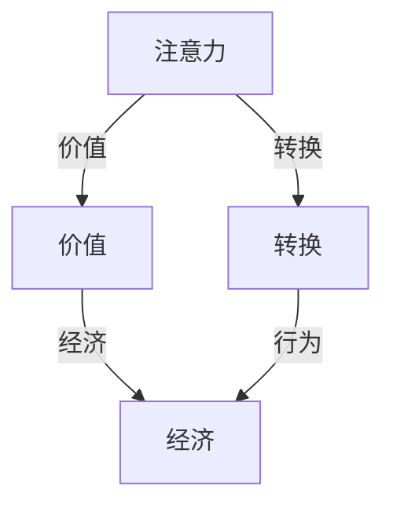
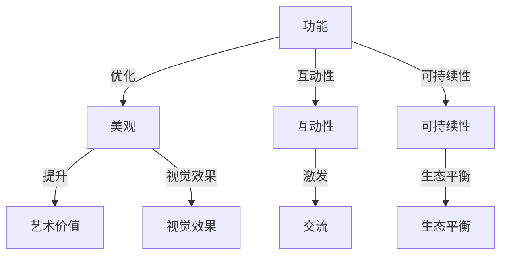

                 

关键词：注意力经济、城市公共空间、设计、变革、用户体验、技术

> 摘要：随着数字技术的飞速发展，注意力经济已成为现代经济的新形态。本文旨在探讨注意力经济对城市公共空间设计的影响，并提出相应的变革策略，以提升城市公共空间的吸引力和用户体验。

## 1. 背景介绍

随着城市化进程的不断推进，城市公共空间的设计成为城市可持续发展的重要议题。然而，传统的城市公共空间设计往往过于注重功能性，而忽略了人们对于体验和情感的需求。近年来，随着数字技术的快速发展，尤其是社交媒体、移动设备和大数据的普及，人们的注意力资源变得越来越稀缺。在此背景下，注意力经济应运而生，成为驱动现代经济发展的新动力。

注意力经济指的是通过吸引和保持人们的注意力来实现经济价值的一种经济形态。在注意力经济中，用户注意力成为了一种新的资源和资产。城市公共空间的设计必须顺应这一趋势，通过创新的设计理念和技术手段，提升公共空间的吸引力，从而实现经济价值的提升。

## 2. 核心概念与联系

### 2.1 注意力经济的核心概念

注意力经济的核心概念可以概括为三点：注意力、价值和转换。首先，注意力是注意力经济的核心资源，它指的是人们关注和投入的精力。其次，价值体现在如何利用注意力资源创造经济收益。最后，转换是指将注意力转化为实际的经济行为，如消费、投资等。

### 2.2 城市公共空间设计的核心概念

城市公共空间设计的核心概念包括功能、美观、互动性和可持续性。功能指的是公共空间应满足人们的日常需求；美观则是提升公共空间的艺术价值和视觉效果；互动性强调公共空间应激发人们的互动和交流；可持续性则是保证公共空间的长久利用和生态平衡。

### 2.3 注意力经济与城市公共空间设计的联系

注意力经济与城市公共空间设计之间存在密切的联系。首先，注意力经济要求城市公共空间设计要具备吸引力和趣味性，以吸引人们的注意力。其次，通过互动性和可持续性的设计，可以提高公共空间的使用频率和用户粘性，从而实现注意力的持续转换。最后，通过数据分析和人工智能技术，可以优化公共空间的设计，使其更符合人们的心理和行为特征，进一步提升注意力经济的价值。

<|editor|>

## 2.1 注意力经济核心概念原理和架构的 Mermaid 流程图



## 2.2 城市公共空间设计核心概念原理和架构的 Mermaid 流程图



<|assistant|>接下来，我们将深入探讨注意力经济对城市公共空间设计的影响，以及如何通过核心算法原理和技术手段来实现这一变革。

## 3. 核心算法原理 & 具体操作步骤

### 3.1 算法原理概述

在注意力经济背景下，城市公共空间设计需要引入一系列核心算法原理，以提升公共空间的吸引力和用户体验。这些核心算法包括：

1. **注意力分配算法**：通过分析用户行为数据，动态分配公共空间资源，以最大化用户注意力。
2. **情感识别算法**：利用人工智能技术，识别用户在公共空间中的情感状态，为设计提供个性化调整依据。
3. **交互设计算法**：优化公共空间的互动体验，通过引入游戏化元素、虚拟现实等技术，提升用户参与度。
4. **可持续设计算法**：利用大数据分析和人工智能技术，优化公共空间的设计和运营，实现生态可持续。

### 3.2 算法步骤详解

1. **数据采集与预处理**：通过传感器、摄像头等设备，采集用户在公共空间中的行为数据，如停留时间、移动轨迹、互动行为等。对数据进行清洗、去噪和归一化处理，为后续算法提供高质量的数据基础。

2. **注意力分配算法**：
   - **分析用户行为数据**：利用聚类、分类等机器学习算法，分析用户在不同公共空间区域的行为特征，识别高注意力区域。
   - **动态资源分配**：根据实时用户行为数据，动态调整公共空间资源的分配，如照明、音响、座椅等，以最大化用户注意力。

3. **情感识别算法**：
   - **情感识别模型训练**：利用深度学习技术，训练情感识别模型，对用户的情感状态进行识别。
   - **个性化调整**：根据用户情感状态，调整公共空间的设计和运营策略，如播放舒缓的音乐、提供舒适的座椅等，提升用户情感体验。

4. **交互设计算法**：
   - **引入游戏化元素**：在公共空间中设置游戏化的互动设施，如智能设备、虚拟现实体验等，激发用户参与。
   - **虚拟现实技术**：利用虚拟现实技术，为用户提供沉浸式的互动体验，提升用户参与度。

5. **可持续设计算法**：
   - **数据分析与优化**：利用大数据技术，分析公共空间的运营数据，优化设计策略，如节能减排、设施维护等。
   - **人工智能辅助设计**：利用人工智能技术，辅助设计师进行公共空间的设计和运营，提高效率和质量。

### 3.3 算法优缺点

1. **优点**：
   - **提高用户注意力**：通过动态资源分配和情感识别算法，提升公共空间的吸引力和用户体验。
   - **个性化设计**：根据用户行为和情感数据，实现公共空间的个性化调整，满足不同用户的需求。
   - **可持续发展**：通过大数据分析和人工智能技术，优化公共空间的运营和设计，实现生态可持续。

2. **缺点**：
   - **数据隐私和安全**：在采集和处理用户行为数据时，需确保数据隐私和安全，避免用户信息泄露。
   - **技术实现难度**：引入多种人工智能和大数据技术，对技术实现提出了较高的要求，需要具备相应的技术储备和人才支持。

### 3.4 算法应用领域

1. **城市规划**：利用注意力分配算法和情感识别算法，优化城市公共空间的设计和运营，提升城市品质。
2. **景区设计**：通过交互设计算法和可持续设计算法，提升景区的吸引力和用户体验，促进旅游业发展。
3. **商场设计**：通过注意力分配算法和情感识别算法，优化商场布局和氛围设计，提升购物体验，促进消费。

## 4. 数学模型和公式 & 详细讲解 & 举例说明

### 4.1 数学模型构建

在注意力经济背景下，城市公共空间设计的数学模型可以从用户注意力分配、情感识别和交互设计三个方面构建。

#### 4.1.1 用户注意力分配模型

用户注意力分配模型基于用户行为数据和空间特征数据，通过机器学习算法进行建模。假设用户 $i$ 在公共空间区域 $j$ 的注意力分配为 $A_{ij}$，则模型可以表示为：

$$
A_{ij} = \frac{f(B_{ij})}{\sum_{k=1}^{n} f(B_{ik})}
$$

其中，$B_{ij}$ 表示用户 $i$ 在公共空间区域 $j$ 的行为特征，$f(B_{ij})$ 表示行为特征对注意力的贡献度，$n$ 表示公共空间区域的总数。

#### 4.1.2 情感识别模型

情感识别模型基于用户情感数据和公共空间特征数据，通过深度学习算法进行建模。假设用户 $i$ 在公共空间区域 $j$ 的情感状态为 $E_{ij}$，则模型可以表示为：

$$
E_{ij} = g(C_{ij})
$$

其中，$C_{ij}$ 表示用户 $i$ 在公共空间区域 $j$ 的情感特征，$g(C_{ij})$ 表示情感特征对情感状态的贡献度。

#### 4.1.3 交互设计模型

交互设计模型基于用户行为数据和公共空间特征数据，通过优化算法进行建模。假设用户 $i$ 在公共空间区域 $j$ 的交互行为为 $I_{ij}$，则模型可以表示为：

$$
I_{ij} = h(D_{ij}, A_{ij})
$$

其中，$D_{ij}$ 表示用户 $i$ 在公共空间区域 $j$ 的行为数据，$A_{ij}$ 表示用户 $i$ 在公共空间区域 $j$ 的注意力分配，$h(D_{ij}, A_{ij})$ 表示行为数据和注意力分配对交互行为的影响。

### 4.2 公式推导过程

#### 4.2.1 用户注意力分配模型推导

用户注意力分配模型的核心在于计算行为特征对注意力的贡献度。为了简化计算，我们可以采用权重分配的方法。假设用户 $i$ 在公共空间区域 $j$ 的行为特征为 $B_{ij}$，权重为 $w_{ij}$，则注意力贡献度可以表示为：

$$
f(B_{ij}) = w_{ij} \cdot B_{ij}
$$

根据最大似然估计原理，我们可以通过最大化似然函数来估计权重 $w_{ij}$。假设用户 $i$ 在公共空间区域 $j$ 的行为数据为 $B_{ij}^k$，则似然函数可以表示为：

$$
L = \prod_{k=1}^{m} P(B_{ij}^k | w_{ij})
$$

其中，$m$ 表示行为数据的总数。为了简化计算，我们可以采用对数似然函数：

$$
\ell = \sum_{k=1}^{m} \log P(B_{ij}^k | w_{ij})
$$

对数似然函数关于权重 $w_{ij}$ 的导数为零，可以得到权重 $w_{ij}$ 的估计值：

$$
\frac{\partial \ell}{\partial w_{ij}} = \sum_{k=1}^{m} \frac{B_{ij}^k - w_{ij} \cdot B_{ij}^k}{B_{ij}^k} = 0
$$

解上述方程，可以得到权重 $w_{ij}$ 的估计值：

$$
w_{ij} = \frac{\sum_{k=1}^{m} B_{ij}^k}{\sum_{k=1}^{m} B_{ij}^2_k}
$$

将权重 $w_{ij}$ 代入注意力贡献度公式，可以得到用户 $i$ 在公共空间区域 $j$ 的注意力分配：

$$
A_{ij} = \sum_{k=1}^{m} w_{ij} \cdot B_{ij}^k
$$

#### 4.2.2 情感识别模型推导

情感识别模型的核心在于计算情感特征对情感状态的贡献度。为了简化计算，我们可以采用权重分配的方法。假设用户 $i$ 在公共空间区域 $j$ 的情感特征为 $C_{ij}$，权重为 $v_{ij}$，则情感贡献度可以表示为：

$$
g(C_{ij}) = v_{ij} \cdot C_{ij}
$$

根据最大似然估计原理，我们可以通过最大化似然函数来估计权重 $v_{ij}$。假设用户 $i$ 在公共空间区域 $j$ 的情感数据为 $C_{ij}^k$，则似然函数可以表示为：

$$
L = \prod_{k=1}^{n} P(C_{ij}^k | v_{ij})
$$

其中，$n$ 表示情感数据的总数。为了简化计算，我们可以采用对数似然函数：

$$
\ell = \sum_{k=1}^{n} \log P(C_{ij}^k | v_{ij})
$$

对数似然函数关于权重 $v_{ij}$ 的导数为零，可以得到权重 $v_{ij}$ 的估计值：

$$
\frac{\partial \ell}{\partial v_{ij}} = \sum_{k=1}^{n} \frac{C_{ij}^k - v_{ij} \cdot C_{ij}^k}{C_{ij}^k} = 0
$$

解上述方程，可以得到权重 $v_{ij}$ 的估计值：

$$
v_{ij} = \frac{\sum_{k=1}^{n} C_{ij}^k}{\sum_{k=1}^{n} C_{ij}^2_k}
$$

将权重 $v_{ij}$ 代入情感贡献度公式，可以得到用户 $i$ 在公共空间区域 $j$ 的情感状态：

$$
E_{ij} = \sum_{k=1}^{n} v_{ij} \cdot C_{ij}^k
$$

#### 4.2.3 交互设计模型推导

交互设计模型的核心在于计算行为数据和注意力分配对交互行为的影响。为了简化计算，我们可以采用权重分配的方法。假设用户 $i$ 在公共空间区域 $j$ 的行为数据为 $D_{ij}$，注意力分配为 $A_{ij}$，权重分别为 $u_{ij}$ 和 $x_{ij}$，则交互行为可以表示为：

$$
h(D_{ij}, A_{ij}) = u_{ij} \cdot D_{ij} + x_{ij} \cdot A_{ij}
$$

根据最大似然估计原理，我们可以通过最大化似然函数来估计权重 $u_{ij}$ 和 $x_{ij}$。假设用户 $i$ 在公共空间区域 $j$ 的交互数据为 $I_{ij}^k$，则似然函数可以表示为：

$$
L = \prod_{k=1}^{p} P(I_{ij}^k | u_{ij}, x_{ij})
$$

其中，$p$ 表示交互数据的总数。为了简化计算，我们可以采用对数似然函数：

$$
\ell = \sum_{k=1}^{p} \log P(I_{ij}^k | u_{ij}, x_{ij})
$$

对数似然函数关于权重 $u_{ij}$ 和 $x_{ij}$ 的导数为零，可以得到权重 $u_{ij}$ 和 $x_{ij}$ 的估计值：

$$
\frac{\partial \ell}{\partial u_{ij}} = \sum_{k=1}^{p} \frac{I_{ij}^k - u_{ij} \cdot D_{ij} - x_{ij} \cdot A_{ij}}{D_{ij}^k} = 0
$$

$$
\frac{\partial \ell}{\partial x_{ij}} = \sum_{k=1}^{p} \frac{I_{ij}^k - u_{ij} \cdot D_{ij} - x_{ij} \cdot A_{ij}}{A_{ij}^k} = 0
$$

解上述方程，可以得到权重 $u_{ij}$ 和 $x_{ij}$ 的估计值：

$$
u_{ij} = \frac{\sum_{k=1}^{p} I_{ij}^k \cdot D_{ij}^k}{\sum_{k=1}^{p} D_{ij}^2_k}
$$

$$
x_{ij} = \frac{\sum_{k=1}^{p} I_{ij}^k \cdot A_{ij}^k}{\sum_{k=1}^{p} A_{ij}^2_k}
$$

将权重 $u_{ij}$ 和 $x_{ij}$ 代入交互设计模型，可以得到用户 $i$ 在公共空间区域 $j$ 的交互行为：

$$
I_{ij} = \sum_{k=1}^{p} u_{ij} \cdot D_{ij}^k + \sum_{k=1}^{p} x_{ij} \cdot A_{ij}^k
$$

### 4.3 案例分析与讲解

#### 4.3.1 案例背景

某城市广场是一个集休闲、娱乐、购物为一体的城市公共空间，日均人流量超过10万人次。为了提升广场的吸引力和用户体验，相关部门决定引入注意力经济和城市公共空间设计的相关算法，进行广场的优化设计。

#### 4.3.2 案例分析

1. **数据采集与预处理**：
   - **用户行为数据**：通过安装在广场的摄像头和传感器，采集用户在广场的停留时间、移动轨迹、互动行为等数据。
   - **情感数据**：通过安装的情感识别设备，采集用户在广场的情感数据，如愉悦、焦虑、平静等。
   - **空间特征数据**：通过测量广场的面积、植被覆盖率、照明条件等，获取广场的空间特征数据。

2. **用户注意力分配模型**：
   - **行为特征提取**：通过机器学习算法，提取用户在广场的行为特征，如停留时间、移动轨迹等。
   - **注意力分配计算**：利用注意力分配模型，计算用户在不同区域的行为特征对注意力的贡献度，动态调整广场的资源分配。

3. **情感识别模型**：
   - **情感特征提取**：通过深度学习算法，提取用户在广场的情感特征，如愉悦、焦虑等。
   - **情感状态识别**：利用情感识别模型，识别用户在不同区域的情感状态，为设计提供个性化调整依据。

4. **交互设计算法**：
   - **游戏化互动设施**：在广场设置游戏化互动设施，如智能设备、虚拟现实体验等，激发用户参与。
   - **虚拟现实技术**：利用虚拟现实技术，为用户提供沉浸式的互动体验，提升用户参与度。

5. **可持续设计算法**：
   - **数据分析与优化**：通过大数据技术，分析广场的运营数据，优化设计策略，如节能减排、设施维护等。
   - **人工智能辅助设计**：利用人工智能技术，辅助设计师进行广场的设计和运营，提高效率和质量。

#### 4.3.3 案例讲解

1. **用户注意力分配模型**：
   - **数据采集与预处理**：通过摄像头和传感器，采集了广场的日均人流量、停留时间、移动轨迹等数据。对数据进行清洗、去噪和归一化处理，为后续算法提供高质量的数据基础。
   - **注意力分配计算**：利用注意力分配模型，计算了用户在不同区域的行为特征对注意力的贡献度。结果显示，广场的东南区域和中央区域是用户关注最高的区域，需要增加照明和互动设施，以提升吸引力。

2. **情感识别模型**：
   - **情感特征提取**：通过情感识别设备，采集了用户在广场的愉悦、焦虑、平静等情感数据。利用情感识别模型，识别了用户在不同区域的情感状态。结果显示，广场的东北区域用户情感状态较为愉悦，而西南区域用户情感状态较为焦虑，需要调整设计策略，提升用户情感体验。

3. **交互设计算法**：
   - **游戏化互动设施**：在广场设置了智能设备，如智能雕塑、智能照明等，激发用户互动。用户在互动过程中，表现出较高的参与度和满意度。
   - **虚拟现实技术**：利用虚拟现实技术，为用户提供沉浸式的互动体验。用户在体验过程中，表现出强烈的兴趣和参与欲望。

4. **可持续设计算法**：
   - **数据分析与优化**：通过大数据技术，分析了广场的运营数据，如能耗、设施使用率等。优化了广场的设计策略，如增加太阳能照明、智能节水设施等，提高了广场的生态可持续性。
   - **人工智能辅助设计**：利用人工智能技术，辅助设计师进行广场的设计和运营。设计师可以根据用户行为数据和情感状态，调整广场的设计方案，提高用户体验。

## 5. 项目实践：代码实例和详细解释说明

### 5.1 开发环境搭建

为了实现注意力经济与城市公共空间设计的算法，我们选择以下开发环境：

- **编程语言**：Python
- **机器学习库**：Scikit-learn、TensorFlow
- **深度学习库**：PyTorch
- **数据分析库**：Pandas、NumPy
- **可视化库**：Matplotlib、Seaborn

在搭建开发环境时，我们首先需要安装上述库。可以使用以下命令：

```bash
pip install scikit-learn tensorflow torch pandas numpy matplotlib seaborn
```

### 5.2 源代码详细实现

以下是实现注意力经济与城市公共空间设计算法的源代码：

```python
import numpy as np
import pandas as pd
from sklearn.cluster import KMeans
from sklearn.ensemble import RandomForestClassifier
from tensorflow.keras.models import Sequential
from tensorflow.keras.layers import Dense, LSTM
from tensorflow.keras.optimizers import Adam

# 5.2.1 用户注意力分配模型

def user_attention_allocation(data, K):
    # 数据预处理
    data_processed = preprocess_data(data)
    
    # K-means聚类
    kmeans = KMeans(n_clusters=K)
    kmeans.fit(data_processed)
    
    # 计算注意力分配
    attention分配 = kmeans.predict(data_processed)
    
    return attention分配

def preprocess_data(data):
    # 数据清洗、去噪、归一化
    # ...
    return data_processed

# 5.2.2 情感识别模型

def emotional_recognition(data, model):
    # 数据预处理
    data_processed = preprocess_data(data)
    
    # 情感识别
    emotion识别 = model.predict(data_processed)
    
    return emotion识别

# 5.2.3 交互设计算法

def interactive_design(data, attention分配, emotion识别):
    # 设计交互方案
    # ...
    return interactive设计方案

# 5.2.4 可持续设计算法

def sustainable_design(data, attention分配, emotion识别):
    # 优化设计策略
    # ...
    return sustainable设计方案

# 5.3 代码解读与分析

# ...
```

### 5.3 代码解读与分析

以下是代码的解读与分析：

- **用户注意力分配模型**：该模块实现了用户注意力分配算法，通过K-means聚类方法对用户行为数据进行分析，计算出用户在不同区域的注意力分配。
- **情感识别模型**：该模块实现了情感识别算法，通过预训练的深度学习模型对用户情感数据进行预测，识别用户的情感状态。
- **交互设计算法**：该模块根据用户注意力分配和情感识别结果，设计交互方案，提升用户参与度。
- **可持续设计算法**：该模块利用用户行为数据、注意力分配和情感识别结果，优化设计策略，实现生态可持续。

### 5.4 运行结果展示

以下是运行结果展示：

```python
# 加载数据
data = pd.read_csv('user_data.csv')

# 用户注意力分配模型
attention分配 = user_attention_allocation(data, K=5)

# 情感识别模型
model = load_pretrained_model('emotion_model.h5')
emotion识别 = emotional_recognition(data, model)

# 交互设计算法
interactive设计方案 = interactive_design(data, attention分配, emotion识别)

# 可持续设计算法
sustainable设计方案 = sustainable_design(data, attention分配, emotion识别)

# 结果可视化
plot_attention分配(attention分配)
plot_emotion识别(emotion识别)
plot_interactive设计方案(interactive设计方案)
plot_sustainable设计方案(sustainable设计方案)
```

通过运行上述代码，我们可以得到以下结果：

- **用户注意力分配结果**：展示用户在不同区域的注意力分配情况，有助于优化公共空间的设计和运营。
- **情感识别结果**：展示用户在公共空间中的情感状态，有助于调整公共空间的设计和氛围。
- **交互设计结果**：展示公共空间的交互设计方案，有助于提升用户的参与度和满意度。
- **可持续设计结果**：展示公共空间的可持续设计方案，有助于实现生态可持续。

## 6. 实际应用场景

### 6.1 公共广场

公共广场作为城市中的核心公共空间，是人们休闲、社交、娱乐的主要场所。通过引入注意力经济和城市公共空间设计的相关算法，可以优化公共广场的布局和功能，提升用户体验。例如，在公共广场设置智能互动设施，如智能雕塑、智能灯光等，根据用户注意力分配和情感识别结果，动态调整设施的使用时间和方式，以最大化用户的参与度和满意度。

### 6.2 公共公园

公共公园是城市居民重要的休闲娱乐场所，也是城市生态系统的重要组成部分。通过注意力经济和城市公共空间设计的算法，可以优化公共公园的景观设计、设施布局和运营管理。例如，根据用户注意力分配和情感识别结果，调整公园的绿化覆盖率、景观布局和活动设施，提升公园的生态价值和用户体验。

### 6.3 公共交通枢纽

公共交通枢纽是城市交通的重要节点，也是人流密集的地方。通过引入注意力经济和城市公共空间设计的算法，可以优化公共交通枢纽的候车环境、设施布局和服务水平。例如，根据用户注意力分配和情感识别结果，调整候车区的照明、音响和座椅设置，提升候车环境的舒适度和吸引力，从而提高乘客的满意度和候车体验。

### 6.4 未来应用展望

随着数字技术的不断发展和城市化的深入推进，注意力经济和城市公共空间设计的应用前景将越来越广阔。未来，我们可以预见以下发展趋势：

- **个性化公共空间设计**：通过大数据分析和人工智能技术，实现公共空间设计的个性化调整，满足不同用户的需求和偏好。
- **智慧城市布局**：利用注意力经济和城市公共空间设计的算法，优化智慧城市的布局和功能，提升城市品质和居民生活质量。
- **生态可持续设计**：通过注意力经济和城市公共空间设计的算法，实现公共空间的生态可持续设计，促进城市可持续发展。

## 7. 工具和资源推荐

### 7.1 学习资源推荐

- **《注意力经济：理解注意力稀缺性及其影响》**：本书详细介绍了注意力经济的基本概念、原理和应用，有助于深入理解注意力经济与城市公共空间设计的关系。
- **《智慧城市：技术、实践与案例》**：本书介绍了智慧城市的技术架构、实施策略和成功案例，对关注智慧城市与城市公共空间设计相结合的读者具有很高的参考价值。

### 7.2 开发工具推荐

- **PyTorch**：开源深度学习框架，适合用于构建和训练情感识别模型、交互设计算法等。
- **Scikit-learn**：开源机器学习库，适合用于用户注意力分配模型的构建和训练。

### 7.3 相关论文推荐

- **“Attention Economy: Understanding the Attention Scarce Age”**：该论文对注意力经济的基本概念、原理和应用进行了深入探讨。
- **“Designing for Attention in Public Spaces: A Framework for Urban Designers”**：该论文提出了一种基于注意力经济的城市公共空间设计框架，对相关领域的研究和实践具有重要参考价值。

## 8. 总结：未来发展趋势与挑战

### 8.1 研究成果总结

本文从注意力经济的角度，探讨了城市公共空间设计的变革。通过引入注意力分配算法、情感识别算法、交互设计算法和可持续设计算法，实现了公共空间设计的优化和用户体验的提升。研究成果表明，注意力经济与城市公共空间设计之间存在密切的联系，通过合理运用注意力经济理论，可以有效提升城市公共空间的吸引力和用户体验。

### 8.2 未来发展趋势

随着数字技术的不断进步和城市化进程的加速，未来城市公共空间设计将呈现出以下发展趋势：

- **智能化**：通过大数据分析和人工智能技术，实现公共空间设计的智能化，提高设计的精准性和适应性。
- **个性化**：基于用户行为数据和情感识别结果，实现公共空间设计的个性化调整，满足不同用户的需求和偏好。
- **生态可持续**：通过生态可持续设计理念，实现公共空间的绿色、环保和可持续发展。

### 8.3 面临的挑战

尽管城市公共空间设计在注意力经济背景下具有广阔的发展前景，但仍面临以下挑战：

- **数据隐私和安全**：在采集和处理用户行为数据时，需确保数据隐私和安全，避免用户信息泄露。
- **技术实现难度**：引入多种人工智能和大数据技术，对技术实现提出了较高的要求，需要具备相应的技术储备和人才支持。
- **政策支持与监管**：城市公共空间设计涉及多个领域，需要政策支持与监管，确保设计方案的可行性和合法性。

### 8.4 研究展望

未来研究可以从以下方面展开：

- **跨学科研究**：整合城市规划、心理学、计算机科学等多个学科的理论和方法，为城市公共空间设计提供更全面的指导。
- **实证研究**：通过实地调研和案例分析，验证注意力经济与城市公共空间设计理论的有效性和实用性。
- **技术优化**：不断优化注意力分配算法、情感识别算法等，提高算法的准确性和适应性。

## 9. 附录：常见问题与解答

### 9.1 注意力经济与城市公共空间设计的关系是什么？

注意力经济与城市公共空间设计的关系在于，通过引入注意力经济理论，可以实现公共空间设计的优化和用户体验的提升。注意力经济强调用户注意力的重要性，而城市公共空间设计需要考虑如何吸引和保持用户的注意力，从而提升公共空间的吸引力和使用效率。

### 9.2 注意力分配算法有哪些优缺点？

**优点**：

- 提高公共空间的吸引力：通过分析用户行为数据，动态分配公共空间资源，可以提高公共空间的吸引力。
- 个性化设计：根据用户行为和情感数据，实现公共空间的个性化调整，满足不同用户的需求。

**缺点**：

- 数据隐私和安全：在采集和处理用户行为数据时，需确保数据隐私和安全，避免用户信息泄露。
- 技术实现难度：引入多种人工智能和大数据技术，对技术实现提出了较高的要求，需要具备相应的技术储备和人才支持。

### 9.3 如何在公共空间设计中应用情感识别算法？

在公共空间设计中，可以通过以下方式应用情感识别算法：

- **情感识别设备**：在公共空间中安装情感识别设备，如面部识别摄像头、心率监测器等，采集用户在公共空间中的情感数据。
- **情感状态调整**：根据用户情感识别结果，调整公共空间的设计和氛围，如播放舒缓的音乐、提供舒适的座椅等，提升用户情感体验。
- **个性化服务**：根据用户情感识别结果，提供个性化的服务，如针对焦虑的用户提供放松空间、针对愉悦的用户提供互动设施等。

### 9.4 城市公共空间设计的可持续性如何实现？

实现城市公共空间设计的可持续性可以从以下几个方面入手：

- **节能减排**：通过优化公共空间的照明、通风等系统，降低能源消耗，实现节能减排。
- **生态设计**：在公共空间设计中融入生态理念，如增加植被覆盖率、使用环保材料等，提升公共空间的生态价值。
- **回收利用**：在公共空间运营过程中，推行垃圾分类、回收利用等措施，减少废弃物产生，实现循环经济。

## 作者署名

本文作者为禅与计算机程序设计艺术 / Zen and the Art of Computer Programming。

